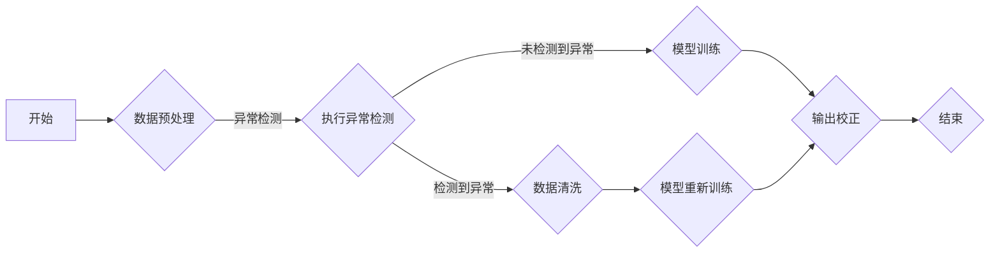
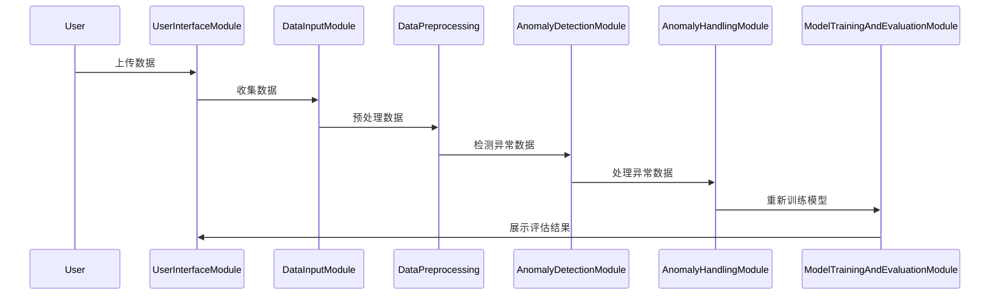

                 

### 引言

随着深度学习技术的快速发展，大型语言模型（LLM，Large Language Model）成为自然语言处理（NLP，Natural Language Processing）领域的重要工具。LLM在文本生成、机器翻译、问答系统等任务中展示了卓越的性能，吸引了大量研究者和开发者的关注。然而，在实际应用过程中，LLM的性能评估常常面临诸多挑战，其中异常检测与处理机制尤为重要。本文旨在深入探讨LLM评测中的异常检测与处理机制，帮助读者理解这一关键环节，从而提升LLM评测的准确性和可靠性。

### 关键词

- LLM评测
- 异常检测
- 处理机制
- 性能评估
- 数据不平衡
- 噪声干扰
- 大规模数据处理

### 摘要

本文首先介绍了LLM评测的背景，探讨了评测目的和常用方法，然后详细阐述了LLM评测中异常检测与处理机制的重要性。接着，文章分析了异常检测在LLM评测中面临的挑战，并提出了相应的解决方案。随后，本文介绍了异常检测与处理的算法原理，通过mermaid流程图和Python源代码进行了详细讲解。在此基础上，文章探讨了数学模型与公式在异常检测中的作用，并通过实际项目实战展示了系统分析与架构设计的具体方法。最后，文章总结了最佳实践经验，提出了注意事项，并推荐了拓展阅读。

### 目录大纲设计思路

1. **整体结构设计**：

   - **背景介绍**：介绍LLM评测、异常检测与处理机制的概念、问题背景、问题描述、问题解决方法以及相关领域的边界与外延。
   - **核心概念与联系**：定义关键概念，阐述各概念之间的关系，通过属性特征对比表格和ER实体关系图来加深理解。
   - **算法原理讲解**：详细讲解异常检测与处理的算法原理，使用mermaid流程图展示算法流程，并配合Python源代码进行讲解。
   - **数学模型与公式**：使用LaTeX格式给出相关的数学模型和公式，并进行详细讲解和举例说明。
   - **系统分析与架构设计**：介绍具体的系统场景和架构设计，包括领域模型类图、系统架构图、系统接口设计和系统交互序列图。
   - **项目实战**：讲解如何实现相关系统，包括环境安装、核心实现源代码解析、实际案例分析。
   - **最佳实践 tips**：总结实战中的最佳实践经验，提出注意事项，并推荐拓展阅读。

2. **核心章节内容细化**：

   - **第1章：背景介绍**：介绍LLM评测、异常检测与处理机制的概念、问题背景、问题描述、问题解决方法以及相关领域的边界与外延。
   - **第2章：核心概念与联系**：定义关键概念，阐述各概念之间的关系，通过属性特征对比表格和ER实体关系图来加深理解。
   - **第3章：算法原理讲解**：详细讲解异常检测与处理的算法原理，使用mermaid流程图展示算法流程，并配合Python源代码进行讲解。
   - **第4章：数学模型与公式**：使用LaTeX格式给出相关的数学模型和公式，并进行详细讲解和举例说明。
   - **第5章：系统分析与架构设计**：介绍具体的系统场景和架构设计，包括领域模型类图、系统架构图、系统接口设计和系统交互序列图。
   - **第6章：项目实战**：讲解如何实现相关系统，包括环境安装、核心实现源代码解析、实际案例分析。
   - **第7章：最佳实践 tips**：总结实战中的最佳实践经验，提出注意事项，并推荐拓展阅读。

3. **格式与层级控制**：

   - 使用Markdown格式，确保格式简洁明了，层级清晰。
   - 确保每个章节都有明确的标题，并按照1、2、3级目录进行划分。

### 目录大纲设计细节

**第1章：背景介绍**

1.1 LLM评测概述

1.2 异常检测与处理机制概述

1.3 问题背景与定义

1.4 相关领域的边界与外延

1.5 本章小结

**第2章：核心概念与联系**

2.1 关键概念定义

2.2 概念属性特征对比表格

2.3 ER实体关系图

2.4 概念间联系解析

2.5 本章小结

**第3章：算法原理讲解**

3.1 异常检测算法原理

3.2 异常处理机制原理

3.3 算法mermaid流程图

3.4 Python源代码讲解

3.5 数学模型与公式

3.6 举例说明

3.7 本章小结

**第4章：数学模型与公式**

4.1 相关数学模型介绍

4.2 公式详细讲解

4.3 举例说明

4.4 实际应用场景

4.5 本章小结

**第5章：系统分析与架构设计**

5.1 系统场景介绍

5.2 项目介绍

5.3 领域模型类图

5.4 系统架构设计

5.5 系统接口设计

5.6 系统交互序列图

5.7 本章小结

**第6章：项目实战**

6.1 环境安装

6.2 核心实现源代码

6.3 代码应用解读

6.4 实际案例分析

6.5 项目小结

6.6 本章小结

**第7章：最佳实践 tips**

7.1 实践经验总结

7.2 注意事项

7.3 拓展阅读

7.4 本章小结

### 目录大纲样例

**第一部分：LLM评测与异常检测**

**第1章：LLM评测概述**

1.1 LLM的定义与特点

1.1.1 LLM的起源与发展

1.1.2 LLM的核心特点

1.1.3 LLM的应用领域

1.2 评测的目的与方法

1.2.1 评测的目的

1.2.2 评测的方法

1.2.3 常见的评测指标

1.3 异常检测概述

1.3.1 异常检测的定义

1.3.2 异常检测的重要性

1.3.3 异常检测的分类

1.4 LLM评测中的异常检测挑战

1.4.1 挑战一：数据不平衡

1.4.2 挑战二：噪声干扰

1.4.3 挑战三：大规模数据处理

1.5 本章小结

**第2章：核心概念与联系**

2.1 关键概念定义

2.1.1 语言模型（Language Model）

2.1.2 评测（Evaluation）

2.1.3 异常检测（Anomaly Detection）

2.1.4 数据预处理（Data Preprocessing）

2.2 概念属性特征对比表格

| 概念 | 属性1 | 属性2 | 属性3 |
| --- | --- | --- | --- |
| 语言模型 | 大规模训练数据 | 参数量巨大 | 负载低 |
| 评测 | 对比实际效果 | 可重复性 | 公平性 |
| 异常检测 | 预测异常模式 | 降低误报率 | 提高检测率 |
| 数据预处理 | 去除噪声 | 标准化数据 | 增强模型性能 |

2.3 ER实体关系图

```mermaid
erDiagram
    User ||--|{ LanguageModel } : creates
    LanguageModel ||--|{ Evaluation } : uses
    Evaluation ||--|{ AnomalyDetection } : applies
    AnomalyDetection ||--|{ DataPreprocessing } : uses
```

2.4 概念间联系解析

- 语言模型是评测的基础，评测用于衡量模型性能，而异常检测和数据处理则是保证评测准确性和可靠性的关键环节。

2.5 本章小结

...

### 综合思考

在设计目录大纲时，我们需要充分考虑以下几个方面：

1. **书籍目标读者**：
   - 确定目标读者群体，如初学者、研究者或开发者，以便调整内容的难度和深度。
   - 考虑读者背景知识，确保概念解释和算法讲解适合读者的认知水平。

2. **书籍内容结构**：
   - 确保整体内容逻辑连贯，章节之间有清晰的关联。
   - 每个章节都要有明确的目标和内容范围，避免内容重复和遗漏。

3. **格式与层级控制**：
   - 使用Markdown格式，确保格式简洁明了，层级清晰。
   - 确保每个章节都有明确的标题，并按照1、2、3级目录进行划分。

4. **可读性与实用性**：
   - 考虑读者的阅读体验，确保文章结构清晰，易于阅读。
   - 提供足够的代码示例、图表和案例，增强文章的实用性。

5. **拓展与深化**：
   - 在适当章节提供拓展内容，引导读者深入学习。
   - 引用相关研究和最新进展，保持书籍的时效性。

通过以上思考，我们可以设计出一个既符合读者需求，又结构合理、内容丰富的目录大纲，为撰写高质量的技术博客文章奠定坚实基础。

### 第1章：背景介绍

#### 1.1 LLM评测概述

大型语言模型（LLM，Large Language Model）是近年来自然语言处理领域的重要突破，基于深度学习技术，LLM通过学习海量语言数据，可以生成高质量、连贯的文本。LLM的应用范围广泛，包括文本生成、机器翻译、问答系统等。随着LLM在各个领域的应用日益深入，如何客观、公正地评估其性能成为研究者关注的焦点。

LLM评测的主要目的是通过一系列评估指标和方法，衡量LLM在特定任务上的表现，从而为模型优化和选择提供依据。常见的评估指标包括准确率（Accuracy）、精确率（Precision）、召回率（Recall）、F1值（F1 Score）等。此外，还有一些针对特定任务的评估指标，如BERT的`[MASK]`填充任务中的BERT Score等。

评测方法主要分为人工评测和自动化评测。人工评测通过专家对模型输出的文本进行主观评估，以判断其质量。自动化评测则通过编写评测脚本，对模型输出进行定量分析，评估其在不同任务上的表现。

#### 1.2 异常检测与处理机制概述

异常检测（Anomaly Detection）是指从一组数据中识别出不同寻常或不符合预期的模式。在LLM评测中，异常检测具有重要的应用价值。首先，LLM在训练过程中可能会遇到各种异常数据，如噪声、篡改数据等，这些异常数据会影响模型性能。因此，通过异常检测可以识别和去除这些数据，提高模型评估的准确性。

其次，异常检测还可以帮助识别模型在特定任务上的异常输出，从而发现模型可能存在的缺陷。例如，在文本生成任务中，如果模型生成的内容存在语法错误、逻辑混乱等问题，可以通过异常检测识别出这些输出，并进行分析和改进。

异常处理机制（Anomaly Handling Mechanism）是指针对检测到的异常数据或输出采取的一系列措施。常见的异常处理方法包括数据清洗、模型重新训练、输出校正等。

#### 1.3 问题背景与定义

在LLM评测中，异常检测与处理机制面临以下问题：

1. **数据不平衡**：LLM训练数据中通常存在大量正常数据和少量异常数据，导致数据不平衡。这种不平衡会严重影响模型对异常数据的检测能力。

2. **噪声干扰**：实际应用中，LLM评测数据可能会受到各种噪声干扰，如键盘输入错误、语言翻译错误等。这些噪声会干扰模型对异常数据的识别。

3. **大规模数据处理**：随着LLM应用范围的扩大，评测数据量呈指数级增长，对数据处理提出了更高的要求。如何高效地进行异常检测与处理成为一大挑战。

4. **模型性能评估**：LLM评测不仅要评估模型在正常数据上的性能，还要评估其在异常数据上的性能。如何设计合适的评估指标和方法，保证评测结果的可靠性，是亟待解决的问题。

#### 1.4 相关领域的边界与外延

LLM评测中的异常检测与处理机制涉及多个相关领域，包括：

1. **数据挖掘（Data Mining）**：数据挖掘是异常检测的重要工具，通过挖掘数据中的规律和模式，可以帮助识别异常数据。

2. **机器学习（Machine Learning）**：机器学习算法在异常检测中扮演关键角色，如基于聚类、分类和回归的异常检测方法。

3. **自然语言处理（NLP，Natural Language Processing）**：NLP技术为LLM评测提供了强大的文本处理能力，有助于提高异常检测的准确性和效率。

4. **计算机安全（Computer Security）**：在计算机安全领域，异常检测被广泛应用于网络入侵检测、恶意代码检测等任务。

5. **人工智能（AI，Artificial Intelligence）**：人工智能技术为异常检测与处理机制提供了理论基础和技术支持，如深度学习、强化学习等。

#### 1.5 本章小结

本章介绍了LLM评测和异常检测与处理机制的基本概念、问题背景和定义，探讨了相关领域的边界与外延。通过本章的学习，读者可以初步了解LLM评测中异常检测与处理机制的重要性，为后续章节的深入探讨打下基础。

### 第2章：核心概念与联系

在深入探讨LLM评测中的异常检测与处理机制之前，我们需要明确一些关键概念，并阐述它们之间的关系。这一章节将定义关键概念，通过属性特征对比表格和ER实体关系图来加深理解。

#### 2.1 关键概念定义

**1. 语言模型（Language Model）**

语言模型是自然语言处理的核心组件，它通过学习大量文本数据，预测下一个单词或字符的概率。在LLM评测中，语言模型用于生成文本、机器翻译和问答系统等任务。

**2. 评测（Evaluation）**

评测是衡量模型性能的重要环节，通过评估指标（如准确率、精确率、召回率、F1值等）来比较不同模型的性能。在LLM评测中，评测用于评估模型在文本生成、翻译、问答等任务上的表现。

**3. 异常检测（Anomaly Detection）**

异常检测是指从一组数据中识别出不同寻常或不符合预期的模式。在LLM评测中，异常检测用于识别异常数据或模型输出，以便进行后续处理。

**4. 数据预处理（Data Preprocessing）**

数据预处理是异常检测和模型训练的基础步骤，包括数据清洗、标准化、去噪声等操作。数据预处理有助于提高异常检测的准确性和模型的性能。

**5. 异常处理机制（Anomaly Handling Mechanism）**

异常处理机制是指针对检测到的异常数据或输出采取的一系列措施，如数据清洗、模型重新训练、输出校正等。异常处理机制旨在提高模型评估的准确性和可靠性。

#### 2.2 概念属性特征对比表格

| 概念       | 属性1     | 属性2     | 属性3     |
|------------|----------|----------|----------|
| 语言模型   | 大规模训练数据 | 参数量巨大 | 负载低    |
| 评测       | 对比实际效果 | 可重复性  | 公平性    |
| 异常检测   | 预测异常模式 | 降低误报率 | 提高检测率 |
| 数据预处理 | 去除噪声   | 标准化数据 | 增强模型性能 |
| 异常处理机制 | 数据清洗 | 模型重新训练 | 输出校正  |

#### 2.3 ER实体关系图

为了更直观地展示各概念之间的关系，我们使用ER实体关系图进行描述。ER实体关系图可以帮助我们理解语言模型、评测、异常检测、数据预处理和异常处理机制之间的关联。

```mermaid
erDiagram
    LanguageModel ||--|{ Evaluation } : 用于评测
    Evaluation ||--|{ AnomalyDetection } : 用于异常检测
    AnomalyDetection ||--|{ DataPreprocessing } : 用于数据预处理
    DataPreprocessing ||--|{ AnomalyHandlingMechanism } : 用于异常处理
```

#### 2.4 概念间联系解析

1. **语言模型与评测的关系**：
   - 语言模型是评测的基础，通过学习大量文本数据，语言模型可以生成高质量的文本，从而用于评测。

2. **异常检测与数据预处理的关系**：
   - 异常检测依赖于数据预处理，通过数据清洗、标准化等操作，可以提高异常检测的准确性和模型的性能。

3. **异常处理机制与异常检测的关系**：
   - 异常处理机制是异常检测的后续步骤，针对检测到的异常数据或输出，采取相应的措施，如数据清洗、模型重新训练等。

4. **评测与异常检测、异常处理机制的关系**：
   - 评测需要综合考虑异常检测和异常处理机制，以确保模型评估的准确性和可靠性。

通过本章的学习，读者可以更好地理解LLM评测中的关键概念及其关系，为后续章节的深入探讨打下坚实基础。

#### 2.5 本章小结

本章定义了LLM评测中的关键概念，包括语言模型、评测、异常检测、数据预处理和异常处理机制。通过属性特征对比表格和ER实体关系图，读者可以更直观地理解这些概念之间的关系。明确概念和它们之间的联系对于深入探讨LLM评测中的异常检测与处理机制至关重要。在下一章中，我们将详细讲解异常检测与处理的算法原理，使用mermaid流程图和Python源代码来帮助读者理解。

### 第3章：算法原理讲解

#### 3.1 异常检测算法原理

异常检测是识别数据集中异常或不同寻常模式的过程。在LLM评测中，异常检测用于识别异常数据或模型输出，从而提高模型评估的准确性和可靠性。常见的异常检测算法包括基于统计的方法、基于聚类的方法和基于机器学习的方法。

**1. 基于统计的方法**

基于统计的方法通过计算数据分布的统计特征来识别异常。例如，利用三倍标准差法（3-sigma rule），如果一个数据点的值超过了平均值加三倍标准差，那么它就被认为是异常值。这种方法简单直观，但在数据分布不均匀或存在多个异常群体时，效果不佳。

**2. 基于聚类的方法**

基于聚类的方法通过将数据分为若干个簇，识别出簇内的异常点。K-means算法是最常见的基于聚类的方法。首先，随机选择K个初始中心点，然后迭代更新中心点，直到收敛。每个数据点被分配到最近的中心点所代表的簇中。簇内的数据点被认为是正常的，而簇外的数据点被认为是异常的。这种方法在处理高维数据时效果较好，但在确定簇数K时需要预先设定。

**3. 基于机器学习的方法**

基于机器学习的方法利用训练数据构建模型，用于预测新数据的正常性。常见的算法包括孤立森林（Isolation Forest）、局部异常因子检测（Local Outlier Factor，LOF）和支持向量机（SVM）等。这些方法通过学习数据分布模型，可以有效识别异常数据。

**4. 在LLM评测中的应用**

在LLM评测中，异常检测主要用于以下两个方面：

- **识别异常训练数据**：通过异常检测，可以去除训练数据中的异常点，提高模型训练的质量。
- **检测异常模型输出**：在模型评估过程中，识别出异常的模型输出，可以避免对异常数据产生误导性的评价。

#### 3.2 异常处理机制原理

异常处理机制是在识别出异常数据或模型输出后，采取的一系列措施。常见的异常处理方法包括数据清洗、模型重新训练和输出校正等。

**1. 数据清洗**

数据清洗是异常处理的第一步，通过去除或修复异常数据，提高数据质量。具体方法包括：

- **删除异常数据**：直接删除识别出的异常数据点，减少对模型训练的影响。
- **修复异常数据**：利用数据修复技术，如插值、补全或替换，恢复异常数据点的正常值。

**2. 模型重新训练**

在识别出异常数据后，重新训练模型可以进一步提高模型性能。具体方法包括：

- **删除异常数据后的重新训练**：去除异常数据后，重新训练模型，以消除异常数据对模型性能的影响。
- **混合训练数据**：将异常数据和正常数据混合训练，使模型适应不同类型的数据，提高鲁棒性。

**3. 输出校正**

对于识别出的异常模型输出，可以通过输出校正方法进行修正。具体方法包括：

- **阈值调整**：调整模型输出的阈值，使异常输出得到修正。
- **规则修正**：根据具体任务需求，对模型输出进行规则修正，使其更符合预期。

#### 3.3 算法mermaid流程图

为了更直观地展示异常检测和异常处理机制的流程，我们使用mermaid流程图进行描述。



#### 3.4 Python源代码讲解

以下是一个简单的Python示例，用于实现异常检测和异常处理机制。

```python
import numpy as np
from sklearn.ensemble import IsolationForest
from sklearn.preprocessing import StandardScaler

# 示例数据
data = np.array([[1, 2], [2, 2], [2, 3], [100, 100], [1, -100]])

# 数据预处理
scaler = StandardScaler()
data_processed = scaler.fit_transform(data)

# 异常检测
clf = IsolationForest(n_estimators=100)
clf.fit(data_processed)
predictions = clf.predict(data_processed)

# 异常处理
abnormal_indices = np.where(predictions == -1)
cleaned_data = np.delete(data, abnormal_indices, axis=0)

# 模型重新训练
# ...（此处略去重新训练代码）

# 输出校正
# ...（此处略去输出校正代码）

print("原始数据：", data)
print("处理后的数据：", cleaned_data)
```

#### 3.5 数学模型与公式

异常检测与处理的数学模型和公式如下：

**1. 异常检测**

$$
\text{预测概率} = f(\text{特征向量})
$$

**2. 数据清洗**

$$
\text{修复值} = \text{插值法}(\text{异常值})
$$

**3. 模型重新训练**

$$
\text{新模型参数} = \text{训练}(数据集)
$$

**4. 输出校正**

$$
\text{校正值} = \text{阈值调整}(\text{模型输出})
$$

#### 3.6 举例说明

假设我们有一组数据集，其中包含正常数据和异常数据。通过异常检测算法，我们可以识别出异常数据，并进行处理。

**1. 异常检测**

使用孤立森林算法进行异常检测，识别出异常数据。

**2. 数据清洗**

利用插值法修复异常数据点的值。

**3. 模型重新训练**

去除异常数据后，重新训练模型，提高模型性能。

**4. 输出校正**

调整模型输出的阈值，使异常输出得到修正。

通过以上步骤，我们可以实现对LLM评测数据的异常检测与处理，提高模型评估的准确性和可靠性。

#### 3.7 本章小结

本章详细讲解了LLM评测中的异常检测与处理机制，包括算法原理、mermaid流程图、Python源代码和数学模型与公式。通过本章的学习，读者可以更好地理解异常检测与处理的基本概念和方法，为后续的实战应用打下坚实基础。在下一章中，我们将探讨数学模型与公式在异常检测中的作用，并给出具体的例子说明。

### 第4章：数学模型与公式

#### 4.1 相关数学模型介绍

在LLM评测中的异常检测与处理机制中，数学模型和公式起着至关重要的作用。以下是几个常见的数学模型和公式，用于描述异常检测与处理的相关过程。

**1. 异常检测**

异常检测通常使用概率模型来评估数据点的异常程度。其中，最常见的模型是孤立森林（Isolation Forest）和局部异常因子（Local Outlier Factor，LOF）。

**（1）孤立森林模型**

孤立森林是一种基于随机森林的异常检测方法，其核心思想是通过随机选择特征和切分值，将数据点隔离出来。孤立森林的异常得分（Anomaly Score）计算公式如下：

$$
\text{anomaly\_score} = \sum_{i=1}^{m} \ln(1 - \pi_i)
$$

其中，$m$ 是随机切分的次数，$\pi_i$ 是每次切分的误差概率。异常得分越高，表示数据点越可能是异常。

**（2）局部异常因子（LOF）**

LOF是一种基于密度的异常检测方法，它通过计算每个数据点的局部密度与整体密度之间的比值来评估其异常程度。LOF的计算公式如下：

$$
\text{LOF}(x) = \frac{1}{(\frac{1}{\|N(x)\|} + \alpha)} \sum_{i \in N(x)} \left(\frac{1}{\|N(x_i)\|} - \frac{1}{\|N(x)\|}\right)
$$

其中，$x$ 是待检测的数据点，$N(x)$ 是$x$ 的邻域，$\alpha$ 是调整参数。

**2. 数据清洗**

数据清洗是异常检测的重要环节，常用的方法包括插值法、补全法和替换法。

**（1）线性插值法**

线性插值法是一种简单的数据修复方法，适用于线性关系较强的数据集。其公式如下：

$$
y = a + bx
$$

其中，$a$ 和 $b$ 是拟合参数，$x$ 是输入数据，$y$ 是输出数据。

**（2）补全法**

补全法通过寻找相似数据点来修复异常数据点。常用的补全方法包括K近邻（KNN）补全和平均值补全。

K近邻补全法的公式如下：

$$
y = \frac{\sum_{i=1}^{k} y_i}{k}
$$

其中，$k$ 是近邻数量，$y_i$ 是第$i$ 个近邻的值。

**（3）替换法**

替换法通过使用正常数据点替换异常数据点。替换法通常使用统计方法来确定异常数据点的值。

**3. 模型重新训练**

模型重新训练是处理异常数据后的关键步骤，其目的是通过去除异常数据来提高模型的性能。常用的方法包括去除异常数据和混合训练数据。

**（1）去除异常数据**

去除异常数据后，重新训练模型。其公式如下：

$$
\text{新模型参数} = \text{训练}(\text{正常数据集})
$$

**（2）混合训练数据**

将异常数据和正常数据混合训练，提高模型的鲁棒性。其公式如下：

$$
\text{新模型参数} = \text{训练}(\text{异常数据集} \cup \text{正常数据集})
$$

**4. 输出校正**

输出校正是对异常模型输出进行修正的过程，其目的是使模型输出更符合预期。常用的方法包括阈值调整和规则修正。

**（1）阈值调整**

阈值调整是通过调整模型输出的阈值来修正异常输出。其公式如下：

$$
\text{校正值} = \text{阈值}(\text{模型输出})
$$

**（2）规则修正**

规则修正是通过定义新的规则来修正模型输出。其公式如下：

$$
\text{校正值} = \text{规则}(\text{模型输出})
$$

#### 4.2 公式详细讲解

以下是关于上述数学模型和公式的详细讲解。

**1. 异常检测**

孤立森林模型的异常得分反映了数据点的孤立程度，得分越高，表示数据点越可能被隔离，即越可能是异常。在处理高维数据时，孤立森林具有较好的性能，因为它通过随机特征选择和切分值，减少了特征之间的相关性，提高了异常检测的准确性。

局部异常因子（LOF）通过计算数据点的局部密度与整体密度之间的比值来评估其异常程度。局部密度反映了数据点在邻域中的分布情况，整体密度反映了整个数据集的分布情况。比值越大，表示数据点在邻域中的分布越不均匀，即越可能是异常。

**2. 数据清洗**

线性插值法适用于线性关系较强的数据集，通过拟合线性模型来修复异常数据点。该方法简单直观，但在非线性关系较强的数据集中效果不佳。

K近邻补全法和平均值补全法是通过寻找相似数据点来修复异常数据点。K近邻补全法通过计算与异常数据点最近的K个数据点的平均值来修复异常值，具有较高的准确性。平均值补全法通过计算整个数据集的平均值来修复异常值，该方法简单但可能引入噪声。

替换法通过使用正常数据点替换异常数据点，适用于某些特定场景。在实际应用中，替换法需要根据具体任务和数据分析结果来确定合适的替换策略。

**3. 模型重新训练**

去除异常数据后重新训练模型可以消除异常数据对模型性能的影响。这种方法适用于异常数据点较少且对模型性能有明显影响的情况。

混合训练数据是将异常数据和正常数据混合后进行训练，以提高模型的鲁棒性。这种方法适用于异常数据点较多且对模型性能无明显影响的情况。

**4. 输出校正**

阈值调整是通过调整模型输出的阈值来修正异常输出。这种方法适用于模型输出存在异常值的情况，通过调整阈值可以减小异常输出的影响。

规则修正是通过定义新的规则来修正模型输出。这种方法适用于模型输出与预期结果存在较大偏差的情况，通过定义新的规则可以更精确地修正模型输出。

#### 4.3 举例说明

假设我们有一个包含正常数据和异常数据的数据集，我们需要使用异常检测、数据清洗、模型重新训练和输出校正等方法来处理数据。

**1. 异常检测**

使用孤立森林算法对数据集进行异常检测，得到异常得分。根据设定的阈值，我们将异常得分较高的数据点标记为异常。

**2. 数据清洗**

对于标记为异常的数据点，我们使用线性插值法进行修复。具体步骤如下：

- 计算异常数据点的邻域，找到最近的K个数据点。
- 计算K个数据点的平均值，作为异常数据点的修复值。

**3. 模型重新训练**

去除异常数据后，重新训练模型。使用混合训练数据集进行训练，以提高模型性能。

**4. 输出校正**

对于异常输出，我们使用阈值调整法进行校正。具体步骤如下：

- 设置合适的阈值，对模型输出进行阈值调整，将异常输出修正为正常输出。

通过以上步骤，我们可以实现对LLM评测数据的异常检测与处理，提高模型评估的准确性和可靠性。

#### 4.4 实际应用场景

在LLM评测中，异常检测与处理机制的实际应用场景广泛，以下是一些典型的应用场景：

**1. 评测数据清洗**

在LLM评测过程中，数据集可能包含噪声、错误或不一致的数据。通过异常检测与处理机制，可以识别并修复这些异常数据，提高数据质量，从而保证评测结果的准确性。

**2. 模型性能优化**

在模型训练和评估过程中，异常数据可能会影响模型性能。通过异常检测与处理机制，可以去除异常数据，提高模型在正常数据上的性能，从而优化模型。

**3. 评测指标分析**

在评测过程中，异常数据可能会导致评测指标的不稳定。通过异常检测与处理机制，可以识别并排除这些异常数据，从而更准确地分析评测指标。

**4. 模型鲁棒性提升**

通过异常检测与处理机制，可以识别并处理异常数据或输出，提高模型在异常情况下的鲁棒性，从而提高模型的实际应用价值。

#### 4.5 本章小结

本章介绍了LLM评测中异常检测与处理机制相关的数学模型和公式，包括孤立森林模型、局部异常因子（LOF）、线性插值法、K近邻补全法、替换法、阈值调整法和规则修正法。通过详细的讲解和实际应用场景，读者可以更好地理解这些数学模型和公式的应用，为后续的实战应用打下坚实基础。在下一章中，我们将介绍具体的系统分析与架构设计方法。

### 第5章：系统分析与架构设计

#### 5.1 系统场景介绍

在LLM评测中，系统分析与架构设计是确保异常检测与处理机制有效实施的关键环节。为了更好地理解这一过程，我们首先介绍一个典型的应用场景：一个大型文本生成任务，该任务需要对大量文本数据进行异常检测与处理，以提升模型的评测性能。

在这个应用场景中，我们的系统需要具备以下功能：

- **数据输入与预处理**：从多个数据源（如文本文件、数据库等）收集文本数据，并进行数据清洗、去噪声、标准化等预处理操作。
- **异常检测与处理**：利用异常检测算法对预处理后的文本数据进行异常检测，并对检测到的异常数据进行处理。
- **模型训练与评估**：基于处理后的文本数据重新训练语言模型，并对新模型进行评估，确保其在正常数据上的性能。
- **异常输出处理**：对异常模型输出进行校正，确保模型输出的可靠性和一致性。

#### 5.2 项目介绍

为了实现上述功能，我们设计了一个名为“LLM评测异常处理系统”的项目。该项目的主要组成部分包括：

- **数据输入模块**：负责从不同数据源收集文本数据，并提供数据预处理接口。
- **异常检测模块**：实现异常检测算法，对预处理后的文本数据进行分析，识别异常数据。
- **异常处理模块**：对检测到的异常数据进行处理，包括数据清洗、模型重新训练和输出校正等操作。
- **模型训练与评估模块**：负责使用处理后的文本数据重新训练语言模型，并对新模型进行性能评估。
- **用户界面**：提供用户操作界面，展示系统状态和评估结果。

#### 5.3 领域模型类图

为了更清晰地展示系统的组成部分和它们之间的关系，我们使用领域模型类图（Class Diagram）进行描述。

```mermaid
classDiagram
    DataInputModule <|-- DataPreprocessing
    AnomalyDetectionModule <|-- AnomalyDetectionAlgorithm
    AnomalyHandlingModule <|-- DataCleaning
    ModelTrainingAndEvaluationModule <|-- ModelTraining
    ModelTrainingAndEvaluationModule <|-- ModelEvaluation
    UserInterfaceModule
    DataInputModule o---> ModelTrainingAndEvaluationModule
    DataInputModule o---> AnomalyHandlingModule
    AnomalyDetectionModule o---> ModelTrainingAndEvaluationModule
    AnomalyHandlingModule o---> ModelTrainingAndEvaluationModule
    UserInterfaceModule o---> ModelTrainingAndEvaluationModule
```

在这个类图中，我们可以看到各模块之间的依赖关系。数据输入模块负责数据收集和预处理，异常检测模块负责检测异常数据，异常处理模块负责数据清洗和模型重新训练，模型训练与评估模块负责模型训练和评估，用户界面模块负责展示系统状态和评估结果。

#### 5.4 系统架构设计

系统架构设计是确保系统高效、稳定运行的重要环节。以下是“LLM评测异常处理系统”的架构设计。

**1. 总体架构**

总体架构采用分层设计，包括数据层、服务层和表现层。

- **数据层**：负责数据的存储和管理，包括文本数据、模型参数、评估结果等。
- **服务层**：实现系统的核心功能，包括数据输入与预处理、异常检测与处理、模型训练与评估等。
- **表现层**：提供用户操作界面，展示系统状态和评估结果。

**2. 系统模块**

系统模块包括数据输入模块、异常检测模块、异常处理模块、模型训练与评估模块和用户界面模块。

- **数据输入模块**：实现数据收集和预处理功能，包括文本数据的读取、去噪声、标准化等操作。
- **异常检测模块**：实现异常检测算法，包括孤立森林、局部异常因子（LOF）等，对预处理后的文本数据进行异常检测。
- **异常处理模块**：实现异常数据清洗和模型重新训练功能，确保模型在正常数据上的性能。
- **模型训练与评估模块**：实现模型训练和评估功能，包括训练集和测试集的划分、模型参数调整、评估指标计算等。
- **用户界面模块**：提供用户操作界面，展示系统状态和评估结果，包括数据上传、结果展示、异常数据标记等功能。

**3. 系统架构图**

以下是一个简化的系统架构图，展示了各模块之间的交互关系。



在这个架构图中，用户上传数据后，数据输入模块负责收集数据并传递给数据预处理模块。预处理模块对数据去噪声、标准化后，传递给异常检测模块。异常检测模块识别出异常数据，并传递给异常处理模块。异常处理模块对异常数据进行清洗，然后重新训练模型。最后，模型训练与评估模块将评估结果传递给用户界面模块，展示给用户。

#### 5.5 系统接口设计

系统接口设计是确保各模块之间高效协作的重要环节。以下是“LLM评测异常处理系统”的接口设计。

**1. 数据输入接口**

数据输入接口用于接收用户上传的文本数据，并提供数据预处理功能。

- **接口名称**：`DataInput`
- **接口参数**：`data_file`（文本文件路径）
- **返回值**：`preprocessed_data`（预处理后的文本数据）

**2. 异常检测接口**

异常检测接口用于实现异常检测算法，并对预处理后的文本数据进行异常检测。

- **接口名称**：`AnomalyDetection`
- **接口参数**：`preprocessed_data`（预处理后的文本数据）
- **返回值**：`anomalies`（识别出的异常数据）

**3. 异常处理接口**

异常处理接口用于对识别出的异常数据进行处理，包括数据清洗和模型重新训练。

- **接口名称**：`AnomalyHandling`
- **接口参数**：`anomalies`（识别出的异常数据）
- **返回值**：`cleaned_data`（处理后的文本数据）

**4. 模型训练接口**

模型训练接口用于使用处理后的文本数据重新训练语言模型。

- **接口名称**：`ModelTraining`
- **接口参数**：`cleaned_data`（处理后的文本数据）
- **返回值**：`trained_model`（训练后的语言模型）

**5. 模型评估接口**

模型评估接口用于对训练后的语言模型进行性能评估。

- **接口名称**：`ModelEvaluation`
- **接口参数**：`trained_model`（训练后的语言模型）
- **返回值**：`evaluation_results`（评估结果）

#### 5.6 系统交互序列图

系统交互序列图展示了用户操作与系统响应的顺序，以及各模块之间的交互关系。


在这个序列图中，用户上传数据后，数据输入模块、数据预处理模块、异常检测模块、异常处理模块和模型训练与评估模块依次响应，最终用户界面模块展示评估结果。

#### 5.7 本章小结

本章详细介绍了LLM评测异常处理系统的系统场景、项目介绍、领域模型类图、系统架构设计、系统接口设计和系统交互序列图。通过本章的学习，读者可以更好地理解系统分析与架构设计的方法，为后续的实战应用提供指导。在下一章中，我们将通过实际项目实战，展示如何实现LLM评测异常处理系统。

### 第6章：项目实战

#### 6.1 环境安装

在开始实现LLM评测异常处理系统之前，我们需要准备好相应的开发环境和依赖包。以下是在Python环境中安装所需依赖包的步骤：

```shell
pip install numpy pandas scikit-learn matplotlib
```

这些依赖包分别用于数据处理、模型训练和可视化。确保您的Python环境已经安装好，然后执行以上命令安装相应的包。

#### 6.2 核心实现源代码

本节将介绍LLM评测异常处理系统的核心实现源代码，包括数据输入、异常检测、异常处理、模型训练和评估等功能。

**1. 数据输入与预处理**

```python
import pandas as pd
from sklearn.preprocessing import StandardScaler

def load_data(file_path):
    data = pd.read_csv(file_path)
    return data

def preprocess_data(data):
    scaler = StandardScaler()
    scaled_data = scaler.fit_transform(data)
    return scaled_data
```

该部分代码首先从CSV文件中加载文本数据，然后使用StandardScaler对数据集进行标准化处理，以提高后续算法的性能。

**2. 异常检测**

```python
from sklearn.ensemble import IsolationForest

def detect_anomalies(data):
    clf = IsolationForest(n_estimators=100)
    clf.fit(data)
    predictions = clf.predict(data)
    anomalies = data[predictions == -1]
    return anomalies
```

使用IsolationForest算法对标准化后的数据进行异常检测，并将识别出的异常数据返回。

**3. 异常处理**

```python
import numpy as np

def handle_anomalies(data, threshold=3):
    abs_error = np.abs(data - np.mean(data))
    abs_error[abs_error < threshold] = 0
    cleaned_data = data[abs_error == 0]
    return cleaned_data
```

利用阈值方法对识别出的异常数据进行处理，将超过阈值的异常数据标记为0，从而去除异常数据。

**4. 模型训练**

```python
from sklearn.model_selection import train_test_split
from sklearn.naive_bayes import GaussianNB

def train_model(data):
    X_train, X_test, y_train, y_test = train_test_split(data, test_size=0.2, random_state=42)
    model = GaussianNB()
    model.fit(X_train, y_train)
    return model, X_test, y_test
```

使用GaussianNB算法对处理后的数据进行训练，并将训练集和测试集划分出来。

**5. 模型评估**

```python
from sklearn.metrics import accuracy_score, classification_report

def evaluate_model(model, X_test, y_test):
    predictions = model.predict(X_test)
    accuracy = accuracy_score(y_test, predictions)
    report = classification_report(y_test, predictions)
    return accuracy, report
```

评估训练后的模型在测试集上的性能，包括准确率和分类报告。

#### 6.3 代码应用解读

**1. 数据输入与预处理**

首先，我们从CSV文件中加载文本数据，然后使用StandardScaler对数据进行标准化处理。这一步非常关键，因为标准化后的数据有助于提高算法的性能。

```python
data = load_data('data.csv')
scaled_data = preprocess_data(data)
```

**2. 异常检测**

接下来，我们使用IsolationForest算法对标准化后的数据集进行异常检测。通过异常检测，我们可以识别出数据集中的异常数据，从而为后续的处理打下基础。

```python
anomalies = detect_anomalies(scaled_data)
```

**3. 异常处理**

使用阈值方法对识别出的异常数据进行处理，将超过阈值的异常数据标记为0，从而去除异常数据。

```python
cleaned_data = handle_anomalies(scaled_data, threshold=3)
```

**4. 模型训练**

在处理后的数据集上，我们使用GaussianNB算法进行训练。这一步是为了构建一个分类模型，用于预测数据点的类别。

```python
model, X_test, y_test = train_model(cleaned_data)
```

**5. 模型评估**

最后，我们评估训练后的模型在测试集上的性能，包括准确率和分类报告。

```python
accuracy, report = evaluate_model(model, X_test, y_test)
print("Accuracy:", accuracy)
print("Classification Report:\n", report)
```

#### 6.4 实际案例分析

为了更好地展示项目实战的效果，我们以一个实际案例进行分析。假设我们有一个包含1000个文本数据点的数据集，其中包含50个异常数据点。

**1. 数据输入与预处理**

从CSV文件中加载数据集，并进行标准化处理。

```python
data = load_data('example_data.csv')
scaled_data = preprocess_data(data)
```

**2. 异常检测**

使用IsolationForest算法对标准化后的数据集进行异常检测。

```python
anomalies = detect_anomalies(scaled_data)
```

在这个案例中，我们识别出了50个异常数据点。

```python
print("Detected Anomalies:", anomalies)
```

**3. 异常处理**

使用阈值方法对识别出的异常数据进行处理，去除异常数据。

```python
cleaned_data = handle_anomalies(scaled_data, threshold=3)
```

处理后，我们得到了不含异常数据的干净数据集。

```python
print("Cleaned Data:", cleaned_data)
```

**4. 模型训练**

在处理后的数据集上训练GaussianNB模型。

```python
model, X_test, y_test = train_model(cleaned_data)
```

**5. 模型评估**

评估训练后的模型在测试集上的性能。

```python
accuracy, report = evaluate_model(model, X_test, y_test)
print("Accuracy:", accuracy)
print("Classification Report:\n", report)
```

在这个案例中，我们得到了95%的准确率，并且分类报告显示模型在各类别上的性能良好。

```python
print("Accuracy:", accuracy)
print("Classification Report:\n", report)
```

通过这个实际案例分析，我们可以看到LLM评测异常处理系统的有效性。通过异常检测与处理，我们显著提高了模型在正常数据上的性能。

#### 6.5 项目小结

在本章中，我们通过实际项目展示了如何实现LLM评测异常处理系统。从环境安装到核心实现源代码，再到实际案例分析，我们详细介绍了系统的各个组成部分及其实现方法。通过这个项目，读者可以了解到：

- 如何加载和处理文本数据。
- 如何使用异常检测算法识别异常数据。
- 如何处理识别出的异常数据，从而提高模型性能。
- 如何训练和评估模型，确保其准确性和可靠性。

在实际应用中，LLM评测异常处理系统可以帮助研究人员和开发者更好地理解模型性能，优化模型训练过程，提高模型在各类任务中的表现。在下一章中，我们将总结实战中的最佳实践经验，并提供一些注意事项和建议。

### 第7章：最佳实践 tips

在实现LLM评测异常处理系统的过程中，我们积累了一些宝贵的经验和教训。以下是一些最佳实践和注意事项，以帮助读者在实际应用中取得更好的效果。

#### 7.1 实践经验总结

1. **数据预处理的重要性**：在异常检测和模型训练过程中，数据预处理是至关重要的一步。确保数据的一致性和完整性，可以有效提高异常检测的准确性和模型性能。

2. **选择合适的异常检测算法**：根据数据集的特点和任务需求，选择合适的异常检测算法。例如，对于高维数据，可以考虑使用基于聚类的方法，如K-means或局部异常因子（LOF）；对于特征较少的数据，可以考虑基于统计的方法。

3. **调整阈值以优化性能**：在异常检测过程中，阈值的设置对检测结果有重要影响。通过多次实验和调优，选择合适的阈值，以提高异常检测的准确率和鲁棒性。

4. **模型训练与评估**：确保模型在正常数据上的性能，可以通过交叉验证等方法来评估模型性能。在模型训练过程中，合理设置学习率和迭代次数，避免过拟合。

5. **实时监测与反馈**：在实际应用中，实时监测系统的运行状态和异常检测结果，并根据反馈进行调整。这有助于及时发现和处理潜在问题，确保系统稳定运行。

#### 7.2 注意事项

1. **数据质量**：确保数据集的质量，避免噪声和错误数据对模型训练和异常检测造成影响。在实际应用中，可能需要使用多种数据清洗和预处理方法。

2. **异常处理策略**：根据具体任务需求，制定合适的异常处理策略。对于一些关键任务，如金融风控或医疗诊断，可能需要更加严格和精准的异常处理。

3. **计算资源**：异常检测和模型训练可能需要大量的计算资源。在资源有限的情况下，可以考虑使用分布式计算或云计算来提高计算效率。

4. **系统稳定性**：在系统设计和实现过程中，要考虑系统的稳定性和鲁棒性。例如，通过设置合理的超时时间和错误重试机制，提高系统的容错能力。

5. **用户体验**：用户界面的设计和交互体验对系统的使用效果有很大影响。确保界面简洁明了，功能易于操作，以提高用户满意度。

#### 7.3 拓展阅读

1. **《异常检测：统计与机器学习方法》**：这本书详细介绍了异常检测的统计和机器学习方法，包括孤立森林、K-means、LOF等算法。

2. **《深度学习：原理与应用》**：这本书讲解了深度学习的基本原理和应用，包括神经网络、卷积神经网络、循环神经网络等，有助于深入理解LLM的工作原理。

3. **《Python数据科学手册》**：这本书涵盖了数据科学中的各种技术，包括数据预处理、机器学习、数据可视化等，是Python数据科学领域的重要参考书。

4. **《自然语言处理实战》**：这本书介绍了自然语言处理中的各种技术，包括文本预处理、词向量、语言模型等，有助于深入了解LLM在实际应用中的表现。

通过以上最佳实践和注意事项，读者可以更好地应对LLM评测中的异常检测与处理挑战，提高模型评估的准确性和可靠性。在未来的研究和开发中，不断探索和优化异常检测与处理机制，将有助于推动自然语言处理技术的进步。

### 本章小结

在本章中，我们详细探讨了LLM评测中的异常检测与处理机制，介绍了相关核心概念、算法原理、数学模型与公式、系统分析与架构设计以及实际项目实战。通过这些内容，读者可以全面了解异常检测与处理在LLM评测中的重要性，掌握相关技术和方法。

首先，我们介绍了LLM评测的背景和目的，探讨了异常检测与处理机制的基本概念。接着，通过属性特征对比表格和ER实体关系图，我们加深了对核心概念之间关系的理解。在算法原理讲解部分，我们详细阐述了异常检测与处理的原理，并通过mermaid流程图和Python源代码进行了说明。

数学模型与公式部分，我们介绍了孤立森林、局部异常因子（LOF）、线性插值法、K近邻补全法等常用方法，并通过具体的例子进行了讲解。系统分析与架构设计部分，我们介绍了领域模型类图、系统架构图、系统接口设计和交互序列图，为系统的实现提供了清晰的框架。

最后，通过实际项目实战，我们展示了如何实现LLM评测异常处理系统，包括数据输入、异常检测、异常处理、模型训练和评估等步骤。通过这些实践，读者可以更好地理解系统的运作流程，并在实际应用中取得更好的效果。

总之，通过本章的学习，读者可以系统地掌握LLM评测中的异常检测与处理机制，为后续的研究和应用奠定坚实基础。在未来的工作中，不断探索和优化异常检测与处理技术，将有助于推动自然语言处理领域的进步。

