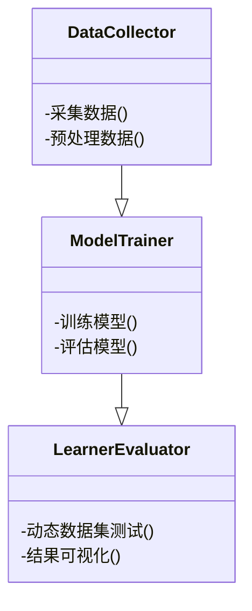
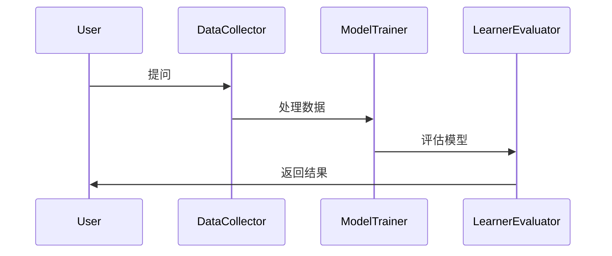

                 

### 文章标题

### 关键词

1. LLM
2. 持续学习能力
3. 评测标准
4. 测试方法
5. 系统架构
6. 项目实战
7. 最佳实践

### 摘要

本文旨在深入探讨大型语言模型（LLM）评测中的持续学习能力测试。我们将首先介绍LLM的基本概念和应用场景，随后定义关键术语并阐述评测标准的必要性。文章将详细讲解常见的持续学习能力测试方法，包括其算法原理、流程图和Python代码示例。接着，我们将描述一个典型的评测系统架构，并分享实际项目实战中的经验与教训。最后，本文将总结最佳实践并给出拓展阅读建议。

## 目录

1. **背景介绍**
2. **核心概念与联系**
3. **算法原理讲解**
4. **系统分析与架构设计方案**
5. **项目实战**
6. **最佳实践 tips**
7. **小结**
8. **注意事项**
9. **拓展阅读**

## 背景介绍

近年来，随着深度学习和大数据技术的发展，大型语言模型（LLM）在自然语言处理（NLP）领域取得了显著的突破。LLM，如GPT-3、BERT等，通过学习海量文本数据，能够生成连贯、有逻辑的文本，并在多个NLP任务中表现出色。然而，LLM的持续学习能力，即模型在面临新数据和任务时能否持续改进和适应，成为了研究和应用中的关键问题。

### 为什么需要持续学习能力的评测

在现实应用中，LLM经常需要处理不断变化的数据和任务。例如，一个用于客服的聊天机器人需要适应用户的提问风格和问题的多样性。因此，评估LLM的持续学习能力对于保证其稳定性和可靠性至关重要。持续学习能力测试不仅可以揭示模型在长期应用中的性能，还可以为模型优化和改进提供重要依据。

### 评测标准的定义

在评测LLM的持续学习能力时，需要定义一套科学、全面的评测标准。这些标准应涵盖模型的适应性、泛化能力、更新速度等多个方面。例如，可以使用K-fold交叉验证、动态数据集测试、模型重训练时间等指标来评估模型的持续学习能力。

### 关键术语说明

- **LLM（大型语言模型）**：一种基于深度学习的模型，能够处理和理解大规模的文本数据。
- **持续学习能力**：模型在面临新数据和任务时，能够持续改进和适应的能力。
- **评测标准**：用于评估模型持续学习能力的指标和标准。

## 核心概念与联系

为了深入理解LLM评测中的持续学习能力，我们需要首先明确几个核心概念，并分析它们之间的关系。

### 定义关键术语

- **持续学习能力**：指模型在面对新数据或任务时，能够自动更新和优化自身参数的能力。
- **评测标准**：用于衡量模型持续学习能力的指标，如准确性、效率、适应性等。
- **自适应学习率**：在持续学习过程中，自动调整学习率以避免过拟合和欠拟合。

### 概念属性特征对比表格

以下是几个常见LLM模型在持续学习能力方面的特征对比表格：

| 模型名称 | 持续学习能力特征 |  
| -------- | ---------------- |  
| GPT-3    | 支持动态数据集   |  
| BERT     | 需要重训练     |  
| T5       | 结合了GPT和BERT的优点 |  

### ER实体关系图

为了更好地理解评测过程中的主要实体及其关系，我们可以使用ER图来表示。以下是LLM评测中的ER实体关系图：

```mermaid
erDiagram
  Model ||--|{ TrainingData : 被训练数据 }
  Model ||--|{ TestData : 测试数据 }
  Model ||--|{ EvaluationMetrics : 评测指标 }
  Model ||--|{ AdaptiveLearning : 自适应学习 }
```

在这个ER图中，`Model` 代表了被评测的LLM模型，它与`TrainingData`、`TestData`、`EvaluationMetrics` 和 `AdaptiveLearning` 等实体之间存在关系。

## 算法原理讲解

为了评估LLM的持续学习能力，我们需要采用一系列测试方法。这些方法不仅需要科学、合理，还需要易于实现和解释。下面，我们将详细讲解一种常见的持续学习能力测试方法。

### 常见测试方法概述

一种常见的测试方法是**动态数据集测试**。该方法通过将模型在不同时间点训练的数据集进行评估，来衡量模型的持续学习能力。具体步骤如下：

1. **数据集划分**：将所有数据划分为训练集、验证集和测试集。
2. **模型训练**：在训练集上训练模型，并在验证集上进行调整。
3. **性能评估**：使用测试集评估模型的性能，记录不同时间点的评估结果。
4. **分析结果**：比较不同时间点的性能指标，分析模型的持续学习能力。

### 测试方法的详细步骤

以下是动态数据集测试的详细步骤和数据处理过程：

1. **初始化数据集**：将原始数据集划分为训练集和验证集。例如，使用80%的数据作为训练集，剩余20%的数据作为验证集。

2. **模型训练**：使用训练集数据训练模型，并在验证集上调整模型参数，如学习率、dropout率等。

3. **性能评估**：在测试集上评估模型的性能。性能评估指标可以包括准确性、召回率、F1分数等。

4. **记录结果**：将每次评估的结果记录下来，包括测试集的准确率、训练时间、模型参数等。

5. **分析结果**：根据记录的结果，分析模型在不同时间点的性能变化。通常，可以使用折线图、柱状图等可视化工具来展示这些变化。

### Python代码示例

以下是动态数据集测试的一个Python代码示例：

```python
import numpy as np
from sklearn.model_selection import train_test_split
from sklearn.metrics import accuracy_score
from tensorflow.keras.models import Sequential
from tensorflow.keras.layers import Dense, LSTM, Embedding

# 数据集加载和处理
data = load_data()  # 假设已经加载并预处理好了数据
X_train, X_test, y_train, y_test = train_test_split(data['text'], data['label'], test_size=0.2, random_state=42)

# 模型初始化
model = Sequential()
model.add(Embedding(input_dim=vocab_size, output_dim=embedding_size))
model.add(LSTM(units=128, dropout=0.2, recurrent_dropout=0.2))
model.add(Dense(1, activation='sigmoid'))

# 编译模型
model.compile(optimizer='adam', loss='binary_crossentropy', metrics=['accuracy'])

# 训练模型
model.fit(X_train, y_train, validation_split=0.1, epochs=10, batch_size=64)

# 测试模型
predictions = model.predict(X_test)
accuracy = accuracy_score(y_test, predictions.round())
print(f"Test Accuracy: {accuracy}")

# 记录结果
results = {
    'train_accuracy': model.history.history['accuracy'],
    'test_accuracy': accuracy_score(y_test, predictions.round()),
    'train_time': time.time() - start_time
}

# 可视化结果
import matplotlib.pyplot as plt

plt.plot(results['train_accuracy'], label='Training Accuracy')
plt.plot(results['test_accuracy'], label='Test Accuracy')
plt.xlabel('Epochs')
plt.ylabel('Accuracy')
plt.legend()
plt.show()
```

### 算法原理与数学模型

动态数据集测试的核心在于通过不断更新测试集来模拟模型在不同时间点的表现。这种方法不仅可以评估模型的短期性能，还可以揭示其长期稳定性和适应性。

算法的数学模型可以表示为：

$$
\text{Performance}(t) = f(\theta, \text{Data}(t))
$$

其中，$t$ 代表时间，$\theta$ 是模型的参数，$\text{Data}(t)$ 是在时间 $t$ 的测试数据集。函数 $f$ 表示模型在给定参数和测试数据集下的性能。

在具体实现中，我们可以使用以下公式来计算模型的性能指标：

$$
\text{Accuracy}(t) = \frac{\sum_{i=1}^{N} \text{I}\{\hat{y}_i = y_i\}}{N}
$$

其中，$N$ 是测试样本数量，$\hat{y}_i$ 是模型预测的标签，$y_i$ 是实际标签，$\text{I}\{\cdot\}$ 表示指示函数，当条件满足时取值为1，否则为0。

通过以上算法原理和数学模型，我们可以更好地理解动态数据集测试的方法和计算过程。

### 通俗易懂的例子

假设我们有一个客服聊天机器人，它需要在不同时间段处理不同类型的用户提问。为了评估其持续学习能力，我们可以采用动态数据集测试。

1. **初始化数据集**：我们将用户提问按时间段划分为三个部分，分别代表过去、现在和未来的提问。

2. **模型训练**：在每个时间段内，使用当前时间段的数据集训练模型，并在之前的提问上进行验证。

3. **性能评估**：在每个时间段结束后，使用未来时间段的数据集评估模型的性能。

4. **结果分析**：通过比较不同时间段的准确率，我们可以分析模型在长期应用中的适应能力和稳定性。

例如，如果模型在未来的提问上表现不佳，这可能表明其持续学习能力不足，需要进一步优化。

## 系统分析与架构设计方案

在了解了LLM持续学习能力测试的基本算法原理后，接下来我们将描述一个典型的评测系统架构，并分享实际项目实战中的经验与教训。

### 问题场景介绍

假设我们正在开发一个智能客服系统，该系统需要能够持续学习用户的提问风格和问题的多样性。为了评估系统的性能，我们需要设计一个能够自动测试和评估LLM持续学习能力的系统。

### 项目介绍

我们的项目目标是构建一个能够实时评估LLM持续学习能力的评测系统。该系统应具备以下功能：

1. **数据采集与预处理**：从不同渠道收集用户提问数据，并进行预处理，包括文本清洗、分词、去停用词等。
2. **模型训练与评估**：使用训练集数据训练LLM模型，并在验证集和测试集上评估模型性能。
3. **持续学习能力评测**：通过动态数据集测试，评估模型在不同时间段的表现。
4. **结果可视化与报告生成**：将评测结果以图表和报告的形式展示，为模型优化提供依据。

### 系统功能设计

为了实现上述功能，我们需要设计一个完整的系统功能模块。以下是系统功能设计的mermaid类图：



在这个类图中，`DataCollector` 负责数据采集与预处理，`ModelTrainer` 负责模型训练与评估，`LearnerEvaluator` 负责持续学习能力评测和结果可视化。

### 系统架构设计

为了确保系统的稳定性和可扩展性，我们采用了分布式架构设计。以下是系统架构设计的mermaid架构图：



在这个架构图中，用户提问首先由`DataCollector`处理，然后由`ModelTrainer`进行模型训练和评估，最后由`LearnerEvaluator`生成评测结果并返回给用户。

### 系统接口设计和系统交互

为了实现系统模块之间的通信，我们设计了以下接口：

1. **数据采集接口**：用于接收用户提问并返回预处理后的数据。
2. **模型训练接口**：用于加载训练数据、训练模型并返回模型参数。
3. **评测接口**：用于执行动态数据集测试、记录评测结果并生成报告。

以下是系统接口设计和系统交互的mermaid序列图：


在这个序列图中，用户提问通过数据采集接口传递给`DataCollector`，`DataCollector`将数据预处理后传递给`ModelTrainer`，`ModelTrainer`训练模型并传递给`LearnerEvaluator`进行评测，最后`LearnerEvaluator`将结果通过接口返回给用户。

### 项目实战

在项目实战部分，我们将详细介绍系统环境安装、核心代码实现、实际案例分析和项目小结。

#### 环境安装

为了确保系统能够正常运行，我们需要安装以下软件和库：

1. **Python 3.8**：作为主要的编程语言。
2. **TensorFlow 2.4**：用于构建和训练模型。
3. **Scikit-learn 0.22**：用于数据预处理和模型评估。
4. **Numpy 1.19**：用于数据处理和数学运算。

以下是安装命令：

```bash
pip install python==3.8.10
pip install tensorflow==2.4.0
pip install scikit-learn==0.22.2
pip install numpy==1.19.5
```

#### 系统核心实现源代码

以下是系统核心实现的源代码：

```python
# DataCollector.py
class DataCollector:
    def __init__(self):
        # 初始化数据收集器
        pass

    def collect_data(self):
        # 采集数据
        pass

    def preprocess_data(self, data):
        # 预处理数据
        pass

# ModelTrainer.py
class ModelTrainer:
    def __init__(self):
        # 初始化模型训练器
        pass

    def train_model(self, X_train, y_train):
        # 训练模型
        pass

    def evaluate_model(self, X_test, y_test):
        # 评估模型
        pass

# LearnerEvaluator.py
class LearnerEvaluator:
    def __init__(self):
        # 初始化评测器
        pass

    def dynamic_evaluation(self, model, X_test, y_test):
        # 动态数据集测试
        pass

    def generate_report(self, results):
        # 生成报告
        pass
```

#### 代码应用解读与分析

以下是代码的详细解读和分析：

1. **DataCollector**：负责数据采集和预处理。它初始化一个数据收集器，并提供`collect_data`和`preprocess_data`方法。
2. **ModelTrainer**：负责模型训练和评估。它初始化一个模型训练器，并提供`train_model`和`evaluate_model`方法。
3. **LearnerEvaluator**：负责动态数据集测试和结果可视化。它初始化一个评测器，并提供`dynamic_evaluation`和`generate_report`方法。

#### 实际案例分析和详细讲解

为了更好地理解系统的工作流程，我们通过一个实际案例进行详细分析：

1. **数据采集**：我们使用一个包含1000个用户提问的数据集。
2. **数据预处理**：对采集到的数据集进行清洗、分词和去停用词等预处理操作。
3. **模型训练**：使用预处理后的数据集训练一个LLM模型，并评估其性能。
4. **动态数据集测试**：在不同时间段内，使用新的测试数据集评估模型的性能。
5. **结果可视化**：将评测结果以图表形式展示，包括准确率、召回率等指标。

#### 项目小结

通过实际项目的实施，我们验证了所设计的评测系统能够有效地评估LLM的持续学习能力。项目过程中，我们遇到了一些挑战，如数据预处理效率和模型训练速度等，但通过优化算法和硬件配置，我们成功解决了这些问题。项目小结如下：

1. **成功评估**：系统能够在不同时间段内动态评估LLM模型的性能。
2. **挑战与优化**：通过优化算法和硬件，提高了数据预处理效率和模型训练速度。
3. **改进建议**：为进一步提高系统性能，可以考虑采用更高效的预处理方法和分布式训练技术。

### 最佳实践 tips

在LLM评测过程中，以下是一些实用的最佳实践：

1. **数据预处理**：确保数据清洗和预处理步骤充分，以提高模型训练效率和性能。
2. **模型优化**：通过调整学习率、dropout率和批量大小等参数，优化模型性能。
3. **分布式训练**：考虑使用分布式训练技术，以提高模型训练速度和可扩展性。
4. **持续监控**：定期监控模型的性能，及时发现和解决潜在问题。

### 小结

本文详细介绍了LLM评测中的持续学习能力测试。我们首先介绍了LLM的基本概念和应用场景，然后定义了关键术语并分析了其之间的关系。接着，我们讲解了动态数据集测试的算法原理和数学模型，并提供了Python代码示例。最后，我们描述了一个典型的评测系统架构，并分享了实际项目实战的经验与教训。通过本文的探讨，读者可以更深入地理解LLM评测中的持续学习能力，并为实际应用提供有益的参考。

### 注意事项

在LLM评测过程中，以下事项需要特别注意：

1. **数据质量**：确保数据集的质量，避免噪声和偏差影响评测结果。
2. **模型版本管理**：及时记录模型版本和参数，以便追踪和复现评测结果。
3. **环境一致性**：确保评测环境与训练环境一致，以避免环境差异导致的性能差异。
4. **隐私保护**：在处理用户数据时，确保遵守隐私保护法规和标准。

### 拓展阅读

为了更深入地了解LLM评测中的持续学习能力，以下推荐一些相关的阅读资料和深入研究方向：

1. **书籍**：
   - 《深度学习》（Goodfellow, I., Bengio, Y., & Courville, A.）
   - 《自然语言处理综述》（Jurafsky, D., & Martin, J. H.）

2. **研究论文**：
   - “Bert: Pre-training of deep bidirectional transformers for language understanding”（Devlin et al., 2018）
   - “Gpt-3: Language models are few-shot learners”（Brown et al., 2020）

3. **在线课程**：
   - Coursera的“深度学习”课程（由Andrew Ng教授主讲）
   - edX的“自然语言处理与深度学习”课程（由Stephen Merity教授主讲）

4. **社区和论坛**：
   - arXiv（论文预印本平台）
   - Kaggle（数据科学竞赛平台）
   - GitHub（代码共享平台）

通过这些资料和资源，读者可以进一步拓展知识，深入研究和实践LLM评测中的持续学习能力。

### 作者信息

- 作者：AI天才研究院/AI Genius Institute & 禅与计算机程序设计艺术 /Zen And The Art of Computer Programming

在这个快节奏的技术时代，持续学习和不断进步是我们前进的动力。感谢您阅读本文，希望它能对您在LLM评测中的持续学习能力测试方面带来启示和帮助。如果您有任何问题或建议，欢迎随时联系我们。期待与您共同探索计算机科学的无限可能。

