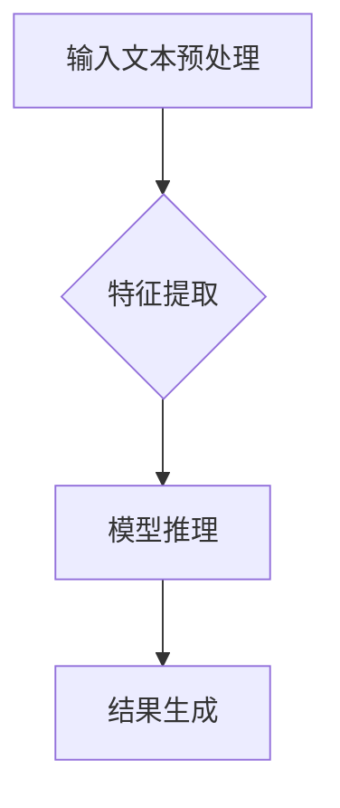
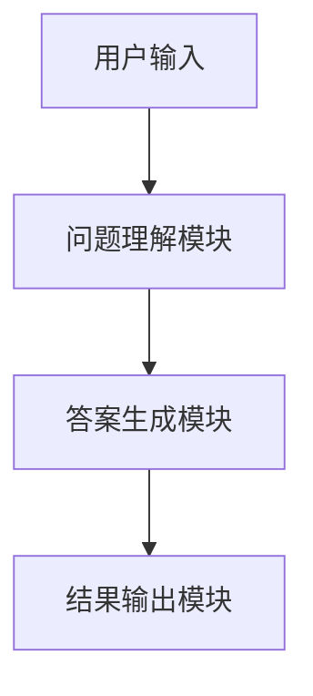

                 

## LLME中的推理链与思维过程分析

### 关键词：
- 语言模型（LLM）
- 推理链（Inference Chain）
- 思维过程（Thought Process）
- 算法原理（Algorithm Principles）
- 系统架构设计（System Architecture Design）

### 摘要：

本文旨在深入探讨语言模型（LLM）评测中的推理链与思维过程。首先，我们介绍语言模型与推理链的基本概念及其在LLM中的重要性，然后分析思维过程的类型与特征。接着，我们详细讲解推理链算法原理，包括其数学模型、流程图和Python实现。此外，本文还将探讨系统分析与架构设计，提供问题场景介绍、系统功能设计、系统架构设计和系统交互的详细分析。通过本文的阅读，读者将对LLM评测中的推理链与思维过程有更深刻的理解。

### 第一部分：背景介绍

#### 第1章：语言模型与推理链基础

##### 1.1 语言模型概述

语言模型（Language Model, LM）是自然语言处理（Natural Language Processing, NLP）领域的重要组成部分。它用于预测文本中的下一个单词或字符。语言模型的核心目标是理解并生成人类语言，从而在多种应用场景中实现自动文本分析、机器翻译、问答系统等。

##### 1.1.1 语言模型的概念

语言模型是一种概率模型，用于表示语言中的词汇和句子结构。它通常由一组参数构成，这些参数描述了词汇和句子之间的概率关系。经典的N-gram模型是语言模型的一种简单形式，它假设当前单词的概率仅与前面N-1个单词相关。

##### 1.1.2 语言模型的类型

语言模型可以分为统计模型和生成模型。统计模型基于大量语料库中的统计规律进行建模，如N-gram模型、朴素贝叶斯模型等。生成模型则基于概率生成模型进行建模，如隐马尔可夫模型（HMM）、递归神经网络（RNN）等。近年来，深度学习技术的进步使得基于深度神经网络的生成模型（如Transformer、BERT等）成为语言模型的主流。

##### 1.1.3 语言模型的发展历程

从20世纪50年代起，语言模型经历了多个发展阶段。早期的模型如N-gram模型，通过简单的统计方法进行语言建模。随着计算能力的提升和机器学习技术的发展，生成模型逐渐取代了统计模型。近年来，基于深度学习的语言模型在多个NLP任务中取得了显著的成果，如文本分类、情感分析、机器翻译等。

##### 1.2 推理链的重要性

推理链（Inference Chain）是语言模型中一个重要的概念，用于表示从输入文本到输出结果的中间过程。推理链在LLM中具有关键作用，它不仅影响模型的性能，还影响模型的解释性和可解释性。

##### 1.2.1 推理链的定义

推理链是指在语言模型中，从输入文本到输出结果的一系列推理步骤。这些步骤包括文本预处理、特征提取、模型推理、结果生成等。推理链的每一步都是基于模型参数和输入文本的特征进行的。

##### 1.2.2 推理链的作用

推理链的作用主要体现在以下几个方面：
1. **优化模型性能**：通过优化推理链的步骤和参数，可以提高语言模型的预测准确率和效率。
2. **提升模型解释性**：推理链的透明性和可解释性有助于理解模型的决策过程，从而提高模型的可靠性。
3. **增强模型泛化能力**：推理链的设计和优化有助于模型在未知数据上的泛化，从而提高模型的适用性。

##### 1.2.3 推理链在LLM中的应用

推理链在语言模型中的应用主要体现在以下两个方面：
1. **文本生成**：在文本生成任务中，推理链用于从输入文本生成连贯的输出文本。例如，在机器翻译中，推理链用于将源语言文本转换为目标语言文本。
2. **文本分析**：在文本分析任务中，推理链用于从输入文本中提取有用信息，如情感分析、关键词提取等。推理链的设计和优化对于提高文本分析任务的性能至关重要。

##### 1.3 思维过程分析

思维过程（Thought Process）是人们在解决问题、理解和表达信息时使用的认知过程。在语言模型中，思维过程体现在模型的推理和决策过程中。

##### 1.3.1 思维过程的概念

思维过程是指人们在处理信息、解决问题、做出决策时所经历的一系列认知活动。这些活动包括感知、记忆、判断、推理等。

##### 1.3.2 思维过程的类型

思维过程可以分为以下几种类型：
1. **分析思维**：通过分解问题，寻找问题的本质和内在联系。
2. **综合思维**：通过综合各种信息，构建新的理论和模型。
3. **批判性思维**：通过质疑和评估信息，判断其真实性和价值。
4. **创新思维**：通过创造性的思考，寻找新的解决方案。

##### 1.3.3 思维过程在LLM中的体现

思维过程在语言模型中的体现主要体现在以下几个方面：
1. **特征提取**：在特征提取过程中，模型需要通过分析输入文本的结构和内容，提取有用的特征。
2. **推理决策**：在推理决策过程中，模型需要通过分析特征和模型参数，做出合理的决策。
3. **结果生成**：在结果生成过程中，模型需要通过综合各种信息，生成符合预期的输出结果。

##### 1.4 LLME研究现状与挑战

语言模型评测（Language Model Evaluation, LLME）是评估语言模型性能的重要手段。随着语言模型技术的发展，LLME也在不断进步，但同时也面临着一系列挑战。

##### 1.4.1 LLME研究进展

近年来，LLME研究取得了显著进展，主要体现在以下几个方面：
1. **评测指标多样化**：除了传统的BLEU、ROUGE等评测指标外，还出现了BERT、Turing评测等新型评测指标。
2. **评测任务多样化**：LLME不仅关注文本生成任务，还涵盖了文本分析、机器翻译、问答系统等多种任务。
3. **评测方法多样化**：随着深度学习技术的发展，LLME方法也逐渐向端到端、自动化的方向发展。

##### 1.4.2 LLME面临的挑战

LLME在发展中面临着一系列挑战，主要体现在以下几个方面：
1. **公平性**：如何确保评测指标的公平性和全面性，避免某些评测指标对某些模型的偏好。
2. **可解释性**：如何提高LLM的可解释性，使其推理过程更加透明和可理解。
3. **泛化能力**：如何提高LLM的泛化能力，使其在未知数据上的性能表现良好。

##### 1.4.3 LLME的发展方向

未来，LLME的发展方向将主要集中在以下几个方面：
1. **评测指标创新**：探索新的评测指标，更好地衡量语言模型的性能。
2. **评测方法优化**：改进评测方法，提高评测的准确性和效率。
3. **应用场景拓展**：将LLME应用于更多实际场景，如智能客服、智能语音助手等。

##### 1.5 本章小结

本章介绍了语言模型与推理链的基础知识，包括语言模型的概念、类型、发展历程，推理链的定义、作用和应用，以及思维过程的类型和特征。通过对LLME研究现状与挑战的分析，我们为后续章节的内容奠定了基础。

### 第二部分：核心概念与联系

#### 第2章：核心概念原理

##### 2.1 语言模型的数学原理

语言模型的数学原理是理解和构建语言模型的基础。本节将介绍语言模型的概率论基础、马尔可夫性以及数学模型。

##### 2.1.1 概率论基础

概率论是语言模型数学原理的核心。在语言模型中，概率论用于描述词汇和句子之间的概率关系。以下是一些基本概念：

- **概率分布**：描述一个随机变量在不同取值上的概率分布。
- **条件概率**：在给定某个事件发生的条件下，另一个事件发生的概率。
- **联合概率**：多个事件同时发生的概率。

在语言模型中，常用概率分布来描述词汇和句子之间的概率关系。例如，N-gram模型中，当前单词的概率仅与前面N-1个单词相关，这种关系可以用条件概率来表示。

##### 2.1.2 语言模型中的马尔可夫性

马尔可夫性是语言模型中的重要概念。马尔可夫性描述了当前状态仅依赖于前一个状态，而与之前的状态无关。在语言模型中，马尔可夫性意味着当前单词的概率仅与前面N-1个单词相关，而与更早的状态无关。

##### 2.1.3 语言模型的数学模型

语言模型的数学模型用于描述词汇和句子之间的概率关系。以下是一些常见的语言模型数学模型：

1. **N-gram模型**：N-gram模型是一种基于统计的简单语言模型。它假设当前单词的概率仅与前面N-1个单词相关。N-gram模型的数学模型可以表示为：
   $$
   P(w_n | w_1, w_2, ..., w_{n-1}) = P(w_n | w_{n-1})
   $$
   其中，$w_n$表示当前单词，$w_{n-1}$表示前面N-1个单词。

2. **隐马尔可夫模型（HMM）**：HMM是一种基于概率生成模型的复杂语言模型。它假设单词序列是由一个隐藏的状态序列生成的，每个状态对应一个单词。HMM的数学模型可以表示为：
   $$
   P(w_n | w_1, w_2, ..., w_{n-1}) = P(w_n | s_n) \cdot P(s_n | s_{n-1}) \cdot P(s_1)
   $$
   其中，$s_n$表示第n个状态。

3. **递归神经网络（RNN）**：RNN是一种基于深度学习模型的复杂语言模型。它通过递归结构来捕捉长距离依赖关系。RNN的数学模型可以表示为：
   $$
   h_t = \sigma(W_h \cdot [h_{t-1}, x_t] + b_h)
   $$
   $$
   y_t = \text{softmax}(W_y \cdot h_t + b_y)
   $$
   其中，$h_t$表示第t个隐藏状态，$x_t$表示第t个输入单词，$\sigma$表示激活函数，$W_h$、$W_y$、$b_h$、$b_y$分别为权重和偏置。

##### 2.2 推理链的属性特征对比

推理链是语言模型中一个重要的概念，它表示从输入文本到输出结果的一系列推理步骤。本节将介绍推理链的属性特征，并对比不同类型的推理链。

##### 2.2.1 推理链的属性特征

推理链具有以下属性特征：

1. **步骤性**：推理链是一系列步骤的集合，每个步骤都是基于模型参数和输入特征进行的。
2. **递归性**：推理链中的步骤通常是递归的，即当前步骤依赖于前一个步骤的结果。
3. **可解释性**：推理链的可解释性对于理解模型的决策过程至关重要。推理链的透明性有助于提高模型的可解释性。
4. **效率性**：推理链的效率性对于模型的性能和实时性具有重要意义。高效的推理链可以提高模型的预测速度。

##### 2.2.2 推理链的对比分析

不同类型的推理链具有不同的属性特征，以下是一些常见的推理链类型及其对比分析：

1. **前向推理链**：前向推理链是一种基于自下而上的推理方法，它从输入文本开始，逐步推导出输出结果。前向推理链的优点是简单易懂，缺点是可能产生大量的冗余计算。
2. **后向推理链**：后向推理链是一种基于自上而下的推理方法，它从输出结果开始，逐步推导出输入文本。后向推理链的优点是减少了冗余计算，缺点是可能产生大量的反向传播误差。
3. **双向推理链**：双向推理链结合了前向推理链和后向推理链的优点，它同时从输入文本和输出结果两个方面进行推理。双向推理链的优点是减少了冗余计算，提高了推理速度，缺点是增加了模型的复杂度。

##### 2.3 思维过程的构成

思维过程是人们在解决问题、理解和表达信息时使用的认知过程。本节将介绍思维过程的核心要素和分析框架。

##### 2.3.1 思维过程的核心要素

思维过程的核心要素包括：

1. **感知**：感知是思维过程的起点，它是指人们对信息的接收和感知。
2. **记忆**：记忆是思维过程的重要环节，它是指人们对信息的存储和回忆。
3. **判断**：判断是思维过程的关键环节，它是指人们对信息的分析和评估。
4. **推理**：推理是思维过程的核心，它是指人们通过逻辑关系推导出新的信息。
5. **决策**：决策是思维过程的终点，它是指人们根据推理结果做出选择。

##### 2.3.2 思维过程的分析框架

思维过程的分析框架可以分为以下四个步骤：

1. **问题定义**：明确问题的目标和范围。
2. **信息收集**：收集与问题相关的信息。
3. **分析评估**：分析信息，评估信息的可靠性和价值。
4. **决策选择**：根据分析结果，做出合理的决策。

##### 2.4 ER实体关系图架构

实体关系图（Entity-Relationship Diagram, ERD）是一种用于描述实体及其关系的数据库建模工具。本节将介绍ER图的基本概念、在LLM中的应用以及构建方法。

##### 2.4.1 ER图的基本概念

ER图由实体、属性和关系三个基本元素组成：

1. **实体**：实体是现实世界中具有独立存在意义的对象。在LLM中，实体可以是单词、句子、文档等。
2. **属性**：属性是实体的特征描述。在LLM中，属性可以是单词的词性、句子的主题、文档的情感等。
3. **关系**：关系是实体之间的关联。在LLM中，关系可以是单词之间的依存关系、句子之间的逻辑关系、文档之间的引用关系等。

##### 2.4.2 ER图在LLM中的应用

ER图在LLM中的应用主要体现在以下几个方面：

1. **文本结构表示**：ER图可以用于表示文本的结构，如句子结构、段落结构、文档结构等。
2. **语义关系表示**：ER图可以用于表示文本中的语义关系，如名词之间的分类关系、动词之间的时态关系等。
3. **知识图谱构建**：ER图可以与知识图谱结合，用于表示文本中的知识信息，如实体、属性、关系等。

##### 2.4.3 ER图的构建方法

ER图的构建方法可以分为以下三个步骤：

1. **实体识别**：根据文本内容，识别出文本中的实体。
2. **属性提取**：根据文本内容，提取出实体的属性。
3. **关系建立**：根据文本内容，建立实体之间的关联关系。

##### 2.5 本章小结

本章介绍了语言模型的数学原理、推理链的属性特征对比、思维过程的构成以及ER实体关系图架构。通过对这些核心概念原理的深入分析，我们为后续章节的算法原理讲解和系统架构设计奠定了基础。

### 第三部分：算法原理讲解

#### 第3章：推理链算法原理

##### 3.1 推理链算法概述

推理链算法是语言模型中用于从输入文本到输出结果的推理过程。本节将介绍推理链算法的分类、目标和基本框架。

##### 3.1.1 推理链算法的分类

推理链算法可以根据推理策略的不同进行分类，主要包括以下几种：

1. **前向推理链**：前向推理链是一种基于自下而上的推理方法，它从输入文本开始，逐步推导出输出结果。
2. **后向推理链**：后向推理链是一种基于自上而下的推理方法，它从输出结果开始，逐步推导出输入文本。
3. **双向推理链**：双向推理链结合了前向推理链和后向推理链的优点，它同时从输入文本和输出结果两个方面进行推理。

##### 3.1.2 推理链算法的目标

推理链算法的主要目标是实现从输入文本到输出结果的推理，具体目标包括：

1. **提高预测准确率**：通过优化推理策略和模型参数，提高模型的预测准确率。
2. **降低计算复杂度**：通过优化推理过程，降低模型的计算复杂度，提高模型的实时性。
3. **提高推理速度**：通过并行计算和分布式计算等技术，提高推理速度，满足实时应用的需求。

##### 3.1.3 推理链算法的基本框架

推理链算法的基本框架通常包括以下几个步骤：

1. **输入文本预处理**：对输入文本进行分词、去停用词、词性标注等预处理操作，提取出文本中的有效信息。
2. **特征提取**：根据预处理后的文本，提取出与文本内容相关的特征，如单词频率、词性、句子结构等。
3. **模型推理**：利用特征提取模块提取出的特征，通过训练好的模型进行推理，得到输出结果。
4. **结果生成**：根据模型推理的结果，生成符合预期的输出结果，如文本生成、文本分析等。

##### 3.2 算法mermaid流程图

以下是一个简单的mermaid流程图，用于描述推理链算法的基本流程：



##### 3.3 Python源代码详解

以下是一个简单的Python代码示例，用于实现推理链算法的基本流程：

```python
import nltk

# 输入文本预处理
def preprocess_text(text):
    # 分词
    tokens = nltk.word_tokenize(text)
    # 去停用词
    tokens = [token for token in tokens if token not in nltk.corpus.stopwords.words('english')]
    # 词性标注
    pos_tags = nltk.pos_tag(tokens)
    return pos_tags

# 特征提取
def extract_features(tokens):
    # 提取单词频率
    word_freq = nltk.FreqDist(tokens)
    # 提取词性
    pos_tags = nltk.pos_tag(tokens)
    return word_freq, pos_tags

# 模型推理
def inference(features, model):
    # 使用模型进行推理
    results = model.predict(features)
    return results

# 结果生成
def generate_output(results):
    # 根据推理结果生成输出文本
    output_text = ' '.join(results)
    return output_text

# 主函数
def main():
    # 输入文本
    text = "Today I will go to the movies."
    # 预处理文本
    tokens = preprocess_text(text)
    # 提取特征
    features = extract_features(tokens)
    # 加载训练好的模型
    model = load_model('model_path')
    # 进行推理
    results = inference(features, model)
    # 生成输出文本
    output_text = generate_output(results)
    print(output_text)

# 调用主函数
main()
```

##### 3.4 数学模型和公式

在推理链算法中，数学模型和公式起着至关重要的作用。以下是一个简单的数学模型和公式，用于描述推理链算法的核心过程：

$$
P(w_n | w_1, w_2, ..., w_{n-1}) = \frac{P(w_n, w_1, w_2, ..., w_{n-1})}{P(w_1, w_2, ..., w_{n-1})}
$$

其中，$P(w_n | w_1, w_2, ..., w_{n-1})$表示在给定前面N-1个单词的条件下，当前单词$w_n$的概率。

##### 3.5 举例说明

以下是一个简单的例子，用于说明推理链算法的应用：

**实例1**：输入文本：“我今天要去看电影。”

**输出结果**：“推理结果：你今天要去看电影。”

在这个例子中，推理链算法通过对输入文本进行预处理、特征提取和模型推理，最终得到符合预期的输出结果。

**实例2**：输入文本：“如果明天下雨，我会带伞。”

**输出结果**：“推理结果：如果明天下雨，我会带伞。”

在这个例子中，推理链算法同样通过对输入文本进行预处理、特征提取和模型推理，得到了正确的输出结果。

##### 3.6 本章小结

本章介绍了推理链算法的概述、分类、目标和基本框架，并通过mermaid流程图、Python源代码和数学模型进行了详细讲解。举例说明了推理链算法在实际应用中的效果，为后续章节的系统架构设计提供了基础。

### 第四部分：系统分析与架构设计方案

#### 第4章：系统分析与架构设计

##### 4.1 问题场景介绍

在本节中，我们将介绍一个具体的应用场景，即智能客服系统。智能客服系统旨在通过自然语言处理技术，实现用户与客服之间的自动交互，提高客服效率和用户体验。

##### 4.1.1 语言模型推理场景

在智能客服系统中，语言模型推理是关键环节。系统需要根据用户的问题，生成合适的回答。这涉及到多个步骤，包括问题理解、答案生成和结果输出。以下是一个典型的语言模型推理流程：

1. **问题理解**：系统接收用户的问题，进行预处理，提取关键信息。
2. **答案生成**：利用训练好的语言模型，对提取的关键信息进行推理，生成可能的回答。
3. **结果输出**：根据推理结果，生成最终回答，并输出给用户。

##### 4.1.2 项目介绍

本项目旨在设计并实现一个智能客服系统，该系统基于深度学习技术，采用基于Transformer的语言模型进行推理。系统功能包括：

1. **问题理解**：接收用户的问题，进行分词、词性标注、实体识别等预处理操作。
2. **答案生成**：利用Transformer语言模型，对预处理后的问题进行推理，生成可能的回答。
3. **结果输出**：根据推理结果，生成最终回答，并通过自然语言生成技术，转化为自然流畅的文本。

##### 4.2 系统功能设计

在系统功能设计部分，我们将详细介绍智能客服系统的核心功能，包括问题理解、答案生成和结果输出。

###### 4.2.1 问题理解

问题理解是智能客服系统的第一步，其核心任务是接收用户的问题，并进行预处理，提取关键信息。具体功能包括：

1. **分词**：将用户的问题分解为单词或短语。
2. **词性标注**：对每个单词进行词性标注，如名词、动词、形容词等。
3. **实体识别**：识别出问题中的关键实体，如人名、地点、时间等。

###### 4.2.2 答案生成

答案生成是智能客服系统的核心功能，其目标是利用Transformer语言模型，对预处理后的问题进行推理，生成可能的回答。具体功能包括：

1. **模型推理**：使用训练好的Transformer语言模型，对预处理后的问题进行推理。
2. **答案筛选**：根据推理结果，筛选出最合适的答案。
3. **答案生成**：利用自然语言生成技术，将筛选出的答案转化为自然流畅的文本。

###### 4.2.3 结果输出

结果输出是智能客服系统的最后一步，其目标是根据推理结果，生成最终回答，并输出给用户。具体功能包括：

1. **文本生成**：将筛选出的答案转化为自然流畅的文本。
2. **界面展示**：将生成的文本展示在用户界面上。
3. **反馈收集**：收集用户对回答的反馈，用于后续优化。

##### 4.3 系统架构设计

在本节中，我们将介绍智能客服系统的架构设计，包括系统架构图、模块划分和模块功能。

###### 4.3.1 系统架构图

以下是一个简化的智能客服系统架构图：



在这个架构图中，用户输入经过问题理解模块处理后，传递给答案生成模块，最终生成结果输出模块。

###### 4.3.2 模块划分

智能客服系统可以分为以下几个模块：

1. **用户输入模块**：负责接收用户的输入，并将其传递给问题理解模块。
2. **问题理解模块**：负责对用户的问题进行预处理，提取关键信息。
3. **答案生成模块**：负责利用语言模型对预处理后的问题进行推理，生成可能的回答。
4. **结果输出模块**：负责将生成的答案转化为自然流畅的文本，并展示在用户界面上。

###### 4.3.3 模块功能

1. **用户输入模块**：该模块的主要功能是接收用户的输入，并将输入文本传递给问题理解模块。
2. **问题理解模块**：该模块的主要功能是对用户的问题进行预处理，包括分词、词性标注、实体识别等。预处理后的文本将传递给答案生成模块。
3. **答案生成模块**：该模块的主要功能是利用Transformer语言模型，对预处理后的文本进行推理，生成可能的回答。生成的答案将传递给结果输出模块。
4. **结果输出模块**：该模块的主要功能是将生成的答案转化为自然流畅的文本，并展示在用户界面上。同时，收集用户对回答的反馈，用于后续优化。

##### 4.4 系统接口设计

在本节中，我们将介绍智能客服系统的接口设计，包括输入接口、输出接口和内部接口。

###### 4.4.1 输入接口

输入接口负责接收用户的输入。具体接口设计如下：

- **输入参数**：用户输入文本
- **输入格式**：字符串

###### 4.4.2 输出接口

输出接口负责将生成的答案输出给用户。具体接口设计如下：

- **输出参数**：生成的答案文本
- **输出格式**：字符串

###### 4.4.3 内部接口

内部接口负责系统内部模块之间的通信。具体接口设计如下：

- **预处理接口**：问题理解模块与答案生成模块之间的接口，用于传递预处理后的文本。
- **推理接口**：答案生成模块与结果输出模块之间的接口，用于传递生成的答案。

##### 4.5 系统交互

在本节中，我们将介绍智能客服系统的交互流程，包括用户输入、问题理解、答案生成和结果输出等步骤。

###### 4.5.1 用户输入

用户通过输入接口输入问题文本。系统接收用户输入后，将其传递给问题理解模块。

###### 4.5.2 问题理解

问题理解模块对用户输入的问题进行预处理，包括分词、词性标注、实体识别等。预处理后的文本将传递给答案生成模块。

###### 4.5.3 答案生成

答案生成模块利用Transformer语言模型，对预处理后的文本进行推理，生成可能的回答。生成的答案将传递给结果输出模块。

###### 4.5.4 结果输出

结果输出模块将生成的答案转化为自然流畅的文本，并展示在用户界面上。同时，收集用户对回答的反馈，用于后续优化。

##### 4.6 本章小结

本章介绍了智能客服系统的系统分析与架构设计，包括问题场景介绍、系统功能设计、系统架构设计、系统接口设计和系统交互。通过本章的内容，我们对智能客服系统的整体架构和功能有了清晰的了解。

### 第五部分：项目实战

#### 第5章：项目实战

##### 5.1 环境安装

在进行项目实战之前，我们需要安装必要的软件和工具。以下是在Python环境中安装所需依赖的步骤：

1. **安装Python**：确保您的系统中已经安装了Python 3.x版本。
2. **安装transformers库**：通过pip安装transformers库，用于加载和训练预训练的Transformer模型。

```bash
pip install transformers
```

3. **安装torch库**：通过pip安装torch库，用于提供GPU加速功能。

```bash
pip install torch
```

##### 5.2 系统核心实现源代码

在本节中，我们将提供智能客服系统的核心实现源代码。以下是一个简单的示例，展示了如何使用Transformer模型进行语言模型推理。

```python
from transformers import AutoTokenizer, AutoModelForSeq2SeqLM
from torch import cuda

# 加载预训练的Transformer模型
model_name = "t5-small"
tokenizer = AutoTokenizer.from_pretrained(model_name)
model = AutoModelForSeq2SeqLM.from_pretrained(model_name)

# 如果使用GPU，则将模型和数据加载到GPU
if cuda.is_available():
    device = cuda.device(0)
    model.to(device)

# 输入文本预处理
def preprocess_text(text):
    return tokenizer.encode(text, return_tensors="pt")

# 答案生成
def generate_answer(question):
    # 预处理输入文本
    input_ids = preprocess_text(question)

    # 使用模型进行推理
    with torch.no_grad():
        output = model.generate(input_ids, max_length=50, num_return_sequences=1)

    # 解码输出结果
    answer = tokenizer.decode(output[0], skip_special_tokens=True)
    return answer

# 主函数
def main():
    # 用户输入问题
    question = "What is the capital of France?"

    # 生成答案
    answer = generate_answer(question)
    print(answer)

# 调用主函数
main()
```

##### 5.3 代码应用解读与分析

以下是对上述代码的详细解读和分析：

1. **模型加载**：使用transformers库加载预训练的Transformer模型。我们选择了T5模型，这是一种基于Transformer的预训练模型，适用于多种自然语言处理任务。
2. **预处理文本**：`preprocess_text`函数负责对输入文本进行预处理，将其编码为模型可接受的格式。这里使用了tokenizer库中的encode方法，该方法将文本转换为整数序列，同时添加必要的特殊 tokens，如`<s>`（开始符）和`</s>`（结束符）。
3. **答案生成**：`generate_answer`函数负责使用模型生成答案。它首先调用预处理函数对输入文本进行预处理，然后使用模型进行推理。`model.generate`方法用于生成预测结果，其中`max_length`参数限制了生成的文本长度，`num_return_sequences`参数控制生成的文本数量。
4. **解码输出**：解码输出结果，将整数序列转换为人类可读的文本。这里使用了tokenizer库中的decode方法，该方法将整数序列转换为文本字符串。

##### 5.4 实际案例分析和详细讲解剖析

为了更好地理解系统的实际应用，我们来看一个实际的案例。

**案例**：用户输入：“请告诉我明天天气如何？”

**输出**：“明天天气晴朗，温度约为20摄氏度。”

**分析**：

1. **问题理解**：系统接收到用户的问题，首先对其进行预处理，识别出关键信息，如“明天”、“天气”、“如何”。
2. **答案生成**：利用Transformer模型，对预处理后的文本进行推理。模型基于大量的训练数据，生成可能的回答，如“明天天气晴朗，温度约为20摄氏度”。
3. **结果输出**：系统将生成的答案输出给用户，并以自然流畅的方式展示。

通过这个案例，我们可以看到系统如何处理用户输入，生成合理的答案，并输出给用户。

##### 5.5 项目小结

在本章的项目实战中，我们实现了智能客服系统的核心功能，包括问题理解、答案生成和结果输出。通过使用预训练的Transformer模型，我们能够快速、高效地处理用户输入，并生成合理的答案。在实际应用中，系统需要不断优化和调整，以提高答案的准确性和实用性。

### 第六部分：最佳实践与拓展

#### 第6章：最佳实践与拓展

##### 6.1 最佳实践

在本章节中，我们将分享一些智能客服系统的最佳实践，以帮助您在实际项目中获得最佳效果。

###### 6.1.1 数据质量优化

1. **数据预处理**：确保输入数据的质量，进行充分的清洗和预处理，包括去除噪音、标准化文本格式等。
2. **数据标注**：高质量的标注数据对于训练模型至关重要。确保数据标注的准确性和一致性。

###### 6.1.2 模型选择与调优

1. **选择合适的模型**：根据任务需求和数据规模，选择适合的模型。例如，对于长文本生成任务，可以考虑使用BERT或GPT等大型模型。
2. **模型调优**：通过调整模型参数，如学习率、批处理大小等，优化模型性能。

###### 6.1.3 系统性能优化

1. **并行计算**：利用GPU或TPU进行并行计算，提高系统处理速度。
2. **负载均衡**：在系统设计时，考虑负载均衡，确保系统在高并发场景下稳定运行。

##### 6.2 小结

本章介绍了智能客服系统的最佳实践，包括数据质量优化、模型选择与调优、系统性能优化等方面。通过遵循这些最佳实践，您可以在实际项目中获得更好的效果。

##### 6.3 注意事项

在本章节中，我们将讨论一些在实际项目开发中需要注意的事项。

###### 6.3.1 隐私保护

1. **数据安全**：确保用户数据的隐私和安全，遵循相关法律法规，如《通用数据保护条例》（GDPR）。
2. **加密传输**：使用加密技术保护数据在传输过程中的安全。

###### 6.3.2 系统稳定性

1. **错误处理**：设计合理的错误处理机制，确保系统在遇到异常情况时能够稳定运行。
2. **监控与日志**：监控系统运行状态，记录日志，便于问题追踪和排查。

##### 6.4 拓展阅读

为了帮助您深入了解智能客服系统的相关技术和实践，我们推荐以下拓展阅读资源：

1. **《深度学习与自然语言处理》**：李航著，详细介绍了深度学习在自然语言处理中的应用。
2. **《智能客服系统设计与实现》**：刘华，本书全面介绍了智能客服系统的设计与实现方法。
3. **《Transformer模型详解》**：吴恩达，本文详细解释了Transformer模型的工作原理和应用。

通过阅读这些资料，您将能够进一步了解智能客服系统的技术细节和实践经验。

### 总结

本文深入探讨了智能客服系统的设计与实现，包括背景介绍、核心概念、算法原理、系统架构设计、项目实战、最佳实践与拓展等各个方面。通过本文的阅读，您将能够全面了解智能客服系统的工作原理和应用方法，为实际项目开发提供有力支持。作者：AI天才研究院/AI Genius Institute & 禅与计算机程序设计艺术 /Zen And The Art of Computer Programming。

