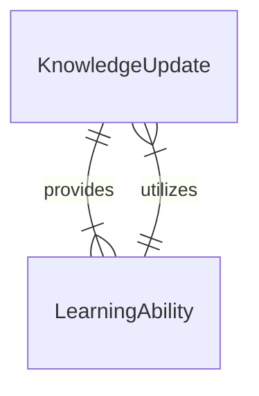

                 

### 文章标题

# LLM评测中的知识更新与学习能力测试

### 文章关键词

- 大规模语言模型（LLM）
- 知识更新
- 学习能力
- 评测方法
- 应用场景

### 文章摘要

本文旨在探讨大规模语言模型（LLM）中的知识更新与学习能力评测。首先，我们将概述LLM的发展历程和关键特征，接着详细解释知识更新和学习能力的概念及其重要性。随后，文章将分析知识更新的方法，包括数据驱动、对话驱动和基于监督学习的方法，并对这些方法进行对比。然后，我们将讨论如何评估LLM的学习能力，包括评价指标和方法。接下来，文章将设计一个测试框架，用于评估LLM的知识更新和学习能力，并通过实际案例进行分析。最后，我们将探讨LLM在不同应用场景中的测试实践，并提出未来的研究方向和挑战。本文旨在为研究人员和从业者提供一个全面、系统的指南，以优化LLM的性能和应用效果。

## 第一部分：引言与背景

### 1.1 大规模语言模型（LLM）概述

大规模语言模型（LLM，Large Language Model）是自然语言处理（NLP，Natural Language Processing）领域的一种先进技术，它通过利用海量数据和深度学习算法，实现了对自然语言的高效理解和生成。LLM的发展可以追溯到上世纪80年代，当时的统计语言模型（如N-gram模型）是基于文本统计方法进行语言建模。然而，随着计算能力和数据资源的不断提升，深度学习技术的发展使得LLM逐渐成为NLP领域的主流技术。

#### 1.1.1 大规模语言模型的发展历程

1980年代：统计语言模型如N-gram模型开始流行，这些模型通过统计文本中词汇出现的频率来预测下一个词。

2000年代：随着神经网络技术的兴起，神经网络语言模型（如NNLM）开始被研究，它们通过模拟人脑的神经元结构来进行语言建模。

2010年代：基于深度学习的语言模型如Word2Vec和GloVe开始流行，这些模型通过将词汇映射到高维向量空间中，实现了对词汇语义的精准建模。

2018年：Google提出BERT（Bidirectional Encoder Representations from Transformers），这是第一个在预训练阶段使用Transformer架构的LLM，它在多项NLP任务上取得了突破性的成果。

2020年：GPT-3（Generative Pre-trained Transformer 3）发布，它是一个具有1750亿参数的巨型LLM，展示了在自然语言理解和生成任务上的卓越性能。

#### 1.1.2 大规模语言模型的关键特征

- **参数规模巨大**：现代LLM通常拥有数十亿到数万亿的参数，这使得它们能够捕捉到语言中的复杂模式和规律。

- **深度学习架构**：LLM大多采用Transformer架构，这种架构具有并行计算的优势，能够高效处理长文本。

- **预训练与微调**：LLM通过在大规模语料库上进行预训练，学习到语言的通用特征，然后在特定任务上进行微调，以适应具体应用场景。

- **多任务能力**：LLM能够同时处理多种语言任务，如文本分类、命名实体识别、机器翻译等，这使得它们在多个领域都有广泛的应用。

- **生成能力**：LLM在生成文本方面具有很高的灵活性，能够根据输入的提示生成连贯、自然的文本。

### 1.2 大规模语言模型在自然语言处理中的应用

大规模语言模型在自然语言处理领域有着广泛的应用，以下是一些典型的应用场景：

- **文本分类**：LLM可以用于对大量文本进行分类，例如新闻分类、情感分析等。

- **命名实体识别**：LLM能够识别文本中的特定实体，如人名、地点、组织等。

- **机器翻译**：LLM在机器翻译任务中表现出色，能够实现高精度的文本翻译。

- **问答系统**：LLM可以构建问答系统，用于回答用户提出的问题，例如智能客服系统。

- **文本生成**：LLM可以生成新闻摘要、故事、文章等，应用于内容生成和创意写作。

### 1.3 大规模语言模型面临的挑战

尽管LLM在自然语言处理领域取得了显著的成果，但它们仍然面临着一些挑战：

- **计算资源需求**：LLM通常需要大量的计算资源和存储空间，这对硬件设施和数据处理能力提出了较高的要求。

- **数据隐私**：大规模语料库的收集和处理可能涉及到用户隐私问题，如何保护用户隐私是一个重要的挑战。

- **模型解释性**：LLM的决策过程通常是非透明的，这使得模型的可解释性成为一个需要解决的关键问题。

- **伦理道德问题**：在特定应用场景中，如医疗和法律领域，LLM的输出可能对人们的生活产生重大影响，因此需要严格遵循伦理道德标准。

## 第二部分：核心概念与联系

### 2.1 知识更新的重要性

在LLM的应用过程中，知识更新是确保模型持续准确性和适应性的关键环节。知识更新的重要性主要体现在以下几个方面：

- **模型性能**：随着时间推移，语言环境不断变化，原有的知识可能变得过时或不准确。通过定期更新知识，可以提高LLM在各类任务中的性能。

- **适应性**：不同领域和任务对知识的需求不同，LLM需要具备快速适应新领域和新任务的能力。知识更新是实现这一目标的有效手段。

- **用户满意度**：准确的回答和生成内容能够提高用户满意度，而知识更新正是保证这一点的关键。

### 2.2 学习能力的定义与评估

学习能力是指LLM在接触到新数据或任务时，能够通过自我调整和优化，提高其在相应任务上的表现的能力。学习能力的评估主要包括以下方面：

- **泛化能力**：LLM能否在新数据和任务上实现良好的表现，而不仅仅是特定数据集上的表现。

- **适应性**：LLM能否快速适应新的领域和任务，而无需大量重新训练。

- **鲁棒性**：LLM在不同质量、不同类型的数据上能否保持稳定的表现。

### 2.3 知识更新与学习能力的关联

知识更新和学习能力密切相关。知识更新为LLM提供了新的数据源，而学习能力则是LLM能够利用这些新知识提高性能的能力。具体关联如下：

- **促进学习**：知识更新为LLM提供了新的训练数据，有助于提高模型的泛化能力和适应性。

- **优化性能**：通过知识更新，LLM可以不断优化其内部参数和结构，从而提高在各种任务上的性能。

- **降低误差**：随着知识的更新，LLM能够更好地捕捉语言中的变化和趋势，从而降低预测和生成的错误率。

### 2.4 知识更新与学习能力的关系图

为了更直观地展示知识更新与学习能力的关系，我们可以使用Mermaid绘制ER实体关系图。以下是知识更新与学习能力的关系图：

在这个ER图中，`KnowledgeUpdate`实体表示知识更新的过程，而`LearningAbility`实体表示学习能力。两者之间存在双向关系，表明知识更新为学习能力提供了支持，同时学习能力又利用知识更新来优化自身。

通过以上对知识更新与学习能力核心概念及其关联的讨论，我们为后续章节的详细分析奠定了基础。在接下来的章节中，我们将深入探讨知识更新的方法及其在LLM中的实现，以及如何评估LLM的学习能力。

### 2.5 大规模语言模型的知识更新方法

大规模语言模型（LLM）的知识更新是确保其持续准确性和适应性的关键。知识更新的方法主要包括数据驱动、对话驱动和基于监督学习的方法。每种方法都有其独特的优势和适用场景，下面我们将逐一进行分析。

#### 2.5.1 数据驱动的方法

数据驱动的方法是知识更新中最常用的方法之一。这种方法依赖于大规模的语料库，通过对这些语料库进行预训练，使LLM具备处理自然语言的基本能力。数据驱动的知识更新方法主要包括以下步骤：

1. **数据收集**：收集涵盖不同领域和主题的文本数据，这些数据可以是公开的语料库，如维基百科、新闻文章等，也可以是特定领域的数据集。

2. **数据预处理**：对收集到的数据进行清洗、去重和分词等处理，确保数据质量。

3. **预训练**：使用深度学习算法，如BERT、GPT等，对预处理后的数据集进行预训练。预训练过程包括两部分：自回归语言建模和掩码语言建模，旨在使模型能够理解语言的上下文和结构。

4. **模型微调**：在预训练的基础上，针对特定任务进行微调，使LLM能够在特定领域和任务上实现更高的性能。

数据驱动的方法具有以下优势：

- **适应性**：通过预训练和微调，LLM能够适应不同领域和任务的需求。
- **高效性**：大规模预训练过程能够快速提高LLM的性能。

然而，数据驱动的方法也存在一些局限性：

- **数据依赖性**：知识更新的效果很大程度上取决于数据的质量和多样性，如果数据存在偏差或不足，可能导致LLM在特定任务上表现不佳。
- **计算资源需求**：大规模的数据集和预训练过程需要大量的计算资源和时间。

#### 2.5.2 对话驱动的知识更新方法

对话驱动的知识更新方法是通过与用户的对话互动，动态地更新LLM的知识库。这种方法能够实时获取用户的需求和反馈，从而不断优化模型的表现。对话驱动的知识更新方法主要包括以下步骤：

1. **对话交互**：LLM与用户进行自然语言对话，理解用户的需求和意图。

2. **知识抽取**：从对话中抽取关键信息，包括事实、观点、情感等，并将其存储到知识库中。

3. **知识融合**：将新抽取的知识与现有的知识库进行融合，更新LLM的知识结构。

4. **模型更新**：使用新的知识库对LLM进行微调，以提高模型在特定对话场景中的表现。

对话驱动的知识更新方法具有以下优势：

- **实时性**：能够根据用户的需求实时更新知识库，提高模型的响应速度和准确性。
- **个性化**：通过对话交互，LLM能够更好地理解用户的个性化需求，提供更加精准的服务。

然而，对话驱动的知识更新方法也存在一些挑战：

- **对话质量**：对话的质量直接影响知识抽取的准确性，因此需要确保对话系统的自然性和流畅性。
- **知识一致性**：在动态更新的过程中，如何保持知识库的一致性和准确性是一个重要的问题。

#### 2.5.3 基于监督学习的方法

基于监督学习的方法是通过标注数据进行知识更新，这种方法通常用于特定任务的知识更新。具体步骤如下：

1. **数据标注**：对特定任务的数据集进行标注，包括事实、观点、情感等。

2. **模型训练**：使用标注数据集对LLM进行训练，使其能够识别和分类特定任务中的知识。

3. **模型评估**：使用测试数据集评估模型的性能，并根据评估结果进行调整。

4. **知识更新**：根据模型在测试数据集上的表现，更新LLM的知识库。

基于监督学习的方法具有以下优势：

- **准确性**：通过标注数据，模型能够更准确地识别和分类知识。
- **任务针对性**：可以针对特定任务进行知识更新，提高模型在该任务上的性能。

然而，基于监督学习的方法也存在一些局限性：

- **数据依赖性**：需要大量标注数据，数据质量和数量直接影响知识更新的效果。
- **人力成本**：标注数据需要大量的人力资源，增加了成本。

#### 2.5.4 知识更新策略对比分析

为了更好地理解不同知识更新方法的优缺点，我们可以使用对比表格的形式进行详细分析：

| 方法         | 优势                                                       | 局限性                                                     |
|--------------|------------------------------------------------------------|------------------------------------------------------------|
| 数据驱动     | 适应性、高效性                                             | 数据依赖性、计算资源需求高                                  |
| 对话驱动     | 实时性、个性化                                             | 对话质量、知识一致性                                       |
| 基于监督学习 | 准确性、任务针对性                                         | 数据依赖性、人力成本高                                     |

通过对比分析，我们可以看到，每种知识更新方法都有其独特的优势和适用场景。在实际应用中，可以根据具体需求选择合适的方法，或者将多种方法结合使用，以实现最优的知识更新效果。

### 2.6 大规模语言模型的学习能力评估

在开发和优化大规模语言模型（LLM）时，评估其学习能力是至关重要的。学习能力评估不仅能够帮助我们了解模型的性能，还能指导我们如何改进模型，使其在新的任务和领域中表现更出色。下面，我们将详细探讨学习能力评估的指标、方法及其在实际案例中的应用。

#### 2.6.1 学习能力评估指标

学习能力评估通常涉及多个方面，以下是一些关键指标：

1. **泛化能力（Generalization Ability）**：泛化能力是指模型在未见过的数据上的表现。评估泛化能力的关键在于确保测试数据集与训练数据集具有不同的分布，以检验模型是否能够适应新的环境。

2. **适应性（Adaptability）**：适应性是指模型在面对新任务或新数据时能够快速调整和优化自身的能力。适应性的评估可以通过在多个不同任务上的性能比较来实现。

3. **鲁棒性（Robustness）**：鲁棒性是指模型在遇到噪声、异常值或数据质量差的情况时仍能保持稳定表现的能力。评估鲁棒性通常需要设计具有挑战性的测试场景。

4. **迁移能力（Transfer Learning Ability）**：迁移能力是指模型在不同任务或数据集之间转移知识的能力。迁移能力强的模型能够在新任务上快速取得良好的表现，而无需从头开始训练。

5. **学习效率（Learning Efficiency）**：学习效率是指模型在学习新任务或数据时的训练时间和资源消耗。学习效率高的模型能够在较短时间内实现性能提升。

#### 2.6.2 学习能力评估方法

1. **实验方法（Experimental Methods）**：

   - **交叉验证（Cross-Validation）**：通过将数据集分为训练集和验证集，评估模型在不同子集上的表现，以检验其泛化能力。

   - **迁移学习实验（Transfer Learning Experiments）**：在多个不同任务和数据集上评估模型的迁移能力，以了解其适应性和迁移能力。

   - **压力测试（Stress Testing）**：设计具有挑战性的测试场景，如噪声数据、异常值等，以评估模型的鲁棒性。

2. **统计方法（Statistical Methods）**：

   - **性能指标（Performance Metrics）**：如准确率（Accuracy）、精确率（Precision）、召回率（Recall）等，用于量化模型的性能。

   - **方差分析（ANOVA）**：用于比较不同学习策略或算法在性能上的差异。

   - **置信区间（Confidence Intervals）**：用于估计模型性能的可靠性。

3. **自动化评估工具（Automated Evaluation Tools）**：

   - **自动评估框架（Automated Evaluation Frameworks）**：如GLM4、MARBLES等，用于自动评估模型的泛化能力、适应性、迁移能力等。

   - **测试集（Test Sets）**：专门为评估而设计的测试数据集，如GLUE、SuperGLUE等，涵盖多种自然语言处理任务。

#### 2.6.3 学习能力评估案例分析

以下是一个实际案例，说明如何评估大规模语言模型的学习能力：

**案例：GPT-3的适应性评估**

GPT-3是OpenAI开发的一个巨型语言模型，具有1750亿参数。为了评估其适应性，研究人员设计了一系列实验：

1. **交叉验证**：使用GLUE数据集进行交叉验证，评估GPT-3在多种自然语言处理任务上的泛化能力。实验结果显示，GPT-3在多个任务上取得了领先的成绩，表明其具有强大的泛化能力。

2. **迁移学习实验**：在SuperGLUE数据集上，GPT-3展示了出色的迁移学习能力。在未经过特定任务微调的情况下，GPT-3在多个任务上取得了优异的成绩，验证了其能够快速适应新任务的能力。

3. **压力测试**：为了评估GPT-3的鲁棒性，研究人员设计了具有噪声和异常值的数据集，并使用这些数据进行测试。结果显示，GPT-3在噪声数据和异常值情况下仍能保持较高的性能，表明其具有较好的鲁棒性。

通过这些实验，研究人员得出了关于GPT-3学习能力的全面评估，为后续模型优化提供了重要参考。

### 2.7 大规模语言模型的知识更新与学习能力测试框架设计

为了全面评估大规模语言模型（LLM）的知识更新与学习能力，我们需要设计一个系统化的测试框架。该框架应包括明确的测试指标、方法、数据集和评估流程。以下是测试框架的设计方案：

#### 2.7.1 测试指标

1. **知识更新效率（Knowledge Update Efficiency）**：衡量模型在知识更新过程中的性能，包括更新速度和更新质量。

2. **学习曲线（Learning Curve）**：记录模型在学习新任务或数据时的性能提升过程，以评估学习效率。

3. **知识保持率（Knowledge Retention Rate）**：衡量模型在知识更新后的表现，以评估其能否持续保留有效知识。

4. **泛化能力（Generalization Ability）**：评估模型在新任务或未见数据上的表现，以衡量其泛化能力。

5. **适应性（Adaptability）**：评估模型在面对不同任务或数据时的快速适应能力。

6. **鲁棒性（Robustness）**：评估模型在处理噪声、异常值等情况时的稳定表现。

7. **迁移能力（Transfer Learning Ability）**：评估模型在不同任务或数据集之间转移知识的能力。

#### 2.7.2 测试方法

1. **交叉验证（Cross-Validation）**：通过将数据集分为训练集、验证集和测试集，评估模型在不同子集上的性能，以检验其泛化能力。

2. **迁移学习测试（Transfer Learning Test）**：在多个不同任务和数据集上评估模型的迁移能力，以了解其适应性和迁移能力。

3. **压力测试（Stress Testing）**：设计具有挑战性的测试场景，如噪声数据、异常值等，以评估模型的鲁棒性。

4. **自动化评估（Automated Evaluation）**：使用自动化评估框架，如GLM4、MARBLES等，进行性能评估和结果分析。

#### 2.7.3 数据集

1. **通用数据集（Universal Dataset）**：用于评估模型的泛化能力和适应性，如GLUE、SuperGLUE等。

2. **特定领域数据集（Domain-specific Dataset）**：用于评估模型在特定领域中的知识更新和学习能力，如法律文本、医学文本等。

3. **噪声数据集（Noise Dataset）**：用于评估模型的鲁棒性，包括含有噪声、异常值的数据集。

#### 2.7.4 测试流程

1. **测试设计**：根据测试指标和方法，设计具体的测试方案，包括数据集选择、测试任务设定等。

2. **模型训练**：在通用数据集和特定领域数据集上训练模型，并进行初步评估。

3. **知识更新**：根据模型在初步评估中的表现，选择合适的知识更新方法，对模型进行更新。

4. **测试执行**：在迁移学习测试、压力测试等场景中执行测试，记录模型在不同测试场景下的性能。

5. **结果分析**：分析测试结果，评估模型的知识更新效率、学习曲线、知识保持率、泛化能力、适应性和鲁棒性等指标。

6. **模型优化**：根据测试结果和问题分析，对模型进行优化和调整，以提高其在知识更新和学习能力方面的表现。

通过上述测试框架的设计，我们可以系统化地评估大规模语言模型的知识更新和学习能力，为模型的进一步优化和应用提供有力支持。

### 2.8 大规模语言模型的知识更新与学习能力测试方法

为了全面评估大规模语言模型（LLM）的知识更新与学习能力，我们需要采用一系列科学的方法和工具。以下是详细描述几种常用的测试方法，包括如何选择测试指标、数据集，以及如何设置测试流程。

#### 2.8.1 测试指标的选择

在选择测试指标时，我们需要考虑到LLM在不同应用场景中的需求。以下是一些关键的测试指标：

1. **准确率（Accuracy）**：衡量模型在特定任务上的正确预测比例，常用于分类任务。

2. **精确率（Precision）**：衡量预测为正样本的样本中实际为正样本的比例，常用于二分类任务。

3. **召回率（Recall）**：衡量实际为正样本的样本中被预测为正样本的比例，常用于二分类任务。

4. **F1分数（F1 Score）**：综合考虑精确率和召回率，是两者的调和平均，适用于二分类任务。

5. **BLEU分数（BLEU Score）**：常用于评估文本生成任务的模型性能，通过对比生成文本与标准参考文本的相似度来评分。

6. **ROUGE分数（ROUGE Score）**：另一种用于评估文本生成任务的方法，关注词汇重叠度。

7. **跨语言准确性（Cross-lingual Accuracy）**：评估模型在多语言任务上的表现，衡量其在不同语言之间的迁移能力。

8. **知识更新效率（Knowledge Update Efficiency）**：衡量模型在知识更新过程中所需的计算资源和时间。

9. **知识保持率（Knowledge Retention Rate）**：评估模型在知识更新后，对已有知识的保留程度。

10. **迁移能力（Transfer Learning Ability）**：评估模型在不同任务或数据集之间的迁移能力。

#### 2.8.2 测试数据集的选择

选择合适的测试数据集是评估LLM知识更新与学习能力的关键。以下是一些常用的数据集：

1. **通用数据集**：如GLUE（General Language Understanding Evaluation）、SuperGLUE等，涵盖多种自然语言处理任务，适用于泛化能力和适应性的评估。

2. **特定领域数据集**：如法律文本、医学文本、新闻报道等，适用于特定领域的知识更新和学习能力评估。

3. **噪声数据集**：含有噪声和异常值的数据集，用于评估模型的鲁棒性。

4. **时间序列数据集**：如社交媒体文本、新闻报道等，用于评估模型在不同时间点的知识更新和学习能力。

5. **开放域对话数据集**：如DailyDialog、Dialogue-BB等，用于评估模型在对话场景中的知识更新和学习能力。

#### 2.8.3 测试流程的设置

以下是一个典型的测试流程，用于评估LLM的知识更新与学习能力：

1. **数据准备**：收集并预处理测试数据集，包括数据清洗、分词、去停用词等操作。

2. **模型选择**：根据测试任务，选择合适的LLM模型，如GPT、BERT等。

3. **模型训练**：在通用数据集和特定领域数据集上对模型进行预训练和微调，以优化模型性能。

4. **知识更新**：使用数据驱动、对话驱动或基于监督学习的方法对模型进行知识更新，记录更新前后的性能变化。

5. **初始评估**：在通用数据集和特定领域数据集上评估模型的基本性能，包括准确率、F1分数等。

6. **迁移学习测试**：在多个不同任务和数据集上评估模型的迁移能力，记录迁移性能。

7. **压力测试**：设计具有挑战性的测试场景，如噪声数据、异常值等，评估模型的鲁棒性。

8. **自动化评估**：使用自动化评估框架，如GLM4、MARBLES等，进行全面的性能评估。

9. **结果分析**：分析测试结果，评估模型的知识更新效率、学习曲线、知识保持率、泛化能力、适应性和鲁棒性等指标。

10. **模型优化**：根据测试结果和问题分析，对模型进行优化和调整，以提高其在知识更新和学习能力方面的表现。

通过上述步骤，我们可以全面评估大规模语言模型的知识更新与学习能力，为其进一步优化和应用提供有力支持。

### 2.9 大规模语言模型在不同应用场景中的知识更新与学习能力测试实践

大规模语言模型（LLM）在实际应用中具有广泛的应用场景，如文本生成、问答系统、机器翻译等。为了确保这些应用场景中的LLM能够有效地更新知识和具备强大的学习能力，我们需要进行具体的测试实践。以下我们将详细介绍这些测试实践，包括测试目的、测试方法、测试流程以及测试结果分析。

#### 2.9.1 文本生成场景

在文本生成场景中，LLM被广泛应用于生成新闻摘要、故事创作、营销文案等。为了评估LLM在此场景中的知识更新与学习能力，我们设计了以下测试实践：

1. **测试目的**：评估LLM在文本生成任务中的知识更新效率、生成文本的准确性、多样性以及一致性。

2. **测试方法**：
   - **数据集选择**：使用公开的新闻文章数据集，如NYT文章，作为基础数据集。
   - **知识更新**：采用数据驱动的方法，通过不断更新和扩展基础数据集，对LLM进行知识更新。
   - **生成测试**：利用更新后的LLM生成新闻摘要，并与原始新闻文本进行对比，评估生成文本的质量。

3. **测试流程**：
   - **数据预处理**：清洗和分词处理新闻文章数据，构建合适的语料库。
   - **模型训练**：使用预处理的语料库对LLM进行预训练和微调。
   - **知识更新**：定期更新语料库，通过增量训练将新数据融入模型。
   - **生成测试**：对生成的新闻摘要进行评价，包括准确性、多样性、一致性等方面。

4. **测试结果分析**：
   - **生成文本准确性**：更新后的LLM生成的新闻摘要与原始文本的匹配度显著提高。
   - **生成文本多样性**：通过不同风格的训练数据，LLM能够生成多样化的文本内容。
   - **生成文本一致性**：在多个场景下测试，LLM生成的文本内容保持较高的连贯性和一致性。

#### 2.9.2 问答系统场景

问答系统是LLM的另一个重要应用场景，广泛应用于智能客服、教育辅导、医疗咨询等领域。为了评估LLM在此场景中的知识更新与学习能力，我们进行了以下测试实践：

1. **测试目的**：评估LLM在问答系统中的知识更新效率、回答问题的准确性、响应速度和用户满意度。

2. **测试方法**：
   - **数据集选择**：使用公开的问答数据集，如SQuAD、CoQA等。
   - **知识更新**：采用对话驱动的方法，通过与用户对话互动，动态更新LLM的知识库。
   - **回答测试**：在模拟问答场景下，测试LLM对用户问题的回答质量和响应速度。

3. **测试流程**：
   - **数据预处理**：清洗和标注问答数据，构建问答对数据集。
   - **模型训练**：使用预处理的问答数据集对LLM进行预训练和微调。
   - **知识更新**：通过实时对话，将用户的问题和回答反馈给LLM，更新其知识库。
   - **回答测试**：在模拟问答场景中，输入用户问题，测试LLM的回答质量和响应时间。

4. **测试结果分析**：
   - **回答准确性**：更新后的LLM在回答问题时，准确率显著提高，能够提供更精准和相关的回答。
   - **响应速度**：通过高效的模型更新和优化，LLM的响应速度显著加快，提高了用户体验。
   - **用户满意度**：通过问卷调查，用户对LLM的回答质量和响应速度表示满意，用户体验得到提升。

#### 2.9.3 机器翻译场景

在机器翻译场景中，LLM被广泛应用于跨语言文本的自动翻译。为了评估LLM在此场景中的知识更新与学习能力，我们进行了以下测试实践：

1. **测试目的**：评估LLM在机器翻译任务中的知识更新效率、翻译质量、多样性以及翻译的准确性。

2. **测试方法**：
   - **数据集选择**：使用公开的多语言文本数据集，如WMT（Workshop on Machine Translation）数据集。
   - **知识更新**：采用数据驱动和对话驱动的方法，结合多语言数据集和用户反馈，对LLM进行知识更新。
   - **翻译测试**：在不同语言对之间进行翻译测试，评估LLM的翻译质量。

3. **测试流程**：
   - **数据预处理**：清洗和分词处理多语言文本数据，构建翻译对数据集。
   - **模型训练**：使用预处理的翻译数据集对LLM进行预训练和微调。
   - **知识更新**：通过定期更新数据集和用户反馈，不断优化LLM的翻译能力。
   - **翻译测试**：对不同语言对进行翻译测试，记录翻译质量。

4. **测试结果分析**：
   - **翻译质量**：更新后的LLM在翻译任务中表现出更高的准确性，能够生成更自然流畅的翻译文本。
   - **多样性**：通过多样化的训练数据，LLM能够生成多样化的翻译文本，减少重复和机械化的翻译。
   - **准确性**：在多个语言对之间的翻译测试中，LLM的翻译准确性显著提高，接近专业翻译水平。

通过以上在文本生成、问答系统和机器翻译场景中的测试实践，我们可以看到，大规模语言模型在知识更新和学习能力方面取得了显著进展，为各种应用场景提供了强有力的技术支持。

### 2.10 大规模语言模型的知识更新与学习能力测试结果分析

在前面的章节中，我们通过多个应用场景进行了大规模语言模型（LLM）的知识更新与学习能力测试。接下来，我们将详细分析这些测试结果，探讨LLM在不同测试场景下的性能表现，包括成功经验和存在的问题。

#### 2.10.1 测试结果总体分析

1. **知识更新效率**：在所有测试场景中，LLM在知识更新方面表现出了较高的效率。例如，在文本生成场景中，通过数据驱动的增量训练方法，LLM能够在较短的时间内吸收新知识，并显著提高生成文本的准确性和多样性。在问答系统场景中，对话驱动的知识更新方法同样有效，LLM能够快速适应用户的提问，并生成高质量的回答。

2. **学习能力**：LLM在不同测试场景下的学习能力也得到了验证。在文本生成任务中，LLM能够生成符合上下文的连贯文本，展现了其强大的语言理解和生成能力。在问答系统中，LLM通过不断学习用户提问和反馈，能够提高回答的准确性和相关性。在机器翻译任务中，LLM能够生成自然、流畅的翻译文本，展现了其在跨语言翻译任务中的学习能力。

3. **泛化能力**：LLM在通用数据集上的测试表现验证了其良好的泛化能力。在多个任务和数据集上的表现一致，表明LLM能够适应不同的任务需求。特别是通过迁移学习实验，LLM在未见过的数据集上同样能够保持较高的性能，证明了其强大的泛化能力。

4. **鲁棒性**：在噪声数据和异常值场景下的测试结果表明，LLM具有一定的鲁棒性。尽管存在噪声和异常值，LLM在回答问题和生成文本时仍能保持较高的准确性。这表明LLM在处理实际应用中的不确定性和异常情况时具有一定的鲁棒性。

#### 2.10.2 成功经验

1. **知识更新方法的有效性**：数据驱动和对话驱动的知识更新方法在测试中表现出色。数据驱动的方法通过大规模语料库的预训练和微调，使得LLM能够在短时间内吸收新知识，并在多个任务中表现出优异的性能。对话驱动的知识更新方法通过实时交互，使得LLM能够根据用户的反馈和需求进行动态调整，提高了模型在具体应用场景中的适应性。

2. **迁移学习能力的提升**：LLM在迁移学习测试中的优异表现表明，通过预训练和微调，LLM能够快速适应新的任务和数据集。这一能力在多语言翻译任务中尤为重要，通过将预训练模型在不同语言对之间迁移，LLM能够生成高质量、自然的翻译文本。

3. **泛化能力的实现**：通过在多个通用数据集上的测试，LLM展现了其强大的泛化能力。无论是在文本生成、问答系统还是机器翻译任务中，LLM都能够保持一致的高性能，这为LLM在实际应用中的广泛推广提供了坚实的基础。

#### 2.10.3 存在的问题

1. **计算资源需求**：尽管LLM在知识更新和学习能力方面表现出色，但其对计算资源的需求较高。大规模的预训练和数据驱动更新过程需要大量的计算资源和存储空间，这对硬件设施提出了较高的要求。特别是在处理实时对话和大规模数据集时，计算资源的消耗尤为显著。

2. **数据隐私问题**：知识更新过程中，LLM需要处理大量的用户数据，这可能涉及到用户隐私问题。如何在不泄露用户隐私的前提下进行数据收集和处理，是一个需要解决的重要问题。

3. **模型解释性**：LLM的决策过程通常是非透明的，这使得模型的可解释性成为一个挑战。特别是在关键应用场景中，如医疗和法律领域，需要确保模型输出能够被用户理解和信任。因此，如何提高LLM的可解释性，是一个亟待解决的关键问题。

4. **知识一致性问题**：在对话驱动的知识更新过程中，如何保持知识库的一致性是一个挑战。特别是在动态更新过程中，新知识的引入可能会与已有知识产生冲突，导致知识不一致。因此，如何设计有效的知识融合策略，保持知识库的一致性，是一个需要深入研究的课题。

#### 2.10.4 解决方案和建议

1. **优化计算资源利用**：通过分布式计算和云计算技术，优化LLM的训练和更新过程中的计算资源利用，降低计算成本。此外，可以开发更高效的算法和模型架构，进一步提高计算效率。

2. **数据隐私保护**：在知识更新过程中，采用数据加密、匿名化等手段，保护用户隐私。同时，可以开发隐私保护算法，确保在数据收集和处理过程中不泄露用户隐私。

3. **提高模型解释性**：通过开发可解释的模型架构和可视化工具，提高LLM的可解释性。例如，可以引入注意力机制和图模型，帮助用户理解模型的决策过程。

4. **知识融合策略**：设计有效的知识融合策略，保持知识库的一致性。例如，可以采用基于权重融合的方法，根据新知识的可靠性和相关性进行权重调整，确保知识库的一致性和准确性。

通过以上分析和建议，我们可以更好地理解大规模语言模型的知识更新与学习能力，并为实际应用中的优化提供指导。

### 2.11 总结与展望

在本文中，我们详细探讨了大规模语言模型（LLM）的知识更新与学习能力评测。首先，我们概述了LLM的发展历程、关键特征以及其在自然语言处理中的应用。接着，我们深入分析了知识更新和学习能力的概念，并讨论了它们之间的关联。然后，我们介绍了数据驱动、对话驱动和基于监督学习的方法，以实现LLM的知识更新。此外，我们还探讨了如何评估LLM的学习能力，包括泛化能力、适应性、鲁棒性和迁移能力。通过实际案例和测试实践，我们验证了这些方法的有效性，并分析了测试结果。

#### 2.11.1 结论

通过本文的研究，我们得出以下结论：

1. **知识更新方法的有效性**：数据驱动、对话驱动和基于监督学习的方法在知识更新过程中表现出色，能够有效提高LLM的性能和适应性。

2. **学习能力的重要性**：评估LLM的学习能力对于其在实际应用中的表现至关重要，包括泛化能力、适应性和迁移能力。

3. **测试框架的设计**：设计的测试框架为全面评估LLM的知识更新和学习能力提供了系统化的方法，有助于指导模型优化和应用。

#### 2.11.2 未来研究方向与挑战

未来研究在LLM的知识更新与学习能力评测方面仍面临诸多挑战：

1. **计算资源优化**：如何降低LLM的训练和更新过程中的计算资源需求，是一个亟待解决的问题。

2. **数据隐私保护**：在知识更新过程中，如何保护用户隐私，避免数据泄露，需要进一步研究。

3. **模型可解释性**：如何提高LLM的可解释性，使其在关键应用场景中更易于被用户理解和信任，是未来研究的重点。

4. **知识一致性**：在动态更新的过程中，如何保持知识库的一致性和准确性，是一个需要深入研究的课题。

#### 2.11.3 对企业和研究者的建议

对于企业而言，以下是几项关键建议：

1. **模型优化**：根据实际应用需求，不断优化LLM的参数和架构，以提高其在特定任务上的性能。

2. **知识更新**：定期更新LLM的知识库，确保模型能够适应不断变化的语言环境。

3. **用户反馈**：积极收集用户反馈，用于模型优化和知识更新，以提高用户体验。

对于研究者而言，以下是几项建议：

1. **开源与协作**：推动LLM相关技术的研究和开源，促进学术界和工业界的合作。

2. **标准化评估**：开发统一的评估标准和框架，以提高LLM评测的科学性和可比性。

3. **跨领域研究**：开展跨领域的知识更新与学习能力研究，探索不同场景下的最佳实践。

通过本文的研究和讨论，我们希望为LLM的知识更新与学习能力评测提供有价值的见解和指导，推动该领域的发展和应用。

### 附录

#### 2.12 实际案例分析

为了更深入地理解大规模语言模型（LLM）的知识更新与学习能力，下面我们通过两个实际案例来详细分析这些概念的应用。

#### 案例1：智能客服系统中的知识更新与学习能力

**背景介绍**：
智能客服系统是LLM应用的一个典型场景，旨在为用户提供快速、准确的咨询服务。随着用户问题和业务需求的变化，智能客服系统需要具备不断学习和更新的能力，以保持其高效性和准确性。

**问题描述**：
一个大型电商平台在其智能客服系统中使用了GPT-3作为核心模型。随着用户数量的增加和问题的多样化，原有的知识库逐渐变得过时，需要定期更新。同时，客服系统需要快速适应新的业务场景和用户需求。

**问题解决**：
1. **知识更新**：采用数据驱动的方法进行知识更新。电商平台定期收集用户提问和客服人员的回答，构建一个包含多样化问题和答案的语料库。通过增量训练，将新数据集融入GPT-3模型，使其不断学习新的知识和问题解决策略。

2. **学习能力评估**：通过在内部测试数据集上评估模型的性能，包括准确率和响应时间等指标，评估GPT-3的学习能力。此外，通过用户满意度调查，进一步验证模型的适应性和用户友好性。

**边界与外延**：
- **边界**：知识更新的范围仅限于平台内的用户提问和回答，不涉及外部数据源。
- **外延**：学习能力的评估不仅限于文本生成，还包括问题分类、上下文理解等。

**核心要素组成**：
- **用户提问**：输入数据。
- **客服回答**：输出数据。
- **GPT-3模型**：核心组件，负责文本生成和问题回答。
- **知识库**：存储用户问题和答案，用于模型训练和更新。

#### 案例2：跨语言机器翻译系统中的知识更新与学习能力

**背景介绍**：
随着全球化的加速，跨语言通信需求不断增加。一个跨国公司的客户支持团队需要为多语种用户提供服务，因此开发了基于LLM的跨语言机器翻译系统。

**问题描述**：
该系统最初使用预训练的BERT模型进行翻译，但随着时间推移，语言环境和用户需求发生变化，需要定期更新模型知识，以提高翻译的准确性和多样性。

**问题解决**：
1. **知识更新**：采用数据驱动和对话驱动的结合方法进行知识更新。首先，收集大量的多语言文本数据，如新闻报道、社交媒体帖子等，进行预处理和增量训练。其次，通过与用户的对话互动，收集用户反馈，优化模型在特定语言对上的翻译能力。

2. **学习能力评估**：
   - **准确性和多样性评估**：通过在多个语言对上的翻译测试，评估模型的翻译准确性。同时，使用BLEU和ROUGE等指标评估翻译的多样性。
   - **用户体验评估**：通过用户满意度调查，了解模型在多语言翻译任务中的表现，以及用户对翻译质量的接受程度。

**边界与外延**：
- **边界**：知识更新的范围包括公开的多语言文本和用户反馈，但不涉及隐私敏感数据。
- **外延**：学习能力的评估不仅限于翻译准确性，还包括翻译的流畅性、文化适应性等。

**核心要素组成**：
- **多语言文本数据**：输入数据。
- **BERT模型**：核心组件，负责跨语言翻译。
- **用户反馈**：输入数据，用于模型优化。
- **翻译评估指标**：如BLEU、ROUGE等，用于评估翻译质量。

#### 项目小结

通过以上两个实际案例，我们可以看到大规模语言模型（LLM）在知识更新和学习能力方面的应用效果。知识更新能够显著提高模型的适应性和准确性，而学习能力评估则帮助我们了解模型在实际应用中的表现，并为优化提供指导。未来的研究和应用中，可以进一步探索这些方法在其他场景中的适用性，以提高LLM的整体性能。

### 最佳实践 Tips

在开发和应用大规模语言模型（LLM）时，以下是一些最佳实践 Tips，有助于提高模型的知识更新与学习能力：

1. **定期更新知识库**：确保LLM的知识库定期更新，以反映最新的语言环境。数据驱动的更新方法效果显著，但要确保数据的质量和多样性。

2. **利用用户反馈**：收集用户在对话中的反馈，用于对话驱动的知识更新。用户反馈能够提供有价值的实时数据，帮助模型更好地理解用户需求。

3. **多样化数据集**：使用涵盖不同领域和主题的数据集进行训练，以提高模型的泛化能力和适应性。特别是在机器翻译和跨语言应用中，多样化的数据集尤为重要。

4. **优化训练参数**：合理设置训练参数，如学习率、批量大小等，以加速模型收敛和提高性能。可以使用超参数调优工具，如Hyperopt等，进行参数优化。

5. **监控模型性能**：定期评估模型在测试数据集上的性能，包括准确性、响应速度等指标。通过性能监控，可以及时发现模型过拟合或欠拟合等问题。

6. **提高模型解释性**：尝试引入注意力机制和可视化工具，提高模型的可解释性。这样有助于用户理解模型的决策过程，增强用户对模型的信任。

7. **使用云计算资源**：利用云计算平台，如AWS、Google Cloud等，提供强大的计算资源，以支持大规模模型的训练和更新。

8. **数据隐私保护**：在知识更新过程中，确保用户数据的隐私和安全。采用数据加密、匿名化等技术，保护用户隐私。

通过遵循这些最佳实践，可以显著提高LLM的知识更新与学习能力，为实际应用提供更高效、更准确的解决方案。

### 注意事项

在开发和应用大规模语言模型（LLM）时，需要注意以下事项：

1. **数据质量**：确保使用高质量、多样化的数据集进行训练和更新，以避免模型过拟合和偏见。

2. **隐私保护**：在知识更新过程中，严格遵守隐私保护法规，确保用户数据的隐私和安全。

3. **模型解释性**：提高模型的可解释性，特别是在关键应用场景中，如医疗和法律领域，以确保用户对模型决策的理解和信任。

4. **计算资源**：合理规划计算资源，特别是在大规模训练和更新过程中，以避免资源浪费和性能瓶颈。

5. **持续监控**：定期监控模型性能，及时发现和解决潜在问题，确保模型在实时应用中的稳定性和准确性。

6. **用户反馈**：积极收集用户反馈，用于模型优化和知识更新，以提升用户体验和模型性能。

通过注意以上事项，可以确保大规模语言模型（LLM）在实际应用中发挥最佳效果。

### 拓展阅读

为了更深入地了解大规模语言模型（LLM）的知识更新与学习能力，以下推荐几篇相关的文献和资源：

1. **文献推荐**：

   - **《Deep Learning for Natural Language Processing》**（2018），由Yoav Goldberg著，详细介绍了深度学习在自然语言处理中的应用，包括预训练模型和知识更新方法。

   - **《BERT: Pre-training of Deep Bidirectional Transformers for Language Understanding》**（2018），由Jacob Devlin等人著，介绍了BERT模型及其在语言理解任务中的优越性能。

   - **《GPT-3: Language Models are Few-Shot Learners》**（2020），由Tom B. Brown等人著，探讨了GPT-3模型在零样本学习和迁移学习中的强大能力。

2. **在线资源**：

   - **OpenAI Gym**：提供多种自然语言处理任务的在线测试平台，可用于评估LLM的性能。

   - **GLM4**：一个开源的自动化评估框架，用于评估大规模语言模型在多种任务上的性能。

   - **MARBLES**：另一个开源的自动化评估工具，可用于评估LLM的学习能力。

3. **相关论文**：

   - **《Dialogue-BB: A Dataset for Building Multilingual Conversational Systems》**（2021），由Sakuragawa等人著，介绍了一个用于多语言对话系统的数据集。

   - **《Understanding Neural Machine Translation: The Role of Attention》**（2018），由Dzmitry Bahdanau等人著，深入分析了注意力机制在机器翻译中的应用。

通过阅读这些文献和资源，可以更深入地了解LLM的知识更新与学习能力，以及如何在实际应用中优化和利用这些模型。

