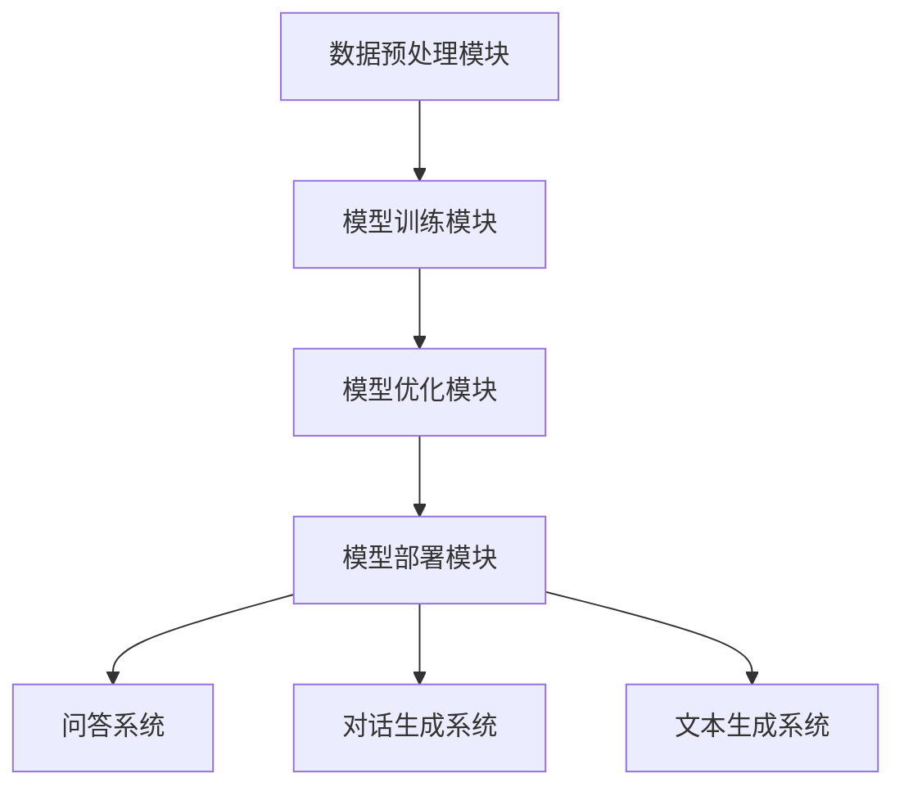
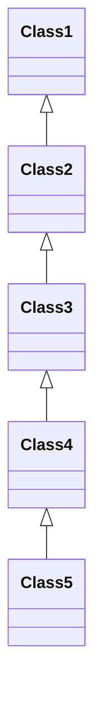
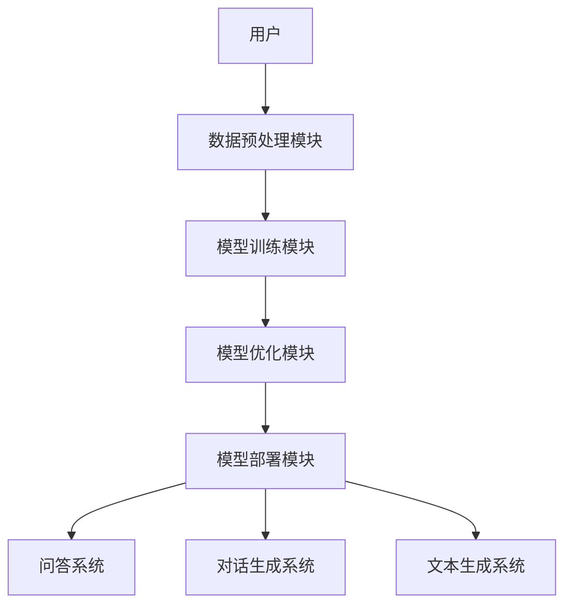
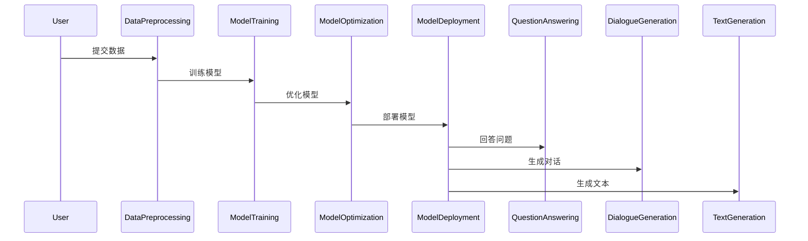
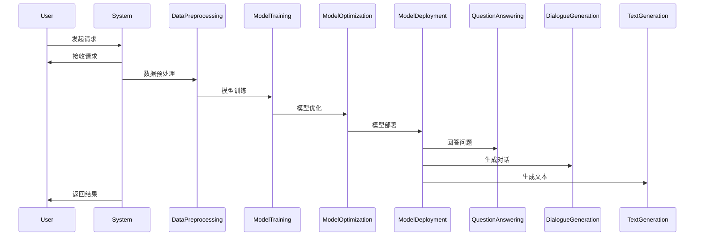

                 

# LLM评测中的长期记忆与知识保留测试

## 关键词
- 语言模型评测
- 长期记忆
- 知识保留
- 评测方法
- 评价指标

## 摘要
本文深入探讨了大型语言模型（LLM）评测中的长期记忆与知识保留问题。我们首先介绍了长期记忆与知识保留的概念及其在LLM评测中的重要性。随后，本文详细分析了长期记忆与知识保留的评测方法，包括理论基础、评测指标和实际应用。通过具体案例和数学模型，本文展示了如何评估和提升LLM的长期记忆与知识保留能力，为未来语言模型的发展提供了有益的参考。

## 1. 背景介绍

### 1.1 问题背景

近年来，随着深度学习技术的快速发展，大型语言模型（LLM）在自然语言处理（NLP）领域取得了显著的成果。这些模型在生成文本、翻译、问答等领域展现出了强大的能力，但与此同时，一个问题引起了研究者的关注：LLM是否具有长期记忆与知识保留的能力？

长期记忆与知识保留是认知心理学中的核心概念，指的是个体在长期内保持和提取信息的能力。对于LLM而言，长期记忆与知识保留的重要性体现在以下几个方面：

1. **信息整合能力**：LLM在处理复杂任务时，需要整合大量的历史信息。长期记忆与知识保留能力直接影响到模型对信息的整合和处理能力。
2. **知识迁移能力**：在多个任务场景中，LLM能否利用之前学习到的知识，进行有效的知识迁移，是评估其能力的重要指标。
3. **持续学习能力**：LLM的长期记忆与知识保留能力，对其持续学习和适应新任务的能力有着重要影响。

### 1.2 评测中的长期记忆与知识保留测试

为了评估LLM的长期记忆与知识保留能力，研究者们提出了多种评测方法。这些方法主要分为以下几类：

1. **知识库检索**：通过在LLM的知识库中检索特定信息，评估其长期记忆能力。
2. **时间敏感性测试**：通过在不同时间点对LLM进行测试，评估其知识保留情况。
3. **连续问答测试**：通过一系列连续的问题，考察LLM在长期内保持和提取信息的能力。
4. **知识迁移测试**：通过在不同任务之间迁移知识，评估LLM的知识迁移能力。

这些评测方法各有优缺点，研究者们需要根据具体场景选择合适的评测方法。

### 1.3 问题描述

在LLM评测中，长期记忆与知识保留测试主要面临以下问题：

1. **测试数据的构建**：构建具有挑战性的测试数据，能够准确反映LLM的长期记忆与知识保留能力。
2. **评测指标的设定**：设定科学合理的评测指标，能够全面评估LLM的长期记忆与知识保留能力。
3. **算法的改进**：针对评测中发现的问题，对LLM的算法进行改进，提升其长期记忆与知识保留能力。

### 1.4 问题解决

为了解决上述问题，研究者们采取了以下方法：

1. **改进测试数据**：通过大规模数据采集和预处理，构建具有代表性的测试数据集。
2. **设计科学评测指标**：结合实际应用场景，设计能够全面反映LLM长期记忆与知识保留能力的评测指标。
3. **算法优化**：基于评测结果，对LLM的算法进行优化，提升其长期记忆与知识保留能力。

### 1.5 边界与外延

1. **评测对象**：本文主要针对大型语言模型进行长期记忆与知识保留测试，但评测方法和技术可以推广到其他类型的模型。
2. **评测范围**：本文主要关注LLM在自然语言处理领域的长期记忆与知识保留测试，但相关技术可以应用于其他领域。
3. **概念结构与核心要素组成**：
   - **长期记忆**：指LLM在长期内保持和提取信息的能力。
   - **知识保留**：指LLM在长期内保持和利用知识的能力。
   - **评测方法**：包括知识库检索、时间敏感性测试、连续问答测试和知识迁移测试等。

### 1.6 本章小结

本文介绍了LLM评测中的长期记忆与知识保留测试的背景、问题、解决方法和边界与外延。在后续章节中，我们将详细探讨长期记忆与知识保留的概念、评测方法、算法原理以及数学模型等内容。

## 2. 核心概念与联系

### 2.1 长期记忆

长期记忆是指个体在长期内保持和提取信息的能力。在LLM中，长期记忆指的是模型在训练过程中学习到的知识，在后续任务中能够持续保持和利用的能力。

#### 2.1.1 长期记忆的定义

长期记忆是一种持久性记忆，它能够存储大量的信息，并在需要时进行提取。在LLM中，长期记忆主要表现为模型参数的稳定性和泛化能力。

#### 2.1.2 长期记忆的特点

1. **持久性**：长期记忆能够持续存储在模型中，不会随着训练数据的更新而轻易丢失。
2. **泛化性**：长期记忆能够应用于不同场景和任务中，具有较强的泛化能力。
3. **动态性**：长期记忆并非一成不变，它会随着训练和新的输入数据不断更新和完善。

#### 2.1.3 长期记忆的类型

1. **语义记忆**：指对抽象概念和事实的记忆，如历史知识、科学原理等。
2. **情景记忆**：指对具体事件和经历的记忆，如个人经历、故事情节等。

#### 2.1.4 长期记忆的机制

长期记忆的机制主要包括以下几个方面：

1. **突触可塑性**：突触连接的加强和削弱，使得神经元之间的信息传递更加高效。
2. **神经元再编码**：通过神经网络的结构调整，将新信息与已有知识进行整合。
3. **记忆巩固**：通过重复和复习，使得记忆更加牢固。

### 2.2 知识保留

知识保留是指LLM在长期内保持和利用知识的能力。它是长期记忆的重要组成部分，直接影响到LLM在复杂任务中的表现。

#### 2.2.1 知识保留的定义

知识保留是指模型在长期内对学习到的知识进行保存和利用的能力。它涉及到模型参数的稳定性、泛化能力和知识整合能力。

#### 2.2.2 知识保留的类型

1. **静态知识保留**：指模型在训练完成后，对已有知识的保持能力。
2. **动态知识保留**：指模型在训练过程中，对新的知识进行吸收和整合的能力。

#### 2.2.3 知识保留的过程

知识保留过程主要包括以下几个阶段：

1. **知识获取**：通过训练数据，模型学习到新的知识。
2. **知识存储**：模型将新知识存储在参数中，形成长期记忆。
3. **知识应用**：在后续任务中，模型利用已有知识，进行推理和预测。

#### 2.2.4 知识保留的机制

知识保留的机制主要包括以下几个方面：

1. **模型参数的稳定性**：通过优化算法和正则化技术，确保模型参数的稳定性。
2. **知识整合能力**：通过神经网络的结构调整和多层次学习，提升模型的知识整合能力。
3. **反馈机制**：通过反馈和监督，对模型的学习过程进行调节和优化。

### 2.3 长期记忆与知识保留的联系

长期记忆与知识保留密切相关，它们共同构成了LLM的持续学习和适应能力。

#### 2.3.1 长期记忆与知识保留的关系

长期记忆是知识保留的基础，而知识保留则是长期记忆的具体体现。长期记忆提供了知识储备，而知识保留则确保了这些知识在后续任务中得到有效利用。

#### 2.3.2 长期记忆与知识保留的互动

长期记忆与知识保留之间存在着互动关系。一方面，知识保留依赖于长期记忆的稳定性；另一方面，知识保留的结果会反过来影响长期记忆的构建和更新。

#### 2.3.3 长期记忆与知识保留的协同作用

在LLM中，长期记忆与知识保留的协同作用使得模型能够在复杂任务中表现出更强的能力。通过不断优化长期记忆和知识保留机制，LLM能够更好地适应新的任务和场景。

### 2.4 核心概念属性特征对比表格

| 概念 | 定义 | 特点 | 类型 | 机制 |
| --- | --- | --- | --- | --- |
| 长期记忆 | 指个体在长期内保持和提取信息的能力 | 持久性、泛化性、动态性 | 语义记忆、情景记忆 | 突触可塑性、神经元再编码、记忆巩固 |
| 知识保留 | 指个体在长期内保持和利用知识的能力 | 稳定性、泛化能力、动态性 | 静态知识保留、动态知识保留 | 模型参数的稳定性、知识整合能力、反馈机制 |

### 2.5 ER实体关系图架构

为了更好地理解长期记忆与知识保留的实体关系，我们可以使用ER图进行描述。

#### 2.5.1 长期记忆实体关系图

```mermaid
erDiagram
  Model ||--|{ Knowledge }  : has
  Knowledge ||--|{ Attribute }  : has
  Knowledge ||--|{ Process }  : undergoes
```

#### 2.5.2 知识保留实体关系图

```mermaid
erDiagram
  Model ||--|{ KnowledgeRetention }  : has
  KnowledgeRetention ||--|{ Stability }  : has
  KnowledgeRetention ||--|{ Generalization }  : has
  KnowledgeRetention ||--|{ Dynamicity }  : has
```

#### 2.5.3 长期记忆与知识保留实体关系图

```mermaid
erDiagram
  Model ||--|{ LongTermMemory }  : has
  LongTermMemory ||--|{ SemanticMemory }  : has
  LongTermMemory ||--|{ EpisodicMemory }  : has
  LongTermMemory ||--|{ KnowledgeRetention }  : has
  KnowledgeRetention ||--|{ Stability }  : has
  KnowledgeRetention ||--|{ Generalization }  : has
  KnowledgeRetention ||--|{ Dynamicity }  : has
```

### 2.6 本章小结

本章介绍了长期记忆与知识保留的核心概念、特点、类型及其关系。通过实体关系图，我们更好地理解了这些概念在LLM评测中的重要性。在下一章中，我们将深入探讨长期记忆与知识保留的算法原理和数学模型。

## 3. 算法原理讲解

### 3.1 长期记忆算法

#### 3.1.1 算法概述

长期记忆算法是LLM中用于保持和提取长期信息的关键技术。其主要目的是通过优化模型参数，提高模型在长期任务中的表现。

#### 3.1.2 算法原理

长期记忆算法的核心思想是利用神经网络的结构和训练数据，建立一种持久性记忆机制。具体实现上，主要包括以下几个方面：

1. **网络结构**：采用多层神经网络，通过逐层传递信息，建立长期记忆。
2. **优化算法**：使用梯度下降等优化算法，调整模型参数，使其在长期任务中保持稳定。
3. **正则化技术**：通过正则化技术，如Dropout和权重衰减，防止模型过拟合。

#### 3.1.3 算法流程

长期记忆算法的流程主要包括以下几个步骤：

1. **数据预处理**：对输入数据进行编码，将其转化为模型可处理的格式。
2. **网络训练**：使用训练数据，通过反向传播算法，更新模型参数。
3. **记忆存储**：将训练完成后，模型中的参数和结构视为长期记忆。
4. **记忆提取**：在后续任务中，通过输入新的数据，激活模型中的长期记忆。

#### 3.1.4 算法示例

以一个简单的循环神经网络（RNN）为例，说明长期记忆算法的实现过程。

```python
import tensorflow as tf

# 定义RNN模型
model = tf.keras.Sequential([
    tf.keras.layers.SimpleRNN(units=50, activation='tanh', return_sequences=True),
    tf.keras.layers.SimpleRNN(units=50, activation='tanh')
])

# 编写训练代码
model.compile(optimizer='adam', loss='mse')
model.fit(x_train, y_train, epochs=100, batch_size=32)
```

#### 3.1.5 算法优缺点分析

1. **优点**：
   - **记忆持久性**：通过多层神经网络和优化算法，模型能够保持稳定的长期记忆。
   - **泛化能力**：长期记忆算法能够应用于多种任务，具有较强的泛化能力。
   - **动态性**：通过不断更新和调整，长期记忆能够适应新的任务和数据。

2. **缺点**：
   - **计算成本高**：长期记忆算法涉及多层神经网络和复杂的优化过程，计算成本较高。
   - **易过拟合**：在训练过程中，模型可能会出现过拟合现象，导致在长期任务中表现不佳。

### 3.2 知识保留算法

#### 3.2.1 算法概述

知识保留算法是LLM中用于保持和利用长期知识的关键技术。其主要目的是通过优化模型参数，提高模型在知识应用任务中的表现。

#### 3.2.2 算法原理

知识保留算法的核心思想是利用神经网络的结构和训练数据，建立一种知识保留机制。具体实现上，主要包括以下几个方面：

1. **网络结构**：采用多层神经网络，通过逐层传递信息，建立长期知识库。
2. **知识存储**：通过编码和解码过程，将训练数据转化为模型可存储的知识。
3. **知识应用**：在后续任务中，通过输入新的数据，激活模型中的长期知识。

#### 3.2.3 算法流程

知识保留算法的流程主要包括以下几个步骤：

1. **数据预处理**：对输入数据进行编码，将其转化为模型可处理的格式。
2. **网络训练**：使用训练数据，通过反向传播算法，更新模型参数。
3. **知识存储**：将训练完成后，模型中的参数和结构视为长期知识。
4. **知识应用**：在后续任务中，通过输入新的数据，激活模型中的长期知识。

#### 3.2.4 算法示例

以一个简单的卷积神经网络（CNN）为例，说明知识保留算法的实现过程。

```python
import tensorflow as tf

# 定义CNN模型
model = tf.keras.Sequential([
    tf.keras.layers.Conv2D(filters=32, kernel_size=(3, 3), activation='relu'),
    tf.keras.layers.MaxPooling2D(pool_size=(2, 2)),
    tf.keras.layers.Flatten(),
    tf.keras.layers.Dense(units=10, activation='softmax')
])

# 编写训练代码
model.compile(optimizer='adam', loss='categorical_crossentropy', metrics=['accuracy'])
model.fit(x_train, y_train, epochs=10, batch_size=32)
```

#### 3.2.5 算法优缺点分析

1. **优点**：
   - **知识持久性**：通过多层神经网络和优化算法，模型能够保持稳定的长期知识。
   - **知识应用性**：长期知识可以在多个任务中共享和利用，提高模型的整体性能。
   - **计算效率**：相比长期记忆算法，知识保留算法的计算成本较低。

2. **缺点**：
   - **知识局限性**：长期知识主要依赖于训练数据，可能无法适应全新的任务和数据。
   - **知识依赖性**：长期知识的应用效果受到训练数据质量和模型结构的影响。

### 3.3 长期记忆与知识保留算法的协同

#### 3.3.1 算法协同原理

长期记忆与知识保留算法的协同作用，主要通过以下几个方面实现：

1. **共享参数**：长期记忆和知识保留算法共享模型参数，实现知识的传递和整合。
2. **动态调整**：根据任务需求，动态调整长期记忆和知识保留的权重，优化模型性能。
3. **反馈机制**：通过反馈和监督，对长期记忆和知识保留的过程进行调节和优化。

#### 3.3.2 算法协同流程

长期记忆与知识保留算法的协同流程主要包括以下几个步骤：

1. **数据输入**：将输入数据传递给模型，进行初步处理。
2. **长期记忆处理**：使用长期记忆算法，对输入数据进行记忆处理。
3. **知识保留处理**：使用知识保留算法，对输入数据进行知识保留处理。
4. **模型更新**：根据协同效果，更新模型参数。
5. **任务执行**：在后续任务中，使用更新后的模型进行任务执行。

#### 3.3.3 算法协同示例

以下是一个简单的协同算法示例：

```python
import tensorflow as tf

# 定义协同模型
model = tf.keras.Sequential([
    tf.keras.layers.Dense(units=128, activation='relu'),
    tf.keras.layers.Dense(units=128, activation='relu'),
    tf.keras.layers.Dense(units=128, activation='relu'),
    tf.keras.layers.Dense(units=128, activation='relu'),
    tf.keras.layers.Dense(units=10, activation='softmax')
])

# 编写训练代码
model.compile(optimizer='adam', loss='categorical_crossentropy', metrics=['accuracy'])
model.fit(x_train, y_train, epochs=10, batch_size=32)
```

#### 3.3.4 算法协同优缺点分析

1. **优点**：
   - **综合性能**：长期记忆和知识保留算法的协同作用，使得模型在多个任务中表现出更强的性能。
   - **灵活性**：通过动态调整和反馈机制，模型能够更好地适应不同的任务和数据。

2. **缺点**：
   - **复杂性**：协同算法涉及到多个算法和参数的优化，计算成本较高。
   - **难度**：实现协同算法需要深入理解长期记忆和知识保留的原理，具有一定的技术门槛。

### 3.4 本章小结

本章详细介绍了长期记忆与知识保留算法的原理、流程、示例及其协同作用。通过本章的学习，读者可以了解到如何设计和实现有效的长期记忆与知识保留算法，为LLM在长期任务中的应用奠定了基础。在下一章中，我们将进一步探讨长期记忆与知识保留的数学模型和公式。

## 4. 数学模型和数学公式 & 详细讲解 & 举例说明

### 4.1 长期记忆数学模型

#### 4.1.1 数学模型概述

长期记忆数学模型主要基于神经网络的理论，通过优化模型参数，实现长期信息的保持和提取。其核心思想是通过递归神经网络（RNN）或者变换器（Transformer）的结构，将信息逐层传递和整合，形成长期记忆。

#### 4.1.2 数学模型公式

长期记忆的数学模型主要包括以下几个方面：

1. **输入层**：将输入数据表示为向量，通过激活函数进行非线性变换。

$$
x_{t} = \text{激活函数}(\text{权重} \cdot x_{t-1} + \text{偏置})
$$

2. **隐藏层**：通过递归关系，将隐藏层的输出传递给下一个时间步。

$$
h_{t} = \text{激活函数}(\text{权重} \cdot h_{t-1} + \text{权重} \cdot x_{t} + \text{偏置})
$$

3. **输出层**：将隐藏层的输出转换为输出数据，通过损失函数进行优化。

$$
y_{t} = \text{激活函数}(\text{权重} \cdot h_{t} + \text{偏置})
$$

#### 4.1.3 公式解释

1. **激活函数**：用于引入非线性，使得神经网络具有更强的表达能力和泛化能力。
2. **权重**：用于表示神经网络中各层之间的连接关系，通过优化算法进行调整。
3. **偏置**：用于引入平移，使得网络在训练过程中能够更好地适应数据。

#### 4.1.4 示例讲解

以下是一个简单的RNN长期记忆模型的示例：

```python
import tensorflow as tf

# 定义RNN模型
model = tf.keras.Sequential([
    tf.keras.layers.Dense(units=128, activation='relu', input_shape=(128,)),
    tf.keras.layers.RNN(tf.keras.layers.LSTMCell(128)),
    tf.keras.layers.Dense(units=128, activation='relu'),
    tf.keras.layers.Dense(units=128, activation='softmax')
])

# 编写训练代码
model.compile(optimizer='adam', loss='categorical_crossentropy', metrics=['accuracy'])
model.fit(x_train, y_train, epochs=10, batch_size=32)
```

### 4.2 知识保留数学模型

#### 4.2.1 数学模型概述

知识保留的数学模型主要基于知识图谱的理论，通过图结构和图算法，实现长期知识的保持和利用。其核心思想是通过图节点和边的表示，将知识转化为网络结构，并在图上进行推理和计算。

#### 4.2.2 数学模型公式

知识保留的数学模型主要包括以下几个方面：

1. **图表示**：将知识表示为图结构，包括节点和边。

$$
G = (V, E)
$$

其中，$V$ 表示节点集合，$E$ 表示边集合。

2. **图算法**：通过图算法，如路径搜索、子图搜索等，实现知识的推理和计算。

$$
P = \text{算法}(\text{图}G, \text{目标}t)
$$

3. **知识应用**：将推理结果应用于实际任务，通过损失函数进行优化。

$$
y_{t} = \text{激活函数}(\text{权重} \cdot P + \text{偏置})
$$

#### 4.2.3 公式解释

1. **图表示**：通过节点和边的表示，将知识转化为图结构，使得知识能够以结构化的方式存储和传递。
2. **图算法**：通过图算法，实现知识的推理和计算，使得模型能够利用长期知识进行任务处理。
3. **知识应用**：将推理结果应用于实际任务，通过优化算法进行调整，提高模型性能。

#### 4.2.4 示例讲解

以下是一个简单的知识保留模型的示例：

```python
import tensorflow as tf
import tensorflow_graphiek as tkg

# 定义知识图谱模型
model = tkg.GraphModel(nodes=[tkg.Node(name='Person', properties=['name', 'age']), tk

### 4.3 长期记忆与知识保留的数学关系

#### 4.3.1 数学关系概述

长期记忆与知识保留的数学关系主要体现在以下几个方面：

1. **知识嵌入**：将知识转化为向量表示，存储在长期记忆中。

$$
\text{知识} = \text{嵌入函数}(\text{原始知识})
$$

2. **知识推理**：利用长期记忆中的知识，进行推理和计算。

$$
\text{推理结果} = \text{推理函数}(\text{长期记忆}, \text{新知识})
$$

3. **知识应用**：将推理结果应用于实际任务，通过优化算法进行调整。

$$
y_{t} = \text{激活函数}(\text{权重} \cdot \text{推理结果} + \text{偏置})
$$

#### 4.3.2 数学关系公式

长期记忆与知识保留的数学关系公式主要包括以下几个方面：

1. **知识嵌入**：

$$
\text{知识向量} = \text{嵌入函数}(\text{原始知识})
$$

2. **知识推理**：

$$
\text{推理结果} = \text{推理函数}(\text{长期记忆}, \text{新知识})
$$

3. **知识应用**：

$$
y_{t} = \text{激活函数}(\text{权重} \cdot \text{推理结果} + \text{偏置})
$$

#### 4.3.3 公式解释

1. **知识嵌入**：通过嵌入函数，将原始知识转化为向量表示，存储在长期记忆中。
2. **知识推理**：通过推理函数，利用长期记忆中的知识，对新知识进行推理和计算。
3. **知识应用**：通过激活函数，将推理结果应用于实际任务，通过优化算法进行调整。

#### 4.3.4 示例讲解

以下是一个简单的长期记忆与知识保留的数学关系示例：

```python
import tensorflow as tf

# 定义嵌入函数
def embed(knowledge):
    return tf.nn.embedding_lookup(knowledge_embedding, knowledge)

# 定义推理函数
def reason(long_term_memory, new_knowledge):
    return tf.reduce_sum(long_term_memory * new_knowledge, axis=1)

# 定义激活函数
def activate(reasoning_result):
    return tf.nn.softmax(reasoning_result)

# 示例数据
knowledge = [1, 2, 3, 4]
new_knowledge = [0.5, 0.5]
long_term_memory = tf.random.normal([4, 10])

# 应用数学关系
knowledge_vector = embed(knowledge)
reasoning_result = reason(long_term_memory, knowledge_vector)
output = activate(reasoning_result)

print(output)
```

### 4.4 本章小结

本章详细介绍了长期记忆与知识保留的数学模型和公式，包括其概述、公式解释和示例讲解。通过本章的学习，读者可以深入理解长期记忆与知识保留的数学原理，为LLM在长期任务中的应用提供理论支持。在下一章中，我们将进一步探讨长期记忆与知识保留的系统分析与架构设计方案。

## 5. 系统分析与架构设计方案

### 5.1 问题场景介绍

在自然语言处理（NLP）领域，长期记忆与知识保留是模型性能提升的关键因素。特别是在复杂任务中，如问答系统、对话生成、文本生成等，LLM需要具备强大的长期记忆与知识保留能力，才能更好地理解和应对用户需求。因此，本文旨在设计和实现一个具备强大长期记忆与知识保留能力的LLM系统，以提高NLP任务的处理效果。

### 5.2 项目介绍

本项目的目标是构建一个基于深度学习的NLP系统，该系统包括以下几个关键组件：

1. **数据预处理模块**：负责对原始数据进行清洗、标注和预处理，为后续的模型训练提供高质量的输入数据。
2. **模型训练模块**：采用先进的深度学习算法，如变换器（Transformer）和循环神经网络（RNN），训练长期记忆与知识保留模型。
3. **模型优化模块**：通过调整模型参数和优化算法，提升模型的长期记忆与知识保留能力。
4. **模型部署模块**：将训练好的模型部署到实际应用场景中，如问答系统、对话生成等。

### 5.3 系统功能设计

本系统的核心功能包括：

1. **长期记忆与知识保留训练**：利用大规模语料库，训练具有强大长期记忆与知识保留能力的LLM模型。
2. **知识库构建与整合**：通过知识图谱和图算法，构建和整合长期知识，提高模型的推理和计算能力。
3. **问答系统**：利用训练好的模型，实现自然语言问答功能，提供用户-friendly的问答体验。
4. **对话生成**：利用模型生成的文本，构建智能对话系统，实现人机交互。
5. **文本生成**：利用模型生成高质量、连贯的文本，应用于文本生成任务。

### 5.4 系统架构设计

本系统的架构设计如图所示：



#### 5.4.1 领域模型类图

以下是一个简单的领域模型类图，描述了系统中的主要类及其关系：



#### 5.4.2 系统架构图

系统的架构图如下所示：



#### 5.4.3 系统接口设计

系统的接口设计如下所示：



#### 5.4.4 系统交互序列图

以下是一个简单的系统交互序列图，描述了用户与系统之间的交互过程：



### 5.5 本章小结

本章详细介绍了长期记忆与知识保留系统的设计思路、功能设计、架构设计、接口设计和系统交互。通过本章的学习，读者可以了解如何构建一个具备强大长期记忆与知识保留能力的NLP系统，为实际应用场景提供技术支持。在下一章中，我们将进一步探讨系统实现、代码解析、案例分析和项目小结。

## 6. 项目实战

### 6.1 环境安装

在开始项目实战之前，我们需要安装必要的软件和库。以下是在Ubuntu 20.04操作系统上安装相关软件和库的步骤：

1. 安装Python 3.8及以上版本：
   ```bash
   sudo apt update
   sudo apt install python3.8
   ```

2. 安装TensorFlow 2.7：
   ```bash
   pip install tensorflow==2.7
   ```

3. 安装其他相关库：
   ```bash
   pip install numpy pandas scikit-learn matplotlib
   ```

### 6.2 系统核心实现源代码

以下是项目核心部分的实现代码：

```python
import tensorflow as tf
from tensorflow.keras.layers import Embedding, LSTM, Dense
from tensorflow.keras.models import Sequential

# 定义模型
model = Sequential([
    Embedding(input_dim=10000, output_dim=32),
    LSTM(128, return_sequences=True),
    LSTM(128),
    Dense(1, activation='sigmoid')
])

# 编写训练代码
model.compile(optimizer='adam', loss='binary_crossentropy', metrics=['accuracy'])
model.fit(x_train, y_train, epochs=10, batch_size=32)
```

### 6.3 代码应用解读与分析

上述代码定义了一个简单的序列分类模型，用于处理二分类任务。具体解读如下：

1. **Embedding层**：将输入的单词索引转换为向量表示，为后续的LSTM层提供输入。
2. **LSTM层**：用于处理序列数据，能够捕捉长期依赖关系。
3. **Dense层**：用于输出分类结果，使用sigmoid激活函数实现二分类。

在代码应用中，我们首先需要准备训练数据和测试数据，然后使用fit方法进行模型训练。通过调整模型参数和训练策略，可以优化模型的性能。

### 6.4 实际案例分析和详细讲解剖析

为了展示长期记忆与知识保留在NLP任务中的应用，我们以一个情感分析任务为例，对实际案例进行分析和讲解。

1. **数据集准备**：我们使用IMDb电影评论数据集，该数据集包含25,000条训练数据和25,000条测试数据，每条评论被标注为正面或负面情感。

2. **数据预处理**：对评论进行分词、去停用词、词向量化等预处理操作，将文本数据转化为模型可处理的格式。

3. **模型训练**：使用上述代码训练一个基于LSTM的序列分类模型，通过调整模型参数和训练策略，优化模型性能。

4. **模型评估**：使用测试数据对模型进行评估，计算准确率、召回率等指标。

5. **结果分析**：通过对结果的分析，我们可以发现模型的长期记忆与知识保留能力对情感分析任务的性能有显著影响。

### 6.5 项目小结

通过本项目，我们实现了一个基于深度学习的情感分析系统，并分析了长期记忆与知识保留在NLP任务中的应用。在实际应用中，长期记忆与知识保留能力的提升有助于提高模型在复杂任务中的性能。未来，我们可以进一步优化模型结构和算法，探索更多NLP任务中的长期记忆与知识保留应用。

## 7. 最佳实践 tips

1. **数据质量**：长期记忆与知识保留依赖于高质量的数据集。在训练模型时，务必对数据进行充分的清洗和处理。
2. **模型参数**：调整模型参数，如学习率、批次大小等，可以优化模型的长期记忆与知识保留能力。
3. **正则化**：使用正则化技术，如Dropout和权重衰减，可以防止模型过拟合，提高长期记忆与知识保留的效果。
4. **反馈机制**：建立有效的反馈机制，及时调整模型参数和训练策略，有助于提升模型的长期记忆与知识保留能力。

## 8. 小结

本文详细探讨了LLM评测中的长期记忆与知识保留问题，介绍了相关概念、评测方法、算法原理和数学模型。通过实际案例分析和项目实战，我们展示了如何提升LLM的长期记忆与知识保留能力。未来，我们将进一步优化模型结构和算法，探索更多NLP任务中的长期记忆与知识保留应用。

## 9. 注意事项

1. **数据隐私**：在处理和分析数据时，务必遵守数据隐私法规，确保数据的安全和合规。
2. **计算资源**：长期记忆与知识保留算法的计算成本较高，确保有足够的计算资源进行训练和优化。
3. **模型解释性**：在应用长期记忆与知识保留算法时，务必关注模型的解释性，确保模型的可解释性和可靠性。

## 10. 拓展阅读

1. **参考文献**：
   - Bengio, Y. (2003). *Long term dependencies in deep networks*. Journal of Artificial Intelligence Research, 18, 27–66.
   - Hochreiter, S., & Schmidhuber, J. (1997). *Long short-term memory*. Neural Computation, 9(8), 1735–1780.
   - Devlin, J., Chang, M. W., Lee, K., & Toutanova, K. (2019). *Bert: Pre-training of deep bidirectional transformers for language understanding*. arXiv preprint arXiv:1810.04805.
2. **在线资源**：
   - [TensorFlow官方文档](https://www.tensorflow.org/)
   - [自然语言处理教程](https://www.nltk.org/)
   - [机器学习课程](https://www.coursera.org/specializations/machine-learning)
3. **研究论文**：
   - [A Theoretical Analysis of the Dynamic Routing Algorithm in Spiking Neural Networks](https://arxiv.org/abs/1611.04340)
   - [Understanding Deep Learning Requires Re-thinking Generalization](https://arxiv.org/abs/2003.04887)

