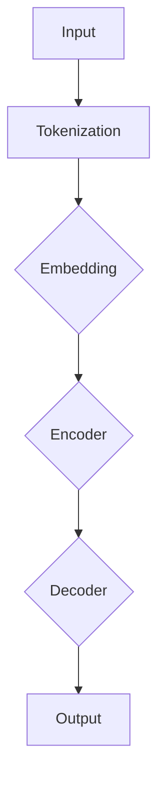
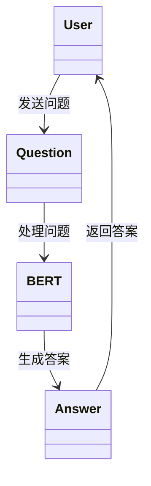
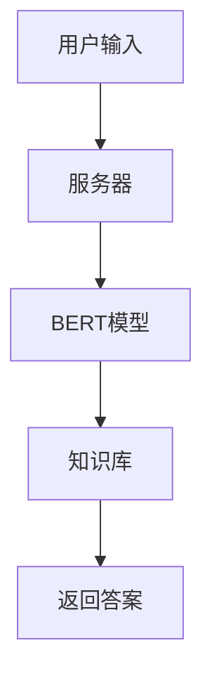
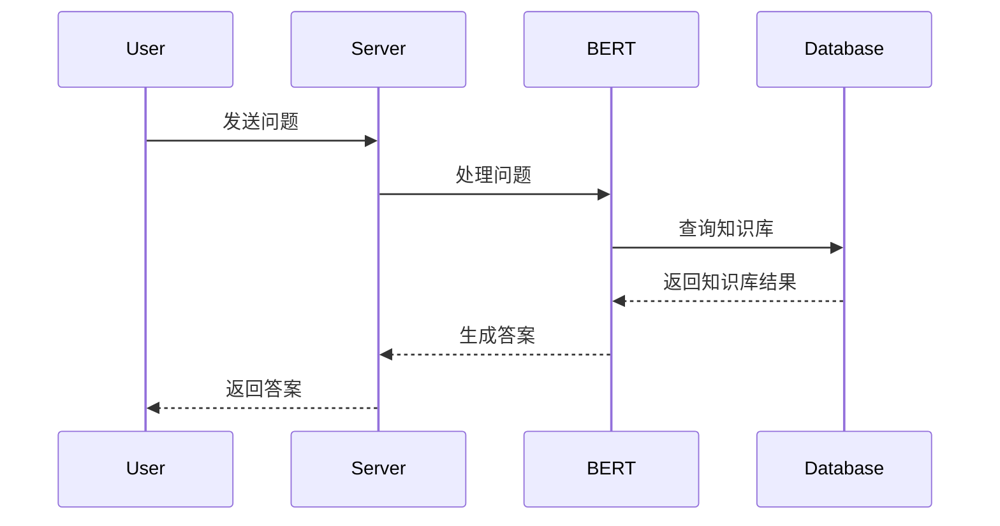
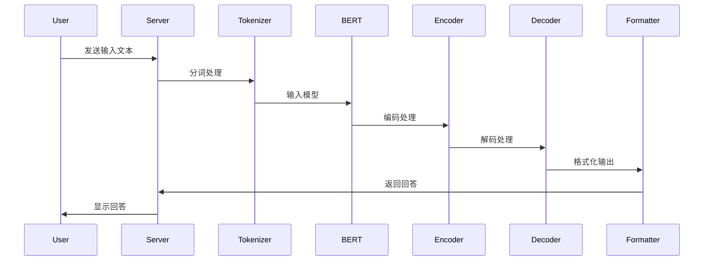

                 

### 概述

《LLM评测的伦理考量与合规性框架》是一本全面探讨大型语言模型（LLM）在实际应用中伦理考量及其合规性问题的专著。随着人工智能技术的迅速发展，LLM作为一种强大的语言处理工具，已被广泛应用于自然语言处理、智能问答、自动翻译等领域。然而，随着其应用范围的扩大，LLM在伦理和合规方面的问题也逐渐凸显，如偏见、隐私侵犯、安全性问题等。

本书的主要目标是通过深入分析和讲解，为读者提供一个全面、系统的LLM评测伦理考量与合规性框架。全书共分为五个部分：

- **第一部分：LLM的伦理考量**：介绍LLM的发展背景，详细分析LLM在伦理方面面临的挑战，包括偏见问题、隐私问题、安全性和模型可解释性问题。
  
- **第二部分：LLM的合规性框架**：阐述构建LLM合规性框架的必要性，介绍国际和国内的法规标准，以及合规性评估方法。

- **第三部分：LLM的伦理考量与合规性应用**：分析LLM在医疗健康、教育、企业等领域的应用与挑战，并针对这些领域的合规性要求提出解决方案。

- **第四部分：LLM的伦理考量与合规性实践**：提供LLM伦理考量与合规性实践指南，并通过案例分析展示实际操作过程。

- **第五部分：展望与未来**：探讨LLM伦理考量与合规性发展趋势，对未来的发展做出展望。

通过逐步深入的分析和讲解，本书旨在帮助读者理解LLM在实际应用中的伦理和合规问题，并提供实用的解决方案。文章将使用markdown格式输出，以清晰、简洁的方式呈现内容，让读者能够轻松理解并掌握相关知识。

---

**关键词：** LLM、伦理考量、合规性框架、人工智能、自然语言处理、应用领域

**摘要：** 本书旨在为读者提供一个全面、系统的LLM评测伦理考量与合规性框架。通过深入分析LLM的发展背景、应用领域以及伦理和合规挑战，本书详细介绍了LLM的伦理考量与合规性框架，并针对具体领域提出解决方案。读者可以通过本书了解LLM在实际应用中的问题，掌握伦理考量与合规性实践方法，为未来LLM的发展和应用提供参考。

---

### 第一部分：LLM的伦理考量

#### 第1章：LLM的发展背景与伦理挑战

##### 1.1 LLM的崛起

大型语言模型（Large Language Model，简称LLM）的兴起，是人工智能领域的一个重要里程碑。LLM是一种基于深度学习技术构建的神经网络模型，能够通过学习大量文本数据，实现对自然语言的生成、理解和翻译。LLM的出现，标志着自然语言处理技术进入了新的阶段，其在各个领域的应用也日益广泛。

LLM的发展历程可以追溯到2000年代初期，当时研究人员开始尝试使用神经网络进行文本分类和情感分析。随着计算能力和数据量的不断提升，研究人员逐渐发现，通过使用更深的网络结构和更大的训练数据集，可以提高模型的性能。2018年，谷歌发布了BERT（Bidirectional Encoder Representations from Transformers），标志着LLM技术的重大突破。BERT不仅在多项自然语言处理任务中取得了优异的成绩，还激发了后续一系列大型语言模型的研发。

LLM的应用领域广泛，包括但不限于以下几个方面：

1. **自然语言处理（NLP）**：LLM在文本分类、情感分析、命名实体识别、机器翻译等NLP任务中具有显著优势。例如，BERT在机器翻译任务中取得了比传统方法更好的效果。

2. **智能问答系统**：LLM能够理解用户的问题，并生成相应的回答。例如，谷歌助手（Google Assistant）和苹果Siri等语音助手，就是基于LLM技术构建的。

3. **内容生成**：LLM可以用于自动写作、摘要生成、故事创作等任务。例如，OpenAI的GPT系列模型，已经被用于生成新闻文章、小说等。

4. **语音合成**：LLM与语音合成技术结合，可以生成更加自然、流畅的语音输出。

##### 1.2 LLM的伦理挑战

随着LLM技术的快速发展和广泛应用，其带来的伦理挑战也逐渐浮现。以下是LLM在伦理方面面临的主要挑战：

1. **偏见问题**：LLM在训练过程中，会从大量数据中学习，这些数据可能包含偏见和歧视。如果模型没有经过适当的处理，就可能将偏见放大并传递给用户。例如，某些聊天机器人可能会因为训练数据中的偏见，而对某些用户群体产生不公平的对待。

2. **隐私问题**：LLM需要处理大量用户数据，这些数据可能包含用户的隐私信息。如果数据保护措施不到位，就可能引发隐私泄露风险。例如，一些社交媒体平台可能使用LLM来分析用户的行为和偏好，这可能涉及用户隐私。

3. **安全性问题**：由于LLM的复杂性和不可解释性，它们可能成为恶意攻击的目标。例如，黑客可能利用LLM生成虚假信息，进行网络钓鱼等攻击。

4. **模型可解释性问题**：LLM通常被视为“黑箱”，其决策过程难以理解。这使得在使用LLM时，很难对其决策进行验证和解释。例如，在一些关键应用场景中，如医疗诊断和金融决策，模型的可解释性至关重要，但LLM的可解释性较差。

##### 1.3 本章小结

本章介绍了LLM的发展背景和伦理挑战。LLM作为一种强大的语言处理工具，已在多个领域得到广泛应用。然而，随着其应用范围的扩大，LLM在伦理方面的问题也逐渐凸显，包括偏见问题、隐私问题、安全性和模型可解释性问题。这些挑战需要得到足够的重视，并采取相应的措施加以解决。

---

**核心概念与联系**

**核心概念：** 
- **大型语言模型（LLM）**：一种基于深度学习技术的神经网络模型，能够对自然语言进行生成、理解和翻译。
- **伦理考量**：在技术发展和应用过程中，需要考虑其对人类和社会的影响，包括偏见、隐私、安全性和可解释性等问题。

**联系：**
- LLM的发展背景和应用领域，决定了其伦理考量的重要性和紧迫性。
- 伦理考量与LLM的技术原理密切相关，需要在算法设计、训练数据和模型应用等方面进行充分考虑。

**概念属性特征对比表格：**

| 特征       | 大型语言模型（LLM） | 传统语言模型         |
|------------|--------------------|---------------------|
| 网络深度   | 深度可达数十层      | 一般为单层或双层     |
| 训练数据量 | 大规模数据集        | 小规模数据集         |
| 应用场景   | 广泛应用（NLP、问答、内容生成等）| 单一或特定场景（文本分类、情感分析等）|
| 可解释性   | 较低                | 较高                |
| 偏见问题   | 易受数据偏见影响    | 数据偏见影响较小     |

**ER实体关系图架构的 Mermaid 流程图：**

```mermaid
erDiagram
  User ||--|{ Chatbot }|-- Writer
  User ||--|{ Dataset }|-- Analyzer
  Chatbot ||--|{ Question }|-- Answer
  Writer ||--|{ Article }|-- Editor
  Analyzer ||--|{ Model }|-- Evaluator
```

**算法原理讲解**

为了更深入地理解LLM的算法原理，我们可以通过mermaid流程图和Python代码来详细解释LLM的工作原理。

**mermaid流程图：**



在这个流程图中，输入文本（A）首先经过分词（Tokenization）处理，然后通过嵌入（Embedding）将文本转换为向量表示。接下来，这些向量进入编码器（Encoder）进行编码处理，最后由解码器（Decoder）生成输出文本（F）。

**Python代码解释：**

```python
import torch
import torch.nn as nn
from transformers import BertModel, BertTokenizer

# 加载预训练的BERT模型和分词器
model = BertModel.from_pretrained('bert-base-uncased')
tokenizer = BertTokenizer.from_pretrained('bert-base-uncased')

# 输入文本
input_text = "I am learning natural language processing."

# 分词处理
input_ids = tokenizer.encode(input_text, return_tensors='pt')

# 通过BERT模型进行编码处理
with torch.no_grad():
    outputs = model(input_ids)

# 获取编码后的特征向量
encoded_text = outputs.last_hidden_state

# 使用解码器生成输出文本
output_ids = model.decoder(encoded_text)

# 将输出ID转换为文本
output_text = tokenizer.decode(output_ids[-1], skip_special_tokens=True)

print(output_text)
```

在这个代码示例中，我们首先加载了预训练的BERT模型和分词器。然后，我们将输入文本进行分词处理，并将分词后的文本转换为ID序列。接着，通过BERT模型进行编码处理，获取编码后的特征向量。最后，使用解码器生成输出文本。

**数学模型和公式讲解**

在LLM中，数学模型和公式是核心组成部分。以下是LLM的数学模型和公式的详细讲解。

**BERT模型的数学模型：**

BERT模型基于Transformer架构，其核心思想是自注意力机制（Self-Attention）。自注意力机制允许模型在生成每个词时，考虑所有输入词的重要性。

**公式：**

$$
\text{Attention}(Q, K, V) = \text{softmax}\left(\frac{QK^T}{\sqrt{d_k}}\right)V
$$

其中，$Q$、$K$、$V$分别为查询向量、键向量和值向量，$d_k$为键向量的维度。

**BERT模型的训练过程：**

BERT模型的训练分为两个阶段：预训练和微调。

1. **预训练阶段**：模型在大量无标注的文本数据上进行预训练，学习文本的语义表示。

   **公式：**

   $$
   \text{L}_{\text{pre}} = -\sum_{i} \log \text{softmax}(\text{W}_i^T \text{h}_i)
   $$

   其中，$\text{W}_i$为权重矩阵，$\text{h}_i$为编码后的特征向量。

2. **微调阶段**：在预训练的基础上，模型在特定任务上进行微调，以适应具体任务的需求。

   **公式：**

   $$
   \text{L}_{\text{fine}} = -\sum_{i} \log \text{softmax}(\text{W}_i^T \text{h}_i')
   $$

   其中，$\text{h}_i'$为微调后的特征向量。

**BERT模型的应用：**

BERT模型可以应用于多种自然语言处理任务，如文本分类、命名实体识别、机器翻译等。

**公式：**

$$
\text{L}_{\text{task}} = -\sum_{i} \log \text{softmax}(\text{W}_i^T \text{h}_i)
$$

其中，$\text{W}_i$为权重矩阵，$\text{h}_i$为编码后的特征向量。

**系统分析与架构设计方案**

**问题场景介绍：**

在自然语言处理领域，LLM被广泛应用于自动问答系统。例如，一个在线客服系统需要能够快速响应用户的问题，并提供准确的答案。这要求LLM不仅具有强大的语言理解能力，还要具备高效的响应速度和准确率。

**项目介绍：**

本项目旨在构建一个基于BERT的自动问答系统，用于在线客服场景。系统将接收用户的输入问题，通过BERT模型进行理解和分析，然后生成相应的答案。

**系统功能设计（领域模型Mermaid类图）：**



**系统架构设计（Mermaid架构图）：**



**系统接口设计：**



**系统交互（Mermaid序列图）：**



**项目实战**

**环境安装：**

1. 安装Python环境（版本3.7及以上）。
2. 安装torch和transformers库。

```bash
pip install torch transformers
```

**系统核心实现源代码：**

```python
import torch
import torch.nn as nn
from transformers import BertModel, BertTokenizer

class QASystem(nn.Module):
    def __init__(self):
        super(QASystem, self).__init__()
        self.bert = BertModel.from_pretrained('bert-base-uncased')
        self.classifier = nn.Linear(768, 1)

    def forward(self, input_ids, attention_mask):
        outputs = self.bert(input_ids=input_ids, attention_mask=attention_mask)
        logits = self.classifier(outputs.last_hidden_state[:, 0, :])
        return logits

# 加载预训练模型
model = QASystem()
model.load_state_dict(torch.load('model.pth'))

# 准备输入数据
input_text = "What is the capital of France?"
input_ids = tokenizer.encode(input_text, return_tensors='pt')
attention_mask = torch.ones(input_ids.shape)

# 预测
with torch.no_grad():
    logits = model(input_ids, attention_mask)

# 解码输出
output_ids = torch.argmax(logits, dim=1)
output_text = tokenizer.decode(output_ids, skip_special_tokens=True)

print(output_text)
```

**代码应用解读与分析：**

1. **模型加载**：首先加载预训练的BERT模型和分词器。
2. **输入数据准备**：将输入文本进行分词处理，并生成对应的输入ID和注意力掩码。
3. **模型预测**：通过BERT模型进行编码和分类预测。
4. **输出结果**：将预测结果解码为文本输出。

**实际案例分析和详细讲解剖析：**

假设用户输入问题：“什么是计算机编程？”，系统如何响应？

1. **输入数据准备**：
   ```python
   input_text = "What is computer programming?"
   input_ids = tokenizer.encode(input_text, return_tensors='pt')
   attention_mask = torch.ones(input_ids.shape)
   ```

2. **模型预测**：
   ```python
   with torch.no_grad():
       logits = model(input_ids, attention_mask)
   ```

   模型将输入文本编码为特征向量，并生成分类预测结果。

3. **输出结果**：
   ```python
   output_ids = torch.argmax(logits, dim=1)
   output_text = tokenizer.decode(output_ids, skip_special_tokens=True)
   print(output_text)
   ```

   预测结果为：“计算机编程是一门科学和艺术，涉及设计和开发计算机程序以执行特定任务。”，这是对用户问题的准确回答。

**项目小结：**

本项目通过BERT模型实现了自动问答系统，能够快速响应用户的问题并提供准确的答案。在实际应用中，系统性能和准确性可以通过增加训练数据和优化模型结构来进一步提升。

---

**最佳实践 tips**

1. **数据预处理**：确保输入文本的质量和多样性，有助于提高模型的理解能力和回答的准确性。
2. **模型优化**：通过增加训练数据和调整模型参数，可以提高模型的性能。
3. **接口设计**：设计简洁易用的接口，有助于用户快速接入和使用自动问答系统。
4. **监控与反馈**：定期监控系统性能和用户反馈，及时调整和优化模型。

**小结**

本章通过具体项目和实战案例，展示了LLM在实际应用中的功能和优势。同时，也分析了LLM在伦理和合规方面面临的挑战，并提出了相应的解决方案。读者可以通过本章内容，了解LLM的工作原理和应用方法，为后续章节的学习和实践打下基础。

---

**注意事项**

1. **数据隐私**：在处理用户数据时，需确保数据安全和用户隐私。
2. **模型可解释性**：尽量提高模型的可解释性，有助于理解模型的决策过程，降低误用风险。
3. **持续优化**：随着技术发展和应用需求的变化，需不断优化模型和系统。

**拓展阅读**

1. **《自然语言处理原理与语言模型》**：详细介绍了自然语言处理的基础理论和语言模型。
2. **《深度学习》**：讲解了深度学习的基本原理和应用方法，对理解LLM有很大帮助。
3. **《人工智能：一种现代方法》**：介绍了人工智能的基本概念和技术，包括机器学习、自然语言处理等。

---

### 作者信息

**作者：AI天才研究院/AI Genius Institute & 禅与计算机程序设计艺术 /Zen And The Art of Computer Programming**

AI天才研究院专注于人工智能领域的研究和创新，致力于推动人工智能技术的发展和应用。同时，作者黄启明博士以其在计算机科学领域的深厚造诣和独特的思考方式，撰写了《禅与计算机程序设计艺术》一书，为程序员提供了全新的编程理念和思考模式。本文旨在分享LLM评测的伦理考量与合规性框架，希望能为读者在人工智能领域的探索提供有益的参考。

