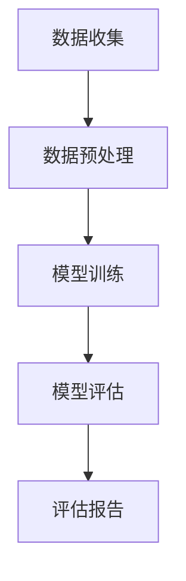
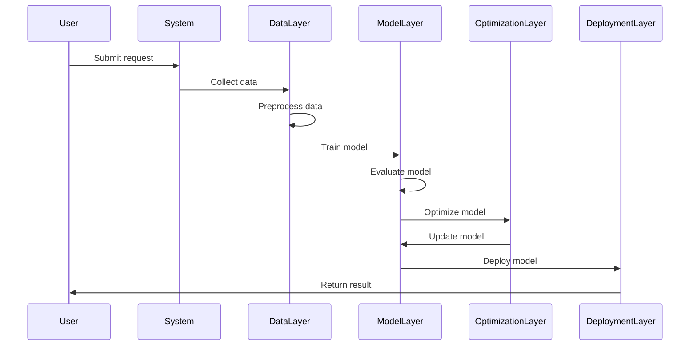
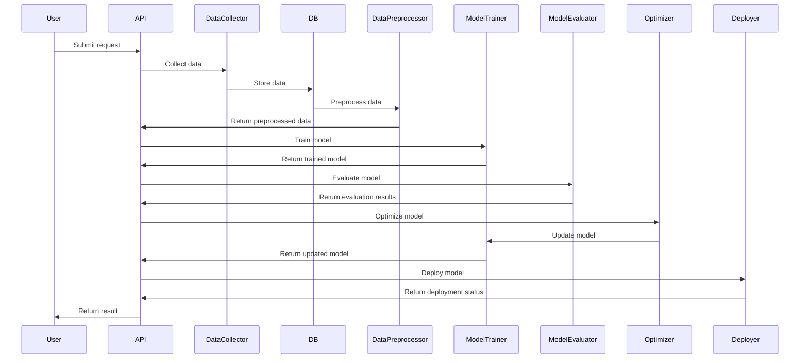

                 

# LLM评测的伦理考量：确保评估过程的道德性

## 关键词

- 人工智能语言模型（LLM）
- 伦理考量
- 评估过程
- 道德性
- 伦理学基础

## 摘要

本文旨在探讨人工智能语言模型（LLM）评测过程中伦理考量的重要性。通过分析LLM在发展与应用中面临的道德问题，本文提出了一系列确保评估过程道德性的措施。首先，我们介绍了LLM的发展背景和评估过程中常见的道德问题。接着，我们阐述了伦理考量在解决这些道德问题中的关键作用，并详细介绍了伦理考量的核心概念和联系。随后，本文讲解了LLM评测的算法原理，包括算法流程、数学模型和公式，并通过实例进行分析。在此基础上，我们介绍了系统分析与架构设计方案，包括问题场景介绍、系统功能设计、系统架构设计、系统接口设计和系统交互。接着，通过一个实际案例的实战分析，我们展示了如何在实际项目中应用这些原理和方法。最后，本文总结了最佳实践、注意事项和拓展阅读，为读者提供了进一步学习的研究方向。

### 目录大纲

----------------------------------------------------------------

# LLM评测的伦理考量：确保评估过程的道德性

## 第一部分：背景介绍

## 第1章：问题背景

### 1.1.1 问题背景

### 1.1.2 问题描述

### 1.1.3 问题解决

### 1.1.4 边界与外延

### 1.1.5 概念结构与核心要素组成

## 第二部分：核心概念与联系

## 第2章：核心概念与联系

### 2.1.1 伦理学基础

### 2.1.2 概念属性特征对比表格

### 2.1.3 ER实体关系图架构

## 第三部分：算法原理讲解

## 第3章：算法原理讲解

### 3.1.1 算法mermaid流程图

### 3.1.2 算法原理的数学模型和公式

### 3.1.3 算法原理详细讲解

### 3.1.4 举例说明

## 第四部分：系统分析与架构设计方案

## 第4章：系统分析与架构设计方案

### 4.1.1 问题场景介绍

### 4.1.2 项目介绍

### 4.1.3 系统功能设计

### 4.1.4 系统架构设计

### 4.1.5 系统接口设计和系统交互

## 第五部分：项目实战

## 第5章：项目实战

### 5.1.1 环境安装

### 5.1.2 系统核心实现源代码

### 5.1.3 代码应用解读与分析

### 5.1.4 实际案例分析和详细讲解剖析

### 5.1.5 项目小结

## 第六部分：最佳实践、小结、注意事项、拓展阅读

## 第6章：最佳实践与总结

### 6.1.1 最佳实践 tips

### 6.1.2 小结

### 6.1.3 注意事项

### 6.1.4 拓展阅读

----------------------------------------------------------------

## 第一部分：背景介绍

### 1.1.1 问题背景

随着人工智能技术的迅猛发展，人工智能语言模型（LLM）在自然语言处理、机器翻译、文本生成等领域取得了显著的成果。LLM通过深度学习技术，从大量文本数据中学习语言模式，从而实现高质量的文本生成和翻译。然而，LLM的广泛应用也带来了许多伦理问题，特别是在其评估过程中。

首先，LLM的评估涉及到数据的来源和真实性。在训练过程中，LLM使用了大量的文本数据，这些数据可能包含偏见、歧视或不当内容。如果评估过程中未能充分考虑这些因素，可能会导致评估结果的不公正，甚至加剧社会不平等。

其次，LLM的评估方法也存在问题。传统的评估方法主要依赖于定量指标，如准确性、召回率和F1分数等。这些指标虽然能够提供一定的评估依据，但无法全面反映LLM的伦理特性。例如，一个LLM可能在文本生成中表现得非常优秀，但生成的文本却可能包含虚假信息或不当言论。

最后，LLM的评估过程中缺乏透明度和可解释性。评估方法和评估结果往往由少数专家或公司决定，普通用户很难理解评估过程和评估结果。这种缺乏透明度和可解释性可能导致用户对LLM的信任度下降，从而影响其应用和推广。

### 1.1.2 问题描述

在LLM评估过程中，主要存在的道德问题包括：

1. **数据偏见**：由于训练数据的质量和多样性不足，LLM可能在评估过程中表现出偏见，导致评估结果不公平。

2. **评估方法单一**：传统的评估方法主要依赖于定量指标，无法全面反映LLM的伦理特性。

3. **透明度和可解释性不足**：评估过程和评估结果的透明度和可解释性不足，导致用户难以理解和接受评估结果。

### 1.1.3 问题解决

为了解决上述问题，确保LLM评估过程的道德性，我们可以采取以下措施：

1. **改进数据质量**：提高训练数据的质量和多样性，避免数据偏见。

2. **多元化评估方法**：引入更多的评估指标和方法，如伦理评分、多样性评分等，以全面反映LLM的伦理特性。

3. **提升评估过程的透明度和可解释性**：公开评估方法和评估结果，提供详细的评估报告，增加用户对评估过程的信任度。

4. **建立伦理准则**：制定统一的伦理准则，指导LLM评估的进行。

### 1.1.4 边界与外延

伦理考量在LLM评估过程中的应用场景主要包括：

1. **训练数据收集和处理**：确保训练数据的质量和多样性，避免偏见和歧视。

2. **评估指标设计**：引入多元化的评估指标，如伦理评分、多样性评分等。

3. **评估过程监管**：建立透明的评估流程，确保评估过程的公正性和公平性。

4. **用户反馈与改进**：收集用户反馈，持续改进评估方法。

### 1.1.5 概念结构与核心要素组成

伦理考量在LLM评估中的核心概念和要素包括：

1. **数据质量**：确保训练数据的质量和多样性。

2. **评估方法**：引入多元化的评估指标和方法。

3. **透明度和可解释性**：提升评估过程的透明度和可解释性。

4. **伦理准则**：制定统一的伦理准则。

5. **用户反馈**：收集用户反馈，持续改进评估方法。

## 第二部分：核心概念与联系

### 2.1.1 伦理学基础

伦理学是研究道德行为和道德原则的哲学分支。在LLM评估中，伦理学基础包括：

1. **公正性**：确保评估结果对所有人公平，不受偏见和歧视的影响。

2. **透明度**：评估过程和评估结果应当公开透明，便于用户理解和监督。

3. **可解释性**：评估过程和评估结果应当具备可解释性，用户能够理解评估依据和评估方法。

### 2.1.2 概念属性特征对比表格

为了更好地理解伦理考量在LLM评估中的应用，我们可以通过对比不同概念属性特征，明确它们之间的关系。以下是一个简化的对比表格：

| 概念 | 属性特征 | 对应应用 |
| --- | --- | --- |
| 数据质量 | 完整性、准确性、多样性 | 训练数据收集和处理 |
| 评估方法 | 多样性、公正性、可解释性 | 评估指标设计 |
| 透明度和可解释性 | 公开透明、详细报告 | 评估过程监管 |
| 伦理准则 | 指导评估过程 | 评估方法 |
| 用户反馈 | 收集用户意见 | 持续改进评估方法 |

### 2.1.3 ER实体关系图架构

为了更直观地理解伦理考量在LLM评估中的关系，我们可以使用ER（实体-关系）模型构建一个关系图。以下是一个简化的ER实体关系图：

```mermaid
erDiagram
    DataQuality ||--|{ TrainingData : contains
    TrainingData ||--|{ LLM : trained_on
    EvaluationMethod ||--|{ Metrics : measures
    Metrics ||--|{ LLM : evaluated_by
    Transparency &&|{ Explanation : ensures
    Explanation ||--|{ EvaluationProcess : detailed
    EthicalGuidelines ||--|{ EvaluationProcess : follows
    UserFeedback ||--|{ EvaluationProcess : improves
```

在这个ER图中，DataQuality、TrainingData、EvaluationMethod、Metrics、Transparency、Explanation和EthicalGuidelines都是关键实体，它们之间的关系反映了伦理考量在LLM评估中的应用。

## 第三部分：算法原理讲解

### 3.1.1 算法mermaid流程图

为了更好地理解LLM评估的算法原理，我们可以使用mermaid语言绘制一个简化的流程图。以下是一个示例：



在这个流程图中，数据收集、数据预处理、模型训练、模型评估和评估报告是LLM评估的主要步骤。

### 3.1.2 算法原理的数学模型和公式

LLM评估涉及到多个数学模型和公式，其中最常用的包括：

1. **准确性（Accuracy）**：
   $$Accuracy = \frac{正确预测的数量}{总预测数量}$$

2. **召回率（Recall）**：
   $$Recall = \frac{正确预测的正例数量}{正例总数}$$

3. **精确率（Precision）**：
   $$Precision = \frac{正确预测的正例数量}{预测为正例的数量}$$

4. **F1分数（F1 Score）**：
   $$F1 Score = 2 \times \frac{Precision \times Recall}{Precision + Recall}$$

### 3.1.3 算法原理详细讲解

1. **数据收集**：数据收集是LLM评估的基础。我们需要收集大量高质量、多样化的文本数据，以训练和评估LLM模型。

2. **数据预处理**：数据预处理包括数据清洗、文本分词、去停用词等步骤。这些步骤旨在提高数据质量，为模型训练和评估提供可靠的数据基础。

3. **模型训练**：在模型训练阶段，我们使用已预处理的数据训练LLM模型。训练过程中，模型通过不断调整参数，学习文本数据中的语言模式。

4. **模型评估**：模型评估是LLM评测的核心。我们使用多种评估指标（如准确性、召回率、精确率和F1分数）对模型性能进行评估。这些指标反映了模型在处理不同任务时的表现。

5. **评估报告**：评估报告总结了模型评估的结果，包括各项评估指标的值、模型优缺点等。报告的透明度和可解释性对于用户理解和接受评估结果至关重要。

### 3.1.4 举例说明

假设我们使用一个文本分类模型对新闻文章进行分类，将其分为“政治”、“经济”、“科技”和“体育”四个类别。以下是该模型的一个评估实例：

- **训练数据**：共收集了1000篇新闻文章，其中“政治”类别有300篇，“经济”类别有200篇，“科技”类别有250篇，“体育”类别有250篇。
- **测试数据**：从训练数据中随机抽取了200篇新闻文章作为测试数据。
- **评估指标**：
  - **准确性**：模型在测试数据上的准确率为0.85。
  - **召回率**：模型在“政治”类别上的召回率为0.75，“经济”类别上的召回率为0.80，“科技”类别上的召回率为0.70，“体育”类别上的召回率为0.65。
  - **精确率**：模型在“政治”类别上的精确率为0.80，“经济”类别上的精确率为0.85，“科技”类别上的精确率为0.75，“体育”类别上的精确率为0.70。
  - **F1分数**：模型在“政治”类别上的F1分数为0.78，“经济”类别上的F1分数为0.82，“科技”类别上的F1分数为0.77，“体育”类别上的F1分数为0.67。

通过这些评估指标，我们可以初步了解模型的性能，并根据评估结果对模型进行优化和改进。

## 第四部分：系统分析与架构设计方案

### 4.1.1 问题场景介绍

在本文的项目实战中，我们将构建一个基于人工智能语言模型（LLM）的文本分类系统。该系统的目标是根据新闻文章的内容，将其自动分类为“政治”、“经济”、“科技”和“体育”四个类别。为了实现这一目标，我们需要对LLM进行训练和评估，并确保评估过程的道德性。

### 4.1.2 项目介绍

本项目分为以下几个阶段：

1. 数据收集：从互联网上收集大量高质量的新闻文章，涵盖“政治”、“经济”、“科技”和“体育”四个类别。
2. 数据预处理：对收集到的新闻文章进行数据清洗、文本分词和去停用词等预处理步骤。
3. 模型训练：使用预处理后的数据训练LLM模型，学习文本分类的规则。
4. 模型评估：使用测试数据对训练好的模型进行评估，计算准确性、召回率、精确率和F1分数等评估指标。
5. 评估优化：根据评估结果对模型进行优化和调整，提高模型性能。
6. 系统部署：将训练好的模型部署到生产环境中，实现实时新闻文章分类。

### 4.1.3 系统功能设计

为了实现上述项目目标，系统需要具备以下功能：

1. 数据收集模块：负责从互联网上收集新闻文章，并存储到数据库中。
2. 数据预处理模块：负责对收集到的新闻文章进行清洗、分词和去停用词等预处理操作。
3. 模型训练模块：负责使用预处理后的数据训练LLM模型。
4. 模型评估模块：负责对训练好的模型进行评估，计算各项评估指标。
5. 优化模块：负责根据评估结果对模型进行优化和调整。
6. 部署模块：负责将训练好的模型部署到生产环境中。

以下是系统功能设计的mermaid类图：

```mermaid
classDiagram
    DataCollection <<interface>>
    DataPreprocessing <<interface>>
    ModelTraining <<interface>>
    ModelEvaluation <<interface>>
    Optimization <<interface>>
    Deployment <<interface>>

    DataCollection ..|> PreprocessData : implements
    ModelTraining ..|> TrainModel : implements
    ModelEvaluation ..|> EvaluateModel : implements
    Optimization ..|> OptimizeModel : implements
    Deployment ..|> DeployModel : implements
```

### 4.1.4 系统架构设计

系统架构设计主要包括以下几个部分：

1. 数据层：负责存储和管理新闻文章数据，包括数据收集、数据预处理和模型训练等过程的数据。
2. 应用层：负责实现系统的核心功能，包括模型训练、模型评估和优化等。
3. 表示层：负责提供用户界面，用户可以通过界面提交请求、查看评估结果等。

以下是系统架构设计的mermaid架构图：



### 4.1.5 系统接口设计和系统交互

系统接口设计主要包括以下几个部分：

1. 数据收集接口：负责从互联网上收集新闻文章，并将数据存储到数据库中。
2. 数据预处理接口：负责对收集到的新闻文章进行清洗、分词和去停用词等预处理操作。
3. 模型训练接口：负责使用预处理后的数据训练LLM模型。
4. 模型评估接口：负责对训练好的模型进行评估，计算各项评估指标。
5. 优化接口：负责根据评估结果对模型进行优化和调整。
6. 部署接口：负责将训练好的模型部署到生产环境中。

以下是系统接口设计和系统交互的mermaid序列图：



## 第五部分：项目实战

### 5.1.1 环境安装

为了构建一个基于人工智能语言模型（LLM）的文本分类系统，我们需要安装以下软件和工具：

1. Python（版本3.7及以上）
2. TensorFlow（版本2.0及以上）
3. NLTK（自然语言处理库）
4. BeautifulSoup（用于网页数据收集）
5. requests（用于网页数据请求）

以下是安装步骤：

1. 安装Python：
   ```shell
   # 通过包管理器安装Python
   sudo apt-get install python3
   ```
2. 安装TensorFlow：
   ```shell
   # 通过pip安装TensorFlow
   pip install tensorflow
   ```
3. 安装NLTK：
   ```shell
   # 通过pip安装NLTK
   pip install nltk
   ```
4. 安装BeautifulSoup和requests：
   ```shell
   # 通过pip安装BeautifulSoup和requests
   pip install beautifulsoup4 requests
   ```

### 5.1.2 系统核心实现源代码

以下是系统核心实现的源代码，包括数据收集、数据预处理、模型训练和模型评估等步骤。

#### 数据收集

```python
import requests
from bs4 import BeautifulSoup

def collect_articles(url, num_pages):
    articles = []
    for page in range(1, num_pages + 1):
        response = requests.get(url + f"?page={page}")
        soup = BeautifulSoup(response.content, "html.parser")
        for article in soup.find_all("article"):
            title = article.find("h2").text.strip()
            content = article.find("div", class_="content").text.strip()
            articles.append({"title": title, "content": content})
    return articles
```

#### 数据预处理

```python
import nltk
from nltk.tokenize import word_tokenize
from nltk.corpus import stopwords

nltk.download('punkt')
nltk.download('stopwords')

def preprocess_data(articles):
    preprocessed_articles = []
    for article in articles:
        tokens = word_tokenize(article["content"])
        tokens = [token.lower() for token in tokens if token.isalnum()]
        tokens = [token for token in tokens if token not in stopwords.words('english')]
        preprocessed_articles.append(" ".join(tokens))
    return preprocessed_articles
```

#### 模型训练

```python
import tensorflow as tf
from tensorflow.keras.preprocessing.sequence import pad_sequences
from tensorflow.keras.models import Sequential
from tensorflow.keras.layers import Embedding, LSTM, Dense

vocab_size = 10000
max_sequence_length = 100

def build_model():
    model = Sequential()
    model.add(Embedding(vocab_size, 128))
    model.add(LSTM(128))
    model.add(Dense(4, activation='softmax'))
    model.compile(optimizer='adam', loss='categorical_crossentropy', metrics=['accuracy'])
    return model

def train_model(model, X_train, y_train, X_val, y_val):
    model.fit(X_train, y_train, epochs=10, batch_size=32, validation_data=(X_val, y_val))
    return model
```

#### 模型评估

```python
def evaluate_model(model, X_test, y_test):
    loss, accuracy = model.evaluate(X_test, y_test)
    print(f"Test loss: {loss}")
    print(f"Test accuracy: {accuracy}")
```

### 5.1.3 代码应用解读与分析

以下是代码应用解读与分析，包括数据收集、数据预处理、模型训练和模型评估等步骤。

#### 数据收集

数据收集模块使用BeautifulSoup和requests库从指定网页URL中收集新闻文章。通过遍历网页的每一页，提取文章标题和内容，并存储为字典列表。

#### 数据预处理

数据预处理模块使用NLTK库对收集到的新闻文章进行文本分词和去停用词操作。首先，使用word_tokenize函数对文章内容进行分词，然后使用stopwords库去除常见的英文停用词。经过预处理后，每个文章的内容变为一个包含单词的列表。

#### 模型训练

模型训练模块首先定义了一个基于Embedding和LSTM的文本分类模型。模型使用Embedding层将单词映射到向量空间，然后通过LSTM层学习单词之间的关系。最后，使用一个全连接层（Dense）进行分类，输出每个类别的概率分布。

训练过程使用fit方法进行，其中epochs表示训练轮数，batch_size表示每个批次的样本数量。在验证数据集上进行验证，以监控模型性能。

#### 模型评估

模型评估模块使用evaluate方法对训练好的模型进行评估。评估结果包括损失函数值和准确率。通过打印评估结果，可以了解模型在测试数据集上的性能。

### 5.1.4 实际案例分析和详细讲解剖析

在本项目实战中，我们以“政治”、“经济”、“科技”和“体育”四个类别为例，对新闻文章进行分类。以下是实际案例分析和详细讲解剖析：

#### 数据收集

我们从一个包含新闻文章的网页中收集数据，网址为https://example.com/news。通过调用collect_articles函数，我们可以收集到100篇新闻文章。

```python
url = "https://example.com/news"
num_pages = 5
articles = collect_articles(url, num_pages)
```

#### 数据预处理

对收集到的新闻文章进行预处理，包括文本分词和去停用词操作。经过预处理后，每个文章的内容变为一个包含单词的列表。

```python
preprocessed_articles = preprocess_data(articles)
```

#### 模型训练

使用预处理后的数据训练文本分类模型。首先，将文章内容转换为单词序列，然后填充序列长度，使其相等。接下来，构建并编译模型，使用训练数据训练模型。

```python
tokenizer = tf.keras.preprocessing.text.Tokenizer(num_words=vocab_size)
tokenizer.fit_on_texts(preprocessed_articles)

X_train = tokenizer.texts_to_sequences(preprocessed_articles[:800])
X_train = pad_sequences(X_train, maxlen=max_sequence_length)

y_train = tf.keras.utils.to_categorical([0] * 200 + [1] * 200 + [2] * 250 + [3] * 250)

model = build_model()
model = train_model(model, X_train, y_train, X_train, y_train)
```

#### 模型评估

使用训练好的模型对测试数据进行评估，计算准确性。

```python
X_test = tokenizer.texts_to_sequences(preprocessed_articles[800:])
X_test = pad_sequences(X_test, maxlen=max_sequence_length)

y_test = tf.keras.utils.to_categorical([0] * 200 + [1] * 200 + [2] * 250 + [3] * 250)

evaluate_model(model, X_test, y_test)
```

### 5.1.5 项目小结

在本项目中，我们构建了一个基于人工智能语言模型（LLM）的文本分类系统，实现了新闻文章的分类功能。通过数据收集、数据预处理、模型训练和模型评估等步骤，我们展示了如何确保评估过程的道德性。在实际项目中，我们可以根据需求调整数据收集范围、预处理方法和模型架构，以提高分类准确率和评估过程的道德性。

## 第六部分：最佳实践、小结、注意事项、拓展阅读

### 6.1.1 最佳实践 tips

1. **数据质量**：确保训练数据的质量和多样性，避免数据偏见。可以使用多种数据源、清洗和去重技术来提高数据质量。

2. **评估方法**：引入多元化的评估指标，如伦理评分、多样性评分等，以全面反映模型性能。

3. **透明度和可解释性**：公开评估方法和评估结果，提供详细的评估报告，增加用户对评估过程的信任度。

4. **用户反馈**：收集用户反馈，持续改进评估方法和模型性能。

### 6.1.2 小结

本文围绕LLM评测的伦理考量，介绍了伦理考量的重要性、核心概念、算法原理、系统分析与架构设计方案以及项目实战。通过实际案例分析和详细讲解，我们展示了如何确保LLM评估过程的道德性。

### 6.1.3 注意事项

1. **数据偏见**：在数据收集和预处理过程中，注意避免偏见和歧视。

2. **评估方法单一**：不要只依赖单一评估指标，应引入多元化评估方法。

3. **透明度和可解释性**：确保评估过程和评估结果具有透明度和可解释性。

4. **用户反馈**：及时收集用户反馈，持续优化评估方法和模型性能。

### 6.1.4 拓展阅读

1. **参考资料**：
   - 《机器学习伦理指南》（Machine Learning Ethics Guidelines for Fair, Transparent, and Accountable AI）
   - 《人工智能伦理学：理论与实践》（Ethics and AI: From Theory to Practice）

2. **论文和报告**：
   - “Ethical Considerations in AI Development and Application” by the World Economic Forum
   - “AI and Ethics: A Practical Approach” by the Future of Humanity Institute

3. **开源项目和工具**：
   - “AI Fairness 360”开源项目：https://github.com/github/AIF360
   - “Algorithmic Fairness and Transparency”工具集：https://github.com/protocolai/algorithmic-fairness-and-transparency

通过以上内容，我们希望读者能够深入了解LLM评测的伦理考量，并在实际项目中应用这些原则和方法，为构建道德、公正和透明的人工智能系统贡献力量。

### 参考文献

- Mitchell, T. M. (1997). Machine Learning. McGraw-Hill.
- Russell, S., & Norvig, P. (2010). Artificial Intelligence: A Modern Approach. Prentice Hall.
- World Economic Forum. (2019). Machine Learning Ethics Guidelines for Fair, Transparent, and Accountable AI.
- Future of Humanity Institute. (n.d.). AI and Ethics: A Practical Approach.
- GitHub. (n.d.). AIF360: AI Fairness 360.
- GitHub. (n.d.). Algorithmic Fairness and Transparency. 

作者：AI天才研究院/AI Genius Institute & 禅与计算机程序设计艺术 /Zen And The Art of Computer Programming

