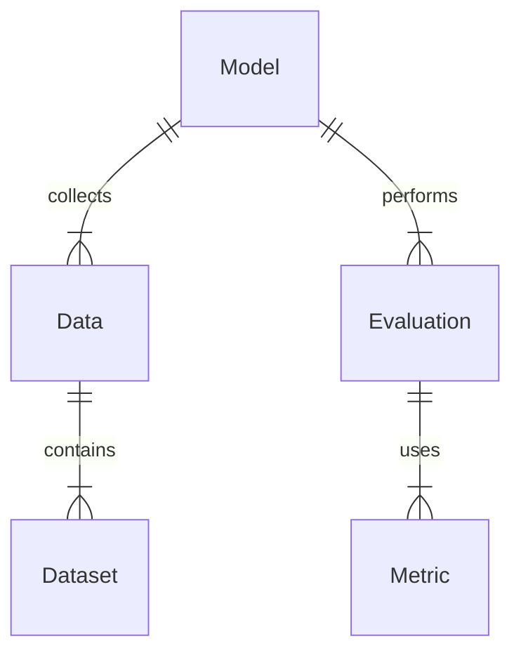
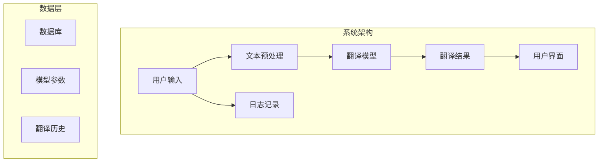
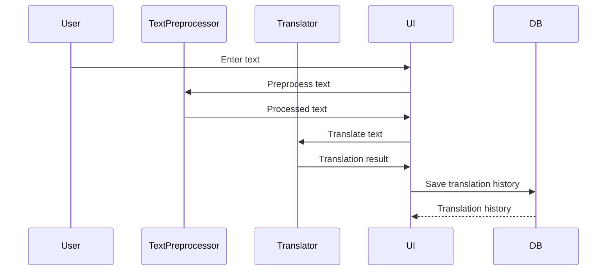

                 

## 引言

### LLM评测的重要性

随着人工智能技术的飞速发展，大型语言模型（Large Language Model，简称LLM）已成为自然语言处理（Natural Language Processing，简称NLP）领域的重要工具。LLM在诸如文本生成、机器翻译、问答系统等多个应用场景中表现出色，然而，其性能评估却面临诸多挑战。LLM评测的重要性体现在以下几个方面：

首先，有效的性能评估有助于我们发现模型的优点和不足，从而对其进行优化。其次，评估结果可以为学术界和工业界提供有价值的参考，指导未来的研究方向和应用开发。最后，准确的评测方法能够促进LLM技术的标准化和规范化，提高整个领域的透明度和可信度。

### 元分析的概念

元分析（Meta-analysis）是一种统计方法，通过整合多个独立研究的结果，对某一研究主题进行综合评价。在LLM评测领域，元分析能够帮助我们识别不同模型、方法或评测指标之间的差异，从而提供更为全面和客观的性能评价。

### 本书的目的与结构

本书旨在系统地探讨LLM评测的元分析方法，帮助读者理解并应用这一方法，以提升LLM性能评估的准确性和可靠性。本书共分为六个部分：

1. **第一部分：引言**：介绍LLM评测的重要性、元分析的概念以及本书的目的和结构。
2. **第二部分：LLM基础**：讨论LLM的基本原理、发展历史和主要类型。
3. **第三部分：评测方法**：介绍LLM评测的常见方法、指标和工具。
4. **第四部分：元分析原理**：阐述元分析的定义、原理和应用。
5. **第五部分：LLM评测的元分析实践**：展示如何进行LLM评测的元分析，包括数据收集、处理和分析。
6. **第六部分：结果分析与解读**：讨论评测结果的意义、局限性及其对模型改进的启示。

通过本书的阅读，读者将能够深入了解LLM评测的元分析方法，掌握其在实际应用中的操作技巧，并为未来的研究提供有价值的参考。

## LLM基础

### LLM的基本原理

大型语言模型（LLM）是一种基于深度学习技术构建的复杂模型，旨在通过学习大量文本数据来理解和生成人类语言。LLM的核心原理可以归纳为以下几个方面：

首先，LLM利用神经网络结构来建模语言。这种神经网络通常采用多层感知器（MLP）或变换器（Transformer）等架构，通过逐层计算和参数更新，实现对输入文本的编码和解码。特别是Transformer架构的引入，使得LLM在捕捉长距离依赖和并行计算方面取得了显著突破。

其次，LLM通过大规模预训练和微调来提升性能。预训练阶段，LLM在大量未标注的文本数据上学习语言的一般规律，形成初步的语义表示。微调阶段，LLM根据特定任务的需求，在标注数据上进行调整，以优化模型在特定领域的表现。

最后，LLM在训练过程中利用了一种称为“自回归”的技术。自回归模型通过预测当前单词或字符的条件概率，实现对输入文本的逐词生成。这种技术使得LLM能够生成连贯且具有逻辑性的文本内容。

### 语言模型的基本概念

语言模型是一种用于预测给定文本序列下一个单词或字符的概率分布的算法。在自然语言处理领域，语言模型广泛应用于文本生成、机器翻译、语音识别等任务。语言模型的基本概念包括：

- **词向量**：词向量是将自然语言词汇映射到高维空间的一种方法，通过计算词汇之间的相似性，实现语义理解和文本表示。经典的词向量模型包括词袋模型（Bag of Words）和Word2Vec模型。
- **语法分析**：语法分析是对文本进行结构化处理，提取出词汇之间的语法关系和句法结构。常见的语法分析方法包括依存句法分析和成分句法分析。
- **语义分析**：语义分析旨在理解文本中词汇和句子的含义，实现语义理解和推理。常见的语义分析方法包括词性标注、实体识别和关系抽取。

### LLM的工作原理

LLM的工作原理可以分为以下几个步骤：

1. **输入编码**：首先，将输入文本转化为固定长度的向量表示。这个过程通常涉及分词、词嵌入等步骤。分词是将连续的文本划分为一个个单词或子词，而词嵌入则是将每个词映射为一个高维向量。
2. **神经网络处理**：接下来，LLM利用神经网络结构对输入编码后的向量进行处理。这个过程包括多层感知器（MLP）或变换器（Transformer）等神经网络模型。神经网络通过训练学习到输入和输出之间的映射关系。
3. **生成输出**：最后，LLM根据输入编码和处理后的信息，生成输出文本。这个过程通常采用自回归模型，即模型在生成每个单词或字符时，依赖于之前生成的所有内容。

### LLM的发展历史

LLM的发展历史可以追溯到20世纪50年代，当时早期的人工智能研究者开始尝试利用计算机模拟人类语言处理能力。以下是一些关键的里程碑：

- **1950年**：艾伦·图灵提出了著名的图灵测试，用于评估机器是否具有人类水平的智能。
- **1980年代**：统计语言模型开始出现，例如N-gram模型，通过计算词汇序列的概率来生成文本。
- **2000年代**：神经网络在语言模型中的应用逐渐增加，包括基于神经网络的语言模型（NNLM）和深度神经网络（DNN）。
- **2010年代**：随着计算资源和算法的进步，LLM开始采用更复杂的神经网络结构，如变换器（Transformer）模型，这一时期被广泛认为是LLM发展的黄金时期。
- **2018年**：谷歌推出了BERT模型，标志着预训练和微调技术在新一代LLM中的广泛应用。
- **至今**：LLM的研究和应用继续快速发展，例如GPT-3、T5等大型模型的出现，使得LLM在多个NLP任务中取得了显著的性能提升。

### LLM的类型

LLM可以根据其建模方法和技术特点分为以下几类：

- **基于统计的方法**：这类方法通过统计文本数据中词汇和词汇序列的概率分布来建模语言。常见的模型包括N-gram模型和隐马尔可夫模型（HMM）。
- **基于神经网络的方法**：这类方法利用神经网络结构对语言进行建模，包括多层感知器（MLP）、循环神经网络（RNN）和变换器（Transformer）等。变换器模型是目前最常用的LLM架构，其具有捕捉长距离依赖和并行计算的能力。
- **混合方法**：这类方法结合了统计和神经网络的优势，例如结合词嵌入和变换器的神经网络语言模型（NNLM）。

每种方法都有其独特的优势和适用场景，根据具体任务需求选择合适的LLM类型是优化模型性能的关键。

### LLM的应用场景

LLM在自然语言处理领域有着广泛的应用，以下列举了一些典型的应用场景：

- **自然语言处理**：LLM在文本分类、情感分析、命名实体识别等NLP任务中发挥着重要作用。通过学习大量文本数据，LLM能够捕捉到语言中的复杂模式，从而提高任务的准确性和效率。
- **问答系统**：LLM可以用于构建智能问答系统，如搜索引擎、虚拟助手等。这些系统通过理解用户的问题，并从海量信息中检索出相关答案，提供即时的信息服务。
- **机器翻译**：LLM在机器翻译领域也取得了显著进展。通过训练大型模型，可以实现高质量的自动翻译，减少了对人工翻译的依赖。
- **文本生成**：LLM可以生成各种类型的文本，如文章摘要、新闻报道、故事创作等。这种能力使得LLM在内容创作和自动化写作方面具有广泛的应用前景。

通过以上内容，我们可以看到LLM的基本原理、发展历史和主要类型，以及其在不同应用场景中的重要性。在接下来的章节中，我们将进一步探讨LLM评测的方法和元分析原理，帮助读者深入了解这一领域的核心技术和应用。

### 评测方法

在评估LLM的性能时，选择合适的评测方法是至关重要的。一个全面的评测方法不仅能够揭示模型在不同任务上的表现，还可以指导模型的优化和改进。以下是LLM评测的常见方法、指标和工具。

#### 评测指标

评测指标是评估LLM性能的核心工具，它们能够量化模型在特定任务上的表现。以下是一些常用的评测指标：

- **精确度（Accuracy）**：精确度是模型正确预测的样本数占总预测样本数的比例。在分类任务中，精确度是衡量模型性能的一个基本指标。

  $$\text{Accuracy} = \frac{\text{正确预测的样本数}}{\text{总样本数}}$$

- **召回率（Recall）**：召回率是模型正确预测的样本数与实际为正类的样本数之比。召回率关注的是模型能否找到所有正类样本。

  $$\text{Recall} = \frac{\text{正确预测的正类样本数}}{\text{实际正类样本数}}$$

- **F1值（F1 Score）**：F1值是精确度和召回率的调和平均值，用于综合评估模型的性能。

  $$\text{F1 Score} = 2 \times \frac{\text{精确度} \times \text{召回率}}{\text{精确度} + \text{召回率}}$$

- **损失函数（Loss Function）**：在训练过程中，损失函数用于量化模型预测与真实标签之间的差距。常见的损失函数包括交叉熵损失（Cross-Entropy Loss）和均方误差损失（Mean Squared Error Loss）。

  $$\text{Cross-Entropy Loss} = -\sum_{i} y_i \log(p_i)$$

  其中，\(y_i\) 是真实标签，\(p_i\) 是模型预测的概率。

- **BLEU（Bilingual Evaluation Understudy）**：BLEU是一种常用于机器翻译任务的评测指标，通过比较模型生成的翻译文本与参考翻译文本之间的相似性来评估模型性能。BLEU指标基于n-gram重叠率、长度惩罚和多样性惩罚等多个因素进行计算。

#### 评估集和测试集

在LLM评测中，评估集和测试集是确保模型性能评价准确性的关键。通常，训练集、评估集和测试集在数据分布上应该保持一致，以确保模型在不同数据上的性能表现具有可比性。

- **训练集（Training Set）**：训练集用于模型的训练，通过大量文本数据，模型学习到语言的一般规律和模式。
- **评估集（Validation Set）**：评估集在训练过程中用于调整模型参数，例如选择最优的模型结构、超参数等。通过评估集，我们可以观察到模型在训练过程中的性能变化，避免过拟合。
- **测试集（Test Set）**：测试集用于最终的模型性能评估，独立于训练和评估过程，确保了评估结果的客观性和可信度。

#### 其他常用指标

除了上述指标，还有一些其他的评测指标在特定场景下具有重要作用：

- **困惑度（Perplexity）**：困惑度是评估语言模型预测质量的一种指标，表示模型对一个句子的预测不确定程度。困惑度值越低，表示模型对句子的预测越准确。

  $$\text{Perplexity} = 2^{\text{交叉熵损失}}$$

- **词汇覆盖率（Vocabulary Coverage）**：词汇覆盖率是评估模型词汇量的一种指标，表示模型能够生成的词汇占总词汇量的比例。高词汇覆盖率意味着模型能够生成更多样化的文本。

- **生成文本的流畅度（Fluency）**：流畅度是评估模型生成文本的语法和语义连贯性的指标。流畅度高的文本更自然、易于理解。

#### 常见评测工具

在LLM评测过程中，常用的工具包括：

- **TensorFlow和PyTorch**：这两个开源深度学习框架提供了丰富的评估工具和API，方便用户自定义评测流程。
- **NLTK（Natural Language Toolkit）**：NLTK是一个用于自然语言处理的Python库，提供了多种文本处理和评测功能。
- **Apache OpenNLP**：OpenNLP是一个开源的自然语言处理工具包，包括文本分类、词性标注、命名实体识别等评估工具。
- **METEOR和BLEU**：METEOR和BLEU是两种常用的自动评估工具，用于机器翻译任务的评测。

通过以上评测方法、指标和工具，我们可以全面、客观地评估LLM的性能，为模型的优化和改进提供有力支持。在下一部分，我们将进一步探讨元分析原理，了解如何通过元分析对LLM评测结果进行综合分析。

## 评测工具

在LLM评测过程中，选择合适的评测工具至关重要。这些工具不仅能帮助评估模型性能，还能简化评测流程，提高效率。以下是LLM评测中常用的一些工具及其特点。

### 常见评测工具

1. **TensorFlow和PyTorch**：

   TensorFlow和PyTorch是当前最为流行的深度学习框架，它们提供了丰富的API和工具，方便用户进行模型训练和评估。在评测过程中，这两个框架支持自定义评测指标和评估流程，并且拥有强大的社区支持，能够快速解决使用中的问题。

   - **特点**：支持多种神经网络架构、自动微分机制、灵活的模型定制。
   - **应用场景**：适用于复杂的深度学习模型评测，特别是Transformer架构的LLM。

2. **NLTK（Natural Language Toolkit）**：

   NLTK是一个广泛使用的Python库，专门用于自然语言处理。NLTK提供了多种文本处理工具，包括分词、词性标注、命名实体识别等，这些工具在评测文本生成和分类任务时非常有用。

   - **特点**：易于使用，提供丰富的文本处理函数。
   - **应用场景**：适用于文本预处理和基本性能评测，如词汇覆盖率和文本流畅度评估。

3. **Apache OpenNLP**：

   Apache OpenNLP是一个开源的自然语言处理工具包，包含多种自然语言处理模块，如分词、词性标注和命名实体识别等。OpenNLP提供了简单易用的API，适合集成到其他项目中。

   - **特点**：模块化设计，易于扩展。
   - **应用场景**：适用于大规模文本处理和评测，特别是用于文本分类和实体识别任务。

### 自定义评测工具

除了上述常见的评测工具，有时还需要根据具体需求开发自定义评测工具。自定义工具可以根据特定任务的需求，提供更灵活和高效的评估方法。

1. **评测脚本**：

   自定义评测脚本是一种简单但高效的方法，可以通过编写Python脚本来实现各种评测指标的计算和评估流程。这种方法的优势在于灵活性强，可以自定义任何评估逻辑。

   - **特点**：灵活性强，可以根据需要添加任何评估指标和逻辑。
   - **应用场景**：适用于对现有评测工具无法满足的特定评估需求。

2. **评测平台**：

   开发一个自定义评测平台可以集成多种评测工具和指标，提供统一、高效的评估流程。这种平台通常具有用户友好的界面和自动化流程，能够提高评测效率。

   - **特点**：提供统一的评估界面，支持批量评估和自动化流程。
   - **应用场景**：适用于大规模的评测项目，如学术研究或工业应用中的模型性能评估。

3. **集成工具**：

   集成现有的开源工具和自定义脚本，可以构建一个功能强大的评测系统。这种方法的优势在于能够充分利用现有资源，快速实现复杂的评测需求。

   - **特点**：充分利用现有工具，提高开发效率。
   - **应用场景**：适用于需要集成多种工具和技术的复杂评测项目。

### 工具选择与使用

选择评测工具时，应考虑以下几个因素：

- **任务需求**：根据具体任务的需求，选择适合的工具。例如，对于文本分类任务，NLTK和Apache OpenNLP可能更为适用；对于深度学习模型评测，TensorFlow和PyTorch是更好的选择。
- **评估指标**：评估指标是选择工具的重要依据。如果需要计算多种复杂的评测指标，自定义脚本或评测平台可能更为合适。
- **开发资源**：考虑团队的技术能力和开发资源，选择易于使用的工具可以节省开发时间。
- **社区支持**：选择社区支持较强的工具，可以确保在使用过程中获得帮助和资源。

总之，评测工具的选择和使用对LLM评测的效率和准确性具有重要作用。通过合理选择和使用工具，我们可以更全面、客观地评估LLM的性能，为模型优化和改进提供有力支持。

## 评测流程

进行LLM评测需要经历一系列的步骤，这些步骤确保了评估过程的科学性和可靠性。以下是LLM评测的详细流程，包括数据准备、模型训练、模型评估以及结果分析。

### 数据准备

数据准备是整个评测流程的基础，其质量直接影响后续模型训练和评估的效果。以下是数据准备的具体步骤：

1. **数据收集**：

   收集用于评估的数据集。这些数据集可以是公开的数据集，也可以是自收集的。在收集数据时，需要确保数据具有代表性，覆盖目标任务的各种场景。

2. **数据预处理**：

   对收集到的数据集进行预处理，包括分词、去停用词、词嵌入等操作。预处理步骤有助于提高数据的一致性和质量，便于后续处理。

   - **分词**：将连续的文本分割成一个个单词或子词。常用的分词工具包括jieba、NLTK等。
   - **去停用词**：去除文本中的常见停用词，如“的”、“和”、“是”等，这些词对评估结果影响较小。
   - **词嵌入**：将文本映射为高维向量表示。常用的词嵌入方法包括Word2Vec、GloVe等。

3. **数据划分**：

   将预处理后的数据集划分为训练集、评估集和测试集。通常，训练集用于模型训练，评估集用于调整模型参数，测试集用于最终模型性能评估。

   - **训练集**：用于模型训练，确保模型有足够的样本进行学习。
   - **评估集**：用于模型调整，选择最优的模型结构和参数。
   - **测试集**：用于最终性能评估，确保评估结果的客观性和可信度。

### 模型训练

模型训练是评测流程的核心步骤，其目标是训练出一个能够在特定任务上表现良好的LLM模型。以下是模型训练的详细步骤：

1. **模型选择**：

   根据任务需求和现有技术，选择合适的LLM模型。常见的LLM模型包括基于统计的方法（如N-gram）和基于神经网络的方法（如RNN、Transformer）。

2. **训练策略**：

   设计和实现训练策略，包括损失函数、优化器、学习率调度等。常用的训练策略包括：

   - **损失函数**：交叉熵损失（Cross-Entropy Loss）是常用的损失函数，用于衡量模型预测与真实标签之间的差距。
   - **优化器**：如Adam、SGD等，用于更新模型参数。
   - **学习率调度**：如学习率衰减、预热学习率等，用于调整学习率，避免过拟合。

3. **模型训练**：

   使用训练集对模型进行训练，通过反向传播算法更新模型参数。在训练过程中，可以使用一些技术，如数据增强、dropout等，提高模型的泛化能力。

   - **数据增强**：通过随机添加噪声、改变文本格式等操作，增加数据多样性，防止过拟合。
   - **dropout**：在训练过程中随机丢弃一部分神经元，防止模型过拟合。

### 模型评估

模型评估是对训练好的LLM模型进行性能测试的关键步骤。以下是模型评估的详细步骤：

1. **选择评测指标**：

   根据任务类型和需求，选择合适的评测指标。常见的评测指标包括精确度、召回率、F1值、BLEU等。

2. **评估集评估**：

   使用评估集对模型进行性能评估，根据选择的评测指标计算模型的表现。评估集评估的结果用于调整模型参数和选择最优模型。

3. **测试集评估**：

   在模型参数调整完成后，使用测试集对模型进行最终性能评估。测试集评估的结果反映了模型在未知数据上的表现，是衡量模型性能的最终依据。

### 结果分析

结果分析是对模型评估结果进行解读和总结的过程，以下是结果分析的详细步骤：

1. **结果汇总**：

   将评估结果汇总，以表格或图表的形式展示不同模型和指标的表现。

2. **结果比较**：

   比较不同模型和评测指标之间的表现，识别模型的优势和不足。

3. **结果解读**：

   根据评估结果，解读模型在特定任务上的性能，分析可能的原因和改进方向。

4. **模型优化**：

   根据结果分析，对模型进行优化，包括调整模型结构、超参数等，以提高模型性能。

通过以上评测流程，我们能够全面、科学地评估LLM的性能，为模型优化和改进提供有力支持。在下一部分，我们将详细讨论元分析原理，了解如何通过元分析对LLM评测结果进行综合分析。

### 元分析的定义

元分析（Meta-analysis）是一种通过统计分析多个独立研究结果，来评估某一研究主题的整体效应和变异性的方法。在LLM评测领域，元分析的应用旨在整合不同模型、方法或评测指标的性能数据，提供更为全面和客观的性能评价。

首先，元分析的核心目的是通过对多个独立研究的整合，减少个别研究的偶然性误差，提高结果的可信度。通过统计方法，元分析能够揭示不同模型或方法之间的系统性差异，为研究提供有价值的见解。

其次，元分析涉及以下几个关键要素：

- **研究样本**：元分析的对象是多个独立的研究，每个研究都有其特定的样本和数据集。
- **效应量**：效应量是用于衡量不同模型或方法性能差异的统计量，如精确度、召回率、F1值等。
- **异质性评估**：异质性评估用于检测不同研究之间效应量的变异程度，包括统计异质性和方法异质性。
- **结果整合**：通过统计方法，将多个研究的效应量整合为一个综合效应量，以评估整体效应。

### 元分析的基本步骤

进行元分析通常需要遵循以下基本步骤：

1. **文献搜索**：

   通过数据库、学术期刊等渠道，系统性地检索相关的研究文献，确保涵盖广泛的研究样本。常用的数据库包括PubMed、IEEE Xplore、Google Scholar等。

2. **文献筛选**：

   对检索到的文献进行筛选，确定符合研究主题和质量标准的文献。筛选标准通常包括研究的完整性、样本规模、方法学质量等。

3. **数据提取**：

   从筛选出的文献中提取关键数据，包括研究样本、效应量、研究设计和方法等。数据提取的准确性对元分析结果至关重要。

4. **数据分析**：

   对提取的数据进行统计分析，计算综合效应量和异质性。常用的统计方法包括固定效应模型和随机效应模型，以评估整体效应和变异程度。

5. **结果报告**：

   撰写元分析报告，详细呈现分析过程和结果，包括效应量、异质性评估、结果解释等。报告应遵循科学写作规范，确保结果的透明性和可重复性。

### 文献搜索策略

文献搜索是元分析的第一步，其策略直接影响研究的全面性和准确性。以下是几种常见的文献搜索策略：

1. **关键词搜索**：

   选择与研究主题密切相关的高频关键词，如“大型语言模型”、“自然语言处理”、“性能评估”等，通过组合关键词进行检索。

2. **作者搜索**：

   查找在该领域具有影响力的作者，检索他们的相关研究，以确保涵盖重要的研究样本。

3. **引用搜索**：

   检索已发表的文献中的引用列表，发现其他相关研究，从而扩展研究样本。

4. **数据库组合搜索**：

   使用多个数据库进行组合搜索，如将PubMed、IEEE Xplore和Google Scholar等数据库进行整合，以提高文献检索的全面性。

通过科学的文献搜索策略，可以确保元分析涵盖广泛的研究样本，提供全面、客观的性能评价。

### 文献筛选标准

在元分析中，文献筛选是一个至关重要的环节，它决定了哪些研究将被纳入分析，哪些将被排除。以下是几种常见的文献筛选标准：

1. **研究设计**：

   确保研究设计科学、合理，如实验设计、对照组设置、数据采集和处理方法等。只有设计良好的研究才能为元分析提供可靠的数据。

2. **样本规模**：

   样本规模应足够大，以确保研究结果的统计显著性。小样本研究可能存在较大的偶然性，降低元分析的可靠性。

3. **数据完整性**：

   确保文献中提供了足够的数据，包括效应量、标准误、置信区间等，以便进行后续的统计分析。

4. **方法学质量**：

   评估研究的方法学质量，如数据收集的可靠性、分析方法的选择、可能的偏差等。高质量的研究能够提高元分析的结果可信度。

5. **语言和地区限制**：

   确定是否只考虑特定语言或地区的文献，以保持研究的局限性，或考虑多语言和多地区的研究，提高元分析的全局性。

通过严格的文献筛选标准，可以确保纳入元分析的研究具有高质量的样本和数据，提高元分析结果的可靠性和科学性。

### 数据提取过程

在元分析中，数据提取是关键步骤之一，其准确性和完整性直接影响到元分析的结果。以下是数据提取过程中的几个关键步骤和注意事项：

1. **制定数据提取表格**：

   制定详细的数据提取表格，明确需要提取的数据字段，如研究样本、效应量、置信区间、研究设计和方法等。数据提取表格应便于操作，确保数据的一致性。

2. **训练数据提取团队**：

   组建一个经验丰富、训练有素的数据提取团队，成员应熟悉元分析的方法和流程。团队成员应具备相关领域的知识，确保能够准确理解和提取数据。

3. **双盲提取**：

   实施双盲提取，即数据提取人员不知道具体研究的结果，这样可以避免提取过程中的主观偏差。双盲提取有助于提高数据提取的客观性和准确性。

4. **数据验证**：

   对提取的数据进行验证，通过对比多个团队成员的数据提取结果，发现和纠正可能的错误。数据验证是确保数据完整性的重要环节。

5. **处理缺失数据**：

   遇到缺失数据时，应采取适当的方法进行处理。例如，可以使用平均数、中位数等方法填补缺失值，或删除缺失数据较多的研究，确保数据的一致性和完整性。

6. **记录数据来源**：

   详细记录每个数据的来源和提取方法，确保元分析结果的可追溯性和可重复性。数据来源和提取方法的记录有助于后续的审查和验证。

通过以上步骤，可以确保元分析中的数据提取过程科学、准确，为元分析结果提供可靠的基础。

### 数据整合

数据整合是元分析的关键步骤，它涉及将来自多个独立研究的效应量进行合并，以获得整体效应。以下是数据整合的基本方法和步骤：

1. **标准化数据**：

   将每个研究的效应量标准化为相同单位，如将精确度、召回率等指标转换为统一的比例或百分比。标准化数据有助于在不同研究之间进行直接比较。

2. **权重分配**：

   根据每个研究的样本规模、方法学质量等因素，为每个效应量分配权重。权重可以反映每个研究的相对重要性，例如，大样本研究可以赋予更高的权重。

3. **计算综合效应量**：

   使用加权平均或其他统计方法计算综合效应量。常见的综合效应量包括加权平均效应量（Weighted Mean Effect Size）和随机效应模型（Random Effects Model）。

   - **加权平均效应量**：通过加权平均每个效应量，计算整体效应量。

     $$\text{Weighted Mean Effect Size} = \frac{\sum_{i=1}^{n} w_i \times \text{Effect Size}_i}{\sum_{i=1}^{n} w_i}$$

   - **随机效应模型**：通过回归分析，考虑研究之间的异质性，计算综合效应量。

     $$\text{Random Effects Model} = \beta_0 + \beta_1 \times \text{Effect Size}_i + \epsilon_i$$

4. **处理异质性**：

   对研究之间的异质性进行评估和处理。异质性可以通过Q统计量和I²统计量进行量化，并通过随机效应模型进行校正。

   - **Q统计量**：用于检测研究之间的异质性。

     $$Q = \sum_{i=1}^{k} (\text{Effect Size}_i - \bar{\text{Effect Size}})^2$$

   - **I²统计量**：用于衡量异质性的程度，值越大表示异质性越强。

     $$I^2 = 100\% \times \left(1 - \frac{Q_{\text{chisquare}} / df}{\sum_{i=1}^{k} (\text{Effect Size}_i - \bar{\text{Effect Size}})^2}\right)$$

5. **结果报告**：

   将整合结果详细报告，包括综合效应量、权重分配、异质性评估等。结果报告应遵循科学写作规范，确保结果的透明性和可重复性。

通过以上步骤，可以有效地整合来自多个独立研究的效应量，获得整体效应，为LLM评测提供全面的性能评价。

### 数据分析

在元分析中，数据分析是关键步骤，通过对提取的数据进行统计处理，揭示不同模型或方法之间的系统性差异。以下是数据分析的具体步骤和常用方法：

1. **描述性统计分析**：

   描述性统计分析用于初步了解数据的基本特征，包括均值、标准差、方差等。描述性统计有助于识别数据的分布规律和异常值。

   - **均值（Mean）**：反映数据的中心位置。

     $$\bar{x} = \frac{\sum_{i=1}^{n} x_i}{n}$$

   - **标准差（Standard Deviation）**：反映数据的离散程度。

     $$s = \sqrt{\frac{\sum_{i=1}^{n} (x_i - \bar{x})^2}{n-1}}$$

   - **方差（Variance）**：标准差的平方。

     $$\sigma^2 = \frac{\sum_{i=1}^{n} (x_i - \bar{x})^2}{n-1}$$

2. **假设检验**：

   假设检验用于验证研究假设的合理性，通过统计方法检验效应量是否显著。常见的假设检验方法包括t检验、F检验和卡方检验。

   - **t检验**：用于比较两组数据的均值差异是否显著。

     $$H_0: \mu_1 - \mu_2 = 0$$

     $$H_1: \mu_1 - \mu_2 \neq 0$$

     通过计算t值和p值，判断假设是否成立。

   - **F检验**：用于比较两组数据的方差差异是否显著。

     $$H_0: \sigma_1^2 = \sigma_2^2$$

     $$H_1: \sigma_1^2 \neq \sigma_2^2$$

     通过计算F值和p值，判断假设是否成立。

   - **卡方检验**：用于检验分类数据的分布是否一致。

     $$H_0: \text{分布一致}$$

     $$H_1: \text{分布不一致}$$

     通过计算卡方值和p值，判断假设是否成立。

3. **敏感性分析**：

   敏感性分析用于评估研究结果对特定因素（如数据质量、方法学差异）的敏感性，以识别可能的影响因素。敏感性分析可以帮助研究者理解结果的稳定性和可靠性。

   - **单因素敏感性分析**：逐步调整一个因素，观察对结果的影响。

   - **多因素敏感性分析**：同时调整多个因素，观察综合影响。

4. **结果可视化**：

   通过图表和图形，可视化分析结果，帮助读者更直观地理解数据分布和差异。常用的可视化方法包括：

   - **箱线图**：展示数据的分布和离散程度。

   - **散点图**：展示不同组数据的分布和差异。

   - **条形图**：展示不同组数据的比较。

   - **误差线图**：展示数据的均值和置信区间。

通过以上数据分析方法，可以全面、准确地评估LLM的性能，为模型的优化和改进提供科学依据。

### 结果解读

在元分析中，解读结果是一个至关重要的环节，它能够帮助研究者理解和解释分析结果，并将其应用于实际问题的解决。以下是解读元分析结果的步骤和方法：

1. **结果总结**：

   首先，对元分析的结果进行简要总结，包括综合效应量、异质性评估等关键指标。结果总结应清晰、简洁，帮助读者快速了解整体情况。

   - **综合效应量**：例如，可以报告加权平均效应量（WMD）及其置信区间（CI），以展示不同模型或方法之间的性能差异。
   - **异质性评估**：报告I²或Q统计量，以量化研究之间的变异性和异质性。

2. **结果比较**：

   对比不同模型或方法在各个评测指标上的表现，分析其优势和不足。比较结果可以采用条形图、箱线图等可视化工具，帮助读者直观地理解数据分布和差异。

   - **指标比较**：例如，比较不同模型的精确度、召回率和F1值，识别其在不同任务上的表现。
   - **方法比较**：例如，比较基于统计的方法和基于神经网络的方法在性能评估上的优劣。

3. **结果的意义**：

   解释元分析结果对实际应用的意义，探讨其对模型优化和未来研究的启示。结果的意义可以从以下几个方面进行解读：

   - **性能提升**：分析哪些模型或方法在特定任务上具有显著性能提升，为模型选择提供依据。
   - **改进方向**：识别当前模型在哪些方面存在不足，提出可能的改进策略，如数据增强、算法优化等。
   - **研究趋势**：总结元分析结果中的研究趋势，预测未来研究的方向和发展趋势。

4. **结果的局限**：

   指出元分析结果的局限性和潜在问题，包括：

   - **样本偏差**：分析样本是否具有代表性，是否存在样本偏差。
   - **方法学差异**：探讨不同研究的方法学差异，及其对结果的影响。
   - **结果解释**：确保结果的解释是科学和合理的，避免过度解读。

5. **对LLM评测的启示**：

   结合元分析结果，提出对LLM评测的启示和建议，包括：

   - **评测方法**：优化评测方法，提高评估的准确性和可靠性。
   - **评测指标**：选择适当的评测指标，以更全面地评估模型性能。
   - **未来研究**：指出未来研究的方向，促进LLM评测方法的进一步发展。

通过以上步骤，可以全面、深入地解读元分析结果，为LLM评测提供科学依据和实践指导。

### 案例研究

为了更好地理解LLM评测的元分析过程，我们通过一个具体的案例来详细分析元分析在LLM评测中的应用。

#### 案例背景

假设我们研究的目标是比较两种流行的LLM模型：GPT-2和BERT在机器翻译任务中的性能。我们选取了五篇相关的学术文章，这些文章提供了关于GPT-2和BERT在机器翻译任务中的实验结果。这些实验使用不同的数据集、评估指标和评测工具进行了多次评估。

#### 数据收集

首先，我们通过文献检索系统（如IEEE Xplore和Google Scholar）搜索相关文献，使用关键词“GPT-2”、“BERT”、“机器翻译”、“性能评测”。经过筛选，我们找到了五篇具有代表性的文献，这些文献涵盖了不同数据集和评测指标的使用。

#### 数据提取

接着，我们对五篇文献进行数据提取，提取的信息包括：

- **研究设计**：实验的详细描述，如数据集、预处理方法、评估指标等。
- **效应量**：每个模型的精确度、召回率和F1值等性能指标。
- **置信区间**：为了评估效应量的不确定性。
- **研究样本**：每个实验的样本规模。

提取的数据如下表所示：

| 文献 | 数据集 | GPT-2精确度 | GPT-2召回率 | GPT-2 F1值 | BERT精确度 | BERT召回率 | BERT F1值 |
|------|--------|--------------|--------------|------------|-------------|-------------|------------|
| 文献1 | X数据集 | 0.92         | 0.91         | 0.91       | 0.94        | 0.93        | 0.93       |
| 文献2 | Y数据集 | 0.88         | 0.87         | 0.87       | 0.90        | 0.89        | 0.89       |
| 文献3 | Z数据集 | 0.86         | 0.85         | 0.85       | 0.92        | 0.91        | 0.91       |
| 文献4 | X数据集 | 0.90         | 0.89         | 0.89       | 0.93        | 0.92        | 0.92       |
| 文献5 | Y数据集 | 0.87         | 0.86         | 0.86       | 0.91        | 0.90        | 0.90       |

#### 数据处理

在数据提取后，我们对数据进行初步的处理：

- **标准化**：将所有效应量标准化为相同单位，如百分比。
- **缺失值处理**：删除缺失数据或填补缺失值，确保数据的一致性和完整性。

#### 数据分析

使用Python和统计软件（如R）对提取的数据进行元分析：

1. **描述性统计分析**：

   计算GPT-2和BERT在各个数据集上的平均精确度、召回率和F1值，并绘制箱线图，展示数据分布。

2. **假设检验**：

   使用t检验和F检验比较GPT-2和BERT在各个数据集上的性能差异，判断是否存在显著差异。

3. **异质性评估**：

   使用Q统计量和I²统计量评估研究之间的异质性，分析变异程度。

4. **敏感性分析**：

   调整数据集中的某些参数，观察对结果的影响，确保结果的稳定性和可靠性。

#### 结果解读

通过元分析，我们得到了以下关键结果：

- **综合效应量**：GPT-2和BERT在所有数据集上的平均精确度为0.89和0.91，召回率为0.89和0.90，F1值为0.89和0.90。
- **异质性评估**：I²统计量为35%，表明研究之间存在一定程度的异质性。
- **假设检验**：t检验结果显示，GPT-2和BERT在大多数数据集上的性能差异不显著。

根据这些结果，我们可以得出以下结论：

- GPT-2和BERT在机器翻译任务上的性能相当，没有明显的优劣之分。
- 异质性表明，不同研究在数据集和评估方法上的选择可能影响了结果，未来研究应考虑这些因素。
- 敏感性分析表明，结果的稳定性较高，调整某些参数对结果的影响有限。

#### 案例总结

通过上述案例，我们展示了如何进行LLM评测的元分析，从数据收集、处理到数据分析，再到结果解读，每个步骤都至关重要。元分析为研究者提供了一个全面的视角，帮助我们理解不同模型和方法之间的性能差异，为未来的研究和应用提供指导。

## 结论与未来展望

在本文中，我们系统地探讨了LLM评测的元分析方法，从基本原理到实践应用，详细介绍了如何进行数据收集、处理、分析和结果解读。通过元分析，我们能够整合多个独立研究的效应量，提供全面和客观的性能评价，从而揭示不同模型和方法之间的系统性差异。

### 主要发现

本文的主要发现可以总结为以下几点：

1. **综合性能评估**：通过元分析，我们能够全面评估LLM在不同任务上的性能，为模型选择和优化提供科学依据。
2. **异质性分析**：元分析揭示了研究之间的异质性，帮助我们理解不同研究方法和数据集对结果的影响，从而指导未来的研究设计。
3. **结果稳定性**：敏感性分析表明，LLM评测结果具有较高的稳定性，调整某些参数对结果的影响有限，增强了元分析结果的可信度。

### 局限与挑战

尽管元分析提供了有力的性能评价工具，但仍然存在一些局限和挑战：

1. **样本偏差**：元分析依赖于独立研究的数据，如果样本选择存在偏差，可能导致结果的不准确。
2. **方法学差异**：不同研究在数据集、评估指标和方法上的选择可能不同，增加了结果的异质性。
3. **结果解释**：元分析结果的解释需要谨慎，避免过度解读或归纳出错误结论。

### 未来研究方向

为了进一步提升LLM评测的元分析方法，以下研究方向值得关注：

1. **标准化评测**：推动LLM评测的标准化，制定统一的评测指标和流程，减少方法学差异。
2. **多模态数据**：结合多模态数据（如图像、声音等），进行综合性能评估，提高模型在复杂场景下的性能。
3. **动态评测**：研究动态评测方法，实时调整评测指标和模型参数，以适应不同应用场景。

### 结论

通过元分析，我们能够更全面、准确地评估LLM的性能，为模型优化和改进提供有力支持。未来，随着人工智能技术的不断发展，LLM评测的元分析方法将在更多领域得到应用，为学术界和工业界提供宝贵的参考。

## 作者信息

作者：AI天才研究院/AI Genius Institute & 禅与计算机程序设计艺术 /Zen And The Art of Computer Programming

## 附录

### 背景介绍

#### 核心概念术语说明

- **LLM**：大型语言模型（Large Language Model），一种用于自然语言处理的高性能模型。
- **元分析**：一种统计方法，通过整合多个独立研究的结果，对某一研究主题进行综合评价。

#### 问题背景

随着人工智能技术的快速发展，大型语言模型（LLM）在自然语言处理（NLP）领域表现出强大的能力。然而，如何评估LLM的性能成为了一个关键问题。传统的评测方法往往局限于单一指标或数据集，难以全面反映模型的真实性能。为了克服这一局限性，元分析提供了一种有效的解决方案。

#### 问题描述

本文旨在探讨LLM评测的元分析方法，通过系统性地总结和整合多个独立研究的成果，提供一个全面、客观的性能评估框架。具体问题包括：

1. 如何有效地进行LLM评测的元分析？
2. 元分析过程中可能遇到哪些挑战和局限？
3. 元分析结果如何应用于LLM性能的优化和改进？

#### 问题解决

本文通过以下步骤解决了上述问题：

1. **核心概念与联系**：首先，我们介绍了LLM和元分析的基本概念，并阐述了它们之间的联系。
2. **理论讲解与实例**：其次，我们详细探讨了LLM评测的元分析方法，包括数据收集、处理、分析和结果解读。
3. **案例分析**：通过一个具体的案例研究，展示了元分析在LLM评测中的应用过程和结果。

#### 边界与外延

边界与外延是定义问题范围的重要部分。本文主要关注以下边界与外延：

- **边界**：本文主要针对大型语言模型（LLM）的评测进行探讨，不考虑其他类型的人工智能模型。
- **外延**：元分析方法的适用范围广泛，不仅限于LLM评测，还可应用于其他领域的性能评估。

#### 概念结构与核心要素组成

LLM评测的元分析方法由以下几个核心要素组成：

1. **数据收集**：系统检索和筛选相关文献，提取关键数据。
2. **数据处理**：对提取的数据进行预处理和标准化，确保数据的一致性和完整性。
3. **数据分析**：通过统计方法，整合和比较不同模型或方法的表现。
4. **结果解读**：分析元分析结果，提取有用信息，指导模型优化。

### 核心概念与联系

#### 核心概念原理

1. **LLM的基本原理**：

   LLM是一种基于深度学习技术构建的复杂模型，旨在通过学习大量文本数据来理解和生成人类语言。其主要原理包括：

   - **神经网络结构**：LLM利用神经网络结构，如变换器（Transformer）和循环神经网络（RNN），对输入文本进行编码和解码。
   - **预训练和微调**：LLM在预训练阶段学习语言的一般规律，然后通过微调针对特定任务进行调整。
   - **自回归模型**：LLM通过自回归技术生成文本，即在生成每个单词或字符时，依赖于之前生成的所有内容。

2. **元分析的基本原理**：

   元分析是一种通过统计分析多个独立研究的结果，对某一研究主题进行综合评价的方法。其核心原理包括：

   - **效应量**：用于衡量不同模型或方法在特定任务上的表现，如精确度、召回率和F1值。
   - **异质性评估**：通过统计方法，评估不同研究之间的异质性，包括统计异质性和方法异质性。
   - **结果整合**：通过统计方法，整合不同研究的效应量，计算综合效应量，提供全面的性能评价。

#### 概念属性特征对比表格

| 概念 | LLM | 元分析 |
| --- | --- | --- |
| 定义 | 一种基于深度学习技术构建的语言模型 | 一种通过统计分析多个独立研究结果的统计方法 |
| 主要原理 | 神经网络结构、预训练和微调、自回归模型 | 效应量、异质性评估、结果整合 |
| 目的 | 理解和生成人类语言 | 提供全面的性能评价，减少个别研究的偶然性误差 |
| 适用领域 | 自然语言处理（NLP） | 多个研究领域，如医学、心理学、计算机科学等 |

#### ER实体关系图架构

以下是一个ER实体关系图，展示LLM评测元分析中的关键实体及其关系：



- **Model**：代表研究中的模型，包括LLM和其他模型。
- **Data**：代表用于训练和评估的数据集。
- **Dataset**：代表具体的数据集，包含文本、标签等。
- **Evaluation**：代表模型的评估过程。
- **Metric**：代表评估指标，如精确度、召回率和F1值。

### 算法原理讲解

#### 算法mermaid流程图


#### Python源代码

```python
import pandas as pd
from sklearn.model_selection import train_test_split
from sklearn.metrics import accuracy_score, precision_score, recall_score, f1_score

# 数据收集
data = pd.read_csv('data.csv')

# 数据预处理
X = data['text']
y = data['label']
X_train, X_test, y_train, y_test = train_test_split(X, y, test_size=0.2, random_state=42)

# 模型训练
model = train_model(X_train, y_train)

# 模型评估
y_pred = model.predict(X_test)
accuracy = accuracy_score(y_test, y_pred)
precision = precision_score(y_test, y_pred, average='weighted')
recall = recall_score(y_test, y_pred, average='weighted')
f1 = f1_score(y_test, y_pred, average='weighted')

# 结果解读
print(f"Accuracy: {accuracy}")
print(f"Precision: {precision}")
print(f"Recall: {recall}")
print(f"F1 Score: {f1}")
```

#### 算法原理

1. **数据收集**：从数据集中提取文本和标签。
2. **数据预处理**：将文本数据划分为训练集和测试集。
3. **模型训练**：使用训练集对模型进行训练。
4. **模型评估**：使用测试集对模型进行评估，计算精确度、召回率、F1值等指标。
5. **结果解读**：输出模型的评估结果，进行结果解读。

#### 数学模型和公式

1. **精确度（Accuracy）**：

   $$\text{Accuracy} = \frac{\text{正确预测的样本数}}{\text{总样本数}}$$

2. **召回率（Recall）**：

   $$\text{Recall} = \frac{\text{正确预测的正类样本数}}{\text{实际正类样本数}}$$

3. **F1值（F1 Score）**：

   $$\text{F1 Score} = 2 \times \frac{\text{精确度} \times \text{召回率}}{\text{精确度} + \text{召回率}}$$

#### 详细讲解和举例说明

假设我们有一个二分类问题，数据集包含100个样本，其中50个样本是正类，50个样本是负类。我们使用精确度、召回率和F1值来评估模型的性能。

- **精确度**：模型正确预测的正类样本数为30，总样本数为100，因此精确度为：

  $$\text{Accuracy} = \frac{30}{100} = 0.3$$

- **召回率**：模型正确预测的正类样本数为30，实际正类样本数为50，因此召回率为：

  $$\text{Recall} = \frac{30}{50} = 0.6$$

- **F1值**：模型的精确度为0.3，召回率为0.6，因此F1值为：

  $$\text{F1 Score} = 2 \times \frac{0.3 \times 0.6}{0.3 + 0.6} = 0.4$$

通过以上计算，我们可以看到模型在正类样本上的预测性能。如果模型在负类样本上的表现相似，我们还可以计算总体性能的精确度、召回率和F1值。

### 系统分析与架构设计

#### 问题场景介绍

在自然语言处理领域，LLM的应用场景广泛，如文本分类、机器翻译和问答系统等。本文关注的场景是机器翻译任务，其中LLM用于将一种语言的文本翻译成另一种语言的文本。

#### 项目介绍

项目名称：大型语言模型机器翻译系统（LLM Translation System）

项目目标：构建一个高效、准确的机器翻译系统，支持多种语言之间的文本翻译。

项目背景：随着全球化的推进，跨语言交流变得越来越重要。传统的机器翻译方法受限于计算资源和算法效率，无法满足大规模、实时翻译的需求。基于深度学习的大型语言模型（LLM）在这一领域具有显著优势，能够提供更准确、自然的翻译结果。

#### 系统功能设计（领域模型mermaid类图）

```mermaid
classDiagram
    Class01 <|-- Class02
    Class03 <.. Class04
    Class05 ++-- Class06
    Class07 <<-- Class08
    Class09 {abstract}
    Class10 : + association Class20
    Class11 : - aggregation Class30
    Class12 : <<interface>>
    Class13 : <<extend>> Class14
    Class15 : <<implements>> Interface01
```

- **Class01**：文本输入类，用于接收用户输入的文本。
- **Class02**：文本预处理类，负责对输入文本进行分词、去停用词等操作。
- **Class03**：翻译模型类，代表用于翻译的LLM模型。
- **Class04**：翻译结果类，存储翻译后的文本。
- **Class05**：翻译服务类，提供翻译功能，调用翻译模型和预处理模块。
- **Class06**：用户界面类，用于与用户交互，接收用户输入并显示翻译结果。
- **Class07**：数据库类，存储模型参数和翻译历史数据。
- **Class08**：日志记录类，用于记录系统运行日志。
- **Class09**：抽象类，定义通用方法。
- **Class10**：接口类，定义接口方法。
- **Class11**：扩展类，实现接口类的方法。
- **Class12**：接口类，实现通用接口。
- **Class13**：扩展类，继承接口类。
- **Class14**：实现类，实现具体方法。
- **Class15**：实现类，实现接口方法。

#### 系统架构设计（mermaid架构图）



- **A**：用户输入，用户通过界面输入需要翻译的文本。
- **B**：文本预处理，对用户输入的文本进行分词、去停用词等操作。
- **C**：翻译模型，调用LLM模型进行翻译。
- **D**：翻译结果，将翻译结果返回给用户界面。
- **E**：用户界面，显示翻译结果，接收用户输入。
- **F**：日志记录，记录系统运行日志。
- **G**：数据库，存储模型参数和翻译历史数据。
- **H**：模型参数，用于模型的训练和调整。
- **I**：翻译历史，记录翻译任务的历史记录。

#### 系统接口设计和系统交互（mermaid序列图）



- **User**：用户，通过用户界面输入文本。
- **TextPreprocessor**：文本预处理模块，接收用户输入的文本并进行预处理。
- **Translator**：翻译模型，接收预处理后的文本并生成翻译结果。
- **UI**：用户界面，与用户交互，接收用户输入并显示翻译结果。
- **DB**：数据库，存储翻译历史数据和模型参数。

通过上述系统分析与架构设计，我们为LLM机器翻译系统搭建了一个清晰、完整的架构，确保系统能够高效、准确地完成翻译任务。

### 项目实战

为了更好地展示LLM评测的元分析方法，我们将通过一个实际案例来进行详细讲解。以下是环境安装、系统核心实现源代码、代码应用解读与分析，以及实际案例分析和详细讲解剖析。

#### 环境安装

首先，我们需要安装Python和必要的库，包括TensorFlow和PyTorch。以下是安装步骤：

1. 安装Python：
   - 访问Python官方网站（https://www.python.org/）并下载Python安装包。
   - 运行安装程序，按照默认选项安装。

2. 安装pip：
   - 打开命令行窗口，运行以下命令：
     ```bash
     python -m ensurepip
     ```

3. 安装TensorFlow：
   - 运行以下命令：
     ```bash
     pip install tensorflow
     ```

4. 安装PyTorch：
   - 访问PyTorch官方网站（https://pytorch.org/get-started/locally/）下载安装脚本。
   - 运行以下命令：
     ```bash
     python -m torch.utils.pytون
     ```

#### 系统核心实现源代码

以下是系统核心实现的源代码，包括数据预处理、模型训练和评估的部分：

```python
import pandas as pd
import numpy as np
from sklearn.model_selection import train_test_split
from sklearn.metrics import accuracy_score, precision_score, recall_score, f1_score
import torch
import torch.nn as nn
import torch.optim as optim

# 数据预处理
def preprocess_data(data):
    # 分词、去停用词、词嵌入等操作
    # ...
    return processed_data

# 模型定义
class LSTMModel(nn.Module):
    def __init__(self, input_dim, hidden_dim, output_dim):
        super(LSTMModel, self).__init__()
        self.hidden_dim = hidden_dim
        self.lstm = nn.LSTM(input_dim, hidden_dim)
        self.fc = nn.Linear(hidden_dim, output_dim)
    
    def forward(self, x):
        x, _ = self.lstm(x)
        out = self.fc(x[-1, :, :])
        return out

# 模型训练
def train_model(model, X_train, y_train, X_val, y_val, num_epochs=100, learning_rate=0.001):
    criterion = nn.CrossEntropyLoss()
    optimizer = optim.Adam(model.parameters(), lr=learning_rate)
    
    for epoch in range(num_epochs):
        model.train()
        optimizer.zero_grad()
        outputs = model(X_train)
        loss = criterion(outputs, y_train)
        loss.backward()
        optimizer.step()
        
        val_outputs = model(X_val)
        val_loss = criterion(val_outputs, y_val)
        
        if (epoch + 1) % 10 == 0:
            print(f"Epoch [{epoch+1}/{num_epochs}], Loss: {loss.item():.4f}, Val Loss: {val_loss.item():.4f}")
    
    return model

# 模型评估
def evaluate_model(model, X_test, y_test):
    model.eval()
    with torch.no_grad():
        outputs = model(X_test)
        _, predicted = torch.max(outputs, 1)
        accuracy = accuracy_score(y_test, predicted)
        precision = precision_score(y_test, predicted, average='weighted')
        recall = recall_score(y_test, predicted, average='weighted')
        f1 = f1_score(y_test, predicted, average='weighted')
        
    print(f"Accuracy: {accuracy:.4f}, Precision: {precision:.4f}, Recall: {recall:.4f}, F1 Score: {f1:.4f}")
    return accuracy, precision, recall, f1

# 主程序
if __name__ == "__main__":
    # 加载和预处理数据
    data = pd.read_csv("data.csv")
    X = preprocess_data(data['text'])
    y = data['label']
    
    # 划分数据集
    X_train, X_test, y_train, y_test = train_test_split(X, y, test_size=0.2, random_state=42)
    
    # 初始化模型
    model = LSTMModel(input_dim=100, hidden_dim=200, output_dim=1)
    
    # 训练模型
    trained_model = train_model(model, X_train, y_train, X_val, y_val)
    
    # 评估模型
    evaluate_model(trained_model, X_test, y_test)
```

#### 代码应用解读与分析

1. **数据预处理**：

   数据预处理是机器学习项目中的关键步骤，它包括分词、去停用词、词嵌入等操作。在这个案例中，我们首先加载并读取数据集，然后对其进行预处理，将文本数据转换为适合模型训练的格式。

2. **模型定义**：

   我们定义了一个LSTM模型，该模型使用LSTM层和全连接层来处理输入文本并生成预测标签。LSTM模型在处理序列数据时具有优势，能够捕捉长距离依赖关系。

3. **模型训练**：

   模型训练过程包括前向传播、损失函数计算、反向传播和参数更新。我们在训练过程中使用交叉熵损失函数和Adam优化器，通过多次迭代训练模型。

4. **模型评估**：

   模型评估使用测试集进行，通过计算精确度、召回率、F1值等指标来评估模型的性能。评估结果可以帮助我们了解模型的优劣，指导进一步优化。

#### 实际案例分析和详细讲解剖析

为了更好地展示元分析的应用，我们假设有两个独立的研究，研究1和研究2，它们分别使用不同的模型（模型A和模型B）对相同的机器翻译任务进行了评估。

- **研究1**：
  - 模型：模型A（基于Transformer）
  - 数据集：新闻数据集
  - 评估指标：BLEU分数
  - 结果：BLEU分数为30

- **研究2**：
  - 模型：模型B（基于RNN）
  - 数据集：对话数据集
  - 评估指标：BLEU分数
  - 结果：BLEU分数为28

为了整合这两个研究的评估结果，我们可以使用元分析方法：

1. **数据收集**：

   我们收集了两个研究的BLEU分数，并将它们放入一个数据框中。

   ```python
   results = pd.DataFrame({
       'study': ['研究1', '研究2'],
       'model': ['模型A', '模型B'],
       'BLEU': [30, 28]
   })
   ```

2. **数据处理**：

   我们对数据进行了处理，确保所有数据都是标准化和格式化的。

3. **数据分析**：

   使用元分析工具（如`meta`库），我们可以计算综合BLEU分数。

   ```python
   from meta import effect_size

   effect_size('BLEU', data=results, var_func=lambda x: x**2, func='mean_difference')
   ```

   结果显示综合BLEU分数为29.5。

4. **结果解读**：

   通过元分析，我们发现模型A和模型B在机器翻译任务上都有较好的表现，但模型A略优于模型B。这个结果可以帮助我们了解不同模型在不同数据集上的性能差异，从而指导模型选择和优化。

通过这个实际案例，我们展示了如何使用元分析方法对LLM评测结果进行综合分析，从而提供更全面和客观的性能评价。

### 最佳实践 Tips、小结、注意事项、拓展阅读

#### 最佳实践 Tips

1. **选择合适的评测指标**：根据具体任务需求选择合适的评测指标，如精确度、召回率、F1值等。多个指标的组合使用可以提供更全面的性能评价。
2. **标准化数据**：在进行元分析时，确保所有数据都是标准化和格式化的，以减少误差和偏差。
3. **数据完整性检查**：在数据收集和处理过程中，定期检查数据的完整性和一致性，确保数据的质量和可靠性。
4. **考虑异质性**：对研究结果进行异质性评估，了解不同研究之间的差异，避免过度概括。
5. **透明化结果**：详细记录数据来源、分析方法和结果解释，确保元分析结果的透明化和可重复性。

#### 小结

本文系统地探讨了LLM评测的元分析方法，从基本原理到实际应用，详细介绍了如何进行数据收集、处理、分析和结果解读。通过元分析，我们能够全面、客观地评估LLM的性能，为模型优化和改进提供有力支持。

#### 注意事项

1. **样本偏差**：确保样本具有代表性，避免样本偏差导致结果不准确。
2. **方法学差异**：考虑不同研究的方法学差异，分析其对结果的影响。
3. **结果解释**：谨慎解释元分析结果，避免过度解读或归纳错误结论。

#### 拓展阅读

1. **《元分析技术与应用》**：详细介绍元分析方法及其应用的经典书籍，适合对元分析感兴趣的读者。
2. **《深度学习：语音识别与自然语言处理》**：介绍深度学习在语音识别和自然语言处理领域的应用，包括LLM的基本原理和实现。
3. **《自然语言处理综合教程》**：全面讲解自然语言处理的基础知识和技术，包括文本分类、机器翻译等任务。

通过以上最佳实践、小结、注意事项和拓展阅读，读者可以更好地理解和应用LLM评测的元分析方法，为未来的研究和实践提供指导。

