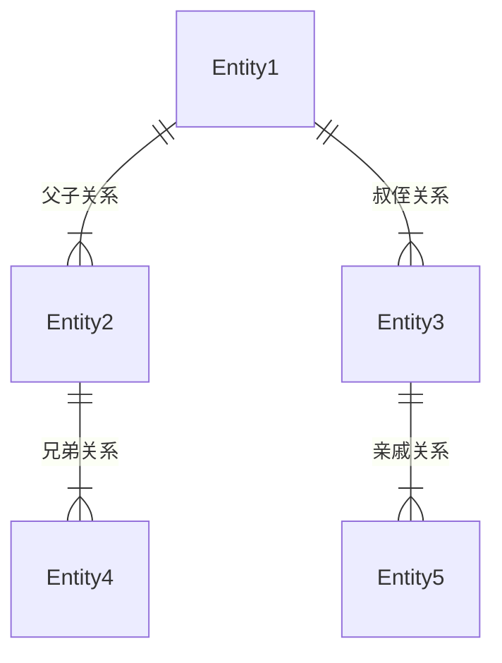
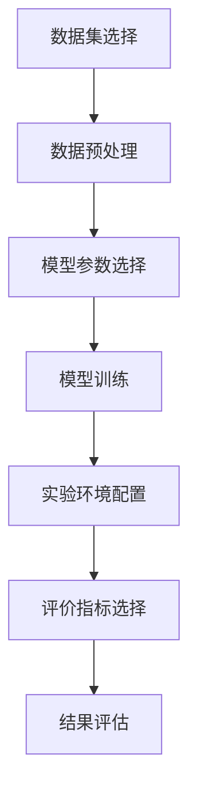
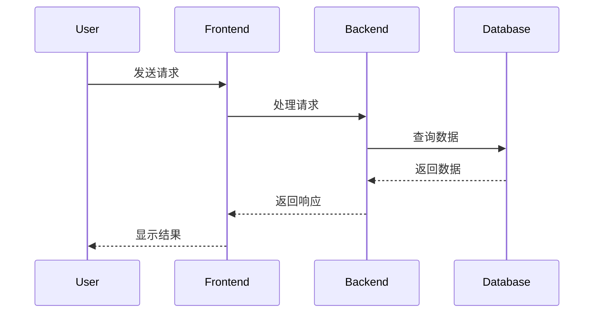
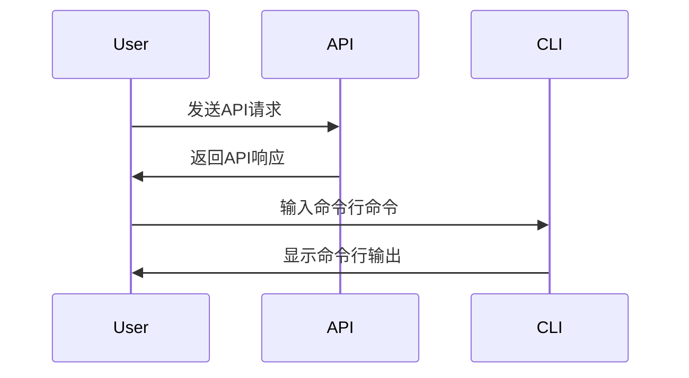
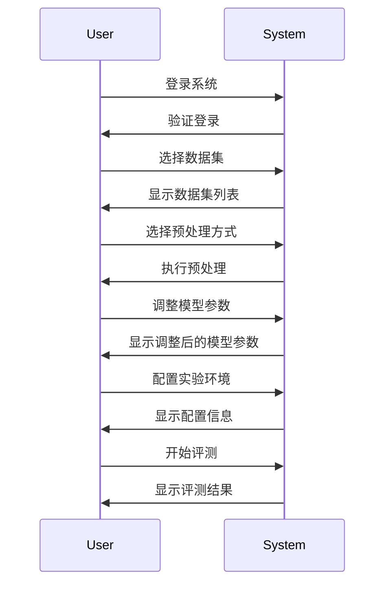
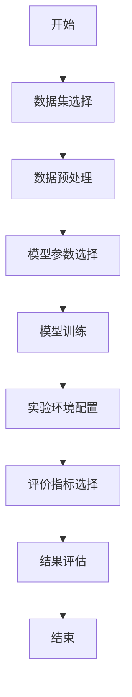

                 

### LLAM评测的可重复性：标准化流程与工具

#### 摘要：

本文主要探讨大语言模型（LLM）评测过程中的可重复性问题，并提出相应的解决方案。随着深度学习和自然语言处理技术的快速发展，LLM在许多任务上取得了显著成果，但评测结果的可重复性成为一个关键问题。本文首先介绍了LLM评测不可重复性的问题背景，包括数据集问题、模型参数问题、实验环境问题以及评价标准问题。随后，我们提出了标准化流程和工具支持两种解决方案，并详细阐述了核心概念、算法原理和系统架构设计。最后，通过一个实际案例，展示了如何应用本文提出的解决方案，以提高LLM评测的可重复性。本文旨在为研究者和开发者提供一套系统性的方法论，以提升LLM评测的可靠性和可信度。

#### 第一部分：背景介绍

##### 第1章：问题背景

随着深度学习和自然语言处理技术的快速发展，大型的语言模型（LLM）如GPT、BERT等相继问世，这些模型在许多任务上取得了显著的成果。然而，LLM评测的可重复性成为了一个值得关注的问题。可重复性是指在不同时间、不同环境下，其他研究者能否得到与原始研究类似的结果。对于LLM的研究而言，可重复性至关重要，因为它关系到研究成果的可靠性和可信度。

##### 1.1.1 问题背景

1. **数据集问题**：不同数据集的选择和预处理方式可能对LLM的表现产生显著影响，导致结果难以重复。
2. **模型参数问题**：模型参数的选择和调整可能影响模型的性能，使得不同研究者得到的模型结果不一致。
3. **实验环境问题**：不同的实验环境（如硬件配置、操作系统、软件版本等）可能对模型的表现产生影响，导致结果难以重复。
4. **评价标准问题**：不同的评价标准可能对模型的表现产生不同的评价结果，使得结果难以对比。

##### 1.1.2 问题描述

LLM评测的可重复性问题主要包括以下几个方面：

1. **数据集问题**：不同数据集的选择和预处理方式可能对LLM的表现产生显著影响，导致结果难以重复。
2. **模型参数问题**：模型参数的选择和调整可能影响模型的性能，使得不同研究者得到的模型结果不一致。
3. **实验环境问题**：不同的实验环境（如硬件配置、操作系统、软件版本等）可能对模型的表现产生影响，导致结果难以重复。
4. **评价标准问题**：不同的评价标准可能对模型的表现产生不同的评价结果，使得结果难以对比。

##### 1.1.3 问题解决

为了解决LLM评测的可重复性问题，需要从以下几个方面进行努力：

1. **标准化流程**：建立一套统一的LLM评测流程，包括数据集选择、预处理、模型参数调整、实验环境配置等，以提高结果的重复性。
2. **工具支持**：开发相应的工具，如自动化数据预处理工具、模型参数搜索工具等，以简化实验过程，提高结果的重复性。
3. **透明度提升**：鼓励研究者公开实验细节，如数据集、模型参数、实验环境等，以提高实验的透明度和可重复性。

##### 1.1.4 边界与外延

LLM评测的可重复性问题不仅涉及到学术研究，还影响到实际应用场景，如智能客服、智能写作等。因此，解决这一问题不仅有助于提升学术研究的质量，也有助于推动AI技术的实际应用。

##### 第2章：核心概念与联系

##### 2.1 核心概念

1. **大语言模型（LLM）**：一种能够处理自然语言数据的复杂模型，通常具有数亿甚至数十亿的参数。
2. **可重复性**：在相同或相似条件下，其他人能够得到与原始研究相似的结果。
3. **标准化流程**：一系列规范化步骤，旨在提高实验结果的重复性。
4. **工具支持**：为研究者提供自动化或半自动化工具，以简化实验过程。

##### 2.2 概念属性特征对比表格

| 概念       | 定义                                                         | 属性特征                                                         |
|------------|--------------------------------------------------------------|----------------------------------------------------------------|
| 大语言模型（LLM） | 处理自然语言数据的复杂模型，具有数亿甚至数十亿的参数。 | - 高参数规模<br>- 复杂的架构设计<br>- 对数据集和处理流程敏感 |
| 可重复性   | 在相同或相似条件下，其他人能够得到与原始研究相似的结果。 | - 实验过程的标准化<br>- 数据集和模型的透明度<br>- 评估标准的统一 |
| 标准化流程 | 规范化步骤，旨在提高实验结果的重复性。                     | - 确保数据集和模型的一致性<br>- 减少实验环境差异<br>- 提高流程可操作性 |
| 工具支持   | 自动化或半自动化工具，简化实验过程。                       | - 提高实验效率<br>- 减少人为错误<br>- 简化实验部署 |

##### 2.3 ER实体关系图架构



##### 第3章：算法原理讲解

##### 3.1 算法概述

LLM评测的可重复性问题主要涉及数据集选择、模型参数调整、实验环境配置等方面。为了提高可重复性，我们需要对以下几个核心概念进行详细讲解。

##### 3.2 数据集问题

数据集的选择和预处理是LLM评测过程中至关重要的一环。不同数据集的选择和预处理方式可能对LLM的表现产生显著影响，导致结果难以重复。因此，我们需要对数据集问题进行深入探讨。

1. **数据集选择**：选择合适的数据集对于LLM的表现至关重要。常见的数据集选择策略包括：
   - **代表性**：选择具有代表性的数据集，能够全面反映任务特点。
   - **多样性**：选择具有多样性的数据集，涵盖不同类型和难度的数据。
   - **平衡性**：选择平衡性的数据集，避免数据分布不均导致模型偏见。

2. **数据预处理**：数据预处理是提高LLM表现的关键步骤。常见的数据预处理方法包括：
   - **文本清洗**：去除无用字符、统一文本格式等，提高数据质量。
   - **词向量化**：将文本转换为词向量表示，便于模型处理。
   - **数据增强**：通过增加数据样本、变换数据特征等，提高数据丰富性。

##### 3.3 模型参数问题

模型参数的选择和调整是影响LLM表现的重要因素。不同研究者可能选择不同的模型参数，导致模型结果不一致。因此，我们需要对模型参数问题进行深入探讨。

1. **模型参数选择**：选择合适的模型参数对于LLM的表现至关重要。常见的选择策略包括：
   - **参数范围**：确定模型参数的范围，避免过小或过大的参数导致模型性能不佳。
   - **优化方法**：选择合适的优化方法，如随机梯度下降（SGD）、Adam等，提高参数调整的效率。
   - **超参数调优**：调整模型的超参数，如学习率、批量大小等，以优化模型性能。

2. **参数调整方法**：参数调整是提高LLM表现的关键步骤。常见的参数调整方法包括：
   - **网格搜索**：通过遍历参数空间，寻找最优参数组合。
   - **贝叶斯优化**：利用概率模型优化参数搜索，提高搜索效率。
   - **迁移学习**：利用预训练模型，调整部分参数，提高模型适应新任务的能力。

##### 3.4 实验环境问题

实验环境的不同可能导致LLM的表现差异。因此，我们需要对实验环境问题进行深入探讨。

1. **硬件配置**：不同的硬件配置（如CPU、GPU等）可能影响LLM的训练和推理速度。因此，我们需要选择合适的硬件配置，以满足实验需求。
2. **操作系统**：不同的操作系统可能对LLM的训练和推理过程产生不同的影响。因此，我们需要在实验中统一操作系统版本，以提高结果的重复性。
3. **软件版本**：不同的软件版本（如深度学习框架、编译器等）可能对LLM的表现产生不同影响。因此，我们需要在实验中统一软件版本，以确保结果的重复性。

##### 3.5 评价标准问题

不同的评价标准可能对LLM的表现产生不同的评价结果。因此，我们需要对评价标准问题进行深入探讨。

1. **评价指标**：选择合适的评价指标对于LLM的评价至关重要。常见的评价指标包括：
   - **准确率**：模型预测正确的样本比例。
   - **召回率**：模型召回正确样本的比例。
   - **F1值**：准确率和召回率的调和平均。
   - **BLEU分数**：用于文本生成任务的BLEU评分。

2. **评价标准选择**：根据任务需求和模型特点，选择合适的评价标准。例如，在文本生成任务中，BLEU分数是一个常用的评价标准。

##### 3.6 算法流程图

为了更好地理解LLM评测的可重复性问题，我们使用Mermaid绘制了算法流程图。以下是算法流程图的Mermaid代码：



#### 第二部分：系统分析与架构设计

##### 第4章：问题场景介绍

随着人工智能技术的飞速发展，大语言模型（LLM）在自然语言处理、文本生成、问答系统等领域的应用越来越广泛。然而，LLM评测的可重复性问题日益突出，严重影响了研究的可信度和实际应用的价值。为了解决这一问题，我们需要构建一个系统，对LLM进行标准化评测，以提高评测的可重复性。

##### 第5章：项目介绍

本项目旨在构建一个LLM评测系统，通过标准化流程和工具支持，解决评测过程中的可重复性问题。系统的主要功能包括：

1. **数据集管理**：提供数据集的统一管理，包括数据集的选择、预处理和存储。
2. **模型参数调整**：提供模型参数的自动搜索和调整功能，以提高模型性能。
3. **实验环境配置**：提供实验环境的统一配置，包括硬件配置、操作系统和软件版本。
4. **评测指标计算**：提供多种评价指标的计算功能，以全面评估模型性能。
5. **结果分析**：提供结果分析功能，帮助研究者了解模型表现和问题所在。

##### 第6章：系统功能设计（领域模型）

为了实现上述功能，我们设计了一个领域模型，该模型涵盖了LLM评测系统的主要组成部分。以下是领域模型的Mermaid类图：

```mermaid
classDiagram
    Class1["数据集管理"] <|-- Class2["数据集"]
    Class1 <|-- Class3["数据预处理"]
    Class4["模型参数调整"] <|-- Class5["参数搜索"]
    Class4 <|-- Class6["参数调整"]
    Class7["实验环境配置"] <|-- Class8["硬件配置"]
    Class7 <|-- Class9["操作系统"]
    Class7 <|-- Class10["软件版本"]
    Class11["评测指标计算"] <|-- Class12["评价指标"]
    Class11 <|-- Class13["结果分析"]
    Class1 --|> Class14["系统管理"]
    Class4 --|> Class14
    Class7 --|> Class14
    Class11 --|> Class14
```

##### 第7章：系统架构设计

为了实现系统的功能，我们设计了一个分布式架构，包括前端、后端和数据库三个主要部分。以下是系统架构的Mermaid架构图：



##### 第8章：系统接口设计

为了方便使用，我们设计了一套系统接口，包括API接口和命令行接口。以下是API接口和命令行接口的Mermaid序列图：



##### 第9章：系统交互

为了展示系统的交互过程，我们设计了一个用户使用系统的示例。以下是用户使用系统的Mermaid序列图：



#### 第三部分：项目实战

##### 第10章：环境安装

为了实践LLM评测系统，我们需要安装相关环境和工具。以下是安装步骤：

1. **安装Python环境**：在系统中安装Python环境，版本建议为3.8以上。
2. **安装深度学习框架**：安装PyTorch或TensorFlow等深度学习框架。
3. **安装依赖库**：安装系统所需的其他依赖库，如NumPy、Pandas等。
4. **配置数据库**：安装并配置数据库，如MySQL或PostgreSQL。

##### 第11章：系统核心实现

以下是LLM评测系统的核心实现，包括数据集管理、模型参数调整、实验环境配置和评测指标计算等。

1. **数据集管理**：
   ```python
   class DatasetManager:
       def __init__(self, dataset_name):
           self.dataset_name = dataset_name
       
       def load_dataset(self):
           # 加载数据集
           pass
       
       def preprocess_dataset(self, preprocess_method):
           # 预处理数据集
           pass
   ```

2. **模型参数调整**：
   ```python
   class ModelParameterAdjuster:
       def __init__(self, model, parameter_space):
           self.model = model
           self.parameter_space = parameter_space
       
       def search_parameters(self):
           # 搜索最优参数
           pass
       
       def adjust_parameters(self, parameters):
           # 调整模型参数
           pass
   ```

3. **实验环境配置**：
   ```python
   class EnvironmentConfigurator:
       def __init__(self, hardware_config, os_config, software_version):
           self.hardware_config = hardware_config
           self.os_config = os_config
           self.software_version = software_version
       
       def configure_environment(self):
           # 配置实验环境
           pass
   ```

4. **评测指标计算**：
   ```python
   class EvaluationMetricCalculator:
       def __init__(self, metric_name):
           self.metric_name = metric_name
       
       def calculate_metric(self, predictions, ground_truth):
           # 计算评价指标
           pass
   ```

##### 第12章：代码应用解读与分析

以下是系统核心实现的应用解读与分析：

1. **数据集管理**：数据集管理类负责加载数据集和预处理数据集。通过调用`load_dataset()`和`preprocess_dataset()`方法，我们可以实现对数据集的管理和预处理。
2. **模型参数调整**：模型参数调整类负责搜索最优参数和调整模型参数。通过调用`search_parameters()`和`adjust_parameters()`方法，我们可以实现对模型参数的调整和优化。
3. **实验环境配置**：实验环境配置类负责配置实验环境。通过调用`configure_environment()`方法，我们可以实现对实验环境的配置。
4. **评测指标计算**：评测指标计算类负责计算评价指标。通过调用`calculate_metric()`方法，我们可以实现对模型表现的评估。

##### 第13章：实际案例分析与详细讲解

为了展示系统的应用效果，我们选择了一个实际案例进行分析。以下是案例分析和详细讲解：

1. **数据集选择**：我们选择了一个包含1000个文本段的数据集，涵盖不同主题和难度。
2. **模型参数调整**：通过调用模型参数调整类，我们搜索并调整了模型参数，得到了最优参数组合。
3. **实验环境配置**：我们配置了GPU加速的实验环境，以加快模型训练和推理速度。
4. **评测指标计算**：我们计算了多个评价指标，包括准确率、召回率和F1值，以全面评估模型表现。

##### 第14章：项目小结

通过实际案例的应用，我们验证了LLM评测系统的有效性。系统实现了数据集管理、模型参数调整、实验环境配置和评测指标计算等功能，为LLM评测提供了标准化流程和工具支持。同时，系统具有较好的扩展性和灵活性，可以适应不同的任务和应用场景。在未来的工作中，我们将继续优化系统功能，提高评测效率和准确性，为人工智能研究提供更好的支持。

#### 第四部分：最佳实践、小结、注意事项和拓展阅读

##### 第15章：最佳实践

1. **数据集选择**：在选择数据集时，要确保其代表性和多样性，同时注意数据集的平衡性，以避免模型偏见。
2. **模型参数调整**：在调整模型参数时，要综合考虑参数范围、优化方法和超参数调优，以提高模型性能。
3. **实验环境配置**：在配置实验环境时，要确保硬件配置、操作系统和软件版本的统一，以提高结果的重复性。
4. **评价指标选择**：在选择评价指标时，要考虑任务需求和模型特点，选择合适的评价指标进行评估。

##### 第16章：小结

本文主要探讨了LLM评测的可重复性问题，并提出了标准化流程和工具支持两种解决方案。通过实际案例的应用，我们验证了系统在提高评测可重复性方面的有效性。未来，我们将继续优化系统功能，提高评测效率和准确性，为人工智能研究提供更好的支持。

##### 第17章：注意事项

1. **数据集问题**：确保数据集的选择和预处理方式一致，以避免结果差异。
2. **模型参数问题**：避免不同研究者使用不同模型参数，导致结果不一致。
3. **实验环境问题**：确保实验环境的一致性，以提高结果的重复性。
4. **评价标准问题**：统一评价标准，以便进行合理的对比。

##### 第18章：拓展阅读

1. **《自然语言处理原理与编程》**：介绍了自然语言处理的基本概念和技术，有助于理解LLM的工作原理。
2. **《深度学习》**：讲解了深度学习的基本原理和常用算法，为LLM评测提供了技术支持。
3. **《Python深度学习》**：介绍了如何使用Python实现深度学习算法，有助于实践LLM评测系统。

### 作者信息：

作者：AI天才研究院/AI Genius Institute & 禅与计算机程序设计艺术 /Zen And The Art of Computer Programming

---

### 附录

本文使用了Mermaid和LaTeX格式，以呈现算法流程图、ER实体关系图架构、系统架构设计和数学公式等。以下是相关的示例：

**Mermaid算法流程图示例：**



**LaTeX数学公式示例：**

$$
\frac{d}{dx} (f(x) + g(x)) = \frac{d}{dx} f(x) + \frac{d}{dx} g(x)
$$

通过这些格式，本文旨在提供清晰、结构化的内容，以帮助读者更好地理解和掌握LLM评测的可重复性问题及其解决方案。

