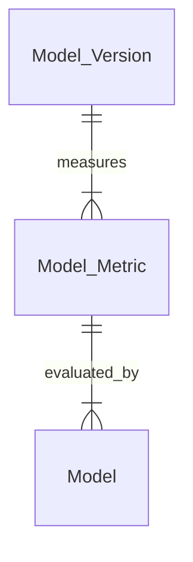
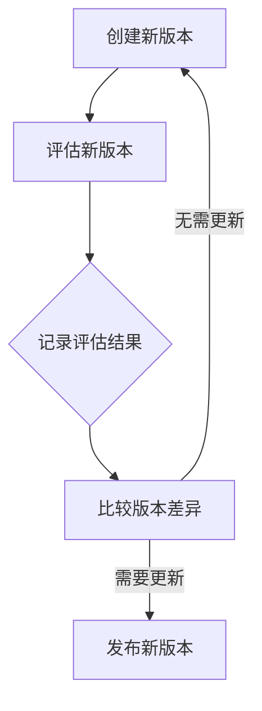

                 

## 第一部分：版本控制概述

### 1.1 背景介绍

#### 1.1.1 版本控制的基本概念

版本控制，也称为源代码控制，是一种跟踪和管理工作文件和代码变更的方法。在软件开发领域，版本控制是确保项目稳定性、代码一致性和协作效率的关键工具。通过版本控制，开发者可以追踪代码的变更历史，管理多个版本，快速回滚到之前的状态，以及协调团队成员的代码更新。

#### 1.1.2 版本控制的重要性

版本控制的重要性体现在以下几个方面：

1. **协作效率**：团队成员可以并行工作，并在需要时合并各自的修改，减少冲突。
2. **代码安全**：版本控制系统能够保护代码不受损坏或丢失，并提供恢复功能。
3. **历史追踪**：版本控制系统记录了每次代码变更的详细信息，有助于了解代码的演进过程。
4. **回归测试**：通过历史版本，开发者可以更容易地定位和修复问题。

#### 1.1.3 版本控制与LLM评测

在大型语言模型（LLM）评测中，版本控制尤为重要。LLM的复杂性和迭代速度使得追踪模型演进历程变得至关重要。版本控制能够帮助开发者：

1. **管理模型版本**：通过标记不同版本的模型，可以清晰地了解模型的演进过程。
2. **评估模型性能**：通过对比不同版本模型的评测结果，评估模型的改进程度。
3. **回溯模型变更**：在模型性能下降时，可以快速回溯到之前的版本。

### 1.2 核心概念与联系

#### 1.2.1 版本号

版本号是用于标识代码或模型不同版本的数字或字符串。通常，版本号遵循某种特定的格式，如语义版本控制（SemVer）。

#### 1.2.2 模型评估指标

模型评估指标用于衡量模型性能的多个方面，如准确率、召回率、F1分数等。不同的评测指标适用于不同类型的问题。

#### 1.2.3 概念关系ER图

ER图（实体关系图）可以帮助我们理解版本号和模型评估指标之间的关系。以下是ER图的Mermaid表示：



在上图中，`Model_Version`实体与`Model_Metric`实体之间存在“度量”关系，而`Model_Metric`实体与`Model`实体之间存在“评估”关系。这种关系体现了版本号与模型评估指标之间的紧密联系。接下来，我们将进一步探讨版本控制的算法原理。

----------------------------------------------------------------

## 第二部分：版本控制算法原理

### 2.1 算法流程图

#### 2.1.1 版本控制流程概述

版本控制流程通常包括以下几个步骤：

1. **创建新版本**：当开发者有新的修改时，会创建一个新的版本。
2. **评估新版本**：使用预定的评估指标对新版本进行性能评估。
3. **记录评估结果**：将新版本的评估结果记录到版本控制系统中。
4. **比较版本差异**：对比不同版本之间的性能差异，确定是否需要更新。
5. **发布新版本**：如果新版本的性能提升显著，则将其发布。

以下是基于上述步骤的版本控制流程图：



#### 2.1.2 算法步骤详细解释

1. **创建新版本**：开发者提交代码或模型变更，版本控制系统生成新的版本号。
2. **评估新版本**：使用预设的评估指标对新版本进行性能评估。例如，对于语言模型，可以使用准确率、召回率等指标。
3. **记录评估结果**：将评估结果（如性能分数）与版本号关联，存储在版本控制系统中。
4. **比较版本差异**：计算新版本与旧版本之间的性能差异。这通常通过比较评估指标来实现。
5. **发布新版本**：如果新版本的评估结果显著优于旧版本，则发布新版本。否则，保留当前版本。

### 2.2 Python代码实现

下面是一个简单的Python代码示例，用于实现版本控制的基本功能：

```python
# 版本控制类定义
class VersionControl:
    def __init__(self):
        self.versions = []
    
    def create_version(self, version_number, performance_score):
        self.versions.append({
            'version_number': version_number,
            'performance_score': performance_score
        })
    
    def evaluate_version(self, version_number, performance_score):
        for version in self.versions:
            if version['version_number'] == version_number:
                version['performance_score'] = performance_score
                break
    
    def compare_versions(self, version1, version2):
        return self.versions[version1]['performance_score'] - self.versions[version2]['performance_score']
    
    def publish_version(self, version_number):
        best_version_index = max(range(len(self.versions)), key=lambda i: self.versions[i]['performance_score'])
        if self.versions[best_version_index]['version_number'] == version_number:
            print(f"Version {version_number} published.")
        else:
            print(f"Version {version_number} not published.")

# 创建版本控制实例
vc = VersionControl()

# 创建和评估版本
vc.create_version(1, 0.8)
vc.create_version(2, 0.9)
vc.evaluate_version(2, 0.92)

# 比较版本
print(f"Version 1 and 2 difference: {vc.compare_versions(1, 2)}")

# 发布版本
vc.publish_version(2)
```

### 2.3 LaTeX公式与详细讲解

版本控制的算法原理可以通过数学模型来描述。以下是版本控制策略的数学模型：

$$
\text{模型更新策略} = \frac{\text{新模型评估指标}}{\text{旧模型评估指标}}
$$

该公式表示新模型相对于旧模型的性能改进程度。如果新模型的评估指标高于旧模型，则更新策略为正，表示模型性能改进。否则，更新策略为负或零，表示模型性能未改进或退化。

#### 2.3.2 举例说明

假设我们有两个模型的评估指标，分别是旧模型的准确率为0.85，新模型的准确率为0.90。根据上述公式，我们可以计算更新策略：

$$
\text{模型更新策略} = \frac{0.90}{0.85} = 1.06
$$

这意味着新模型相对于旧模型性能提高了6%。如果更新策略大于1，通常认为模型改进显著，值得发布。如果更新策略小于1，则可能需要进一步优化或回溯到旧版本。通过这种数学模型和公式，开发者可以更准确地评估模型的演进过程，并做出合理的决策。接下来，我们将探讨系统分析与架构设计的相关内容。

