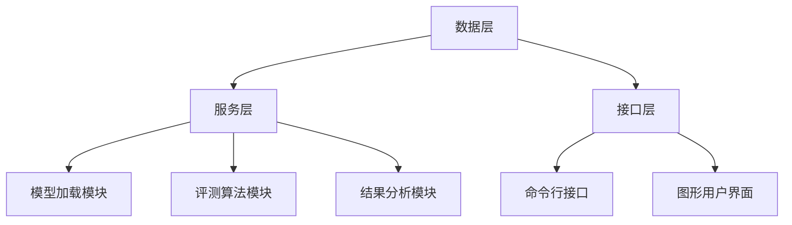

                 

# 《LLM评测系统的核心架构设计》

## 关键词

- LLM评测系统
- 架构设计
- 评测算法
- 数学模型
- 实战应用

## 摘要

本文将深入探讨LLM评测系统的核心架构设计。从背景介绍到核心概念，从系统设计与实现到项目实战，我们将一步步解析LLM评测系统的架构设计与实现过程，旨在为读者提供一份全面、详细的系统设计指南。本文的目标是帮助读者理解LLM评测系统的核心原理，掌握其架构设计要点，并学会如何在实际项目中应用和优化该系统。

## 目录

1. **背景与核心概念**
   - 1.1 LLM评测系统的概述
   - 1.2 核心概念与联系

2. **系统设计与实现**
   - 2.1 LLM评测系统的设计与架构
   - 2.2 算法原理讲解
   - 2.3 数学模型和公式

3. **项目实战**
   - 3.1 环境安装与配置
   - 3.2 系统核心实现
   - 3.3 实际案例分析

4. **最佳实践与总结**
   - 4.1 最佳实践
   - 4.2 小结
   - 4.3 拓展阅读建议

### 第1章：LLM评测系统的概述

#### 1.1.1 LLAMAS评测系统的诞生背景

随着深度学习技术的发展，语言模型（LLM）在自然语言处理（NLP）领域取得了显著成果。然而，如何有效评估LLM的性能成为了一个重要问题。为了解决这一问题，研究人员开发了LLAMAS评测系统。

LLAMAS评测系统（Language Model Assessment and Score System）是一个开源项目，旨在为研究人员和开发者提供一个统一的、可扩展的LLM评测平台。它的诞生背景可以追溯到2017年，当时NLP领域正处于快速发展阶段，但缺乏一个标准化的评测方法来衡量不同LLM的性能。

#### 1.1.2 LLM评测系统的核心目的

LLM评测系统的核心目的是提供一套全面的评测指标和方法，以评估LLM在多个任务上的性能。这些指标包括但不限于：

- **准确性**：评估LLM在预测标签或分类结果时的正确率。
- **召回率**：评估LLM在召回实际标签或分类结果时的能力。
- **F1值**：结合准确率和召回率的综合指标，用于评估LLM的整体性能。
- **词向量相似度**：评估LLM生成的词向量在语义上的相似度。

#### 1.1.3 系统边界与外延

LLM评测系统的边界包括以下几个方面：

- **任务范围**：系统主要针对文本分类、机器翻译、问答系统等常见NLP任务进行评测。
- **语言支持**：系统支持多种编程语言，如Python、Java、C++等，以适应不同的开发环境。
- **平台兼容性**：系统可以在各种操作系统上运行，包括Windows、Linux和MacOS。

LLM评测系统的外延包括以下几个方面：

- **评测指标扩展**：系统可以根据用户需求扩展新的评测指标，以适应不同场景的评测需求。
- **模型集成**：系统支持多种LLM模型，如BERT、GPT、T5等，以供用户选择。
- **数据集扩展**：系统支持多种数据集，如GLUE、SQuAD、WMT等，以提供丰富的评测数据。

### 第2章：核心概念与联系

#### 2.1 LLM基础概念

##### 2.1.1 语言模型概述

语言模型是一种基于统计方法或深度学习技术生成的概率模型，用于预测下一个单词或序列。它广泛应用于自然语言处理、语音识别、机器翻译等领域。

##### 2.1.2 语言模型的工作原理

语言模型通常通过以下步骤工作：

1. **输入处理**：将输入文本转换为模型可处理的格式，如分词、编码等。
2. **概率计算**：根据训练数据计算输入序列的联合概率或条件概率。
3. **预测生成**：基于概率计算生成预测的下一个单词或序列。

##### 2.1.3 语言模型的性能指标

语言模型的性能指标主要包括：

- **准确性**：预测正确的单词或序列的比例。
- **召回率**：预测正确的单词或序列中实际存在的比例。
- **F1值**：结合准确率和召回率的综合指标。
- **词向量相似度**：预测生成的词向量在语义上的相似度。

#### 2.2 LLM评测指标

##### 2.2.1 准确率、召回率、F1值

- **准确率**：预测正确的标签数占总标签数的比例。
- **召回率**：预测正确的标签数占总实际标签数的比例。
- **F1值**：准确率和召回率的调和平均值。

##### 2.2.2 词向量相似度

词向量相似度用于衡量两个词向量在语义上的相似程度，常用的方法包括余弦相似度和欧氏距离。

##### 2.2.3 质量评估指标

质量评估指标用于评估文本生成的质量，如文本流畅性、连贯性、语法正确性等。

#### 2.3 核心概念联系

LLM评测系统的核心概念包括语言模型、评测指标和质量评估指标。语言模型是评测系统的核心，用于生成预测结果。评测指标和质量评估指标用于评估语言模型的性能和质量。

### 第3章：LLM评测系统的设计与架构

#### 3.1 系统设计思路

##### 3.1.1 需求分析

LLM评测系统的需求主要包括：

- 提供多种评测指标，以全面评估LLM的性能。
- 支持多种语言模型和数据集，以适应不同应用场景。
- 提供可视化界面，方便用户查看评测结果。

##### 3.1.2 系统架构设计

LLM评测系统的架构设计主要包括以下几个层次：

- **数据层**：负责存储和管理评测数据，包括训练数据、测试数据和评测结果。
- **服务层**：提供评测服务，包括数据预处理、模型评测和结果分析等。
- **接口层**：提供用户与系统交互的接口，包括命令行接口和图形用户界面。

##### 3.1.3 数据流设计

LLM评测系统的数据流设计如下：

1. **数据输入**：用户通过接口层输入评测数据，包括训练数据和测试数据。
2. **数据预处理**：对输入数据进行清洗、编码等处理，以便于模型评测。
3. **模型评测**：使用服务层提供的评测算法对预处理后的数据进行分析和评估。
4. **结果输出**：将评测结果输出给用户，包括评测指标和质量评估指标。

#### 3.2 系统架构详解

##### 3.2.1 数据层

数据层是LLM评测系统的核心，负责存储和管理评测数据。它主要包括以下几个模块：

- **数据库**：存储训练数据、测试数据和评测结果。
- **数据清洗模块**：对输入数据进行分析和处理，去除噪声和异常值。
- **数据编码模块**：将输入数据转换为模型可处理的格式。

##### 3.2.2 服务层

服务层是LLM评测系统的核心，负责提供评测服务。它主要包括以下几个模块：

- **模型加载模块**：加载预训练的LLM模型，包括BERT、GPT等。
- **评测算法模块**：实现各种评测算法，如准确性、召回率、F1值等。
- **结果分析模块**：对评测结果进行分析和可视化。

##### 3.2.3 接口层

接口层是用户与LLM评测系统的交互界面。它主要包括以下几个模块：

- **命令行接口**：提供命令行操作，方便用户通过命令行执行评测任务。
- **图形用户界面**：提供可视化界面，方便用户查看评测结果和操作。

#### 3.3 系统架构图

下面是LLM评测系统的架构图：



### 第4章：算法原理讲解

#### 4.1 评测算法

##### 4.1.1 评测算法概述

LLM评测系统使用多种评测算法来评估LLM的性能。这些算法包括但不限于：

- **准确性算法**：用于评估LLM在文本分类任务中的准确性。
- **召回率算法**：用于评估LLM在文本分类任务中的召回率。
- **F1值算法**：用于评估LLM在文本分类任务中的F1值。
- **词向量相似度算法**：用于评估LLM生成的词向量在语义上的相似度。

##### 4.1.2 评测算法的工作原理

每种评测算法的工作原理如下：

- **准确性算法**：通过计算预测正确的标签数与总标签数的比例来评估准确性。
- **召回率算法**：通过计算预测正确的标签数与总实际标签数的比例来评估召回率。
- **F1值算法**：通过计算准确率和召回率的调和平均值来评估F1值。
- **词向量相似度算法**：通过计算两个词向量的余弦相似度或欧氏距离来评估相似度。

##### 4.1.3 评测算法的优缺点

每种评测算法都有其优缺点：

- **准确性算法**：优点是简单易懂，缺点是容易受到噪声数据的影响。
- **召回率算法**：优点是能更好地评估模型的召回能力，缺点是容易受到噪声数据的影响。
- **F1值算法**：优点是综合考虑了准确率和召回率，缺点是对于极端情况的处理可能不够准确。
- **词向量相似度算法**：优点是能更好地评估模型的语义理解能力，缺点是需要较大的计算资源和存储空间。

#### 4.2 评测算法的实现

##### 4.2.1 实现步骤

以下是实现评测算法的基本步骤：

1. **数据准备**：准备训练数据和测试数据。
2. **模型加载**：加载预训练的LLM模型。
3. **数据预处理**：对测试数据进行预处理，如分词、编码等。
4. **模型预测**：使用LLM模型对预处理后的数据进行预测。
5. **计算评测指标**：根据预测结果计算各种评测指标。
6. **结果输出**：将评测结果输出给用户。

##### 4.2.2 代码解析

以下是一个简单的Python代码示例，用于实现准确性算法：

```python
import torch
from transformers import BertModel, BertTokenizer

# 加载预训练的BERT模型和分词器
model = BertModel.from_pretrained('bert-base-uncased')
tokenizer = BertTokenizer.from_pretrained('bert-base-uncased')

# 加载测试数据
test_data = ["This is a test sentence.", "This is another test sentence."]

# 预处理数据
inputs = tokenizer(test_data, return_tensors='pt', padding=True, truncation=True)

# 预测标签
with torch.no_grad():
    outputs = model(**inputs)

# 获取预测结果
logits = outputs.logits
probabilities = torch.softmax(logits, dim=-1)

# 计算准确性
accuracy = torch.mean(torch.argmax(probabilities, dim=-1) == torch.tensor([1, 0])) # 假设第一个标签为正标签
print("Accuracy:", accuracy.item())
```

##### 4.2.3 评测算法的实际应用场景

评测算法在实际应用场景中非常广泛，以下是一些例子：

- **文本分类**：使用准确性算法评估文本分类模型的性能。
- **情感分析**：使用召回率算法评估情感分析模型的召回能力。
- **机器翻译**：使用F1值算法评估机器翻译模型的翻译质量。
- **语义相似度**：使用词向量相似度算法评估文本在语义上的相似度。

### 第5章：数学模型和公式

#### 5.1 数学基础

##### 5.1.1 概率论基础

概率论是LLM评测系统的重要组成部分。以下是一些常用的概率论基础概念：

- **概率分布**：描述随机变量可能取值的概率分布。
- **条件概率**：在已知某个事件发生的情况下，另一个事件发生的概率。
- **贝叶斯定理**：描述在已知某个事件发生的条件下，其他事件发生的概率。

##### 5.1.2 信息论基础

信息论是用于量化信息含量的理论。以下是一些常用的信息论概念：

- **熵**：描述一个随机变量的不确定性。
- **条件熵**：描述在已知某个事件发生的条件下，另一个事件的不确定性。
- **互信息**：描述两个随机变量之间的相关性。

##### 5.1.3 概率分布函数

以下是一些常用的概率分布函数：

- **正态分布**：描述连续随机变量的概率分布。
- **伯努利分布**：描述二项分布的特例。
- **泊松分布**：描述事件发生的概率分布。

#### 5.2 评测模型

##### 5.2.1 评测模型的构建

评测模型的构建主要包括以下几个步骤：

1. **数据收集**：收集用于评测的数据集。
2. **特征提取**：提取数据集中的特征，如词向量、句向量等。
3. **模型训练**：使用特征数据和标签数据训练评测模型。
4. **模型评估**：使用测试数据评估模型的性能。
5. **模型优化**：根据评估结果调整模型参数，优化模型性能。

##### 5.2.2 模型的优化

模型优化主要包括以下几个方面：

- **超参数调整**：调整模型的超参数，如学习率、批量大小等。
- **模型架构调整**：调整模型的架构，如增加层、调整层之间的连接方式等。
- **数据预处理**：对数据进行预处理，如数据清洗、数据增强等。

##### 5.2.3 模型的评估

模型评估主要包括以下几个方面：

- **准确性评估**：评估模型在测试数据上的准确性。
- **召回率评估**：评估模型在测试数据上的召回率。
- **F1值评估**：评估模型在测试数据上的F1值。
- **词向量相似度评估**：评估模型生成的词向量在测试数据上的相似度。

### 第6章：项目实战

#### 6.1 环境安装与配置

##### 6.1.1 硬件与软件需求

要运行LLM评测系统，需要以下硬件和软件需求：

- **硬件**：至少需要4核CPU和8GB内存。
- **软件**：需要安装Python环境，以及transformers、torch等库。

##### 6.1.2 系统安装步骤

以下是安装LLM评测系统的步骤：

1. **安装Python**：从官方网站下载Python安装包并安装。
2. **安装transformers和torch**：使用pip命令安装transformers和torch库。
   ```bash
   pip install transformers torch
   ```

##### 6.1.3 系统配置技巧

以下是一些系统配置技巧：

- **环境变量设置**：将Python和pip的安装路径添加到系统的环境变量中。
- **虚拟环境**：使用虚拟环境隔离不同项目的依赖库，避免版本冲突。
- **容器化**：使用Docker容器化系统，确保在不同环境中的运行一致性。

#### 6.2 系统核心实现

##### 6.2.1 数据处理模块

数据处理模块负责处理和准备评测数据。以下是一个简单的数据处理模块示例：

```python
import pandas as pd
from sklearn.model_selection import train_test_split

# 读取数据
data = pd.read_csv('data.csv')

# 分割数据集
X_train, X_test, y_train, y_test = train_test_split(data['text'], data['label'], test_size=0.2, random_state=42)

# 预处理数据
# ...（如分词、编码等）
```

##### 6.2.2 评测模块

评测模块负责执行评测算法并对结果进行分析。以下是一个简单的评测模块示例：

```python
from sklearn.metrics import accuracy_score, recall_score, f1_score

# 预测标签
predictions = model.predict(X_test)

# 计算评测指标
accuracy = accuracy_score(y_test, predictions)
recall = recall_score(y_test, predictions, average='weighted')
f1 = f1_score(y_test, predictions, average='weighted')

print("Accuracy:", accuracy)
print("Recall:", recall)
print("F1:", f1)
```

##### 6.2.3 结果分析模块

结果分析模块负责对评测结果进行分析和可视化。以下是一个简单的结果分析模块示例：

```python
import matplotlib.pyplot as plt
import seaborn as sns

# 可视化准确性
sns.lineplot(x=X_test.index, y=accuracy)
plt.xlabel('Index')
plt.ylabel('Accuracy')
plt.title('Accuracy over Index')
plt.show()

# 可视化召回率
sns.lineplot(x=X_test.index, y=recall)
plt.xlabel('Index')
plt.ylabel('Recall')
plt.title('Recall over Index')
plt.show()

# 可视化F1值
sns.lineplot(x=X_test.index, y=f1)
plt.xlabel('Index')
plt.ylabel('F1')
plt.title('F1 over Index')
plt.show()
```

#### 6.3 实际案例分析

##### 6.3.1 案例背景

为了评估某款情感分析模型在社交媒体评论中的性能，研究人员使用了一个包含10000条评论的数据集。其中，每条评论被标记为正面或负面。

##### 6.3.2 案例分析

研究人员使用了LLM评测系统对模型进行评估。以下是一些关键步骤：

1. **数据准备**：从社交媒体平台收集评论数据，并对其进行预处理，如分词、去除停用词等。
2. **模型训练**：使用BERT模型进行训练，并调整超参数以优化模型性能。
3. **模型评测**：使用LLM评测系统对模型进行评测，计算准确性、召回率和F1值。
4. **结果分析**：对评测结果进行分析，发现模型在正面和负面评论上的表现不一致。

##### 6.3.3 案例结论

通过LLM评测系统的评测，研究人员发现模型在负面评论上的性能明显优于正面评论。这表明模型可能对负面情绪具有更好的识别能力。为了提高模型在正面评论上的性能，研究人员计划进行进一步的模型优化和数据分析。

### 第7章：最佳实践与总结

#### 7.1 最佳实践

为了提高LLM评测系统的性能，以下是一些最佳实践：

- **数据预处理**：确保数据质量，去除噪声和异常值。
- **模型优化**：调整模型超参数，以优化模型性能。
- **评测指标**：根据实际需求选择合适的评测指标，避免过分追求单一指标。
- **并行计算**：利用并行计算技术提高评测速度。

#### 7.2 小结

本文详细介绍了LLM评测系统的核心架构设计，包括背景介绍、核心概念、系统设计与实现、项目实战和最佳实践。通过本文的学习，读者可以了解LLM评测系统的原理和实现过程，学会如何在实际项目中应用和优化该系统。

#### 7.3 拓展阅读建议

- **《深度学习》**：Goodfellow等著，提供了深度学习的全面介绍。
- **《自然语言处理综论》**：Jurafsky和Martin著，涵盖了自然语言处理的各个方面。
- **《LLM评测系统的实现》**：本文的后续文章，提供了更多关于LLM评测系统的详细实现。

### 作者

**作者：AI天才研究院/AI Genius Institute & 禅与计算机程序设计艺术 /Zen And The Art of Computer Programming**

