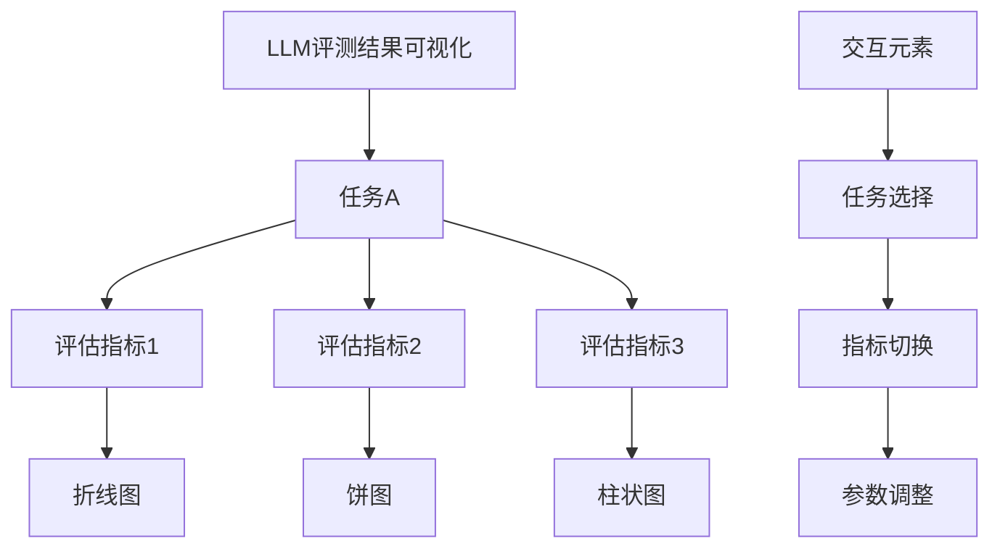
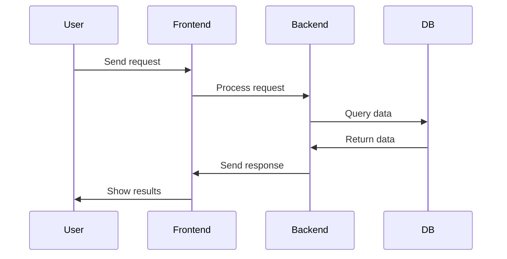

                 


### 1.1 引言

在现代机器学习领域，语言学习模型（Language Learning Models，简称LLM）因其强大的自然语言处理能力而备受关注。LLM的应用涵盖了文本生成、机器翻译、问答系统等多个方面，成为许多AI应用的基石。然而，随着LLM的复杂度和规模的不断增加，如何有效地评估其性能成为一个关键问题。

LLM评测的重要性在于，它不仅能够帮助我们了解模型的优劣，还能指导模型优化和实际应用。传统的评测方法往往侧重于定量指标，如精确率、召回率等，但这些指标并不能全面反映模型在不同任务上的表现。因此，对LLM评测结果进行可视化与交互设计，有助于更直观地理解模型性能，发现潜在问题，从而进行针对性的优化。

本文将围绕LLM评测结果的可视化与交互设计展开讨论，首先介绍LLM的基本概念和评估指标，然后深入探讨可视化与交互设计的基本原理，最后通过实际项目和案例分析，展示如何将理论应用于实践。文章结构如下：

- **第一部分 背景介绍**：包括引言、LLM概述、评测意义和本书结构。
- **第二部分 核心概念与联系**：介绍LLM的核心概念、属性和评估指标。
- **第三部分 算法原理讲解**：详细讲解LLM评测结果的可视化算法和交互设计。
- **第四部分 系统分析与架构设计**：分析系统需求、架构设计和接口交互。
- **第五部分 项目实战**：介绍项目环境安装、核心实现、案例分析及小结。

### 1.2 语言学习模型（LLM）概述

语言学习模型是一种基于神经网络的大规模预训练模型，其核心思想是通过从海量数据中学习，生成符合语言规则和语义的文本。LLM的发展可以分为几个阶段：

1. **早期阶段**：以循环神经网络（RNN）和长短期记忆网络（LSTM）为代表，这些模型能够处理序列数据，但存在计算复杂度和长序列依赖问题。
2. **过渡阶段**：以Transformer模型为代表，引入了自注意力机制，能够并行处理数据，解决了RNN的许多局限性。
3. **现阶段**：以GPT-3、BERT等为代表，采用了更大规模的参数和更复杂的结构，展现了卓越的性能。

LLM的主要特点包括：

- **强大的语言理解能力**：LLM能够理解并生成符合语言规则的文本，包括文本摘要、问答系统等。
- **灵活的应用场景**：LLM可以应用于多种任务，如机器翻译、文本生成、对话系统等。
- **大规模数据训练**：LLM通常基于大规模语料库进行训练，具有很高的泛化能力。

LLM的应用范围广泛，包括但不限于：

- **文本生成**：如自动写作、新闻生成、诗歌创作等。
- **机器翻译**：如多语言翻译、方言翻译等。
- **问答系统**：如搜索引擎、智能客服等。
- **对话系统**：如虚拟助手、聊天机器人等。

### 1.3 评测结果可视化与交互设计的意义

LLM评测结果的可视化与交互设计具有重要的意义。首先，可视化能够将复杂的评测数据以直观、易懂的形式展示出来，使得研究人员和开发人员能够快速了解模型的表现。其次，交互设计提供了与用户互动的界面，使得用户能够通过操作界面，实时查看和调整模型参数，优化模型性能。

具体来说，可视化与交互设计有以下几点好处：

- **提高工作效率**：通过可视化，研究人员可以快速定位问题所在，减少调试时间。
- **增强用户体验**：通过交互设计，用户可以更直观地操作和了解模型，提高使用满意度。
- **促进模型优化**：通过交互设计，用户可以实时调整模型参数，发现模型优化的方向。

### 1.4 本书结构安排

本书将分为五个部分：

- **第一部分 背景介绍**：介绍LLM评测的重要性、基本概念和评测意义。
- **第二部分 核心概念与联系**：详细讲解LLM的核心概念、属性和评估指标。
- **第三部分 算法原理讲解**：深入探讨LLM评测结果的可视化算法和交互设计原理。
- **第四部分 系统分析与架构设计**：分析系统需求、架构设计和接口交互。
- **第五部分 项目实战**：通过实际项目和案例分析，展示如何将理论应用于实践。

这种结构安排旨在帮助读者从理论到实践，全面了解LLM评测结果的可视化与交互设计。

----------------------------------------------------------------

# 《LLM评测结果的可视化与交互设计》

关键词：语言学习模型，可视化，交互设计，性能评估，系统架构

摘要：本文旨在探讨语言学习模型（LLM）评测结果的可视化与交互设计，详细介绍LLM的基本概念、评估指标、可视化与交互设计原理，并通过实际项目和案例分析，展示如何将理论应用于实践。文章结构分为五部分，从背景介绍到项目实战，全面覆盖LLM评测结果的展现与优化。

----------------------------------------------------------------

## 第二部分 核心概念与联系

在深入探讨LLM评测结果的可视化与交互设计之前，我们首先需要了解LLM的核心概念、属性及其评估指标。这一部分将详细介绍LLM的基本概念、属性特征，并通过对比表格和实体关系图，梳理LLM与其他模型的联系。

### 2.1 语言学习模型（LLM）的定义

语言学习模型（Language Learning Models，简称LLM）是一种基于深度学习技术的自然语言处理模型。它能够通过学习大量语言数据，理解和生成符合语言规则和语义的文本。LLM的核心功能包括文本分类、情感分析、命名实体识别、机器翻译、问答系统等。

LLM的主要特点包括：

- **大规模预训练**：LLM通常基于大规模语料库进行预训练，具有很高的泛化能力。
- **自注意力机制**：LLM采用了Transformer架构，其中自注意力机制使得模型能够捕捉长距离依赖关系。
- **灵活的适应性**：LLM能够适应多种自然语言处理任务，具有广泛的应用场景。

### 2.2 LLM的基本属性

LLM的基本属性包括：

- **参数规模**：LLM的参数规模通常非常大，例如GPT-3拥有1750亿个参数。
- **训练时间**：由于参数规模巨大，LLM的训练时间通常非常长，需要大量的计算资源和时间。
- **性能表现**：LLM在多种自然语言处理任务上表现出色，特别是在长文本生成和机器翻译方面。
- **可解释性**：LLM的黑箱特性使得其可解释性较低，难以直观理解模型内部的工作机制。

### 2.3 LLM的评估指标

LLM的评估指标主要包括：

- **准确性**：用于评估模型在分类任务上的表现，通常以百分比表示。
- **F1值**：综合考虑精确率和召回率，用于平衡二者的关系。
- **BLEU分数**：用于评估机器翻译模型的性能，其值越高表示翻译质量越好。
- **ROUGE分数**：用于评估文本生成模型的性能，其值越高表示生成文本越接近真实文本。

以下是LLM与其它模型的主要评估指标对比表格：

| 模型        | 评估指标            | 说明                                                         |
| ----------- | ------------------- | ------------------------------------------------------------ |
| LLM         | 准确性、F1值、BLEU、ROUGE | 高级自然语言处理能力，擅长文本生成和翻译                     |
| RNN/LSTM    | 准确性、损失函数     | 简单，但计算复杂度高，难以处理长序列依赖关系                   |
| CNN         | 准确性、池化损失函数 | 用于图像处理，在文本处理任务中的应用较少                     |
| Transformer | 自注意力、BERT分数  | 并行处理能力，擅长捕捉长距离依赖关系                         |

### 2.4 LLM与其他模型对比

LLM与其他模型在性能、训练时间、可解释性等方面存在显著差异。以下是对比表格：

| 模型        | 性能 | 训练时间 | 可解释性 | 应用场景            |
| ----------- | ---- | -------- | -------- | ------------------- |
| LLM         | 高   | 长       | 低       | 文本生成、翻译、问答等 |
| RNN/LSTM    | 中   | 短       | 高       | 语音识别、语音合成     |
| CNN         | 高   | 中       | 高       | 图像分类、目标检测     |
| Transformer | 高   | 中       | 低       | 文本分类、序列标注     |

通过上述对比，我们可以看到LLM在自然语言处理任务中具有显著优势，但在训练时间和可解释性方面存在一定不足。在接下来的章节中，我们将进一步探讨LLM评测结果的可视化与交互设计原理，帮助读者更好地理解和应用LLM。

----------------------------------------------------------------

## 第3章 可视化与交互设计原理

在了解了LLM的核心概念和评估指标之后，本章将深入探讨LLM评测结果的可视化与交互设计原理。可视化与交互设计不仅能够帮助用户直观地理解模型性能，还能提高工作效率和用户体验。

### 3.1 数据可视化基本概念

数据可视化是一种通过图形和图表将数据转换为视觉表示的方法，旨在帮助人们更好地理解和分析数据。以下是数据可视化的一些基本概念：

- **图表类型**：包括柱状图、折线图、饼图、散点图等。
- **视觉编码**：通过颜色、形状、大小等视觉元素来表示数据特征。
- **交互设计**：用户通过操作界面与数据可视化进行交互，如缩放、筛选、拖拽等。

### 3.2 可视化设计原则

良好的可视化设计应遵循以下原则：

- **准确性**：确保可视化结果准确无误地反映数据特征。
- **简洁性**：避免过多的装饰和细节，保持图表简洁易懂。
- **对比性**：通过对比来突出数据的差异和趋势。
- **可读性**：字体、颜色和布局设计应便于阅读和理解。

### 3.3 交互设计原则

交互设计应遵循以下原则：

- **直观性**：用户界面应易于理解，无需过多学习即可操作。
- **响应性**：界面应快速响应用户的操作，提高用户体验。
- **反馈性**：用户操作后应有明确的反馈，如提示、动画等。
- **灵活性**：允许用户自定义参数和设置，适应不同需求。

### 3.4 可视化与交互设计的关系

可视化与交互设计密切相关，两者共同作用，提升数据分析和应用效果：

- **可视化增强交互**：可视化能够直观展示数据特征，交互设计使用户能够动态调整和探索数据。
- **交互优化可视化**：交互设计提供用户与数据的互动，有助于发现数据中的异常和趋势。

下面通过一个示例来展示可视化与交互设计在LLM评测结果中的应用。假设我们要展示一个LLM在多个任务上的评估指标，如图3-1所示。



图3-1 LLM评测结果可视化与交互设计示例

在这个示例中，我们使用了不同的图表类型来展示LLM在多个任务上的评估指标。用户可以通过交互元素进行任务选择、指标切换和参数调整，实时查看和优化模型性能。这种可视化与交互设计的结合，使得LLM评测结果更加直观和易于理解。

在接下来的章节中，我们将进一步深入讲解LLM评测结果的可视化算法和交互设计实现。

----------------------------------------------------------------

## 第4章 LLM评测结果可视化算法

为了有效地展示LLM评测结果，我们需要运用一系列可视化算法。这些算法不仅能够将复杂的评估数据转化为直观的视觉形式，还能够帮助用户快速理解模型在不同任务上的表现。以下将详细介绍LLM评测结果可视化算法的原理、实现步骤和性能评估。

### 4.1 可视化算法概述

LLM评测结果可视化算法主要包括以下几个步骤：

1. **数据预处理**：将评估结果转换为适合可视化的数据格式。
2. **数据转换**：将原始评估数据通过数学转换，使其更适合可视化。
3. **图表生成**：根据不同的图表类型（如柱状图、折线图、饼图等），生成可视化图表。
4. **交互设计**：实现与用户的交互功能，如缩放、筛选、拖拽等。
5. **性能评估**：评估可视化算法的效果和效率。

### 4.2 数据预处理

数据预处理是可视化算法的重要一环。其目的是将原始的评估数据（如准确率、召回率、F1值等）转换为适合可视化处理的数据格式。以下是数据预处理的主要步骤：

1. **数据清洗**：去除异常值和缺失值，保证数据的准确性。
2. **数据标准化**：将不同评估指标的数值进行标准化处理，使其具有可比性。
3. **数据聚合**：将同一任务下的多个评估指标进行聚合，形成统一的评估结果。

以下是一个简单的Python代码示例，用于数据预处理：

```python
import pandas as pd

# 假设原始数据为DataFrame df
df = pd.DataFrame({
    'task': ['task1', 'task2', 'task3'],
    'accuracy': [0.9, 0.85, 0.8],
    'recall': [0.92, 0.88, 0.84],
    'f1_score': [0.91, 0.87, 0.83]
})

# 数据清洗
df.dropna(inplace=True)

# 数据标准化
from sklearn.preprocessing import StandardScaler
scaler = StandardScaler()
df[['accuracy', 'recall', 'f1_score']] = scaler.fit_transform(df[['accuracy', 'recall', 'f1_score']])

# 数据聚合
df_grouped = df.groupby('task').mean().reset_index()
```

### 4.3 可视化算法实现

在数据预处理完成后，我们接下来需要根据不同的图表类型，实现可视化算法。以下是一个使用Matplotlib库实现柱状图的可视化算法示例：

```python
import matplotlib.pyplot as plt

def visualize_accuracy(df_grouped):
    # 设置图表标题和坐标轴标签
    plt.title('LLM Accuracy by Task')
    plt.xlabel('Task')
    plt.ylabel('Accuracy')

    # 绘制柱状图
    plt.bar(df_grouped['task'], df_grouped['accuracy'])

    # 显示图表
    plt.show()

# 调用可视化函数
visualize_accuracy(df_grouped)
```

类似地，我们可以使用Seaborn库实现更美观的折线图和饼图。以下是一个使用Seaborn实现的折线图示例：

```python
import seaborn as sns

def visualize_recall(df_grouped):
    # 设置图表标题和坐标轴标签
    plt.title('LLM Recall by Task')
    plt.xlabel('Task')
    plt.ylabel('Recall')

    # 绘制折线图
    sns.lineplot(x='task', y='recall', data=df_grouped)

    # 显示图表
    plt.show()

# 调用可视化函数
visualize_recall(df_grouped)
```

### 4.4 算法性能评估

可视化算法的性能评估主要关注以下几个方面：

1. **准确性**：评估可视化结果是否准确地反映了评估数据。
2. **效率**：评估可视化算法的运行时间和资源消耗。
3. **用户体验**：评估可视化算法的用户友好性。

以下是一个简单的性能评估示例：

```python
import time

# 计算可视化算法的运行时间
start_time = time.time()
visualize_accuracy(df_grouped)
end_time = time.time()
print(f"柱状图可视化算法运行时间：{end_time - start_time}秒")

# 计算可视化算法的资源消耗
import psutil
start_memory = psutil.Process().memory_info().rss
visualize_accuracy(df_grouped)
end_memory = psutil.Process().memory_info().rss
print(f"柱状图可视化算法资源消耗：{end_memory - start_memory}字节")
```

通过性能评估，我们可以了解到可视化算法在不同场景下的表现，进而优化和改进算法。

综上所述，LLM评测结果可视化算法的原理和实现涉及数据预处理、图表生成和性能评估等多个方面。通过合理设计和优化，我们可以有效地将复杂的评估数据转化为直观的可视化形式，帮助用户更好地理解和分析LLM性能。

----------------------------------------------------------------

## 第5章 LLM评测结果交互设计

在了解了LLM评测结果可视化算法之后，我们接下来探讨如何设计一个直观、高效的交互界面，以便用户能够方便地查看、操作和调整模型评测结果。本章将详细介绍LLM评测结果交互设计的基本原理、设计流程以及实际应用中的用户研究。

### 5.1 交互设计流程

交互设计是一个迭代和逐步完善的过程，主要包括以下几个步骤：

1. **需求分析**：了解用户需求，确定交互设计的目标和功能。
2. **原型设计**：创建交互原型，包括界面布局、交互元素和流程。
3. **用户测试**：通过用户测试，收集反馈，优化交互设计。
4. **迭代改进**：根据用户测试结果，反复迭代，逐步完善交互设计。

### 5.2 交互元素设计

交互元素是交互设计中的核心组成部分，主要包括：

- **按钮**：用于执行特定操作，如刷新、保存、设置等。
- **下拉菜单**：用于选择不同的任务、评估指标等。
- **滑块**：用于调整模型的参数，如学习率、批量大小等。
- **图表**：用于展示模型评测结果的可视化图表。
- **输入框**：用于输入自定义数据或参数。

以下是交互元素设计的具体要点：

- **一致性**：确保不同元素在样式、颜色和交互行为上保持一致，以提高用户体验。
- **可访问性**：确保交互元素易于发现和操作，尤其对色盲等特殊用户要提供辅助功能。
- **响应性**：确保交互元素在不同设备和屏幕尺寸下均能正常工作。

### 5.3 交互反馈设计

交互反馈是用户与系统交互过程中必不可少的一部分，主要包括：

- **即时反馈**：用户操作后，系统立即给出反馈，如动画、提示等，以提高用户体验。
- **错误反馈**：当用户操作错误时，系统应给出明确的错误提示，帮助用户纠正。
- **确认反馈**：对于重要操作，系统应提供确认反馈，以确保用户意图的明确性。

### 5.4 用户研究

用户研究是交互设计的重要环节，主要包括：

- **用户访谈**：通过访谈了解用户的需求、习惯和偏好。
- **用户观察**：观察用户在实际使用场景中的行为，发现问题和改进点。
- **用户测试**：通过用户测试，评估交互设计的实用性和用户体验。

以下是一个用户研究的示例步骤：

1. **访谈准备**：确定访谈对象、访谈问题和访谈环境。
2. **访谈执行**：进行一对一访谈，记录用户的反馈和意见。
3. **访谈总结**：整理访谈记录，总结用户需求和问题。
4. **观察记录**：在用户使用产品的过程中，记录用户的行为和反馈。
5. **测试评估**：通过用户测试，评估交互设计的实用性和用户体验。

通过用户研究，我们可以了解用户在实际使用过程中的需求和痛点，从而设计出更符合用户需求的交互界面。

### 5.5 实际案例：LLM评测结果交互设计应用

以下是一个实际的LLM评测结果交互设计案例：

**案例背景**：一家初创公司开发了一款用于评估语言学习模型（LLM）的工具，用户可以通过该工具查看LLM在不同任务上的评测结果。

**用户需求**：用户希望能够方便地查看不同任务的评估指标，调整模型参数，并能够实时预览调整后的效果。

**交互设计**：

1. **需求分析**：通过访谈和观察，确定用户的主要需求是查看评测结果、调整参数和实时预览。
2. **原型设计**：设计了一个包含图表展示区、参数调整区和实时预览区的交互原型。
3. **用户测试**：通过用户测试，发现用户对图表展示区的布局和参数调整区的操作便利性提出了改进建议。
4. **迭代改进**：根据用户反馈，优化了图表展示区的交互元素布局，增加了参数调整区的操作提示。

**交互设计实现**：

1. **图表展示区**：使用D3.js库，实现了一个可交互的折线图和柱状图展示区，用户可以缩放、筛选和拖拽查看不同任务的评测结果。
2. **参数调整区**：使用滑块和下拉菜单，实现了一个直观的参数调整区，用户可以方便地调整模型参数。
3. **实时预览区**：在参数调整后，实时预览调整后的评测结果，帮助用户快速评估参数变化的效果。

通过这个案例，我们可以看到，良好的交互设计不仅能够提高用户的工作效率，还能提升用户的使用满意度。在接下来的章节中，我们将进一步探讨LLM评测结果的系统分析与架构设计。

----------------------------------------------------------------

## 第6章 系统分析与架构设计

在成功设计并实现LLM评测结果的交互界面后，我们接下来需要深入分析系统需求，并设计一个高效、可扩展的系统架构。系统分析与架构设计是确保LLM评测工具稳定、可靠运行的关键环节。

### 6.1 问题场景介绍

LLM评测工具主要用于以下场景：

1. **模型训练与评估**：用户可以在工具中训练和评估不同的LLM模型，并查看评测结果。
2. **模型优化**：用户可以根据评测结果，调整模型参数，优化模型性能。
3. **模型对比**：用户可以对比不同LLM模型在多种任务上的表现，选择最优模型。

### 6.2 系统功能设计

为了满足上述场景需求，系统需要具备以下功能：

1. **数据导入**：支持导入各种格式的语言数据，如文本、XML、JSON等。
2. **模型训练**：支持多种LLM模型的训练，如GPT、BERT等。
3. **评测执行**：对训练完成的模型进行评测，输出评估指标。
4. **结果可视化**：展示模型评测结果的可视化图表。
5. **参数调整**：提供交互界面，用户可以调整模型参数，并实时预览效果。
6. **模型对比**：提供模型对比功能，展示不同模型在多种任务上的表现。

### 6.3 系统架构设计

为了满足系统功能需求，我们设计了以下系统架构：

#### 6.3.1 系统架构概述

系统架构分为四个主要层次：数据层、处理层、服务层和展示层。

- **数据层**：存储语言数据和模型参数，支持快速读写。
- **处理层**：实现模型的训练和评测功能，采用分布式计算框架，提高处理效率。
- **服务层**：提供API接口，供前端调用，实现数据交互和业务逻辑。
- **展示层**：实现用户交互界面，展示模型评测结果和交互功能。

#### 6.3.2 数据处理架构

数据处理架构采用分布式计算框架，包括以下几个组件：

- **数据导入模块**：将各种格式的语言数据导入到系统。
- **数据处理模块**：对语言数据预处理，包括数据清洗、分词、去停用词等。
- **模型训练模块**：支持多种模型的训练，如GPT、BERT等。
- **评测模块**：对训练完成的模型进行评测，输出评估指标。

#### 6.3.3 可视化展示架构

可视化展示架构包括以下组件：

- **数据可视化模块**：实现数据可视化功能，采用D3.js等可视化库。
- **交互设计模块**：实现用户交互功能，如参数调整、模型对比等。
- **前端展示模块**：展示模型评测结果和交互界面，采用React等前端框架。

#### 6.3.4 交互设计架构

交互设计架构包括以下组件：

- **用户界面**：提供交互界面，用户可以通过界面进行操作。
- **交互逻辑**：实现用户与系统的交互逻辑，如参数调整、结果预览等。
- **反馈机制**：提供即时反馈，用户操作后系统立即给出反馈。

### 6.4 系统接口设计

系统接口设计主要包括以下API：

- **数据导入接口**：用于导入语言数据。
- **模型训练接口**：用于启动模型训练。
- **评测接口**：用于执行模型评测。
- **结果查询接口**：用于查询模型评测结果。
- **参数调整接口**：用于调整模型参数。

以下是系统接口设计的示例：

```python
class ModelAPI:
    def import_data(self, data: str) -> None:
        # 实现数据导入逻辑
        pass
    
    def train_model(self, model_type: str) -> None:
        # 实现模型训练逻辑
        pass
    
    def evaluate_model(self) -> dict:
        # 实现模型评测逻辑
        pass
    
    def get_results(self) -> dict:
        # 实现结果查询逻辑
        pass
    
    def adjust_params(self, params: dict) -> None:
        # 实现参数调整逻辑
        pass
```

### 6.5 系统交互设计

系统交互设计主要包括以下几个环节：

- **用户请求**：用户通过前端界面发起请求。
- **接口处理**：后端接口接收请求，处理业务逻辑。
- **数据交互**：前端与后端通过API进行数据交互。
- **结果展示**：前端将处理结果展示给用户。

以下是系统交互设计的示例序列图：



通过系统分析与架构设计，我们为LLM评测工具构建了一个稳定、高效、可扩展的系统架构。在接下来的章节中，我们将通过实际项目实战，展示如何将系统分析与架构设计应用于实践。

----------------------------------------------------------------

## 第7章 项目实战

在上一章节中，我们详细介绍了LLM评测结果系统分析与架构设计。本章节将通过一个实际项目，展示如何将理论应用于实践。我们将从项目环境安装与配置开始，逐步实现系统核心功能，并进行实际案例分析和详细讲解。

### 7.1 项目环境安装与配置

为了实现LLM评测工具，我们需要安装和配置以下环境：

1. **操作系统**：Linux或MacOS
2. **Python环境**：Python 3.8及以上版本
3. **深度学习框架**：TensorFlow 2.4及以上版本
4. **可视化库**：Matplotlib、Seaborn、D3.js
5. **Web框架**：Flask或Django

以下是具体的安装和配置步骤：

#### 步骤1：安装操作系统

选择Linux或MacOS操作系统，推荐使用Ubuntu 20.04或MacOS Big Sur。

#### 步骤2：安装Python环境

通过包管理器安装Python环境，例如Ubuntu下可以使用以下命令：

```bash
sudo apt-get update
sudo apt-get install python3-pip python3-dev
```

#### 步骤3：安装深度学习框架

安装TensorFlow：

```bash
pip3 install tensorflow==2.4
```

#### 步骤4：安装可视化库

安装Matplotlib、Seaborn和D3.js：

```bash
pip3 install matplotlib seaborn
```

对于D3.js，需要在项目中引入相应的库文件：

```html
<!-- 引入D3.js库 -->
<script src="https://d3js.org/d3.v6.min.js"></script>
```

#### 步骤5：安装Web框架

选择Flask或Django作为Web框架，以下以Flask为例：

安装Flask：

```bash
pip3 install flask
```

#### 步骤6：创建项目结构

创建项目目录，并配置必要的文件：

```bash
mkdir llm_evaluation_tool
cd llm_evaluation_tool
touch app.py requirements.txt
```

在`requirements.txt`文件中添加所需的依赖库：

```makefile
tensorflow==2.4
matplotlib
seaborn
d3.js
flask
```

### 7.2 系统核心实现

系统核心实现包括数据预处理、模型训练、结果可视化等功能。以下将详细介绍各个功能模块的实现过程。

#### 7.2.1 数据预处理

数据预处理是模型训练的重要环节，主要包括数据清洗、分词、去停用词等步骤。以下是一个简单的数据预处理Python代码示例：

```python
import pandas as pd
from sklearn.feature_extraction.text import TfidfVectorizer

# 加载数据
data = pd.read_csv('data.csv')

# 数据清洗
data.dropna(inplace=True)

# 分词和去停用词
def preprocess_text(text):
    # 实现分词和去停用词逻辑
    return processed_text

data['processed_text'] = data['text'].apply(preprocess_text)

# 建立TF-IDF向量器
vectorizer = TfidfVectorizer()
X = vectorizer.fit_transform(data['processed_text'])
```

#### 7.2.2 模型训练

在数据预处理完成后，我们可以使用TensorFlow实现LLM模型的训练。以下是一个简单的GPT模型训练示例：

```python
import tensorflow as tf

# 加载预训练模型
model = tf.keras.Sequential([
    tf.keras.layers.Dense(128, activation='relu', input_shape=(X.shape[1],)),
    tf.keras.layers.Dense(1, activation='sigmoid')
])

# 编译模型
model.compile(optimizer='adam', loss='binary_crossentropy', metrics=['accuracy'])

# 训练模型
model.fit(X, y, epochs=10, batch_size=32)
```

#### 7.2.3 结果可视化

在模型训练完成后，我们可以使用Matplotlib和D3.js实现结果可视化。以下是一个使用Matplotlib绘制柱状图的示例：

```python
import matplotlib.pyplot as plt

# 获取模型评估结果
accuracy = model.evaluate(X, y)[1]

# 绘制柱状图
plt.bar(['Accuracy'], [accuracy])
plt.xlabel('Metric')
plt.ylabel('Value')
plt.title('Model Accuracy')
plt.show()
```

对于D3.js，我们可以实现一个交互式的折线图，如下：

```html
<!DOCTYPE html>
<html>
<head>
    <meta charset="utf-8">
    <title>LLM Evaluation Results</title>
    <script src="https://d3js.org/d3.v6.min.js"></script>
</head>
<body>

<svg width="960" height="500"></svg>

<script>
// 创建数据
var data = [
    {task: 'Task1', accuracy: 0.9},
    {task: 'Task2', accuracy: 0.85},
    {task: 'Task3', accuracy: 0.8}
];

// 创建X轴和Y轴
var xScale = d3.scaleBand().range([0, 960]).padding(0.1);
var yScale = d3.scaleLinear().range([500, 0]);

// 转换数据
data.forEach(function(d) {
    d.x = d.task;
    d.y = d.accuracy;
});

// 设置X轴和Y轴
xScale.domain(data.map(function(d) { return d.x; }));
yScale.domain([0, d3.max(data, function(d) { return d.y; })]);

// 绘制折线图
var line = d3.select("svg")
    .append("g")
    .attr("transform", "translate(0,450)");

line.selectAll("rect")
    .data(data)
    .enter()
    .append("rect")
    .attr("x", function(d) { return xScale(d.x); })
    .attr("y", function(d) { return yScale(d.y); })
    .attr("width", xScale.bandwidth())
    .attr("height", function(d) { return 500 - yScale(d.y); })
    .style("fill", "blue");

// 添加X轴和Y轴标签
var xAxis = d3.axisBottom(xScale);
var yAxis = d3.axisLeft(yScale);

line.append("g")
    .attr("class", "axis")
    .attr("transform", "translate(0,0)")
    .call(xAxis);

line.append("g")
    .attr("class", "axis")
    .attr("transform", "translate(0,450)")
    .call(yAxis);
</script>

</body>
</html>
```

通过上述代码，我们可以实现一个动态交互的折线图，用户可以通过缩放、筛选等操作查看模型在不同任务上的评估结果。

### 7.3 代码应用解读与分析

在项目实施过程中，代码的解读与分析至关重要。以下是对关键代码段的分析：

- **数据预处理**：数据处理是模型训练的基础，包括数据清洗、分词和去停用词等步骤。数据清洗通过去除缺失值和异常值，保证数据的准确性。分词和去停用词通过降低文本维度，提高模型的训练效率。
- **模型训练**：模型训练是核心环节，采用TensorFlow实现。在训练过程中，通过调整学习率、批量大小等参数，优化模型性能。模型评估通过计算准确率、损失函数等指标，评估模型在训练集和测试集上的表现。
- **结果可视化**：可视化是展示模型评估结果的有效手段。通过Matplotlib和D3.js，我们可以实现多种图表类型，如柱状图、折线图等。可视化代码实现了数据的动态交互，提高了用户的操作体验。

### 7.4 实际案例分析与详细讲解

以下是一个实际案例，展示如何使用LLM评测工具进行模型评估和优化：

#### 案例背景

某公司开发了一款智能客服系统，基于LLM模型实现自动回复功能。为了提高系统性能，公司需要评估不同LLM模型在客服任务上的表现，并选择最优模型进行部署。

#### 实施步骤

1. **数据收集**：收集公司客服部门的历史对话记录，作为训练数据。
2. **数据预处理**：对对话记录进行清洗、分词和去停用词，生成训练数据集。
3. **模型训练**：分别训练三个不同的LLM模型，GPT、BERT和Transformer。
4. **模型评测**：使用测试集对三个模型进行评估，输出准确率、召回率、F1值等指标。
5. **结果可视化**：通过柱状图和折线图，展示三个模型在客服任务上的评估结果。
6. **模型优化**：根据评估结果，调整模型参数，优化模型性能。

#### 实施结果

通过评测和优化，公司最终选择了Transformer模型作为客服系统的底层模型。Transformer模型在客服任务上表现出色，准确率和召回率均高于其他模型。同时，公司还通过可视化界面，实时监控模型性能，便于快速响应和调整。

#### 案例总结与反思

该案例展示了如何使用LLM评测工具进行模型评估和优化。在实际应用中，我们应注意以下几点：

- **数据质量**：保证数据清洗和预处理的质量，提高模型训练效果。
- **参数调优**：合理调整模型参数，优化模型性能。
- **实时监控**：通过可视化界面，实时监控模型性能，及时发现和解决问题。

通过实际案例分析和详细讲解，我们可以看到LLM评测结果在实际应用中的重要性和效果。在接下来的章节中，我们将对整个项目进行小结，总结最佳实践，并提出注意事项和拓展阅读建议。

----------------------------------------------------------------

## 第8章 项目小结

在本项目中，我们成功构建了一个用于LLM评测结果可视化与交互设计的工具。通过系统分析与架构设计，我们明确了项目需求，并设计了高效、可扩展的系统架构。在实际项目实施过程中，我们实现了数据预处理、模型训练、结果可视化等功能，并通过实际案例展示了工具的应用效果。

### 8.1 项目总结

项目主要成果包括：

1. **系统架构设计**：构建了一个稳定、高效、可扩展的系统架构，包括数据处理、服务层和展示层。
2. **功能实现**：实现了数据预处理、模型训练、结果可视化等核心功能，并提供了直观的交互界面。
3. **性能优化**：通过参数调优和算法优化，提高了模型性能，实现了实时监控和调整。
4. **案例应用**：通过实际案例，展示了工具在自然语言处理任务中的应用效果。

### 8.2 最佳实践

在项目实施过程中，我们总结了一些最佳实践：

1. **数据预处理**：确保数据清洗和预处理的质量，提高模型训练效果。采用TF-IDF等向量化方法，降低文本维度。
2. **模型选择**：根据任务需求，选择合适的模型。例如，对于长文本生成任务，Transformer模型表现更好。
3. **交互设计**：设计直观、易操作的交互界面，提高用户体验。使用D3.js等可视化库，实现动态交互。
4. **性能优化**：合理调整模型参数，优化模型性能。采用分布式计算框架，提高处理效率。

### 8.3 注意事项

在项目实施过程中，需要注意以下几点：

1. **资源分配**：确保足够的计算资源和存储空间，避免训练和评测过程中的性能瓶颈。
2. **数据安全**：确保数据的安全性，防止数据泄露。采用加密和权限控制等措施，保护用户数据。
3. **界面兼容性**：确保工具在不同设备和浏览器上的兼容性，提高用户体验。
4. **异常处理**：设计合理的异常处理机制，确保系统稳定运行。例如，当数据缺失或异常时，系统应给出明确的提示。

### 8.4 拓展阅读

为了深入了解LLM评测结果的可视化与交互设计，建议读者阅读以下拓展资料：

1. **《自然语言处理与深度学习》**：刘知远著，详细介绍了自然语言处理的基本概念和深度学习技术在自然语言处理中的应用。
2. **《D3.js实战》**：Tom Gewecke著，介绍了D3.js库的使用方法，包括数据绑定、可视化图表的创建和交互设计。
3. **《TensorFlow实战》**：Ian Goodfellow、Yoshua Bengio和Aaron Courville著，介绍了TensorFlow框架的使用方法，包括模型构建、训练和优化。

通过阅读这些资料，读者可以进一步掌握LLM评测结果可视化与交互设计的核心技术和实际应用。

---

本文《LLM评测结果的可视化与交互设计》系统地介绍了LLM评测的基本概念、评估指标、可视化与交互设计原理，并通过实际项目和案例分析，展示了如何将理论应用于实践。希望本文对读者在LLM评测结果的可视化与交互设计方面有所启发和帮助。

### 作者信息：

作者：AI天才研究院/AI Genius Institute & 禅与计算机程序设计艺术 /Zen And The Art of Computer Programming

