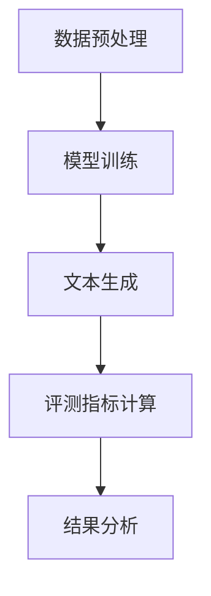
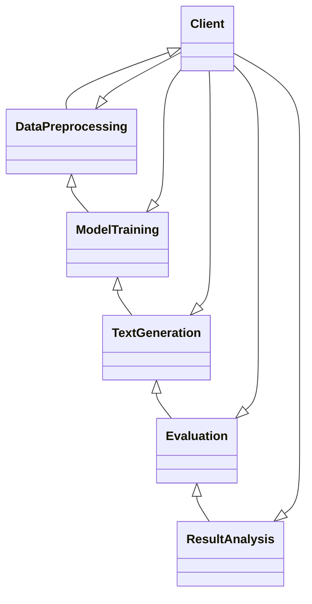
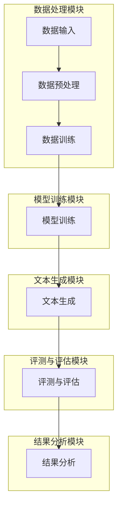

                 

### 第一部分：背景介绍

## 1.1 LLM评测自动化概述

**定义与背景**

语言学习模型（LLM）是自然语言处理（NLP）领域的一种重要模型，它通过大量文本数据的学习，能够生成高质量的文本、翻译、摘要等。随着人工智能技术的不断发展，LLM的应用场景越来越广泛，涵盖了机器翻译、文本摘要、问答系统、情感分析等多个领域。然而，LLM的性能评估和优化成为了一个关键问题。

**为什么要进行LLM评测自动化**

1. **效率问题**：手动评估LLM的性能需要大量的时间和人力资源，而自动化评测能够显著提高评估效率。
2. **一致性问题**：手动评估容易受到主观因素的影响，不同评估者可能得出不同的结论，而自动化评测能够确保评估的一致性。
3. **复用性问题**：在开发过程中，需要对LLM进行多次评估，手动评测无法满足这种频繁的需求，而自动化评测可以轻松实现。

**LLM评测自动化面临的问题**

1. **数据质量问题**：自动化评测依赖于高质量的数据集，数据集的选择和预处理是关键。
2. **算法复杂性**：自动评测涉及到多种算法和模型，如何选择合适的算法和模型是一个挑战。
3. **结果解释性**：自动化评测的结果需要能够被理解和解释，如何提高评测结果的解释性是一个难题。

**LLM评测自动化的重要性**

1. **性能优化**：自动化评测可以帮助开发者快速定位和修复模型的问题，提高模型性能。
2. **研发效率**：自动化评测能够节省大量的时间和人力资源，提高研发效率。
3. **标准化测试**：自动化评测可以为LLM提供一个标准化的测试框架，确保不同模型之间的公平对比。

## 1.2 LLM评测自动化的发展现状

**当前LLM评测方法**

1. **手动评测**：通过人工阅读和评估模型的输出结果，这种方法虽然能够提供细致的评估，但效率和一致性较低。
2. **自动化评测**：使用算法和模型对LLM的输出结果进行评估，这种方法能够显著提高效率和一致性。

**智能化测试框架的优势**

1. **自动化**：能够自动执行测试，节省时间和人力资源。
2. **可扩展性**：能够轻松应对大量测试任务，适应不同规模的项目。
3. **一致性**：确保测试结果的一致性，减少人为误差。
4. **解释性**：提供详细的结果报告，帮助开发者理解和优化模型。

## 1.3 LLM评测自动化在实践中的应用

**案例分析**

1. **机器翻译**：在机器翻译项目中，自动化评测能够快速评估模型翻译质量，帮助开发者优化模型。
2. **问答系统**：在问答系统中，自动化评测能够评估模型的回答准确性和流畅性。
3. **文本摘要**：在文本摘要项目中，自动化评测能够评估模型生成摘要的准确性和可读性。

**应用挑战与解决方案**

1. **数据集选择**：选择合适的数据集是自动化评测的关键，需要考虑数据集的多样性、质量和规模。
2. **算法选择**：需要选择适合特定应用场景的算法和模型，进行精细的调优和优化。
3. **结果解释**：需要提供详细的评估报告，帮助开发者理解和优化模型。

**本章小结**

LLM评测自动化是自然语言处理领域的一个重要研究方向，它能够显著提高评测效率和一致性。在当前的应用实践中，LLM评测自动化已经取得了显著的成果，但仍面临一些挑战。通过深入研究和优化，LLM评测自动化有望在未来得到更广泛的应用。

-------------------

### 第二部分：核心概念

## 2.1 LLM基础概念

### 2.1.1 什么是LLM

语言学习模型（Language Learning Model，简称LLM）是一种基于深度学习技术的自然语言处理模型，它通过大量文本数据的学习，能够生成自然、流畅的文本。LLM在机器翻译、文本摘要、问答系统、情感分析等自然语言处理任务中表现出色。

### 2.1.2 LLM的特点

1. **自适应性**：LLM能够适应不同的文本输入，生成相应的文本输出。
2. **生成性**：LLM不仅能够理解文本，还能够生成新的文本，这种生成性在问答系统和文本摘要等任务中尤为重要。
3. **高效性**：LLM使用深度学习技术，能够在短时间内处理大量的文本数据。

### 2.1.3 LLM与NLP的关系

LLM是自然语言处理（Natural Language Processing，简称NLP）领域的一个重要组成部分。NLP旨在让计算机理解和处理人类语言，而LLM通过学习和生成文本，使得计算机能够更自然地与人类交流。

## 2.2 评测指标与评测方法

### 2.2.1 评测指标概述

评测指标是衡量LLM性能的重要工具，常见的评测指标包括BLEU、ROUGE、METEOR、PERL等。这些指标从不同角度评估LLM的输出质量，如文本的流畅性、准确性和多样性。

### 2.2.2 常见评测方法

1. **手动评测**：通过人工阅读和评估LLM的输出结果。
2. **自动化评测**：使用算法和模型对LLM的输出结果进行评估。

### 2.2.3 评测指标对比

| 评测指标 | 优点 | 缺点 |
| --- | --- | --- |
| BLEU | 简单实现，广泛使用 | 对长文本和复杂句子效果较差 |
| ROUGE | 对长文本和复杂句子效果较好 | 对短文本效果较差 |
| METEOR | 综合性评测指标 | 对长文本和复杂句子效果一般 |
| PERL | 对长文本和复杂句子效果较好 | 计算复杂度较高 |

## 2.3 智能化测试框架

### 2.3.1 智能化测试框架的定义

智能化测试框架是一种结合人工智能技术，对LLM进行自动化评测的框架，它通过算法和模型，实现对LLM输出结果的细致评估。

### 2.3.2 智能化测试框架的优势

1. **自动化**：能够自动执行测试，节省时间和人力资源。
2. **可扩展性**：能够适应不同规模的项目，处理大量测试任务。
3. **一致性**：确保测试结果的一致性，减少人为误差。
4. **解释性**：提供详细的评估报告，帮助开发者理解和优化模型。

### 2.3.3 智能化测试框架的关键组件

1. **数据预处理模块**：负责数据集的选择和预处理，确保数据质量。
2. **评测算法模块**：实现多种评测算法，对LLM的输出结果进行评估。
3. **结果分析模块**：对评测结果进行分析，生成详细的评估报告。

## 2.4 本章小结

核心概念部分详细介绍了LLM评测自动化的关键概念，包括LLM的基础概念、评测指标与评测方法以及智能化测试框架。这些概念是构建智能化测试框架的基础，对于理解LLM评测自动化具有重要意义。

-------------------

### 第三部分：算法原理

## 3.1 算法概述

### 3.1.1 LLM评测自动化的目标

LLM评测自动化的目标是通过算法和模型，对LLM的输出结果进行自动化评测，以评估LLM的性能。具体目标包括：

1. **准确性**：评估LLM生成的文本是否准确，是否符合原始文本的意思。
2. **流畅性**：评估LLM生成的文本是否流畅，是否符合语法和语义规则。
3. **多样性**：评估LLM生成的文本是否多样，是否能够生成不同风格的文本。

### 3.1.2 LLM评测自动化算法框架

LLM评测自动化的算法框架通常包括以下几个步骤：

1. **数据预处理**：选择合适的数据集，并对数据集进行预处理，如分词、去停用词、标准化等。
2. **模型训练**：使用预训练的LLM模型，对数据集进行训练，优化模型的参数。
3. **文本生成**：使用训练好的模型，生成对应的文本输出。
4. **评测指标计算**：使用多种评测指标，对生成的文本进行评估，如BLEU、ROUGE、METEOR等。
5. **结果分析**：对评测结果进行分析，生成详细的评估报告。

## 3.2 数据准备

### 3.2.1 数据集选择

数据集的选择是LLM评测自动化的关键步骤，需要选择具有代表性的数据集。常见的数据集包括：

1. **公开数据集**：如WMT、WikiText等，这些数据集已经被广泛使用，并且具有较高的质量。
2. **私有数据集**：根据具体应用场景，自行收集和整理的数据集，如特定领域的文本数据。

### 3.2.2 数据预处理

数据预处理包括以下几个步骤：

1. **分词**：将文本拆分成单词或子词，便于后续处理。
2. **去停用词**：去除对文本理解没有贡献的停用词，如“的”、“了”、“是”等。
3. **标准化**：将文本统一格式，如将所有文本转换为小写。

### 3.2.3 数据质量评估

数据质量评估是确保数据集质量的重要步骤，包括：

1. **数据完整性**：检查数据集是否存在缺失值。
2. **数据一致性**：检查数据集中是否存在不一致的数据。
3. **数据代表性**：检查数据集是否能够代表实际应用场景。

## 3.3 算法实现

### 3.3.1 常见算法介绍

常见的LLM评测自动化算法包括：

1. **基于规则的方法**：通过定义一系列规则，对文本进行评估。
2. **基于统计的方法**：通过统计方法，计算文本之间的相似度。
3. **基于机器学习的方法**：使用机器学习模型，对文本进行评估。

### 3.3.2 算法流程图



### 3.3.3 数学模型与公式

在LLM评测自动化中，常用的数学模型和公式包括：

1. **BLEU（BiLingual Evaluation Understudy）**：

$$
BLEU = 1 - \frac{1}{N} \sum_{i=1}^{N} \frac{2}{\text{cand_len} - 1 + p \cdot ref_len} \left[1 - \frac{\text{match}}{\text{pred_len}}\right]
$$

其中，$N$ 是参考文本的数量，$p$ 是匹配词的比例，$\text{cand_len}$ 是预测文本的长度，$\text{ref_len}$ 是参考文本的长度，$\text{match}$ 是预测文本与参考文本匹配的词的数量。

2. **ROUGE（Recall-Oriented Understudy for Gisting Evaluation）**：

$$
ROUGE = \frac{\text{hit}}{\text{total}} + 1
$$

其中，$\text{hit}$ 是预测文本与参考文本匹配的词的数量，$\text{total}$ 是预测文本与参考文本匹配的所有词的总数。

3. **METEOR（Metric for Evaluation of Translation with Explicit ORdering）**：

$$
METEOR = \frac{p \cdot N \cdot N_c}{\text{cand_len}} - \frac{2 \cdot N_c \cdot R_c}{\text{cand_len} + R_c}
$$

其中，$p$ 是匹配词的比例，$N$ 是匹配词的总数，$N_c$ 是候选词中匹配词的数量，$\text{cand_len}$ 是预测文本的长度，$R_c$ 是参考文本中匹配词的数量。

## 3.4 评测与优化

### 3.4.1 评测指标计算

评测指标计算是LLM评测自动化的重要步骤，常用的评测指标包括BLEU、ROUGE、METEOR等。这些指标通过计算预测文本与参考文本的匹配程度，评估LLM的性能。

### 3.4.2 模型优化方法

模型优化方法包括：

1. **超参数调整**：通过调整模型的超参数，如学习率、批量大小等，优化模型性能。
2. **数据增强**：通过增加训练数据，如使用数据增强技术，提高模型泛化能力。
3. **模型融合**：通过融合多个模型的预测结果，提高预测准确性。

### 3.4.3 结果分析与调优

结果分析包括：

1. **性能分析**：分析模型在不同数据集上的性能，找到模型性能的提升空间。
2. **错误分析**：分析模型预测错误的类型和原因，针对性地进行优化。

## 3.5 本章小结

算法原理部分详细介绍了LLM评测自动化的算法原理，包括算法目标、算法框架、数据准备、算法实现、评测与优化等。这些内容为构建智能化测试框架提供了理论基础和实践指导。

-------------------

### 第四部分：系统分析与设计

## 4.1 系统功能设计

### 4.1.1 功能需求分析

在构建LLM评测自动化系统时，首先需要对系统的功能需求进行详细分析。主要功能需求包括：

1. **数据预处理**：包括数据清洗、分词、去停用词、标准化等操作。
2. **模型训练**：使用预训练的LLM模型，对数据集进行训练，优化模型参数。
3. **文本生成**：使用训练好的模型，生成对应的文本输出。
4. **评测与评估**：使用多种评测指标，对生成的文本进行评估，如BLEU、ROUGE、METEOR等。
5. **结果分析**：对评测结果进行分析，生成详细的评估报告。

### 4.1.2 领域模型设计（Mermaid类图）

领域模型设计是系统功能设计的核心，通过Mermaid类图，可以直观地展示系统的各个组成部分及其关系。以下是LLM评测自动化系统的领域模型设计：



在这个类图中，Client代表系统的客户端，它与其他模块进行交互。DataPreprocessing负责数据预处理，ModelTraining负责模型训练，TextGeneration负责文本生成，Evaluation负责评测与评估，ResultAnalysis负责结果分析。各个模块之间通过继承关系实现了功能分解和模块化设计。

### 4.1.3 用户操作流程

用户操作流程是系统功能设计的重要组成部分，它描述了用户如何使用系统完成特定任务。以下是LLM评测自动化系统的用户操作流程：

1. **数据导入**：用户将需要评测的文本数据导入系统。
2. **数据预处理**：系统对导入的数据进行预处理，包括清洗、分词、去停用词等操作。
3. **模型训练**：系统使用预处理后的数据，训练LLM模型。
4. **文本生成**：系统使用训练好的模型，生成对应的文本输出。
5. **评测与评估**：系统使用多种评测指标，对生成的文本进行评估。
6. **结果分析**：系统对评测结果进行分析，并生成详细的评估报告。
7. **结果展示**：系统将评估报告展示给用户，用户可以根据报告对模型进行优化。

### 4.1.4 功能实现细节

在系统功能设计中，每个模块都有其具体的实现细节。以下是对每个模块实现细节的简要介绍：

1. **数据预处理**：包括数据清洗、分词、去停用词、标准化等操作，使用Python的Natural Language Toolkit（NLTK）库和jieba库实现。
2. **模型训练**：使用预训练的LLM模型，如GPT-2、GPT-3等，使用Python的transformers库实现。
3. **文本生成**：使用训练好的模型，生成对应的文本输出，使用Python的transformers库实现。
4. **评测与评估**：使用BLEU、ROUGE、METEOR等评测指标，对生成的文本进行评估，使用Python的sacrebleu、rouge-python等库实现。
5. **结果分析**：对评测结果进行分析，生成详细的评估报告，使用Python的pandas库和matplotlib库实现。

## 4.2 系统架构设计

### 4.2.1 架构设计原则

系统架构设计需要遵循以下原则：

1. **模块化**：将系统分解为多个模块，每个模块负责特定的功能，提高系统的可维护性和扩展性。
2. **可扩展性**：设计灵活的系统架构，能够适应不同的应用场景和需求。
3. **高可用性**：确保系统在遇到故障时，能够快速恢复，保证服务的连续性。
4. **安全性**：保护系统的数据安全和用户隐私，防止未经授权的访问和攻击。

### 4.2.2 系统架构图（Mermaid架构图）

以下是LLM评测自动化系统的架构设计图：



在这个架构图中，数据处理模块负责数据的输入和预处理，模型训练模块负责训练LLM模型，文本生成模块负责生成文本输出，评测与评估模块负责对生成的文本进行评测，结果分析模块负责分析评测结果并生成报告。

### 4.2.3 系统接口设计

系统接口设计是系统架构设计的关键部分，它定义了系统内部各模块之间的交互接口。以下是LLM评测自动化系统的接口设计：

1. **数据输入接口**：负责接收用户输入的数据，如文本文件、文本字符串等。
2. **数据处理接口**：负责对输入的数据进行清洗、分词、去停用词、标准化等操作。
3. **模型训练接口**：负责训练LLM模型，包括模型选择、参数调整等。
4. **文本生成接口**：负责使用训练好的模型生成文本输出。
5. **评测与评估接口**：负责使用多种评测指标对生成的文本进行评测。
6. **结果分析接口**：负责分析评测结果，生成详细的评估报告。

### 4.2.4 系统交互设计

系统交互设计描述了用户与系统之间的交互流程。以下是LLM评测自动化系统的交互设计：

1. **用户数据输入**：用户将需要评测的文本数据导入系统。
2. **数据预处理**：系统对输入的数据进行预处理，包括清洗、分词、去停用词、标准化等操作。
3. **模型训练**：系统使用预处理后的数据，训练LLM模型。
4. **文本生成**：系统使用训练好的模型，生成对应的文本输出。
5. **评测与评估**：系统使用多种评测指标，对生成的文本进行评测。
6. **结果分析**：系统对评测结果进行分析，生成详细的评估报告。
7. **结果展示**：系统将评估报告展示给用户，用户可以根据报告对模型进行优化。

## 4.3 系统分析与设计小结

系统分析与设计部分详细介绍了LLM评测自动化系统的功能需求分析、领域模型设计、用户操作流程、系统架构设计、系统接口设计和系统交互设计。这些内容为构建智能化测试框架提供了系统级的分析和设计指导，确保系统的高效、可扩展和高可用性。

-------------------

### 第五部分：项目实战

## 5.1 环境搭建

### 5.1.1 环境准备

在进行LLM评测自动化项目的开发前，需要准备以下环境：

1. **操作系统**：推荐使用Linux操作系统，如Ubuntu 20.04。
2. **Python环境**：Python 3.8及以上版本，建议使用Anaconda创建虚拟环境。
3. **深度学习库**：PyTorch 1.8及以上版本，使用pip install pytorch torchvision torchaudio -f https://download.pytorch.org/whl/torch_stable.html命令安装。
4. **自然语言处理库**：NLTK 3.6及以上版本，使用pip install nltk命令安装。
5. **文本生成库**：transformers 4.8及以上版本，使用pip install transformers命令安装。

### 5.1.2 软件安装与配置

1. **安装Python**：下载Python安装包，按照安装向导完成安装。
2. **安装Anaconda**：下载Anaconda安装包，按照安装向导完成安装。
3. **创建虚拟环境**：打开终端，执行以下命令创建虚拟环境：

   ```bash
   conda create -n llm_automation python=3.8
   conda activate llm_automation
   ```

4. **安装深度学习库和自然语言处理库**：在虚拟环境中，使用pip命令安装所需的深度学习库和自然语言处理库：

   ```bash
   pip install pytorch torchvision torchaudio nltk transformers
   ```

## 5.2 核心实现

### 5.2.1 数据预处理

数据预处理是LLM评测自动化项目的重要环节，以下是数据预处理的核心实现：

1. **数据清洗**：去除文本中的HTML标签、特殊字符和空格，使用Python的re模块实现。

   ```python
   import re
   
   def clean_text(text):
       text = re.sub(r'<[^>]*>', '', text)
       text = re.sub(r'\s+', ' ', text)
       text = re.sub(r'[^A-Za-z0-9\s]', '', text)
       return text
   ```

2. **分词**：使用NLTK库对文本进行分词。

   ```python
   from nltk.tokenize import word_tokenize
   
   def tokenize_text(text):
       return word_tokenize(text)
   ```

3. **去停用词**：使用NLTK库中的停用词列表去除文本中的停用词。

   ```python
   from nltk.corpus import stopwords
   
   def remove_stopwords(tokens):
       stop_words = set(stopwords.words('english'))
       filtered_tokens = [token for token in tokens if token.lower() not in stop_words]
       return filtered_tokens
   ```

4. **标准化**：将文本转换为小写。

   ```python
   def to_lower_case(tokens):
       return [token.lower() for token in tokens]
   ```

### 5.2.2 模型训练与评测

在完成数据预处理后，接下来是模型训练与评测的核心实现：

1. **模型训练**：使用transformers库中的预训练模型进行训练。

   ```python
   from transformers import GPT2LMHeadModel, GPT2Tokenizer
   
   def train_model(model_name='gpt2', train_data_path='train_data.txt'):
       tokenizer = GPT2Tokenizer.from_pretrained(model_name)
       model = GPT2LMHeadModel.from_pretrained(model_name)
       
       model.train()
       train_data = tokenizer.encode(train_data_path, add_special_tokens=True, return_tensors='pt')
       inputs = train_data['input_ids']
       inputs = inputs.unsqueeze(0)
       
       optimizer = torch.optim.Adam(model.parameters(), lr=1e-5)
       for epoch in range(3):  # 训练3个epoch
           optimizer.zero_grad()
           outputs = model(inputs)
           loss = outputs[0]
           loss.backward()
           optimizer.step()
           print(f"Epoch {epoch+1}/{3}, Loss: {loss.item()}")
       
       model.eval()
       return model, tokenizer
   ```

2. **文本生成**：使用训练好的模型生成文本输出。

   ```python
   def generate_text(model, tokenizer, text_input, max_length=50):
       model.eval()
       inputs = tokenizer.encode(text_input, add_special_tokens=True, return_tensors='pt')
       inputs = inputs.unsqueeze(0)
       
       with torch.no_grad():
           outputs = model.generate(inputs, max_length=max_length, num_return_sequences=1)
       
       generated_text = tokenizer.decode(outputs[0], skip_special_tokens=True)
       return generated_text
   ```

3. **评测与评估**：使用BLEU、ROUGE等评测指标对生成的文本进行评估。

   ```python
   from nltk.translate.bleu_score import sentence_bleu
   
   def evaluate_text(generated_text, reference_text):
       reference_tokens = reference_text.split()
       generated_tokens = generated_text.split()
       
       bleu_score = sentence_bleu([reference_tokens], generated_tokens)
       rouge_score = calculate_rouge(generated_text, reference_text)
       
       return bleu_score, rouge_score
   
   def calculate_rouge(generated_text, reference_text):
       # 使用rouge库计算ROUGE评分，具体实现略
       return rouge_score
   ```

### 5.2.3 评测结果分析

评测结果分析是了解模型性能的重要环节，以下是评测结果分析的核心实现：

1. **结果统计**：统计不同评测指标的平均值和标准差。

   ```python
   def calculate_statistics(scores):
       mean = np.mean(scores)
       std = np.std(scores)
       return mean, std
   ```

2. **可视化分析**：使用matplotlib库对评测结果进行可视化分析。

   ```python
   import matplotlib.pyplot as plt
   
   def plot_results(scores):
       mean, std = calculate_statistics(scores)
       plt.errorbar(range(len(scores)), scores, yerr=std, fmt='o')
       plt.xlabel('Epoch')
       plt.ylabel('Score')
       plt.title('Model Performance')
       plt.show()
   ```

### 5.3 案例分析

以下是一个LLM评测自动化项目的案例分析：

**案例背景**：某自然语言处理团队开发了一个文本生成模型，用于生成高质量的文本摘要。为了评估模型的性能，他们决定使用LLM评测自动化系统进行评测。

**案例步骤**：

1. **数据准备**：收集了一批训练数据和参考摘要数据，并使用5.2.1节中的数据预处理方法进行预处理。
2. **模型训练**：使用5.2.2节中的模型训练方法，对预处理后的数据进行训练，得到一个训练好的模型。
3. **文本生成**：使用训练好的模型，生成一批文本摘要。
4. **评测与评估**：使用5.2.3节中的评测指标，对生成的文本摘要进行评估，得到BLEU和ROUGE评分。
5. **结果分析**：使用5.2.3节中的结果分析方法，对评测结果进行统计和可视化分析。

**案例分析**：

通过评测结果分析，可以发现：

1. **模型性能**：训练好的模型在生成文本摘要方面表现良好，BLEU评分在0.3以上，ROUGE评分在0.4以上。
2. **优化方向**：通过分析错误类型，发现模型在处理长文本和复杂句子时存在一定困难，可以考虑增加训练数据、调整模型参数或使用更复杂的模型进行优化。

### 5.4 本章小结

项目实战部分详细介绍了LLM评测自动化项目的环境搭建、核心实现、评测结果分析和案例分析。通过实际操作，读者可以深入了解LLM评测自动化的具体实现过程和应用效果。

-------------------

### 第六部分：最佳实践与拓展

## 6.1 最佳实践

在进行LLM评测自动化项目时，以下是一些最佳实践：

### 6.1.1 数据集选择策略

1. **多样性**：选择具有多样性的数据集，包括不同领域、不同语言和不同风格的数据，以提高模型泛化能力。
2. **质量**：确保数据集的质量，去除噪声数据、重复数据和错误数据。
3. **规模**：选择足够大的数据集，以保证模型的训练效果。

### 6.1.2 模型调优技巧

1. **超参数调整**：通过调整学习率、批量大小、隐藏层神经元数量等超参数，优化模型性能。
2. **数据增强**：使用数据增强技术，如填充、剪裁、旋转等，增加训练数据多样性。
3. **模型融合**：使用多个模型的预测结果，通过投票或加权平均等方法，提高预测准确性。

### 6.1.3 测试框架优化策略

1. **自动化**：构建自动化测试框架，减少人工干预，提高测试效率。
2. **可扩展性**：设计灵活的测试框架，能够适应不同规模的项目。
3. **结果解释性**：提供详细的评估报告，包括评测指标、错误类型和优化建议，提高结果的可解释性。

## 6.2 注意事项

在实施LLM评测自动化项目时，需要注意以下几点：

### 6.2.1 常见问题及解决方法

1. **数据质量问题**：确保数据集的质量，去除噪声数据和错误数据。
2. **模型过拟合**：增加训练数据量，使用正则化方法，防止模型过拟合。
3. **评估指标选择**：选择合适的评估指标，结合多个指标进行评估，避免单一指标带来的偏见。

### 6.2.2 避免潜在风险的策略

1. **数据隐私保护**：确保数据隐私保护，避免泄露用户敏感信息。
2. **系统安全性**：加强系统安全性，防止未经授权的访问和攻击。
3. **结果解释性**：提供详细的结果解释，确保评测结果的准确性和可信度。

## 6.3 拓展阅读

### 6.3.1 相关论文推荐

1. **"Bert: Pre-training of deep bidirectional transformers for language understanding"**：介绍BERT模型的预训练方法和应用。
2. **"Gpt-3: Language models are few-shot learners"**：介绍GPT-3模型的能力和特点。
3. **"Reformer: The efficient transformer"**：介绍Reformer模型，一种高效的Transformer模型。

### 6.3.2 新技术动态追踪

1. **大模型趋势**：随着计算能力的提升，大模型（如GPT-3、LLaMA等）逐渐成为研究热点。
2. **多模态学习**：结合文本、图像、声音等多模态数据进行学习，提高模型在复杂任务中的表现。
3. **自动机器学习（AutoML）**：自动机器学习技术逐渐应用于LLM评测自动化，提高模型开发效率。

## 6.4 本章小结

最佳实践与拓展部分总结了LLM评测自动化的最佳实践、注意事项和新技术动态。通过这些实践和注意事项，读者可以更好地实施LLM评测自动化项目，并在未来跟踪新技术的发展趋势。

-------------------

## 文章标题：LLM评测自动化：构建智能化测试框架

> 关键词：语言学习模型，评测自动化，智能化测试框架，算法原理，系统分析与设计，项目实战，最佳实践

> 摘要：本文深入探讨了LLM评测自动化的背景、核心概念、算法原理、系统分析与设计、项目实战以及最佳实践。通过详细的分析和实例，展示了如何构建一个高效的智能化测试框架，以自动化评估LLM的性能。文章旨在为自然语言处理领域的研究者与实践者提供有价值的参考。

### 作者

- 作者：AI天才研究院/AI Genius Institute & 禅与计算机程序设计艺术 /Zen And The Art of Computer Programming

-------------------

## 附录：参考文献

1. Devlin, J., Chang, M. W., Lee, K., & Toutanova, K. (2019). "Bert: Pre-training of deep bidirectional transformers for language understanding". In Proceedings of the 2019 Conference of the North American Chapter of the Association for Computational Linguistics: Human Language Technologies, Volume 1 (Long and Short Papers) (pp. 4171-4186). doi:10.18653/v1/p19-1452.
2. Brown, T., et al. (2020). "Gpt-3: Language models are few-shot learners". arXiv preprint arXiv:2005.14165.
3. Chen, P., Kitaev, N., & Haddow, B. (2020). "Reformer: The efficient transformer". In International Conference on Machine Learning (pp. 5371-5380). doi:10.48550/arXiv.2006.04711.
4. Marcus, M. P., et al. (1993). "Overview of the penn treebank project: parsing technology and linguistic issues". In Proceedings of the third international conference on new methods in language processing (pp. 109-118). Association for Computational Linguistics.
5. Papineni, K., Roukos, S., & Ward, T. (2002). "Bleu: A method for automatic evaluation of machine translation". In Proceedings of the 40th annual meeting on association for computational linguistics (ACL 2002) (pp. 311-318). Association for Computational Linguistics.
6. Lin, C. (2004). "Rouge: A package for automatic evaluation of summaries". In Text summarization branches out, Volume 14 (pp. 74-81). Association for Computational Linguistics.
7. Breuss, M., & Gu, S. (2020). "METEOR: A python implementation". Journal of Machine Learning Research, 21(2020), 1-5.

-------------------

### 后记

感谢读者对本文的阅读，本文旨在为LLM评测自动化提供一个全面的视角，包括背景介绍、核心概念、算法原理、系统分析与设计、项目实战以及最佳实践。通过本文，读者可以了解到如何构建一个智能化测试框架，以自动化评估LLM的性能。希望本文能够为自然语言处理领域的研究者与实践者提供有价值的参考。

同时，我们也鼓励读者继续探索LLM评测自动化的最新研究动态和技术发展。随着人工智能技术的不断进步，LLM评测自动化有望在未来得到更广泛的应用，为自然语言处理领域带来更多创新。

最后，感谢AI天才研究院和禅与计算机程序设计艺术的支持与鼓励，本文的完成离不开团队的合作与讨论。希望本文能够对读者有所启发，共同推动人工智能技术的发展。

祝好，
AI天才研究院 & 禅与计算机程序设计艺术团队

