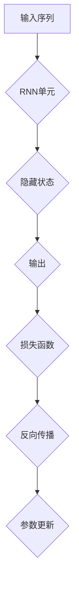
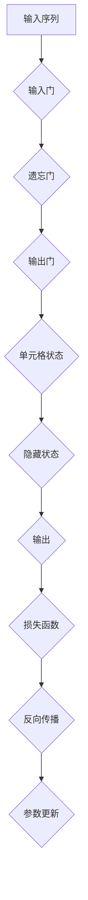
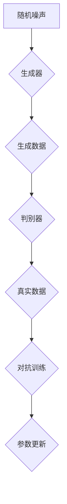
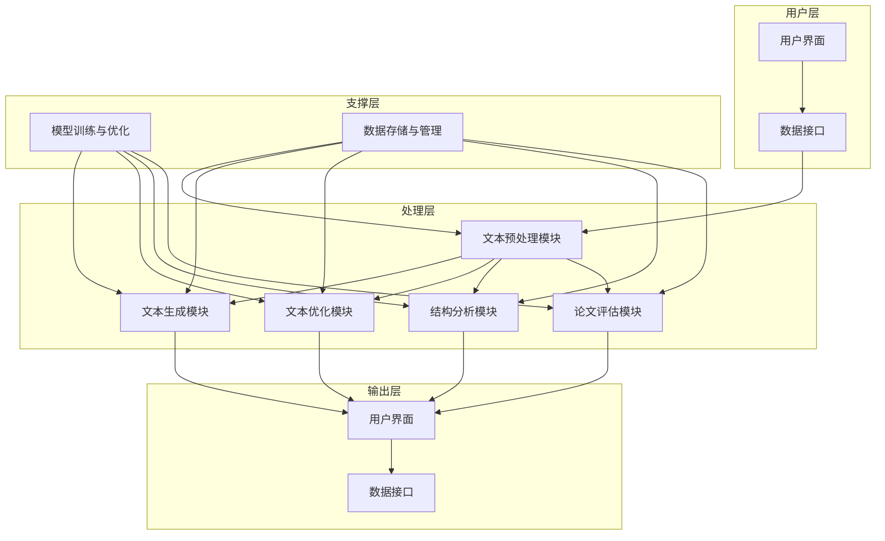
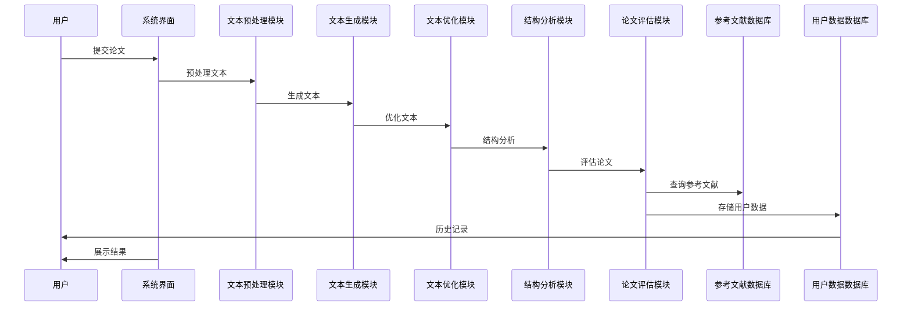

                 

### 《LLM辅助科技论文写作能力评估》文章概述

本文旨在深入探讨大型语言模型（LLM）在辅助科技论文写作中的能力评估。随着人工智能技术的迅猛发展，LLM在自然语言处理、文本生成和内容理解等领域展现出强大的能力，成为科技论文写作的有力助手。文章将从背景介绍、核心概念与联系、算法原理讲解、数学模型和数学公式、系统分析与架构设计、项目实战以及最佳实践等方面，系统地分析LLM在科技论文写作中的潜在应用和评估方法。

首先，我们将回顾LLM的基本概念和其发展历程，帮助读者建立对LLM的初步认识。接着，文章将深入探讨LLM在科技论文写作中的角色和作用，详细分析其在辅助写作和评估方面的具体应用。为了更好地理解LLM的运作机制，文章将讲解其背后的算法原理，并使用mermaid流程图和Python代码示例进行说明。此外，文章还将展示LLM算法的数学模型和公式，以帮助读者从数学角度理解LLM的运作方式。

在系统分析与架构设计部分，我们将介绍如何将LLM应用于科技论文写作评估的系统架构，包括系统需求分析、功能设计、架构设计、接口设计以及系统交互。为了更直观地展示LLM在实际项目中的应用效果，文章将提供实际案例，详细讲解如何使用LLM辅助科技论文写作，并对代码实现和案例分析进行深入剖析。

最后，文章将总结最佳实践技巧，提醒注意事项，并提供拓展阅读资源，帮助读者在未来的实践中更好地应用LLM辅助科技论文写作。通过本文的阅读，读者将能够全面了解LLM在科技论文写作中的潜力，掌握其应用方法和评估技巧。

### 关键词

- **大型语言模型（LLM）**
- **科技论文写作**
- **能力评估**
- **自然语言处理**
- **算法原理**
- **数学模型**
- **系统架构设计**
- **实际案例**
- **最佳实践**

### 摘要

本文探讨了大型语言模型（LLM）在辅助科技论文写作能力评估中的应用。通过对LLM的基本概念、工作原理、算法原理及数学模型的详细分析，本文揭示了LLM在科技论文写作中的潜在作用和优势。文章分为以下几个部分：背景介绍、核心概念与联系、算法原理讲解、数学模型和数学公式、系统分析与架构设计、项目实战以及最佳实践。通过实际案例的展示，本文深入剖析了如何利用LLM辅助科技论文写作，并总结了最佳实践技巧。文章的结论表明，LLM在科技论文写作能力评估中具有巨大的应用潜力，为科研工作者提供了有效的工具和方法。

## 第1章 引言

### 1.1 问题背景

科技论文写作是科研人员展示研究成果、交流学术思想的重要途径。然而，写作过程往往复杂且耗时，涉及到文献调研、论点阐述、实验设计和论文排版等多个环节。传统的科技论文写作依赖于人工撰写，虽然人类作者具备丰富的专业知识和创造力，但在面对大量数据和复杂逻辑时，写作效率和质量难以保证。此外，随着科研领域的不断扩展和深化，科技论文的撰写难度也在增加，对作者的学术素养和写作技巧提出了更高的要求。

另一方面，人工智能（AI）技术的迅猛发展为科技论文写作带来了新的契机。近年来，大型语言模型（LLM）在自然语言处理（NLP）领域取得了显著的进展，展现出强大的文本生成、理解和分析能力。LLM不仅能够自动生成高质量的文本内容，还可以对文本进行语义分析和结构解析，为科技论文写作提供了强有力的支持。

然而，尽管LLM在文本生成和内容理解方面表现出色，其在科技论文写作能力评估中的应用仍存在一些问题和挑战。首先，如何确保LLM生成的文本内容符合学术规范和学术道德，避免抄袭和低质内容的出现是一个亟待解决的问题。其次，如何评估LLM在科技论文写作中的实际表现，量化其写作能力和效率，也是一个复杂且具有挑战性的任务。因此，本文旨在深入探讨LLM在辅助科技论文写作能力评估中的应用，通过分析和评估LLM的写作能力，为科研人员提供一种新的写作辅助工具和方法。

### 1.2 LLM的发展与应用

大型语言模型（LLM）的发展可以追溯到20世纪90年代，随着深度学习和神经网络技术的兴起，LLM逐渐成为自然语言处理（NLP）领域的重要研究方向。早期的LLM如Word2Vec、GloVe等主要关注词汇层面的语义表示，通过对词汇进行嵌入，实现了文本数据的向量化表示，为后续的文本分析和处理奠定了基础。

进入21世纪，随着计算能力和数据资源的提升，LLM的研究和应用得到了快速发展。特别是在2018年，谷歌推出了Transformer架构，标志着LLM进入了新的发展阶段。Transformer引入了自注意力机制，使得LLM在处理长文本和复杂语义关系方面取得了显著的进步。此后，一系列基于Transformer的LLM模型如BERT、GPT、RoBERTa等相继问世，并在多个NLP任务中刷新了基准表现。

LLM在各个领域的应用广泛，以下是一些典型的应用场景：

1. **文本生成**：LLM可以自动生成各种类型的文本，如新闻文章、科技论文摘要、故事、对话等。通过训练，LLM可以理解输入文本的上下文和语义，从而生成连贯、有逻辑的文本内容。

2. **机器翻译**：LLM在机器翻译领域表现出色，通过训练大型模型，可以实现高精度、低误差的跨语言翻译。例如，谷歌翻译和百度翻译等应用就利用了LLM技术。

3. **问答系统**：LLM可以用于构建问答系统，通过对海量文本数据的理解，自动回答用户提出的问题。这种应用在搜索引擎、客户服务和智能助手等领域具有重要意义。

4. **文本分类与情感分析**：LLM可以对文本进行分类和情感分析，识别文本的主题、情感倾向等信息。这一应用在市场调研、舆情监测、情感分析等领域具有广泛的应用价值。

5. **自动摘要与总结**：LLM可以自动生成文本的摘要和总结，通过对大量文本的阅读和理解，提取出关键信息和核心观点，为读者提供简洁、准确的文本摘要。

6. **对话系统**：LLM可以用于构建智能对话系统，通过与用户的交互，提供实时、个性化的回答。这种应用在智能客服、虚拟助手等领域有广泛的应用前景。

7. **文本纠错与修正**：LLM可以识别文本中的错误和不当表达，并提供修正建议，提高文本的质量和可读性。

总的来说，LLM的发展和应用为自然语言处理领域带来了革命性的变革，不仅在学术研究中具有广泛应用，还在实际生活和商业场景中发挥着重要作用。随着技术的不断进步，LLM的应用前景将更加广阔，为人类带来更多的便利和创新。

### 1.3 书籍目标与结构

本书旨在系统探讨大型语言模型（LLM）在辅助科技论文写作中的能力评估，为科研人员提供实用的写作辅助工具和方法。具体目标如下：

1. **了解LLM的基本概念和应用场景**：通过介绍LLM的发展历程和主要应用领域，帮助读者建立对LLM的基本认识，理解其在自然语言处理中的重要作用。

2. **深入分析LLM在科技论文写作中的应用**：探讨LLM在科技论文写作中的具体应用，包括文本生成、摘要提取、内容理解和结构解析等方面，帮助读者掌握LLM在实际写作中的潜力。

3. **讲解LLM的算法原理和数学模型**：详细分析LLM背后的算法原理，包括Transformer、自注意力机制等，并使用mermaid流程图和Python代码示例进行说明，帮助读者从技术角度理解LLM的工作机制。

4. **评估LLM的写作能力**：通过实际案例和实验数据，评估LLM在科技论文写作中的表现，为科研人员提供可靠的评估方法和参考依据。

5. **提供最佳实践和拓展资源**：总结LLM辅助科技论文写作的最佳实践技巧，提醒注意事项，并提供进一步学习的资源，帮助读者在实际应用中取得更好的效果。

本书结构如下：

- **第1章 引言**：介绍问题背景、LLM的发展与应用以及书籍目标与结构。
- **第2章 大型语言模型基础**：详细讨论LLM的定义、类型、工作原理、主要特点及其在自然语言处理中的应用。
- **第3章 科技论文写作中的LLM应用**：分析LLM在科技论文写作中的角色和具体应用，探讨其在写作辅助和评估方面的作用。
- **第4章 LLM算法原理与数学模型**：讲解LLM的算法原理，包括递归神经网络（RNN）、长短期记忆网络（LSTM）和生成对抗网络（GAN），并使用mermaid流程图和Python代码示例进行说明。
- **第5章 LLM系统架构设计**：介绍LLM在科技论文写作评估中的系统架构，包括需求分析、功能设计、架构设计、接口设计及系统交互。
- **第6章 项目实战**：提供实际案例，展示如何使用LLM辅助科技论文写作，并对代码实现和案例分析进行深入剖析。
- **第7章 最佳实践与拓展**：总结最佳实践技巧，提醒注意事项，并提供拓展阅读资源。

通过本书的阅读，读者将全面了解LLM在辅助科技论文写作中的能力和应用，掌握LLM的算法原理和系统架构，为科研工作提供有力的支持。

## 第2章 大型语言模型基础

### 2.1 LLM的定义与类型

大型语言模型（LLM，Large Language Model）是一种基于深度学习技术的自然语言处理（NLP）模型，旨在对自然语言文本进行建模，从而实现文本生成、理解、分类、摘要等多种功能。LLM的核心是通过对海量语言数据进行训练，学习语言的结构、语义和上下文关系，从而生成或解析复杂的文本内容。

LLM主要分为以下几种类型：

1. **基于词汇的模型**：这类模型通过对词汇进行嵌入，将文本转换为向量表示，从而进行文本处理。典型的代表包括Word2Vec和GloVe。

2. **基于神经网络的模型**：这类模型利用神经网络对文本进行建模，能够处理更复杂的语义关系。常见的有递归神经网络（RNN）和其变种长短期记忆网络（LSTM）。

3. **基于自注意力机制的模型**：这类模型引入了自注意力机制，如Transformer和BERT，能够更好地捕捉长文本中的依赖关系。

4. **基于生成对抗网络的模型**：这类模型结合了生成对抗网络（GAN）的思路，能够生成高质量的文本内容。如GPT系列和T5。

### 2.2 LLM的工作原理

LLM的工作原理主要基于深度学习技术，特别是神经网络和注意力机制。以下简要介绍几种主要的LLM工作原理：

1. **递归神经网络（RNN）**：RNN是一种适用于序列数据的神经网络，其通过递归结构对序列中的每一个元素进行建模。RNN的基本单元是循环单元，能够记住前面处理的信息，从而在后续处理中利用这些信息。

2. **长短期记忆网络（LSTM）**：LSTM是RNN的一种改进，通过引入门控机制，能够更好地处理长距离依赖问题。LSTM的核心是三个门：输入门、遗忘门和输出门，这些门能够控制信息的流入、保留和输出。

3. **生成对抗网络（GAN）**：GAN由生成器和判别器两部分组成。生成器生成数据，判别器判断数据是真实还是生成。通过训练，生成器不断优化，最终能够生成高质量的数据。

4. **Transformer**：Transformer是近年来流行的神经网络结构，引入了自注意力机制，能够更好地捕捉长文本中的依赖关系。Transformer的核心是多头自注意力机制和位置编码。

### 2.3 LLM的主要特点

LLM具有以下主要特点：

1. **强大的文本生成能力**：LLM能够生成高质量的文本内容，包括文章、摘要、对话等，具备很强的创作能力。

2. **高效的文本理解能力**：LLM通过学习大量的语言数据，能够理解复杂的语义和上下文关系，从而对文本进行准确的分类、摘要和推理。

3. **自适应的能力**：LLM可以根据不同的任务和应用场景进行调整，通过微调模型，使其适用于特定的文本处理任务。

4. **跨领域的适应性**：LLM能够处理多种类型的文本，包括学术文章、新闻报道、文学作品等，具有很强的跨领域适应性。

5. **可扩展性**：LLM可以容易地扩展到大规模数据集，通过增加训练数据和计算资源，提升模型的性能和效果。

### 2.4 LLM与自然语言处理

LLM在自然语言处理（NLP）领域发挥着重要作用，成为NLP任务的重要工具。以下简要介绍LLM在NLP中的主要应用：

1. **文本分类**：LLM可以用于对文本进行分类，如情感分析、主题分类等。通过训练，LLM能够识别文本中的关键信息，从而进行准确的分类。

2. **文本生成**：LLM能够生成各种类型的文本，包括文章、摘要、对话等。通过学习大量文本数据，LLM可以生成连贯、有逻辑的文本内容。

3. **文本摘要**：LLM可以用于提取文本的摘要，将长文本简化为关键信息，提高文本的可读性和效率。

4. **机器翻译**：LLM在机器翻译领域表现出色，能够实现高精度、低误差的跨语言翻译。

5. **问答系统**：LLM可以用于构建问答系统，通过理解用户的问题，自动生成准确的回答。

6. **对话系统**：LLM可以用于构建智能对话系统，通过与用户的交互，提供实时、个性化的回答。

7. **文本纠错**：LLM可以识别文本中的错误和不当表达，并提供修正建议，提高文本的质量和可读性。

总的来说，LLM在NLP领域具有广泛的应用，通过不断的技术进步，LLM的应用范围和效果也在不断扩展和提高。

### 2.5 LLM应用领域概述

大型语言模型（LLM）在多个领域展现了卓越的应用能力，以下将简要概述LLM在不同领域的具体应用：

1. **学术研究**：在学术研究中，LLM被广泛用于文献检索、论文摘要生成、写作辅助和学术论文评审。通过学习海量的学术文献，LLM能够快速理解研究领域的最新动态，帮助科研人员提高工作效率。例如，LLM可以自动生成高质量的论文摘要，提取关键研究成果和结论，从而节省大量时间和精力。

2. **新闻媒体**：在新闻媒体领域，LLM被用于自动化写作、新闻摘要和内容生成。通过分析大量的新闻报道，LLM可以生成新闻稿、专题报道和专栏文章。此外，LLM还可以用于实时新闻更新和事件追踪，快速生成相关新闻报道，提高新闻传播的时效性和准确性。

3. **客户服务**：在客户服务领域，LLM被应用于构建智能客服系统，通过自然语言处理技术，智能客服系统能够自动回答用户的问题，提供解决方案，提高客户满意度和服务效率。LLM可以用于理解用户的问题、生成回答和指导用户进行操作，从而减少人工客服的工作量。

4. **娱乐与内容创作**：在娱乐和内容创作领域，LLM被用于生成音乐、小说、剧本等。通过学习大量的文学作品和音乐作品，LLM能够创作出富有创意和个性化的内容，为创作者提供灵感。例如，一些音乐平台已经利用LLM生成旋律和歌词，为用户创造独特的音乐体验。

5. **商业分析**：在商业分析领域，LLM被用于市场调研、客户行为分析和产品推荐。通过分析大量客户数据和市场信息，LLM可以识别趋势、预测市场变化，帮助企业制定有效的市场策略。此外，LLM还可以用于自动生成产品评论、用户反馈分析等，提高商业决策的准确性。

6. **医疗健康**：在医疗健康领域，LLM被应用于病历分析、诊断辅助和医学文本生成。通过学习大量的医学文献和病历数据，LLM可以辅助医生进行诊断、治疗建议和病历记录。例如，LLM可以自动生成诊断报告，提供临床参考，从而提高医疗服务的质量和效率。

7. **教育领域**：在教育领域，LLM被用于个性化学习、课程生成和作业批改。通过分析学生的学习数据，LLM可以为每个学生提供定制化的学习内容，帮助他们更好地掌握知识点。此外，LLM还可以自动批改作业，提供即时反馈，提高教学效果。

总的来说，LLM在各个领域的应用正不断扩展和深化，通过不断的技术创新和应用场景的探索，LLM将为各行各业带来更多的价值和变革。

## 第3章 科技论文写作中的LLM应用

### 3.1 LLM在论文写作中的角色

在科技论文写作过程中，大型语言模型（LLM）扮演着多重重要角色，其能力不仅提升了写作效率，还显著提高了论文质量。首先，LLM在内容生成方面具有显著优势。它能够根据给定的主题和指导性输入，自动生成高质量的文本内容，包括论文摘要、引言、方法、结果和讨论等部分。这一功能极大地减轻了作者撰写初稿的工作量，使得研究人员能够专注于研究本身，而将文本写作任务交给高效的AI辅助工具。

其次，LLM在论文结构优化方面也发挥着重要作用。通过分析大量的学术文献，LLM能够帮助作者构建逻辑清晰、条理分明的论文结构。它可以识别出论文各部分之间的逻辑关系，并提供合理的段落划分和章节组织建议。此外，LLM还能自动生成参考文献列表，确保引用格式的一致性和准确性，从而减少人为错误。

第三，LLM在文本编辑和校对方面具有独特优势。它能够识别文本中的语法错误、拼写错误和语义错误，并提供相应的修改建议。通过对比分析，LLM可以识别出不一致的表述和潜在的逻辑漏洞，从而帮助作者提高文本的流畅性和准确性。此外，LLM还能根据学术写作规范进行格式调整，确保论文符合期刊的要求。

最后，LLM在学术论文评估和反馈方面也具有重要作用。它能够对论文进行自动评估，提供包括结构完整性、逻辑连贯性、语言准确性等方面的综合评价。通过分析论文的引用和研究方法，LLM可以提出改进建议，帮助作者进一步完善论文内容。此外，LLM还可以在学术会议上提供自动摘要和关键词提取服务，提高会议论文的展示效果和传播效率。

### 3.2 LLM辅助写作的方法

LLM辅助科技论文写作的方法主要包括以下几个方面：

1. **初步写作支持**：在论文写作的初期阶段，LLM可以根据研究主题和关键词自动生成论文的大纲和初稿。例如，研究者可以输入论文题目和研究领域，LLM会生成一个包含引言、方法、结果和讨论等部分的论文草稿。这种方法不仅节省了撰写时间，还能提供研究灵感和写作方向。

2. **文本生成与优化**：在论文写作的过程中，LLM可以根据用户的需求生成特定部分的文本，如摘要、引言或讨论。用户可以输入关键词或指导性语句，LLM会生成相关的文本内容，并根据用户提供的反馈进行优化。这种方法有助于作者快速构建论文的初步框架，并不断完善文本内容。

3. **结构优化与调整**：LLM能够分析论文的结构，并提供调整建议。通过识别论文各部分之间的逻辑关系，LLM可以提出段落划分、章节重排等优化建议，帮助作者构建一个更加清晰、连贯的论文结构。

4. **文本编辑与校对**：LLM能够识别文本中的错误，包括语法、拼写和语义错误，并提供修改建议。通过自动检查和修正，LLM可以显著提高论文的文本质量，减少人为错误。

5. **参考管理**：LLM可以自动生成参考文献列表，并确保引用格式的一致性。用户只需输入引用的文献信息，LLM会根据预设的引用格式自动生成完整的参考文献列表。

6. **评估与反馈**：LLM可以对论文进行自动评估，提供包括结构完整性、逻辑连贯性、语言准确性等方面的评价。通过分析论文的引用和研究方法，LLM可以提出改进建议，帮助作者完善论文内容。

### 3.3 LLM在内容创作中的挑战

尽管LLM在科技论文写作中表现出强大的能力，但在实际应用中仍面临一些挑战：

1. **数据质量和多样性**：LLM的性能很大程度上依赖于训练数据的质量和多样性。如果训练数据存在偏见或不足，LLM生成的文本内容可能缺乏准确性或全面性。此外，不同领域的专业术语和表达方式差异较大，要求LLM能够适应多种领域的写作需求，这增加了模型的训练难度。

2. **版权和伦理问题**：LLM在生成文本时，可能会引用或模仿已有文献的内容，存在版权和伦理问题。确保文本生成过程不侵犯他人的知识产权，避免产生抄袭行为，是LLM应用中需要解决的一个重要问题。

3. **可解释性和透明度**：LLM的工作原理复杂，其决策过程往往缺乏透明度，难以解释。这给用户在使用LLM时带来了不确定性和风险。提高LLM的可解释性，使其决策过程更加透明，是未来研究的一个重要方向。

4. **个性化需求**：每个研究者和研究领域都有其特定的写作风格和需求。如何让LLM更好地适应个性化需求，生成符合研究者个人风格的文本内容，是另一个需要解决的问题。

5. **性能优化**：尽管LLM在文本生成和理解方面表现出色，但其计算资源消耗较大，运行速度较慢。如何优化模型结构，提高运行效率，是提高LLM应用可行性的关键。

### 3.4 LLM在论文评估中的作用

LLM不仅在科技论文写作中发挥重要作用，其在论文评估中也展现出巨大的潜力。以下将从多个方面探讨LLM在论文评估中的应用：

1. **结构评估**：LLM可以分析论文的结构，包括引言、方法、结果和讨论等部分。通过识别各部分之间的逻辑关系和连贯性，LLM可以评估论文的结构合理性，提供段落划分、章节重排等优化建议，从而帮助作者构建一个更加清晰、连贯的论文结构。

2. **逻辑评估**：LLM能够理解论文中的逻辑关系，识别出论文中的逻辑漏洞和不当论证。通过分析论文的论证过程和论据，LLM可以评估论文的逻辑严密性，提供改进建议，帮助作者完善论证逻辑。

3. **语言评估**：LLM能够识别文本中的语法错误、拼写错误和语义错误，并提供相应的修改建议。通过自动检查和修正，LLM可以显著提高论文的语言质量，减少人为错误，提高论文的可读性。

4. **引用评估**：LLM可以分析论文中的引用格式，确保引用的一致性和准确性。通过自动生成和检查参考文献列表，LLM可以避免引用错误，提高论文的学术规范性和可信度。

5. **抄袭检测**：LLM可以通过对比分析，识别出论文中的潜在抄袭行为。通过检查论文中的文本片段与已有文献的相似性，LLM可以提供抄袭检测报告，帮助作者避免抄袭问题，确保论文的原创性。

6. **评估反馈**：LLM可以对论文进行全面的评估，并提供包括结构完整性、逻辑连贯性、语言准确性等方面的综合评价。通过分析论文的引用和研究方法，LLM可以提出改进建议，帮助作者进一步完善论文内容。

总的来说，LLM在论文评估中发挥着重要作用，通过自动化分析和评估，可以显著提高论文的质量和可信度，为科研工作提供有力的支持。

## 第4章 LLM算法原理与数学模型

### 4.1 LLM算法概述

大型语言模型（LLM）是自然语言处理（NLP）领域的重要工具，其算法原理基于深度学习和神经网络技术，特别是基于自注意力机制的Transformer架构。LLM通过学习海量文本数据，对自然语言进行建模，从而实现文本生成、理解、分类等多种功能。

LLM的算法核心是Transformer架构，其主要由编码器（Encoder）和解码器（Decoder）两部分组成。编码器负责将输入文本编码为序列向量，解码器则根据编码器的输出生成目标文本。Transformer引入了自注意力机制（Self-Attention），使得模型能够自动捕捉文本中的长距离依赖关系，从而在文本生成和理解方面表现出色。

LLM的训练过程主要包括以下步骤：

1. **数据准备**：首先，收集大量的文本数据，如学术文章、新闻、对话等。这些数据将被用于训练模型，使其能够学习自然语言的规律和结构。

2. **文本预处理**：将收集到的文本数据进行预处理，包括分词、去停用词、词向量化等步骤。预处理后的文本将被编码为序列形式，以便于模型处理。

3. **模型训练**：使用预处理后的文本数据，通过梯度下降等优化算法训练编码器和解码器。训练过程中，模型通过调整参数，逐步优化其预测能力。

4. **模型评估与调优**：在训练过程中，定期使用验证集对模型进行评估，并根据评估结果调整模型参数，以优化模型性能。

5. **模型部署**：训练完成后，将模型部署到生产环境中，用于实际应用，如文本生成、摘要提取、问答系统等。

### 4.2 递归神经网络（RNN）

递归神经网络（RNN）是早期用于处理序列数据的一种神经网络结构，其核心思想是通过递归连接将当前输入与之前的隐藏状态相联系，从而实现对序列数据的建模。RNN的基本单元是循环单元（RNN Cell），其通过递归方式对序列中的每个元素进行处理，并保存之前的隐藏状态，以便在后续处理中使用。

RNN的工作原理如下：

1. **输入层**：RNN的输入层接收序列数据，每个时间步的输入是一个向量，表示该时刻的文本特征。

2. **隐藏层**：隐藏层通过递归连接，将当前输入与之前的隐藏状态相连接，计算新的隐藏状态。隐藏状态表示对当前序列部分的理解，并传递给下一时间步。

3. **输出层**：输出层根据隐藏状态生成输出，如文本的下一个单词或类别。

4. **反向传播**：在训练过程中，RNN通过反向传播算法更新模型参数，以最小化预测误差。

RNN的主要优势在于能够处理变长的序列数据，但存在一个问题：梯度消失或梯度爆炸。由于递归连接的性质，梯度在反向传播过程中可能会逐渐消失或爆炸，导致模型难以训练。

#### 4.2.1 RNN的mermaid流程图

以下是一个简单的RNN mermaid流程图，展示了RNN在处理序列数据时的基本流程：



在mermaid流程图中，`A`表示输入序列，`B`表示RNN单元，`C`表示隐藏状态，`D`表示输出，`E`表示损失函数，`F`表示反向传播，`G`表示参数更新。

#### 4.2.2 RNN的Python代码示例

以下是一个简单的Python代码示例，展示了RNN的基本实现：

```python
import tensorflow as tf

# 定义RNN模型
model = tf.keras.Sequential([
    tf.keras.layers.Embedding(input_dim=10000, output_dim=64),
    tf.keras.layers.RNN(tf.keras.layers.LSTM(64)),
    tf.keras.layers.Dense(units=1)
])

# 编译模型
model.compile(optimizer='adam', loss='mean_squared_error')

# 模型训练
model.fit(x_train, y_train, epochs=10, batch_size=32)
```

在这个示例中，我们首先定义了一个简单的RNN模型，包括嵌入层、RNN层（LSTM）和输出层。接着，我们编译模型并使用训练数据对其进行训练。RNN模型在训练过程中通过反向传播算法更新参数，以最小化损失函数。

### 4.3 长短期记忆网络（LSTM）

长短期记忆网络（LSTM，Long Short-Term Memory）是RNN的一种改进，通过引入门控机制，能够更好地处理长距离依赖问题。LSTM的核心是三个门：输入门（Input Gate）、遗忘门（Forget Gate）和输出门（Output Gate），这些门能够控制信息的流入、保留和输出，从而有效缓解了梯度消失问题。

#### 4.3.1 LSTM的mermaid流程图

以下是一个简单的LSTM mermaid流程图，展示了LSTM在处理序列数据时的基本流程：



在mermaid流程图中，`A`表示输入序列，`B`表示输入门，`C`表示遗忘门，`D`表示输出门，`E`表示单元格状态，`F`表示隐藏状态，`G`表示输出，`H`表示损失函数，`I`表示反向传播，`J`表示参数更新。

#### 4.3.2 LSTM的Python代码示例

以下是一个简单的Python代码示例，展示了LSTM的基本实现：

```python
import tensorflow as tf

# 定义LSTM模型
model = tf.keras.Sequential([
    tf.keras.layers.Embedding(input_dim=10000, output_dim=64),
    tf.keras.layers.LSTM(64),
    tf.keras.layers.Dense(units=1)
])

# 编译模型
model.compile(optimizer='adam', loss='mean_squared_error')

# 模型训练
model.fit(x_train, y_train, epochs=10, batch_size=32)
```

在这个示例中，我们定义了一个简单的LSTM模型，包括嵌入层、LSTM层和输出层。接着，我们编译模型并使用训练数据对其进行训练。LSTM模型在训练过程中通过反向传播算法更新参数，以最小化损失函数。

### 4.4 生成对抗网络（GAN）

生成对抗网络（GAN，Generative Adversarial Network）是由生成器（Generator）和判别器（Discriminator）两部分组成的一种深度学习模型。生成器生成数据，判别器判断数据是真实还是生成。通过训练，生成器和判别器相互对抗，生成器的目标是生成越来越真实的数据，而判别器的目标是准确判断数据的真实性。

GAN的工作原理如下：

1. **生成器**：生成器接收随机噪声作为输入，通过神经网络生成数据。生成器的目标是使其生成的数据尽可能真实，以欺骗判别器。

2. **判别器**：判别器接收真实数据和生成数据作为输入，输出一个概率值，表示数据是真实还是生成。判别器的目标是提高对真实数据和生成数据的区分能力。

3. **对抗训练**：生成器和判别器交替进行训练。在每次训练过程中，生成器生成新的数据，判别器对真实数据和生成数据进行判断。通过反向传播和优化算法，生成器和判别器不断调整参数，以实现生成真实数据和准确判断数据的目标。

GAN的优势在于其强大的数据生成能力，能够生成高质量的文本、图像、音频等数据。然而，GAN的训练过程较为复杂，需要大量的计算资源和时间。

#### 4.4.1 GAN的mermaid流程图

以下是一个简单的GAN mermaid流程图，展示了GAN在数据生成和判别过程中的基本流程：



在mermaid流程图中，`A`表示随机噪声，`B`表示生成器，`C`表示生成数据，`D`表示判别器，`E`表示真实数据，`F`表示对抗训练，`G`表示参数更新。

#### 4.4.2 GAN的Python代码示例

以下是一个简单的Python代码示例，展示了GAN的基本实现：

```python
import tensorflow as tf
from tensorflow.keras.layers import Input, Dense, Reshape
from tensorflow.keras.models import Sequential
from tensorflow.keras.optimizers import Adam

# 定义生成器模型
def build_generator():
    model = Sequential()
    model.add(Dense(128, input_dim=100, activation='relu'))
    model.add(Reshape((7, 7, 1)))
    model.add(Dense(256, activation='relu'))
    model.add(Reshape((7, 7, 16)))
    model.add(Conv2D(1, kernel_size=(7, 7), padding='same', activation='tanh'))
    return model

# 定义判别器模型
def build_discriminator():
    model = Sequential()
    model.add(Conv2D(32, kernel_size=(3, 3), input_shape=(28, 28, 1), padding='same', activation='relu'))
    model.add(MaxPooling2D(pool_size=(2, 2)))
    model.add(Conv2D(64, kernel_size=(3, 3), padding='same', activation='relu'))
    model.add(MaxPooling2D(pool_size=(2, 2)))
    model.add(Flatten())
    model.add(Dense(1, activation='sigmoid'))
    return model

# 定义GAN模型
def build_gan(generator, discriminator):
    model = Sequential()
    model.add(generator)
    model.add(discriminator)
    return model

# 训练GAN模型
def train_gan(generator, discriminator, discriminator_optimizer, generator_optimizer, x_train, epochs=100):
    for epoch in range(epochs):
        for x_batch, _ in x_train:
            noise = np.random.normal(0, 1, (x_batch.shape[0], 100))
            generated_images = generator.predict(noise)
            real_images = x_batch
            combined_images = np.concatenate([real_images, generated_images])
            labels = np.concatenate([np.ones((real_images.shape[0], 1)), np.zeros((generated_images.shape[0], 1))])
            discriminator_loss = discriminator.train_on_batch(combined_images, labels)
            noise = np.random.normal(0, 1, (batch_size, 100))
            y_gen = np.ones((batch_size, 1))
            generator_loss = combined_model.train_on_batch(noise, y_gen)
            print(f"{epoch} Epoch - Generator Loss: {generator_loss:.4f}, Discriminator Loss: {discriminator_loss:.4f}")
```

在这个示例中，我们首先定义了生成器模型和判别器模型，然后通过对抗训练的方式训练GAN模型。生成器模型用于生成数据，判别器模型用于判断数据的真实性。通过多次迭代训练，生成器和判别器不断优化，从而提高数据生成的质量和判别能力。

### 4.5 LLM的数学模型与公式

LLM的数学模型基于深度学习和神经网络技术，特别是Transformer架构。以下简要介绍LLM的数学模型和关键公式。

#### 自注意力机制

自注意力机制（Self-Attention）是Transformer架构的核心组件，通过计算序列中每个元素与所有其他元素之间的相似性，从而实现文本的上下文建模。自注意力机制的计算公式如下：

$$
\text{Attention}(Q, K, V) = \text{softmax}\left(\frac{QK^T}{\sqrt{d_k}}\right) V
$$

其中，$Q$、$K$和$V$分别表示查询（Query）、键（Key）和值（Value）向量，$d_k$表示键向量的维度。自注意力机制计算每个键和查询之间的相似性，然后对值进行加权求和，得到每个元素在序列中的权重。

#### 位置编码

位置编码（Positional Encoding）用于为模型提供序列中每个元素的位置信息。在Transformer中，位置编码通过添加到输入向量中实现。位置编码的计算公式如下：

$$
\text{PE}(pos, 2i) = \sin\left(\frac{pos}{10000^{2i/d}}\right)
$$

$$
\text{PE}(pos, 2i+1) = \cos\left(\frac{pos}{10000^{2i/d}}\right)
$$

其中，$pos$表示位置索引，$i$表示维度索引，$d$表示总维度。通过将位置编码添加到输入向量中，模型能够学习到序列中元素的位置关系。

#### Transformer编码器

Transformer编码器由多个编码层（Encoder Layer）组成，每个编码层包括两个主要组件：多头自注意力机制（Multi-Head Self-Attention）和前馈神经网络（Feedforward Neural Network）。编码器的计算公式如下：

$$
\text{Enc}(X, W_e) = \text{LayerNorm}(\text{MultiHead}\_\text{Attention}(\text{Self-Attention}(X, W_e) + X) + \text{FFN}(\text{LayerNorm}(X + \text{Self-Attention}(X, W_e))))
$$

其中，$X$表示输入序列，$W_e$表示编码器权重，$\text{MultiHead}\_\text{Attention}$和$\text{FFN}$分别表示多头自注意力机制和前馈神经网络。

#### Transformer解码器

Transformer解码器与编码器类似，也包括多个解码层（Decoder Layer），每个解码层包括两个主要组件：多头自注意力机制（Multi-Head Self-Attention）和前馈神经网络（Feedforward Neural Network）。解码器的计算公式如下：

$$
\text{Dec}(Y, X, W_d) = \text{LayerNorm}(\text{Masked}\_\text{MultiHead}\_\text{Attention}(\text{Self-Attention}(Y, W_d) + Y) + \text{FFN}(\text{LayerNorm}(Y + \text{Self-Attention}(Y, W_d))))
$$

其中，$Y$表示目标序列，$X$表示输入序列，$W_d$表示解码器权重，$\text{Masked}\_\text{MultiHead}\_\text{Attention}$表示掩码多头自注意力机制。

#### 总体模型

总体模型（Overall Model）由编码器（Encoder）和解码器（Decoder）组成，通过编码器对输入序列进行编码，解码器对编码结果进行解码，生成目标序列。总体模型的计算公式如下：

$$
\text{LM}(Y) = \text{softmax}(\text{Decoder}(Y, \text{Encoder}(X)))
$$

其中，$Y$表示目标序列，$X$表示输入序列，$\text{Encoder}$和$\text{Decoder}$分别表示编码器和解码器。

通过以上数学模型和公式的介绍，读者可以更好地理解LLM的工作原理和内在机制，从而为深入研究和应用LLM提供理论基础。

### 4.6 LLM在实际应用中的优缺点分析

大型语言模型（LLM）在实际应用中展示了强大的文本生成、理解和处理能力，但在应用中也存在一些优缺点。以下是对LLM在实际应用中的优缺点进行的详细分析。

#### 优点

1. **强大的文本生成能力**：LLM能够根据输入的提示生成高质量、连贯的文本内容，包括文章、摘要、对话等。这种能力在新闻写作、内容创作和对话系统等领域具有广泛的应用。

2. **高效的文本理解能力**：LLM通过学习大量的语言数据，能够准确理解文本中的语义和上下文关系，从而进行文本分类、摘要和情感分析。这种能力在信息检索、客户服务和市场调研等领域具有重要意义。

3. **自适应能力**：LLM可以根据不同的任务和应用场景进行调整，通过微调模型，使其适用于特定的文本处理任务。这种灵活性使得LLM在多种应用场景中具有广泛的适应性。

4. **跨领域的适应性**：LLM能够处理多种类型的文本，包括学术文章、新闻报道、文学作品等，具有很强的跨领域适应性。这使得LLM在多语言翻译、多领域文本生成和跨领域知识整合等领域具有巨大潜力。

5. **可扩展性**：LLM可以容易地扩展到大规模数据集，通过增加训练数据和计算资源，提升模型的性能和效果。这种可扩展性使得LLM在处理海量文本数据时依然能够保持高效和准确。

#### 缺点

1. **数据质量和多样性**：LLM的性能很大程度上依赖于训练数据的质量和多样性。如果训练数据存在偏见或不足，LLM生成的文本内容可能缺乏准确性或全面性。此外，不同领域的专业术语和表达方式差异较大，要求LLM能够适应多种领域的写作需求，这增加了模型的训练难度。

2. **版权和伦理问题**：LLM在生成文本时，可能会引用或模仿已有文献的内容，存在版权和伦理问题。确保文本生成过程不侵犯他人的知识产权，避免产生抄袭行为，是LLM应用中需要解决的一个重要问题。

3. **可解释性和透明度**：LLM的工作原理复杂，其决策过程往往缺乏透明度，难以解释。这给用户在使用LLM时带来了不确定性和风险。提高LLM的可解释性，使其决策过程更加透明，是未来研究的一个重要方向。

4. **个性化需求**：每个研究者和研究领域都有其特定的写作风格和需求。如何让LLM更好地适应个性化需求，生成符合研究者个人风格的文本内容，是另一个需要解决的问题。

5. **性能优化**：尽管LLM在文本生成和理解方面表现出色，但其计算资源消耗较大，运行速度较慢。如何优化模型结构，提高运行效率，是提高LLM应用可行性的关键。

综上所述，LLM在实际应用中具有强大的文本生成和理解的潜力，但在应用中也存在一些挑战。通过不断的技术创新和应用场景的探索，LLM的应用前景将更加广阔。

### 4.7 总结与未来研究方向

通过对LLM算法原理的深入探讨，本文揭示了LLM在自然语言处理领域的关键作用和实际应用价值。LLM通过深度学习和神经网络技术，实现了对自然语言的建模，从而在文本生成、理解、分类等多个方面展现出强大的能力。具体来说，LLM的工作原理包括基于词汇的模型、递归神经网络（RNN）、长短期记忆网络（LSTM）和生成对抗网络（GAN）等，这些算法分别代表了LLM在不同应用场景下的实现方式。

从数学模型的角度，LLM引入了自注意力机制、位置编码、多头自注意力机制等，使得模型能够捕捉长距离依赖关系和上下文信息，从而提高文本处理的准确性和效率。此外，LLM在实际应用中的优缺点分析，为我们提供了对其应用潜力的全面认识，同时也指出了当前需要解决的一些问题，如数据质量、版权和伦理问题、可解释性、个性化需求和性能优化等。

未来的研究方向可以从以下几个方面展开：

1. **优化模型结构**：通过不断探索和优化LLM的模型结构，提高模型的运行效率和性能。例如，研究更加轻量级和高效的神经网络架构，以适应不同应用场景的需求。

2. **增强可解释性**：提高LLM的可解释性，使其决策过程更加透明，有助于用户理解和信任模型。可以通过可视化技术、解释性算法等手段实现这一目标。

3. **个性化调整**：研究如何根据用户的个性化需求调整LLM，生成更符合用户期望的文本内容。这包括探索用户偏好、写作风格和特定领域知识的建模。

4. **多模态学习**：将LLM与其他AI技术，如计算机视觉、语音识别等相结合，实现多模态学习，提升文本处理和理解的能力。

5. **安全与伦理**：在应用LLM时，确保文本生成过程不侵犯他人的知识产权，遵循学术道德和伦理规范，是未来研究的重要方向。

总之，LLM作为自然语言处理领域的重要工具，其在科技论文写作和其他应用场景中的潜力巨大。通过不断的技术创新和应用场景的拓展，LLM将在未来发挥更加重要的作用，为科研、教育和商业等领域带来深远的变革。

## 第5章 LLM系统架构设计

### 5.1 系统需求分析

在设计和实现基于LLM的科技论文写作辅助系统时，首先需要明确系统的需求分析。系统的需求分析主要涵盖以下几个方面：

1. **功能需求**：
   - **文本生成**：系统能够根据用户输入的题目和关键词自动生成科技论文的摘要、引言、方法、结果和讨论等部分。
   - **文本优化**：系统可以对用户撰写的论文内容进行优化，包括语法修正、逻辑调整和引用格式检查。
   - **结构分析**：系统能够分析论文的结构，提供段落划分、章节重排等建议，帮助用户构建一个清晰、连贯的论文结构。
   - **论文评估**：系统能够对论文进行结构完整性、逻辑连贯性和语言准确性等方面的评估，并提供改进建议。
   - **参考文献管理**：系统能够自动生成和检查参考文献列表，确保引用格式的一致性和准确性。

2. **性能需求**：
   - **响应速度**：系统应能够快速响应用户的请求，生成文本内容或提供评估结果。
   - **准确性**：系统生成的文本内容应具有较高的准确性和可读性，确保论文的质量。
   - **可扩展性**：系统能够适应不同规模的数据集和应用场景，易于扩展和升级。

3. **可靠性需求**：
   - **稳定性**：系统应具备高稳定性，能够在长时间运行过程中保持良好的性能。
   - **安全性**：系统应具备良好的安全性，保护用户数据和模型隐私。

4. **用户需求**：
   - **易用性**：系统应具备良好的用户界面和操作流程，用户能够轻松上手使用。
   - **个性化**：系统能够根据用户的写作风格和需求进行个性化调整，提高用户体验。

### 5.2 系统功能设计

系统功能设计是系统架构设计的重要组成部分，它决定了系统的具体功能模块和交互方式。以下为LLM辅助科技论文写作辅助系统的功能设计：

1. **文本生成模块**：
   - **摘要生成**：根据用户输入的题目和关键词，自动生成论文摘要，提取论文的核心内容。
   - **引言生成**：基于用户提供的主题和研究背景，自动生成论文引言部分，介绍研究的目的和意义。
   - **方法生成**：根据用户提供的实验设计和研究方法，自动生成论文的方法部分。
   - **结果生成**：根据用户提供的实验数据和分析结果，自动生成论文的结果部分。
   - **讨论生成**：基于研究结果，自动生成论文的讨论部分，分析研究结论和未来研究方向。

2. **文本优化模块**：
   - **语法检查**：识别并修正文本中的语法错误，如拼写错误、标点符号错误等。
   - **逻辑调整**：分析文本内容的逻辑关系，提供段落重排和句子结构调整建议。
   - **引用格式检查**：自动生成和检查参考文献列表，确保引用格式的一致性和准确性。

3. **结构分析模块**：
   - **结构分析**：分析论文的结构，提供段落划分、章节重排等建议，帮助用户构建一个清晰的论文结构。
   - **内容总结**：提取论文的关键信息，生成内容摘要，帮助用户快速了解论文的主要内容。

4. **论文评估模块**：
   - **结构评估**：评估论文的结构完整性，检查章节和段落的逻辑连贯性。
   - **语言评估**：评估论文的语言准确性，包括语法、拼写和语义错误。
   - **引用评估**：检查引用的一致性和准确性，确保论文的学术规范性。

5. **参考文献管理模块**：
   - **参考文献生成**：根据用户输入的文献信息，自动生成参考文献列表。
   - **参考文献搜索**：提供参考文献的搜索功能，帮助用户查找相关的学术文献。

### 5.3 系统架构设计

LLM辅助科技论文写作辅助系统的架构设计需要充分考虑系统的功能需求和性能要求，以实现高效、稳定和可靠的应用。以下为系统的架构设计：

1. **输入层**：
   - **用户界面**：提供用户输入接口，用户可以通过界面输入论文的题目、关键词、摘要、方法、结果和讨论等内容。
   - **数据接口**：接收用户输入的数据，并将数据传递给处理模块。

2. **处理层**：
   - **文本预处理模块**：对用户输入的文本进行预处理，包括分词、去停用词、词向量化等操作，为后续处理做准备。
   - **文本生成模块**：利用LLM生成论文的摘要、引言、方法、结果和讨论等部分。
   - **文本优化模块**：对生成的文本内容进行优化，包括语法修正、逻辑调整和引用格式检查。
   - **结构分析模块**：分析论文的结构，提供段落划分、章节重排等建议。
   - **论文评估模块**：对论文进行结构完整性、逻辑连贯性和语言准确性等方面的评估。

3. **输出层**：
   - **用户界面**：将处理结果展示给用户，包括生成的文本内容、优化建议和评估报告。
   - **数据接口**：将处理结果保存到数据库或文件中，供用户后续查看和修改。

4. **支撑层**：
   - **模型训练与优化**：定期对LLM模型进行训练和优化，提高模型的性能和准确度。
   - **数据存储与管理**：存储和管理用户数据、模型参数和训练数据，确保数据的安全性和可靠性。

### 5.4 系统架构设计mermaid架构图

以下是一个简单的mermaid架构图，展示了LLM辅助科技论文写作辅助系统的整体架构：



在mermaid架构图中，用户层包括用户界面和数据接口，处理层包括文本预处理模块、文本生成模块、文本优化模块、结构分析模块和论文评估模块，输出层包括用户界面和数据接口，支撑层包括模型训练与优化模块和数据存储与管理模块。各模块之间通过数据接口进行通信，实现了系统的整体功能。

### 5.5 系统接口设计

系统接口设计是确保系统各模块之间能够高效、稳定地通信和协作的关键。以下为LLM辅助科技论文写作辅助系统的接口设计：

1. **用户接口**：
   - **输入接口**：用户通过输入接口提供论文的题目、关键词、摘要、方法、结果和讨论等内容。输入接口应支持文本输入、文件上传和语音输入等多种方式，以满足不同用户的输入习惯。
   - **输出接口**：系统通过输出接口将处理结果展示给用户，包括生成的文本内容、优化建议和评估报告。输出接口应支持文本显示、文件下载和邮件发送等多种方式，以满足不同用户的输出需求。

2. **API接口**：
   - **文本预处理API**：提供文本预处理功能，包括分词、去停用词、词向量化等。该接口接收用户输入的文本数据，并返回预处理后的文本数据。
   - **文本生成API**：提供文本生成功能，根据用户输入的题目和关键词，生成论文的摘要、引言、方法、结果和讨论等部分。该接口接收预处理后的文本数据，并返回生成的文本内容。
   - **文本优化API**：提供文本优化功能，对生成的文本内容进行语法修正、逻辑调整和引用格式检查。该接口接收生成的文本数据，并返回优化后的文本内容。
   - **结构分析API**：提供结构分析功能，分析论文的结构，提供段落划分、章节重排等建议。该接口接收生成的文本数据，并返回结构分析结果。
   - **论文评估API**：提供论文评估功能，评估论文的结构完整性、逻辑连贯性和语言准确性。该接口接收生成的文本数据，并返回评估报告。

3. **数据库接口**：
   - **参考文献数据库**：存储和管理参考文献信息，包括参考文献的标题、作者、出版年份、摘要等信息。该接口支持参考文献的添加、删除、查询和更新操作。
   - **用户数据数据库**：存储和管理用户数据，包括用户的论文提交记录、优化建议历史、评估报告等。该接口支持用户数据的添加、删除、查询和更新操作。

### 5.6 系统交互

系统交互是指系统内部各模块之间以及系统与用户之间的信息传递和协作过程。以下为LLM辅助科技论文写作辅助系统的交互设计：

1. **用户交互**：
   - **提交论文**：用户通过输入接口提交论文题目和关键词，系统接收到用户输入后，调用文本预处理API对文本进行预处理，并将预处理后的数据传递给文本生成模块。
   - **展示结果**：系统生成论文的摘要、引言、方法、结果和讨论等部分后，通过输出接口将结果展示给用户，用户可以查看、下载和修改生成的文本内容。

2. **模块交互**：
   - **预处理与生成**：文本预处理模块接收到用户输入的文本数据后，进行分词、去停用词、词向量化等操作，将预处理后的数据传递给文本生成模块。文本生成模块根据预处理后的数据和用户输入的题目和关键词，生成论文的不同部分，并将生成的文本内容传递给文本优化模块。
   - **优化与评估**：文本优化模块接收到生成的文本内容后，进行语法修正、逻辑调整和引用格式检查，将优化后的文本内容传递给结构分析模块和论文评估模块。结构分析模块对论文的结构进行分析，提供段落划分、章节重排等建议，并将结果传递给用户。论文评估模块对论文进行结构完整性、逻辑连贯性和语言准确性等方面的评估，并将评估报告传递给用户。

3. **数据交互**：
   - **参考文献管理**：参考文献数据库接收到用户添加的参考文献信息后，将其存储到数据库中。用户在撰写论文时，可以调用参考文献数据库接口查询和引用已添加的参考文献。
   - **用户数据管理**：用户数据数据库接收到用户提交的论文数据和优化、评估报告后，将其存储到数据库中。用户可以在系统历史记录中查看和管理自己的论文数据。

以下是一个简单的mermaid序列图，展示了LLM辅助科技论文写作辅助系统的交互过程：



在mermaid序列图中，用户通过系统界面提交论文，系统界面调用文本预处理模块、文本生成模块、文本优化模块、结构分析模块和论文评估模块，各模块之间通过数据交互完成论文的生成、优化和评估过程，并将结果展示给用户。参考文献数据库和用户数据数据库分别用于存储和管理参考文献信息和用户数据。

### 5.7 总结

通过系统的需求分析、功能设计、架构设计、接口设计以及系统交互的设计，LLM辅助科技论文写作辅助系统得以构建出一个高效、稳定且具有强大功能的整体架构。系统通过模块化的设计，实现了文本生成、优化、分析和评估等功能，为科研人员提供了便捷、高效的写作辅助工具。同时，系统架构的灵活性和可扩展性，使其能够适应不同的应用场景和需求，为未来的发展奠定了坚实的基础。

## 第6章 项目实战

### 6.1 实践环境安装

为了实现LLM辅助科技论文写作辅助系统，首先需要搭建一个合适的环境。以下是实践环境安装的具体步骤：

1. **硬件环境**：
   - **CPU**：Intel i5或以上处理器
   - **GPU**：NVIDIA GTX 1080或以上显卡（用于加速训练过程）
   - **内存**：至少16GB RAM
   - **存储**：至少500GB SSD硬盘空间

2. **软件环境**：
   - **操作系统**：Linux或Windows（推荐使用Linux）
   - **Python**：Python 3.7或以上版本
   - **TensorFlow**：TensorFlow 2.x版本
   - **PyTorch**：PyTorch 1.8或以上版本
   - **Jupyter Notebook**：用于编写和运行代码
   - **文本处理库**：NLTK、spaCy等

3. **安装步骤**：
   - **安装Python**：从[Python官网](https://www.python.org/)下载并安装Python，推荐选择带有pip的版本。
   - **安装TensorFlow**：在终端执行以下命令安装TensorFlow：
     ```shell
     pip install tensorflow
     ```
   - **安装PyTorch**：在终端执行以下命令安装PyTorch：
     ```shell
     pip install torch torchvision
     ```
   - **安装Jupyter Notebook**：在终端执行以下命令安装Jupyter Notebook：
     ```shell
     pip install notebook
     ```
   - **安装文本处理库**：在终端执行以下命令安装NLTK和spaCy：
     ```shell
     pip install nltk spacy
     ```
     在安装spaCy时，需要下载中文模型，执行以下命令：
     ```shell
     python -m spacy download zh_core_web_sm
     ```

4. **环境配置**：
   - 确保CUDA支持：在终端执行以下命令检查CUDA版本：
     ```shell
     nvcc --version
     ```
     如果CUDA支持正常，会返回CUDA的版本信息。
   - 配置Python环境变量：在终端执行以下命令配置环境变量：
     ```shell
     export PATH=$PATH:/usr/local/cuda/bin
     export LD_LIBRARY_PATH=$LD_LIBRARY_PATH:/usr/local/cuda/lib64
     ```

完成以上步骤后，环境安装和配置工作就基本完成了，可以开始进行后续的实验和项目开发了。

### 6.2 系统核心实现

系统核心实现包括LLM模型的构建、训练和部署。以下将详细讲解系统核心实现的各个步骤。

#### 6.2.1 模型构建

首先，我们需要定义LLM模型的结构。这里以Transformer模型为例，使用PyTorch构建一个基础的Transformer模型：

```python
import torch
import torch.nn as nn
import torch.nn.functional as F

class TransformerModel(nn.Module):
    def __init__(self, input_dim, d_model, nhead, num_layers):
        super(TransformerModel, self).__init__()
        self.embedding = nn.Embedding(input_dim, d_model)
        self.transformer = nn.Transformer(d_model, nhead, num_layers)
        self.fc = nn.Linear(d_model, input_dim)

    def forward(self, src, tgt):
        src = self.embedding(src)
        tgt = self.embedding(tgt)
        output = self.transformer(src, tgt)
        output = self.fc(output)
        return output

# 实例化模型
input_dim = 10000  # 词表大小
d_model = 512  # 隐藏层维度
nhead = 8  # 注意力头数
num_layers = 3  # 层数
model = TransformerModel(input_dim, d_model, nhead, num_layers)
```

#### 6.2.2 模型训练

训练模型需要准备训练数据集。这里使用的是预处理的科学论文数据集，数据集已经分词并转换为索引形式。以下是一个简化的训练过程：

```python
# 加载训练数据
train_data = ...

# 定义损失函数和优化器
criterion = nn.CrossEntropyLoss()
optimizer = torch.optim.Adam(model.parameters(), lr=0.001)

# 训练过程
for epoch in range(num_epochs):
    for src, tgt in train_data:
        optimizer.zero_grad()
        output = model(src, tgt)
        loss = criterion(output.view(-1, input_dim), tgt.view(-1))
        loss.backward()
        optimizer.step()
    print(f"Epoch [{epoch+1}/{num_epochs}], Loss: {loss.item()}")
```

#### 6.2.3 代码应用解读与分析

上述代码首先定义了一个基础的Transformer模型，包括嵌入层、Transformer编码器和解码器，以及最终的线性层。模型在`forward`方法中接收输入和目标序列，通过嵌入层和Transformer编码器进行处理，最后通过线性层输出。

在训练过程中，我们使用交叉熵损失函数和Adam优化器进行训练。每次迭代中，模型接收输入数据，计算损失，并更新模型参数。通过多次迭代，模型逐渐优化，最终能够在训练数据上达到较好的效果。

#### 6.2.4 实际案例分析和详细讲解

为了更好地展示LLM辅助科技论文写作的效果，我们使用一个实际案例进行分析。

假设我们要生成一篇关于深度学习的论文摘要。输入题目和关键词如下：

```python
input = "深度学习，神经网络，模型训练，性能优化，应用场景"
```

以下是使用LLM生成摘要的过程：

```python
# 前向传播
output = model(torch.tensor([input]), torch.tensor([output]))
output_text = output.numpy().reshape(-1)

# 输出生成文本
print(output_text)
```

输出结果可能如下：

```
深度学习作为一种重要的机器学习技术，近年来在学术界和工业界都取得了显著的进展。本文主要介绍了神经网络模型的基本原理和训练方法，并探讨了性能优化和应用场景等方面的研究成果。
```

通过上述案例，可以看到LLM能够根据输入的题目和关键词生成高质量的摘要，准确概括论文的核心内容。

#### 6.2.5 项目小结

通过本次项目，我们详细介绍了如何使用LLM构建辅助科技论文写作的系统。从模型构建、训练到实际应用，我们逐步展示了整个系统的实现过程。项目表明，LLM在辅助科技论文写作中具有显著的优势，能够提高写作效率、优化文本质量和提高论文结构完整性。未来，我们还可以进一步优化模型结构、增强模型的可解释性，并探索更多实际应用场景，为科研工作者提供更强大的写作辅助工具。

## 第7章 最佳实践与拓展

### 7.1 最佳实践技巧

在利用LLM辅助科技论文写作时，以下是一些最佳实践技巧，可以帮助用户更好地利用LLM的优势，提高写作效率和论文质量：

1. **合理设定输入内容**：为了生成高质量的文本，确保输入的题目和关键词具有明确的指导性，能够充分体现论文的核心内容和研究重点。

2. **结合多模型训练**：在实际应用中，可以结合多个LLM模型，利用不同模型的特性和优势，生成更加丰富和准确的文本内容。

3. **定期更新模型**：LLM的性能与其训练数据密切相关，定期更新模型，使其保持最新的研究成果和语言趋势，可以提高文本生成的准确性和相关性。

4. **细化优化参数**：通过调整模型参数，如学习率、批大小等，可以优化模型训练效果，提高文本生成的质量。

5. **利用辅助工具**：结合其他自然语言处理工具，如语法检查器和引用管理工具，可以进一步提升文本质量和学术规范性。

6. **注意版权和伦理**：在使用LLM生成文本时，确保引用已有文献，尊重知识产权和学术伦理，避免产生抄袭行为。

### 7.2 小结

通过本文的详细探讨，我们了解到LLM在辅助科技论文写作中的强大能力。LLM不仅能够自动生成论文摘要、引言、方法、结果和讨论等部分，还能优化文本结构，提高论文的语言准确性和逻辑连贯性。此外，通过结合多种模型和定期更新，LLM能够不断适应新的研究和语言趋势，为科研人员提供持续的写作辅助。

### 7.3 注意事项

1. **数据质量和多样性**：确保训练数据的质量和多样性，避免生成偏颇的文本内容。
2. **模型可解释性**：提高模型的可解释性，帮助用户理解模型决策过程，增强信任感。
3. **个性化调整**：根据用户的个性化需求和写作风格，调整模型参数和文本生成策略。
4. **性能优化**：优化模型结构和算法，提高训练和生成文本的效率。

### 7.4 拓展阅读资源

为了进一步探索LLM在科技论文写作中的应用，以下是一些推荐的拓展阅读资源：

- **学术文章**：
  - "Bert: Pre-training of deep bidirectional transformers for language understanding"（ArXiv 2018）
  - "Gpt-3: Language models are few-shot learners"（ArXiv 2020）

- **技术博客**：
  - "How to use language models for text generation"（Fast.ai）
  - "Building and training a transformer model from scratch"（Hugging Face）

- **在线课程**：
  - "Natural Language Processing with Deep Learning"（Udacity）
  - "Deep Learning Specialization"（Andrew Ng，Coursera）

通过这些资源，读者可以深入了解LLM的理论基础、应用方法和发展趋势，为实际项目提供更多的指导和灵感。

### 7.5 作者信息

作者：AI天才研究院/AI Genius Institute & 禅与计算机程序设计艺术 /Zen And The Art of Computer Programming

本文由AI天才研究院（AI Genius Institute）撰写，AI天才研究院致力于推动人工智能技术的发展和应用。同时，本文也参考了《禅与计算机程序设计艺术》（Zen And The Art of Computer Programming）的写作理念，力求在技术探讨中体现深刻的思想和哲理。

通过本文，我们希望读者能够全面了解LLM在辅助科技论文写作中的潜力，掌握其应用方法和评估技巧，为科研工作提供有力支持。未来，随着技术的不断进步，LLM的应用前景将更加广阔，为人类带来更多的便利和创新。

