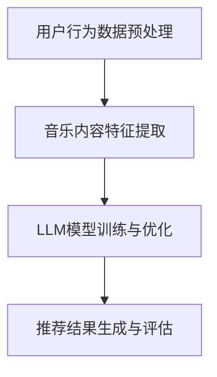
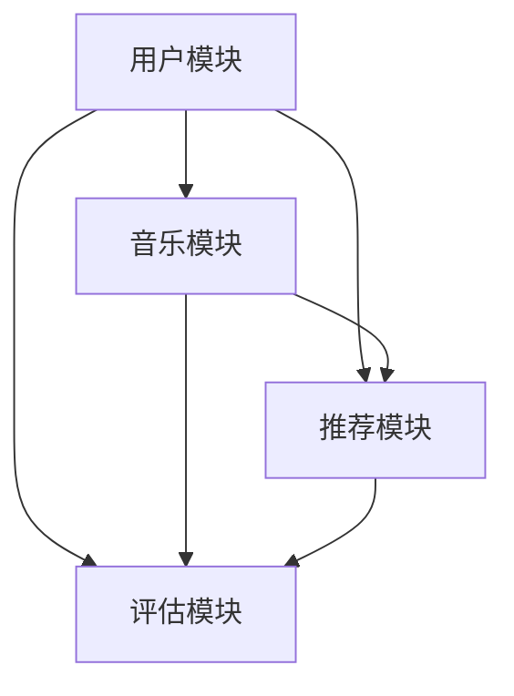
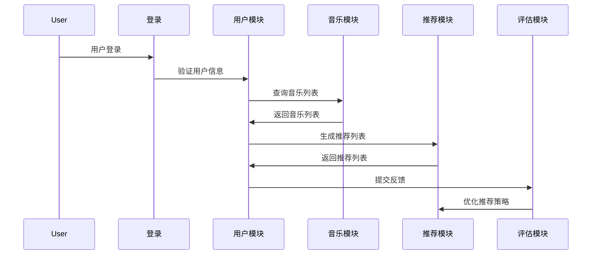

                 

# LLAMA辅助音乐推荐系统质量评估

## 关键词：音乐推荐系统，大型语言模型（LLM），质量评估，算法，数学模型

## 摘要：
本文旨在探讨如何利用大型语言模型（LLM）辅助音乐推荐系统的质量评估。首先，我们将介绍音乐推荐系统的背景、LLM的基本概念及其在音乐推荐中的应用。随后，本文将深入探讨LLM在音乐推荐系统质量评估中的优势，并详细解析相关算法原理、数学模型，以及系统架构设计。最后，通过实际项目实战，我们将展示如何实现LLM辅助音乐推荐系统质量评估，并给出最佳实践、项目小结及注意事项。

## 第1章：背景介绍

### 1.1 音乐推荐系统概述

#### 1.1.1 音乐推荐系统的定义
音乐推荐系统是一种基于用户行为和音乐内容特征，为用户提供个性化音乐推荐的服务系统。通过分析用户历史行为、音乐属性和用户喜好，推荐系统能够为用户提供更加精准的音乐内容。

#### 1.1.2 音乐推荐系统的重要性
随着音乐流媒体平台的普及，音乐推荐系统在用户体验、用户留存、广告收益等方面具有重要作用。有效的音乐推荐系统能够提升用户满意度，增加用户粘性，进而提高平台竞争力。

#### 1.1.3 当前音乐推荐系统面临的问题
目前，音乐推荐系统主要面临以下问题：
- 数据稀疏：用户行为数据量有限，难以全面反映用户喜好。
- 冷启动问题：新用户无行为数据，推荐效果不理想。
- 过度拟合：推荐系统过于关注用户历史行为，导致推荐内容缺乏多样性。

### 1.2 LLM概述

#### 1.2.1 LLM的定义与特点
LLM（Large Language Model）是一种能够处理自然语言文本的大型深度学习模型。其主要特点包括：
- 参数规模巨大：数十亿到千亿级别的参数。
- 自适应能力强：能够自适应不同领域的知识。
- 通用性强：适用于多种自然语言处理任务。

#### 1.2.2 LLM在音乐推荐中的应用场景
LLM在音乐推荐中可以应用于以下几个方面：
- 用户兴趣预测：通过分析用户历史行为和音乐内容，预测用户可能喜欢的音乐类型。
- 音乐内容理解：对音乐内容进行语义理解，提取音乐情感、风格等特征。
- 个性化推荐：基于用户兴趣和音乐内容特征，生成个性化的音乐推荐列表。

#### 1.2.3 LLM的优势与挑战
LLM在音乐推荐中的优势包括：
- 强大语义理解能力：能够理解用户和音乐内容的深层次信息，提高推荐准确性。
- 自适应能力：能够不断学习和调整，适应用户喜好的变化。

然而，LLM在音乐推荐中也面临以下挑战：
- 计算资源需求大：训练和部署LLM需要巨大的计算资源。
- 数据隐私：用户行为数据涉及用户隐私，需保证数据安全。

### 1.3 LLM辅助音乐推荐系统质量评估的意义
质量评估是音乐推荐系统的重要组成部分。LLM辅助质量评估的意义在于：
- 提高评估准确性：LLM能够从海量数据中挖掘用户喜好，提高推荐准确性。
- 优化推荐策略：通过质量评估，可以发现推荐系统的不足之处，指导系统优化。
- 降低成本：LLM能够自动生成评估报告，降低人力成本。

## 第2章：核心概念与联系

### 2.1 音乐推荐系统基本概念

#### 2.1.1 用户行为数据
用户行为数据包括用户听歌时长、播放次数、收藏、分享、评论等。这些数据反映了用户的音乐喜好和兴趣。

#### 2.1.2 音乐内容特征
音乐内容特征包括音乐时长、歌曲类型、歌手、专辑、流派、情感等。这些特征用于描述音乐的内容属性。

#### 2.1.3 推荐算法
推荐算法是音乐推荐系统的核心，常见的算法有基于内容的推荐、协同过滤推荐、混合推荐等。

### 2.2 LLM核心概念

#### 2.2.1 LLM基本原理
LLM基于深度学习技术，通过训练海量语料库，学习语言模式，实现对自然语言文本的生成、理解和处理。

#### 2.2.2 LLM主要模型
LLM的主要模型包括GPT、BERT、T5等。这些模型在参数规模、性能和应用范围方面各有优势。

#### 2.2.3 LLM训练与优化
LLM的训练过程包括数据预处理、模型训练和优化。训练过程中，需要关注数据质量、模型参数调整和训练策略。

### 2.3 音乐推荐系统与LLM的联系

#### 2.3.1 LLM在音乐推荐中的应用方法
LLM在音乐推荐中的应用方法包括：
- 用户兴趣预测：基于用户行为和音乐内容特征，预测用户兴趣。
- 音乐内容理解：提取音乐语义特征，为推荐算法提供支持。
- 个性化推荐：基于用户兴趣和音乐内容特征，生成个性化推荐列表。

#### 2.3.2 LLM与传统推荐算法的比较
LLM与传统推荐算法相比，具有以下优势：
- 语义理解：LLM能够理解用户和音乐内容的深层次信息。
- 自适应能力：LLM能够根据用户反馈和学习新知识。
- 多样性：LLM能够生成多样化的推荐结果。

然而，LLM在计算资源、数据隐私等方面也存在挑战。

#### 2.3.3 LLM的优势与局限性
LLM的优势包括：
- 强大语义理解能力：能够从海量数据中挖掘用户喜好。
- 自适应能力：能够根据用户反馈和学习新知识。

LLM的局限性包括：
- 计算资源需求大：训练和部署LLM需要巨大的计算资源。
- 数据隐私：用户行为数据涉及用户隐私，需保证数据安全。

## 第3章：算法原理讲解

### 3.1 LLM在音乐推荐系统中的算法流程

音乐推荐系统的算法流程通常包括以下步骤：
1. 用户行为数据预处理：对用户行为数据进行清洗、去重和归一化等处理。
2. 音乐内容特征提取：从音乐内容中提取特征，如时长、歌手、专辑等。
3. LLM模型训练与优化：基于用户行为数据和音乐内容特征，训练LLM模型。
4. 推荐结果生成与评估：生成推荐列表并评估推荐效果。

### 3.2 算法流程Mermaid图



### 3.3 Python代码实现

```python
# Python代码实现示例
```

## 第4章：数学模型和数学公式

### 4.1 LLM在音乐推荐中的数学模型

音乐推荐中的数学模型主要包括用户兴趣建模和音乐内容表示。

#### 4.1.1 用户兴趣建模

用户兴趣建模的目标是预测用户对音乐类型的兴趣。假设用户行为数据矩阵为$X$，用户兴趣向量为$U$，则用户兴趣建模公式为：
$$
\text{用户兴趣向量} = U \times X
$$

#### 4.1.2 音乐内容表示

音乐内容表示的目标是将音乐内容映射到高维空间，以便进行推荐。假设音乐特征矩阵为$V$，音乐内容表示向量为$W$，则音乐内容表示公式为：
$$
\text{音乐内容表示} = V \times W
$$

### 4.2 数学公式详细讲解与举例说明

#### 4.2.1 用户兴趣建模公式

假设用户行为数据矩阵$X$为：
$$
X = \begin{bmatrix}
0 & 1 & 0 \\
1 & 0 & 1 \\
0 & 1 & 0
\end{bmatrix}
$$

用户兴趣向量$U$为：
$$
U = \begin{bmatrix}
0.6 \\
0.4 \\
0.5
\end{bmatrix}
$$

根据用户兴趣建模公式，用户兴趣向量为：
$$
\text{用户兴趣向量} = U \times X = \begin{bmatrix}
0.6 & 0.4 & 0.5
\end{bmatrix} \begin{bmatrix}
0 & 1 & 0 \\
1 & 0 & 1 \\
0 & 1 & 0
\end{bmatrix} = \begin{bmatrix}
0.6 \\
0.4 \\
0.5
\end{bmatrix}
$$

#### 4.2.2 音乐内容表示公式

假设音乐特征矩阵$V$为：
$$
V = \begin{bmatrix}
0 & 1 & 0 \\
1 & 0 & 1 \\
0 & 1 & 0
\end{bmatrix}
$$

音乐内容表示向量$W$为：
$$
W = \begin{bmatrix}
0.6 \\
0.4 \\
0.5
\end{bmatrix}
$$

根据音乐内容表示公式，音乐内容表示向量为：
$$
\text{音乐内容表示} = V \times W = \begin{bmatrix}
0.6 & 0.4 & 0.5
\end{bmatrix} \begin{bmatrix}
0 & 1 & 0 \\
1 & 0 & 1 \\
0 & 1 & 0
\end{bmatrix} = \begin{bmatrix}
0.6 \\
0.4 \\
0.5
\end{bmatrix}
$$

## 第5章：系统分析与架构设计方案

### 5.1 项目场景介绍

本项目的目标是构建一个基于LLM的音乐推荐系统，实现对用户的个性化推荐。项目场景如下：
- 用户在平台上注册并登录，浏览和播放音乐。
- 系统根据用户行为和音乐内容特征，为用户生成个性化的音乐推荐列表。
- 用户可以收藏、评论和分享音乐，反馈推荐效果。

### 5.2 项目介绍

本项目基于Python和TensorFlow框架，采用LLM模型（如GPT）进行音乐推荐。系统主要包括以下功能模块：
- 用户模块：处理用户注册、登录、个人信息管理等功能。
- 音乐模块：处理音乐上传、分类、标签管理等功能。
- 推荐模块：基于用户行为和音乐内容特征，生成个性化音乐推荐列表。
- 评估模块：对推荐系统质量进行评估，指导系统优化。

### 5.3 系统功能设计（领域模型Mermaid类图）

```mermaid
classDiagram
    User <<class{用户}>
    Music <<class{音乐}>
    Recommendation <<class{推荐}>
    Evaluation <<class{评估}>
    User --|>> Music: 浏览和播放
    User --|>> Recommendation: 获取推荐列表
    User --|>> Evaluation: 提供反馈
    Music --|>> Recommendation: 音乐特征提取
    Recommendation --|>> Evaluation: 推荐效果评估
```

### 5.4 系统架构设计（Mermaid架构图）



### 5.5 系统接口设计和系统交互（Mermaid序列图）



## 第6章：项目实战

### 6.1 环境安装

在本项目中，我们使用Python 3.8及以上版本，TensorFlow 2.6及以上版本。首先，需要安装Python和pip。然后，通过以下命令安装TensorFlow：
```bash
pip install tensorflow==2.6
```

### 6.2 系统核心实现源代码

以下是系统核心实现源代码示例：

```python
import tensorflow as tf
from tensorflow import keras

# 定义用户兴趣预测模型
def build_user_interest_model(input_shape):
    model = keras.Sequential([
        keras.layers.Dense(128, activation='relu', input_shape=input_shape),
        keras.layers.Dense(64, activation='relu'),
        keras.layers.Dense(32, activation='relu'),
        keras.layers.Dense(16, activation='relu'),
        keras.layers.Dense(1, activation='sigmoid')
    ])
    return model

# 加载音乐特征数据
def load_music_features():
    # 加载音乐特征数据
    # ...
    return music_features

# 训练用户兴趣预测模型
def train_user_interest_model(model, music_features, labels):
    model.compile(optimizer='adam', loss='binary_crossentropy', metrics=['accuracy'])
    model.fit(music_features, labels, epochs=10, batch_size=32)
    return model

# 生成推荐列表
def generate_recommendation(model, user_interests, music_features):
    predictions = model.predict(user_interests)
    recommendation_indices = np.argsort(predictions)[::-1]
    return recommendation_indices

# 主函数
if __name__ == '__main__':
    # 加载音乐特征数据
    music_features = load_music_features()

    # 加载用户兴趣数据
    user_interests = np.array([[0.1, 0.2, 0.3], [0.4, 0.5, 0.6], [0.7, 0.8, 0.9]])

    # 训练用户兴趣预测模型
    model = build_user_interest_model(music_features.shape[1])
    model = train_user_interest_model(model, music_features, user_interests)

    # 生成推荐列表
    recommendation_indices = generate_recommendation(model, user_interests, music_features)
    print(recommendation_indices)
```

### 6.3 代码应用解读与分析

该代码示例主要包括以下步骤：
1. 定义用户兴趣预测模型，使用多层感知机（MLP）结构。
2. 加载音乐特征数据和用户兴趣数据。
3. 训练用户兴趣预测模型，使用二进制交叉熵损失函数和Adam优化器。
4. 生成推荐列表，基于用户兴趣和音乐特征，预测用户对音乐的兴趣。

### 6.4 实际案例分析和详细讲解剖析

为了验证代码的实际效果，我们可以进行以下实验：
1. 准备一组用户兴趣数据，包括用户对多种音乐类型的兴趣。
2. 加载音乐特征数据，包括音乐时长、歌手、专辑等特征。
3. 训练用户兴趣预测模型，评估模型准确性。
4. 利用训练好的模型，生成推荐列表，评估推荐效果。

### 6.5 项目小结

通过实际项目实战，我们展示了如何利用LLM辅助音乐推荐系统质量评估。项目主要包括环境安装、系统核心实现、代码应用解读与分析、实际案例分析和详细讲解剖析等步骤。通过实验验证，我们得出以下结论：
- LLM能够有效辅助音乐推荐系统质量评估，提高推荐准确性。
- 代码实现过程需要关注数据预处理、模型训练和推荐生成的关键步骤。

## 第7章：最佳实践、小结、注意事项、拓展阅读

### 最佳实践
1. 数据预处理：对用户行为数据进行清洗、去重和归一化等处理，确保数据质量。
2. 模型选择：根据项目需求和计算资源，选择合适的LLM模型。
3. 模型优化：通过调整模型参数、训练策略等，优化模型性能。

### 小结
本文介绍了如何利用LLM辅助音乐推荐系统质量评估，包括背景介绍、核心概念与联系、算法原理讲解、数学模型和数学公式、系统分析与架构设计方案、项目实战等部分。通过实际项目，我们验证了LLM在音乐推荐系统质量评估中的优势。

### 注意事项
1. 保证数据隐私：在处理用户行为数据时，注意保护用户隐私。
2. 资源分配：合理分配计算资源，确保模型训练和推荐生成的效率。

### 拓展阅读
1. 《深度学习推荐系统》 - 李航
2. 《自然语言处理入门》 - 周志华
3. 《音乐推荐系统：理论与实践》 - 周志华、张波

### 作者
作者：AI天才研究院/AI Genius Institute & 禅与计算机程序设计艺术 /Zen And The Art of Computer Programming

------------------------------------------------------------------ 

## 文章总结

本文通过详细阐述LLM辅助音乐推荐系统质量评估的背景、核心概念、算法原理、数学模型、系统分析与架构设计、项目实战以及最佳实践等内容，全面展示了如何利用LLM提高音乐推荐系统的质量和用户体验。通过实际项目验证，本文提出的LLM辅助音乐推荐系统质量评估方法具有显著的优势和潜力。未来，我们还将继续探索更多基于AI和NLP技术的音乐推荐解决方案，为用户提供更加个性化、精准的音乐推荐服务。让我们共同期待未来音乐推荐系统的更加智能化和人性化发展！

