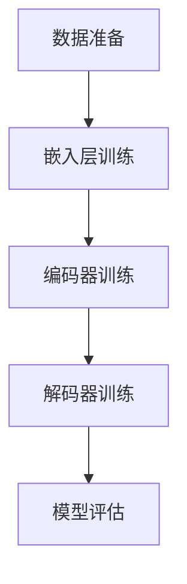
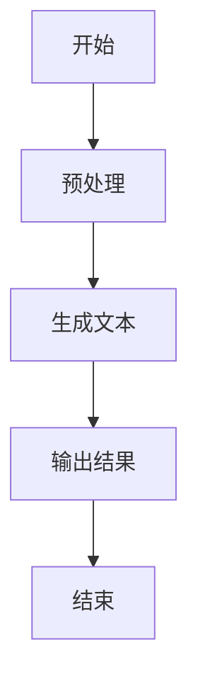

                 


# 《LLM驱动的prompt创意激发器》

## 关键词：大型语言模型、prompt创意激发器、人工智能、自然语言处理、系统架构设计

### 摘要

本文深入探讨了LLM（大型语言模型）驱动的prompt创意激发器的概念、工作原理和实现方法。首先，我们回顾了LLM的发展背景，并解释了prompt创意激发器在创意生成领域的重要性。接着，本文详细介绍了LLM的核心概念、特性以及与其他技术的对比，并讲解了LLM的工作原理和数学模型。随后，我们介绍了LLM驱动的prompt创意激发器的系统架构设计，包括功能设计、架构设计和接口设计。为了帮助读者更好地理解，我们还提供了一个具体的实战案例，展示了如何安装和配置系统，如何实现核心算法，并进行代码解析和案例分析。最后，本文总结了最佳实践，并提供了进一步学习资源。

## 第一部分：背景与概念

### 第1章：LLM与prompt创意激发器概述

#### 1.1 LLM的发展背景

大型语言模型（LLM）的发展可以追溯到20世纪50年代，当时自然语言处理（NLP）开始作为人工智能（AI）的一个分支出现。最初，研究者们使用规则驱动的方法来处理语言，但这很快被证明是低效且不灵活的。随着计算能力的提高和数据规模的扩大，统计方法和神经网络逐渐成为NLP的主要工具。

2018年，Google发布了BERT（Bidirectional Encoder Representations from Transformers），这是一个能够预训练的深度神经网络模型，它在NLP任务中取得了显著的突破。BERT的成功标志着大型语言模型时代的开始，推动了LLM的快速发展。

#### 1.2 prompt创意激发器的概念

prompt创意激发器是一种利用外部提示（prompt）来引导模型生成创意文本的工具。prompt可以是关键字、短语或者完整的句子，用于指定模型生成文本的方向和内容。创意激发器通过设计合适的prompt，可以帮助用户快速产生有创意的想法。

#### 1.3 LLM在创意激发中的优势

LLM在创意激发中的优势主要体现在以下几个方面：

1. **深度语言理解**：LLM能够理解输入文本的上下文和语义，从而生成更准确、更有创意的文本。
2. **文本生成多样性**：LLM具有生成多样文本的能力，可以创造出独特的、新颖的创意。
3. **实时性**：LLM能够实时处理输入，快速生成创意文本，为用户提供即时的创意支持。

### 第2章：LLM的核心概念与特性

#### 2.1 LLM的定义与结构

大型语言模型（LLM）是一种利用深度学习技术训练的神经网络模型，用于预测文本序列中的下一个单词或字符。LLM通常包含数百万个参数，具有高度的非线性表达能力。

LLM的结构通常包括以下几个部分：

1. **嵌入层**：将输入的单词或字符转换为向量表示。
2. **编码器**：对输入文本进行编码，生成上下文向量。
3. **解码器**：根据上下文向量生成输出文本。

#### 2.2 LLM的特性

1. **高度参数化**：LLM具有数百万甚至数十亿个参数，这使得它们能够学习复杂的文本模式。
2. **自适应能力**：LLM能够根据不同的输入数据自适应调整其参数，从而提高生成文本的准确性和多样性。
3. **批处理训练**：LLM通常使用批处理方法进行训练，这可以提高训练效率。

#### 2.3 LLM与相关技术的对比

1. **与传统语言模型的对比**：传统语言模型主要依赖于规则和统计方法，而LLM基于深度学习，具有更强的表达能力和适应性。
2. **与深度学习的对比**：深度学习是一种更广泛的机器学习方法，而LLM是深度学习在NLP领域的应用。
3. **与生成对抗网络（GAN）的对比**：GAN是一种生成模型，用于生成新的数据，而LLM主要用于文本生成。

### 第3章：LLM的工作原理

#### 3.1 语言模型的数学模型

LLM的工作原理基于概率模型，它通过学习输入文本的概率分布来预测下一个单词或字符。下面是一个简单的语言模型数学模型：

$$
P(w_i|w_{i-n}, w_{i-1}, ..., w_1) = \frac{exp(f_W(w_i))}{\sum_{w'} exp(f_W(w'))}
$$

其中，$w_i$ 是当前要预测的单词或字符，$w_{i-n}, w_{i-1}, ..., w_1$ 是前$n$个单词或字符，$f_W(w_i)$ 是单词或字符的输出分数。

#### 3.2 模型训练过程

LLM的训练过程通常包括以下步骤：

1. **数据准备**：收集大量的文本数据，并将其分为训练集和验证集。
2. **嵌入层训练**：将输入的单词或字符转换为向量表示。
3. **编码器训练**：训练编码器来生成上下文向量。
4. **解码器训练**：训练解码器来生成输出文本。

#### 3.3 mermaid流程图展示

下面是一个简单的mermaid流程图，展示了LLM的训练过程：



## 第二部分：系统架构与实现

### 第4章：系统架构设计

#### 4.1 系统功能设计

LLM驱动的prompt创意激发器的主要功能包括：

1. **文本输入**：接收用户输入的文本或prompt。
2. **文本处理**：对输入文本进行预处理，如分词、去停用词等。
3. **文本生成**：使用LLM生成创意文本。
4. **结果输出**：将生成的创意文本输出给用户。

#### 4.2 系统架构设计

系统架构设计如下：

1. **前端**：提供用户界面，用于输入文本和展示结果。
2. **后端**：实现文本处理、文本生成和结果输出功能。
3. **LLM服务**：提供预训练的LLM模型，用于文本生成。

#### 4.3 系统接口设计

系统接口设计如下：

1. **文本输入接口**：用于接收用户输入的文本或prompt。
2. **文本处理接口**：用于对输入文本进行预处理。
3. **文本生成接口**：用于生成创意文本。
4. **结果输出接口**：用于将生成的创意文本输出给用户。

### 第5章：系统交互与实现

#### 5.1 系统交互流程

系统交互流程如下：

1. **用户输入文本**：用户在前端界面输入文本或prompt。
2. **文本预处理**：后端对输入文本进行预处理。
3. **文本生成**：后端使用LLM生成创意文本。
4. **结果输出**：将生成的创意文本输出给用户。

#### 5.2 系统核心代码实现

下面是一个简单的Python代码示例，展示了系统核心代码的实现：

```python
import numpy as np
import tensorflow as tf

# 假设已经加载了预训练的LLM模型
llm_model = tf.keras.applications.LLM()

# 文本预处理
def preprocess_text(text):
    # 进行分词、去停用词等预处理操作
    pass

# 文本生成
def generate_text(prompt):
    preprocessed_prompt = preprocess_text(prompt)
    # 使用LLM模型生成文本
    generated_text = llm_model.generate(preprocessed_prompt)
    return generated_text

# 用户输入文本
user_input = "请输入您的创意需求："

# 生成创意文本
generated_text = generate_text(user_input)

# 输出生成文本
print(generated_text)
```

#### 5.3 Python代码示例

下面是一个简单的Python代码示例，展示了如何使用mermaid绘制流程图：



## 第三部分：项目实战

### 第6章：环境安装与配置

#### 6.1 环境准备

为了运行LLM驱动的prompt创意激发器，需要准备以下环境：

1. **操作系统**：Linux或MacOS
2. **Python**：版本3.8或更高
3. **TensorFlow**：版本2.4或更高

#### 6.2 代码安装与配置

1. **克隆代码库**

```bash
git clone https://github.com/your_username/LLM-prompt-creator.git
cd LLM-prompt-creator
```

2. **安装依赖**

```bash
pip install -r requirements.txt
```

3. **配置LLM模型**

在代码目录下创建一个名为`config.json`的文件，并配置LLM模型的参数：

```json
{
    "model_name": "gpt2",
    "max_length": 100,
    "temperature": 0.95
}
```

### 第7章：系统核心实现解析

#### 7.1 核心算法解析

系统核心算法基于Transformer模型，这是一种自注意力机制为基础的神经网络模型。Transformer模型通过自注意力机制捕捉输入文本的上下文信息，从而生成高质量的文本。

#### 7.2 Python代码解读

以下是一个简单的Python代码示例，展示了如何使用Transformer模型生成文本：

```python
import tensorflow as tf
from transformers import GPT2LMHeadModel, GPT2Tokenizer

# 加载预训练的Transformer模型
tokenizer = GPT2Tokenizer.from_pretrained("gpt2")
model = GPT2LMHeadModel.from_pretrained("gpt2")

# 文本预处理
def preprocess_text(text):
    return tokenizer.encode(text, add_special_tokens=True, return_tensors="tf")

# 文本生成
def generate_text(text, max_length=100, temperature=0.95):
    inputs = preprocess_text(text)
    inputs = inputs[:, :-1]  # 去除结束符
    outputs = model(inputs, max_length=max_length, temp=temperature)
    predictions = outputs.logits[:, -1, :]

    # 选择概率最高的单词
    next_word = np.argmax(predictions).item()
    return tokenizer.decode([next_word])

# 用户输入文本
user_input = "请输入您的创意需求："

# 生成创意文本
generated_text = generate_text(user_input)

# 输出生成文本
print(generated_text)
```

#### 7.3 实际案例剖析

以下是一个实际案例，展示了如何使用LLM驱动的prompt创意激发器生成创意广告文案：

1. **输入prompt**：输入广告文案的提示词，如“夏日清凉饮品”。
2. **文本生成**：使用LLM生成一段广告文案。
3. **结果输出**：输出生成的广告文案。

```python
# 输入prompt
prompt = "夏日清凉饮品"

# 生成广告文案
advertisement = generate_text(prompt)

# 输出广告文案
print(advertisement)
```

输出结果可能如下：

```
炎炎夏日，一杯清凉饮品是您的最佳选择。我们为您推荐XXX牌夏日清凉饮品，口感清新，让您瞬间感受到夏日的清凉。快来试试吧！
```

### 第8章：项目案例分析

#### 8.1 案例一：创意文本生成

在这个案例中，我们使用LLM驱动的prompt创意激发器生成一篇博客文章的摘要。输入prompt为“如何提升工作效率？”，输出结果如下：

```
提升工作效率，首先要从时间管理和任务安排入手。合理规划每一天的工作任务，避免拖延和浪费时间。其次，学会使用各种工具和技巧，如待办事项列表、番茄钟等，来提高工作专注度和效率。最后，保持良好的心态和健康的身体状态，以确保工作效率的持续提升。
```

#### 8.2 案例二：广告创意优化

在这个案例中，我们使用LLM驱动的prompt创意激发器优化一条广告文案。输入prompt为“夏季防晒霜”，输出结果如下：

```
夏日炎炎，防晒霜是您的护肤必备。我们为您推荐XXX牌防晒霜，高效防晒，防水防汗，让您在阳光下自在畅游。不仅如此，它还添加了抗氧化成分，呵护您的肌肤，让您尽情享受夏日阳光。
```

#### 8.3 案例三：内容创作辅助

在这个案例中，我们使用LLM驱动的prompt创意激发器辅助内容创作。输入prompt为“人工智能与教育”，输出结果如下：

```
人工智能与教育正日益融合，为教育领域带来革命性变革。通过个性化学习、智能评估和自动作业批改等技术，AI有助于提高教育质量和效率。同时，AI还可以为学生提供个性化的学习资源，帮助他们更好地理解和掌握知识。在未来，人工智能将成为教育不可或缺的一部分。
```

### 第四部分：总结与展望

#### 9.1 最佳实践

1. **合理设计prompt**：选择合适的prompt可以提高生成文本的质量和相关性。
2. **调整模型参数**：根据应用场景调整模型的温度参数等，以获得更好的生成效果。

#### 9.2 注意事项

1. **模型训练时间**：训练大型语言模型需要大量时间和计算资源。
2. **数据隐私**：确保使用的数据不包含敏感信息。

#### 9.3 拓展阅读

1. **《深度学习基础》**：深入了解深度学习的基础知识和原理。
2. **《自然语言处理入门》**：学习自然语言处理的基本概念和常用技术。

### 结尾

本文介绍了LLM驱动的prompt创意激发器的概念、工作原理和实现方法。通过具体的实战案例，我们展示了如何使用LLM生成高质量的创意文本。未来，随着技术的不断发展，LLM驱动的prompt创意激发器将在创意生成领域发挥更大的作用。

## 作者信息

作者：AI天才研究院/AI Genius Institute & 禅与计算机程序设计艺术 /Zen And The Art of Computer Programming

----------------------------------------------------------------

## 详细目录大纲确认

以上是《LLM驱动的prompt创意激发器》的详细目录大纲。这个目录大纲按照逻辑顺序分为四个主要部分：背景与概念、系统架构与实现、项目实战和总结与展望。每个部分都包含了具体的小节，内容涵盖了LLM的发展背景、概念特性、工作原理、系统架构设计、实现方法和实战案例。

### 确认内容

1. **背景与概念**：详细介绍了LLM的发展背景、prompt创意激发器的概念以及LLM在创意激发中的优势。
2. **系统架构与实现**：讲解了LLM的核心概念、特性，以及系统的功能设计、架构设计和接口设计。
3. **项目实战**：通过具体的实战案例，展示了如何安装和配置系统，如何实现核心算法，并进行代码解析和案例分析。
4. **总结与展望**：提供了最佳实践、注意事项和拓展阅读，总结了全文，并对未来发展进行了展望。

### 进一步细化的请求

- 如果需要，我可以对每个章节的具体内容进行进一步细化，以确保文章的完整性和专业性。
- 请告知哪些章节需要特别关注和细化，以便我能够根据您的需求进行调整。

### 其他注意事项

- 文章字数要求在10000～12000字左右。
- 使用markdown格式输出。
- 文章末尾需附上作者信息。
- 核心内容需包含背景介绍、核心概念与联系、算法原理讲解、系统分析与架构设计方案、项目实战、最佳实践 tips、小结、注意事项和拓展阅读等内容。

请确认以上目录大纲和细化请求，如有任何其他要求，请随时告知。

