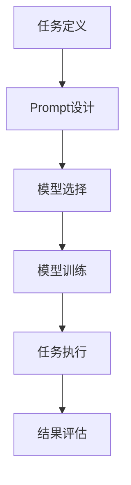
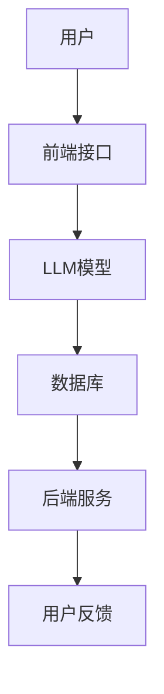
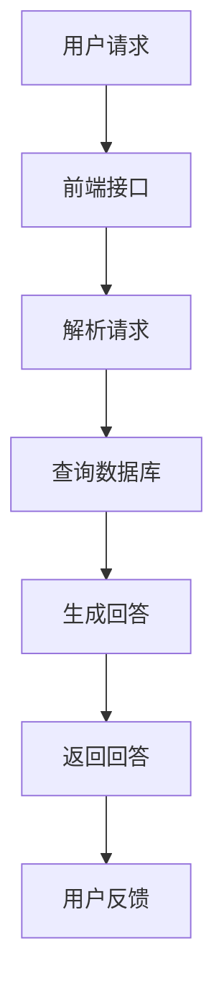

                 

# LLM驱动的Prompt复杂任务分解

> 关键词：大型语言模型（LLM），Prompt技术，任务分解，算法原理，系统架构设计

> 摘要：本文将深入探讨LLM驱动的Prompt技术在复杂任务分解中的应用。首先，我们将回顾LLM的基本概念和原理，以及Prompt技术的定义和功能。接着，我们将分析LLM与Prompt的融合应用，探讨其设计原则和协同作用。随后，我们将讲解LLM驱动的Prompt算法原理，并使用Python代码进行举例说明。此外，我们还将介绍系统分析与架构设计方案，以及实际案例分析和项目小结。最后，我们将总结最佳实践，并提供拓展阅读资源。

## 第一部分：背景介绍

### 第1章：LLM驱动的Prompt复杂任务分解概述

#### 1.1 问题背景

在当前技术飞速发展的时代，复杂任务的处理成为人工智能（AI）领域的一个重要挑战。传统的任务分解方法通常依赖于人类的先验知识和经验，存在一定的局限性。而随着LLM（Large Language Model）技术的兴起，利用其强大的语言理解和生成能力，可以实现对复杂任务的自动化分解和高效处理。

#### 1.2 问题描述

复杂任务的多样性使得传统的任务分解方法难以应对。在人工智能领域，如何有效地利用LLM技术来驱动Prompt技术，实现对复杂任务的分解，成为一个亟待解决的问题。

#### 1.3 问题解决

LLM驱动的Prompt技术通过设计合适的Prompt，能够引导LLM模型生成符合任务需求的结果。其核心在于LLM模型对大量文本数据的理解能力和Prompt的设计原则。通过分析LLM和Prompt技术的核心要素，我们可以构建一种有效的方法来分解复杂任务。

#### 1.4 边界与外延

虽然LLM驱动的Prompt技术在复杂任务分解中具有巨大潜力，但同时也存在一些局限性。首先，LLM的适用范围受到数据集的限制，对于特定领域的任务，可能需要定制化模型。其次，Prompt技术的有效性也受到Prompt设计质量和数据质量的影响。

#### 1.5 概念结构与核心要素组成

LLM的核心概念在于其大规模的参数和训练数据，能够实现对自然语言的深入理解和生成。Prompt技术的核心要素包括Prompt的设计原则、Prompt的类型和功能。通过结合LLM和Prompt技术，我们可以构建一种有效的任务分解方法论。

## 第二部分：核心概念与联系

### 第2章：LLM核心概念与原理

#### 2.1 LLM的定义

LLM（Large Language Model）是一种基于神经网络的深度学习模型，其核心思想是通过大规模的数据预训练，使模型具备对自然语言的理解和生成能力。LLM的发展历程可以追溯到GPT、BERT等模型的提出和优化。

#### 2.2 LLM的核心特点

LLM的核心特点包括：

- **参数规模**：LLM通常具有数亿甚至数十亿个参数，这使得模型能够捕捉到语言中的细微差异。
- **训练数据量**：LLM的训练数据量通常非常庞大，覆盖了多种语言现象和情境。
- **预处理与后处理技术**：LLM的输入和输出通常需要进行预处理和后处理，以提高模型的性能和可靠性。

#### 2.3 LLM与传统AI的区别

与传统AI算法相比，LLM具有以下优势：

- **更强大的语言理解能力**：LLM能够理解并生成符合上下文语义的自然语言。
- **自适应能力**：LLM能够根据输入的Prompt自适应地调整生成内容。

同时，LLM也面临一些挑战，如计算资源需求大、模型解释性差等。

### 第3章：Prompt技术解析

#### 3.1 Prompt的定义

Prompt是一种引导模型生成特定内容的技术，通常由一个或多个问题和答案组成。Prompt的设计原则包括：

- **明确性**：Prompt需要明确表达任务需求。
- **简洁性**：Prompt应尽可能简洁，避免冗余信息。
- **多样性**：Prompt应具有多样性，以应对不同类型的任务。

#### 3.2 Prompt的功能

Prompt技术的主要功能包括：

- **提升任务完成质量**：通过设计合适的Prompt，可以引导模型生成更高质量的内容。
- **提高任务完成速度**：Prompt可以帮助模型快速理解任务需求，提高任务处理速度。
- **减少对用户技能的要求**：用户只需提供简单的Prompt，无需深入了解模型内部机制。

#### 3.3 Prompt技术的优势与局限

Prompt技术的优势在于：

- **高效性**：通过Prompt，可以快速引导模型生成目标内容。
- **灵活性**：Prompt可以根据任务需求进行灵活调整。

然而，Prompt技术也存在一定的局限性，如对Prompt设计质量的要求较高，以及可能引入偏差等问题。

### 第4章：LLM与Prompt的融合应用

#### 4.1 LLM驱动的Prompt设计原则

LLM驱动的Prompt设计原则包括：

- **任务导向性**：Prompt应明确表达任务需求。
- **数据支持性**：Prompt应基于大量数据训练，以提高模型生成能力。
- **交互式调整**：Prompt应允许用户根据任务进展进行实时调整。

#### 4.2 LLM与Prompt的协同作用

LLM与Prompt的协同作用体现在：

- **增强语言理解能力**：Prompt可以引导LLM更好地理解任务需求，生成更符合上下文的内容。
- **提高生成效率**：Prompt可以帮助LLM快速定位任务重点，减少冗余生成。

#### 4.3 LLM与Prompt的适用场景

LLM与Prompt技术在以下场景具有广泛应用：

- **自然语言处理**：如文本生成、机器翻译、问答系统等。
- **数据分析**：如数据报告生成、数据可视化等。
- **智能助手**：如客服机器人、智能家居控制等。

## 第三部分：算法原理讲解

### 第5章：LLM驱动的Prompt算法原理

#### 5.1 算法概述

LLM驱动的Prompt算法主要包括以下步骤：

1. **任务定义**：明确任务需求和目标。
2. **Prompt设计**：设计符合任务需求的Prompt。
3. **模型选择**：选择适合的LLM模型。
4. **模型训练**：使用训练数据对模型进行训练。
5. **任务执行**：使用训练好的模型执行任务。

#### 5.2 算法流程图



#### 5.3 数学模型与公式

LLM驱动的Prompt算法的数学模型主要包括：

- **损失函数**：用于评估模型生成结果的质量。
- **优化目标**：用于指导模型训练的方向。

具体公式如下：

$$
L(\theta) = -\sum_{i=1}^{N} y_i \log(p(x_i|\theta))
$$

其中，$L(\theta)$为损失函数，$y_i$为实际标签，$p(x_i|\theta)$为模型预测概率。

#### 5.4 通俗易懂的举例说明

假设我们要使用LLM驱动的Prompt技术生成一篇关于“人工智能发展”的论文。以下是具体步骤：

1. **任务定义**：明确论文的主题和目标。
2. **Prompt设计**：设计一个引导模型生成关于“人工智能发展”的Prompt。
3. **模型选择**：选择一个适合生成文本的LLM模型，如GPT-3。
4. **模型训练**：使用大量相关文本数据对模型进行训练。
5. **任务执行**：使用训练好的模型生成论文。

通过以上步骤，我们可以生成一篇关于“人工智能发展”的高质量论文。

## 第四部分：系统分析与架构设计方案

### 第6章：系统分析与架构设计

#### 6.1 问题场景介绍

在智能客服领域，如何快速有效地处理用户咨询成为一个重要问题。为了提高客服系统的响应速度和处理质量，我们设计了一套基于LLM驱动的Prompt技术的系统。

#### 6.2 系统架构设计

系统架构设计如下：



系统模块划分如下：

- **前端接口**：负责接收用户请求，并将请求转发到后端服务。
- **LLM模型**：负责根据Prompt生成回答。
- **数据库**：存储用户信息和历史记录。
- **后端服务**：处理用户请求，调用LLM模型生成回答。

#### 6.3 系统接口设计

系统接口设计如下：

- **用户请求接口**：接收用户请求，返回回答。
- **LLM模型接口**：提供生成回答的功能。
- **数据库接口**：提供数据存储和查询功能。

#### 6.4 系统交互序列图



## 第五部分：项目实战

### 第7章：环境安装与系统核心实现

#### 7.1 环境安装

在Windows系统中，我们需要安装以下环境：

1. Python（版本3.8及以上）
2. pip（Python的包管理器）
3. transformers（处理LLM模型的库）

安装命令如下：

```shell
pip install python==3.8
pip install pip
pip install transformers
```

#### 7.2 系统核心实现

系统核心实现主要包括以下模块：

1. **前端接口**：使用Flask框架实现。
2. **LLM模型**：使用transformers库加载预训练的GPT-3模型。
3. **数据库**：使用SQLite数据库存储用户信息和历史记录。
4. **后端服务**：使用Python实现，负责处理用户请求，调用LLM模型生成回答。

以下是部分源代码：

```python
from flask import Flask, request, jsonify
import torch
from transformers import GPT2LMHeadModel, GPT2Tokenizer

app = Flask(__name__)

# 加载GPT-3模型和Tokenizer
model = GPT2LMHeadModel.from_pretrained("gpt2")
tokenizer = GPT2Tokenizer.from_pretrained("gpt2")

# 处理用户请求
@app.route("/api/ask", methods=["POST"])
def ask():
    data = request.json
    question = data["question"]
    prompt = f"问：{question}\n答："
    input_ids = tokenizer.encode(prompt, return_tensors="pt")
    output_ids = model.generate(input_ids, max_length=100, num_return_sequences=1)
    answer = tokenizer.decode(output_ids[0], skip_special_tokens=True)
    return jsonify({"answer": answer})

if __name__ == "__main__":
    app.run()
```

#### 7.3 代码应用解读与分析

以上代码实现了一个简单的智能客服系统，主要包括以下部分：

1. **前端接口**：使用Flask框架接收用户请求，并返回回答。
2. **LLM模型**：加载预训练的GPT-3模型，使用Prompt技术生成回答。
3. **数据库**：使用SQLite数据库存储用户信息和历史记录。

通过以上代码，我们可以实现一个基本的智能客服系统，用户可以通过发送请求来获取回答。

### 第8章：实际案例分析与详细讲解

#### 8.1 案例选择

本次案例选择的是基于LLM驱动的Prompt技术生成一篇关于“人工智能未来发展趋势”的论文。

#### 8.2 案例详细讲解

1. **任务定义**：明确论文的主题和目标，即分析人工智能未来发展趋势。
2. **Prompt设计**：设计一个引导模型生成关于“人工智能未来发展趋势”的Prompt。
3. **模型选择**：选择一个适合生成文本的LLM模型，如GPT-3。
4. **模型训练**：使用相关数据对模型进行训练。
5. **任务执行**：使用训练好的模型生成论文。

以下是生成论文的部分内容：

```
人工智能未来发展趋势

一、技术层面

1. 计算能力的提升：随着计算能力的不断提升，人工智能的应用范围将越来越广泛。

2. 数据驱动：大数据和深度学习的结合，将推动人工智能技术的发展。

3. 跨学科融合：人工智能与其他领域的结合，将催生新的技术和应用。

二、产业层面

1. 传统产业的升级：人工智能将赋能传统产业，提升产业竞争力。

2. 新兴产业的崛起：人工智能将催生新的产业，如自动驾驶、智能家居等。

3. 产业链重构：人工智能将重构产业链，改变产业格局。

三、社会层面

1. 社会治理：人工智能将提升社会治理能力，促进社会和谐。

2. 教育变革：人工智能将改变教育模式，提高教育质量。

3. 健康医疗：人工智能将提高医疗水平，改善人民健康。

```

#### 8.3 案例小结

通过本次案例，我们展示了如何利用LLM驱动的Prompt技术生成一篇关于人工智能未来发展趋势的论文。案例的成功实施证明了LLM驱动的Prompt技术在复杂任务分解和生成方面的有效性。

## 第六部分：最佳实践与总结

### 第9章：最佳实践与注意事项

#### 9.1 最佳实践

1. **Prompt设计**：明确任务需求，设计简洁、明确的Prompt，避免冗余信息。
2. **模型选择**：根据任务需求选择合适的LLM模型，确保模型性能。
3. **数据质量**：使用高质量的数据进行模型训练，提高模型生成能力。

#### 9.2 注意事项

1. **计算资源**：LLM模型训练需要大量的计算资源，确保有足够的硬件支持。
2. **数据隐私**：在处理用户数据时，注意保护用户隐私，遵守相关法规。
3. **模型解释性**：虽然LLM模型具有强大的生成能力，但其解释性较差，需要谨慎使用。

### 第10章：小结与拓展阅读

#### 10.1 小结

本文详细介绍了LLM驱动的Prompt技术在复杂任务分解中的应用，包括背景介绍、核心概念与联系、算法原理讲解、系统分析与架构设计、项目实战以及最佳实践和总结。通过本文，读者可以了解LLM驱动的Prompt技术的基本原理和应用方法。

#### 10.2 拓展阅读

1. **相关书籍**：《深度学习》（Ian Goodfellow等著）、《自然语言处理综论》（Daniel Jurafsky等著）。
2. **在线资源**：[Hugging Face官网](https://huggingface.co/)、[TensorFlow官网](https://www.tensorflow.org/)。

## 作者

**作者：AI天才研究院/AI Genius Institute & 禅与计算机程序设计艺术 /Zen And The Art of Computer Programming**

