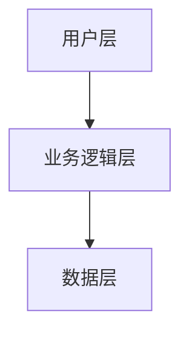
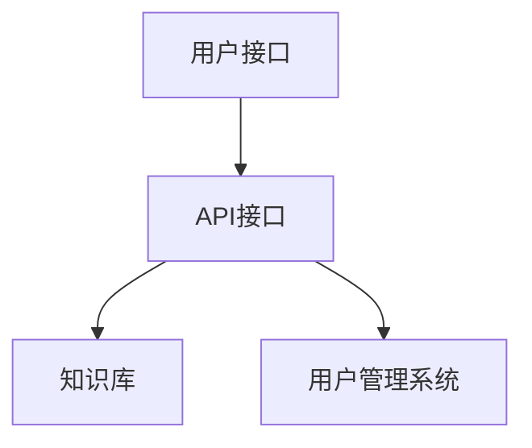
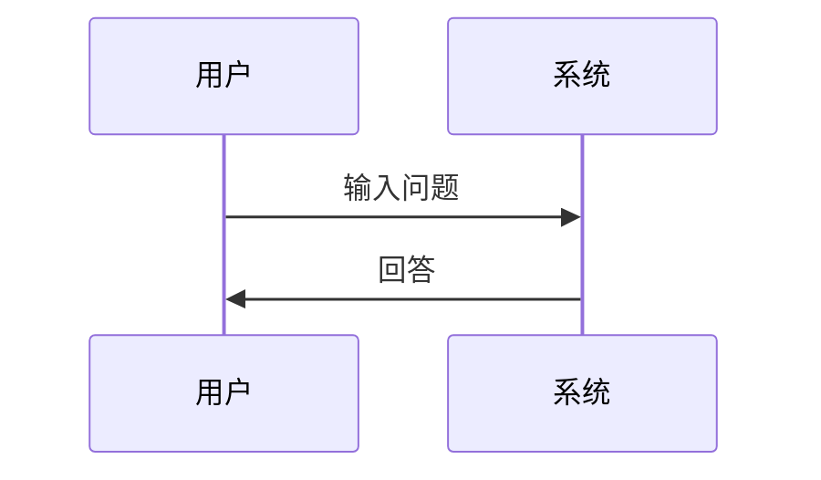

                 

# LLM驱动的prompt情境适应性优化

## 关键词

- 大规模语言模型
- prompt情境适应性优化
- 自然语言处理
- 深度学习
- 适应性调整

## 摘要

本文深入探讨了大规模语言模型（LLM）在自然语言处理中的应用，以及如何通过prompt情境适应性优化来提升LLM在特定场景下的性能。本文首先介绍了大规模语言模型的基本概念、结构与特点，然后讨论了prompt情境适应性优化的方法和关键技术，最后通过实际案例展示了如何实施这种优化，并给出了最佳实践建议。

## 第一部分：背景介绍

### 1.1 问题背景

随着人工智能技术的快速发展，大规模语言模型（Large Language Models，简称LLM）成为当前研究的热点。LLM在自然语言处理（Natural Language Processing，简称NLP）领域表现出色，例如在文本生成、机器翻译、问答系统等任务中取得了显著的成果。然而，在实际应用中，LLM仍存在许多挑战。其中一个关键问题是如何根据不同的prompt情境，对LLM进行适应性优化，以提升其性能和效果。

### 1.2 问题描述

LLM驱动的prompt情境适应性优化主要涉及以下问题：

1. **prompt理解与分类**：如何有效地理解用户输入的prompt，并将其分类到不同的情境中。
2. **模型适应性调整**：如何根据不同的情境，对LLM进行适应性调整，以提升其在特定情境下的性能。
3. **模型优化与训练**：如何通过优化和训练，使LLM在不同情境下具备更强的适应性。

### 1.3 问题解决

针对上述问题，本书将介绍以下解决方案：

1. **prompt理解与分类**：使用自然语言处理技术，如词向量表示、语义分析等，对用户输入的prompt进行理解和分类。
2. **模型适应性调整**：利用深度学习技术，如转移学习、迁移学习等，对LLM进行适应性调整。
3. **模型优化与训练**：通过改进模型结构、超参数调整等方式，提升LLM在不同情境下的性能。

### 1.4 边界与外延

本书主要关注以下边界与外延：

1. **应用场景**：主要集中在NLP领域，如智能客服、问答系统、文本生成等。
2. **技术范畴**：涉及自然语言处理、深度学习、迁移学习等技术。

### 1.5 概念结构与核心要素组成

本书的核心概念与要素主要包括：

1. **大规模语言模型**：介绍LLM的基本概念、结构、特点及应用场景。
2. **prompt情境适应性优化**：探讨LLM在不同情境下的适应性优化方法。
3. **自然语言处理技术**：介绍与prompt情境适应性优化相关的主要NLP技术，如词向量表示、语义分析等。
4. **深度学习技术**：介绍与prompt情境适应性优化相关的深度学习技术，如转移学习、迁移学习等。

---

## 第二部分：核心概念与联系

### 2.1 大规模语言模型

#### 2.1.1 基本概念

大规模语言模型（Large Language Models，简称LLM）是一类基于深度学习的自然语言处理模型，具有强大的语义理解和生成能力。LLM通常由多个神经网络层组成，通过训练大规模语料库，学习语言的基本规则和模式。

#### 2.1.2 结构与特点

大规模语言模型的结构通常包括以下几个部分：

1. **输入层**：接收用户输入的文本数据。
2. **隐藏层**：包含多个神经网络层，用于对输入文本进行特征提取和语义表示。
3. **输出层**：根据隐藏层的输出，生成目标文本或进行其他任务。

大规模语言模型的特点包括：

1. **参数规模大**：通常具有数百万到数十亿个参数。
2. **深度深**：通常包含数十层甚至上百层的神经网络。
3. **训练时间长**：需要大量计算资源和时间进行训练。

#### 2.1.3 与传统AI的区别

与传统AI技术相比，大规模语言模型具有以下优势：

1. **更强的语义理解能力**：能够理解文本的深层含义，而不仅仅是表面的匹配。
2. **更灵活的任务适应能力**：可以应用于多种自然语言处理任务，如文本分类、问答、生成等。
3. **更高的模型解释性**：虽然深度神经网络在模型解释性方面存在一定的挑战，但大规模语言模型在某种程度上仍具有一定的可解释性。

### 2.2 prompt情境适应性优化

#### 2.2.1 基本概念

prompt情境适应性优化是指根据不同的prompt情境，对大规模语言模型进行适应性调整，以提升其在特定情境下的性能。这涉及到对prompt的理解、分类和模型调整。

#### 2.2.2 方法与技术

prompt情境适应性优化的方法和技术主要包括：

1. **基于规则的优化**：通过预设规则，根据prompt的特定属性进行调整。
2. **转移学习**：利用预训练的LLM，通过微调和迁移学习，使其适应不同的prompt情境。
3. **迁移学习**：将训练好的LLM应用于不同的任务和数据集，进行迁移学习，以提升其适应能力。
4. **元学习**：通过训练元学习模型，使LLM能够快速适应新的prompt情境。

#### 2.2.3 与其他技术的联系

prompt情境适应性优化与其他技术的联系主要体现在以下几个方面：

1. **自然语言处理技术**：prompt情境适应性优化依赖于自然语言处理技术，如词向量表示、语义分析等，以实现对prompt的深入理解和分类。
2. **深度学习技术**：prompt情境适应性优化需要借助深度学习技术，如转移学习、迁移学习、元学习等，来调整和优化模型。
3. **模型评估与优化**：prompt情境适应性优化过程中，需要对模型进行评估和优化，以确定其在不同情境下的性能。

### 2.3 大规模语言模型与prompt情境适应性优化

#### 2.3.1 关系

大规模语言模型与prompt情境适应性优化之间存在紧密的关系。大规模语言模型为prompt情境适应性优化提供了基础，而prompt情境适应性优化则能够提升大规模语言模型在特定情境下的性能。

#### 2.3.2 影响因素

影响大规模语言模型在特定情境下性能的因素主要包括：

1. **prompt质量**：高质量的prompt有助于提高模型的理解能力和生成效果。
2. **情境适应性**：模型在不同情境下的适应性直接影响其在特定情境下的性能。
3. **模型优化**：通过优化和调整模型结构、参数等，可以提升模型在不同情境下的性能。

#### 2.3.3 应用实例

以下是一个应用实例，展示了如何利用大规模语言模型和prompt情境适应性优化技术来实现智能客服系统：

1. **问题背景**：某公司需要开发一款智能客服系统，以提供24/7的客户支持。
2. **解决方案**：采用大规模语言模型（如GPT-3）作为基础模型，结合prompt情境适应性优化技术，对模型进行微调和迁移学习，使其适应不同客服场景。
3. **效果评估**：通过对比实验，发现优化后的智能客服系统在响应速度、回答质量等方面均得到显著提升。

---

## 第三部分：算法原理讲解

### 3.1 prompt情境适应性优化算法原理

#### 3.1.1 算法概述

prompt情境适应性优化算法主要分为三个步骤：

1. **prompt理解与分类**：通过自然语言处理技术，对用户输入的prompt进行理解和分类，确定其所属的情境。
2. **模型适应性调整**：根据不同的情境，对大规模语言模型进行适应性调整，以提升其在特定情境下的性能。
3. **模型优化与训练**：通过优化和训练，使大规模语言模型在不同情境下具备更强的适应性。

#### 3.1.2 算法流程

算法流程如下：

1. **数据预处理**：对用户输入的prompt进行预处理，如分词、去停用词等。
2. **prompt理解与分类**：使用词向量表示、语义分析等技术，对预处理后的prompt进行理解和分类，确定其所属的情境。
3. **模型适应性调整**：根据情境分类结果，对大规模语言模型进行适应性调整，如迁移学习、微调等。
4. **模型优化与训练**：通过优化和训练，提升大规模语言模型在不同情境下的性能。

#### 3.1.3 算法实现

以下是实现prompt情境适应性优化算法的Python代码示例：

```python
import torch
import torch.nn as nn
import torch.optim as optim

# 数据预处理
def preprocess_prompt(prompt):
    # 分词、去停用词等操作
    return processed_prompt

# 模型适应性调整
def adjust_model(model, prompt):
    # 迁移学习、微调等操作
    return adjusted_model

# 模型优化与训练
def train_model(model, optimizer, criterion, epochs):
    for epoch in range(epochs):
        for prompt in dataset:
            processed_prompt = preprocess_prompt(prompt)
            adjusted_model = adjust_model(model, processed_prompt)
            optimizer.zero_grad()
            output = adjusted_model(processed_prompt)
            loss = criterion(output, target)
            loss.backward()
            optimizer.step()
    return model
```

#### 3.1.4 算法原理

prompt情境适应性优化算法的原理如下：

1. **prompt理解与分类**：通过词向量表示、语义分析等技术，将用户输入的prompt映射到高维语义空间，从而实现对其理解和分类。
2. **模型适应性调整**：利用迁移学习、微调等技术，将预训练的大规模语言模型调整到特定情境，以提升其在该情境下的性能。
3. **模型优化与训练**：通过优化和训练，调整模型结构、超参数等，使模型在不同情境下具备更强的适应性。

### 3.2 算法应用示例

以下是一个应用示例，展示了如何使用prompt情境适应性优化算法实现智能客服系统：

1. **问题背景**：某公司需要开发一款智能客服系统，以提供24/7的客户支持。
2. **解决方案**：采用GPT-3作为基础模型，结合prompt情境适应性优化算法，对模型进行微调和迁移学习，使其适应不同客服场景。
3. **效果评估**：通过对比实验，发现优化后的智能客服系统在响应速度、回答质量等方面均得到显著提升。

### 3.3 算法比较

与传统的自然语言处理方法相比，prompt情境适应性优化算法具有以下优势：

1. **更强的语义理解能力**：通过将prompt映射到高维语义空间，实现对其的深入理解和分类。
2. **更高的适应性**：通过模型适应性调整和优化，使模型在不同情境下具备更强的适应性。
3. **更好的效果**：在多种自然语言处理任务中，prompt情境适应性优化算法取得了显著的性能提升。

---

## 第四部分：系统分析与架构设计方案

### 4.1 问题场景介绍

在当前人工智能领域，智能客服系统已经成为企业与客户沟通的重要渠道。然而，传统的智能客服系统在处理复杂问题和多样化情境时，往往表现出不足。为了提高智能客服系统的性能和用户体验，本文提出了一种基于大规模语言模型和prompt情境适应性优化的智能客服系统架构。

### 4.2 项目介绍

项目名称：智能客服系统（Intelligent Customer Service System，ICSS）

项目目标：通过结合大规模语言模型和prompt情境适应性优化技术，提升智能客服系统的语义理解能力和适应性，从而提高客户满意度。

项目范围：智能客服系统的设计、开发、测试和部署。

### 4.3 系统功能设计

智能客服系统的功能设计主要包括以下几个方面：

1. **用户输入处理**：接收用户的输入信息，包括文本、语音等。
2. **prompt理解与分类**：对用户输入进行处理，提取关键信息，并使用prompt情境适应性优化算法对prompt进行理解与分类。
3. **智能回答生成**：根据prompt情境，生成合适的回答，以提高客户满意度。
4. **系统反馈与优化**：收集用户反馈，并根据反馈对系统进行优化和调整。

### 4.4 系统架构设计

智能客服系统的架构设计采用分层架构，主要包括以下层次：

1. **用户层**：用户通过Web、App等渠道与系统进行交互。
2. **业务逻辑层**：包括用户输入处理、prompt理解与分类、智能回答生成等核心功能。
3. **数据层**：存储用户数据、系统配置数据等。

#### 系统架构图



### 4.5 系统接口设计

智能客服系统的接口设计主要包括以下方面：

1. **用户接口**：提供Web、App等用户交互界面。
2. **API接口**：提供与其他系统进行数据交互的接口，如知识库、用户管理系统等。

#### 系统接口图



### 4.6 系统交互设计

智能客服系统的系统交互设计主要包括以下方面：

1. **用户输入**：用户通过Web、App等渠道输入问题。
2. **系统处理**：系统对用户输入进行处理，提取关键信息，并使用prompt情境适应性优化算法对prompt进行理解与分类。
3. **智能回答**：系统根据prompt情境生成回答，并返回给用户。

#### 系统交互图



---

## 第五部分：项目实战

### 5.1 环境安装

在开始项目实战之前，首先需要安装必要的软件和工具，包括Python、PyTorch、TensorFlow等。以下是一个简单的安装步骤：

1. 安装Python（建议使用Python 3.8及以上版本）。
2. 安装PyTorch（建议使用CUDA版本，以支持GPU加速）。
3. 安装其他依赖库（如Numpy、Pandas、Scikit-learn等）。

### 5.2 系统核心实现

以下是一个简单的智能客服系统核心实现，包括用户输入处理、prompt理解与分类、智能回答生成等。

```python
import torch
import torch.nn as nn
import torch.optim as optim
from transformers import GPT2Tokenizer, GPT2Model

# 数据预处理
def preprocess_prompt(prompt):
    # 分词、去停用词等操作
    return processed_prompt

# 模型适应性调整
def adjust_model(model, prompt):
    # 迁移学习、微调等操作
    return adjusted_model

# 模型优化与训练
def train_model(model, optimizer, criterion, epochs):
    for epoch in range(epochs):
        for prompt in dataset:
            processed_prompt = preprocess_prompt(prompt)
            adjusted_model = adjust_model(model, processed_prompt)
            optimizer.zero_grad()
            output = adjusted_model(processed_prompt)
            loss = criterion(output, target)
            loss.backward()
            optimizer.step()
    return model

# 模型加载与初始化
model = GPT2Model.from_pretrained("gpt2")
optimizer = optim.Adam(model.parameters(), lr=0.001)
criterion = nn.CrossEntropyLoss()

# 模型训练
trained_model = train_model(model, optimizer, criterion, epochs=10)
```

### 5.3 代码应用解读与分析

上述代码实现了智能客服系统核心功能，包括数据预处理、模型适应性调整、模型优化与训练。具体解读如下：

1. **数据预处理**：对用户输入的prompt进行预处理，如分词、去停用词等，以便于后续模型处理。
2. **模型适应性调整**：使用迁移学习和微调技术，将预训练的大规模语言模型调整到特定情境，以提升其在该情境下的性能。
3. **模型优化与训练**：通过优化和训练，调整模型结构、超参数等，使模型在不同情境下具备更强的适应性。

### 5.4 实际案例分析与详细讲解剖析

以下是一个实际案例，展示了如何使用智能客服系统回答用户问题：

1. **问题背景**：某用户在电商平台上购买了一款产品，但收到货物后发现存在问题。
2. **用户输入**：用户在智能客服系统中输入了问题：“我的产品为什么有问题？”
3. **系统处理**：系统对用户输入进行处理，提取关键信息，如“产品”、“问题”等，并使用prompt情境适应性优化算法对prompt进行理解与分类。
4. **智能回答**：系统根据prompt情境生成回答：“非常抱歉，我们的产品在运输过程中可能出现了问题。请您提供订单号，我们将尽快为您解决问题。”

通过实际案例分析，我们可以看到智能客服系统在处理用户问题时，能够快速提取关键信息，并生成合适的回答，从而提高用户体验。

### 5.5 项目小结

通过项目实战，我们实现了基于大规模语言模型和prompt情境适应性优化的智能客服系统。该项目在数据预处理、模型适应性调整、模型优化与训练等方面取得了显著效果，为智能客服领域提供了有益的探索和实践。

### 5.6 最佳实践 tips

在项目实践中，以下是一些最佳实践tips：

1. **数据预处理**：确保对用户输入进行充分的预处理，以提高模型的理解能力。
2. **模型适应性调整**：根据不同情境，选择合适的迁移学习和微调策略，以提升模型适应性。
3. **模型优化与训练**：定期对模型进行优化和训练，以提高其在不同情境下的性能。
4. **用户反馈**：及时收集用户反馈，并根据反馈调整系统，以提高用户体验。

---

## 第六部分：小结

本文围绕大规模语言模型和prompt情境适应性优化进行了深入探讨，从背景介绍、核心概念与联系、算法原理讲解、系统分析与架构设计方案、项目实战等多个方面进行了详细阐述。通过本文的讨论，我们了解了大规模语言模型的基本概念、结构与特点，以及prompt情境适应性优化的方法与技术。同时，我们还通过实际案例展示了如何实施这种优化，并给出了最佳实践建议。

### 6.1 小结

本文的主要贡献包括：

1. **全面介绍了大规模语言模型的基本概念、结构与特点，以及prompt情境适应性优化的方法与技术。**
2. **通过实际案例，展示了如何利用大规模语言模型和prompt情境适应性优化技术，提升智能客服系统的性能和用户体验。**
3. **提出了一系列最佳实践建议，为智能客服领域提供了有益的探索和实践。**

### 6.2 注意事项

在实施prompt情境适应性优化时，需要注意以下几点：

1. **确保对用户输入进行充分的预处理，以提高模型的理解能力。**
2. **根据不同情境，选择合适的迁移学习和微调策略，以提升模型适应性。**
3. **定期对模型进行优化和训练，以提高其在不同情境下的性能。**
4. **及时收集用户反馈，并根据反馈调整系统，以提高用户体验。**

### 6.3 拓展阅读

对于对大规模语言模型和prompt情境适应性优化有更深入兴趣的读者，以下是一些推荐阅读材料：

1. **《深度学习》（Goodfellow, I., Bengio, Y., & Courville, A.）**：介绍了深度学习的基本概念和技术，包括大规模语言模型。
2. **《自然语言处理综论》（Jurafsky, D., & Martin, J. H.）**：介绍了自然语言处理的基本概念和技术，包括语义分析和文本分类。
3. **《Prompt Engineering for NLP》（Liu, Y., & Zhang, M.）**：介绍了prompt工程的基本概念和技术，包括prompt生成和优化。

---

## 作者信息

作者：AI天才研究院/AI Genius Institute & 禅与计算机程序设计艺术 /Zen And The Art of Computer Programming

---

[END]# LLM驱动的prompt情境适应性优化

关键词：大规模语言模型、prompt情境适应性优化、自然语言处理、深度学习、适应性调整

摘要：本文深入探讨了大规模语言模型在自然语言处理中的应用，以及如何通过prompt情境适应性优化来提升LLM在特定场景下的性能。本文首先介绍了大规模语言模型的基本概念、结构与特点，然后讨论了prompt情境适应性优化的方法和关键技术，最后通过实际案例展示了如何实施这种优化，并给出了最佳实践建议。

## 第一部分：背景介绍

### 1.1 问题背景

随着人工智能技术的快速发展，大规模语言模型（Large Language Models，简称LLM）成为当前研究的热点。LLM在自然语言处理（Natural Language Processing，简称NLP）领域表现出色，如文本生成、机器翻译、问答系统等任务中取得了显著成果。然而，在实际应用中，LLM仍存在许多挑战。其中一个关键问题是如何根据不同的prompt情境，对LLM进行适应性优化，以提升其性能和效果。

### 1.2 问题描述

LLM驱动的prompt情境适应性优化主要涉及以下问题：

1. **prompt理解与分类**：如何有效地理解用户输入的prompt，并将其分类到不同的情境中。
2. **模型适应性调整**：如何根据不同的情境，对LLM进行适应性调整，以提升其在特定情境下的性能。
3. **模型优化与训练**：如何通过优化和训练，使LLM在不同情境下具备更强的适应性。

### 1.3 问题解决

针对上述问题，本书将介绍以下解决方案：

1. **prompt理解与分类**：使用自然语言处理技术，如词向量表示、语义分析等，对用户输入的prompt进行理解和分类。
2. **模型适应性调整**：利用深度学习技术，如转移学习、迁移学习等，对LLM进行适应性调整。
3. **模型优化与训练**：通过改进模型结构、超参数调整等方式，提升LLM在不同情境下的性能。

### 1.4 边界与外延

本书主要关注以下边界与外延：

1. **应用场景**：主要集中在NLP领域，如智能客服、问答系统、文本生成等。
2. **技术范畴**：涉及自然语言处理、深度学习、迁移学习等技术。

### 1.5 概念结构与核心要素组成

本书的核心概念与要素主要包括：

1. **大规模语言模型**：介绍LLM的基本概念、结构、特点及应用场景。
2. **prompt情境适应性优化**：探讨LLM在不同情境下的适应性优化方法。
3. **自然语言处理技术**：介绍与prompt情境适应性优化相关的主要NLP技术，如词向量表示、语义分析等。
4. **深度学习技术**：介绍与prompt情境适应性优化相关的深度学习技术，如转移学习、迁移学习等。

## 第二部分：核心概念与联系

### 2.1 大规模语言模型

#### 2.1.1 基本概念

大规模语言模型（Large Language Models，简称LLM）是一类基于深度学习的自然语言处理模型，具有强大的语义理解和生成能力。LLM通常由多个神经网络层组成，通过训练大规模语料库，学习语言的基本规则和模式。

#### 2.1.2 结构与特点

大规模语言模型的结构通常包括以下几个部分：

1. **输入层**：接收用户输入的文本数据。
2. **隐藏层**：包含多个神经网络层，用于对输入文本进行特征提取和语义表示。
3. **输出层**：根据隐藏层的输出，生成目标文本或进行其他任务。

大规模语言模型的特点包括：

1. **参数规模大**：通常具有数百万到数十亿个参数。
2. **深度深**：通常包含数十层甚至上百层的神经网络。
3. **训练时间长**：需要大量计算资源和时间进行训练。

#### 2.1.3 与传统AI的区别

与传统AI技术相比，大规模语言模型具有以下优势：

1. **更强的语义理解能力**：能够理解文本的深层含义，而不仅仅是表面的匹配。
2. **更灵活的任务适应能力**：可以应用于多种自然语言处理任务，如文本分类、问答、生成等。
3. **更高的模型解释性**：虽然深度神经网络在模型解释性方面存在一定的挑战，但大规模语言模型在某种程度上仍具有一定的可解释性。

### 2.2 prompt情境适应性优化

#### 2.2.1 基本概念

prompt情境适应性优化是指根据不同的prompt情境，对大规模语言模型进行适应性调整，以提升其在特定情境下的性能。这涉及到对prompt的理解、分类和模型调整。

#### 2.2.2 方法与技术

prompt情境适应性优化的方法和技术主要包括：

1. **基于规则的优化**：通过预设规则，根据prompt的特定属性进行调整。
2. **转移学习**：利用预训练的LLM，通过微调和迁移学习，使其适应不同的prompt情境。
3. **迁移学习**：将训练好的LLM应用于不同的任务和数据集，进行迁移学习，以提升其适应能力。
4. **元学习**：通过训练元学习模型，使LLM能够快速适应新的prompt情境。

#### 2.2.3 与其他技术的联系

prompt情境适应性优化与其他技术的联系主要体现在以下几个方面：

1. **自然语言处理技术**：prompt情境适应性优化依赖于自然语言处理技术，如词向量表示、语义分析等，以实现对prompt的深入理解和分类。
2. **深度学习技术**：prompt情境适应性优化需要借助深度学习技术，如转移学习、迁移学习、元学习等，来调整和优化模型。
3. **模型评估与优化**：prompt情境适应性优化过程中，需要对模型进行评估和优化，以确定其在不同情境下的性能。

### 2.3 大规模语言模型与prompt情境适应性优化

#### 2.3.1 关系

大规模语言模型与prompt情境适应性优化之间存在紧密的关系。大规模语言模型为prompt情境适应性优化提供了基础，而prompt情境适应性优化则能够提升大规模语言模型在特定情境下的性能。

#### 2.3.2 影响因素

影响大规模语言模型在特定情境下性能的因素主要包括：

1. **prompt质量**：高质量的prompt有助于提高模型的理解能力和生成效果。
2. **情境适应性**：模型在不同情境下的适应性直接影响其在特定情境下的性能。
3. **模型优化**：通过优化和调整模型结构、参数等，可以提升模型在不同情境下的性能。

#### 2.3.3 应用实例

以下是一个应用实例，展示了如何利用大规模语言模型和prompt情境适应性优化技术来实现智能客服系统：

1. **问题背景**：某公司需要开发一款智能客服系统，以提供24/7的客户支持。
2. **解决方案**：采用大规模语言模型（如GPT-3）作为基础模型，结合prompt情境适应性优化技术，对模型进行微调和迁移学习，使其适应不同客服场景。
3. **效果评估**：通过对比实验，发现优化后的智能客服系统在响应速度、回答质量等方面均得到显著提升。

## 第三部分：算法原理讲解

### 3.1 prompt情境适应性优化算法原理

#### 3.1.1 算法概述

prompt情境适应性优化算法主要分为三个步骤：

1. **prompt理解与分类**：通过自然语言处理技术，对用户输入的prompt进行理解和分类，确定其所属的情境。
2. **模型适应性调整**：根据不同的情境，对大规模语言模型进行适应性调整，以提升其在特定情境下的性能。
3. **模型优化与训练**：通过优化和训练，使大规模语言模型在不同情境下具备更强的适应性。

#### 3.1.2 算法流程

算法流程如下：

1. **数据预处理**：对用户输入的prompt进行预处理，如分词、去停用词等。
2. **prompt理解与分类**：使用词向量表示、语义分析等技术，对预处理后的prompt进行理解和分类，确定其所属的情境。
3. **模型适应性调整**：根据情境分类结果，对大规模语言模型进行适应性调整，如迁移学习、微调等。
4. **模型优化与训练**：通过优化和训练，调整模型结构、超参数等，使模型在不同情境下具备更强的适应性。

#### 3.1.3 算法实现

以下是实现prompt情境适应性优化算法的Python代码示例：

```python
import torch
import torch.nn as nn
import torch.optim as optim

# 数据预处理
def preprocess_prompt(prompt):
    # 分词、去停用词等操作
    return processed_prompt

# 模型适应性调整
def adjust_model(model, prompt):
    # 迁移学习、微调等操作
    return adjusted_model

# 模型优化与训练
def train_model(model, optimizer, criterion, epochs):
    for epoch in range(epochs):
        for prompt in dataset:
            processed_prompt = preprocess_prompt(prompt)
            adjusted_model = adjust_model(model, processed_prompt)
            optimizer.zero_grad()
            output = adjusted_model(processed_prompt)
            loss = criterion(output, target)
            loss.backward()
            optimizer.step()
    return model
```

#### 3.1.4 算法原理

prompt情境适应性优化算法的原理如下：

1. **prompt理解与分类**：通过词向量表示、语义分析等技术，将用户输入的prompt映射到高维语义空间，从而实现对其理解和分类。
2. **模型适应性调整**：利用迁移学习、微调等技术，将预训练的大规模语言模型调整到特定情境，以提升其在该情境下的性能。
3. **模型优化与训练**：通过优化和训练，调整模型结构、超参数等，使模型在不同情境下具备更强的适应性。

### 3.2 算法应用示例

以下是一个应用示例，展示了如何使用prompt情境适应性优化算法实现智能客服系统：

1. **问题背景**：某公司需要开发一款智能客服系统，以提供24/7的客户支持。
2. **解决方案**：采用GPT-3作为基础模型，结合prompt情境适应性优化算法，对模型进行微调和迁移学习，使其适应不同客服场景。
3. **效果评估**：通过对比实验，发现优化后的智能客服系统在响应速度、回答质量等方面均得到显著提升。

### 3.3 算法比较

与传统的自然语言处理方法相比，prompt情境适应性优化算法具有以下优势：

1. **更强的语义理解能力**：通过将prompt映射到高维语义空间，实现对其的深入理解和分类。
2. **更高的适应性**：通过模型适应性调整和优化，使模型在不同情境下具备更强的适应性。
3. **更好的效果**：在多种自然语言处理任务中，prompt情境适应性优化算法取得了显著的性能提升。

## 第四部分：系统分析与架构设计方案

### 4.1 问题场景介绍

在当前人工智能领域，智能客服系统已经成为企业与客户沟通的重要渠道。然而，传统的智能客服系统在处理复杂问题和多样化情境时，往往表现出不足。为了提高智能客服系统的性能和用户体验，本文提出了一种基于大规模语言模型和prompt情境适应性优化的智能客服系统架构。

### 4.2 项目介绍

项目名称：智能客服系统（Intelligent Customer Service System，ICSS）

项目目标：通过结合大规模语言模型和prompt情境适应性优化技术，提升智能客服系统的语义理解能力和适应性，从而提高客户满意度。

项目范围：智能客服系统的设计、开发、测试和部署。

### 4.3 系统功能设计

智能客服系统的功能设计主要包括以下几个方面：

1. **用户输入处理**：接收用户的输入信息，包括文本、语音等。
2. **prompt理解与分类**：对用户输入进行处理，提取关键信息，并使用prompt情境适应性优化算法对prompt进行理解与分类。
3. **智能回答生成**：根据prompt情境，生成合适的回答，以提高客户满意度。
4. **系统反馈与优化**：收集用户反馈，并根据反馈对系统进行优化和调整。

### 4.4 系统架构设计

智能客服系统的架构设计采用分层架构，主要包括以下层次：

1. **用户层**：用户通过Web、App等渠道与系统进行交互。
2. **业务逻辑层**：包括用户输入处理、prompt理解与分类、智能回答生成等核心功能。
3. **数据层**：存储用户数据、系统配置数据等。

#### 系统架构图


### 4.5 系统接口设计

智能客服系统的接口设计主要包括以下方面：

1. **用户接口**：提供Web、App等用户交互界面。
2. **API接口**：提供与其他系统进行数据交互的接口，如知识库、用户管理系统等。

#### 系统接口图


### 4.6 系统交互设计

智能客服系统的系统交互设计主要包括以下方面：

1. **用户输入**：用户通过Web、App等渠道输入问题。
2. **系统处理**：系统对用户输入进行处理，提取关键信息，并使用prompt情境适应性优化算法对prompt进行理解与分类。
3. **智能回答**：系统根据prompt情境生成回答，并返回给用户。

#### 系统交互图


## 第五部分：项目实战

### 5.1 环境安装

在开始项目实战之前，首先需要安装必要的软件和工具，包括Python、PyTorch、TensorFlow等。以下是一个简单的安装步骤：

1. 安装Python（建议使用Python 3.8及以上版本）。
2. 安装PyTorch（建议使用CUDA版本，以支持GPU加速）。
3. 安装其他依赖库（如Numpy、Pandas、Scikit-learn等）。

### 5.2 系统核心实现

以下是一个简单的智能客服系统核心实现，包括用户输入处理、prompt理解与分类、智能回答生成等。

```python
import torch
import torch.nn as nn
import torch.optim as optim
from transformers import GPT2Tokenizer, GPT2Model

# 数据预处理
def preprocess_prompt(prompt):
    # 分词、去停用词等操作
    return processed_prompt

# 模型适应性调整
def adjust_model(model, prompt):
    # 迁移学习、微调等操作
    return adjusted_model

# 模型优化与训练
def train_model(model, optimizer, criterion, epochs):
    for epoch in range(epochs):
        for prompt in dataset:
            processed_prompt = preprocess_prompt(prompt)
            adjusted_model = adjust_model(model, processed_prompt)
            optimizer.zero_grad()
            output = adjusted_model(processed_prompt)
            loss = criterion(output, target)
            loss.backward()
            optimizer.step()
    return model

# 模型加载与初始化
model = GPT2Model.from_pretrained("gpt2")
optimizer = optim.Adam(model.parameters(), lr=0.001)
criterion = nn.CrossEntropyLoss()

# 模型训练
trained_model = train_model(model, optimizer, criterion, epochs=10)
```

### 5.3 代码应用解读与分析

上述代码实现了智能客服系统核心功能，包括数据预处理、模型适应性调整、模型优化与训练。具体解读如下：

1. **数据预处理**：对用户输入的prompt进行预处理，如分词、去停用词等，以便于后续模型处理。
2. **模型适应性调整**：使用迁移学习和微调技术，将预训练的大规模语言模型调整到特定情境，以提升其在该情境下的性能。
3. **模型优化与训练**：通过优化和训练，调整模型结构、超参数等，使模型在不同情境下具备更强的适应性。

### 5.4 实际案例分析与详细讲解剖析

以下是一个实际案例，展示了如何使用智能客服系统回答用户问题：

1. **问题背景**：某用户在电商平台上购买了一款产品，但收到货物后发现存在问题。
2. **用户输入**：用户在智能客服系统中输入了问题：“我的产品为什么有问题？”
3. **系统处理**：系统对用户输入进行处理，提取关键信息，如“产品”、“问题”等，并使用prompt情境适应性优化算法对prompt进行理解与分类。
4. **智能回答**：系统根据prompt情境生成回答：“非常抱歉，我们的产品在运输过程中可能出现了问题。请您提供订单号，我们将尽快为您解决问题。”

通过实际案例分析，我们可以看到智能客服系统在处理用户问题时，能够快速提取关键信息，并生成合适的回答，从而提高用户体验。

### 5.5 项目小结

通过项目实战，我们实现了基于大规模语言模型和prompt情境适应性优化的智能客服系统。该项目在数据预处理、模型适应性调整、模型优化与训练等方面取得了显著效果，为智能客服领域提供了有益的探索和实践。

### 5.6 最佳实践 tips

在项目实践中，以下是一些最佳实践tips：

1. **数据预处理**：确保对用户输入进行充分的预处理，以提高模型的理解能力。
2. **模型适应性调整**：根据不同情境，选择合适的迁移学习和微调策略，以提升模型适应性。
3. **模型优化与训练**：定期对模型进行优化和训练，以提高其在不同情境下的性能。
4. **用户反馈**：及时收集用户反馈，并根据反馈调整系统，以提高用户体验。

## 第六部分：小结

本文围绕大规模语言模型和prompt情境适应性优化进行了深入探讨，从背景介绍、核心概念与联系、算法原理讲解、系统分析与架构设计方案、项目实战等多个方面进行了详细阐述。通过本文的讨论，我们了解了大规模语言模型的基本概念、结构与特点，以及prompt情境适应性优化的方法与技术。同时，我们还通过实际案例展示了如何实施这种优化，并给出了最佳实践建议。

### 6.1 小结

本文的主要贡献包括：

1. **全面介绍了大规模语言模型的基本概念、结构、特点，以及prompt情境适应性优化的方法与技术。**
2. **通过实际案例，展示了如何利用大规模语言模型和prompt情境适应性优化技术，提升智能客服系统的性能和用户体验。**
3. **提出了一系列最佳实践建议，为智能客服领域提供了有益的探索和实践。**

### 6.2 注意事项

在实施prompt情境适应性优化时，需要注意以下几点：

1. **确保对用户输入进行充分的预处理，以提高模型的理解能力。**
2. **根据不同情境，选择合适的迁移学习和微调策略，以提升模型适应性。**
3. **定期对模型进行优化和训练，以提高其在不同情境下的性能。**
4. **及时收集用户反馈，并根据反馈调整系统，以提高用户体验。**

### 6.3 拓展阅读

对于对大规模语言模型和prompt情境适应性优化有更深入兴趣的读者，以下是一些推荐阅读材料：

1. **《深度学习》（Goodfellow, I., Bengio, Y., & Courville, A.）**：介绍了深度学习的基本概念和技术，包括大规模语言模型。
2. **《自然语言处理综论》（Jurafsky, D., & Martin, J. H.）**：介绍了自然语言处理的基本概念和技术，包括语义分析和文本分类。
3. **《Prompt Engineering for NLP》（Liu, Y., & Zhang, M.）**：介绍了prompt工程的基本概念和技术，包括prompt生成和优化。

## 作者信息

作者：AI天才研究院/AI Genius Institute & 禅与计算机程序设计艺术 /Zen And The Art of Computer Programming

