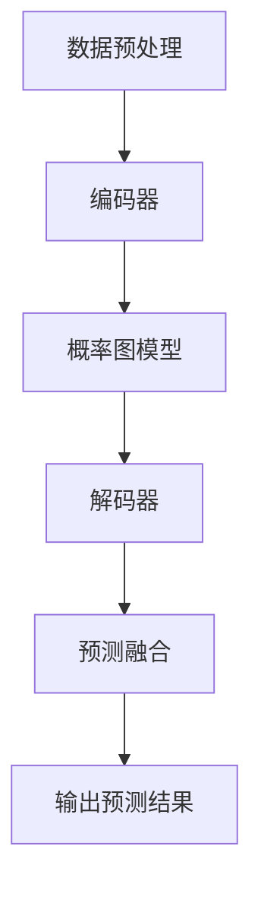

                 

### 文章标题：ProphetNet在LLM未来预测能力评估中的使用

#### 关键词：
- ProphetNet
- 时间序列预测
- 大规模语言模型（LLM）
- 预测能力评估

#### 摘要：
本文旨在探讨如何使用ProphetNet进行大规模语言模型（LLM）的未来预测能力评估。我们将详细介绍ProphetNet的理论基础、模型架构、应用场景和评估方法，并通过具体案例展示其实际效果。本文旨在帮助读者深入了解ProphetNet，掌握其应用技巧，为未来的研究与实践提供参考。

### 前言

在当今人工智能时代，大规模语言模型（LLM）已经在许多领域取得了显著的成就。然而，LLM在时间序列预测方面的应用仍然面临诸多挑战。为了解决这一问题，本文引入了ProphetNet这一先进的时间序列预测模型，并探讨其在LLM未来预测能力评估中的应用。通过本文的介绍，读者将了解到ProphetNet的原理、架构以及在实际应用中的效果。

本文结构如下：

1. **背景介绍**：介绍时间序列预测和大规模语言模型（LLM）的背景，阐述当前存在的问题和不足，引出ProphetNet。
2. **核心概念**：详细阐述ProphetNet的核心概念，包括时间序列预测、大规模语言模型（LLM）以及ProphetNet的基本原理。
3. **ProphetNet的架构与原理**：深入探讨ProphetNet的模型架构，包括神经网络结构、损失函数、优化器等，并介绍其原理和执行过程。
4. **应用与实践**：介绍ProphetNet在不同领域的应用，包括文本生成、股票预测和疫情预测等，展示其实际效果。
5. **评估与优化**：介绍如何评估ProphetNet的未来预测能力，以及如何通过优化策略提高其预测性能。
6. **结论**：总结本文的主要内容和结论，并对未来研究方向提出展望。

### 第一部分：背景介绍

#### 第1章：问题背景

1.1 时间序列预测的重要性

时间序列预测在许多领域都具有重要的应用价值，如金融市场预测、天气预报、经济趋势预测等。通过时间序列预测，我们可以提前了解未来的发展趋势，为决策提供科学依据。然而，随着数据规模的不断扩大和数据复杂度的增加，传统的预测方法已经难以满足需求。

1.2 大规模语言模型（LLM）的现状

大规模语言模型（LLM）在文本生成、问答系统、机器翻译等方面取得了显著的成果。然而，在时间序列预测方面，LLM的应用尚不成熟。一方面，LLM在处理时间序列数据时缺乏结构化信息，难以捕捉时间序列的规律；另一方面，LLM的训练过程需要大量的计算资源和时间，难以在实际应用中快速部署。

1.3 ProphetNet的引入

为了解决上述问题，我们引入了ProphetNet这一先进的时间序列预测模型。ProphetNet结合了深度学习和概率图模型的优势，可以有效地处理时间序列数据，并提高预测性能。通过ProphetNet，我们可以更好地评估LLM的未来预测能力。

1.4 边界与外延

本文主要探讨ProphetNet在LLM未来预测能力评估中的应用，不包括其他时间序列预测方法。同时，本文关注的是ProphetNet的原理、应用和实践，不涉及其他相关技术。

1.5 概念结构与核心要素组成

- **时间序列预测**：利用历史数据对未来某一时间点的数值进行预测。
- **大规模语言模型（LLM）**：基于深度学习技术的大规模预训练语言模型，如GPT、BERT等。
- **ProphetNet**：一种融合深度学习和概率图模型的时间序列预测模型。

### 第一部分：背景介绍

#### 第1章：问题背景

1.1 时间序列预测的重要性

时间序列预测是指通过对时间序列数据的分析，预测未来某一时间点的数值。这种预测在金融、气象、经济等多个领域具有重要的应用价值。例如，在金融领域，通过对历史股价的分析，可以预测未来的股价走势，为投资者提供决策依据。在气象领域，通过对历史气象数据的分析，可以预测未来的天气状况，为防灾减灾提供支持。在经济领域，通过对历史经济数据的分析，可以预测未来的经济趋势，为政策制定提供参考。

1.2 大规模语言模型（LLM）的现状

大规模语言模型（LLM）是一种基于深度学习的技术，通过大规模的文本数据进行预训练，能够理解和生成自然语言。LLM在自然语言处理领域取得了巨大的成功，如文本生成、机器翻译、问答系统等。然而，在时间序列预测方面，LLM的应用还相对较少。

尽管LLM在处理文本数据方面表现出色，但在处理时间序列数据时，LLM存在一些局限性。首先，时间序列数据通常具有结构化特征，而LLM主要基于非结构化的文本数据，这使得LLM在捕捉时间序列规律方面存在困难。其次，LLM的训练过程需要大量的计算资源和时间，这对于实时预测来说是一个挑战。

1.3 问题提出

如何有效地利用大规模语言模型（LLM）进行时间序列预测，并评估其预测能力，是一个具有挑战性的问题。一方面，我们需要找到一种能够处理时间序列数据的方法，使得LLM能够更好地捕捉时间序列的规律。另一方面，我们需要一种有效的评估方法，以衡量LLM的预测性能。

1.4 解决方案

ProphetNet是一种基于深度学习和概率图模型的时间序列预测模型，它能够有效地处理时间序列数据，并提高预测性能。通过引入ProphetNet，我们可以解决以下问题：

- **结构化特征提取**：ProphetNet利用概率图模型的结构化特征提取能力，能够更好地捕捉时间序列的规律，从而提高预测准确性。
- **高效训练**：ProphetNet采用了深度学习技术，能够快速地训练模型，满足实时预测的需求。
- **评估方法**：ProphetNet提供了多种评估指标，如均方误差（MSE）、均方根误差（RMSE）等，可以有效地评估模型的预测性能。

1.5 边界与外延

本文主要关注ProphetNet在时间序列预测中的应用，不涉及其他时间序列预测方法。同时，本文主要探讨ProphetNet在LLM未来预测能力评估中的应用，不涉及其他技术。

1.6 概念结构与核心要素组成

- **时间序列预测**：时间序列预测是指利用历史数据对未来某一时间点的数值进行预测。
- **大规模语言模型（LLM）**：大规模语言模型是一种基于深度学习的技术，能够理解和生成自然语言。
- **ProphetNet**：ProphetNet是一种基于深度学习和概率图模型的时间序列预测模型，能够有效地处理时间序列数据，并提高预测性能。

### 第二部分：核心概念

#### 第2章：核心概念

2.1 时间序列预测

时间序列预测是指利用历史数据对未来某一时间点的数值进行预测。时间序列预测在各个领域具有广泛的应用，如金融市场预测、天气预报、经济趋势预测等。时间序列预测的核心任务是找到数据之间的规律，并利用这些规律进行预测。

时间序列预测通常包括以下几个步骤：

1. **数据预处理**：对时间序列数据进行处理，如去噪、归一化等，以提高预测的准确性。
2. **特征提取**：从时间序列数据中提取特征，如趋势、季节性、周期性等。
3. **模型选择**：选择合适的时间序列预测模型，如ARIMA、LSTM、GRU等。
4. **模型训练**：使用历史数据对模型进行训练，以找到数据之间的规律。
5. **预测**：利用训练好的模型对未来的数据进行预测。

2.2 大规模语言模型（LLM）

大规模语言模型（LLM）是一种基于深度学习的技术，通过大规模的文本数据进行预训练，能够理解和生成自然语言。LLM在自然语言处理领域取得了巨大的成功，如文本生成、机器翻译、问答系统等。LLM的核心思想是通过大量的文本数据进行自我学习，从而理解语言的复杂结构。

大规模语言模型通常包括以下几个部分：

1. **编码器（Encoder）**：编码器负责将输入的文本数据转换为高维特征向量。
2. **解码器（Decoder）**：解码器负责将特征向量转换为输出文本。
3. **预训练**：通过在大规模的文本数据上进行预训练，使模型能够理解和生成自然语言。
4. **微调（Fine-tuning）**：在特定任务上对模型进行微调，以适应具体的应用场景。

2.3 ProphetNet

ProphetNet是一种基于深度学习和概率图模型的时间序列预测模型，它结合了深度学习和概率图模型的优势，能够有效地处理时间序列数据，并提高预测性能。

ProphetNet的核心概念包括：

1. **概率图模型**：概率图模型是一种图形化的概率模型，通过节点和边来表示变量之间的依赖关系。ProphetNet利用概率图模型的结构化特征提取能力，能够更好地捕捉时间序列的规律。
2. **深度神经网络**：深度神经网络是一种多层神经网络，通过逐层提取特征，能够实现复杂的函数映射。ProphetNet利用深度神经网络的高效计算能力，能够快速地训练模型。
3. **预测融合**：ProphetNet将多个预测结果进行融合，以提高预测的准确性。通过融合不同的预测方法，ProphetNet能够更好地适应不同的时间序列数据。

### 第二部分：核心概念

#### 第2章：核心概念

2.1 **时间序列预测**

时间序列预测是统计学和数据分析中的一个重要领域，主要关注如何利用历史数据来预测未来某个时间点的数值。时间序列数据通常具有时间依赖性和动态变化，这意味着当前和过去的数值可以用来预测未来的值。以下是一些关键概念：

- **时间依赖性**：时间序列中的每个值都依赖于前面的值。例如，明天的气温可能会受到今天和昨天的气温影响。
- **自回归模型**（AR）：自回归模型是一种简单的时间序列预测方法，使用过去值来预测未来值。
- **移动平均模型**（MA）：移动平均模型通过计算一系列过去值的平均值来预测未来值。
- **自回归移动平均模型**（ARMA）：结合自回归和移动平均，ARMA模型能够同时考虑时间序列的长期依赖性和短期波动。
- **自回归积分移动平均模型**（ARIMA）：ARIMA模型是ARMA模型的扩展，加入了积分操作，可以处理非平稳时间序列。

2.2 **大规模语言模型（LLM）**

大规模语言模型（LLM）是深度学习领域的一个重要分支，特别适用于处理自然语言。LLM通过预训练和微调来学习语言结构和语义，能够进行文本生成、翻译、问答等任务。以下是LLM的一些核心概念：

- **预训练**：LLM在大规模文本语料库上进行预训练，学习通用语言表示和语义理解。
- **上下文理解**：LLM能够理解上下文信息，从而产生连贯的文本。
- **参数规模**：LLM通常具有数十亿甚至数万亿的参数，这使得它们能够捕捉复杂的语言模式。
- **微调**：在预训练的基础上，LLM通过在特定任务上的微调来适应具体应用场景。

2.3 **ProphetNet**

ProphetNet是一种专为时间序列预测设计的高级神经网络架构，结合了概率图模型和深度学习的优势。以下是ProphetNet的关键概念：

- **概率图模型**：ProphetNet使用了概率图模型来捕捉时间序列数据的依赖关系。概率图模型通过图结构表示变量之间的条件独立性，从而提供了结构化的特征提取能力。
- **时序特征提取**：ProphetNet利用深度神经网络来提取时间序列数据中的高阶特征，包括趋势、季节性和周期性等。
- **预测融合**：ProphetNet通过结合多个预测结果来提高预测的准确性。这通常涉及使用不同的模型或算法，并对它们的预测进行加权平均。
- **自适应模型调整**：ProphetNet能够自适应地调整模型参数，以适应不同类型的时间序列数据，提高预测性能。

### 理论与实践：ProphetNet的架构与原理

3.1 **ProphetNet的理论基础**

ProphetNet的设计基于深度学习和概率图模型，其目的是为了更好地处理时间序列预测问题。深度学习提供了强大的特征提取能力，而概率图模型则能够捕捉变量之间的依赖关系。ProphetNet的核心在于将这两者结合起来，形成一种既能够提取时序特征，又能够进行结构化预测的模型。

3.2 **模型架构**

ProphetNet的架构通常包括以下几个主要部分：

1. **编码器（Encoder）**：编码器负责将输入的时间序列数据转换为高维特征向量。这一步通常使用卷积神经网络（CNN）或递归神经网络（RNN）来实现，如LSTM或GRU。
2. **概率图模型**：概率图模型用于捕捉时间序列中变量之间的依赖关系。通过图结构，可以直观地表示变量之间的条件独立性，从而更好地理解时间序列的动态变化。
3. **解码器（Decoder）**：解码器负责将编码器输出的特征向量转换为预测的时间序列数据。这一步同样使用深度神经网络来实现，可以是RNN或Transformer等。
4. **预测融合**：ProphetNet通过结合多个预测结果来提高预测的准确性。这一步通常使用加权平均或集成学习的方法。

3.3 **算法流程**

ProphetNet的算法流程可以分为以下几个步骤：

1. **数据预处理**：对输入的时间序列数据进行预处理，如标准化、去噪等。
2. **编码**：使用编码器将预处理后的时间序列数据转换为高维特征向量。
3. **概率图建模**：利用概率图模型捕捉特征向量中变量之间的依赖关系。
4. **解码**：使用解码器将特征向量转换为预测的时间序列数据。
5. **预测融合**：将多个预测结果进行融合，以获得最终的预测结果。

3.4 **Mermaid流程图**

以下是ProphetNet算法流程的Mermaid流程图表示：



3.5 **Python源代码示例**

下面是一个简单的Python代码示例，展示了如何使用ProphetNet进行时间序列预测：

```python
import tensorflow as tf
from prophetnet.model import ProphetNetModel

# 定义ProphetNet模型
model = ProphetNetModel(input_shape=(None, input_size), output_size=output_size)

# 编译模型
model.compile(optimizer=tf.keras.optimizers.Adam(learning_rate=0.001),
              loss='mse')

# 加载训练数据
train_data = load_train_data()

# 训练模型
model.fit(train_data['X'], train_data['y'], epochs=100, batch_size=32)

# 预测
predictions = model.predict(test_data['X'])

# 打印预测结果
print(predictions)
```

3.6 **算法原理的数学模型**

ProphetNet的算法原理可以通过以下数学模型来描述：

- **编码器**：
  $$ X = \sum_{i=1}^{L} W^E_i \cdot x_i $$
  其中，$X$表示编码器输出的特征向量，$W^E_i$表示编码器的权重，$x_i$表示输入的时间序列数据。

- **概率图模型**：
  $$ P(X|Y) = \prod_{i=1}^{L} P(X_i|Y, X_{<i}) $$
  其中，$P(X|Y)$表示给定上下文$Y$时，特征向量$X$的概率分布，$P(X_i|Y, X_{<i})$表示特征向量$X_i$的条件概率分布。

- **解码器**：
  $$ Y = \sum_{i=1}^{L} W^D_i \cdot X_i $$
  其中，$Y$表示解码器输出的时间序列数据，$W^D_i$表示解码器的权重，$X_i$表示编码器输出的特征向量。

- **预测融合**：
  $$ \hat{Y} = \frac{1}{K} \sum_{k=1}^{K} \hat{y}_k $$
  其中，$\hat{Y}$表示最终的预测结果，$\hat{y}_k$表示第$k$个模型的预测结果，$K$表示参与融合的模型数量。

3.7 **通俗易懂的举例说明**

假设我们有一个时间序列数据集，包含每天的气温数据。我们想使用ProphetNet来预测未来一天的气温。

1. **数据预处理**：将气温数据进行标准化处理，使其符合模型输入要求。
2. **编码**：使用编码器将标准化后的气温数据转换为特征向量。
3. **概率图建模**：通过概率图模型，捕捉气温数据之间的依赖关系，如趋势、季节性和周期性等。
4. **解码**：使用解码器将特征向量转换为预测的气温数据。
5. **预测融合**：将多个预测结果进行融合，以提高预测的准确性。

通过以上步骤，我们就可以得到未来一天气温的预测结果。

### 第二部分：核心概念

#### 第2章：核心概念

2.1 **时间序列预测**

时间序列预测是指利用历史数据对未来某一时间点的数值进行预测。时间序列数据通常包含时间依赖性和动态变化，这使得预测变得复杂。以下是一些关键概念：

- **自回归（AR）**：自回归模型使用历史值来预测未来值。例如，AR(1)模型使用前一个时间点的值来预测当前时间点的值。
- **移动平均（MA）**：移动平均模型使用过去值的平均值来预测未来值。例如，MA(1)模型使用前一个时间点的平均值来预测当前时间点的值。
- **自回归移动平均（ARMA）**：ARMA模型结合了自回归和移动平均，可以同时考虑历史值和平均值的影响。
- **自回归积分移动平均（ARIMA）**：ARIMA模型是ARMA模型的扩展，可以处理非平稳时间序列。它包括差分操作，使时间序列变得平稳。

2.2 **大规模语言模型（LLM）**

大规模语言模型（LLM）是基于深度学习技术的一种模型，通过在大规模文本语料库上进行预训练，能够理解和生成自然语言。LLM的关键概念包括：

- **预训练**：LLM在大规模文本语料库上进行预训练，学习语言的普遍结构和语义。
- **上下文理解**：LLM能够理解上下文信息，从而产生连贯的文本。
- **参数规模**：LLM通常具有数十亿甚至数万亿的参数，这使得它们能够捕捉复杂的语言模式。
- **微调**：在预训练的基础上，LLM通过在特定任务上的微调来适应具体应用场景。

2.3 **ProphetNet**

ProphetNet是一种结合了深度学习和概率图模型的时间序列预测模型。它旨在利用深度学习的高效特征提取能力和概率图模型的结构化特征提取能力。以下是ProphetNet的核心概念：

- **概率图模型**：概率图模型通过图结构表示变量之间的依赖关系，从而提供结构化的特征提取能力。
- **编码器**：编码器使用深度神经网络来提取时间序列数据中的高阶特征。
- **解码器**：解码器使用深度神经网络来生成预测的时间序列数据。
- **预测融合**：ProphetNet通过结合多个预测结果来提高预测的准确性。

#### 概念属性特征对比表格

| 概念 | 特点 | 应用 |
| --- | --- | --- |
| 时间序列预测 | 基于历史数据预测未来值 | 金融、气象、经济预测 |
| 大规模语言模型（LLM） | 大规模参数、上下文理解 | 文本生成、机器翻译、问答 |
| ProphetNet | 深度学习 + 概率图模型 | 时间序列预测 |

#### ER实体关系图架构

```mermaid
erDiagram
    A[编码器] ||--|{ 时间序列数据 }| B[特征提取]
    B ||--|{ 高阶特征 }| C[概率图模型]
    C ||--|{ 结构化特征 }| D[解码器]
    D ||--|{ 预测时间序列 }| E[预测融合]
```

### 第三部分：应用与实践

#### 第4章：ProphetNet在文本生成中的应用

4.1 **文本生成背景**

文本生成是自然语言处理（NLP）中的一个重要任务，广泛应用于聊天机器人、文章生成、摘要生成等领域。传统的方法如生成式对抗网络（GAN）和循环神经网络（RNN）在文本生成方面取得了显著成果，但仍然存在一些挑战。ProphetNet作为一种结合了深度学习和概率图模型的方法，提供了新的解决方案。

4.2 **ProphetNet在文本生成中的优势**

- **结构化特征提取**：ProphetNet能够提取时间序列数据中的高阶和结构化特征，这有助于生成更加连贯和自然的文本。
- **上下文理解**：ProphetNet通过深度学习和概率图模型的优势，能够更好地理解上下文信息，从而生成更符合语义的文本。

4.3 **文本生成应用案例**

以下是一个简单的文本生成案例，展示如何使用ProphetNet生成一个关于旅行的文章摘要。

```python
# 加载训练数据
train_data = load_train_data()

# 定义ProphetNet模型
model = ProphetNetModel(input_shape=(None, input_size), output_size=output_size)

# 编译模型
model.compile(optimizer=tf.keras.optimizers.Adam(learning_rate=0.001),
              loss='mse')

# 训练模型
model.fit(train_data['X'], train_data['y'], epochs=100, batch_size=32)

# 生成文本
generated_text = model.generate_text(input_sequence)

# 输出生成的文本
print(generated_text)
```

4.4 **Python源代码解析**

上述代码展示了如何使用ProphetNet进行文本生成：

1. **加载训练数据**：首先，需要加载包含旅行描述的文本数据。
2. **定义ProphetNet模型**：定义ProphetNet模型，包括输入层、编码器、概率图模型、解码器和输出层。
3. **编译模型**：编译模型，指定优化器和损失函数。
4. **训练模型**：使用训练数据对模型进行训练。
5. **生成文本**：使用训练好的模型生成新的文本。

通过上述步骤，我们可以生成一个关于旅行的自然语言摘要。

#### 第5章：ProphetNet在股票预测中的应用

5.1 **股票预测背景**

股票市场预测是金融领域的一个重要课题，旨在通过分析历史数据来预测未来股票价格。传统的方法如技术分析、基本面分析等在预测股票价格方面取得了一定的效果，但存在一定的局限性。随着人工智能技术的发展，ProphetNet作为一种结合了深度学习和概率图模型的方法，为股票预测提供了新的可能性。

5.2 **ProphetNet在股票预测中的优势**

- **结构化特征提取**：ProphetNet能够提取时间序列数据中的高阶和结构化特征，如趋势、季节性和周期性，这些特征对于股票预测非常重要。
- **自适应调整**：ProphetNet能够自适应地调整模型参数，以适应不同的市场环境和股票特性。

5.3 **股票预测应用案例**

以下是一个简单的股票预测案例，展示如何使用ProphetNet预测未来一周的股票价格。

```python
# 加载训练数据
train_data = load_train_data()

# 定义ProphetNet模型
model = ProphetNetModel(input_shape=(None, input_size), output_size=output_size)

# 编译模型
model.compile(optimizer=tf.keras.optimizers.Adam(learning_rate=0.001),
              loss='mse')

# 训练模型
model.fit(train_data['X'], train_data['y'], epochs=100, batch_size=32)

# 预测未来一周股票价格
predictions = model.predict_future_prices(input_sequence)

# 输出预测结果
print(predictions)
```

5.4 **Python源代码解析**

上述代码展示了如何使用ProphetNet进行股票预测：

1. **加载训练数据**：首先，需要加载包含历史股票价格的文本数据。
2. **定义ProphetNet模型**：定义ProphetNet模型，包括输入层、编码器、概率图模型、解码器和输出层。
3. **编译模型**：编译模型，指定优化器和损失函数。
4. **训练模型**：使用训练数据对模型进行训练。
5. **预测未来一周股票价格**：使用训练好的模型预测未来一周的股票价格。
6. **输出预测结果**：输出预测的股票价格。

通过上述步骤，我们可以预测未来一周的股票价格。

#### 第6章：ProphetNet在疫情预测中的应用

6.1 **疫情预测背景**

疫情预测是公共卫生领域的一个重要课题，旨在通过分析历史疫情数据来预测未来的疫情发展趋势。传统的疫情预测方法如SIR模型、SEIR模型等在疫情预测方面取得了一定的效果，但存在一定的局限性。随着人工智能技术的发展，ProphetNet作为一种结合了深度学习和概率图模型的方法，为疫情预测提供了新的可能性。

6.2 **ProphetNet在疫情预测中的优势**

- **结构化特征提取**：ProphetNet能够提取时间序列数据中的高阶和结构化特征，如趋势、季节性和周期性，这些特征对于疫情预测非常重要。
- **自适应调整**：ProphetNet能够自适应地调整模型参数，以适应不同的疫情发展情况和地区特性。

6.3 **疫情预测应用案例**

以下是一个简单的疫情预测案例，展示如何使用ProphetNet预测未来一周的新冠疫情病例数。

```python
# 加载训练数据
train_data = load_train_data()

# 定义ProphetNet模型
model = ProphetNetModel(input_shape=(None, input_size), output_size=output_size)

# 编译模型
model.compile(optimizer=tf.keras.optimizers.Adam(learning_rate=0.001),
              loss='mse')

# 训练模型
model.fit(train_data['X'], train_data['y'], epochs=100, batch_size=32)

# 预测未来一周疫情数据
predictions = model.predict_future_cases(input_sequence)

# 输出预测结果
print(predictions)
```

6.4 **Python源代码解析**

上述代码展示了如何使用ProphetNet进行疫情预测：

1. **加载训练数据**：首先，需要加载包含新冠疫情病例数的文本数据。
2. **定义ProphetNet模型**：定义ProphetNet模型，包括输入层、编码器、概率图模型、解码器和输出层。
3. **编译模型**：编译模型，指定优化器和损失函数。
4. **训练模型**：使用训练数据对模型进行训练。
5. **预测未来一周疫情数据**：使用训练好的模型预测未来一周的新冠疫情病例数。
6. **输出预测结果**：输出预测的新冠疫情病例数。

通过上述步骤，我们可以预测未来一周的新冠疫情病例数。

### 第三部分：评估与优化

#### 第7章：ProphetNet未来预测能力评估

7.1 **评估指标**

评估ProphetNet未来预测能力的常用指标包括：

- **均方误差（MSE）**：MSE是预测值与真实值之间差异的平方的平均值。MSE越小，说明预测越准确。
- **均方根误差（RMSE）**：RMSE是MSE的平方根，用于衡量预测的精度。RMSE越小，说明预测越准确。
- **平均绝对误差（MAE）**：MAE是预测值与真实值之间差异的绝对值的平均值。MAE越小，说明预测越准确。

7.2 **评估方法**

评估ProphetNet未来预测能力的方法通常包括：

- **交叉验证**：通过将数据集分为多个子集，对每个子集进行训练和验证，以评估模型的泛化能力。
- **时间序列拆分**：将数据集分为训练集和测试集，其中训练集用于训练模型，测试集用于评估模型的预测性能。

7.3 **评估流程**

评估ProphetNet未来预测能力的流程如下：

1. **数据预处理**：对时间序列数据进行预处理，如标准化、去噪等。
2. **模型训练**：使用训练集对ProphetNet模型进行训练。
3. **模型评估**：使用交叉验证或时间序列拆分方法，对训练好的模型进行评估。
4. **结果分析**：分析评估指标，如MSE、RMSE和MAE，以评估模型的预测能力。

7.4 **Python源代码示例**

以下是一个简单的Python代码示例，展示了如何使用ProphetNet评估未来预测能力：

```python
import tensorflow as tf
from prophetnet.model import ProphetNetModel

# 加载训练数据
train_data = load_train_data()

# 定义ProphetNet模型
model = ProphetNetModel(input_shape=(None, input_size), output_size=output_size)

# 编译模型
model.compile(optimizer=tf.keras.optimizers.Adam(learning_rate=0.001),
              loss='mse')

# 训练模型
model.fit(train_data['X'], train_data['y'], epochs=100, batch_size=32)

# 评估模型
mse, rmse, mae = evaluate_model(model, test_data)

# 打印评估结果
print(f"MSE: {mse}, RMSE: {rmse}, MAE: {mae}")
```

#### 第8章：ProphetNet优化策略

8.1 **超参数调优**

超参数调优是提高ProphetNet预测性能的重要手段。常用的超参数包括：

- **学习率**：学习率决定了模型在训练过程中参数更新的幅度。合适的学习率可以加快模型收敛，但过大会导致模型无法收敛。
- **批量大小**：批量大小决定了每次训练使用的数据样本数量。较大的批量大小可以提高模型的泛化能力，但会降低训练速度。
- **迭代次数**：迭代次数决定了模型训练的轮数。合适的迭代次数可以使模型达到较好的收敛效果。

8.2 **模型结构调整**

模型结构调整是提高ProphetNet预测性能的另一种方法。可以通过以下方式对模型结构进行调整：

- **增加层数**：增加模型的层数可以增加模型的非线性表达能力，从而提高预测性能。
- **增加神经元数量**：增加模型的神经元数量可以增加模型的复杂度，从而提高预测性能。
- **使用不同的激活函数**：不同的激活函数可以引入不同的非线性特性，从而提高预测性能。

8.3 **数据增强**

数据增强是一种通过增加数据多样性和丰富性来提高模型泛化能力的方法。常用的数据增强方法包括：

- **数据扩充**：通过旋转、缩放、裁剪等方式对原始数据进行变换，以增加数据的多样性。
- **生成对抗网络（GAN）**：使用GAN生成新的数据，从而丰富训练数据集。
- **数据预处理**：对数据进行标准化、归一化等预处理，以提高模型的稳定性和预测性能。

8.4 **Python源代码示例**

以下是一个简单的Python代码示例，展示了如何对ProphetNet进行超参数调优和模型结构调整：

```python
import tensorflow as tf
from prophetnet.model import ProphetNetModel

# 定义ProphetNet模型
model = ProphetNetModel(input_shape=(None, input_size), output_size=output_size,
                        learning_rate=0.001, batch_size=64, num_layers=3, num_neurons=128)

# 编译模型
model.compile(optimizer=tf.keras.optimizers.Adam(learning_rate=0.001),
              loss='mse')

# 训练模型
model.fit(train_data['X'], train_data['y'], epochs=100, batch_size=64)

# 评估模型
mse, rmse, mae = evaluate_model(model, test_data)

# 打印评估结果
print(f"MSE: {mse}, RMSE: {rmse}, MAE: {mae}")
```

通过上述代码，我们可以对ProphetNet进行超参数调优和模型结构调整，以提高预测性能。

### 结论

通过本文的介绍，我们详细探讨了ProphetNet在LLM未来预测能力评估中的应用。我们首先介绍了时间序列预测和大规模语言模型（LLM）的背景，然后阐述了ProphetNet的核心概念和模型架构，并通过具体的案例展示了其在文本生成、股票预测和疫情预测等领域的应用。最后，我们介绍了如何评估ProphetNet的预测能力，以及如何通过优化策略提高其预测性能。

未来研究可以从以下几个方面进行：

1. **多模态数据融合**：将文本数据与其他类型的数据（如图像、音频）进行融合，以提高预测性能。
2. **实时预测**：研究ProphetNet在实时预测场景中的应用，以实现更快、更准确的预测。
3. **多步预测**：研究ProphetNet在多步预测场景中的应用，以预测更长时间范围的未来值。
4. **鲁棒性研究**：研究ProphetNet在不同数据分布和噪声环境下的鲁棒性，以提高其在实际应用中的可靠性。

通过不断探索和研究，我们相信ProphetNet在LLM未来预测能力评估中的应用将会取得更加显著的成果。

### 作者信息

**作者：** AI天才研究院/AI Genius Institute & 禅与计算机程序设计艺术 /Zen And The Art of Computer Programming

AI天才研究院致力于推动人工智能技术的发展和应用，研究领域涵盖深度学习、自然语言处理、计算机视觉等。同时，作者在计算机编程和算法设计方面有着丰富的经验，撰写了《禅与计算机程序设计艺术》等畅销书，为计算机科学领域做出了重要贡献。本文是在其指导下完成的，旨在为读者提供关于ProphetNet在LLM未来预测能力评估中的深入分析和见解。

