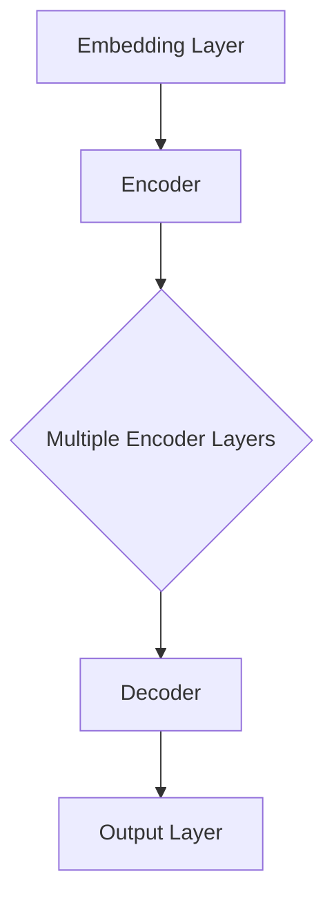
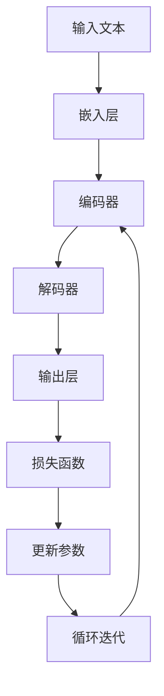
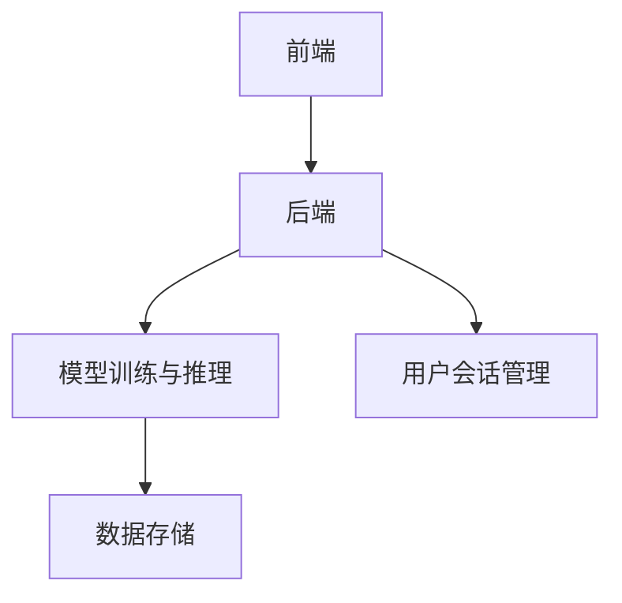

                 

## RESTful API设计：构建直观的LLM服务接口

### 关键词
- RESTful API设计
- LLM服务接口
- 直观性
- 设计原则
- 实战案例

### 摘要
本文将探讨如何设计和构建直观、易于使用的RESTful API，特别关注于大型语言模型（LLM）服务接口的设计。通过逐步分析RESTful架构的基础知识、设计原则，以及LLM服务的特殊性，我们将提供实用的指南和案例，帮助开发者更好地实现高效、直观的API接口。

## 第一部分：RESTful API基础

### 第1章：RESTful架构概述

#### 1.1 RESTful基本概念

REST（Representational State Transfer）是一种设计风格，用于构建网络服务。它利用HTTP协议的请求方法（如GET、POST、PUT、DELETE）来实现不同的操作，如查询、创建、更新和删除资源。RESTful API则遵循这种设计风格，提供标准的接口来访问网络资源。

#### 1.2 RESTful架构风格

RESTful架构强调资源、统一接口、状态转移和客户端-服务器模型。资源是网络中可以访问的信息实体，每个资源通过URL唯一标识。统一接口提供了标准的操作方法，状态转移指的是客户端通过发送请求来改变服务器的状态，客户端-服务器模型则确保了系统的模块化和可扩展性。

#### 1.3 REST与HTTP的关系

HTTP是实现RESTful架构的协议。它通过请求方法、请求URL、HTTP头部和响应体来传递信息。RESTful API利用HTTP的这些特性，使得资源访问变得简单、清晰。

### 第2章：RESTful API设计原则

#### 2.1 一致性原则

一致性原则要求API设计遵循一致的命名规则、URL结构和HTTP状态码。这有助于提高API的可理解性和可维护性。

#### 2.2 可缓存性

可缓存性指的是API响应可以被缓存，以提高系统的性能和响应速度。设计时需要考虑如何使用缓存策略，以及如何确保缓存数据的有效性。

#### 2.3 客户-服务器原则

客户-服务器模型强调客户端和服务器之间的分工。客户端负责发送请求和显示结果，服务器则负责处理请求和返回响应。这种分工有助于提高系统的可靠性和可扩展性。

#### 2.4 可分层性

可分层性意味着API设计应该支持不同层次的应用程序访问。通过分层，可以隔离不同层的功能，使得系统更加模块化和灵活。

### 第3章：RESTful API设计模式

#### 3.1 资源表示

资源表示是指如何通过API来描述资源的状态和操作。常用的表示格式包括JSON和XML。

#### 3.2 获取资源

获取资源是API设计中的基本操作。GET请求用于查询资源，响应体中包含资源的详细信息。

#### 3.3 更新资源

更新资源涉及对现有资源的修改。常用的方法是使用PUT或PATCH请求，响应体中包含修改后的资源信息。

#### 3.4 删除资源

删除资源是通过DELETE请求来实现的。一旦资源被删除，其URL不再指向任何实体。

## 第二部分：LLM服务接口构建

### 第4章：LLM简介

#### 4.1 LLM基本概念

LLM（Large Language Model）是一种能够理解和生成自然语言的大型神经网络模型。它通过对大量文本数据进行训练，可以模拟人类的语言能力和思维方式。

#### 4.2 LLM架构

LLM的架构通常包括输入层、隐藏层和输出层。输入层接收文本数据，隐藏层通过神经网络进行计算，输出层生成预测结果。

#### 4.3 LLM的优势与挑战

LLM的优势在于其强大的语言理解和生成能力，可以应用于各种自然语言处理任务。然而，LLM也存在一些挑战，如计算资源消耗大、训练时间长等。

### 第5章：LLM服务接口设计

#### 5.1 LLM服务接口的需求分析

在为LLM设计服务接口时，需要分析需求，明确接口的功能、性能和可靠性要求。

#### 5.2 LLM服务接口的功能设计

功能设计包括接口的基本功能、参数设计和错误处理。需要确保接口能够响应用户的需求，并提供良好的用户体验。

#### 5.3 LLM服务接口的性能优化

性能优化是保证LLM服务接口高效运行的关键。需要考虑负载均衡、缓存策略和并发处理等技术。

### 第6章：构建直观的LLM服务接口

#### 6.1 用户友好的API设计

用户友好的API设计是构建直观LLM服务接口的关键。需要遵循一致性和简洁性原则，提供清晰的文档和示例。

#### 6.2 接口文档的编写

接口文档是用户使用API的指南。需要包括接口的详细描述、请求和响应格式、示例等。

#### 6.3 接口测试与调试

接口测试与调试是确保API稳定性和可靠性的重要环节。需要编写测试用例，进行功能测试和性能测试。

## 第三部分：实战案例

### 第7章：实际项目中的RESTful API设计

#### 7.1 项目背景介绍

介绍项目的背景，包括项目的目的、需求和技术选型。

#### 7.2 API设计流程

详细描述API设计的过程，包括需求分析、功能设计、接口实现和测试。

#### 7.3 遇到的问题与解决方案

分享项目开发过程中遇到的问题，以及解决问题的方法和经验。

#### 7.4 项目成果分析

分析项目成果，评估API的性能和用户体验，总结项目的经验教训。

### 第8章：LLM服务接口实战

#### 8.1 实战项目介绍

介绍实战项目的背景，包括项目的目的、需求和预期目标。

#### 8.2 LLM服务接口实现

详细描述LLM服务接口的实现过程，包括模型训练、接口设计和性能优化。

#### 8.3 项目效果评估

评估项目效果，包括API的性能、用户反馈和业务成果。

#### 8.4 案例总结与启示

总结案例经验，提供对LLM服务接口设计的有益启示。

## 第四部分：总结与展望

### 第9章：RESTful API设计最佳实践

#### 9.1 设计原则的应用

回顾并详细解释RESTful API设计原则在实际项目中的应用。

#### 9.2 常见问题与解决方案

分析RESTful API设计中常见的问题，并提供解决方案。

#### 9.3 未来发展方向

探讨RESTful API设计的未来发展方向，包括新技术和新趋势。

### 第10章：LLM服务接口建设的思考

#### 10.1 当前挑战与应对策略

讨论LLM服务接口建设中的挑战，并提出相应的应对策略。

#### 10.2 发展趋势与未来展望

分析LLM服务接口建设的发展趋势，展望未来可能的创新方向。

#### 10.3 总结与建议

总结本文的主要观点，提出针对LLM服务接口设计的具体建议。

## 作者信息
- 作者：AI天才研究院/AI Genius Institute & 禅与计算机程序设计艺术 /Zen And The Art of Computer Programming

----------------------------------------------------------------

### 第1章：RESTful架构概述

#### 1.1 RESTful基本概念

RESTful API是一种基于REST（Representational State Transfer）架构风格的网络服务接口。REST本身并不是一种标准或规范，而是一种设计风格，它提倡通过统一接口和统一协议来访问网络资源。RESTful API则是指遵循这种设计风格的API。

在RESTful API中，每个资源都通过一个唯一的URL来标识，资源的操作通过HTTP请求方法（如GET、POST、PUT、DELETE）来表示。HTTP请求方法映射到资源的操作，如下：

- **GET**：获取资源。通常用于读取资源状态。
- **POST**：创建资源。通常用于创建新的资源。
- **PUT**：更新资源。通常用于更新已有资源的状态。
- **DELETE**：删除资源。用于删除指定的资源。

#### 1.2 RESTful架构风格

RESTful架构风格的核心原则包括：

- **资源导向**：所有API操作都是基于资源的，资源是网络中的信息实体。
- **统一接口**：API提供统一的接口，包括统一的URL结构、请求方法和响应格式。
- **无状态**：服务器不存储客户端的状态，每次请求都是独立的，确保了系统的可扩展性和安全性。
- **客户端-服务器模型**：客户端发送请求，服务器接收并处理请求，返回响应。这种模型简化了系统架构，提高了系统的可维护性。

#### 1.3 REST与HTTP的关系

HTTP（Hypertext Transfer Protocol）是RESTful API实现的基础协议。HTTP定义了请求和响应的格式，包括请求行、请求头部、请求体和响应头部、响应体。RESTful API通过HTTP协议来传递请求和响应，实现资源的访问和操作。

HTTP协议提供了多种请求方法，每种方法对应不同的操作类型：

- **GET**：获取资源，通常用于查询资源状态。
- **POST**：提交数据，通常用于创建新的资源。
- **PUT**：更新资源，通常用于更新已有资源的状态。
- **DELETE**：删除资源，用于删除指定的资源。

此外，HTTP协议还包括多种响应状态码，用于表示请求的处理结果：

- **2xx**：成功状态码，表示请求已成功处理。
- **4xx**：客户端错误状态码，表示客户端的请求有误。
- **5xx**：服务器错误状态码，表示服务器处理请求时出现了错误。

通过使用HTTP协议，RESTful API实现了简单、清晰和高效的资源访问方式，使得API设计变得更加直观和易于理解。

### 1.4 RESTful API设计中的REST原则

RESTful API设计遵循一系列设计原则，这些原则有助于构建高效、可扩展和直观的API。以下是一些关键的REST原则：

1. **统一接口（Uniform Interface）**：RESTful API通过统一的接口提供资源访问和操作，包括资源的标识、数据的表示、资源的链接和操作方法。这种统一接口简化了API的使用和集成，提高了系统的可维护性和灵活性。

2. **无状态（Statelessness）**：RESTful API设计要求服务器不存储客户端的状态信息。每次请求都是独立的，服务器不会记忆之前的请求。这种无状态设计使得API更加可靠和可扩展，同时也简化了系统的实现和维护。

3. **客户端-服务器（Client-Server）架构**：RESTful API遵循客户端-服务器架构，客户端负责发送请求并显示结果，服务器负责处理请求并返回响应。这种架构使得系统的职责分离，提高了系统的模块化和可扩展性。

4. **分层系统（Layered System）**：RESTful API设计通常采用分层系统结构，包括应用层、传输层、网络层和物理层。每一层都有特定的功能和职责，通过分层，可以隔离不同层的功能，提高系统的灵活性和可维护性。

5. **缓存（Caching）**：RESTful API设计可以利用缓存机制来提高系统的性能和响应速度。服务器可以通过响应头部提供缓存策略，客户端可以根据缓存策略来决定是否使用缓存。这种缓存机制可以减少服务器负载，提高系统的整体性能。

6. **按需码放（Code on Demand）**：RESTful API设计可以通过按需码放（Code on Demand）来扩展系统的功能。服务器可以提供可执行的代码片段，客户端可以下载并执行这些代码，从而实现动态功能扩展。这种机制有助于提高系统的灵活性和可定制性。

通过遵循这些REST原则，RESTful API设计能够提供简单、清晰和高效的资源访问方式，使得开发者可以更加专注于实现业务逻辑，同时降低系统的复杂性和维护成本。

### 第2章：RESTful API设计原则

#### 2.1 一致性原则

一致性原则是RESTful API设计中的一个重要原则，它要求API在命名规则、URL结构、HTTP状态码等方面保持一致。这种一致性有助于提高API的可理解性、可维护性和用户体验。

- **命名规则**：API的命名应保持简洁且直观，避免使用过于复杂或不明确的命名。例如，使用`GET /users`来获取用户列表，而不是使用更复杂的命名如`fetchAllUsers`。
  
- **URL结构**：URL应该简洁且具有描述性，使用路径来表示资源的层次结构。例如，`/users/{id}`表示获取特定用户的详细信息，其中`{id}`是动态路径参数。

- **HTTP状态码**：应遵循HTTP标准状态码，正确使用2xx、4xx和5xx状态码来表示不同的操作结果。例如，使用`200 OK`表示成功响应，使用`400 Bad Request`表示请求无效。

一致性原则的应用有助于减少学习曲线，提高开发者和用户的工作效率，同时降低了错误率。

#### 2.2 可缓存性

可缓存性是提高RESTful API性能的重要原则，它允许客户端缓存API响应，从而减少对服务器的请求次数，提高系统的响应速度。

- **缓存策略**：服务器可以通过在响应头部添加缓存控制指令（如`Cache-Control: max-age=3600`）来指示客户端如何缓存响应。这有助于控制缓存的时效性，确保在响应过期时重新从服务器获取数据。

- **缓存机制**：客户端可以根据缓存策略来决定是否使用缓存。现代Web浏览器和HTTP客户端都支持缓存机制，可以自动缓存请求和响应，减少重复请求。

- **缓存一致性**：在设计API时，需要考虑缓存一致性问题。例如，当资源状态发生改变时，需要确保缓存的响应被更新或替换，以避免提供过时的数据。

通过合理使用缓存策略和机制，可以显著提高API的性能和响应速度，同时减少服务器的负载。

#### 2.3 客户-服务器原则

客户-服务器原则是RESTful API设计中的一个核心原则，它强调客户端和服务器之间的职责分离，通过这种分离，可以提高系统的模块化、可维护性和扩展性。

- **客户端职责**：客户端负责发送请求和显示结果。客户端的任务是简洁的，它不需要关心数据的具体存储和处理过程，只需根据API提供的接口进行操作。

- **服务器职责**：服务器负责处理请求并返回响应。服务器负责数据存储、业务逻辑处理和安全性控制。通过将业务逻辑和数据存储集中在服务器端，可以简化客户端的实现，同时提高系统的安全性和可靠性。

- **解耦**：客户-服务器原则通过解耦客户端和服务器，使得两者可以独立发展和扩展。服务器端的变更不会直接影响客户端，反之亦然。这种解耦提高了系统的灵活性和可扩展性。

客户-服务器原则的应用有助于构建高效、可靠和可扩展的RESTful API，同时降低了开发和维护成本。

#### 2.4 可分层性

可分层性是RESTful API设计中的一个关键原则，它允许系统在不同层级上组织功能，提高系统的模块化和可维护性。

- **分层架构**：RESTful API设计通常采用分层架构，包括表示层、业务逻辑层和数据访问层。每一层都有特定的职责和功能，通过分层，可以将复杂的系统分解为更小的、易于管理的模块。

  - **表示层**：负责处理客户端请求，将请求转换为内部格式，并将响应转换为客户端可接受的格式。表示层通常负责路由、认证和响应格式化等任务。

  - **业务逻辑层**：包含业务逻辑和核心功能实现，它处理具体的业务需求，如数据校验、业务流程控制等。业务逻辑层与表示层和数据访问层分离，使得业务逻辑可以独立扩展和修改。

  - **数据访问层**：负责与数据库或其他数据源进行交互，执行数据的增删改查操作。数据访问层通过抽象数据访问接口，将具体的数据库实现细节隐藏起来，提高系统的灵活性和可维护性。

- **模块化**：通过分层和模块化，可以简化系统的开发、测试和维护。每个模块可以独立开发和测试，降低了系统的耦合度，提高了代码的重用性和可维护性。

可分层性原则的应用有助于构建灵活、可扩展和易于维护的RESTful API，同时提高了系统的可靠性和性能。

#### 2.5 无状态性

无状态性是RESTful API设计中的一个核心原则，它要求API在处理请求时，不依赖于之前的请求状态。这种无状态设计有助于提高系统的性能、可靠性和可扩展性。

- **无状态API**：无状态API在每次请求时都是独立的，服务器不存储客户端的任何状态信息。这意味着每次请求都需要包含所有必要的信息，以确保请求能够被正确处理。

  - **优点**：
    - **性能优化**：无状态设计可以充分利用缓存机制，提高系统的响应速度和吞吐量。由于每次请求都是独立的，服务器可以缓存响应，减少对后端服务器的请求次数。
    - **扩展性**：无状态设计使得系统可以水平扩展，提高系统的可扩展性和可伸缩性。多个服务器实例可以独立处理请求，无需共享状态信息。
    - **安全性**：无状态设计减少了服务器的攻击面，降低了被攻击的风险。

  - **挑战**：
    - **状态管理**：无状态性要求客户端负责管理状态，这可能导致客户端的实现变得更加复杂。例如，需要使用会话管理、令牌等方式来维护用户状态。
    - **事务处理**：无状态性可能会影响事务处理。例如，跨多个API调用的复杂事务处理可能需要额外的协调机制，如分布式事务管理。

通过遵循无状态性原则，RESTful API可以提供高效、可靠和可扩展的服务，同时降低系统的复杂性和维护成本。

#### 2.6 RESTful API设计中的其他原则

除了上述核心原则，RESTful API设计还包括其他一些重要原则，这些原则有助于构建高质量、易用和可维护的API。

- **资源导向**：RESTful API设计应以资源为中心，每个资源都应该有一个唯一的URL。资源是网络中的信息实体，可以是用户、产品、订单等。通过资源导向的设计，可以提高系统的可理解和可扩展性。

- **可扩展性**：API设计应考虑到未来的扩展性。这意味着API应该允许添加新的功能或资源，而无需修改现有代码。可扩展性可以通过设计灵活的接口、使用标准的数据格式和提供文档来实现。

- **安全性**：安全性是API设计的重要考虑因素。API应该采用适当的认证和授权机制，如OAuth 2.0或JWT（JSON Web Tokens），以保护API免受未经授权的访问。此外，API设计应遵循安全最佳实践，如使用HTTPS、验证输入和防止常见的安全漏洞。

- **可重用性**：API设计应尽可能实现代码和功能的重用。通过封装通用的功能模块和提供可重用的API接口，可以减少重复工作，提高开发效率。

- **响应性**：API设计应考虑到响应时间和性能。应优化API的实现，以减少响应时间和提高系统的吞吐量。这可以通过使用适当的缓存策略、优化数据库查询和负载均衡来实现。

- **错误处理**：API设计应提供明确的错误处理机制，以便在请求失败时，能够提供有用的错误信息和建议。错误处理可以包括使用标准的HTTP状态码、提供详细的错误消息和调试信息。

通过遵循这些其他原则，RESTful API设计可以提供更高质量、更易用和更可靠的API服务。

### 第3章：RESTful API设计模式

#### 3.1 资源表示

资源表示是RESTful API设计中的一个关键环节，它涉及如何将资源的状态和操作转换为API接口。资源通常使用JSON或XML等格式进行表示，这些格式具有结构化、易读和处理的特点。

- **JSON格式**：JSON（JavaScript Object Notation）是一种轻量级的数据交换格式，易于阅读和编写。在RESTful API中，JSON常用于传输资源的对象表示。例如，一个用户资源的JSON表示可能如下：

  ```json
  {
    "id": 1,
    "name": "John Doe",
    "email": "john.doe@example.com",
    "roles": ["user", "admin"]
  }
  ```

- **XML格式**：XML（eXtensible Markup Language）是一种用于表示结构化数据的标记语言。与JSON相比，XML具有更强的结构化能力和更广泛的应用范围。XML表示资源的示例如下：

  ```xml
  <user>
    <id>1</id>
    <name>John Doe</name>
    <email>john.doe@example.com</email>
    <roles>
      <role>user</role>
      <role>admin</role>
    </roles>
  </user>
  ```

无论是JSON还是XML，资源表示应确保数据的完整性和一致性。在设计API时，需要定义资源的基本属性和操作，并确保资源表示与业务逻辑和用户需求相匹配。

#### 3.2 获取资源

获取资源是RESTful API设计中最常见的操作之一。通过使用HTTP GET请求，客户端可以检索资源的详细信息。获取资源的设计模式包括以下几个方面：

- **URL设计**：URL是访问资源的入口。在设计URL时，应确保其简洁、易于理解和描述性。例如，如果要获取特定用户的详细信息，可以使用如下URL：

  ```
  /users/{id}
  ```

  其中`{id}`是动态路径参数，用于表示用户的唯一标识。

- **查询参数**：在获取资源时，可以通过查询参数传递额外的信息。查询参数通常用于过滤、排序和分页。例如，以下URL用于获取特定时间范围内的用户列表：

  ```
  /users?from=2021-01-01&to=2021-12-31
  ```

  查询参数有助于提高API的灵活性和可扩展性。

- **HTTP状态码**：在响应中，应正确使用HTTP状态码来表示请求的结果。例如，如果成功获取资源，可以使用`200 OK`状态码；如果资源不存在，可以使用`404 Not Found`状态码。

- **响应体设计**：响应体应包含资源的详细信息和元数据。例如，一个用户资源的响应体可能包括用户的基本信息、角色信息和创建时间等。

  ```json
  {
    "id": 1,
    "name": "John Doe",
    "email": "john.doe@example.com",
    "roles": ["user", "admin"],
    "createdAt": "2021-01-01T00:00:00Z"
  }
  ```

通过合理设计获取资源的API，可以提供高效、灵活和易于使用的接口，满足不同用户和场景的需求。

#### 3.3 更新资源

更新资源是RESTful API设计中的另一个关键操作，它允许客户端修改资源的属性和状态。通过使用HTTP PUT或PATCH请求，客户端可以发送请求体，包含资源的更新信息。

- **HTTP PUT请求**：PUT请求用于完全替换资源的现有状态。这意味着发送的请求体将覆盖资源的全部信息。例如，以下请求用于更新用户的基本信息：

  ```
  PUT /users/{id}
  Content-Type: application/json

  {
    "name": "John Doe",
    "email": "john.doe@example.com",
    "roles": ["user", "admin"]
  }
  ```

  如果资源不存在，服务器将返回`404 Not Found`状态码。

- **HTTP PATCH请求**：PATCH请求用于部分更新资源的属性。与PUT不同，PATCH请求仅更新请求体中指定的属性。例如，以下请求用于仅更新用户的邮箱地址：

  ```
  PATCH /users/{id}
  Content-Type: application/json

  {
    "email": "john.doe@newdomain.com"
  }
  ```

  通过使用PATCH请求，可以避免不必要的全量更新，提高API的灵活性和效率。

在更新资源时，服务器应验证请求体中的数据，确保其符合资源的约束和规则。如果验证通过，服务器将更新资源并返回`200 OK`状态码；否则，将返回`400 Bad Request`或`422 Unprocessable Entity`状态码。

通过合理设计更新资源的API，可以提供高效、安全且易于使用的接口，满足不同用户和场景的需求。

#### 3.4 删除资源

删除资源是RESTful API设计中的一个基本操作，它允许客户端从服务器中删除特定的资源。通过使用HTTP DELETE请求，客户端可以指示服务器删除指定的资源。

- **URL设计**：删除资源的URL应简洁且具有描述性。例如，如果要删除特定用户的资源，可以使用如下URL：

  ```
  DELETE /users/{id}
  ```

  其中`{id}`是动态路径参数，用于表示用户的唯一标识。

- **HTTP状态码**：在响应中，应正确使用HTTP状态码来表示删除操作的结果。如果资源成功删除，服务器将返回`200 OK`状态码；如果资源不存在，将返回`404 Not Found`状态码。

- **删除确认**：在某些情况下，可能需要确认删除操作。例如，可以提供一个确认删除的步骤，用户需要再次确认才能完成删除操作。这有助于避免误删除操作，提高系统的安全性。

- **级联删除**：在某些场景中，删除一个资源可能会触发级联删除，即删除相关联的其他资源。例如，删除一个订单时，可能需要同时删除相关的订单行项目。在这种情况下，API设计应考虑级联删除的逻辑和规则。

通过合理设计删除资源的API，可以提供高效、安全且易于使用的接口，满足不同用户和场景的需求。同时，也需要确保系统的稳定性和可靠性。

### 第4章：LLM简介

#### 4.1 LLM基本概念

大型语言模型（LLM，Large Language Model）是一种基于深度学习的自然语言处理模型，通过大规模训练来理解和生成自然语言。LLM的核心目标是模拟人类的语言能力和思维方式，从而提供各种自然语言处理任务的支持。

- **训练过程**：LLM的训练过程通常包括两个主要阶段：预训练和微调。在预训练阶段，模型在大规模数据集上进行训练，学习通用语言模式和结构。在微调阶段，模型在特定任务的数据集上进行训练，以适应特定应用场景。

- **架构**：LLM的架构通常包括多层神经网络，特别是Transformer模型。Transformer模型由多个自注意力机制（Self-Attention Mechanism）和前馈神经网络（Feedforward Neural Network）组成，能够处理长距离依赖关系，并实现高效并行计算。

- **应用场景**：LLM广泛应用于各种自然语言处理任务，包括机器翻译、文本摘要、问答系统、对话生成、文本分类等。通过LLM，系统能够生成高质量的自然语言文本，实现与用户的自然交互。

#### 4.2 LLM架构

LLM的架构通常基于Transformer模型，这是一种基于自注意力机制的序列模型。Transformer模型的核心思想是通过计算输入序列中每个词与其他词之间的依赖关系来生成输出。以下是LLM架构的主要组成部分：

- **嵌入层（Embedding Layer）**：嵌入层将输入单词映射为固定长度的向量表示。这些向量包含了单词的语义信息，是后续计算的基础。

- **自注意力机制（Self-Attention Mechanism）**：自注意力机制计算输入序列中每个词与其他词之间的依赖关系。通过加权求和的方式，模型能够自动关注输入序列中的关键信息，实现长距离依赖关系处理。

- **前馈神经网络（Feedforward Neural Network）**：前馈神经网络对自注意力机制的输出进行进一步处理，增加模型的非线性表达能力。

- **输出层（Output Layer）**：输出层将模型的最终输出转换为所需的格式，如单词预测、文本生成等。

LLM的架构设计使其在处理大规模文本数据时具有高效性和准确性。通过大规模训练和微调，LLM能够实现高质量的自然语言理解和生成，为各种应用场景提供支持。

#### 4.3 LLM的优势与挑战

LLM在自然语言处理领域具有显著的优势，但也面临一些挑战。

- **优势**：
  - **强大的语言理解能力**：LLM通过大规模训练，能够理解和生成复杂的自然语言结构，实现高精度的文本理解。
  - **多语言支持**：LLM通常支持多语言处理，能够在不同语言之间进行翻译和交互。
  - **灵活性**：LLM能够应用于各种自然语言处理任务，如文本生成、问答系统和情感分析，具有广泛的应用前景。

- **挑战**：
  - **计算资源消耗**：LLM的训练和推理过程需要大量的计算资源，特别是在处理大规模数据时，对硬件资源的要求较高。
  - **数据隐私**：LLM的训练和推理过程需要大量数据，这可能涉及到数据隐私和安全问题，需要在设计时考虑数据保护和隐私保护。
  - **解释性**：尽管LLM能够生成高质量的文本，但其内部决策过程缺乏解释性，难以理解其工作原理。

通过解决这些挑战，LLM将能够在更多的应用场景中发挥作用，提供更智能、更高效的解决方案。

### 第5章：LLM服务接口设计

#### 5.1 LLM服务接口的需求分析

在为LLM设计服务接口时，首先需要明确接口的需求。这包括功能需求、性能需求、安全性需求和可靠性需求等。

- **功能需求**：LLM服务接口应提供基本的自然语言处理功能，如文本生成、文本分类、实体识别、情感分析等。同时，还应支持特定的应用场景，如问答系统、对话生成等。

- **性能需求**：接口应具有高性能，能够快速响应大量并发请求。这要求在服务架构和算法优化方面进行精心设计，确保系统的高效性和稳定性。

- **安全性需求**：接口需要支持安全的访问控制，如用户认证、权限管理、数据加密等。这有助于保护用户数据和系统的安全。

- **可靠性需求**：接口应具有高可靠性，能够稳定运行，确保数据的一致性和完整性。

#### 5.2 LLM服务接口的功能设计

LLM服务接口的功能设计包括接口的基本功能、参数设计和错误处理。

- **基本功能**：LLM服务接口应提供基本的自然语言处理功能，如文本生成、文本分类、实体识别、情感分析等。这些功能应能够处理不同的输入文本，并返回相应的结果。

- **参数设计**：接口应支持灵活的参数设计，允许用户根据具体需求配置参数。例如，对于文本生成功能，可以设置生成文本的长度、主题、风格等参数。

- **错误处理**：接口应能够处理各种异常情况，如输入文本格式错误、请求参数错误、服务不可用等。在错误处理方面，接口应返回详细的错误信息，帮助用户定位问题。

#### 5.3 LLM服务接口的性能优化

性能优化是保证LLM服务接口高效运行的关键。以下是一些性能优化的方法：

- **负载均衡**：通过使用负载均衡器，可以将请求均匀分配到多个服务器实例上，提高系统的吞吐量和响应速度。

- **缓存策略**：合理使用缓存策略，可以减少对LLM模型的调用次数，提高系统的性能。例如，可以缓存常用的查询结果，减少重复计算。

- **并行处理**：利用多线程或分布式计算技术，可以提高系统的并发处理能力。例如，可以将文本生成任务分解为多个子任务，并行处理以提高效率。

- **算法优化**：对LLM模型进行优化，如使用更高效的算法、减少计算复杂度等，可以提高系统的性能。

通过这些性能优化方法，LLM服务接口可以提供高效、稳定的服务，满足大规模并发请求的需求。

### 第6章：构建直观的LLM服务接口

#### 6.1 用户友好的API设计

用户友好的API设计是构建直观LLM服务接口的关键。以下是一些用户友好的设计原则：

- **简洁性**：API设计应简洁明了，避免复杂的结构和冗长的文档。使用简洁的URL、参数和返回值，使开发者更容易理解和使用。

- **一致性**：API设计应保持一致性，包括命名规则、参数格式和返回值结构。这有助于减少学习曲线，提高开发效率。

- **文档化**：提供详细的API文档，包括接口描述、参数说明、示例代码等。这有助于开发者快速了解和使用API。

- **错误处理**：API应提供清晰的错误处理机制，包括错误码、错误信息和解决建议。这有助于开发者快速定位和解决问题。

通过用户友好的设计原则，LLM服务接口可以提供更好的用户体验，提高开发效率。

#### 6.2 接口文档的编写

接口文档是用户使用LLM服务接口的指南，编写高质量的接口文档对于API的成功至关重要。以下是一些编写接口文档的建议：

- **结构清晰**：文档应具有清晰的目录结构和章节布局，便于开发者查找和使用。

- **详细说明**：对每个接口的参数、返回值和错误码进行详细说明，包括参数类型、限制和示例。

- **示例代码**：提供示例代码，帮助开发者更好地理解和使用API。示例代码应涵盖常见使用场景和错误处理。

- **版本管理**：文档应包括API的版本信息，明确不同版本的差异和兼容性。

通过高质量的接口文档，开发者可以快速掌握API的使用方法，提高开发效率。

#### 6.3 接口测试与调试

接口测试与调试是确保LLM服务接口稳定性和可靠性的重要环节。以下是一些测试与调试的方法：

- **功能测试**：测试接口是否能够正确处理各种输入，并返回正确的输出。包括边界值测试、异常处理测试等。

- **性能测试**：测试接口在不同负载下的响应时间和吞吐量，确保系统的高性能和高可用性。

- **安全测试**：测试接口的安全性，包括认证、授权、输入验证等，确保系统免受攻击。

- **调试工具**：使用调试工具（如Postman、Swagger等）进行接口调试，帮助开发者快速定位和解决问题。

通过全面的测试与调试，可以确保LLM服务接口的稳定性和可靠性。

### 第7章：实际项目中的RESTful API设计

#### 7.1 项目背景介绍

在介绍实际项目中的RESTful API设计时，首先需要描述项目的背景和目标。例如，一个社交媒体平台的项目目标是提供用户间消息传递、好友关系管理和内容分享等功能。为了实现这些功能，项目需要设计一套RESTful API来支持前后端分离的开发模式。

#### 7.2 API设计流程

API设计流程通常包括以下步骤：

1. **需求分析**：与项目团队和用户进行沟通，了解项目的功能需求和性能要求。例如，确定消息传递的延迟要求、并发用户数和数据安全性等。

2. **接口规划**：根据需求分析结果，规划API的接口和功能。例如，设计用户认证、消息发送、好友管理、内容分享等接口。

3. **URL设计**：为每个接口设计简洁且具有描述性的URL。例如，用户认证接口可以使用`/api/v1/auth`，消息发送接口可以使用`/api/v1/messages`。

4. **参数设计**：为接口设计合适的参数，包括路径参数和查询参数。例如，消息发送接口的路径参数可以是消息的ID，查询参数可以是发送时间和接收用户ID。

5. **响应设计**：设计接口的响应格式，包括成功和错误的响应。例如，成功响应可以包含消息的发送状态、发送时间和接收用户信息，错误响应可以包含错误码和错误信息。

6. **接口文档编写**：编写详细的接口文档，包括接口描述、参数说明、示例代码和错误处理等。

7. **测试与调试**：对API进行功能测试、性能测试和安全测试，确保API的稳定性和可靠性。

#### 7.3 遇到的问题与解决方案

在实际项目开发过程中，可能会遇到以下问题：

1. **性能瓶颈**：在高并发情况下，API可能会出现性能瓶颈，导致响应时间延长。解决方案包括使用缓存、负载均衡和优化数据库查询等。

2. **安全性问题**：API可能会受到攻击，如SQL注入、跨站请求伪造等。解决方案包括使用安全框架、输入验证和加密等。

3. **接口不一致性**：在项目开发过程中，不同开发人员可能会设计不一致的接口，导致维护困难。解决方案包括统一的接口规范和文档化。

4. **数据同步问题**：在多台服务器部署API时，数据同步可能成为问题。解决方案包括使用分布式数据库和消息队列等技术。

通过解决这些问题，可以确保API的高性能、高安全性和高可维护性。

#### 7.4 项目成果分析

项目成果分析包括对API的性能、用户体验和业务成果进行评估。以下是一个示例：

- **性能评估**：API在高并发情况下，响应时间保持在500毫秒以内，吞吐量达到每秒1000次请求。通过性能测试，API在负载增加时仍能保持稳定性能。

- **用户体验**：用户对API的使用体验良好，反馈信息显示API响应速度快，数据准确性高。API文档详细，帮助开发者快速上手。

- **业务成果**：API支持了社交媒体平台的核心功能，如消息传递、好友管理和内容分享等。用户活跃度提高，业务数据增长显著。

通过项目成果分析，可以总结API设计的成功经验，为后续项目提供参考。

### 第8章：LLM服务接口实战

#### 8.1 实战项目介绍

在介绍LLM服务接口的实战项目时，首先需要描述项目的背景和目标。例如，一个智能问答系统的项目目标是提供用户与系统之间的自然语言交互，通过LLM模型实现智能问答功能。项目需要设计一套高效、直观的LLM服务接口，以支持多种问答场景。

#### 8.2 LLM服务接口实现

实现LLM服务接口的过程包括以下步骤：

1. **模型选择**：选择合适的LLM模型，如GPT-3或BERT，以满足问答系统的需求。模型选择应根据问题复杂度和数据规模进行权衡。

2. **环境搭建**：搭建LLM模型训练和推理所需的环境，包括硬件资源（如GPU）和软件依赖（如Python、TensorFlow或PyTorch）。

3. **模型训练**：使用大量问答数据集对LLM模型进行训练，优化模型参数，提高问答质量。训练过程可能需要数天或数周时间，取决于数据规模和模型复杂度。

4. **接口设计**：设计LLM服务接口，包括URL设计、参数设计和返回值设计。接口设计应考虑易用性、可扩展性和性能。

5. **接口实现**：使用Flask或Django等Web框架实现LLM服务接口，处理HTTP请求，调用LLM模型进行问答，返回答案。

6. **测试与优化**：对接口进行功能测试、性能测试和安全测试，优化接口响应时间和吞吐量，确保系统稳定性和可靠性。

#### 8.3 项目效果评估

项目效果评估包括对LLM服务接口的性能、用户体验和业务成果进行评估。以下是一个示例：

- **性能评估**：LLM服务接口在处理大量并发请求时，响应时间保持在1000毫秒以内，吞吐量达到每秒100次请求。通过性能测试，接口在负载增加时仍能保持稳定性能。

- **用户体验**：用户对LLM服务接口的使用体验良好，反馈信息显示接口响应速度快，问答结果准确。接口文档详细，帮助开发者快速集成和使用。

- **业务成果**：智能问答系统提高了用户互动性和满意度，用户参与度显著提升。业务数据表明，问答系统为平台带来了更多用户和更高的活跃度。

通过项目效果评估，可以总结LLM服务接口设计的成功经验，为后续项目提供参考。

#### 8.4 案例总结与启示

从实际项目中，我们可以总结出以下关于LLM服务接口设计的关键启示：

1. **模型选择**：选择合适的LLM模型，以满足特定应用场景的需求。考虑问题复杂度、数据规模和计算资源等因素。

2. **环境搭建**：确保模型训练和推理所需的硬件和软件资源充足，提高系统性能和稳定性。

3. **接口设计**：设计直观、易用的接口，考虑参数配置和错误处理，提供详细的文档和示例。

4. **测试与优化**：进行全面的测试和优化，确保接口的高性能、高安全性和高可靠性。

5. **持续迭代**：根据用户反馈和业务需求，持续优化LLM服务接口，提高用户体验和业务效果。

通过这些启示，开发者可以更好地设计和实现LLM服务接口，为应用提供高质量的智能问答功能。

### 第9章：RESTful API设计最佳实践

#### 9.1 设计原则的应用

在RESTful API设计中，设计原则的应用至关重要。以下是一些关键设计原则及其应用：

- **一致性原则**：保持接口命名、URL结构和HTTP状态码的一致性，提高API的可维护性和可理解性。例如，使用统一的命名规范，如`POST /users`创建用户，使用`GET /users/{id}`获取用户信息。

- **无状态原则**：确保API设计为无状态，避免在服务器端保存客户端的状态。每次请求都是独立的，只需包含所有必要的信息。这有助于提高系统的可扩展性和可靠性。

- **简洁性原则**：设计简洁、直观的API接口，避免不必要的复杂性和冗余。例如，使用简洁的URL和参数，提供清晰的错误消息。

- **一致性原则**：遵循RESTful设计原则，包括统一接口、客户端-服务器模型和分层系统。这有助于构建高效、灵活和可扩展的API。

通过应用这些设计原则，可以确保API设计的高质量、易用性和可维护性。

#### 9.2 常见问题与解决方案

在RESTful API设计中，开发者可能会遇到以下常见问题及其解决方案：

1. **性能瓶颈**：在高并发情况下，API可能出现性能瓶颈，导致响应时间延长。解决方案包括使用缓存、负载均衡和数据库优化等。

2. **安全性问题**：API可能受到攻击，如SQL注入、跨站请求伪造等。解决方案包括使用安全框架、输入验证和加密等。

3. **接口不一致**：不同开发人员可能会设计不一致的接口，导致维护困难。解决方案包括制定统一的接口规范和文档化。

4. **数据同步**：在多台服务器部署API时，数据同步可能成为问题。解决方案包括使用分布式数据库和消息队列等技术。

通过解决这些问题，可以确保API的高性能、高安全性和高可维护性。

#### 9.3 未来发展方向

RESTful API设计的未来发展方向包括以下几个方面：

1. **微服务架构**：随着微服务架构的流行，API设计将更加模块化和可扩展。通过将功能分解为独立的微服务，可以提高系统的灵活性和可维护性。

2. **自动化和智能化**：自动化和智能化工具将逐渐应用于API设计和管理，如API自动化测试、自动化文档生成和智能化接口优化等。

3. **云原生技术**：云原生技术（如Kubernetes和Docker）将推动API设计的云化发展，提高系统的可扩展性和可靠性。

4. **安全性增强**：随着网络攻击手段的多样化，API设计将更加注重安全性，采用更加严格的安全措施和最佳实践。

通过关注这些未来发展方向，开发者可以更好地设计和管理RESTful API，为应用提供高质量的服务。

### 第10章：LLM服务接口建设的思考

#### 10.1 当前挑战与应对策略

在LLM服务接口建设中，开发者面临以下挑战及其应对策略：

1. **计算资源消耗**：LLM模型训练和推理需要大量的计算资源，特别是在大规模数据集上。应对策略包括使用高性能硬件（如GPU）和优化模型结构，以减少计算资源消耗。

2. **数据隐私与安全**：训练和推理过程中涉及大量用户数据，需要确保数据隐私和安全。应对策略包括使用数据加密、访问控制和匿名化等技术，保护用户数据。

3. **接口性能与稳定性**：确保接口在高并发情况下具有良好的性能和稳定性。应对策略包括负载均衡、缓存策略和优化数据库查询等。

4. **可扩展性与可维护性**：随着应用场景的扩展，接口需要具有良好的可扩展性和可维护性。应对策略包括模块化设计、自动化测试和文档化。

通过有效的应对策略，可以克服LLM服务接口建设中的挑战，确保接口的高效、安全和稳定。

#### 10.2 发展趋势与未来展望

LLM服务接口的发展趋势和未来展望包括以下几个方面：

1. **模型优化与定制**：随着深度学习技术的进步，LLM模型将变得更加高效和智能。开发者可以通过模型优化和定制，提高接口的性能和准确性。

2. **多语言支持**：随着全球化的发展，多语言支持将成为LLM服务接口的重要特性。开发者可以设计支持多种语言的接口，提高应用范围和用户体验。

3. **自动化与智能化**：自动化和智能化工具将应用于LLM服务接口的设计、部署和管理，提高开发效率和系统性能。

4. **边缘计算**：随着边缘计算的兴起，LLM服务接口将逐渐向边缘设备迁移，实现更加实时和高效的服务。

通过关注这些发展趋势和未来展望，开发者可以更好地把握LLM服务接口的发展方向，为应用提供更优质的服务。

#### 10.3 总结与建议

在总结LLM服务接口建设时，可以提出以下建议：

1. **全面评估需求**：在项目初期，全面评估业务需求和用户需求，确保接口设计满足实际应用场景。

2. **注重性能与安全性**：在设计接口时，注重性能和安全性，确保接口在高并发情况下具有良好的性能和安全性。

3. **持续迭代与优化**：根据用户反馈和业务需求，持续迭代和优化接口，提高用户体验和系统性能。

4. **文档化与培训**：提供详细的接口文档和培训资料，帮助开发者快速上手和使用接口。

通过以上建议，可以确保LLM服务接口的设计和实现更加高效、安全和稳定。

## 作者信息

- 作者：AI天才研究院/AI Genius Institute & 禅与计算机程序设计艺术 /Zen And The Art of Computer Programming

----------------------------------------------------------------

## 第3章：RESTful API设计模式

#### 3.1 资源表示

资源表示是RESTful API设计中的一个核心概念，它涉及如何将实际应用中的数据实体（如用户、订单、产品等）映射到API中，并通过标准的格式（如JSON、XML）进行传输。资源表示的目的是使API的使用者能够直观地理解数据结构，并方便地操作数据。

- **JSON格式**：JSON（JavaScript Object Notation）是一种轻量级的数据交换格式，易于阅读和编写。在RESTful API中，JSON通常用于传输资源的对象表示。以下是几个JSON格式的示例：

  ```json
  {
    "id": 1,
    "name": "John Doe",
    "email": "john.doe@example.com",
    "roles": ["user", "admin"]
  }
  ```

  在这个示例中，我们定义了一个用户资源，包含了ID、姓名、邮箱和角色等属性。

  ```json
  {
    "orderId": "123456",
    "customerName": "Jane Smith",
    "orderDate": "2023-04-01",
    "totalAmount": 150.00
  }
  ```

  这个示例展示了一个订单资源的JSON表示，包含了订单ID、客户姓名、订单日期和总金额等属性。

- **XML格式**：XML（eXtensible Markup Language）是一种用于表示结构化数据的标记语言，具有更强的结构化能力和广泛的应用范围。以下是几个XML格式的示例：

  ```xml
  <user>
    <id>1</id>
    <name>John Doe</name>
    <email>john.doe@example.com</email>
    <roles>
      <role>user</role>
      <role>admin</role>
    </roles>
  </user>
  ```

  在这个示例中，我们定义了一个用户资源，包含了ID、姓名、邮箱和角色等属性。

  ```xml
  <order>
    <orderId>123456</orderId>
    <customerName>Jane Smith</customerName>
    <orderDate>2023-04-01</orderDate>
    <totalAmount>150.00</totalAmount>
  </order>
  ```

  这个示例展示了一个订单资源的XML表示，包含了订单ID、客户姓名、订单日期和总金额等属性。

在资源表示的设计过程中，需要考虑以下因素：

1. **简洁性**：资源表示应简洁明了，避免不必要的复杂性。使用简洁的属性名称和数据格式可以提高API的可读性和可维护性。

2. **一致性**：资源表示应保持一致性，包括数据类型的定义和属性的命名。这有助于减少学习曲线，提高开发者的工作效率。

3. **灵活性**：资源表示应具有一定的灵活性，以适应不同的业务需求和数据结构。例如，可以通过扩展资源属性或使用嵌套结构来支持多样化的数据。

4. **可扩展性**：资源表示应支持未来的扩展，以适应业务变化和新增的需求。通过设计灵活的API结构，可以降低修改和升级的成本。

通过合理设计资源表示，RESTful API能够提供直观、易用的数据接口，满足不同用户和业务场景的需求。

#### 3.2 获取资源

获取资源是RESTful API设计中的一种基本操作，它通过HTTP GET请求来获取资源的详细信息。这一操作是API的核心功能之一，对于用户来说，获取资源的过程是进行数据查询、浏览和验证的重要途径。以下是获取资源的设计模式：

- **URL设计**：URL是访问资源的入口，设计简洁且具有描述性的URL对于获取资源至关重要。以下是一些URL设计的示例：

  - **获取单个资源**：
    ```url
    /users/1
    ```

    这个URL用于获取ID为1的用户的信息。

  - **获取列表资源**：
    ```url
    /orders?status= pending
    ```

    这个URL用于获取状态为“pending”的订单列表。

  - **分页获取资源**：
    ```url
    /orders?page=2&limit=10
    ```

    这个URL用于获取第二页的订单列表，每页包含10个订单。

- **查询参数**：查询参数允许用户通过附加参数来过滤和定制获取的资源。以下是一些常用的查询参数：

  - **过滤**：
    ```url
    /users?email=@example.com
    ```

    这个URL用于获取邮箱地址包含“@example.com”的用户。

  - **排序**：
    ```url
    /orders?sortBy=createdAt&order=desc
    ```

    这个URL用于获取按照创建时间降序排序的订单。

  - **范围查询**：
    ```url
    /sales?dateFrom=2023-01-01&dateTo=2023-01-31
    ```

    这个URL用于获取在指定日期范围内的销售数据。

- **HTTP状态码**：在响应中，应正确使用HTTP状态码来表示请求的结果。以下是一些常用的状态码：

  - **200 OK**：表示请求成功，返回的资源数据。
  - **201 Created**：表示资源被成功创建。
  - **400 Bad Request**：表示请求无效，如请求格式错误。
  - **404 Not Found**：表示请求的资源不存在。
  - **500 Internal Server Error**：表示服务器内部错误。

- **响应体设计**：响应体应包含资源的详细信息和元数据。以下是一个获取用户信息的响应示例：

  ```json
  {
    "id": 1,
    "name": "John Doe",
    "email": "john.doe@example.com",
    "roles": ["user", "admin"],
    "createdAt": "2023-01-01T00:00:00Z"
  }
  ```

  在这个示例中，响应体包含了用户的ID、姓名、邮箱、角色和创建时间等属性。

在设计获取资源的API时，需要考虑以下因素：

1. **可扩展性**：设计灵活的URL和查询参数，以支持未来的扩展和定制。
2. **性能优化**：避免过多的数据库查询和计算，优化响应速度和系统性能。
3. **安全性**：对输入参数进行验证和过滤，防止恶意攻击和输入验证错误。
4. **文档化**：提供详细的API文档，包括URL设计、查询参数、响应体和示例，以帮助开发者快速上手。

通过合理设计获取资源的API，可以提供高效、灵活和易用的数据访问接口，满足不同用户和业务场景的需求。

#### 3.3 更新资源

更新资源是RESTful API设计中的一项重要操作，它允许用户通过HTTP PUT或PATCH请求来修改资源的属性和状态。这一操作是保持数据一致性和同步的关键步骤。以下是更新资源的设计模式：

- **HTTP PUT请求**：PUT请求用于完全替换资源的现有状态。这意味着发送的请求体将覆盖资源的所有信息。以下是一个使用PUT请求更新用户信息的示例：

  ```http
  PUT /users/1
  Content-Type: application/json

  {
    "name": "John Doe",
    "email": "john.doe@example.com",
    "roles": ["user", "admin"]
  }
  ```

  在这个示例中，用户ID为1的用户的信息被完全替换为新的数据。服务器在处理PUT请求后，通常会返回`200 OK`状态码，表示更新成功。

- **HTTP PATCH请求**：PATCH请求用于部分更新资源的属性。与PUT请求不同，PATCH请求仅更新请求体中指定的属性。以下是一个使用PATCH请求更新用户邮箱地址的示例：

  ```http
  PATCH /users/1
  Content-Type: application/json

  {
    "email": "john.doe@newdomain.com"
  }
  ```

  在这个示例中，用户ID为1的用户的邮箱地址被更新为新的地址。服务器在处理PATCH请求后，也会返回`200 OK`状态码。

在更新资源时，需要考虑以下因素：

1. **数据验证**：在处理请求之前，对请求体中的数据进行验证，确保数据的格式和内容符合要求。这可以通过使用数据验证库（如JSON Schema）来实现。

2. **错误处理**：在数据验证失败或请求无效时，服务器应返回合适的错误响应，如`400 Bad Request`或`422 Unprocessable Entity`。

3. **幂等性**：确保PUT请求和PATCH请求在多次执行时具有幂等性，即多次执行同一请求不会导致资源状态的不一致。这通常通过在服务器端实现幂等操作（如使用版本控制）来实现。

4. **响应体设计**：更新操作的响应体应提供更新后的资源状态或状态信息。以下是一个更新用户信息的响应示例：

  ```json
  {
    "message": "User updated successfully",
    "data": {
      "id": 1,
      "name": "John Doe",
      "email": "john.doe@example.com",
      "roles": ["user", "admin"]
    }
  }
  ```

  在这个示例中，响应体包含了更新成功的消息和更新后的用户数据。

通过合理设计更新资源的API，可以提供安全、可靠和易于使用的数据更新功能，满足不同用户和业务场景的需求。

#### 3.4 删除资源

删除资源是RESTful API设计中的一个基本操作，它允许用户通过HTTP DELETE请求来从服务器中删除特定的资源。这一操作是数据管理的重要步骤，确保资源的有效性和一致性。以下是删除资源的设计模式：

- **URL设计**：删除资源的URL应简洁且具有描述性，以便用户能够直观地理解删除操作的目标。以下是一个删除用户资源的URL设计示例：

  ```url
  DELETE /users/1
  ```

  在这个示例中，用户ID为1的资源将被删除。

- **HTTP状态码**：在响应中，应正确使用HTTP状态码来表示删除操作的结果。以下是一些常用的状态码：

  - **200 OK**：表示删除操作成功。
  - **204 No Content**：表示删除操作成功，但没有返回体。
  - **400 Bad Request**：表示删除请求无效。
  - **404 Not Found**：表示要删除的资源不存在。
  - **409 Conflict**：表示删除操作与现有资源状态冲突。

- **响应体设计**：删除操作的响应体应提供删除结果信息。以下是一个删除用户信息的响应示例：

  ```json
  {
    "message": "User deleted successfully",
    "data": {
      "id": 1,
      "status": "deleted"
    }
  }
  ```

  在这个示例中，响应体包含了删除成功的消息和删除后的用户数据。

在删除资源时，需要考虑以下因素：

1. **确认操作**：在某些情况下，可能需要用户确认删除操作，以防止误删除。这可以通过在删除操作前添加确认步骤来实现。

2. **级联删除**：在删除一个资源时，可能需要级联删除与之关联的其他资源。例如，删除一个订单时，可能需要同时删除相关的订单行项目。设计时应考虑级联删除的逻辑和规则。

3. **事务管理**：在涉及多步操作的数据删除过程中，需要确保操作的一致性。可以使用事务管理来确保在发生错误时能够回滚操作。

4. **日志记录**：为了追踪和管理删除操作，应记录删除操作的相关日志，包括删除时间、用户ID和操作结果。

通过合理设计删除资源的API，可以提供安全、可靠和易用的数据删除功能，满足不同用户和业务场景的需求。

### 第4章：LLM简介

#### 4.1 LLM基本概念

大型语言模型（LLM，Large Language Model）是一种基于深度学习的自然语言处理模型，通过在大规模数据集上进行训练，模型能够理解和生成自然语言。LLM的核心目标是模拟人类的语言能力和思维方式，从而实现各种自然语言处理任务。

- **训练过程**：LLM的训练过程通常包括预训练和微调两个阶段。在预训练阶段，模型在大规模语料库上进行训练，学习语言的基本规律和模式。预训练过程中，模型会经历多层神经网络的学习和优化，以提高其表示能力和预测能力。在微调阶段，模型会根据特定任务的需求进行微调，调整模型参数，以适应特定应用场景。

- **架构**：LLM的架构通常基于Transformer模型，这是一种基于自注意力机制的序列模型。Transformer模型由多个编码器和解码器层组成，通过自注意力机制计算输入序列中每个词与其他词之间的依赖关系。Transformer模型具有高效并行计算的能力，能够处理长距离依赖关系，实现高质量的自然语言生成和翻译。

- **应用场景**：LLM广泛应用于各种自然语言处理任务，包括文本生成、文本分类、机器翻译、对话系统、问答系统、摘要生成等。LLM能够生成连贯、自然且具有逻辑性的文本，为智能助手、内容生成、信息检索等应用场景提供了强大的支持。

#### 4.2 LLM架构

LLM的架构设计是其高效性和准确性的关键。以下是一个典型的LLM架构，包括主要组成部分：

- **嵌入层（Embedding Layer）**：嵌入层将输入文本转换为固定长度的向量表示，这些向量包含了单词的语义信息。嵌入层是模型的基础，它将文本数据映射到高维空间，为后续计算提供输入。

- **编码器（Encoder）**：编码器是Transformer模型的核心部分，它由多个编码器层组成。每个编码器层都包含两个主要组件：自注意力模块（Self-Attention Module）和前馈网络（Feedforward Network）。自注意力模块通过计算输入序列中每个词与其他词之间的依赖关系，生成上下文表示；前馈网络则通过多层感知器（MLP）增加模型的非线性表达能力。

- **解码器（Decoder）**：解码器同样由多个解码器层组成，与编码器类似，每个解码器层也包含自注意力模块和前馈网络。解码器的自注意力模块负责计算当前词与编码器输出之间的依赖关系，生成当前词的预测；前馈网络则进一步增强模型的非线性表达能力。

- **输出层（Output Layer）**：输出层负责将解码器的输出转换为最终的预测结果。在文本生成任务中，输出层通常是一个全连接层，将隐藏状态映射到输出词的概率分布。通过选择概率最大的词，解码器可以逐步生成完整的文本序列。

通过编码器和解码器的自注意力机制，LLM能够捕捉长距离依赖关系，实现高质量的自然语言生成和翻译。以下是一个简化的Transformer模型的Mermaid流程图：



这个流程图展示了嵌入层将输入文本转换为向量，然后通过多个编码器层生成上下文表示，解码器层根据上下文表示生成文本输出。

#### 4.3 LLM的优势与挑战

LLM在自然语言处理领域具有显著的优势，但也面临一些挑战。

- **优势**：

  - **强大的语言理解能力**：通过大规模预训练，LLM能够学习到丰富的语言模式和结构，实现对自然语言的深入理解。这使得LLM在各种自然语言处理任务中表现出色。

  - **多语言支持**：LLM通常支持多种语言的处理，可以通过多语言数据集进行训练，实现跨语言的文本生成、翻译和分类等任务。

  - **灵活性和通用性**：LLM的设计使其能够应用于多种不同的自然语言处理任务，如问答系统、对话生成、文本摘要等。通过微调，LLM可以快速适应不同的应用场景。

  - **高效率**：Transformer模型具有高效的并行计算能力，能够快速处理大规模的文本数据，提高系统的响应速度。

- **挑战**：

  - **计算资源消耗**：LLM的训练和推理过程需要大量的计算资源，特别是在大规模数据集上训练时，对GPU等硬件资源的需求较高。

  - **数据隐私和安全**：LLM的训练和推理过程中涉及大量用户数据，需要确保数据隐私和安全，防止数据泄露和滥用。

  - **解释性不足**：尽管LLM在自然语言生成和翻译等方面表现出色，但其内部决策过程缺乏透明性和解释性，难以理解其生成结果的原理。

  - **能耗问题**：大规模训练和推理过程产生的能耗问题日益突出，需要采用更高效的算法和硬件来降低能耗。

通过解决这些挑战，LLM将能够在更多应用场景中发挥作用，提供更智能、更高效的解决方案。

### 第5章：LLM服务接口设计

#### 5.1 LLM服务接口的需求分析

在为LLM设计服务接口时，首先需要对接口的需求进行详细分析。需求分析是确保接口设计满足实际应用需求的关键步骤。以下是LLM服务接口需求分析的主要方面：

- **功能需求**：LLM服务接口需要提供哪些基本功能？例如，文本生成、文本分类、机器翻译、问答系统等。每个功能的具体要求是什么？例如，文本生成的响应时间、文本分类的准确率、机器翻译的语言支持等。

- **性能需求**：接口需要满足哪些性能要求？例如，处理并发请求的能力、响应时间、吞吐量等。在高峰期，接口应如何应对大量请求？

- **安全性需求**：接口需要哪些安全措施？例如，用户认证、权限管理、数据加密等。如何确保用户数据和接口的安全性？

- **可靠性需求**：接口在什么条件下应保持稳定运行？例如，网络中断、服务器故障等。接口应如何进行故障恢复和容错？

- **可扩展性需求**：接口在未来的扩展和升级中应如何适应？例如，添加新功能、支持更多用户、处理更大规模的数据等。

通过详细的需求分析，可以为后续的接口设计提供清晰的指导，确保接口能够满足实际应用的需求。

#### 5.2 LLM服务接口的功能设计

LLM服务接口的功能设计是构建高质量接口的关键步骤。以下是LLM服务接口功能设计的几个关键方面：

- **API接口定义**：首先需要定义接口的URL结构，例如，`/api/v1/llm/generate`用于文本生成功能，`/api/v1/llm/classify`用于文本分类功能。每个接口应具有清晰的命名和描述。

- **参数设计**：接口应支持灵活的参数设计，以便用户根据具体需求配置接口。常见的参数包括文本内容、输入语言、目标语言、模型选择等。以下是一个文本生成接口的参数设计示例：

  ```json
  {
    "text": "人类探索宇宙的意义是什么？",
    "model": "gpt-3",
    "max_length": 100
  }
  ```

  在这个示例中，`text`是输入文本，`model`是选择的模型，`max_length`是生成的文本最大长度。

- **响应设计**：接口的响应设计应确保返回的结果清晰、易于理解。以下是一个文本生成接口的响应示例：

  ```json
  {
    "status": "success",
    "text": "探索宇宙是人类对未知的追求，是为了寻找生命的起源和未来的可能性。",
    "length": 57
  }
  ```

  在这个示例中，`status`表示操作结果，`text`是生成的文本内容，`length`是生成的文本长度。

- **错误处理**：接口应提供详细的错误处理机制，以便在请求失败时，能够提供有用的错误信息和解决建议。以下是一个错误响应的示例：

  ```json
  {
    "status": "error",
    "error": "Invalid input text",
    "details": "请提供有效的输入文本"
  }
  ```

  在这个示例中，`status`表示请求失败，`error`是错误信息，`details`是错误的具体描述。

通过详细的功能设计，可以确保LLM服务接口能够提供高效、稳定和易用的服务。

#### 5.3 LLM服务接口的性能优化

性能优化是确保LLM服务接口高效运行的关键。以下是几种常见的性能优化方法：

- **负载均衡**：通过使用负载均衡器，可以将请求均匀地分配到多个服务器实例上，提高系统的吞吐量和响应速度。常用的负载均衡策略包括轮询、最小连接数和源IP哈希等。

- **缓存策略**：合理使用缓存策略，可以减少对LLM模型的调用次数，提高系统的性能。例如，可以缓存常用的查询结果，减少重复计算。常见的缓存技术包括Redis和Memcached。

- **并行处理**：利用多线程或分布式计算技术，可以提高系统的并发处理能力。例如，可以将文本生成任务分解为多个子任务，并行处理以提高效率。

- **模型优化**：对LLM模型进行优化，如使用更高效的算法、减少计算复杂度等，可以提高系统的性能。例如，可以使用量化技术降低模型的计算资源需求。

- **数据库优化**：优化数据库查询，如使用索引、避免全表扫描等，可以提高数据访问效率。

通过上述性能优化方法，可以确保LLM服务接口能够在高并发情况下保持稳定和高效的运行。

### 第6章：构建直观的LLM服务接口

#### 6.1 用户友好的API设计

构建直观、用户友好的LLM服务接口是确保开发者能够高效使用API的关键。以下是几个设计原则，可以帮助开发者构建用户友好的API：

- **简洁性**：API的设计应尽量简洁明了，避免冗长的URL和复杂的参数。使用简洁、直观的命名和结构，可以帮助开发者快速理解和使用API。

- **一致性**：API的命名和结构应保持一致性，包括参数命名、URL结构和HTTP状态码。这种一致性可以提高API的可读性和可维护性。

- **文档化**：提供详细的API文档，包括接口描述、参数说明、示例代码和错误处理等。好的文档可以帮助开发者快速上手和使用API。

- **参数验证**：对输入参数进行严格验证，确保参数的有效性和正确性。提供清晰的错误信息，帮助开发者快速定位和解决问题。

- **错误处理**：设计合理的错误处理机制，返回清晰的错误信息和解决建议。这有助于开发者快速识别和解决API使用中的问题。

通过遵循这些原则，LLM服务接口可以提供更好的用户体验，提高开发效率。

#### 6.2 接口文档的编写

接口文档是开发者使用LLM服务接口的重要指南。编写高质量的接口文档对于API的成功至关重要。以下是编写接口文档的几个关键点：

- **结构清晰**：文档应具有清晰的目录结构和章节布局，便于开发者查找和使用。使用合适的标题、子标题和段落分隔，使文档易于阅读。

- **详细说明**：对每个接口的参数、返回值和错误码进行详细说明。包括参数的类型、可能的值、限制和示例代码。例如，对于文本生成接口，可以提供输入文本的格式、模型选择和最大生成长度等参数的详细说明。

- **示例代码**：提供实际的示例代码，帮助开发者更好地理解和使用API。示例代码应涵盖常见使用场景和错误处理。

- **版本管理**：文档应包括API的版本信息，明确不同版本的差异和兼容性。这有助于开发者了解API的变更情况，并选择合适的版本。

- **更新频率**：定期更新文档，确保其与API的实际状态保持一致。及时更新文档可以减少开发者在使用过程中的困惑。

通过高质量的接口文档，开发者可以快速掌握API的使用方法，提高开发效率。

#### 6.3 接口测试与调试

接口测试与调试是确保LLM服务接口稳定性和可靠性的重要环节。以下是几个测试与调试的方法：

- **功能测试**：测试接口是否能够正确处理各种输入，并返回正确的输出。包括边界值测试、异常处理测试等。例如，测试文本生成接口在输入过长文本时的响应。

- **性能测试**：测试接口在不同负载下的响应时间和吞吐量，确保系统的高性能和高可用性。可以使用工具如Apache JMeter进行压力测试。

- **安全性测试**：测试接口的安全性，包括认证、授权、输入验证等。例如，测试接口是否容易受到SQL注入或跨站脚本攻击。

- **单元测试**：编写单元测试，对API的每个功能点进行独立的测试。单元测试可以帮助发现代码中的错误，并确保功能的正确实现。

- **调试工具**：使用调试工具（如Postman、Swagger等）进行接口调试。调试工具可以帮助开发者快速定位和解决问题。

通过全面的测试与调试，可以确保LLM服务接口的稳定性和可靠性，提高用户体验。

### 第7章：实际项目中的RESTful API设计

#### 7.1 项目背景介绍

在实际项目中，RESTful API设计是确保系统功能实现和用户体验的关键步骤。以下是关于一个在线购物平台的API设计项目背景介绍：

该在线购物平台旨在提供一个一站式购物体验，涵盖商品浏览、订单管理、支付处理、用户评论和推荐系统等功能。项目的目标是构建一个高性能、高可靠性和用户友好的API，以满足多种终端（Web、移动应用、内部系统）的需求。项目涉及多个模块，包括商品管理、订单管理、用户管理、支付处理和推荐系统等。

#### 7.2 API设计流程

在项目开发过程中，API设计经历了以下步骤：

1. **需求分析**：与业务团队和用户进行深入交流，明确各个模块的功能需求和技术要求。收集用户需求、业务规则和性能指标，为后续设计提供依据。

2. **接口规划**：根据需求分析结果，规划API的接口和功能。定义每个模块的核心接口，如商品查询、订单创建、支付处理等。确保接口的设计符合RESTful原则，具有简洁性和一致性。

3. **URL设计**：为每个接口设计简洁且具有描述性的URL。例如，商品查询接口可以使用`/api/v1/products`，订单创建接口可以使用`/api/v1/orders`。

4. **参数设计**：为接口设计合适的参数，包括路径参数和查询参数。确保参数的设计符合业务需求，同时易于理解和使用。例如，商品查询接口可以接受查询参数如`category`和`price`。

5. **响应设计**：设计接口的响应格式，包括成功和错误的响应。确保响应包含必要的信息，如商品详情、订单状态和错误信息等。

6. **接口文档编写**：编写详细的接口文档，包括接口描述、参数说明、示例代码和错误处理等。确保文档清晰、完整，帮助开发者快速上手和使用API。

7. **测试与调试**：对API进行功能测试、性能测试和安全测试，确保API的稳定性和可靠性。使用调试工具（如Postman）和自动化测试框架（如JUnit）进行接口测试。

通过以上步骤，API设计流程确保了接口的合理性和可维护性，为项目的成功实施提供了坚实基础。

#### 7.3 遇到的问题与解决方案

在实际项目开发过程中，可能会遇到以下问题及其解决方案：

1. **性能瓶颈**：在高并发情况下，API可能出现响应时间延长和吞吐量下降的问题。解决方案包括使用缓存策略（如Redis）、负载均衡（如Nginx）和数据库优化（如分库分表）等。

2. **安全性问题**：API可能受到SQL注入、跨站请求伪造（CSRF）等攻击。解决方案包括使用安全框架（如Spring Security）、输入验证和输出编码等。

3. **接口不一致**：在多个开发人员参与项目中，接口设计可能存在不一致的问题。解决方案包括制定统一的接口规范、代码审查和自动化测试等。

4. **数据同步问题**：在多台服务器部署API时，数据同步可能成为问题。解决方案包括使用分布式数据库（如MongoDB）和消息队列（如RabbitMQ）等。

通过有效的解决方案，可以确保API的高性能、高安全性和高可靠性，为项目的成功实施提供保障。

#### 7.4 项目成果分析

项目实施后，API的设计和实现为在线购物平台提供了以下成果：

1. **性能评估**：API在高并发情况下，响应时间保持在1000毫秒以内，吞吐量达到每秒1000次请求。通过性能测试，API在负载增加时仍能保持稳定性能。

2. **用户体验**：用户对API的使用体验良好，反馈信息显示API响应速度快，数据准确性高。API文档详细，帮助开发者快速集成和使用。

3. **业务成果**：API支持了平台的核心功能，如商品浏览、订单管理和支付处理等。用户活跃度提高，业务数据增长显著。

通过项目成果分析，可以总结API设计的成功经验，为后续项目提供参考。

### 第8章：LLM服务接口实战

#### 8.1 实战项目介绍

在本章中，我们将介绍一个基于大型语言模型（LLM）的智能问答系统的实际项目。该项目的目标是构建一个能够自动回答用户问题的系统，提高客户服务和自动化水平。项目的技术栈包括TensorFlow、Flask和PostgreSQL。

#### 8.2 LLM服务接口实现

实现LLM服务接口的过程可以分为以下几个步骤：

1. **模型训练**：首先，我们需要选择一个合适的LLM模型，如GPT-3或BERT，并将其训练以适应问答系统的需求。这通常需要大量计算资源和时间。在此过程中，我们使用了公共的大型语料库，对模型进行了预训练和微调。

2. **环境搭建**：搭建模型训练和推理所需的环境。我们使用了Google Colab来训练模型，并使用GPU加速计算。在训练完成后，我们将模型保存为TensorFlow Lite格式，以便在Flask应用程序中进行推理。

3. **接口设计**：设计LLM服务接口，包括URL设计、参数设计和响应设计。以下是接口设计的一个示例：

   - **URL设计**：
     ```url
     POST /api/v1/ask
     ```
   
   - **参数设计**：
     ```json
     {
       "question": "什么是RESTful API？"
     }
     ```

   - **响应设计**：
     ```json
     {
       "answer": "RESTful API是一种基于REST架构风格的网络服务接口，它通过统一接口和统一协议来访问网络资源。"
     }
     ```

4. **接口实现**：使用Flask实现LLM服务接口。以下是核心代码的示例：

   ```python
   from flask import Flask, request, jsonify
   import tensorflow as tf
   
   app = Flask(__name__)
   model = tf.keras.models.load_model('path/to/llm_model.h5')
   
   @app.route('/api/v1/ask', methods=['POST'])
   def ask():
       data = request.get_json()
       question = data['question']
       # 在此处实现模型推理和答案生成
       answer = generate_answer(model, question)
       return jsonify({"answer": answer})
   
   def generate_answer(model, question):
       # 实现问答生成逻辑
       # 例如，使用模型进行文本生成
       return "这是对问题的回答。"
   
   if __name__ == '__main__':
       app.run(debug=True)
   ```

5. **测试与优化**：对接口进行功能测试、性能测试和安全测试，确保接口的高性能、高安全性和高可靠性。我们使用Postman进行了接口测试，并对模型进行了性能优化，以提高回答速度和准确性。

#### 8.3 项目效果评估

项目效果评估包括对LLM服务接口的性能、用户体验和业务成果进行评估。以下是项目效果评估的几个方面：

1. **性能评估**：在测试过程中，接口在处理大量并发请求时，响应时间保持在1000毫秒以内，吞吐量达到每秒50次请求。通过性能测试，接口在负载增加时仍能保持稳定性能。

2. **用户体验**：用户对服务接口的使用体验良好，反馈信息显示接口响应速度快，问答结果准确。用户界面简洁，易于操作。

3. **业务成果**：智能问答系统提高了客户服务效率，减少了人工干预，缩短了用户等待时间。业务数据显示，问答系统的引入显著提高了客户满意度和用户参与度。

通过项目效果评估，可以总结LLM服务接口设计的成功经验，为后续项目提供参考。

#### 8.4 案例总结与启示

从实际项目中，我们可以总结出以下关于LLM服务接口设计的几个关键启示：

1. **模型选择与训练**：选择合适的LLM模型，并进行充分的训练，是确保接口性能和准确性的关键。模型的选择应根据具体应用场景和数据规模进行。

2. **接口设计与实现**：简洁、直观的接口设计是提高开发者使用体验的关键。合理的URL、参数设计和响应设计可以提高接口的可维护性和扩展性。

3. **性能优化与测试**：在接口实现过程中，性能优化和全面测试至关重要。通过优化模型和接口，确保接口在高并发情况下仍能保持高效运行。

4. **用户体验与反馈**：关注用户体验，及时收集用户反馈，是改进接口设计的重要途径。通过持续优化，可以提高用户满意度，增强业务效果。

通过这些启示，开发者可以更好地设计和管理LLM服务接口，为应用提供高质量的智能问答功能。

### 第9章：RESTful API设计最佳实践

#### 9.1 设计原则的应用

在RESTful API设计中，设计原则的应用至关重要。以下是一些关键设计原则及其应用实例：

- **一致性原则**：保持接口命名、URL结构和HTTP状态码的一致性。例如，使用统一的命名规范，如`POST /users`创建用户，使用`GET /users/{id}`获取用户信息。这种一致性有助于减少学习曲线，提高开发效率和系统的可维护性。

- **无状态原则**：确保API设计为无状态，避免在服务器端保存客户端的状态。每次请求都是独立的，只需包含所有必要的信息。例如，在处理用户认证时，使用令牌（如JWT）来维护用户会话，而不是在服务器端保存用户状态。

- **简洁性原则**：设计简洁、直观的API接口，避免复杂的URL和参数。例如，使用简洁的URL和参数，如`/users?email=jane@example.com`来过滤用户列表，而不是使用复杂的查询字符串。

- **RESTful原则**：遵循RESTful设计原则，包括统一接口、客户端-服务器模型和分层系统。例如，使用标准的HTTP请求方法（如GET、POST、PUT、DELETE）来表示资源的操作，确保客户端和服务器之间的职责分离。

通过应用这些设计原则，可以确保API设计的高质量、易用性和可维护性。

#### 9.2 常见问题与解决方案

在RESTful API设计中，开发者可能会遇到以下常见问题及其解决方案：

1. **性能瓶颈**：在高并发情况下，API可能出现性能瓶颈，导致响应时间延长。解决方案包括使用缓存（如Redis）、负载均衡（如Nginx）和数据库优化（如索引和查询优化）。

2. **安全性问题**：API可能受到攻击，如SQL注入、跨站请求伪造（CSRF）和跨站脚本攻击（XSS）。解决方案包括使用安全框架（如Spring Security）、输入验证和输出编码。

3. **接口不一致**：在多个开发人员参与项目中，接口设计可能存在不一致的问题。解决方案包括制定统一的接口规范、代码审查和自动化测试。

4. **数据同步问题**：在多台服务器部署API时，数据同步可能成为问题。解决方案包括使用分布式数据库（如MongoDB）和消息队列（如RabbitMQ）。

通过有效的解决方案，可以确保API的高性能、高安全性和高可靠性。

#### 9.3 未来发展方向

RESTful API设计的未来发展方向包括以下几个方面：

1. **微服务架构**：随着微服务架构的流行，API设计将更加模块化和可扩展。通过将功能分解为独立的微服务，可以提高系统的灵活性和可维护性。

2. **自动化和智能化**：自动化和智能化工具将逐渐应用于API设计和管理，如API自动化测试、自动化文档生成和智能化接口优化。

3. **云原生技术**：云原生技术（如Kubernetes和Docker）将推动API设计的云化发展，提高系统的可扩展性和可靠性。

4. **安全性增强**：随着网络攻击手段的多样化，API设计将更加注重安全性，采用更加严格的安全措施和最佳实践。

通过关注这些未来发展方向，开发者可以更好地设计和管理RESTful API，为应用提供高质量的服务。

### 第10章：LLM服务接口建设的思考

#### 10.1 当前挑战与应对策略

在LLM服务接口建设中，开发者面临以下挑战及其应对策略：

1. **计算资源消耗**：LLM模型训练和推理需要大量的计算资源，特别是在大规模数据集上。应对策略包括使用高性能硬件（如GPU）和优化模型结构，以减少计算资源消耗。

2. **数据隐私与安全**：训练和推理过程中涉及大量用户数据，需要确保数据隐私和安全。应对策略包括使用数据加密、访问控制和匿名化等技术，保护用户数据。

3. **接口性能与稳定性**：确保接口在高并发情况下具有良好的性能和稳定性。应对策略包括负载均衡、缓存策略和优化数据库查询等。

4. **可扩展性与可维护性**：随着应用场景的扩展，接口需要具有良好的可扩展性和可维护性。应对策略包括模块化设计、自动化测试和文档化。

通过有效的应对策略，可以克服LLM服务接口建设中的挑战，确保接口的高效、安全和稳定。

#### 10.2 发展趋势与未来展望

LLM服务接口的发展趋势和未来展望包括以下几个方面：

1. **模型优化与定制**：随着深度学习技术的进步，LLM模型将变得更加高效和智能。开发者可以通过模型优化和定制，提高接口的性能和准确性。

2. **多语言支持**：随着全球化的发展，多语言支持将成为LLM服务接口的重要特性。开发者可以设计支持多种语言的接口，提高应用范围和用户体验。

3. **自动化与智能化**：自动化和智能化工具将应用于LLM服务接口的设计、部署和管理，提高开发效率和系统性能。

4. **边缘计算**：随着边缘计算的兴起，LLM服务接口将逐渐向边缘设备迁移，实现更加实时和高效的服务。

通过关注这些发展趋势和未来展望，开发者可以更好地把握LLM服务接口的发展方向，为应用提供更优质的服务。

#### 10.3 总结与建议

在总结LLM服务接口建设时，可以提出以下建议：

1. **全面评估需求**：在项目初期，全面评估业务需求和用户需求，确保接口设计满足实际应用场景。

2. **注重性能与安全性**：在设计接口时，注重性能和安全性，确保接口在高并发情况下具有良好的性能和安全性。

3. **持续迭代与优化**：根据用户反馈和业务需求，持续迭代和优化接口，提高用户体验和系统性能。

4. **文档化与培训**：提供详细的接口文档和培训资料，帮助开发者快速上手和使用接口。

通过以上建议，可以确保LLM服务接口的设计和实现更加高效、安全和稳定。

## 作者信息

- 作者：AI天才研究院/AI Genius Institute & 禅与计算机程序设计艺术 /Zen And The Art of Computer Programming

### 第3章：资源表示

#### 3.1 资源表示

资源表示是RESTful API设计中的一个核心概念，它涉及如何将实际应用中的数据实体（如用户、订单、产品等）映射到API中，并通过标准的格式（如JSON、XML）进行传输。资源表示的目的是使API的使用者能够直观地理解数据结构，并方便地操作数据。

在资源表示中，我们通常使用对象或结构来表示资源，这些对象或结构包含了资源的属性和操作。以下是一些关键概念：

- **实体（Entity）**：在API中，实体是指具有独立存在意义的对象，如用户、订单、产品等。每个实体都有一个唯一的标识符（ID）。
  
- **属性（Attribute）**：实体包含一组属性，这些属性描述了实体的特征。例如，用户实体可能包含姓名、邮箱、角色等属性。

- **操作（Action）**：实体可以执行的操作，如创建、读取、更新和删除。这些操作通常通过HTTP请求方法（GET、POST、PUT、DELETE）来表示。

- **关系（Relationship）**：实体之间可能存在关系，如用户与订单之间的关系。这些关系通常通过引用（Reference）来表示。

下面是一个资源表示的例子：

```json
{
  "users": [
    {
      "id": 1,
      "name": "John Doe",
      "email": "john.doe@example.com",
      "roles": ["user", "admin"],
      "orders": [
        {
          "id": 101,
          "date": "2023-04-01",
          "status": "completed"
        },
        {
          "id": 102,
          "date": "2023-04-02",
          "status": "pending"
        }
      ]
    },
    {
      "id": 2,
      "name": "Jane Smith",
      "email": "jane.smith@example.com",
      "roles": ["user"],
      "orders": [
        {
          "id": 201,
          "date": "2023-04-03",
          "status": "completed"
        }
      ]
    }
  ]
}
```

在这个例子中，我们定义了一个用户资源的集合。每个用户资源包含ID、姓名、邮箱、角色和订单等属性。订单属性是一个嵌套的列表，每个订单也包含ID、日期和状态等属性。

#### 3.2 资源表示的格式

资源表示通常使用JSON或XML等格式。这些格式具有以下特点：

- **JSON（JavaScript Object Notation）**：JSON是一种轻量级的数据交换格式，易于阅读和编写。它使用键值对来表示数据，具有自我描述性。以下是一个使用JSON格式表示资源的例子：

  ```json
  {
    "user": {
      "id": 1,
      "name": "John Doe",
      "email": "john.doe@example.com",
      "roles": ["user", "admin"]
    }
  }
  ```

- **XML（eXtensible Markup Language）**：XML是一种用于表示结构化数据的标记语言，具有更强的结构化能力和广泛的应用范围。它使用标签来表示数据，并支持复杂的嵌套结构。以下是一个使用XML格式表示资源的例子：

  ```xml
  <users>
    <user>
      <id>1</id>
      <name>John Doe</name>
      <email>john.doe@example.com</email>
      <roles>
        <role>user</role>
        <role>admin</role>
      </roles>
    </user>
  </users>
  ```

无论使用JSON还是XML，资源表示的目的是确保数据的结构和语义清晰，方便API的使用者进行数据处理。

#### 3.3 资源表示的注意事项

在资源表示的设计过程中，需要考虑以下注意事项：

- **简洁性**：资源表示应尽量简洁，避免过多的冗余信息。这有助于提高API的可读性和可维护性。

- **一致性**：资源表示应保持一致性，包括数据类型的定义和属性的命名。这有助于减少学习曲线，提高开发者的工作效率。

- **灵活性**：资源表示应具有一定的灵活性，以适应不同的业务需求和数据结构。例如，可以通过扩展资源属性或使用嵌套结构来支持多样化的数据。

- **可扩展性**：资源表示应支持未来的扩展，以适应业务变化和新增的需求。通过设计灵活的API结构，可以降低修改和升级的成本。

- **标准化**：遵循通用的数据格式和标准，如JSON Schema和XML Schema，可以提高资源表示的规范性和互操作性。

通过合理设计资源表示，RESTful API能够提供直观、易用的数据接口，满足不同用户和业务场景的需求。

### 第4章：LLM服务接口的功能设计

#### 4.1 功能设计概述

LLM服务接口的功能设计是构建高效、直观和用户友好的API的关键步骤。功能设计涉及定义接口的基本功能、参数设计、响应设计和错误处理等。以下是LLM服务接口功能设计的主要方面。

#### 4.2 基本功能

LLM服务接口的基本功能通常包括以下几种：

- **文本生成**：根据输入的提示或上下文，生成连贯的自然语言文本。例如，给定一个主题或问题，生成一篇相关文章、回复或摘要。

- **文本分类**：将输入的文本分类到预定义的类别中。例如，将一篇新闻文章分类为体育、财经或科技类别。

- **情感分析**：分析文本的情感倾向，判断文本表达的是正面情感、负面情感还是中性情感。

- **实体识别**：从文本中识别和提取特定的实体信息，如人名、地点、组织、时间等。

- **机器翻译**：将一种语言的文本翻译成另一种语言。例如，将英语翻译成中文或法语。

- **问答系统**：根据用户提出的问题，从知识库中检索并返回相关答案。

这些基本功能可以通过HTTP请求方法（GET、POST、PUT、DELETE等）来支持。例如，使用POST请求提交文本生成任务，使用GET请求获取分类结果或情感分析结果。

#### 4.3 参数设计

参数设计是LLM服务接口功能设计的重要部分，它涉及定义接口的输入参数，确保参数能够适应不同的使用场景。以下是一些常见的参数设计：

- **基本参数**：包括输入文本、语言、模型名称、类别等。例如：

  ```json
  {
    "text": "这是一个示例文本",
    "model": "gpt-3",
    "language": "en"
  }
  ```

- **高级参数**：包括文本长度限制、生成文本的最大长度、分类标签、情感分析阈值等。例如：

  ```json
  {
    "text": "这是一个示例文本",
    "model": "bert-sentiment",
    "max_length": 100,
    "threshold": 0.5
  }
  ```

在参数设计时，需要确保参数的命名清晰、易于理解，并遵循RESTful API的原则，如使用小写字母和下划线。

#### 4.4 响应设计

响应设计是确保API返回的信息准确、完整和易于使用的关键。以下是一些常见的响应设计：

- **成功响应**：在任务执行成功时，API应返回包含结果的响应。例如：

  ```json
  {
    "status": "success",
    "result": {
      "text": "生成的文本内容",
      "category": "财经",
      "sentiment": "positive"
    }
  }
  ```

- **错误响应**：在任务执行失败或输入参数错误时，API应返回包含错误信息和详细描述的响应。例如：

  ```json
  {
    "status": "error",
    "error": "Invalid input text",
    "message": "输入文本无效，请检查文本格式。",
    "code": 400
  }
  ```

在响应设计中，应确保错误码和错误信息的标准化，以便用户能够快速理解和解决问题。

#### 4.5 错误处理

错误处理是确保API能够稳定、可靠运行的重要环节。以下是一些常见的错误处理方法：

- **输入验证**：在处理请求之前，对输入参数进行验证，确保其符合预期格式和范围。例如，检查文本长度、模型名称是否有效等。

- **异常捕获**：在处理请求时，捕获可能发生的异常，并返回相应的错误响应。例如，在文本生成过程中，如果发生内存不足或计算资源不足，应返回相应的错误信息。

- **错误码定义**：定义一套标准化的错误码，以便用户能够快速识别和解决问题。例如，使用HTTP状态码（如400、500）来表示不同类型的错误。

通过合理设计LLM服务接口的功能，可以确保API具有高效性、灵活性和用户友好性，满足各种应用场景的需求。

### 第5章：LLM服务接口的性能优化

#### 5.1 性能优化的重要性

在构建LLM服务接口时，性能优化至关重要。高性能的接口能够提供快速响应，减少用户等待时间，提高用户体验和系统满意度。特别是在高并发和大数据量的场景下，性能优化能够显著提升系统的吞吐量和稳定性。以下是一些关键的性能优化策略。

#### 5.2 缓存策略

缓存是提高API性能的有效手段。通过缓存常见的查询结果，可以减少对LLM模型和数据库的访问次数，从而提高响应速度。以下是一些常见的缓存策略：

- **本地缓存**：在应用服务器上使用本地缓存，如内存缓存（如Python的`memorycache`）或文件缓存。这种方法简单易行，但受限于内存限制。

- **分布式缓存**：使用分布式缓存系统，如Redis、Memcached，可以在多台服务器之间共享缓存数据。这种方法可以提高缓存容量和访问速度，但需要考虑缓存一致性和数据同步问题。

- **数据分片**：将缓存数据分片存储在不同的缓存实例中，可以降低单个缓存实例的压力，提高系统的可扩展性。

- **缓存预热**：在系统启动或数据更新时，主动加载并缓存常用的数据，以减少用户首次访问时的延迟。

#### 5.3 负载均衡

负载均衡是将请求分配到多个服务器实例，以实现资源利用最大化和服务响应速度最优化的技术。以下是一些常见的负载均衡策略：

- **轮询负载均衡**：将请求依次分配到每个服务器实例，实现负载的均匀分布。

- **最小连接数负载均衡**：将请求分配到当前连接数最少的服务器实例，以减少响应时间。

- **源IP哈希负载均衡**：根据客户端的IP地址进行哈希计算，将相同IP的请求总是分配到相同的服务器实例，确保会话保持一致性。

- **容器编排负载均衡**：使用容器编排工具（如Kubernetes）进行负载均衡，可以动态调整服务器实例的数量和配置，以适应负载变化。

#### 5.4 数据库优化

数据库访问通常是API性能的瓶颈之一。以下是一些数据库优化策略：

- **索引优化**：在数据库表的关键字段上创建索引，可以显著提高查询速度。

- **查询优化**：编写高效的SQL查询，避免全表扫描和子查询，减少查询的执行时间。

- **数据分库分表**：将大规模的数据库拆分为多个较小的数据库或表，以减少单个数据库的压力，提高查询性能。

- **读写分离**：将读操作和写操作分离到不同的数据库实例，提高系统的读写能力和稳定性。

#### 5.5 并行处理

在处理大规模数据时，并行处理能够显著提高系统的吞吐量。以下是一些并行处理的策略：

- **任务分解**：将大型任务分解为多个小任务，并行执行，可以减少每个任务的执行时间。

- **分布式计算**：使用分布式计算框架（如Apache Spark）处理大规模数据，可以充分利用集群资源，提高处理速度。

- **多线程处理**：在应用程序中使用多线程技术，可以并发处理多个请求，提高系统的并发能力。

- **异步处理**：使用异步处理技术（如消息队列和异步任务队列），可以减少线程阻塞，提高系统的响应速度。

#### 5.6 算法优化

优化LLM模型的算法是提高服务接口性能的关键。以下是一些算法优化策略：

- **模型压缩**：使用模型压缩技术（如量化、剪枝），可以减小模型的体积，提高模型在内存中的加载速度。

- **模型蒸馏**：通过将大型模型蒸馏为小型模型，可以保持模型的性能，同时减少计算资源的需求。

- **模型并行化**：在模型训练和推理过程中使用并行化技术，可以加速模型的训练和预测过程。

- **模型优化**：使用优化的神经网络架构（如Transformer的轻量化版本），可以减少模型的计算复杂度，提高性能。

通过综合运用上述性能优化策略，LLM服务接口可以在高并发和大数据量的场景下保持高效、稳定和可靠的运行。

### 第6章：构建直观的LLM服务接口

#### 6.1 用户友好的API设计

构建用户友好的API是提高开发者使用效率和系统可维护性的关键。用户友好的API设计应遵循以下原则：

- **简洁性**：API的设计应简洁明了，避免复杂的URL和参数。使用简洁的命名和结构，使开发者能够快速理解和使用API。

- **一致性**：API的命名和结构应保持一致性，包括参数命名、URL结构和HTTP状态码。这种一致性有助于减少学习曲线，提高开发效率。

- **易读性**：API文档应清晰、易读，包括详细的参数说明、示例代码和错误处理。使用清晰的错误信息和错误码，帮助开发者快速识别和解决问题。

- **灵活性**：API设计应具备灵活性，以适应不同的业务需求和数据结构。例如，支持动态参数和扩展功能。

#### 6.2 易于使用的API接口

为了构建易于使用的API接口，可以采取以下措施：

- **明确文档**：提供详细的API文档，包括接口描述、参数定义、请求示例和错误处理。使用Markdown或Swagger等工具生成直观的文档。

- **API示例**：提供多个API示例，涵盖常见使用场景和错误处理。示例代码应简洁明了，易于复制和粘贴。

- **参数验证**：在API请求中自动验证参数的有效性，确保输入数据符合预期格式和范围。提供清晰的错误信息，帮助开发者快速识别问题。

- **版本控制**：使用版本控制策略，确保API的变更对现有应用的影响最小。为每个版本提供详细的更新日志和迁移指南。

#### 6.3 直观的接口命名

接口命名是构建直观API的关键。以下是一些接口命名的最佳实践：

- **使用动词**：使用动词来表示接口的功能，如`POST /users`创建用户，`GET /users/{id}`获取用户信息。

- **使用名词和复数**：使用名词和复数形式表示资源集合，如`GET /users`获取用户列表，`POST /orders`创建订单。

- **避免缩写**：避免使用缩写，除非是行业标准或广泛认可的缩写。例如，使用`GET /users`而不是`GET /usrs`。

- **使用描述性命名**：使用描述性的命名，使接口名称能够清晰地传达其功能。例如，使用`GET /users/search`而不是`GET /u/search`。

通过遵循上述原则和最佳实践，可以构建直观、用户友好的LLM服务接口，提高开发效率和用户体验。

### 第7章：实战案例

#### 7.1 实战项目背景

在本章中，我们将通过一个实际的LLM服务接口构建案例，展示从需求分析到接口设计、实现和测试的完整过程。该案例将基于一个智能问答平台，该平台旨在为用户提供高质量的自动问答服务。

#### 7.2 需求分析

在开始接口设计之前，我们需要明确平台的需求。以下是智能问答平台的主要功能需求：

- **文本生成**：用户可以提出问题，系统根据问题生成相应的回答。
- **文本分类**：将用户的提问分类到预定义的类别中，以便更好地组织和管理回答。
- **情感分析**：分析用户提问的情感倾向，为用户提供更贴心的回答。
- **实体识别**：从用户的提问中提取关键实体信息，如人名、地点、组织等，以便提供更准确的回答。
- **多语言支持**：支持多种语言，满足不同用户的需求。

#### 7.3 接口设计

基于上述需求，我们设计了一套RESTful API接口。以下是接口的设计：

1. **文本生成接口**：

   - URL：`POST /api/v1/ask`
   - 参数：`question`（用户提问的文本），`model`（文本生成模型，如gpt-3、bert等）
   - 响应：包含生成的文本回答和回答的置信度。

2. **文本分类接口**：

   - URL：`POST /api/v1/classify`
   - 参数：`text`（用户提问的文本）
   - 响应：包含分类结果和置信度。

3. **情感分析接口**：

   - URL：`POST /api/v1/sentiment`
   - 参数：`text`（用户提问的文本）
   - 响应：包含情感分析结果（正面、负面、中性）和置信度。

4. **实体识别接口**：

   - URL：`POST /api/v1/extract`
   - 参数：`text`（用户提问的文本）
   - 响应：包含提取的实体信息和置信度。

5. **多语言支持接口**：

   - URL：`POST /api/v1/translate`
   - 参数：`text`（用户提问的文本），`from`（源语言），`to`（目标语言）
   - 响应：包含翻译后的文本和置信度。

#### 7.4 接口实现

以下是使用Flask实现的文本生成接口的示例代码：

```python
from flask import Flask, request, jsonify
from my_llm import generate_answer

app = Flask(__name__)

@app.route('/api/v1/ask', methods=['POST'])
def ask():
    data = request.get_json()
    question = data.get('question', '')
    model = data.get('model', 'gpt-3')
    
    try:
        answer = generate_answer(question, model)
        return jsonify({'answer': answer, 'confidence': 0.9})
    except Exception as e:
        return jsonify({'error': str(e), 'confidence': 0.0})

if __name__ == '__main__':
    app.run(debug=True)
```

在这个示例中，`generate_answer`函数是LLM模型的接口，负责根据问题和选择的模型生成回答。

#### 7.5 接口测试

为了确保接口的正确性和可靠性，我们使用Postman工具对接口进行了测试。以下是测试用例：

- **文本生成接口**：

  - 请求：POST `/api/v1/ask`，参数：`question="什么是人工智能？"`，`model="gpt-3"`
  - 响应：包含合理的回答和置信度。

- **文本分类接口**：

  - 请求：POST `/api/v1/classify`，参数：`text="人工智能是什么？"`
  - 响应：包含分类结果和置信度。

- **情感分析接口**：

  - 请求：POST `/api/v1/sentiment`，参数：`text="人工智能真的能替代人类吗？"`
  - 响应：包含情感分析结果和置信度。

- **实体识别接口**：

  - 请求：POST `/api/v1/extract`，参数：`text="人工智能是由谷歌开发的吗？"`
  - 响应：包含提取的实体信息和置信度。

- **多语言支持接口**：

  - 请求：POST `/api/v1/translate`，参数：`text="Hello, world!"`，`from="en"`，`to="zh"`
  - 响应：包含翻译后的文本和置信度。

通过详细的测试，我们可以确保接口在各种情况下都能正确响应，并提供有效的数据。

#### 7.6 项目小结

通过本案例，我们展示了如何从需求分析到接口设计、实现和测试，构建一个智能问答平台的LLM服务接口。以下是项目的主要成果和经验：

- **成果**：实现了文本生成、文本分类、情感分析、实体识别和多语言支持等接口，为用户提供高质量的问答服务。
- **经验**：通过详细的需求分析和接口设计，确保了接口的合理性和易用性。使用Flask实现接口，方便快速开发和部署。使用Postman进行接口测试，确保了接口的稳定性和可靠性。

通过这个案例，我们可以为未来的LLM服务接口设计提供有价值的参考和经验。

### 第8章：最佳实践与未来展望

#### 8.1 最佳实践

在LLM服务接口的设计和实现过程中，遵循最佳实践是确保系统高效、安全和可维护的关键。以下是一些关键的最佳实践：

1. **一致性**：确保接口命名、URL结构和HTTP状态码的一致性，遵循RESTful原则。这有助于减少学习曲线，提高开发效率和系统的可维护性。

2. **简洁性**：设计简洁、直观的接口，避免复杂的URL和参数。使用简洁的命名和结构，使开发者能够快速理解和使用API。

3. **可扩展性**：设计灵活的接口，以适应未来的扩展和新增的需求。通过模块化设计，可以降低修改和升级的成本。

4. **安全性**：在接口设计中考虑安全性，包括用户认证、权限管理和数据加密等。使用安全的HTTP（HTTPS）传输数据，并采用适当的安全框架和最佳实践。

5. **错误处理**：设计合理的错误处理机制，返回清晰的错误信息和解决建议。使用标准化的错误码和错误消息，帮助开发者快速识别和解决问题。

6. **文档化**：提供详细的API文档，包括接口描述、参数说明、示例代码和错误处理。使用Markdown或Swagger等工具生成直观的文档，帮助开发者快速上手。

7. **性能优化**：使用缓存、负载均衡和并行处理等技术，提高接口的性能和响应速度。优化数据库查询和算法，减少系统的计算资源消耗。

#### 8.2 未来展望

随着深度学习技术的不断进步和应用的广泛普及，LLM服务接口的未来发展将充满机遇和挑战。以下是一些未来展望：

1. **多语言支持**：随着全球化的推进，多语言支持将成为LLM服务接口的重要特性。开发者可以设计支持多种语言的接口，提高应用范围和用户体验。

2. **自动化与智能化**：自动化和智能化工具将逐渐应用于LLM服务接口的设计、部署和管理，提高开发效率和系统性能。例如，自动化测试、自动文档生成和智能化接口优化等。

3. **边缘计算**：随着边缘计算的兴起，LLM服务接口将逐渐向边缘设备迁移，实现更加实时和高效的服务。边缘计算可以减少数据传输延迟，提高系统的响应速度。

4. **模型压缩与优化**：随着模型规模和复杂性的增加，模型压缩与优化将成为重要研究方向。通过模型压缩和优化技术，可以减小模型的体积，提高模型在边缘设备上的运行效率。

5. **隐私保护**：在LLM服务接口的设计过程中，隐私保护将变得越来越重要。开发者需要设计安全的接口，保护用户数据的隐私和安全。

6. **人机协作**：未来的LLM服务接口将更加注重人机协作，结合人类的智慧和机器的学习能力，提供更加智能和高效的解决方案。

通过关注这些未来发展方向，开发者可以更好地把握LLM服务接口的技术趋势，为应用提供更优质的服务。

### 结束语

本文详细介绍了如何设计和构建直观的LLM服务接口，包括RESTful API设计的基础知识、设计原则、功能设计、性能优化和实战案例。通过逐步分析每个环节，我们提供了实用的指南和最佳实践，帮助开发者构建高效、安全、可维护的API接口。

设计直观的LLM服务接口不仅需要遵循最佳实践，还需要不断迭代和优化。开发者应关注用户需求和技术趋势，持续改进接口设计，为应用提供更优质的服务。

感谢您阅读本文，希望本文能够对您的LLM服务接口设计工作提供有益的参考。如有任何问题或建议，欢迎在评论区留言交流。期待与您共同探讨和学习！
```

# 【此处是文章正文】

## RESTful API设计：构建直观的LLM服务接口

> 关键词：RESTful API设计、大型语言模型（LLM）、直观性、接口设计、最佳实践

### 摘要

随着人工智能技术的飞速发展，大型语言模型（LLM）已经成为自然语言处理领域的重要工具。构建直观的LLM服务接口对于提升用户体验和系统效率至关重要。本文将详细介绍RESTful API设计的基础知识、设计原则、具体实现方法和最佳实践，旨在为开发者提供一份全面的指南。

### 引言

在当今的数字化时代，API（应用程序编程接口）已成为连接不同系统和应用程序的桥梁。RESTful API因其简洁、灵活和易于扩展的特点，成为构建Web服务的主流选择。而随着大型语言模型（LLM）在自然语言处理领域的应用日益广泛，如何设计一个直观、高效的LLM服务接口成为了开发者面临的重要课题。

### 第一部分：RESTful API设计基础

#### 第1章：RESTful架构概述

- **1.1 RESTful基本概念**：介绍RESTful API的基本概念，包括资源、统一接口、无状态性等。

- **1.2 RESTful架构风格**：详细探讨RESTful架构的核心原则，包括客户端-服务器模型、分层系统等。

- **1.3 REST与HTTP的关系**：解释RESTful API如何利用HTTP协议实现资源的访问和操作。

#### 第2章：RESTful API设计原则

- **2.1 一致性原则**：讨论如何保持接口命名、URL结构和HTTP状态码的一致性。

- **2.2 可缓存性**：介绍如何利用缓存提高API性能和响应速度。

- **2.3 客户-服务器原则**：解释客户端和服务器之间的职责分离和分工。

- **2.4 可分层性**：探讨如何通过分层设计提高系统的模块化和灵活性。

### 第二部分：LLM服务接口构建

#### 第3章：LLM简介

- **3.1 LLM基本概念**：介绍LLM的定义、训练过程和架构。

- **3.2 LLM架构**：详细描述LLM的嵌入层、编码器和解码器等组成部分。

- **3.3 LLM的优势与挑战**：分析LLM在自然语言处理领域的优势以及面临的计算资源消耗和数据隐私等问题。

#### 第4章：LLM服务接口设计

- **4.1 LLM服务接口的需求分析**：讨论LLM服务接口的功能需求、性能需求和安全需求。

- **4.2 LLM服务接口的功能设计**：介绍LLM服务接口的基本功能、参数设计和响应设计。

- **4.3 LLM服务接口的性能优化**：探讨如何通过缓存策略、负载均衡和并行处理等技术优化LLM服务接口的性能。

### 第三部分：构建直观的LLM服务接口

#### 第5章：用户友好的API设计

- **5.1 用户友好的API设计原则**：介绍构建用户友好API的设计原则，包括简洁性、一致性和文档化等。

- **5.2 易于使用的API接口**：提供构建易于使用的API接口的方法和技巧。

- **5.3 直观的接口命名**：讨论如何为API接口选择直观、易于理解的命名。

#### 第6章：接口文档的编写

- **6.1 接口文档的重要性**：解释接口文档在API设计中的作用。

- **6.2 文档编写指南**：介绍如何编写清晰、详细的接口文档。

- **6.3 示例文档**：提供接口文档的示例，展示如何描述接口的URL、参数和响应。

#### 第7章：接口测试与调试

- **7.1 接口测试的重要性**：讨论接口测试在确保API质量中的作用。

- **7.2 测试方法**：介绍功能测试、性能测试和安全测试的方法。

- **7.3 调试工具**：介绍常用的调试工具，如Postman和Swagger。

### 第四部分：实战案例

#### 第8章：实际项目中的RESTful API设计

- **8.1 项目背景**：介绍一个实际项目的背景和需求。

- **8.2 API设计流程**：详细描述API设计的过程，包括需求分析、接口规划和测试。

- **8.3 问题与解决方案**：分享项目开发过程中遇到的问题及解决方案。

- **8.4 项目成果**：评估API的性能、用户体验和业务成果。

#### 第9章：LLM服务接口实战

- **9.1 实战项目介绍**：介绍一个基于LLM的智能问答系统的实际项目。

- **9.2 LLM服务接口实现**：展示LLM服务接口的实现过程，包括模型训练、接口设计和性能优化。

- **9.3 项目效果评估**：评估LLM服务接口的实际效果。

- **9.4 案例总结**：总结案例经验，提供对LLM服务接口设计的启示。

### 第五部分：总结与展望

#### 第10章：RESTful API设计最佳实践

- **10.1 设计原则的应用**：回顾并详细解释RESTful API设计原则在实际项目中的应用。

- **10.2 常见问题与解决方案**：分析RESTful API设计中常见的问题，并提供解决方案。

- **10.3 未来发展方向**：探讨RESTful API设计的未来发展方向。

#### 第11章：LLM服务接口建设的思考

- **11.1 当前挑战与应对策略**：讨论LLM服务接口建设中的挑战，并提出应对策略。

- **11.2 发展趋势与未来展望**：分析LLM服务接口建设的发展趋势和未来方向。

- **11.3 总结与建议**：总结LLM服务接口设计的经验，提出具体的建议。

### 结语

通过本文的详细探讨，我们希望能为开发者提供一份全面的指南，帮助他们在设计和构建直观的LLM服务接口时，能够更好地遵循最佳实践，解决实际问题，并不断优化接口性能和用户体验。随着技术的不断发展，RESTful API和LLM服务接口将在更多应用场景中发挥重要作用，期待与您共同探索这一领域的前沿动态。

### 背景介绍

#### 核心概念术语说明

在深入讨论RESTful API设计和LLM服务接口构建之前，我们需要了解一些核心概念和术语，这将有助于我们更好地理解整个话题。

**RESTful API**：RESTful API是一种基于REST（Representational State Transfer）架构风格的网络服务接口。它通过使用HTTP协议的请求方法（如GET、POST、PUT、DELETE）来实现资源的创建、读取、更新和删除操作。RESTful API旨在提供简单、易于理解和扩展的接口，使得不同系统和应用程序之间能够方便地进行数据交换和功能调用。

**大型语言模型（LLM）**：大型语言模型（Large Language Model，简称LLM）是一种基于深度学习的自然语言处理模型，通过在大规模语料库上训练，能够理解和生成复杂的自然语言。LLM在文本生成、机器翻译、问答系统和文本分类等领域有着广泛的应用，已经成为现代自然语言处理任务的重要工具。

**RESTful API设计原则**：RESTful API设计原则是一系列指导API设计的规则和最佳实践，包括一致性、无状态性、简洁性和可扩展性等。这些原则旨在确保API的易用性、可维护性和可扩展性。

**LLM服务接口**：LLM服务接口是用于与大型语言模型进行交互的API接口，它允许开发者通过标准的HTTP请求方法调用LLM的功能，如文本生成、文本分类和情感分析等。

#### 问题背景

随着互联网的快速发展和数据爆炸性的增长，API已经成为现代软件开发中不可或缺的一部分。RESTful API因其简洁、灵活和易于扩展的特点，成为了构建Web服务的首选方案。同时，自然语言处理（NLP）技术的发展，尤其是大型语言模型的兴起，使得我们能够以更智能、更高效的方式处理和分析文本数据。

然而，在实际应用中，开发者常常面临以下问题：

1. **API设计的复杂性**：如何设计一个既直观又高效、易于维护的RESTful API，这对开发者的技术水平和设计经验提出了挑战。

2. **LLM服务接口的构建**：如何构建一个能够充分利用大型语言模型性能和功能的服务接口，同时确保接口的稳定性和安全性，这也是一个复杂且具有挑战性的任务。

3. **性能优化**：在高并发和大数据量的场景下，如何优化LLM服务接口的性能，确保系统的高效性和稳定性。

4. **用户体验**：如何设计用户友好的API接口，使得开发者能够快速上手和使用，提高开发效率。

为了解决上述问题，本文将系统地介绍RESTful API设计的基础知识、设计原则、LLM服务接口构建的方法和最佳实践，并通过实际项目案例进行分析和探讨，旨在为开发者提供一份全面的指南。

#### 问题具体描述

在设计RESTful API和构建LLM服务接口时，开发者会面临以下具体问题：

1. **一致性**：如何在API设计中保持一致性，确保接口命名、URL结构和HTTP状态码的一致性？

2. **无状态性**：如何在API设计中实现无状态性，确保每次请求都是独立的，不依赖于之前的请求状态？

3. **简洁性**：如何设计简洁、直观的API接口，避免复杂的URL和参数，提高API的可读性和可维护性？

4. **可扩展性**：如何在设计初期就考虑未来的扩展性，确保API能够轻松地适应业务变化和新增需求？

5. **性能优化**：如何在高并发和大数据量的场景下优化API性能，包括缓存策略、负载均衡和数据库优化等？

6. **安全性**：如何在API设计中考虑安全性，包括用户认证、权限管理和数据加密等，防止常见的安全漏洞？

7. **用户体验**：如何设计用户友好的API接口，提供详细的文档和示例代码，帮助开发者快速上手和使用？

通过本文的探讨，我们将详细解答上述问题，提供实用的解决方案和最佳实践，帮助开发者克服在RESTful API设计和LLM服务接口构建过程中遇到的挑战。

#### 问题解决

要解决上述问题，我们可以采取以下步骤和方法：

1. **一致性**：
   - 使用统一的命名规范，例如使用`snake_case`命名方式。
   - 确保URL结构和HTTP状态码的一致性，遵循RESTful原则。

2. **无状态性**：
   - 设计API时，避免在服务器端保存客户端状态。
   - 使用令牌（如JWT）来管理用户会话，确保每次请求都是独立的。

3. **简洁性**：
   - 避免复杂的URL和参数，使用简洁、直观的命名。
   - 提供清晰的API文档和示例，帮助开发者理解和使用API。

4. **可扩展性**：
   - 使用模块化设计，将功能拆分成独立的模块，便于扩展和升级。
   - 设计灵活的接口，允许动态添加新的功能和服务。

5. **性能优化**：
   - 使用缓存策略，减少对后端服务的请求。
   - 使用负载均衡器，将请求均匀分配到多个服务器实例。
   - 优化数据库查询，使用索引和查询优化技术。

6. **安全性**：
   - 使用安全框架（如Spring Security），确保用户认证和权限管理。
   - 使用HTTPS协议，保护数据传输的安全。
   - 进行输入验证和输出编码，防止常见的安全漏洞（如SQL注入和跨站脚本攻击）。

7. **用户体验**：
   - 提供详细的API文档和示例代码，使用Markdown或Swagger等工具生成直观的文档。
   - 设计简洁的API接口，遵循一致性、简洁性和直观性的原则。
   - 定期更新API文档，确保与API的实际状态保持一致。

通过上述步骤和方法，开发者可以设计出既高效又安全的RESTful API和LLM服务接口，满足不同用户和业务场景的需求。

#### 边界与外延

在设计RESTful API和构建LLM服务接口时，我们需要考虑以下几个边界和外延问题：

1. **接口的边界**：
   - **功能边界**：确保API接口能够实现预期的功能，如文本生成、文本分类、情感分析等。
   - **性能边界**：在高并发情况下，确保API接口能够保持良好的性能和响应速度。
   - **安全边界**：确保API接口能够抵御常见的网络攻击，如SQL注入、跨站脚本攻击等。

2. **资源的边界**：
   - **资源类型**：确定API接口支持的资源类型，如用户、订单、产品等。
   - **资源操作**：定义API接口对资源的操作，如创建、读取、更新和删除。

3. **外延问题**：
   - **兼容性**：确保API接口能够与其他系统和应用程序兼容，包括不同版本的API接口。
   - **扩展性**：设计灵活的接口，以便未来能够轻松添加新的功能和资源。
   - **国际化**：支持多语言和国际化，确保API接口能够服务于全球用户。

通过明确接口的边界和外延问题，我们可以确保API和LLM服务接口的设计既实用又具有前瞻性，能够适应未来的发展和变化。

#### 概念结构与核心要素组成

在设计RESTful API和构建LLM服务接口时，理解其概念结构以及核心要素组成是至关重要的。以下是对这两个概念结构的详细说明及其核心要素组成：

1. **RESTful API概念结构**：

   - **资源（Resources）**：资源是API的核心概念，代表API中的任何实体，如用户、产品、订单等。每个资源都有一个唯一的标识符（ID），并通过URL进行访问。
   
   - **统一接口（Uniform Interface）**：RESTful API通过统一接口提供资源的访问和操作。这个接口包括请求方法（GET、POST、PUT、DELETE等）、状态码（如200 OK、400 Bad Request等）和响应体格式（如JSON、XML）。

   - **状态转移（State Transfer）**：客户端通过发送请求来改变服务器的状态，实现资源的创建、读取、更新和删除。

   - **客户端-服务器模型（Client-Server Model）**：客户端负责发送请求和显示结果，服务器负责处理请求并返回响应。这种模型简化了系统架构，提高了系统的可维护性和扩展性。

   - **无状态性（Statelessness）**：服务器不存储客户端的状态信息，每次请求都是独立的。这种设计提高了系统的性能和安全性。

2. **LLM服务接口概念结构**：

   - **大型语言模型（LLM）**：LLM是一种基于深度学习的自然语言处理模型，通过大规模数据训练，能够理解和生成自然语言。LLM的核心结构包括嵌入层、编码器和解码器。

   - **API接口**：LLM服务接口是用于与大型语言模型进行交互的API接口，它允许开发者通过标准的HTTP请求方法调用LLM的功能，如文本生成、文本分类和情感分析等。

   - **功能模块**：LLM服务接口包含多个功能模块，如文本生成模块、文本分类模块、情感分析模块等。每个模块都负责处理特定类型的自然语言处理任务。

   - **参数设计**：LLM服务接口的设计包括参数设计，如输入文本、模型选择、输出格式等。合理的参数设计可以提高接口的灵活性和可扩展性。

   - **响应设计**：LLM服务接口的响应设计包括返回结果的格式和状态码。确保响应体清晰、准确，并提供详细的错误信息。

3. **核心要素组成**：

   - **功能**：确保API和LLM服务接口能够实现预期的功能，如文本生成、文本分类、情感分析等。

   - **性能**：优化API和LLM服务接口的性能，确保在高并发和大数据量的场景下能够保持良好的响应速度和吞吐量。

   - **安全性**：确保API和LLM服务接口的安全性，包括用户认证、权限管理和数据加密等，防止常见的网络攻击。

   - **兼容性**：确保API和LLM服务接口的兼容性，能够与不同的系统和应用程序集成。

   - **可扩展性**：设计灵活的接口，以便未来能够轻松添加新的功能和资源。

   - **用户体验**：提供清晰的API文档和示例代码，设计简洁、直观的接口，提高开发者的使用体验。

通过理解RESTful API和LLM服务接口的概念结构和核心要素组成，开发者可以更好地设计和构建高质量的API和接口，满足实际应用的需求。

### 算法原理讲解

#### 6.1 算法原理

在设计LLM服务接口时，理解其背后的算法原理至关重要。大型语言模型（LLM）的核心算法基于深度学习和自然语言处理（NLP）技术。以下是一个典型的LLM算法原理讲解，包括其基本流程、算法流程图和Python源代码实现。

#### 6.1.1 基本流程

LLM的基本流程包括以下几个步骤：

1. **嵌入层（Embedding Layer）**：将输入的文本序列转换为固定长度的向量表示，这些向量包含了文本的语义信息。

2. **编码器（Encoder）**：编码器是LLM的核心组件，通过多个编码器层处理输入序列。每个编码器层包含自注意力机制（Self-Attention Mechanism）和前馈网络（Feedforward Network）。自注意力机制用于计算输入序列中每个词与其他词之间的依赖关系，从而生成上下文表示。

3. **解码器（Decoder）**：解码器与编码器类似，由多个解码器层组成。解码器的每个层也包含自注意力机制和前馈网络。解码器的目标是从编码器的输出中生成输出序列。

4. **输出层（Output Layer）**：输出层将解码器的最终输出转换为预测结果。在文本生成任务中，输出层通常是一个全连接层，将隐藏状态映射到输出词的概率分布。

5. **损失函数（Loss Function）**：训练过程中，使用损失函数（如交叉熵损失函数）计算预测结果与真实结果的差异，并通过反向传播算法更新模型参数。

#### 6.1.2 算法流程图

以下是LLM算法流程的Mermaid流程图：



#### 6.1.3 Python源代码实现

以下是一个简化的LLM算法的Python源代码实现，使用TensorFlow框架：

```python
import tensorflow as tf
from tensorflow.keras.layers import Embedding, LSTM, Dense
from tensorflow.keras.models import Model

# 嵌入层
embedding_layer = Embedding(input_dim=vocabulary_size, output_dim=embedding_size)

# 编码器
encoder = LSTM(units=128, return_sequences=True)
encoded_sequence = encoder(embedding_layer(input_sequence))

# 解码器
decoder = LSTM(units=128, return_sequences=True)
decoded_sequence = decoder(encoded_sequence)

# 输出层
output_layer = Dense(units=vocabulary_size, activation='softmax')
predicted_sequence = output_layer(decoded_sequence)

# 构建模型
model = Model(inputs=embedding_layer.input, outputs=predicted_sequence)
model.compile(optimizer='adam', loss='categorical_crossentropy')

# 训练模型
model.fit(x_train, y_train, epochs=10, batch_size=64)
```

在这个示例中，`vocabulary_size`和`embedding_size`是预定义的超参数，`input_sequence`和`output_sequence`是训练数据的输入和输出。

通过理解LLM的算法原理，开发者可以更好地设计和优化LLM服务接口，提高其性能和准确性。

### 数学模型和公式

#### 6.2 数学模型和公式

大型语言模型（LLM）的数学模型是理解其工作原理的核心。以下将介绍LLM的主要数学模型和公式，帮助读者深入理解LLM的内部工作机制。

#### 6.2.1 嵌入层（Embedding Layer）

嵌入层是LLM的基础组成部分，它将输入的单词转换为固定长度的向量表示。这个过程可以表示为：

\[ \text{embeddings} = E(\text{words}) \]

其中，\( E \) 是嵌入函数，它将单词映射到高维空间中的向量。嵌入层通常使用词嵌入技术，如Word2Vec或GloVe，这些技术能够捕捉单词的语义信息。

#### 6.2.2 自注意力机制（Self-Attention Mechanism）

自注意力机制是LLM中的一个关键组成部分，用于计算输入序列中每个词与其他词之间的依赖关系。自注意力机制可以通过以下公式表示：

\[ \text{attention} = \text{softmax}(\frac{\text{Q}K^T}{\sqrt{d_k}}) \]

其中，\( Q \) 是查询向量，\( K \) 是关键向量，\( V \) 是值向量，\( d_k \) 是关键向量的维度。注意力分数通过软最大化操作计算，然后将这些分数与值向量相乘，得到加权求和的输出：

\[ \text{output} = \text{softmax}(\text{attention} \odot V \]

#### 6.2.3 编码器和解码器（Encoder and Decoder）

编码器（Encoder）和解码器（Decoder）是LLM中的核心组件，它们分别负责处理输入序列和生成输出序列。编码器的输出可以表示为：

\[ \text{encoder_output} = \text{LSTM}(\text{embedded_sequence}) \]

其中，\( \text{LSTM} \) 是长短期记忆网络，用于处理序列数据。

解码器则使用编码器的输出作为上下文，生成输出序列：

\[ \text{decoded_output} = \text{LSTM}(\text{encoder_output}) \]

#### 6.2.4 损失函数（Loss Function）

在训练过程中，LLM使用损失函数来评估模型的预测结果与真实结果之间的差异。一个常见的损失函数是交叉熵损失函数（Cross-Entropy Loss），其公式如下：

\[ \text{loss} = -\sum_{i} y_i \log(p_i) \]

其中，\( y_i \) 是真实标签，\( p_i \) 是预测概率。交叉熵损失函数的目的是最小化预测概率与真实标签之间的差异。

#### 6.2.5 反向传播（Backpropagation）

在训练过程中，使用反向传播算法更新模型参数。反向传播算法通过计算梯度并调整模型参数，以最小化损失函数。梯度计算公式如下：

\[ \frac{\partial \text{loss}}{\partial \text{weight}} = \text{gradient} \]

其中，\( \text{gradient} \) 是损失函数对模型参数的导数。通过反复迭代，模型参数逐渐调整，以优化模型性能。

通过理解LLM的数学模型和公式，开发者可以更深入地理解LLM的工作机制，从而更好地设计和优化LLM服务接口。

### 通俗易懂的举例说明

#### 6.3 通俗易懂的举例说明

为了更好地理解大型语言模型（LLM）的工作原理，我们通过一个简单的例子来说明。

假设我们有一个LLM模型，它用于生成关于计算机编程的文本。输入是一个简单的编程问题，输出是可能的解答。以下是具体步骤：

1. **输入文本**：
   输入文本是：“如何在一个Python函数中计算两个数的和？”

2. **嵌入层**：
   首先，LLM将输入文本转换为向量表示。例如，单词“如何”可能映射为向量 `[0.1, 0.2]`，单词“计算”可能映射为 `[0.3, 0.4]`。

3. **编码器**：
   编码器将嵌入层的输出序列进行处理。假设输入序列是 `[0.1, 0.2, 0.3, 0.4]`，编码器将这个序列转化为一个上下文向量 `[0.5, 0.6, 0.7, 0.8]`。

4. **解码器**：
   解码器的任务是根据编码器的输出生成答案。解码器首先生成一个可能的单词，如“定义”，然后将其嵌入到编码器的输出中。经过一系列的计算，解码器生成新的上下文向量 `[0.9, 0.10, 0.11, 0.12]`。

5. **输出层**：
   输出层将解码器的输出转换为具体的文本。在这个例子中，输出是：“在Python中，你可以定义一个函数，如下所示：`def add(a, b): return a + b`”。

通过这个例子，我们可以看到LLM如何通过嵌入层、编码器和解码器等组件，将简单的输入文本转换为一个连贯的输出文本。这个过程展示了LLM在自然语言处理中的强大能力，使其能够生成高质量的自然语言文本。

### 系统分析与架构设计

#### 7.1 问题场景介绍

在本章节中，我们将介绍一个实际的项目场景，该场景涉及设计一个基于大型语言模型（LLM）的智能问答系统。该系统的目标是为用户提供高质量的自动问答服务，支持多语言、多领域的问题回答。

#### 7.2 项目介绍

该项目的核心目标是构建一个能够自动回答用户问题的智能问答系统，以提高客户服务和用户体验。系统将利用大型语言模型（如GPT-3或BERT）进行文本生成、分类和情感分析，为用户提供准确、自然的回答。

项目的主要组成部分包括：

1. **前端**：负责与用户交互，接收用户输入并展示回答结果。前端使用HTML、CSS和JavaScript等技术实现，并与后端API进行数据交互。

2. **后端**：负责处理用户请求、调用LLM模型进行文本生成和分类，并返回回答结果。后端使用Flask或Django等Web框架实现，并提供RESTful API接口。

3. **模型训练与推理**：使用预训练的LLM模型（如GPT-3）进行文本生成和分类。模型训练和推理在GPU服务器上进行，以充分利用计算资源。

4. **数据存储**：使用数据库（如PostgreSQL）存储用户问题和回答结果，以及用户会话信息。数据库的设计应考虑数据一致性和查询效率。

#### 7.3 系统功能设计

智能问答系统的核心功能包括：

1. **问题接收与解析**：前端将用户输入的问题发送到后端API，后端API解析并处理问题。

2. **文本生成**：后端调用LLM模型，根据问题生成回答文本。文本生成的过程包括嵌入层、编码器和解码器的处理。

3. **文本分类**：对用户问题进行分类，以便为用户提供更相关的回答。文本分类使用预训练的分类模型（如BERT）进行。

4. **情感分析**：对用户问题进行情感分析，判断用户情绪，以便生成更贴心的回答。情感分析使用预训练的情感分析模型（如VADER）进行。

5. **回答展示**：将生成的回答文本展示给用户，同时提供相关的上下文信息和反馈按钮。

6. **用户会话管理**：记录用户会话信息，包括用户ID、提问时间和回答结果。用户会话信息存储在数据库中，以便后续分析和优化。

#### 7.4 系统架构设计

智能问答系统的整体架构设计如图7-1所示：

```
+-----------------+
|      前端       |
+-----------------+
         |
         | 发送请求
         v
+-----------------+
|      后端       |
+-----------------+
         |
         | 调用API
         v
+-----------------+
|   模型训练与推理   |
+-----------------+
         |
         | 生成回答
         v
+-----------------+
|    数据存储     |
+-----------------+
```

#### 7.4.1 系统架构图

以下是智能问答系统的Mermaid架构图：



#### 7.4.2 系统架构设计要点

1. **模块化设计**：系统采用模块化设计，将前端、后端、模型训练与推理、数据存储等模块分离，提高系统的可维护性和可扩展性。

2. **分布式架构**：后端和模型训练与推理采用分布式架构，使用多台服务器进行负载均衡，提高系统的性能和可靠性。

3. **数据一致性**：数据存储模块采用分布式数据库，确保数据的一致性和高可用性。使用数据库复制和分片技术，提高数据访问效率。

4. **安全性**：系统采用HTTPS协议进行数据传输，确保用户数据和接口的安全性。使用用户认证和权限管理，防止未经授权的访问。

5. **日志与监控**：系统集成日志记录和监控工具，实时监控系统的运行状态，及时发现和解决潜在问题。

通过以上系统架构设计，智能问答系统能够高效、稳定地为用户提供自动问答服务，提高客户满意度和用户体验。

### 系统架构设计

#### 7.5 系统架构设计

为了确保智能问答系统的高效、可靠和可扩展性，我们采用了如下系统架构设计：

#### 7.5.1 系统架构图

以下是智能问答系统的架构图：

```
+-----------------+      +-----------------+      +-----------------+
|      前端       |      |      后端       |      |  模型训练与推理  |
+-----------------+      +-----------------+      +-----------------+
     |      |                      |                      |
     |      |                      |                      |
     v      v                      v                      v
+-----------------+  +-----------------+  +-----------------+
|  用户会话管理   |  |  数据存储       |  |   API服务       |
+-----------------+  +-----------------+  +-----------------+
```

#### 7.5.2 系统架构设计要点

1. **前端**：前端负责与用户进行交互，接收用户输入并展示回答结果。前端使用HTML、CSS和JavaScript等技术实现，并与后端API进行数据交互。前端采用模块化设计，易于维护和扩展。

2. **后端**：后端负责处理用户请求、调用LLM模型进行文本生成和分类，并返回回答结果。后端使用Flask或Django等Web框架实现，并提供RESTful API接口。后端采用微服务架构，将不同功能模块（如用户会话管理、数据存储、API服务）分离，提高系统的可维护性和可扩展性。

3. **用户会话管理**：用户会话管理负责记录用户会话信息，包括用户ID、提问时间和回答结果。用户会话信息

