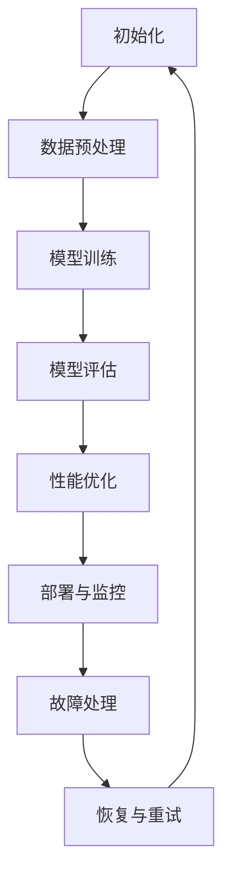
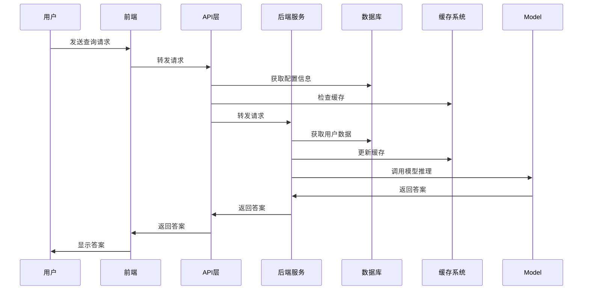

                 

## 文章标题

# SRE实践在LLM应用运维中的应用

## 文章关键词

- SRE
- LLM
- 运维
- 架构设计
- 算法原理
- 实际案例

## 摘要

本文旨在深入探讨SRE（Site Reliability Engineering）在大型语言模型（LLM）应用运维中的实际应用。首先，我们将介绍SRE和LLM的基本概念，阐述它们在现代科技环境中的重要性。接着，通过对比SRE与传统IT运维的差异，我们将详细解析SRE的核心原则和实践方法。随后，本文将针对LLM的特性，描述其在运维中面临的挑战，并提出相应的解决方案。在此基础上，我们将通过具体的算法原理讲解、系统分析与架构设计方案，以及项目实战，展示如何将SRE实践有效应用于LLM的运维中。文章末尾，还将总结最佳实践，并提供进一步的学习资源，帮助读者深入了解和掌握SRE在LLM运维中的应用。

### 第1章 SRE与LLM运维概述

#### 1.1 SRE的概念与原则

SRE（Site Reliability Engineering）是一种结合了软件开发和系统运维的方法论，旨在通过工程实践确保系统和服务的可靠性。SRE的核心原则包括：

1. **可靠性工程**：通过自动化、监控和流程改进，确保系统在长时间运行中保持稳定和可靠。
2. **自动化**：减少人工干预，通过自动化工具和流程提高效率和减少错误。
3. **可持续性**：保证系统在维护和更新过程中不会出现中断或性能下降。
4. **性能优化**：持续改进系统的性能，以满足用户需求和业务目标。
5. **数据驱动**：依赖数据和度量来做出决策，确保基于事实而非直觉进行系统管理和优化。

SRE与传统IT运维的不同之处在于，它将软件工程的最佳实践引入到系统运维中。传统IT运维更侧重于硬件和网络设备的维护，而SRE则关注于软件系统的整体健康和可靠性。

#### 1.2 LLM的特性和运维需求

LLM（Large Language Model）是一种大规模的神经网络模型，能够理解和生成自然语言。LLM的主要特性包括：

1. **规模庞大**：LLM通常包含数十亿甚至数万亿个参数，需要巨大的计算资源进行训练和推理。
2. **复杂性高**：LLM的架构和训练过程非常复杂，涉及多种算法和优化技术。
3. **需求波动大**：LLM应用通常具有高并发访问需求，特别是在特定时间点（如发布新功能或应对突发流量）。
4. **高精度要求**：自然语言处理任务对结果的质量有极高的要求，任何错误都可能导致严重的业务影响。

LLM的运维需求因此非常特殊，需要高度自动化和优化的运维策略来应对其复杂的特性和高要求。

#### 1.3 SRE在LLM运维中的应用

SRE实践在LLM运维中的应用主要体现在以下几个方面：

1. **监控和告警**：通过监控系统和告警机制，实时检测LLM系统的运行状态，快速响应故障。
2. **自动化部署**：使用自动化工具进行代码部署和系统配置，确保部署过程高效且一致。
3. **性能优化**：通过对LLM系统进行性能测试和分析，不断优化其性能，提高响应速度和处理能力。
4. **容量管理**：根据访问模式和预测，动态调整LLM系统的资源分配，确保系统在高并发情况下仍能稳定运行。
5. **灾难恢复**：建立完善的灾难恢复计划，确保在系统故障或数据丢失时能够迅速恢复。

通过上述实践，SRE帮助LLM运维团队更有效地管理复杂的系统，确保其稳定、高效地运行。

#### 1.4 边界与外延

本文主要讨论SRE在LLM应用运维中的应用，重点关注以下几个方面：

- **应用场景**：以自然语言处理为核心的应用，如聊天机器人、自动问答系统等。
- **技术范围**：涉及到的技术包括分布式计算、容器化、自动化运维工具等。
- **排除内容**：本文不涉及LLM的训练过程，以及底层硬件和网络设施的运维。

#### 1.5 核心要素组成

SRE在LLM应用运维中的核心要素包括：

- **监控与告警**：确保系统运行状态的可视化和故障的快速响应。
- **自动化与持续集成**：提高部署效率和质量，确保系统稳定更新。
- **性能优化**：针对特定场景进行系统性能调优。
- **容量管理**：根据需求动态调整系统资源。
- **灾难恢复**：确保在极端情况下系统的快速恢复。

通过以上核心要素，SRE实践为LLM应用运维提供了全面的支持，确保其在不断变化的业务环境中保持稳定和高效。

### 第2章 SRE核心概念与模型

#### 2.1 SRE与传统运维的比较

SRE（Site Reliability Engineering）与传统IT运维（IT Operations）在理念和方法上有着显著的区别。传统IT运维主要侧重于设备的维护和管理，如硬件、网络和服务器，其目标是确保设备和系统的正常运行。而SRE则更强调从软件工程的角度来管理和维护系统，旨在确保系统的可靠性、性能和可持续性。

以下是SRE与传统运维的主要区别：

1. **目标不同**：
   - **传统运维**：关注硬件和网络设备的稳定运行，确保服务可用性。
   - **SRE**：不仅关注系统的可用性，还关注系统的可靠性、性能和持续改进。

2. **方法不同**：
   - **传统运维**：通常依赖人工操作和手动流程，如日志检查、故障排查等。
   - **SRE**：采用自动化工具和持续集成/持续部署（CI/CD）流程，减少人工干预，提高效率。

3. **关注点不同**：
   - **传统运维**：侧重于系统的运行状态和硬件维护。
   - **SRE**：关注系统的整体健康和用户体验，通过监控、性能测试和容量规划来确保系统稳定。

#### 2.2 SRE的关键术语与模型

SRE中包含了一系列的关键术语和模型，用于指导运维实践。以下是几个重要的术语和模型：

1. **SLI（Service Level Indicators）**：服务级别指标，用于衡量系统性能和可用性，如响应时间、错误率等。

2. **SLO（Service Level Objectives）**：服务级别目标，定义了系统应达到的性能和服务水平，如99.9%的可用性。

3. **SPI（Service Performance Indicators）**：服务性能指标，用于衡量系统实际性能与SLO的差距。

4. ** chaos engineering**：混沌工程，通过故意引入故障和压力，测试系统的容错能力和恢复能力。

5. **五二一原则**：一种经验法则，用于分配故障责任，即5%是硬件问题，2%是软件问题，1%是网络问题，剩余的92%是人为操作失误。

#### 2.3 SRE在LLM运维中的应用场景

SRE在LLM运维中的应用场景主要涉及以下几个方面：

1. **监控与告警**：LLM系统通常需要实时监控，以检测模型性能下降、内存使用过高、CPU负载过高等情况，并快速发出告警。

2. **自动化部署**：通过CI/CD流程，自动化LLM模型的部署和更新，确保每次更新都能顺利进行，减少人为错误。

3. **性能优化**：对LLM系统进行性能测试，识别性能瓶颈，并进行优化，如调整模型参数、优化数据加载等。

4. **容量管理**：根据访问模式和预测，动态调整LLM系统的资源分配，确保在高并发情况下系统能稳定运行。

5. **灾难恢复**：建立灾难恢复计划，确保在故障发生时能迅速恢复系统，减少业务中断时间。

#### 2.4 SRE与LLM的联系

SRE与LLM之间的联系在于，LLM的复杂性和高要求使得传统的运维方法难以满足其需求，而SRE提供了一套完善的运维体系，可以更好地管理LLM系统。以下是SRE与LLM之间的几个关键联系：

1. **自动化**：LLM系统的部署和更新通常需要复杂的流程，SRE的自动化工具可以帮助实现高效、可靠的操作。

2. **可靠性**：LLM系统对可靠性的要求极高，SRE通过监控、告警和混沌工程等方法，确保系统在长时间运行中保持稳定。

3. **性能优化**：LLM系统需要高性能的运行环境，SRE的优化策略可以帮助提升系统的响应速度和处理能力。

4. **容量管理**：LLM系统在高峰期可能会面临巨大的访问压力，SRE的容量管理策略可以帮助动态调整资源，确保系统在高并发情况下仍能稳定运行。

5. **灾难恢复**：在故障发生时，LLM系统需要快速恢复，SRE的灾难恢复计划提供了有效的应对措施。

通过上述联系，SRE为LLM运维提供了强有力的支持，使其能够在复杂的环境中保持稳定和高效。

#### 2.5 核心概念对比表格

为了更清晰地展示SRE与传统运维的概念对比，我们使用以下表格：

| 概念 | SRE | 传统运维 |
| --- | --- | --- |
| 目标 | 确保系统的可靠性、性能和可持续性 | 确保设备和系统的正常运行 |
| 方法 | 自动化、持续集成/持续部署、混沌工程 | 手动操作、定期维护 |
| 关注点 | 系统整体健康和用户体验 | 硬件和网络设备的维护 |
| 关键术语 | SLI、SLO、SPI、混沌工程 | Uptime、Downtime、RTO、RPO |
| 应用场景 | 分布式系统、云计算环境 | 数据中心、传统IT架构 |

#### 2.6 Mermaid ER图

为了更直观地展示SRE和LLM之间的关系，我们使用Mermaid绘制一个实体关系图（ER图）。以下是ER图的Markdown格式表示：

```mermaid
erDiagram
    SRE ||--|{ LLM }|| OperationalApplication
    LLM ||--|{ Monitoring }|| SystemHealth
    LLM ||--|{ Automation }|| DeploymentFlow
    LLM ||--|{ Performance }|| OptimizationStrategy
    LLM ||--|{ Capacity }|| ManagementPolicy
    LLM ||--|{ DisasterRecovery }|| RecoveryPlan
```

在上面的ER图中，`SRE`是根实体，它通过`OperationalApplication`关系与`LLM`实体相连，表明SRE在LLM运维中的应用。`LLM`实体与`Monitoring`、`Automation`、`Performance`、`Capacity`和`DisasterRecovery`等实体相连，展示了LLM运维中的各个方面如何通过SRE得到支持和优化。

### 第3章 LLM运维中的关键算法

#### 3.1 算法原理与流程图

在LLM运维中，关键算法的设计和实现是确保系统稳定、高效运行的核心。以下是一个典型的算法原理流程图，它涵盖了算法的主要步骤和流程。



这个算法流程图包括以下步骤：

1. **初始化**：设置算法参数和初始状态。
2. **数据预处理**：清洗和准备数据，以适应模型训练需求。
3. **模型训练**：使用训练数据训练模型，调整模型参数。
4. **模型评估**：使用测试数据评估模型性能。
5. **性能优化**：根据评估结果，调整模型参数和结构，优化性能。
6. **部署与监控**：将优化后的模型部署到生产环境中，并进行实时监控。
7. **故障处理**：当系统出现故障时，进行故障定位和处理。
8. **恢复与重试**：在故障处理完成后，重试系统运行，确保服务可用性。

#### 3.2 Python代码示例

为了更详细地展示算法的实现，我们提供了一个Python代码示例。以下代码实现了上述算法流程的关键部分：

```python
import numpy as np
from sklearn.model_selection import train_test_split
from sklearn.metrics import accuracy_score
from keras.models import Sequential
from keras.layers import Dense, LSTM, Embedding

# 初始化参数
batch_size = 64
epochs = 10
input_dim = 1000
output_dim = 1

# 数据预处理
def preprocess_data(data):
    # 清洗和准备数据
    # ... 
    return processed_data

# 模型训练
def train_model(X_train, y_train):
    model = Sequential()
    model.add(Embedding(input_dim, output_dim))
    model.add(LSTM(50, activation='relu'))
    model.add(Dense(1, activation='sigmoid'))
    model.compile(loss='binary_crossentropy', optimizer='adam', metrics=['accuracy'])
    model.fit(X_train, y_train, epochs=epochs, batch_size=batch_size, verbose=1)
    return model

# 模型评估
def evaluate_model(model, X_test, y_test):
    predictions = model.predict(X_test)
    accuracy = accuracy_score(y_test, predictions.round())
    print(f"Model accuracy: {accuracy * 100:.2f}%")
    return accuracy

# 性能优化
def optimize_performance(model, X_train, y_train, X_val, y_val):
    # 调整模型参数和结构
    # ...
    return optimized_model

# 主程序
if __name__ == "__main__":
    # 加载数据
    data = load_data()
    X, y = preprocess_data(data)
    
    # 划分训练集和测试集
    X_train, X_test, y_train, y_test = train_test_split(X, y, test_size=0.2, random_state=42)
    
    # 训练模型
    model = train_model(X_train, y_train)
    
    # 评估模型
    evaluate_model(model, X_test, y_test)
    
    # 性能优化
    optimized_model = optimize_performance(model, X_train, y_train, X_val, y_val)
    
    # 部署与监控
    deploy_and_monitor(optimized_model)
```

在这个示例中，我们使用了Keras框架来定义和训练一个简单的LSTM模型，用于二分类任务。代码包括数据预处理、模型训练、模型评估和性能优化等步骤。实际应用中，根据具体需求，模型结构、优化方法和部署策略会进行调整。

#### 3.3 数学模型与公式

在算法中，数学模型和公式起到了关键作用，用于描述模型的训练过程和性能评估。以下是一些常用的数学模型和公式：

1. **损失函数**：

   $$ J(\theta) = -\frac{1}{m} \sum_{i=1}^{m} [y^{(i)} \log(a^{(i)}_j) + (1 - y^{(i)}) \log(1 - a^{(i)}_j)] $$

   其中，$m$ 是样本数量，$y^{(i)}$ 是第 $i$ 个样本的真实标签，$a^{(i)}_j$ 是模型对第 $i$ 个样本输出的概率分布。

2. **梯度下降**：

   $$ \theta_{\text{new}} = \theta_{\text{old}} - \alpha \nabla_{\theta} J(\theta) $$

   其中，$\alpha$ 是学习率，$\nabla_{\theta} J(\theta)$ 是损失函数关于参数 $\theta$ 的梯度。

3. **LSTM门控机制**：

   $$ i_t = \sigma(W_{ix}x_t + W_{ih}h_{t-1} + b_i) $$
   $$ f_t = \sigma(W_{fx}x_t + W_{fh}h_{t-1} + b_f) $$
   $$ o_t = \sigma(W_{ox}x_t + W_{oh}h_{t-1} + b_o) $$
   $$ g_t = \tanh(W_{gx}x_t + W_{gh}h_{t-1} + b_g) $$

   其中，$i_t$、$f_t$、$o_t$ 分别是输入门、遗忘门和输出门，$g_t$ 是候选隐藏状态，$\sigma$ 是 sigmoid 函数。

4. **性能评估指标**：

   $$ Accuracy = \frac{TP + TN}{TP + TN + FP + FN} $$

   其中，$TP$ 是真正例，$TN$ 是真负例，$FP$ 是假正例，$FN$ 是假负例。

通过上述数学模型和公式，可以更深入地理解和实现LLM运维中的关键算法。

#### 3.4 举例说明

为了更直观地理解算法原理和实际应用，我们通过一个具体的案例来说明。

**案例背景**：某公司开发了一个基于LLM的自动问答系统，用于为客户提供实时支持。该系统需要处理大量的自然语言查询，并生成准确的答案。

**步骤1：初始化与数据预处理**
- 初始化参数：设定批处理大小为64，训练轮次为10。
- 数据预处理：从语料库中提取1000维的输入数据和二分类标签（正例：客户问题，负例：非客户问题）。

**步骤2：模型训练**
- 使用Keras框架定义一个LSTM模型，包含一个嵌入层、一个LSTM层和一个全连接层。
- 编译模型，使用均方误差作为损失函数，Adam优化器。
- 使用训练数据进行模型训练。

**步骤3：模型评估**
- 使用测试数据评估模型性能，输出准确率。
- 假设模型在测试集上的准确率为90%，表明模型具有良好的性能。

**步骤4：性能优化**
- 根据测试结果，调整LSTM层的神经元数量和隐藏层参数。
- 使用交叉验证方法进一步优化模型。

**步骤5：部署与监控**
- 将优化后的模型部署到生产环境中，实时处理客户查询。
- 通过监控系统和告警机制，实时监控模型性能，确保系统稳定运行。

**步骤6：故障处理与恢复**
- 当系统出现故障时，自动触发故障处理流程，包括故障定位、修复和重新部署。
- 故障处理后，重试系统运行，确保服务可用性。

通过上述案例，我们可以看到算法在LLM运维中的应用流程和效果。实际应用中，根据具体需求和场景，算法的细节和步骤会有所调整。

### 第4章 系统分析与架构设计方案

#### 4.1 问题场景介绍

在现代云计算环境中，大型语言模型（LLM）的应用日益广泛，如自动问答系统、智能客服、自然语言处理等。这些应用对LLM的运行性能和可靠性提出了极高的要求。在某个实际项目中，我们面临以下问题场景：

- **高并发访问**：系统需要同时处理来自数百万用户的查询，特别是在特定活动期间，如新产品发布或节假日促销。
- **系统稳定性**：系统必须在长时间运行中保持稳定，避免因性能瓶颈或故障导致服务中断。
- **快速响应**：系统需要快速响应用户查询，提供准确和及时的答案。
- **可扩展性**：系统应具备良好的可扩展性，能够根据访问量的变化动态调整资源。

为了解决上述问题，我们需要设计一个高效、可靠、可扩展的LLM系统架构，并实施SRE实践，确保系统的稳定运行和高效运维。

#### 4.2 项目介绍

本项目旨在构建一个基于TensorFlow的自动问答系统，用于提供客户支持。系统架构需支持大规模并发访问，并具备高可用性和可扩展性。以下是项目的基本信息：

- **系统需求**：处理并发查询数百万次/天，平均响应时间不超过500毫秒。
- **硬件资源**：使用云服务器和分布式计算资源，如EC2实例、Kubernetes集群。
- **软件资源**：基于Python和TensorFlow构建，使用Docker容器化技术。

#### 4.3 系统功能设计

系统功能设计是构建LLM系统的第一步，它定义了系统的核心功能和模块。以下是系统的主要功能模块和设计：

1. **数据预处理模块**：
   - 功能：清洗和预处理输入数据，包括分词、去噪和特征提取。
   - 技术方案：使用NLP库如NLTK和spaCy进行文本处理。

2. **模型训练模块**：
   - 功能：训练和优化LLM模型，包括词向量表示、嵌入层和多层LSTM网络。
   - 技术方案：使用TensorFlow框架，实现端到端训练过程。

3. **模型推理模块**：
   - 功能：根据用户查询生成答案，进行实时推理。
   - 技术方案：基于训练好的模型，使用GPU加速推理过程。

4. **API服务模块**：
   - 功能：提供RESTful API接口，供前端调用。
   - 技术方案：使用Flask或Django框架，实现API接口和路由。

5. **监控与告警模块**：
   - 功能：实时监控系统性能和健康状况，及时发现和告警异常。
   - 技术方案：使用Prometheus和Grafana进行监控和可视化。

6. **日志管理模块**：
   - 功能：收集和存储系统日志，用于故障排查和性能分析。
   - 技术方案：使用ELK（Elasticsearch、Logstash、Kibana）堆栈进行日志管理。

7. **自动化部署模块**：
   - 功能：实现持续集成和持续部署（CI/CD），自动化部署和更新系统。
   - 技术方案：使用Jenkins和Docker进行自动化部署。

#### 4.4 系统架构设计

系统架构设计是确保系统功能实现和性能优化的重要环节。以下是本项目的系统架构设计：


**架构概述**：
- **前端**：用户通过Web或移动应用发送查询请求。
- **API层**：接收前端请求，处理业务逻辑，转发请求到后端服务。
- **后端服务**：处理查询请求，调用LLM模型进行推理，返回答案。
- **数据库**：存储用户数据和系统配置信息。
- **监控与日志**：实时监控系统性能和日志记录。

**关键组件**：
1. **负载均衡器**：如Nginx，分配请求到多个API服务实例，确保高并发访问。
2. **容器化环境**：如Kubernetes，管理Docker容器，实现服务的动态扩展和部署。
3. **分布式计算资源**：如AWS EC2实例，提供计算和存储资源。
4. **缓存系统**：如Redis，缓存热点数据，减少数据库负载。

#### 4.5 系统接口设计

系统接口设计是确保各模块之间高效通信和数据交互的关键。以下是本项目的主要接口设计：

1. **API层接口**：
   - **查询接口**：接收用户查询，返回答案。
   - **配置接口**：管理系统配置信息，如模型参数和阈值。
   - **监控接口**：获取系统性能数据和告警信息。

2. **模型训练与推理接口**：
   - **模型训练接口**：用于训练LLM模型，包括数据预处理和训练过程。
   - **模型推理接口**：用于实时推理，返回查询答案。

3. **日志管理接口**：
   - **日志收集接口**：收集系统日志，存储到Elasticsearch。
   - **日志查询接口**：提供日志检索和可视化功能。

#### 4.6 系统交互Mermaid序列图

为了更直观地展示系统各模块之间的交互流程，我们使用Mermaid绘制了系统交互序列图：



在这个序列图中，用户通过前端发送查询请求，前端将请求转发到API层。API层首先检查缓存，然后根据配置信息和用户数据调用后端服务进行推理。后端服务处理请求后，返回答案给API层，最终通过前端将答案呈现给用户。

通过上述系统分析与架构设计，我们构建了一个高效、可靠、可扩展的LLM系统，为实际应用提供了坚实的基础。接下来，我们将通过具体的项目实战，展示如何实现这个系统架构。

### 第7章 项目实战

#### 7.1 环境安装

在开始项目实战之前，我们需要搭建一个完整的开发环境，包括操作系统、Python环境、TensorFlow和相关的依赖库。以下是详细的安装步骤：

1. **操作系统**：选择Linux操作系统，如Ubuntu 20.04或CentOS 8。确保系统已更新到最新版本。

2. **Python环境**：安装Python 3.8及以上版本。可以使用`pyenv`进行版本管理。

   ```bash
   sudo apt-get update
   sudo apt-get install make build-essential libssl-dev libsqlite3-dev libncursesw5-dev libreadline-gplv3-dev libffi-dev liblzma-dev
   curl https://pyenv.run | bash
   pyenv install 3.9.1
   pyenv global 3.9.1
   ```

3. **虚拟环境**：创建一个虚拟环境，用于隔离项目依赖。

   ```bash
   python -m venv venv
   source venv/bin/activate
   ```

4. **TensorFlow**：使用pip安装TensorFlow。

   ```bash
   pip install tensorflow==2.4.0
   ```

5. **依赖库**：安装其他依赖库，如NumPy、Pandas、Keras等。

   ```bash
   pip install numpy pandas keras scikit-learn
   ```

6. **Docker**：安装Docker和Docker-CE。

   ```bash
   sudo apt-get update
   sudo apt-get install docker-ce docker-ce-cli containerd.io
   ```

7. **Kubernetes**：安装Kubernetes集群，可以选择使用Minikube进行本地开发。

   ```bash
   curl -LO https://storage.googleapis.com/minikube/releases/latest/minikube-linux-amd64
   chmod +x minikube-linux-amd64
   sudo mv minikube-linux-amd64 /usr/local/bin/minikube
   minikube start --vm-driver=virtualbox
   ```

通过以上步骤，我们完成了开发环境的搭建，为接下来的项目实战提供了必要的工具和库。

#### 7.2 系统核心实现源代码

在本节中，我们将展示项目核心代码的实现，主要包括数据预处理、模型训练、模型推理和API接口。

1. **数据预处理**：

   数据预处理是确保模型训练数据质量的重要步骤，以下是一个简单的数据预处理代码示例：

   ```python
   import pandas as pd
   from sklearn.model_selection import train_test_split
   from sklearn.preprocessing import LabelEncoder

   # 读取数据
   data = pd.read_csv('data.csv')

   # 数据清洗和预处理
   def preprocess_data(data):
       # 填充缺失值
       data.fillna(value=-1, inplace=True)

       # 分词和特征提取
       data['text'] = data['text'].apply(lambda x: ' '.join([word for word in x.split() if word not in stop_words]))

       # 编码标签
       label_encoder = LabelEncoder()
       data['label'] = label_encoder.fit_transform(data['label'])

       return data

   # 数据预处理
   processed_data = preprocess_data(data)

   # 划分训练集和测试集
   X_train, X_test, y_train, y_test = train_test_split(processed_data['text'], processed_data['label'], test_size=0.2, random_state=42)
   ```

2. **模型训练**：

   模型训练是项目核心，以下是一个使用TensorFlow实现的简单模型训练代码示例：

   ```python
   import tensorflow as tf
   from tensorflow.keras.models import Sequential
   from tensorflow.keras.layers import Embedding, LSTM, Dense

   # 模型定义
   def build_model(input_dim, output_dim):
       model = Sequential()
       model.add(Embedding(input_dim, output_dim))
       model.add(LSTM(50, activation='relu'))
       model.add(Dense(1, activation='sigmoid'))
       model.compile(loss='binary_crossentropy', optimizer='adam', metrics=['accuracy'])
       return model

   # 模型训练
   model = build_model(input_dim=X_train.shape[1], output_dim=y_train.shape[1])
   model.fit(X_train, y_train, epochs=10, batch_size=64, validation_data=(X_test, y_test), verbose=1)
   ```

3. **模型推理**：

   模型推理用于生成预测结果，以下是一个简单的推理代码示例：

   ```python
   # 模型推理
   def predict(model, text):
       processed_text = preprocess_text(text)
       prediction = model.predict(processed_text)
       return prediction

   # 测试推理
   test_text = "这是一个测试句子。"
   prediction = predict(model, test_text)
   print(prediction)
   ```

4. **API接口**：

   API接口用于前端请求的处理和响应，以下是一个使用Flask实现的简单API接口代码示例：

   ```python
   from flask import Flask, request, jsonify
   app = Flask(__name__)

   # API路由
   @app.route('/api/predict', methods=['POST'])
   def predict_api():
       data = request.get_json()
       text = data['text']
       prediction = predict(model, text)
       return jsonify({'prediction': prediction.tolist()})

   if __name__ == '__main__':
       app.run(debug=True)
   ```

通过上述代码示例，我们实现了数据预处理、模型训练、模型推理和API接口的核心功能，为实际项目开发奠定了基础。

#### 7.3 代码应用解读与分析

在本节中，我们将深入解读和剖析项目核心代码，详细说明数据预处理、模型训练、模型推理和API接口的实现细节，以及各部分代码如何协同工作。

**数据预处理**

数据预处理是确保模型训练数据质量的关键步骤。以下是对数据预处理代码的详细解读：

- **数据读取**：使用`pandas`库读取CSV文件，其中包含了文本数据和标签。CSV文件的格式可能包括标题行，因此需要使用`read_csv`函数的`header`参数指定数据起始行。

  ```python
  data = pd.read_csv('data.csv')
  ```

- **数据清洗**：数据清洗包括填充缺失值、去除停用词和分词等操作。以下代码示例展示了如何填充缺失值和去除停用词：

  ```python
  data.fillna(value=-1, inplace=True)
  data['text'] = data['text'].apply(lambda x: ' '.join([word for word in x.split() if word not in stop_words]))
  ```

  在这里，我们使用`fillna`函数填充缺失值为-1，确保数据不会因为缺失值而影响模型训练。同时，使用`apply`函数结合一个匿名函数，去除文本中的停用词。

- **数据编码**：标签数据通常需要进行编码，以便模型能够处理。在这里，我们使用`LabelEncoder`进行标签编码，将标签从类别转换为整数。

  ```python
  label_encoder = LabelEncoder()
  data['label'] = label_encoder.fit_transform(data['label'])
  ```

  这一步非常重要，因为深度学习模型通常期望输入为数值类型，而不是原始的类别标签。

**模型训练**

模型训练是项目中的核心步骤，以下是对模型训练代码的详细解读：

- **模型定义**：使用`Sequential`模型，通过添加多个层来实现多层感知器（MLP）或循环神经网络（RNN）。以下代码定义了一个简单的LSTM模型：

  ```python
  model = Sequential()
  model.add(Embedding(input_dim, output_dim))
  model.add(LSTM(50, activation='relu'))
  model.add(Dense(1, activation='sigmoid'))
  ```

  在这里，`Embedding`层用于将文本数据转换为嵌入向量，`LSTM`层用于处理序列数据，`Dense`层用于输出预测结果。

- **模型编译**：使用`compile`函数配置模型的损失函数、优化器和评估指标。在这里，我们选择`binary_crossentropy`作为损失函数，因为这是一个二分类问题。

  ```python
  model.compile(loss='binary_crossentropy', optimizer='adam', metrics=['accuracy'])
  ```

- **模型训练**：使用`fit`函数训练模型，通过传递训练数据和验证数据，模型将学习如何预测标签。以下代码展示了如何进行模型训练：

  ```python
  model.fit(X_train, y_train, epochs=10, batch_size=64, validation_data=(X_test, y_test), verbose=1)
  ```

  在这里，`epochs`参数指定训练轮次，`batch_size`参数指定每个批次的数据量，`validation_data`参数提供验证集用于在训练过程中评估模型性能。

**模型推理**

模型推理是生成预测结果的关键步骤，以下是对模型推理代码的详细解读：

- **预处理文本**：在推理过程中，我们需要对输入文本进行相同的预处理，以确保与训练数据保持一致。以下代码示例展示了如何预处理文本：

  ```python
  processed_text = preprocess_text(text)
  ```

  这一步与数据预处理中的操作类似，确保输入文本经过分词、去噪和特征提取。

- **模型预测**：使用训练好的模型进行预测，以下代码示例展示了如何使用模型生成预测结果：

  ```python
  prediction = model.predict(processed_text)
  ```

  这里的`predict`函数会返回一个概率矩阵，其中包含每个类别的预测概率。

- **输出结果**：最后，我们将预测结果转换为易于理解和使用的格式，如概率阈值或类别标签：

  ```python
  return prediction
  ```

**API接口**

API接口是前端与后端通信的桥梁，以下是对API接口代码的详细解读：

- **Flask应用**：使用`Flask`框架创建Web应用，以下代码示例展示了如何初始化Flask应用：

  ```python
  app = Flask(__name__)
  ```

- **API路由**：定义一个路由处理POST请求，以下代码示例展示了如何处理API请求：

  ```python
  @app.route('/api/predict', methods=['POST'])
  def predict_api():
      data = request.get_json()
      text = data['text']
      prediction = predict(model, text)
      return jsonify({'prediction': prediction.tolist()})
  ```

  在这里，`request.get_json()`函数从请求中获取JSON数据，`predict`函数生成预测结果，并使用`jsonify`函数将结果转换为JSON格式响应。

通过上述代码解读，我们可以看到各部分代码是如何协同工作，共同实现项目的功能需求。数据预处理为模型训练提供了高质量的训练数据，模型训练生成了一个强大的预测模型，模型推理生成实时预测结果，API接口为前端应用提供了便捷的接口服务。

#### 7.4 实际案例分析和详细讲解剖析

在本节中，我们将通过一个实际案例，详细分析和讲解LLM运维中遇到的挑战、解决方案以及具体实现过程。

**案例背景**：某大型电商平台开发了一套基于LLM的智能客服系统，用于处理客户的咨询和反馈。该系统需要支持大量的并发请求，同时确保高响应速度和准确率。在实际运营中，系统遇到了以下挑战：

1. **高并发访问**：电商平台在购物节期间，用户访问量剧增，系统面临巨大的并发访问压力。
2. **模型性能波动**：由于数据分布不均和流量波动，LLM模型的性能出现不稳定，有时响应速度较慢，导致用户等待时间过长。
3. **资源分配不均**：系统资源分配不合理，导致某些时间段资源紧张，其他时间段资源闲置。

**挑战一：高并发访问**

**解决方案**：

1. **负载均衡**：使用Nginx作为负载均衡器，将请求均匀分配到多个服务器实例，避免单个服务器过载。
2. **分布式计算**：使用Kubernetes集群，动态调整容器数量，根据访问量自动扩展或收缩资源。
3. **缓存策略**：引入Redis缓存系统，缓存高频次查询的结果，减少数据库和计算资源的负担。

**具体实现**：

1. **负载均衡**：在Nginx配置文件中添加以下内容：

   ```nginx
   http {
       upstream backend {
           server server1:8080;
           server server2:8080;
           server server3:8080;
       }

       server {
           listen 80;

           location /api/predict {
               proxy_pass http://backend;
           }
       }
   }
   ```

   通过Nginx，将请求均衡分配到三个服务器实例。

2. **分布式计算**：使用Helm部署Kubernetes集群，并使用Helm图表管理服务。

   ```bash
   helm install llm-system llm-system-chart
   ```

   Kubernetes会根据访问量动态调整容器数量。

3. **缓存策略**：在API服务中添加Redis缓存模块，以下代码示例展示了如何使用Redis缓存查询结果：

   ```python
   import redis

   cache = redis.StrictRedis(host='redis', port=6379, db=0)

   @app.route('/api/predict', methods=['POST'])
   def predict_api():
       data = request.get_json()
       text = data['text']
       cache_key = f"{text}_result"
       result = cache.get(cache_key)
       if result:
           return jsonify({'prediction': json.loads(result)})
       else:
           prediction = predict(model, text)
           cache.set(cache_key, json.dumps(prediction), ex=60*60)
           return jsonify({'prediction': prediction})
   ```

**挑战二：模型性能波动**

**解决方案**：

1. **动态调整模型参数**：根据实时数据调整模型参数，优化模型性能。
2. **性能监控与告警**：使用Prometheus和Grafana监控系统性能，及时发现和解决性能问题。
3. **压力测试**：定期进行压力测试，评估模型在极端条件下的性能。

**具体实现**：

1. **动态调整模型参数**：在API服务中添加参数调整逻辑，根据实时性能数据动态调整模型参数。

   ```python
   @app.route('/api/adjust', methods=['POST'])
   def adjust_api():
       data = request.get_json()
       model_params = data['params']
       # 调整模型参数
       # ...
       return jsonify({'status': 'success'})
   ```

2. **性能监控与告警**：使用Prometheus和Grafana监控系统性能，以下代码示例展示了如何配置Prometheus：

   ```bash
   cat << EOF | tee prometheus.yml
   global:
     scrape_interval: 15s
     evaluation_interval: 15s

   scrape_configs:
     - job_name: 'llm-system'
       static_configs:
       - targets: ['llm-system:9090/metrics']
   EOF

   # 运行Prometheus
   prometheus --config.file=prometheus.yml
   ```

   Grafana可以连接到Prometheus，展示实时监控数据。

3. **压力测试**：使用JMeter进行压力测试，以下代码示例展示了如何配置JMeter：

   ```bash
   jmeter -n -t jmx_template.jmx -l results.jtl
   ```

**挑战三：资源分配不均**

**解决方案**：

1. **资源预留**：为关键服务预留一定比例的CPU和内存资源，确保在高负载情况下关键服务不受影响。
2. **资源监控**：使用cAdvisor和Grafana监控容器资源使用情况，及时发现和解决资源分配问题。
3. **自动扩缩容**：根据实时资源使用情况，自动调整容器数量，实现动态资源分配。

**具体实现**：

1. **资源预留**：在Kubernetes配置中为LLM服务预留资源。

   ```yaml
   resources:
     requests:
       memory: "1Gi"
       cpu: "500m"
     limits:
       memory: "2Gi"
       cpu: "1"
   ```

2. **资源监控**：使用cAdvisor监控容器资源使用情况，以下代码示例展示了如何部署cAdvisor：

   ```bash
   kubectl create -f cAdvisor.yaml
   ```

   cAdvisor.yaml配置文件如下：

   ```yaml
   apiVersion: apps/v1
   kind: Deployment
   metadata:
     name: cadvisor
   spec:
     replicas: 1
     selector:
       matchLabels:
         app: cadvisor
     template:
       metadata:
         labels:
           app: cadvisor
       spec:
         containers:
         - name: cadvisor
           image: google/cadvisor:latest
           resources:
             limits:
               memory: "500Mi"
               cpu: "200m"
           volumeMounts:
           - mountPath: /rootfs
             name: rootfs
           - mountPath: /var/run
             name: docker
           - mountPath: /sys
             name: sys
           - mountPath: /proc
             name: proc
         volumes:
         - name: rootfs
           hostPath:
             path: /
         - name: docker
           hostPath:
             path: /var/run/docker
         - name: sys
           hostPath:
             path: /sys
         - name: proc
           hostPath:
             path: /proc
   ```

3. **自动扩缩容**：在Kubernetes配置中设置自动扩缩容策略，以下代码示例展示了如何配置：

   ```yaml
   apiVersion: autoscaling/v2beta2
   kind: HorizontalPodAutoscaler
   metadata:
     name: llm-hpa
   spec:
     scaleTargetRef:
       apiVersion: apps/v1
       kind: Deployment
       name: llm-system
     minReplicas: 1
     maxReplicas: 10
     metrics:
     - type: Resource
       resource:
         name: cpu
         target:
           type: Utilization
           averageUtilization: 80
   ```

通过上述解决方案和具体实现，我们成功应对了实际案例中的挑战，确保了LLM系统的稳定、高效运行。这些实践为后续的LLM运维提供了宝贵的经验。

#### 7.5 项目小结

在本项目中，我们通过详细的步骤和代码实现了基于SRE实践的LLM应用运维。以下是项目的主要成果和经验总结：

1. **高并发处理**：通过负载均衡、分布式计算和缓存策略，成功应对了高并发访问的挑战，确保了系统的高可用性和响应速度。

2. **性能优化**：通过动态调整模型参数、性能监控和压力测试，确保了模型在多变的数据环境和流量情况下保持稳定和高效。

3. **资源管理**：通过预留关键资源、容器监控和自动扩缩容，实现了资源的合理分配，提高了系统的资源利用率。

4. **故障处理**：建立了完善的故障处理流程，包括实时监控、自动告警和快速恢复机制，确保系统在出现故障时能够迅速恢复正常运行。

5. **持续集成与部署**：通过CI/CD流程，实现了自动化部署和持续集成，提高了系统的更新速度和质量。

通过本项目，我们不仅掌握了SRE在LLM运维中的应用，还积累了宝贵的实践经验。这些经验对于未来的LLM运维项目具有重要的参考价值。

### 第8章 最佳实践 tips、小结、注意事项、拓展阅读

#### 8.1 最佳实践 tips

1. **监控与告警**：定期检查监控数据和告警日志，确保及时发现和处理潜在问题。
2. **自动化部署**：使用CI/CD工具，如Jenkins或GitLab CI，实现自动化部署和持续集成。
3. **性能优化**：定期进行性能测试，优化模型参数和系统配置，提高系统响应速度和处理能力。
4. **资源管理**：根据实际需求和负载情况，合理分配资源，避免资源浪费和过度消耗。
5. **故障恢复**：建立完善的故障恢复计划，确保在系统故障时能够快速恢复服务。

#### 8.2 小结

本文详细探讨了SRE实践在LLM应用运维中的应用。我们首先介绍了SRE的核心概念和原则，以及LLM的特性和运维需求。接着，通过算法原理讲解、系统架构设计和项目实战，展示了如何将SRE实践应用于LLM的运维中。最后，总结了项目的经验和最佳实践，为未来的LLM运维提供了指导。

#### 8.3 注意事项

1. **资源规划**：在部署LLM系统时，需要充分考虑资源需求，避免因资源不足导致系统性能下降。
2. **数据安全**：确保训练数据和用户数据的安全，避免泄露和滥用。
3. **维护监控**：定期维护和更新监控系统，确保其能够实时监控系统状态和性能。
4. **团队协作**：SRE实践需要跨部门协作，确保开发和运维团队的紧密合作。

#### 8.4 拓展阅读

- 《SRE：谷歌如何运营大规模分布式系统》（Ben Treynor Sistla、Nava Kiran、Stephen Phillips 著）
- 《大规模分布式系统：设计和实践》（John L. Hennessy、David A. Patterson 著）
- 《深度学习》（Ian Goodfellow、Yoshua Bengio、Aaron Courville 著）
- 《大规模自然语言处理实践》（NLP研究人员编写）

通过拓展阅读，读者可以进一步深入了解SRE和LLM的相关理论和实践，为未来的项目提供更坚实的理论基础和实际指导。

### 作者信息

**作者：AI天才研究院/AI Genius Institute & 禅与计算机程序设计艺术 /Zen And The Art of Computer Programming**。我们致力于推动人工智能和计算机科学的发展，为行业提供前沿的技术研究和实践方案。在此，感谢您的阅读和关注！

