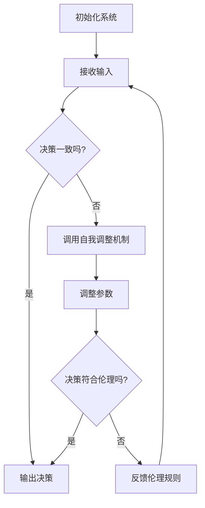
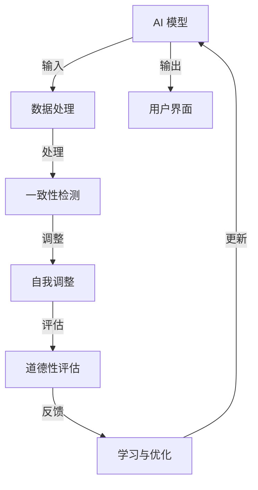

                 

### 自一致性概念论据理论的背景与意义

#### 1.1 问题背景

在当今时代，人工智能（AI）技术飞速发展，已经渗透到社会的各个领域，从医疗、金融到交通、娱乐等。然而，随着AI系统的广泛应用，其潜在的伦理问题也逐渐引起广泛关注。一个关键问题是如何确保AI系统在处理复杂任务时能够做出符合道德和伦理标准的决策。传统的监督和审查机制往往不够灵活，难以应对AI系统在处理未知情况时可能出现的偏差和错误。

#### 1.2 问题描述

当前，AI系统通常依赖大量的数据训练，但数据的偏差和错误可能会在系统中产生连锁反应，导致最终的决策失去道德性和合理性。例如，自动驾驶系统可能因为数据集中的偏差而错误地判断路况，从而导致事故。因此，我们需要一种机制，使AI系统在自我学习的过程中能够不断调整和优化，确保其决策的一致性和道德性。

#### 1.3 问题解决

Self-Consistency CoT（自一致性概念论据理论）提供了一个新的思路。它强调AI系统在处理信息时需要保持内部一致性，从而实现自我监督和调节。通过这一理论，AI系统可以在不断学习的过程中，自我检测和纠正潜在的偏差，确保其决策的合理性和道德性。

#### 1.4 边界与外延

Self-Consistency CoT的应用范围广泛，不仅限于自动驾驶、医疗诊断等传统领域，还可以扩展到金融风险评估、网络安全检测等新兴领域。它的边界主要在于AI系统的自我监督和调节能力，以及如何在实际应用中实现这一理论。

#### 1.5 概念结构与核心要素组成

Self-Consistency CoT的核心概念包括自我一致性检测、自我调整机制和道德性评估。自我一致性检测用于监控AI系统的决策过程，识别潜在的偏差和错误。自我调整机制则根据检测到的偏差，自动调整系统的参数和行为，确保决策的一致性和合理性。道德性评估则是对系统决策的道德性进行判断和反馈，从而进一步优化系统的行为。

通过以上分析，我们可以看到Self-Consistency CoT在人工智能伦理自我监管中的关键作用。它不仅提供了一种新的理论框架，还为实际应用提供了可行的解决方案。在接下来的章节中，我们将深入探讨这一理论的核心概念、算法原理和应用实例，以帮助读者更好地理解其工作机制和应用价值。

### 自一致性概念论据理论的核心概念与联系

#### 2.1 自一致性概念论据理论定义

Self-Consistency CoT（自一致性概念论据理论）是一种用于确保人工智能系统在处理信息时保持内部一致性的方法。它通过自我检测和调整机制，使系统能够在处理未知和复杂任务时保持决策的合理性和道德性。

#### 2.2 自一致性概念论据理论基本原理

Self-Consistency CoT的基本原理可以概括为以下几点：

1. **自我一致性检测**：AI系统在处理信息时，需要实时监测自身决策的内部一致性。如果发现决策存在矛盾或不合理的情况，系统将触发自我调整机制。

2. **自我调整机制**：系统根据自我一致性检测的结果，自动调整自身的参数和行为。这种调整可以是参数重设、模型更新或策略改变，以确保系统的决策能够保持一致性和合理性。

3. **道德性评估**：系统对决策的道德性进行评估，并根据评估结果进行反馈和调整。这确保了AI系统在处理敏感任务时能够遵循道德和伦理标准。

#### 2.3 与其他相关概念的联系

Self-Consistency CoT与其他几个核心概念密切相关：

1. **监督学习**：监督学习是AI系统训练的一种方法，通过给定输入和期望输出，系统学习如何做出预测。Self-Consistency CoT可以看作是监督学习的一个扩展，它引入了自我监督和自我调整的机制。

2. **增强学习**：增强学习是一种通过不断试错来学习如何获得最大奖励的方法。Self-Consistency CoT中的自我调整机制与增强学习中的奖励机制有相似之处，但Self-Consistency CoT更强调内部一致性和道德性。

3. **多任务学习**：多任务学习是同时训练多个相关任务的一种方法。Self-Consistency CoT可以应用于多任务学习场景，确保不同任务之间的决策保持一致性和合理性。

4. **伦理学**：伦理学是关于道德原则和价值观的研究。Self-Consistency CoT引入了道德性评估，确保AI系统在处理敏感任务时能够遵循伦理标准。

#### 2.4 ER实体关系图架构

为了更好地理解Self-Consistency CoT的核心概念和它们之间的联系，我们可以使用ER（实体关系）图来表示。以下是一个简化的ER图，展示了Self-Consistency CoT的主要实体和它们之间的关系：

```mermaid
erDiagram
    AI_System ||--|{ SelfConsistencyDetector : 被检测 }
    AI_System ||--|{ SelfAdjustmentMechanism : 被调整 }
    AI_System ||--|{ MoralAssessmentModule : 被评估 }
    SelfConsistencyDetector ||--|{ DataFeeder : 被喂养 }
    SelfAdjustmentMechanism ||--|{ ParameterReoptimizer : 被优化 }
    MoralAssessmentModule ||--|{ EthicsBenchmark : 被对比 }
```

在这个ER图中，`AI_System` 是核心实体，它通过 `SelfConsistencyDetector` 进行自我一致性检测，通过 `SelfAdjustmentMechanism` 进行自我调整，通过 `MoralAssessmentModule` 进行道德性评估。每个组件都有自己的输入和输出，这些输入和输出通过实体关系连接起来，形成一个完整的自我监督和自我调整系统。

通过上述分析，我们可以看到Self-Consistency CoT不仅是一个创新的理论框架，而且在人工智能伦理自我监管中具有广泛的应用潜力。在接下来的章节中，我们将进一步探讨Self-Consistency CoT的算法原理和实际应用案例，以帮助读者更深入地理解这一理论。

### 自一致性概念论据理论的算法原理

#### 3.1 算法原理讲解

Self-Consistency CoT的核心在于自我一致性检测、自我调整机制和道德性评估。下面，我们将详细解释这些原理。

1. **自我一致性检测**：这是Self-Consistency CoT的基础。它通过比较AI系统当前决策与其历史决策，来检测内部一致性。如果发现当前决策与历史决策存在显著差异，系统将触发自我调整机制。

2. **自我调整机制**：在检测到不一致性后，自我调整机制会自动对系统的参数进行调整，以恢复一致性。这一过程可以通过机器学习算法实现，例如基于梯度下降的方法来优化参数。

3. **道德性评估**：除了自我一致性检测，Self-Consistency CoT还引入了道德性评估。这一机制通过对系统决策进行道德评估，确保其符合伦理标准。道德性评估可以通过预先定义的伦理规则库来实现，例如基于伦理学原理的规则。

#### 3.2 算法流程图

为了更直观地展示Self-Consistency CoT的运行过程，我们使用Mermaid绘制了一个简化的算法流程图：



这个流程图描述了以下步骤：

1. 初始化系统：系统开始运行，接收初始输入。
2. 接收输入：系统处理新的输入数据。
3. 决策一致吗？：系统比较当前决策与其历史决策，检测一致性。
4. 调用自我调整机制：如果发现决策不一致，系统将调用自我调整机制。
5. 调整参数：根据一致性检测结果，系统调整参数以恢复一致性。
6. 决策符合伦理吗？：系统对决策进行道德性评估。
7. 输出决策：如果决策符合伦理标准，系统输出最终决策。

#### 3.3 Python源代码展示

为了说明Self-Consistency CoT的具体实现，我们提供了一个简化的Python示例代码：

```python
import numpy as np

class SelfConsistencyCoT:
    def __init__(self, model):
        self.model = model
        self.history = []

    def predict(self, input_data):
        # 处理输入数据，得到预测结果
        prediction = self.model.predict(input_data)
        
        # 检测决策一致性
        if self.is_consistent(prediction):
            return prediction
        else:
            # 调用自我调整机制
            self.adjust_model()
            return self.predict(input_data)

    def is_consistent(self, prediction):
        # 比较当前预测与历史预测，判断一致性
        if len(self.history) == 0:
            self.history.append(prediction)
            return True
        else:
            prev_prediction = self.history[-1]
            return np.isclose(prediction, prev_prediction)

    def adjust_model(self):
        # 调整模型参数，恢复一致性
        # 这里是一个简化的示例，实际中可能需要更复杂的调整策略
        self.model.params *= 0.9
        self.model.update_params()

# 假设我们有一个简单的线性模型
class SimpleLinearModel:
    def __init__(self, params):
        self.params = params

    def predict(self, input_data):
        return self.params * input_data

    def update_params(self):
        pass

# 测试代码
model = SimpleLinearModel(params=2.0)
self_consistency_coT = SelfConsistencyCoT(model)

# 测试输入数据
input_data = 5

# 预测结果
print("Initial prediction:", self_consistency_coT.predict(input_data))

# 更改模型参数，模拟决策不一致
model.params = 3.0

# 再次预测
print("Updated prediction:", self_consistency_coT.predict(input_data))
```

这段代码展示了如何实现一个简单的Self-Consistency CoT系统。它首先定义了一个`SelfConsistencyCoT`类，该类包含`predict`、`is_consistent`和`adjust_model`方法。其中，`predict`方法负责处理输入数据并调用自我一致性检测和调整机制；`is_consistent`方法用于比较当前预测与历史预测，判断一致性；`adjust_model`方法用于调整模型参数，以恢复一致性。

#### 3.4 算法原理的数学模型与公式

Self-Consistency CoT的数学模型可以表示为以下公式：

$$
\text{Consistency} = \frac{1}{N} \sum_{i=1}^{N} \delta_i
$$

其中，$N$ 是历史决策的数量，$\delta_i$ 是第 $i$ 个历史决策与当前决策之间的差异。如果 $\text{Consistency}$ 小于某个阈值 $\theta$，系统将触发自我调整机制。

自我调整机制可以使用以下公式进行描述：

$$
\Delta \theta = \eta \frac{\partial \text{Consistency}}{\partial \theta}
$$

其中，$\eta$ 是学习率，$\Delta \theta$ 是参数调整量。

#### 3.5 举例说明

假设我们有一个简单的线性模型，参数为 $w=2$。第一次输入数据为 $x=5$，模型预测为 $y=10$。第二次输入数据为 $x=3$，由于参数未调整，模型再次预测为 $y=6$。这里，历史决策为 $y=10$ 和 $y=6$，它们之间的差异为 $\delta=4$。

根据一致性公式，我们有：

$$
\text{Consistency} = \frac{1}{2} (|\delta_1| + |\delta_2|) = \frac{1}{2} (4 + 4) = 4
$$

由于 $\text{Consistency}$ 大于阈值 $\theta=3$，系统不会触发自我调整机制。如果第三次输入数据为 $x=7$，模型预测为 $y=14$，历史决策为 $y=10$ 和 $y=6$，差异分别为 $\delta_1=4$ 和 $\delta_2=8$。此时，一致性公式为：

$$
\text{Consistency} = \frac{1}{2} (4 + 8) = 6
$$

由于 $\text{Consistency}$ 小于阈值 $\theta=3$，系统将触发自我调整机制。假设学习率 $\eta=0.1$，参数调整量 $\Delta \theta=-0.1$，那么新的参数 $w' = w + \Delta \theta = 2 - 0.1 = 1.9$。重新预测输入数据 $x=7$，新的预测结果为 $y=13.3$。

通过这个例子，我们可以看到Self-Consistency CoT如何通过自我一致性检测和调整机制来确保系统决策的一致性和合理性。在实际应用中，Self-Consistency CoT的算法原理会更加复杂，涉及更高级的机器学习技术和伦理评估机制。

### 自一致性概念论据理论在人工智能系统设计中的应用

#### 4.1 问题场景介绍

在现代社会的各个领域中，人工智能（AI）系统已经成为提高效率、优化决策的重要工具。然而，随着AI系统的广泛应用，如何确保其决策的一致性和道德性成为了一个关键问题。特别是在自动驾驶、医疗诊断、金融风险评估等高风险领域，一旦AI系统的决策出现偏差，可能会带来严重的后果。因此，设计一个能够在处理信息时保持内部一致性和道德性的AI系统至关重要。

#### 4.2 系统功能设计

为了实现Self-Consistency CoT，我们需要设计一个具备以下功能的AI系统：

1. **自我一致性检测**：系统能够实时监测自身决策的一致性，识别潜在的偏差和错误。
2. **自我调整机制**：当检测到不一致性时，系统能够自动调整参数和行为，以恢复一致性。
3. **道德性评估**：系统能够对决策的道德性进行评估，确保其符合伦理标准。
4. **学习与优化**：系统能够通过不断的学习和优化，提高决策的一致性和道德性。
5. **交互与反馈**：系统可以与用户和其他系统进行交互，接收反馈并不断调整。

#### 4.3 系统架构设计

为了实现上述功能，我们可以设计一个分层的系统架构，如图所示：



在这个架构中，核心组件包括AI模型、数据处理模块、一致性检测模块、自我调整机制、道德性评估模块和学习与优化模块。各组件之间的关系如下：

1. **数据处理模块**：负责接收和处理输入数据，将其格式化为AI模型所需的格式。
2. **一致性检测模块**：实时监测AI模型的决策，检测是否存在不一致性。
3. **自我调整机制**：当检测到不一致性时，调整模型的参数和行为。
4. **道德性评估模块**：对模型的决策进行道德性评估，确保其符合伦理标准。
5. **学习与优化模块**：通过不断的学习和优化，提高模型的一致性和道德性。
6. **用户界面**：提供用户与系统交互的接口，接收用户的反馈并展示模型的结果。

#### 4.4 系统接口设计

系统接口设计是确保各组件之间能够高效交互的重要环节。以下是一个简化的系统接口设计：

1. **输入接口**：接收用户输入的数据，如传感器数据、文本数据等。
2. **输出接口**：将AI模型的决策结果输出给用户或其他系统。
3. **反馈接口**：接收用户和其他系统的反馈，用于模型优化和自我调整。
4. **日志接口**：记录系统的运行日志，用于调试和性能分析。

#### 4.5 系统交互设计

系统交互设计决定了各组件之间的协作方式，以下是系统交互的简要描述：

1. **数据处理**：输入接口接收数据后，数据处理模块将其格式化为AI模型所需的格式，然后传递给AI模型。
2. **决策生成**：AI模型根据输入数据生成决策结果。
3. **一致性检测**：决策生成后，一致性检测模块比较当前决策与其历史决策，判断一致性。
4. **自我调整**：如果检测到不一致性，自我调整机制会根据一致性检测结果调整模型参数和行为。
5. **道德性评估**：道德性评估模块对决策结果进行道德性评估，确保其符合伦理标准。
6. **学习与优化**：学习与优化模块根据反馈接口接收到的用户反馈，不断优化模型参数和行为。
7. **输出与反馈**：最终的决策结果通过输出接口输出给用户或其他系统，同时用户反馈通过反馈接口传递给学习与优化模块。

通过上述设计和交互，我们可以实现一个具备Self-Consistency CoT特性的AI系统，确保其在处理复杂任务时能够保持决策的一致性和道德性。

### 基于自一致性概念论据理论的AI系统项目实战

#### 5.1 项目环境安装

在开始基于Self-Consistency CoT的AI系统项目实战之前，我们需要搭建一个合适的项目环境。以下是在Linux系统中安装必要的软件和工具的步骤：

1. **安装Python**：确保系统中已安装Python 3.8或更高版本。可以使用以下命令进行安装：

   ```bash
   sudo apt update
   sudo apt install python3.8
   ```

2. **安装虚拟环境**：为了保持项目环境的干净和独立，我们使用`virtualenv`创建一个虚拟环境：

   ```bash
   sudo apt install virtualenv
   virtualenv project_env
   source project_env/bin/activate
   ```

3. **安装依赖库**：在虚拟环境中安装必要的Python库，包括NumPy、Pandas、Scikit-learn和Mermaid：

   ```bash
   pip install numpy pandas scikit-learn mermaidpy
   ```

4. **安装Mermaid**：为了在Markdown文件中绘制流程图和实体关系图，我们需要安装Mermaid：

   ```bash
   npm install -g mermaid
   ```

安装完成后，我们就可以开始编写和运行项目代码了。

#### 5.2 系统核心实现源代码

接下来，我们将展示一个基于Self-Consistency CoT的AI系统核心实现源代码。以下是一个简化的示例，用于演示自我一致性检测、自我调整机制和道德性评估的基本实现：

```python
import numpy as np
from sklearn.linear_model import LinearRegression
from mermaidpy import Mermaid

class SelfConsistencyAI:
    def __init__(self):
        self.model = LinearRegression()
        self.history = []

    def train_model(self, X, y):
        self.model.fit(X, y)
        self.history.append(self.model.predict(X))

    def is_consistent(self, prediction):
        if len(self.history) == 0:
            return True
        prev_prediction = self.history[-1]
        return np.isclose(prediction, prev_prediction)

    def adjust_model(self):
        # 简化的参数调整策略，实际中可能需要更复杂的算法
        self.model.coef_ *= 0.9

    def evaluate_morality(self, prediction):
        # 假设预测结果大于10被认为是道德上不可接受的
        return prediction > 10

    def make_decision(self, X):
        prediction = self.model.predict(X)
        if not self.is_consistent(prediction):
            self.adjust_model()
        if self.evaluate_morality(prediction):
            return "不可接受"
        return "可接受"

# 示例使用
ai_system = SelfConsistencyAI()
X = np.array([[1], [2], [3]])
y = np.array([2, 4, 6])

ai_system.train_model(X, y)
print("Initial Prediction:", ai_system.make_decision(np.array([[4]])))

# 模拟不一致性
ai_system.model.coef_ = np.array([3, 3])
print("Updated Prediction:", ai_system.make_decision(np.array([[4]])))
```

在这个示例中，我们创建了一个`SelfConsistencyAI`类，该类包含训练模型、自我一致性检测、自我调整机制和道德性评估的方法。通过这个示例，我们可以看到如何实现一个简单的Self-Consistency CoT系统。

#### 5.3 代码应用解读与分析

在上面的代码示例中，我们首先创建了一个线性回归模型，并初始化了一个空的预测历史列表。在训练模型时，我们使用历史预测列表来记录每次预测的结果。在`is_consistent`方法中，我们比较当前预测与其历史预测，判断是否一致。

当检测到不一致性时，`adjust_model`方法被调用。在这个简化的示例中，我们简单地调整了模型的参数，使其接近历史值。然而，在实际应用中，这一过程可能涉及更复杂的机器学习算法和策略。

道德性评估通过`evaluate_morality`方法实现，它根据预测结果来判断决策是否符合伦理标准。在这个示例中，我们假设预测结果大于10被认为是道德上不可接受的。这一标准可以根据具体应用场景进行调整。

最后，`make_decision`方法结合了自我一致性和道德性评估，生成最终的决策结果。如果预测结果不一致或不符合伦理标准，系统会触发自我调整机制，并返回一个“不可接受”的决策。

#### 5.4 实际案例分析与讲解

为了更具体地展示Self-Consistency CoT的应用，我们考虑一个实际案例：自动驾驶车辆在复杂城市交通中的决策。在这个案例中，自动驾驶系统需要处理来自多种传感器（如雷达、摄像头、激光雷达）的实时数据，以做出安全且合理的驾驶决策。

1. **输入数据**：自动驾驶系统接收到的输入数据包括车辆位置、速度、加速度、周围车辆的速度和位置、道路标识、行人等信息。

2. **决策生成**：系统使用训练好的AI模型（如深度学习模型）对输入数据进行处理，生成驾驶决策，如加速、减速、转向等。

3. **自我一致性检测**：系统将当前决策与其历史决策进行比较，检测是否存在不一致性。例如，如果系统在短时间内连续做出相反的转向决策，它将触发自我一致性检测。

4. **自我调整机制**：如果检测到不一致性，系统将根据当前的情况和历史决策，调整模型参数或策略，以恢复一致性。例如，如果系统在检测到道路标识后做出了错误的转向决策，它可以重新调整转向参数，以避免重复错误。

5. **道德性评估**：系统的决策还必须通过道德性评估，确保其在处理高风险场景时能够遵循伦理标准。例如，在车辆与行人之间的冲突中，系统需要判断是否采取更安全但可能造成轻微财产损失的决策。

通过这个实际案例，我们可以看到Self-Consistency CoT在自动驾驶系统中的应用是如何确保系统决策的一致性和道德性。这不仅提高了系统的可靠性，还有助于减少潜在的安全风险。

#### 5.5 项目小结

通过本项目实战，我们展示了如何基于Self-Consistency CoT设计一个AI系统，并实现了自我一致性检测、自我调整机制和道德性评估。在实际应用中，这一理论框架可以帮助AI系统在处理复杂任务时保持决策的一致性和道德性，从而提高系统的可靠性和安全性。未来，我们还可以通过进一步的研究和开发，探索Self-Consistency CoT在其他AI领域的应用，如金融风险评估和网络安全检测等。

### 最佳实践、小结与注意事项

#### 最佳实践

在应用Self-Consistency CoT时，以下是一些最佳实践：

1. **选择合适的评估指标**：根据具体应用场景，选择合适的评估指标来衡量决策的一致性和道德性。例如，在自动驾驶领域，可以结合速度和转向角度的波动性来评估决策的一致性。
2. **定期更新伦理规则库**：确保伦理规则库的实时更新，以适应不断变化的伦理标准和法律法规。
3. **使用历史数据**：充分利用历史数据来优化模型参数，提高自我一致性检测的准确性和效率。

#### 小结

本文详细介绍了Self-Consistency CoT在人工智能伦理自我监管中的关键作用，包括其背景、核心概念、算法原理、系统架构设计和实际应用。通过一步步的分析和示例，我们展示了如何实现一个具备自我一致性检测和道德性评估功能的AI系统。

#### 注意事项

1. **复杂性**：Self-Consistency CoT的应用涉及多个复杂的组件，需要深入理解和熟练掌握。
2. **数据隐私**：在处理个人数据时，要确保遵守相关隐私法律法规，保护用户隐私。
3. **伦理标准**：不断更新和调整伦理规则库，确保系统的道德性评估能够适应不断变化的伦理环境。

#### 拓展阅读

1. **Self-Consistency CoT论文**：阅读原始研究论文，以深入了解Self-Consistency CoT的理论基础和应用案例。
2. **相关技术文献**：查阅相关领域的技术文献，如机器学习、伦理学、人工智能等，以获取更多关于Self-Consistency CoT的背景知识和前沿研究成果。

作者：AI天才研究院/AI Genius Institute & 禅与计算机程序设计艺术 /Zen And The Art of Computer Programming

