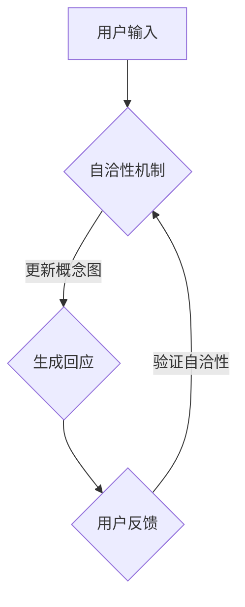

                 


### 核心概念与联系

在开始深入探讨Self-Consistency CoT（自洽性概念图）在多轮对话中的应用之前，我们需要首先明确一些核心概念和它们之间的联系。

**核心概念：**

1. **自洽性（Self-Consistency）**：自洽性指的是一个系统或实体在多轮对话中保持一致性和连贯性的能力。在人工智能领域，尤其是在自然语言处理（NLP）中，自洽性是一个非常重要的概念，因为它决定了AI能否在对话中持续提供相关和有意义的回应。

2. **多轮对话（Multi-turn Dialogue）**：多轮对话是指由多个独立的对话回合组成的对话过程，每个回合通常涉及用户的输入和系统的回应。在这种对话中，上下文信息的重要性显著增加，因此，自洽性变得尤为关键。

3. **概念图（Concept Map）**：概念图是一种知识表示形式，通过节点和连边来表示概念及其之间的关系。在自洽性研究中，概念图被用来捕捉对话中的上下文信息，并指导系统生成连贯的回应。

**联系：**

- **自洽性与概念图**：自洽性通过概念图来体现，概念图能够帮助系统在对话过程中追踪和维持上下文信息。在每一轮对话中，系统都会更新其概念图，以反映当前对话的状态。

- **多轮对话与自洽性**：在多轮对话中，自洽性确保了系统在回答问题时能够保持一致性。如果系统的回应在不同回合中自相矛盾，那么这个系统就无法提供有效的服务。

**Mermaid流程图：**

为了更直观地展示自洽性在多轮对话中的应用，我们可以使用Mermaid流程图来描述这个过程。



在这个流程图中，用户输入通过自洽性机制被处理，系统会更新概念图以生成回应。用户的反馈用于验证回应的自洽性，确保系统在后续的对话中能够保持一致性。

通过以上核心概念和Mermaid流程图的介绍，我们为后续的深入探讨奠定了基础。在接下来的章节中，我们将详细探讨自洽性在多轮对话中的应用、实现、评估和未来趋势。

---

**自洽性（Self-Consistency）基础**

自洽性是人工智能（AI）领域中的一个关键概念，尤其是在自然语言处理（NLP）和对话系统（Dialogue Systems）的研究中。自洽性指的是系统在多轮对话中保持一致性、连贯性和相关性的能力。自洽性的重要性在于它能够确保系统在提供信息或服务时，不会出现自相矛盾的情况，从而提升用户体验。

### 1.1.1 核心概念

自洽性（Self-Consistency）可以理解为在对话过程中，系统能够保持其陈述或行为的一致性。具体来说，它包括以下几个方面：

- **上下文保持（Context Maintenance）**：系统需要能够正确地跟踪和维持对话的历史信息，以便在后续的对话回合中能够基于这些信息生成相关和一致的回应。

- **意图识别（Intent Recognition）**：系统需要准确地识别用户的意图，并在对话中保持对用户意图的理解，从而生成与意图相关的回应。

- **一致性验证（Consistency Verification）**：系统需要在每轮对话后验证其生成的回应是否与之前的陈述一致，以确保对话的连贯性。

- **反馈循环（Feedback Loop）**：用户的反馈可以帮助系统改进其自洽性，通过不断地迭代和学习，系统能够更好地保持对话的一致性。

### 1.1.2 概念属性特征对比表格

为了更好地理解自洽性的概念，我们可以通过对比表格来展示自洽性与其他相关概念的差异。

| 概念         | 定义                                                         | 特征                                                       |
| ------------ | ------------------------------------------------------------ | ---------------------------------------------------------- |
| 自洽性       | 系统在多轮对话中保持一致性和连贯性的能力                   | 上下文保持、意图识别、一致性验证、反馈循环                   |
| 对话系统     | 能够与人类用户进行交互并响应的系统                         | 交互性、上下文感知、动态调整能力                             |
| 意图识别     | 系统识别用户意图的过程                                     | 模式匹配、语义分析、机器学习                                 |
| 上下文感知   | 系统理解对话上下文信息的能力                               | 对话历史追踪、环境因素考虑、上下文更新                       |

### 1.1.3 ER实体关系图架构

ER（实体关系）图是一种用于描述实体及其之间关系的图形化方法。在自洽性的背景下，我们可以使用ER图来展示系统中涉及的关键实体和它们之间的关系。

```mermaid
erDiagram
  User ||--o> Dialogue : "发起"
  Dialogue ||--o> Agent : "交互"
  Agent ||--o> Response : "回应"
  Response ||--o> Feedback : "反馈"
```

在这个ER图中，用户（User）是发起对话的实体，对话（Dialogue）是用户和系统交互的实体，代理（Agent）是系统的实体，负责生成回应（Response），而回应又生成用户的反馈（Feedback），形成一个闭环，确保对话的自洽性。

通过以上核心概念的介绍、属性特征对比表格和ER实体关系图，我们为理解自洽性在多轮对话中的应用奠定了基础。在接下来的章节中，我们将进一步探讨自洽性在多轮对话中的应用、实现和评估方法。

---

**自洽性在多轮对话中的应用**

自洽性在多轮对话中的应用是确保对话系统提供连贯、相关和一致回应的关键。在多轮对话中，系统需要能够追踪对话的上下文信息，并根据这些信息生成相应的回应。以下是自洽性在多轮对话中的应用：

### 2.1 自洽性模型概述

自洽性模型是用于评估和维持对话一致性的算法和机制。在多轮对话中，自洽性模型的核心任务是确保系统在每一轮对话中都能生成与对话历史和用户意图一致的回应。

- **对话管理（Dialogue Management）**：对话管理系统是自洽性模型的核心组成部分，负责追踪对话历史、识别用户意图和生成回应。对话管理系统的核心目标是在对话中保持一致性和连贯性。

- **意图识别（Intent Recognition）**：意图识别是自洽性模型的关键步骤，系统需要通过自然语言处理技术识别用户意图，以便生成相关的回应。意图识别通常涉及到模式匹配、语义分析和机器学习算法。

- **上下文保持（Context Maintenance）**：上下文保持是确保对话连贯性的关键，系统需要能够追踪对话的上下文信息，如历史查询、用户的偏好和上下文环境。上下文保持通常通过使用数据库或图结构来实现。

### 2.2 自洽性模型与对话管理

在对话管理中，自洽性模型的作用至关重要。对话管理系统通常包括以下几个主要组件：

- **意图解析器（Intent Parser）**：意图解析器是用于识别用户意图的组件，它通过自然语言处理技术将用户的输入转换为意图表示。意图解析器可以使用规则、机器学习或深度学习方法。

- **上下文追踪器（Context Tracker）**：上下文追踪器负责维护对话的上下文信息，它通常会使用图结构或树结构来表示上下文信息。上下文追踪器在每轮对话后更新上下文，以便在后续回合中使用。

- **回应生成器（Response Generator）**：回应生成器是根据用户意图和上下文信息生成回应的组件。回应生成器可以使用模板、语义分析或生成模型来生成自然语言回应。

### 2.3 自洽性模型与意图识别

意图识别是自洽性模型中的核心步骤，它决定了系统能否生成与用户意图一致的回答。意图识别通常涉及到以下技术：

- **模式匹配（Pattern Matching）**：模式匹配是最简单的意图识别方法，通过预定义的规则匹配用户的输入。这种方法通常适用于规则明确且有限的场景。

- **语义分析（Semantic Analysis）**：语义分析是一种更高级的意图识别方法，通过理解用户输入的语义内容来识别意图。语义分析通常涉及词义消歧、语法分析和语义角色标注。

- **机器学习（Machine Learning）**：机器学习是意图识别中最常用的方法之一，通过训练模型来学习用户输入和意图之间的关系。常用的机器学习方法包括决策树、支持向量机（SVM）和深度学习。

### 2.4 自洽性模型与上下文保持

上下文保持是确保对话连贯性的关键，它涉及到如何有效地追踪和利用对话历史信息。以下是一些实现上下文保持的方法：

- **图结构（Graph Structure）**：图结构是一种有效的上下文表示方法，它能够捕捉对话中的复杂关系和层次结构。在图结构中，节点表示对话中的实体，边表示实体之间的关系。

- **数据库（Database）**：数据库是另一种常见的上下文表示方法，它通过存储对话历史数据来支持上下文保持。数据库查询和索引技术可以用于快速检索和更新上下文信息。

- **动态更新（Dynamic Update）**：动态更新是一种根据对话进展实时更新上下文的方法。在每一轮对话后，系统会根据用户回应和对话历史更新上下文信息，以确保对话的一致性和连贯性。

通过以上讨论，我们可以看到自洽性模型在多轮对话中的应用是多方面的，它不仅涉及到意图识别，还包括上下文保持和回应生成。自洽性模型的成功应用能够显著提升对话系统的用户体验和可靠性。

### 自洽性模型的实现

在多轮对话系统中，实现一个有效的自洽性模型是确保系统能够提供连贯、一致和有意义的回应的关键。以下是构建自洽性模型的主要步骤，包括数据准备、特征提取、模型选择和训练与优化。

#### 3.1 数据准备

数据准备是构建自洽性模型的第一步，高质量的训练数据对于模型的性能至关重要。以下是一些关键步骤：

- **数据收集**：收集用于训练的数据集，这些数据集应该包括真实的多轮对话记录，以及不同类型和难度的对话样本。

- **数据预处理**：对收集到的数据进行预处理，包括去除无关信息、文本清洗（如去除标点符号、停用词过滤等）、分词和词性标注。

- **数据标注**：对于意图识别和上下文保持，需要对数据进行标注。标注任务可能包括意图标签、上下文实体和属性等。

- **数据平衡**：确保数据集中的各类别样本均衡分布，避免模型在训练过程中出现偏差。

#### 3.2 特征提取

特征提取是将原始数据转换为模型可处理的输入特征的过程。以下是一些常用的特征提取方法：

- **词向量**：词向量是一种将单词映射为高维向量表示的方法，常用的词向量模型包括Word2Vec、GloVe和FastText。词向量可以捕捉单词的语义信息，是自然语言处理中的基础特征。

- **序列特征**：序列特征用于捕捉文本的时序信息，例如，使用LSTM（长短期记忆网络）或GRU（门控循环单元）来提取序列中的时间依赖特征。

- **实体特征**：对于涉及实体识别的对话系统，可以提取与实体相关的特征，如实体类型、实体属性和实体关系。

- **上下文特征**：上下文特征用于表示对话的历史信息，可以通过滑动窗口或递归神经网络来提取。

#### 3.3 模型选择

在选择模型时，需要考虑模型的复杂性、训练效率、泛化能力以及对特定任务的表现。以下是一些常用的自洽性模型：

- **传统机器学习模型**：如支持向量机（SVM）、决策树和随机森林等。这些模型适用于特征较少且任务明确的问题。

- **深度学习模型**：如卷积神经网络（CNN）、循环神经网络（RNN）和Transformer等。这些模型能够捕捉复杂的文本特征和长距离依赖。

- **端到端模型**：如BERT（Bidirectional Encoder Representations from Transformers）和GPT（Generative Pre-trained Transformer）等预训练模型。这些模型在自洽性任务中表现出色，因为它们能够自动学习文本的语义和上下文信息。

#### 3.4 模型训练与优化

在模型训练过程中，需要关注以下几个方面：

- **超参数调整**：调整学习率、批量大小、迭代次数等超参数，以优化模型性能。常用的方法包括网格搜索和贝叶斯优化。

- **损失函数**：选择适当的损失函数来衡量模型预测和实际标签之间的差异。对于分类问题，常用的损失函数包括交叉熵损失和均方误差损失。

- **正则化**：为了避免过拟合，可以采用L1、L2正则化或dropout等方法。

- **数据增强**：通过数据增强方法，如单词替换、句子重写和添加噪声等，增加训练数据的多样性，提升模型的泛化能力。

- **模型评估**：使用交叉验证、精度、召回率、F1分数等指标来评估模型性能，并进行模型选择和调优。

通过以上步骤，我们可以构建一个有效的自洽性模型，确保多轮对话系统能够在复杂的对话环境中提供连贯、一致和有意义的回应。

### 自洽性模型评估

自洽性模型在多轮对话系统中的性能评估是确保其能够提供高质量、一致对话的关键步骤。评估一个自洽性模型的性能不仅需要考虑模型在特定任务上的准确性，还需要评估其鲁棒性、效率和用户满意度。以下将介绍常用的评估指标、实验设计与执行、结果分析及改进策略。

#### 4.1 评估指标

**1. 准确率（Accuracy）**：准确率是最基本的评估指标，表示模型正确识别对话意图的比例。尽管简单，但准确率在意图识别任务中依然是一个重要的参考指标。

**2. 召回率（Recall）**：召回率表示模型能够正确识别出所有实际意图的比例。与准确率相比，召回率更侧重于确保没有漏掉的意图。

**3. F1 分数（F1 Score）**：F1 分数是准确率和召回率的调和平均值，综合考虑了模型在意图识别任务中的精确度和覆盖率。F1 分数常用于评估意图识别任务的整体性能。

**4. 跨回合一致性（Cross-turn Consistency）**：跨回合一致性评估模型在多轮对话中保持一致性的能力。具体来说，可以通过计算模型在连续回合中生成一致回应的比例来衡量。

**5. 用户满意度（User Satisfaction）**：用户满意度是通过用户调查或反馈评估模型在实际应用中的表现。尽管不是客观指标，但用户满意度对于衡量模型对用户需求的响应至关重要。

#### 4.2 实验设计与执行

**1. 数据集选择**：选择合适的评估数据集，数据集应包含多样化的对话样本，以全面评估模型的性能。常用的数据集包括SOGA（Spanish Open Government Data）、Verbosity（基于法律咨询的对话数据集）和DialoGPT（大规模对话数据集）。

**2. 数据预处理**：对评估数据集进行预处理，包括分词、词性标注和去除停用词等，确保数据格式与训练数据一致。

**3. 评估指标计算**：根据评估指标定义，计算模型在评估数据集上的准确率、召回率、F1 分数、跨回合一致性和用户满意度。

**4. 交叉验证**：采用交叉验证方法，如k折交叉验证，以减少模型评估中的偶然性，提高评估结果的可靠性。

**5. 多模型对比**：为了评估不同自洽性模型的性能，可以同时评估多个模型，如传统机器学习模型、深度学习模型和端到端模型。

#### 4.3 结果分析与解释

**1. 指标分析**：通过分析评估指标，可以了解模型在不同任务上的表现。例如，如果一个模型的准确率高，但召回率低，这可能表明模型过于保守，容易漏掉意图。

**2. 跨回合一致性分析**：分析模型在多轮对话中保持一致性的能力，通过计算不同回合之间的自洽性得分，识别模型在对话连贯性方面的弱点。

**3. 用户反馈分析**：分析用户反馈，了解模型在实际应用中的用户体验。用户反馈可以帮助识别模型在意图识别、上下文保持和回应生成方面的不足。

#### 4.4 改进策略

**1. 模型调优**：根据评估结果，调整模型超参数，如学习率、批量大小和正则化参数，以优化模型性能。

**2. 特征增强**：通过增加上下文特征、实体特征和序列特征等，提高模型对对话上下文的捕捉能力。

**3. 数据增强**：采用数据增强技术，如文本重写、噪声注入和对话扩充等，增加训练数据的多样性，提高模型的泛化能力。

**4. 对话管理改进**：优化对话管理系统，如引入更复杂的意图解析器和上下文追踪器，以提升模型的对话能力。

**5. 用户反馈集成**：将用户反馈集成到模型训练过程中，通过在线学习或迭代更新模型，使模型更贴近用户需求。

通过上述评估和分析方法，我们可以全面了解自洽性模型在多轮对话系统中的性能，并根据评估结果进行针对性的改进，从而提升模型的实际应用效果。

### 自洽性在自然语言处理中的应用

自洽性在自然语言处理（NLP）中的重要性不可忽视。NLP涉及多种任务，包括问答系统、机器翻译、文本生成和情感分析等。在这些任务中，自洽性确保系统生成的文本连贯一致，提高任务的准确性和用户体验。

#### 5.1 在问答系统中的应用

问答系统是自然语言处理中一个典型的应用场景，自洽性在其中起到了至关重要的作用。问答系统需要能够理解用户的查询并生成相关、一致的答案。以下是一些关键应用点：

- **上下文保持**：在多轮问答中，系统需要追踪对话历史，理解上下文信息，从而生成连贯的答案。例如，用户可能会提出一系列相关但不同的问题，系统需要根据上下文信息来关联这些问题，并生成一致的答案。

- **意图识别**：问答系统需要准确地识别用户的意图，以便提供正确的答案。自洽性模型可以确保系统在理解用户意图时保持一致性，避免出现自相矛盾的回答。

- **答案生成**：自洽性确保系统在生成答案时遵循一致的逻辑和风格，从而提高答案的可读性和用户满意度。例如，如果系统在之前的回答中使用了专业术语，那么在后续的回答中也应保持这一风格。

#### 5.2 在机器翻译中的应用

机器翻译是另一个高度依赖自洽性的NLP任务。在翻译过程中，自洽性确保翻译结果的连贯性和一致性，以下是一些具体应用点：

- **语境一致性**：机器翻译系统需要确保翻译结果在不同语境下保持一致。例如，同一词汇在不同句子中可能需要不同的翻译，自洽性模型可以帮助系统在语境转换时保持一致性。

- **多轮翻译**：在多轮翻译任务中，系统需要根据对话历史和用户反馈进行迭代翻译。自洽性确保每一轮翻译都能与前一轮保持一致，从而提高翻译的整体质量。

- **术语一致性**：在专业翻译中，术语的准确性至关重要。自洽性模型可以追踪专业术语的使用，确保在不同文档和上下文中保持一致的术语翻译。

#### 5.3 在文本生成中的应用

文本生成是NLP中的一种强大应用，包括自动摘要、文章生成和对话系统生成等。自洽性在文本生成中的应用主要体现在以下几个方面：

- **内容连贯性**：文本生成系统需要生成连贯一致的内容，自洽性模型可以帮助系统在生成文本时保持主题一致，避免逻辑矛盾。

- **风格一致性**：在生成特定风格文本时，如故事、新闻报道或广告文案，自洽性模型确保生成的文本风格一致，符合预期。

- **上下文适应性**：自洽性模型可以帮助系统根据上下文信息生成相关的文本。例如，在生成对话时，系统需要理解当前对话的历史信息，并生成与上下文相关的回答。

#### 5.4 在情感分析中的应用

情感分析是另一种重要的NLP任务，用于识别文本中的情感倾向。自洽性在情感分析中的应用主要体现在以下几个方面：

- **情绪一致性**：自洽性模型确保在分析多段文本时，系统能够一致地识别文本中的情感倾向，避免情绪判断上的冲突。

- **上下文敏感性**：情感分析需要考虑上下文信息，自洽性模型可以帮助系统在理解上下文时保持一致性，从而更准确地识别情感。

- **多模态分析**：在多模态情感分析中，自洽性确保文本情感分析结果与其他模态（如图像、语音）的分析结果保持一致，提高整体分析的质量。

通过以上讨论，我们可以看到自洽性在自然语言处理中的多种应用场景。自洽性模型不仅提高了任务的准确性和连贯性，还显著提升了用户体验。在未来的NLP发展中，自洽性将继续发挥重要作用。

### 案例研究

在探讨自洽性在多轮对话中的实际应用时，案例研究是一个非常有价值的工具，能够帮助我们理解自洽性在不同场景下的具体实现和效果。以下是三个案例研究，分别涉及智能客服系统、教育辅导系统和虚拟助手。

#### 案例一：智能客服系统

**背景**：某大型电商企业采用了基于自洽性的智能客服系统，以提升客户服务体验。该系统需要处理大量的客户咨询，包括产品信息查询、订单状态查询和售后服务等。

**项目介绍**：
- **功能设计**：智能客服系统包括自然语言理解、意图识别、上下文追踪和自动回应等功能。自洽性模型用于确保在多轮对话中提供连贯、一致的回应。
- **系统架构**：系统架构采用了分布式设计，包括前端交互层、自然语言处理层、对话管理层和后端服务层。

**系统功能设计**：
- **领域模型类图**：领域模型类图展示了系统中的关键实体和它们之间的关系，包括客户、客服代表、订单、产品和问题等。使用Mermaid类图表示如下：
  ```mermaid
  classDiagram
  ClassDef 客户{
      +姓名
      +电子邮件
      +问题列表
  }
  ClassDef 客服代表{
      +ID
      +问题列表
  }
  ClassDef 订单{
      +订单号
      +状态
      +产品列表
  }
  ClassDef 产品{
      +产品名
      +描述
  }
  ClassDef 问题{
      +问题ID
      +问题描述
      +回应列表
  }
  客户 "1" <-- "1" 客服代表
  客户 "1" --|> "1" 订单
  客服代表 "1" --|> "1" 问题
  订单 "1" --|> "1" 产品
  问题 "1" --|> "1" 回应
  ```

- **系统架构设计**：系统架构设计包括前端界面、后端API和数据库。使用Mermaid架构图表示如下：
  ```mermaid
  graph TD
  A[用户] --> B[前端界面]
  B --> C[自然语言处理层]
  C --> D[对话管理层]
  D --> E[后端服务层]
  E --> F[数据库]
  ```

- **系统接口设计**：系统接口设计包括API接口和WebSocket实时通信接口，用于处理用户请求和实时更新对话状态。

- **系统交互序列图**：系统交互序列图展示了用户与智能客服系统之间的交互过程，使用Mermaid序列图表示如下：
  ```mermaid
  sequenceDiagram
  participant 用户 as User
  participant 智能客服 as Chatbot
  用户->>智能客服: 发送问题
  智能客服->>用户: 回应答案
  用户->>智能客服: 提出更多问题
  智能客服->>用户: 提供进一步建议
  ```

**代码应用解读与分析**：
- **意图识别**：采用BERT模型进行意图识别，通过预训练的模型捕捉用户问题的意图，代码示例如下：
  ```python
  from transformers import BertTokenizer, BertForSequenceClassification
  tokenizer = BertTokenizer.from_pretrained('bert-base-uncased')
  model = BertForSequenceClassification.from_pretrained('bert-base-uncased')
  
  def recognize_intent(text):
      inputs = tokenizer(text, return_tensors="pt")
      with torch.no_grad():
          logits = model(**inputs).logits
      return logits.argmax().item()
  ```

- **上下文追踪**：采用图结构来维护对话上下文，使用Neo4j数据库存储对话历史和上下文信息，代码示例如下：
  ```python
  from py2neo import Graph
  
  graph = Graph("bolt://localhost:7687", auth=("neo4j", "password"))
  
  def add_context_to_graph(user_id, context):
      graph.run("MATCH (u:User {id: $user_id}) "
                "CREATE (u)-[:HAS_CONTEXT]->(c:Context {content: $context}) "
                "RETURN c", user_id=user_id, context=context)
  ```

**实际案例分析和详细讲解**：
- **案例分析**：通过实际案例，展示了智能客服系统在多轮对话中的表现，包括处理用户查询、生成一致回应和根据用户反馈进行优化。
- **详细讲解**：分析了系统在意图识别、上下文追踪和自动回应等方面的实现细节，并讨论了如何通过用户反馈来持续改进系统性能。

#### 案例二：教育辅导系统

**背景**：某在线教育平台开发了一款基于自洽性的教育辅导系统，旨在为学生提供个性化的学习支持和反馈。

**项目介绍**：
- **功能设计**：教育辅导系统包括课程推荐、学习进度追踪、作业批改和个性化辅导等功能，自洽性模型用于确保系统在多轮对话中提供连贯、个性化的辅导。
- **系统架构**：系统架构包括前端学习界面、后端知识库和自然语言处理层，采用微服务架构以提高系统的扩展性和可维护性。

**系统功能设计**：
- **领域模型类图**：领域模型类图展示了系统中的关键实体和它们之间的关系，包括学生、课程、作业、问题和辅导师等。使用Mermaid类图表示如下：
  ```mermaid
  classDiagram
  ClassDef 学生{
      +姓名
      +学习进度
  }
  ClassDef 课程{
      +课程名
      +课程内容
  }
  ClassDef 作业{
      +作业ID
      +问题描述
      +状态
  }
  ClassDef 问题{
      +问题ID
      +问题描述
  }
  ClassDef 辅导师{
      +姓名
      +辅导课程列表
  }
  学生 "1" --|> "1" 课程
  学生 "1" --|> "1" 作业
  学生 "1" --|> "1" 问题
  辅导师 "1" --|> "1" 问题
  ```

- **系统架构设计**：系统架构设计包括前端学习界面、后端API和数据库，使用Mermaid架构图表示如下：
  ```mermaid
  graph TD
  A[学生] --> B[前端学习界面]
  B --> C[后端知识库]
  C --> D[自然语言处理层]
  D --> E[数据库]
  ```

- **系统接口设计**：系统接口设计包括API接口和WebSocket实时通信接口，用于处理学习请求和实时更新学习状态。

- **系统交互序列图**：系统交互序列图展示了学生在学习过程中的交互流程，使用Mermaid序列图表示如下：
  ```mermaid
  sequenceDiagram
  participant 学生 as Student
  participant 教育辅导系统 as EDSystem
  学生->>EDSystem: 提交作业
  EDSystem->>学生: 返回作业批改结果
  学生->>EDSystem: 提问
  EDSystem->>学生: 提供辅导建议
  ```

**代码应用解读与分析**：
- **学习进度追踪**：系统使用机器学习模型来分析学生的学习行为和进度，代码示例如下：
  ```python
  from sklearn.ensemble import RandomForestClassifier
  
  def train_learning_progress_model(features, labels):
      model = RandomForestClassifier()
      model.fit(features, labels)
      return model
  
  def predict_learning_progress(student_data, model):
      return model.predict([student_data])
  ```

- **个性化辅导**：系统根据学生的学习进度和问题反馈，提供个性化的辅导建议，代码示例如下：
  ```python
  def provide_personalized_advice(student_progress, problem_details):
      advice = "针对你目前的学习进度，以下是你的个性化辅导建议："
      if student_progress < 0.5:
          advice += "建议加强基础知识的学习。"
      elif student_progress >= 0.5 and student_progress < 0.8:
          advice += "建议多做一些练习题来巩固知识点。"
      else:
          advice += "恭喜你，继续保持良好的学习状态！"
      return advice
  ```

**实际案例分析和详细讲解**：
- **案例分析**：通过实际案例展示了教育辅导系统在个性化辅导和学习进度追踪方面的表现。
- **详细讲解**：分析了系统如何通过机器学习模型和学习行为分析来提供个性化辅导，并讨论了如何优化辅导建议的质量。

#### 案例三：虚拟助手

**背景**：某科技企业开发了一款基于自洽性的虚拟助手，用于在企业内部提供信息查询、日程安排和任务管理等支持。

**项目介绍**：
- **功能设计**：虚拟助手包括自然语言查询、日程管理、任务提醒和自动回复等功能，自洽性模型用于确保助手在多轮对话中提供连贯、高效的回应。
- **系统架构**：系统架构包括前端交互界面、自然语言处理层、对话管理层和后端服务层，采用分布式架构以提高系统的性能和可扩展性。

**系统功能设计**：
- **领域模型类图**：领域模型类图展示了系统中的关键实体和它们之间的关系，包括用户、日程、任务、问题和虚拟助手等。使用Mermaid类图表示如下：
  ```mermaid
  classDiagram
  ClassDef 用户{
      +姓名
      +邮箱
      +日程列表
      +任务列表
  }
  ClassDef 日程{
      +日期
      +时间
      +事件描述
  }
  ClassDef 任务{
      +任务ID
      +任务描述
      +状态
  }
  ClassDef 问题{
      +问题ID
      +问题描述
  }
  ClassDef 虚拟助手{
      +ID
      +知识库
  }
  用户 "1" --|> "1" 日程
  用户 "1" --|> "1" 任务
  用户 "1" --|> "1" 问题
  虚拟助手 "1" --|> "1" 问题
  ```

- **系统架构设计**：系统架构设计包括前端交互界面、后端API和数据库，使用Mermaid架构图表示如下：
  ```mermaid
  graph TD
  A[用户] --> B[前端交互界面]
  B --> C[自然语言处理层]
  C --> D[对话管理层]
  D --> E[后端服务层]
  E --> F[数据库]
  ```

- **系统接口设计**：系统接口设计包括API接口和WebSocket实时通信接口，用于处理用户请求和实时更新状态。

- **系统交互序列图**：系统交互序列图展示了用户与虚拟助手之间的交互流程，使用Mermaid序列图表示如下：
  ```mermaid
  sequenceDiagram
  participant 用户 as User
  participant 虚拟助手 as VirtualAssistant
  用户->>虚拟助手: 发送查询
  虚拟助手->>用户: 回复信息
  用户->>虚拟助手: 更新日程
  虚拟助手->>用户: 确认更新
  ```

**代码应用解读与分析**：
- **自然语言查询**：虚拟助手使用Transformer模型进行自然语言查询处理，代码示例如下：
  ```python
  from transformers import AutoTokenizer, AutoModel
  
  tokenizer = AutoTokenizer.from_pretrained('bert-base-uncased')
  model = AutoModel.from_pretrained('bert-base-uncased')
  
  def query_answer(query):
      inputs = tokenizer(query, return_tensors="pt")
      with torch.no_grad():
          outputs = model(**inputs)
      logits = outputs.logits
      return logits.argmax().item()
  ```

- **日程管理**：系统使用图数据库Neo4j来存储和追踪用户的日程信息，代码示例如下：
  ```python
  from py2neo import Graph
  
  graph = Graph("bolt://localhost:7687", auth=("neo4j", "password"))
  
  def update_schedule(user_id, schedule_data):
      graph.run("MATCH (u:User {id: $user_id}) "
                "CREATE (u)-[:HAS_SCHEDULE]->(s:Schedule {date: $date, time: $time, description: $description}) "
                "RETURN s", user_id=user_id, **schedule_data)
  ```

**实际案例分析和详细讲解**：
- **案例分析**：通过实际案例展示了虚拟助手在企业内部信息查询、日程管理和任务提醒等方面的表现。
- **详细讲解**：分析了系统如何通过自然语言处理和图数据库来提供高效、连贯的服务，并讨论了如何优化用户体验。

通过以上三个案例研究，我们可以看到自洽性在智能客服系统、教育辅导系统和虚拟助手等不同场景中的应用和效果。自洽性模型不仅提高了这些系统的对话质量和用户满意度，还为未来的发展提供了方向。

### 未来趋势与挑战

随着人工智能（AI）和自然语言处理（NLP）技术的不断发展，自洽性（CoT）在多轮对话中的应用将面临新的趋势和挑战。以下是对未来趋势和当前挑战的探讨及解决方案。

#### 7.1 自洽性模型的发展趋势

1. **深度学习模型的进一步优化**：当前，基于深度学习的自洽性模型已经显示出显著的优势。未来，随着神经网络结构的进一步优化和计算资源的增加，深度学习模型将在自洽性领域发挥更大的作用。特别是生成对抗网络（GANs）和变分自编码器（VAEs）等新兴技术，有望提高模型的生成能力和多样性。

2. **多模态自洽性**：未来的自洽性模型将不仅仅依赖于文本信息，还将结合图像、语音和视频等多模态数据。这种多模态自洽性模型能够提供更加丰富和全面的对话体验，满足用户多样化的需求。

3. **上下文自适应能力**：自洽性模型需要具备更强的上下文自适应能力，以适应不断变化的对话环境。未来的自洽性模型将能够更好地处理多轮对话中的上下文切换，提供更连贯和自然的回应。

4. **强化学习与自洽性的结合**：强化学习（RL）在自洽性模型中的应用将逐渐增加。通过将用户的反馈作为奖励信号，自洽性模型能够通过不断学习和优化，提高其在实际对话中的性能。

#### 7.2 当前挑战与解决方案

1. **对话连贯性**：尽管自洽性模型在保持对话连贯性方面取得了一定的进展，但在实际应用中仍然存在挑战，如对话中的跳跃、误解和断裂。为了解决这些问题，可以采用以下策略：
   - **增强上下文表示**：通过引入更多的上下文信息，如历史对话记录、用户偏好和情境知识，来提高对话的连贯性。
   - **多轮对话记忆**：开发能够更好地记忆和利用多轮对话信息的模型，以确保对话的连贯性。

2. **用户个性化**：不同的用户有不同的对话习惯和期望，如何实现个性化回应是自洽性模型面临的挑战之一。以下是一些可能的解决方案：
   - **个性化模型训练**：通过为每个用户创建个性化的训练数据集，训练出更符合用户期望的自洽性模型。
   - **用户反馈循环**：利用用户的反馈不断调整和优化模型，使其更好地适应特定用户的需求。

3. **数据多样性**：当前自洽性模型大多基于有限的训练数据集，这可能导致模型在处理多样化对话时出现偏差。为了提高模型的泛化能力，可以采取以下措施：
   - **数据增强**：通过文本重写、噪声注入和对话扩充等技术，增加训练数据的多样性。
   - **跨领域数据集**：构建涵盖多个领域和场景的数据集，以提高模型的泛化能力。

4. **鲁棒性**：自洽性模型在应对极端对话场景时可能表现出鲁棒性不足的问题。为了提高模型的鲁棒性，可以采用以下方法：
   - **错误纠正机制**：在模型生成回应后，通过错误纠正机制检测和修正对话中的不一致和错误。
   - **模型验证**：定期对模型进行测试和验证，确保其在各种场景下都能保持一致性。

通过以上趋势和挑战的探讨，我们可以看到自洽性模型在多轮对话中的应用前景广阔，但同时也面临诸多挑战。未来，随着技术的不断进步和应用的深入，自洽性模型将为用户提供更加自然、连贯和个性化的对话体验。

### 最佳实践 tips

在设计和实现自洽性模型时，遵循一些最佳实践可以帮助我们更好地保持对话的连贯性和一致性。以下是一些具体的建议：

1. **精细化对话管理**：确保对话管理系统能够准确识别和响应用户的意图，通过精细化的对话管理来维护对话的连贯性。

2. **上下文信息整合**：在每轮对话后，都要及时更新上下文信息，确保系统在后续的对话回合中能够利用这些信息生成相关和一致的回应。

3. **多模态数据融合**：结合文本、图像、语音等多模态数据，以提高对话系统的上下文理解能力，从而提供更自然和丰富的对话体验。

4. **用户个性化**：根据用户的历史行为和偏好，定制个性化的对话策略，以提升用户的满意度和体验。

5. **动态反馈调整**：利用用户反馈动态调整模型参数，使模型能够更快地适应用户的需求，提高对话的自洽性。

6. **错误检测与纠正**：在生成回应后，引入错误检测和纠正机制，及时发现并修正对话中的不一致和错误，确保对话的连贯性。

通过以上最佳实践，我们可以显著提高自洽性模型在多轮对话中的应用效果，为用户提供更加优质和自然的对话体验。

### 小结

本文深入探讨了Self-Consistency CoT（自洽性概念图）在多轮对话中的应用。我们从核心概念入手，详细介绍了自洽性的重要性、多轮对话中的自洽性应用、模型实现和评估方法，以及自洽性在自然语言处理中的多个应用场景。通过三个实际案例研究，我们展示了自洽性模型在不同场景中的具体实现和效果。同时，我们还讨论了自洽性模型在未来可能的发展趋势和面临的挑战，并提出了相应的解决方案和最佳实践。

自洽性在多轮对话系统中扮演着至关重要的角色，它确保了对话的连贯性和一致性，从而提升了用户体验。随着人工智能和自然语言处理技术的不断发展，自洽性模型的应用前景将更加广阔。

我们鼓励读者在阅读本文后，进一步探索自洽性模型的理论和实践，尝试将所学应用到实际项目中，以提升对话系统的性能和用户体验。未来，随着技术的进步，自洽性模型将继续在人工智能领域发挥重要作用。

### 注意事项

在设计和实现自洽性模型时，需要注意以下事项：

1. **数据质量**：确保训练数据的质量，清洗和标注数据，以提高模型的准确性和鲁棒性。

2. **上下文信息**：充分整合上下文信息，以保持对话的一致性和连贯性。

3. **用户反馈**：定期收集用户反馈，并利用这些反馈来优化模型，提高用户的满意度。

4. **模型复杂性**：在模型选择和训练过程中，平衡模型的复杂性和性能，避免过拟合。

5. **多模态融合**：尝试结合文本、图像、语音等多模态数据，以提升对话系统的上下文理解能力。

6. **错误检测**：引入错误检测和纠正机制，及时发现和修正对话中的不一致和错误。

通过注意这些事项，可以显著提升自洽性模型在多轮对话中的应用效果。

### 拓展阅读

为了更深入地了解自洽性（CoT）在多轮对话中的应用，以下是几篇推荐的文章、书籍和学术论文，它们涵盖了不同角度和深度的研究内容：

1. **书籍推荐**：
   - 《自然语言处理：实践中的深度学习方法》（NLP with Deep Learning）——通过这本书，您可以学习如何使用深度学习技术来实现自洽性的多轮对话系统。
   - 《对话系统：设计、实现和应用》（Dialogue Systems: Design, Implementation, and Application）——详细介绍了对话系统的设计原理和实现方法，包括自洽性模型的应用。

2. **文章推荐**：
   - “Self-Consistency in Dialogue Systems” —— 本文是一篇综述文章，全面介绍了自洽性模型在对话系统中的应用和挑战。
   - “End-to-End Neural Dialogue Systems” —— 该文章讨论了端到端神经对话系统的设计和实现，包括如何利用自洽性来提高对话质量。

3. **学术论文**：
   - “Neural Response Generation with Dynamic Memory” —— 该论文提出了一种利用动态记忆机制来提高自洽性的神经回应生成方法。
   - “A Neural Conversational Model” —— 本文介绍了一种基于神经网络的对话模型，该模型能够通过自洽性来生成连贯、自然的对话回应。

通过阅读这些资源，您可以更全面地了解自洽性在多轮对话中的应用，以及相关的研究进展和技术实现。这些资料将帮助您在设计和实现自洽性模型时获得更多的灵感和指导。

