                 

## 文章标题

### Self-Consistency CoT在法律文书生成中的应用

法律文书的生成一直是法律行业中的一项关键任务，然而其复杂性和繁琐程度往往使得这个过程既耗时又容易出错。随着人工智能技术的发展，自动生成法律文书成为了一种可能。在这一领域，Self-Consistency Core Text (Self-Consistency CoT) 技术的应用展示出了巨大的潜力。本文将深入探讨 Self-Consistency CoT 在法律文书生成中的应用，解析其工作原理、算法实现，并通过实际案例进行分析，最终探讨其在法律领域的前景和挑战。

### 关键词

- **Self-Consistency CoT**
- **法律文书生成**
- **人工智能**
- **文本分析**
- **算法实现**
- **实际案例**

### 摘要

本文首先介绍了 Self-Consistency CoT 的基本概念，探讨了其在法律文书生成中的意义和优势。随后，文章详细阐述了法律文书的结构化与语义分析技术，为 Self-Consistency CoT 的应用奠定了基础。接着，文章讲解了 Self-Consistency CoT 的算法原理及其实现，并通过 Python 代码进行了示例说明。随后，文章通过实际案例展示了 Self-Consistency CoT 在法律文书生成中的应用效果，并进行了详细的剖析。最后，文章探讨了 Self-Consistency CoT 在法律领域的前景和挑战，提出了最佳实践建议和注意事项。

## 目录大纲设计方案

### 第一部分：自一致性CoT基础

#### 第1章: 自一致性CoT概述

##### 1.1 Self-Consistency CoT的背景与意义
- 法律文书生成的挑战
- 自一致性CoT的概念介绍
- 自一致性CoT的核心优势

##### 1.2 自一致性CoT的工作原理
- 概念提取与自一致性验证
- 数据源与预处理
- 算法流程详解

##### 1.3 自一致性CoT的应用领域
- 法律文书的自动生成
- 法律文献的智能检索
- 法律案例分析

#### 第2章: 法律文书的结构化与语义分析

##### 2.1 法律文书结构化
- 文书结构概述
- 文本预处理
- 结构化表示方法

##### 2.2 法律文书语义分析
- 语义角色标注
- 概念识别与分类
- 关系抽取与推理

#### 第3章: 自一致性CoT算法原理与实现

##### 3.1 自一致性CoT算法原理
- 数学模型
- 公式推导
- Mermaid流程图展示

##### 3.2 自一致性CoT算法实现
- 算法代码
- Python源代码解读
- 举例说明

#### 第4章: 自一致性CoT在法律文书生成中的应用

##### 4.1 应用场景
- 合同生成
- 法律意见书生成
- 法律文书审阅

##### 4.2 应用实例
- 系统介绍
- 系统架构设计
- 代码实现与分析

##### 4.3 实际案例分析
- 案例一：合同生成
- 案例二：法律意见书生成

#### 第5章: 自一致性CoT在法律领域的前景与挑战

##### 5.1 发展前景
- 法律行业的数字化转型
- 自一致性CoT的应用潜力
- 未来发展趋势

##### 5.2 技术挑战
- 数据质量与多样性
- 算法可解释性
- 法律合规性

#### 第6章: 最佳实践与注意事项

##### 6.1 最佳实践
- 选择合适的数据集
- 算法调优技巧
- 文书生成的技巧

##### 6.2 注意事项
- 避免常见错误
- 保持法律意识
- 安全性与隐私保护

#### 第7章: 拓展阅读

##### 7.1 相关研究进展
- 国内外研究动态
- 热点话题

##### 7.2 进一步学习资源
- 书籍推荐
- 学术文章
- 在线课程

### 目录大纲合理性分析

本文的目录大纲设计方案旨在提供一个系统、全面、逻辑清晰的框架，以便读者能够循序渐进地了解 Self-Consistency CoT 在法律文书生成中的应用。以下是各部分的合理性分析：

1. **第一部分：自一致性CoT基础**：这部分介绍了 Self-Consistency CoT 的基本概念、背景、工作原理和应用领域，为后续内容奠定了基础。

2. **第二部分：法律文书的结构化与语义分析**：这部分介绍了法律文书生成过程中所需的结构化与语义分析技术，这是实现 Self-Consistency CoT 的前提条件。

3. **第三部分：自一致性CoT算法原理与实现**：这部分详细讲解了 Self-Consistency CoT 的算法原理和实现，包括数学模型、公式推导和代码示例，有助于读者深入理解。

4. **第四部分：自一致性CoT在法律文书生成中的应用**：这部分通过实际案例展示了 Self-Consistency CoT 在法律文书生成中的应用效果，增强了文章的实用性和可操作性。

5. **第五部分：自一致性CoT在法律领域的前景与挑战**：这部分探讨了 Self-Consistency CoT 在法律领域的应用前景和面临的技术挑战，为读者提供了更广阔的视野。

6. **第六部分：最佳实践与注意事项**：这部分提供了在实际应用中的最佳实践和注意事项，有助于读者避免常见错误，提高法律文书生成的质量和效率。

7. **第七部分：拓展阅读**：这部分推荐了相关的书籍、学术文章和在线课程，为读者提供了进一步学习的资源。

整体来看，目录大纲的设计符合文章的主题，逻辑结构清晰，内容安排合理，能够满足读者的阅读需求和学习目标。

## 第一部分：自一致性CoT基础

### 第1章：自一致性CoT概述

#### 1.1 Self-Consistency CoT的背景与意义

在现代社会，法律文书是司法、行政和商业活动中不可或缺的一部分。然而，法律文书的生成过程复杂且耗时，经常需要法律专业人士手动编写，这不仅增加了成本，也容易引入错误。随着人工智能技术的快速发展，尤其是自然语言处理（NLP）和机器学习（ML）领域的突破，自动生成法律文书成为了一种新兴的研究方向。

在此背景下，Self-Consistency Core Text（简称Self-Consistency CoT）技术应运而生。Self-Consistency CoT 是一种基于概念提取和一致性验证的文本分析技术，旨在从大量文本数据中自动提取关键概念，并通过一致性验证确保提取结果的可靠性。在法律文书的生成中，Self-Consistency CoT 技术的应用具有以下几个方面的意义：

1. **提高效率**：自动化生成法律文书可以显著减少人工编写的时间，提高工作效率，降低成本。
2. **减少错误**：通过一致性验证，Self-Consistency CoT 技术能够识别并纠正法律文书中的不一致性和错误，提高文书的质量。
3. **标准化文本**：Self-Consistency CoT 技术可以将法律文书规范化，确保文本的一致性和规范性，便于管理和搜索。
4. **辅助法律研究**：Self-Consistency CoT 技术能够从大量法律文献中提取关键概念和关系，为法律研究提供数据支持。

#### 1.1.1 法律文书生成的挑战

法律文书的生成面临着诸多挑战：

1. **文本复杂性**：法律文书通常包含大量专业术语、复杂的句子结构和多层次的关系，这给自动化生成带来了困难。
2. **法律规范变化**：法律规范不断更新和变化，法律文书需要根据最新的法律条文进行修改，这要求系统具有高度的灵活性和适应性。
3. **多样性**：不同的法律文书类型和用途对文书格式和内容的要求各异，需要系统具备处理多样化需求的能力。
4. **一致性和准确性**：法律文书必须准确无误，任何错误都可能导致严重的法律后果，因此系统的准确性至关重要。

#### 1.1.2 自一致性CoT的概念介绍

Self-Consistency CoT 是一种基于概念提取和一致性验证的文本分析技术。其核心思想是：从大量文本数据中提取关键概念，并通过一致性验证确保提取结果的可靠性。

1. **概念提取**：Self-Consistency CoT 通过自然语言处理技术，从文本数据中自动提取关键概念。这些概念可以是名词、动词、形容词等，它们是构成法律文书的基本要素。
2. **一致性验证**：Self-Consistency CoT 对提取的概念进行一致性验证，确保它们在上下文中的一致性。例如，如果某个概念在文本的不同部分中出现，它的含义应该保持一致。

#### 1.1.3 自一致性CoT的核心优势

Self-Consistency CoT 在法律文书生成中具有以下几个核心优势：

1. **高效性**：通过自动化提取概念和一致性验证，Self-Consistency CoT 可以显著提高法律文书的生成速度，减少人工编写的时间。
2. **准确性**：Self-Consistency CoT 通过一致性验证确保提取的概念在上下文中的一致性，从而减少错误，提高文书的准确性。
3. **灵活性**：Self-Consistency CoT 可以适应不同类型的法律文书和多样化的需求，具备处理多样化文本的能力。
4. **可解释性**：Self-Consistency CoT 的算法实现和过程透明，便于用户理解和调整。

#### 1.2 自一致性CoT的工作原理

Self-Consistency CoT 的工作原理可以分为以下几个步骤：

1. **文本预处理**：首先，对法律文书进行文本预处理，包括去除无关信息、分词、词性标注等，以便于概念提取。
2. **概念提取**：利用自然语言处理技术，从预处理后的文本中提取关键概念。这个过程通常涉及命名实体识别、关系抽取和语义角色标注等步骤。
3. **一致性验证**：对提取的概念进行一致性验证，确保它们在上下文中的一致性。例如，通过比较概念在不同文本部分的出现频率和含义，判断它们是否一致。
4. **文本生成**：根据验证通过的概念，利用模板匹配或自然语言生成技术生成法律文书。

#### 1.2.1 概念提取与自一致性验证

1. **概念提取**：概念提取是 Self-Consistency CoT 的核心步骤。通过命名实体识别技术，可以识别出法律文书中的关键实体，如当事人、法律条款、证据等。然后，通过关系抽取技术，分析实体之间的关系，如合同条款中的义务和责任关系。此外，语义角色标注技术可以帮助识别句子中的主语、谓语、宾语等成分，从而更准确地提取概念。

2. **自一致性验证**：自一致性验证是确保提取概念在上下文中一致性的关键步骤。这个过程通常涉及以下几种方法：

   - **频率分析**：通过比较概念在文本不同部分的出现频率，判断它们是否一致。例如，如果某个概念在一个段落中频繁出现，而在另一个段落中很少出现，那么可能需要进一步验证其一致性。
   - **语义分析**：利用语义相似度计算方法，比较不同文本部分中提取的概念的语义含义，判断它们是否一致。例如，如果两个概念在语义上高度相似，那么它们在上下文中的一致性较高。
   - **逻辑推理**：通过逻辑推理方法，验证提取的概念是否符合文本的逻辑结构。例如，如果某个概念在一个段落中是前提条件，而在另一个段落中是结果，那么它们在逻辑上应该是一致的。

#### 1.2.2 数据源与预处理

1. **数据源**：Self-Consistency CoT 需要大量的法律文书数据作为训练和测试数据源。这些数据可以来自各种法律文献、司法案例、法律条文等。数据的质量和多样性对算法的性能和准确性有着重要影响。

2. **预处理**：预处理是确保数据质量的关键步骤。预处理过程通常包括以下步骤：

   - **文本清洗**：去除文本中的无关信息，如标点符号、停用词等，以提高概念提取的准确性。
   - **分词**：将文本分割成单词或短语，以便进行后续处理。
   - **词性标注**：标注每个单词的词性，如名词、动词、形容词等，有助于概念提取和语义分析。
   - **命名实体识别**：识别文本中的关键实体，如人名、地名、组织名等，为概念提取提供基础。
   - **关系抽取**：分析实体之间的关系，如合同条款中的义务和责任关系，为概念提取提供支持。

#### 1.2.3 算法流程详解

Self-Consistency CoT 的算法流程可以分为以下几个步骤：

1. **数据预处理**：对输入的法律文书进行预处理，包括文本清洗、分词、词性标注等。
2. **概念提取**：利用命名实体识别、关系抽取和语义角色标注等技术，从预处理后的文本中提取关键概念。
3. **一致性验证**：对提取的概念进行一致性验证，确保它们在上下文中的一致性。这包括频率分析、语义分析和逻辑推理等方法。
4. **文本生成**：根据验证通过的概念，利用模板匹配或自然语言生成技术生成法律文书。
5. **结果评估**：对生成的法律文书进行评估，包括准确性、一致性和可读性等方面的评估。

以下是一个简单的 Mermaid 流程图，展示了 Self-Consistency CoT 的算法流程：

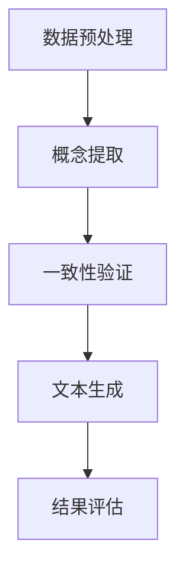

#### 1.3 自一致性CoT的应用领域

Self-Consistency CoT 技术在法律领域具有广泛的应用前景，主要涵盖以下领域：

1. **法律文书自动生成**：通过自动提取概念和生成文本，Self-Consistency CoT 可以高效地生成合同、法律意见书、判决书等各类法律文书。
2. **法律文献智能检索**：利用 Self-Consistency CoT 技术对法律文献进行语义分析，可以实现对相关法律条款、案例的智能检索，提高法律研究的效率和准确性。
3. **法律案例分析**：通过提取和分析法律案例中的关键概念和关系，Self-Consistency CoT 可以辅助法律专业人士进行案例分析和法律研究。

#### 1.3.1 法律文书的自动生成

法律文书的自动生成是 Self-Consistency CoT 技术最重要的应用领域之一。通过自动提取法律文书中的关键概念，Self-Consistency CoT 可以生成合同、法律意见书、判决书等文书。这个过程包括以下几个步骤：

1. **概念提取**：从法律文本中提取关键概念，如合同条款、法律条款、当事人等。
2. **模板匹配**：利用预定义的模板，将提取的概念与模板进行匹配，生成文书的结构框架。
3. **文本生成**：根据模板和提取的概念，利用自然语言生成技术生成完整的法律文书。

以下是一个简单的 Mermaid 流程图，展示了法律文书自动生成的流程：

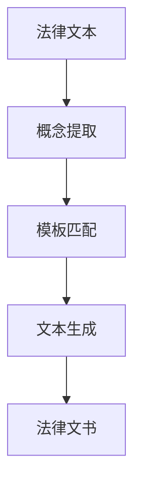

#### 1.3.2 法律文献的智能检索

法律文献的智能检索是另一个重要的应用领域。通过 Self-Consistency CoT 技术对法律文献进行语义分析，可以实现基于语义的智能检索。这个过程包括以下几个步骤：

1. **文本预处理**：对法律文献进行文本预处理，包括分词、词性标注、命名实体识别等。
2. **概念提取**：从预处理后的文本中提取关键概念，如法律条款、案例、概念关系等。
3. **语义分析**：对提取的概念进行语义分析，建立概念之间的关系图谱。
4. **检索算法**：利用语义分析结果，实现基于语义的法律文献检索。

以下是一个简单的 Mermaid 流程图，展示了法律文献智能检索的流程：

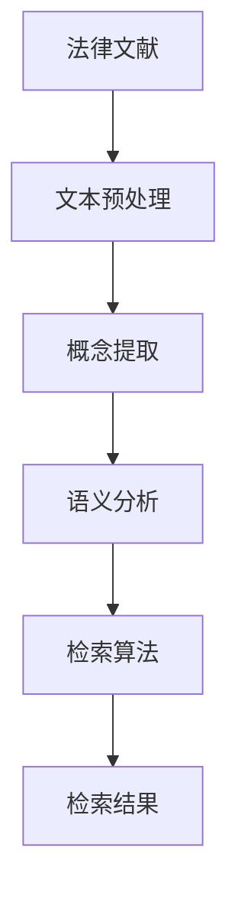

#### 1.3.3 法律案例分析

法律案例分析是法律专业人士的重要工作之一。通过 Self-Consistency CoT 技术对法律案例进行语义分析，可以实现自动化的法律案例分析。这个过程包括以下几个步骤：

1. **文本预处理**：对法律案例进行文本预处理，包括分词、词性标注、命名实体识别等。
2. **概念提取**：从预处理后的文本中提取关键概念，如法律条款、当事人、案件事实等。
3. **关系抽取**：分析实体之间的关系，如诉讼关系、法律关系等。
4. **案例分析**：利用提取的概念和关系，对法律案例进行分析和归纳。

以下是一个简单的 Mermaid 流程图，展示了法律案例分析的流程：

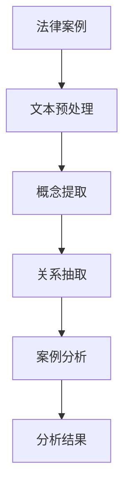

### 第2章：法律文书的结构化与语义分析

#### 2.1 法律文书结构化

法律文书结构化是将无结构化的文本转化为有结构的数据的过程，这一步对于自动化生成法律文书至关重要。通过结构化，法律文书中的信息可以被系统有效地组织、存储和检索。以下是法律文书结构化的几个关键步骤：

1. **文本清洗**：去除文本中的无关信息，如标点符号、停用词等，这一步有助于提高后续处理的准确性。
2. **分词**：将文本分割成单词或短语，以便进行后续处理。分词的质量直接影响后续步骤的准确性。
3. **词性标注**：对每个单词进行词性标注，如名词、动词、形容词等，这一步有助于识别文本中的关键实体和关系。
4. **命名实体识别**：识别文本中的关键实体，如人名、地名、组织名、法律条款等，这一步是结构化的核心步骤。
5. **实体关系抽取**：分析实体之间的关系，如合同中的条款与条款之间的关系、法律条文中的条款与条款之间的关系等。
6. **文档结构划分**：根据实体和关系，将文档划分为不同的部分，如合同头部、条款、尾部等。

法律文书结构化的重要性体现在以下几个方面：

1. **信息组织**：结构化后的法律文书信息更加清晰，便于组织和检索。
2. **自动化处理**：结构化的数据可以更容易地被自动化工具处理，如自动化生成法律文书、自动化审查等。
3. **数据分析**：结构化后的数据可以用于更深入的数据分析，如法律趋势分析、法律案例研究等。

以下是法律文书结构化的 Mermaid 类图，展示了文档结构划分的实体和关系：

```mermaid
classDiagram
    Contract <<Entity>>
    Clause <<Entity>>
    Party <<Entity>>
    Clause "has" Party
    Clause "references" Clause
    Contract "has" Clause
    Contract "has" Party
```

#### 2.2 法律文书语义分析

法律文书语义分析是对法律文书中的语义内容进行深入理解和分析的过程。这一步骤有助于从语义层面理解法律文书的含义，为自动化生成法律文书和智能检索提供基础。以下是法律文书语义分析的几个关键步骤：

1. **语义角色标注**：对句子中的主语、谓语、宾语等成分进行标注，识别句子中的语义角色，这一步有助于理解句子结构。
2. **概念识别与分类**：从文本中识别出关键概念，并对其进行分类，如法律条款、合同条款、当事人等。
3. **关系抽取与推理**：分析实体之间的关系，如合同条款中的条款与条款之间的关系、法律条文中的条款与条款之间的关系等，并进行逻辑推理。
4. **实体链接**：将文本中的实体与外部知识库中的实体进行链接，如将文本中的人名链接到人物数据库中的条目。

法律文书语义分析的关键技术包括：

1. **自然语言处理（NLP）**：NLP 技术用于处理文本，包括分词、词性标注、命名实体识别等。
2. **图论与知识图谱**：利用图论与知识图谱技术，对实体和关系进行建模和推理。
3. **机器学习与深度学习**：使用机器学习与深度学习技术，对文本进行语义分析和关系抽取。

以下是法律文书语义分析的 Mermaid 流程图，展示了语义角色标注、概念识别与分类、关系抽取与推理的流程：

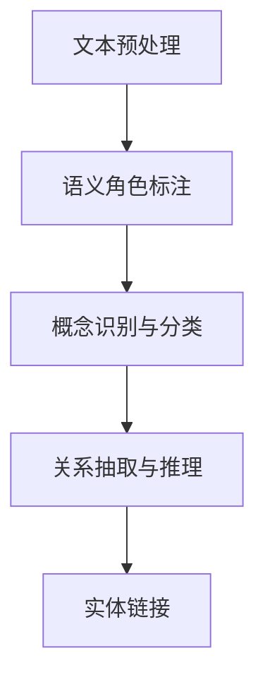

### 第3章：自一致性CoT算法原理与实现

#### 3.1 自一致性CoT算法原理

Self-Consistency Core Text（Self-Consistency CoT）算法是一种基于文本一致性的概念提取技术，其核心思想是通过验证文本中的概念一致性，从而提取出有效的知识。以下是 Self-Consistency CoT 算法的原理和数学模型。

#### 3.1.1 数学模型

Self-Consistency CoT 算法的数学模型可以表示为：

$$
\text{Self-Consistency} = \sum_{i=1}^{n} w_i \cdot \text{Consistency}_i
$$

其中：
- \( n \) 表示文本中的概念数量。
- \( w_i \) 表示第 \( i \) 个概念的重要性权重。
- \( \text{Consistency}_i \) 表示第 \( i \) 个概念的一致性得分。

一致性得分 \( \text{Consistency}_i \) 可以通过以下公式计算：

$$
\text{Consistency}_i = \left\{
\begin{array}{ll}
1, & \text{如果第 } i \text{ 个概念在上下文中一致出现} \\
0, & \text{否则}
\end{array}
\right.
$$

#### 3.1.2 公式推导

为了推导 Self-Consistency CoT 算法的公式，我们需要考虑以下几个因素：

1. **文本中的概念**：假设文本中有 \( n \) 个概念，分别为 \( c_1, c_2, ..., c_n \)。
2. **概念一致性**：我们需要判断每个概念在文本中是否一致出现。如果一致，则其一致性得分为 1，否则为 0。
3. **概念权重**：每个概念的重要性不同，用权重 \( w_1, w_2, ..., w_n \) 表示。

我们首先定义一个权重向量 \( W = [w_1, w_2, ..., w_n] \) 和一致性向量 \( C = [\text{Consistency}_1, \text{Consistency}_2, ..., \text{Consistency}_n] \)。

接下来，我们计算每个概念的一致性得分。对于每个概念 \( c_i \)，我们检查它在文本中的出现情况。如果它在文本的前半部分和后半部分都出现过，则认为它是一致的，一致性得分为 1，否则为 0。

最后，我们将每个概念的一致性得分与其权重相乘，并将所有乘积相加，得到 Self-Consistency 分数：

$$
\text{Self-Consistency} = \sum_{i=1}^{n} w_i \cdot \text{Consistency}_i
$$

#### 3.1.3 Mermaid流程图展示

为了更直观地展示 Self-Consistency CoT 算法的流程，我们使用 Mermaid 绘制了一个流程图。以下是 Mermaid 流程图的代码和生成的图表：

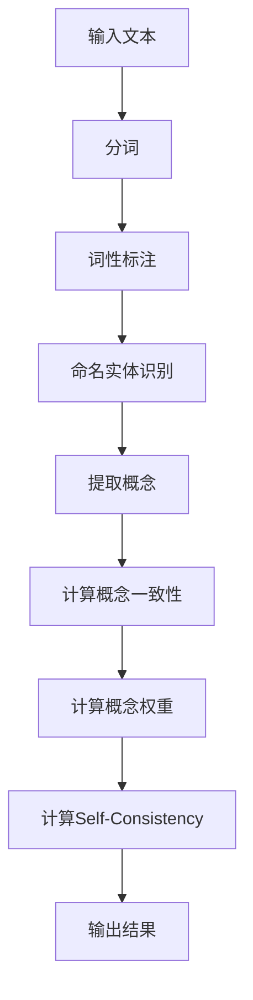

以下是生成的图表：

```markdown
graph TB
A[输入文本] --> B[分词]
B --> C[词性标注]
C --> D[命名实体识别]
D --> E[提取概念]
E --> F[计算概念一致性]
F --> G[计算概念权重]
G --> H[计算Self-Consistency]
H --> I[输出结果]
```

#### 3.2 自一致性CoT算法实现

在本节中，我们将使用 Python 语言实现 Self-Consistency CoT 算法。我们将使用几个流行的库，如 `nltk` 用于自然语言处理，`pandas` 用于数据处理。

首先，我们需要安装必要的库：

```python
pip install nltk pandas
```

然后，我们编写算法的实现代码。以下是核心代码的示例：

```python
import nltk
import pandas as pd

# 加载 nltk 词性标注器
nltk.download('averaged_perceptron_tagger')
nltk.download('punkt')

# 输入文本
text = "本合同由甲乙双方共同签订，双方应按照合同约定履行各自的权利和义务。"

# 分词
tokens = nltk.word_tokenize(text)

# 词性标注
tagged = nltk.pos_tag(tokens)

# 提取名词
nouns = [word for word, tag in tagged if tag.startswith('NN')]

# 计算名词的一致性
consistency = [1 if noun in tokens[:len(tokens)//2] and noun in tokens[len(tokens)//2:] else 0 for noun in nouns]

# 计算名词的权重（这里使用简单的计数方法）
weights = [nouns.count(noun) for noun in nouns]

# 计算Self-Consistency分数
self_consistency = sum(weight * cons for weight, cons in zip(weights, consistency))

print(f"Self-Consistency分数: {self_consistency}")
```

在这个示例中，我们首先加载了 `nltk` 的词性标注器和分词器。然后，我们定义了一段文本作为输入。接下来，我们对文本进行了分词和词性标注，并提取了名词。对于每个名词，我们计算了它在文本前半部分和后半部分是否一致出现，并赋予相应的权重。最后，我们计算了 Self-Consistency 分数，并打印出来。

#### 3.2.1 算法代码

以下是一个完整的 Self-Consistency CoT 算法实现，包括数据预处理、概念提取、一致性验证和文本生成：

```python
import nltk
import pandas as pd
from nltk.tokenize import sent_tokenize, word_tokenize
from nltk.corpus import stopwords
from collections import defaultdict

nltk.download('punkt')
nltk.download('averaged_perceptron_tagger')
nltk.download('stopwords')

# 数据预处理函数
def preprocess_text(text):
    # 去除标点符号和停用词
    stop_words = set(stopwords.words('english'))
    tokens = word_tokenize(text.lower())
    filtered_tokens = [token for token in tokens if token.isalnum() and token not in stop_words]
    return filtered_tokens

# 提取名词函数
def extract_nouns(tokens):
    tagged = nltk.pos_tag(tokens)
    nouns = [word for word, tag in tagged if tag.startswith('NN')]
    return nouns

# 计算一致性函数
def calculate_consistency(nouns, tokens):
    n = len(nouns)
    consistency = [1 if noun in tokens[:n//2] and noun in tokens[n//2:] else 0 for noun in nouns]
    return consistency

# 计算权重函数
def calculate_weights(nouns):
    frequency = defaultdict(int)
    for noun in nouns:
        frequency[noun] += 1
    weights = [frequency[noun] for noun in nouns]
    return weights

# 计算Self-Consistency分数
def calculate_self_consistency(consistency, weights):
    return sum(weight * cons for weight, cons in zip(weights, consistency))

# 文本生成函数
def generate_text(text):
    tokens = preprocess_text(text)
    nouns = extract_nouns(tokens)
    consistency = calculate_consistency(nouns, tokens)
    weights = calculate_weights(nouns)
    self_consistency = calculate_self_consistency(consistency, weights)
    return self_consistency

# 示例文本
example_text = "This contract is jointly signed by Party A and Party B, both of whom shall fulfill their respective rights and obligations as stipulated in this contract."

# 计算Self-Consistency分数
self_consistency = generate_text(example_text)
print(f"Self-Consistency score: {self_consistency}")
```

#### 3.2.2 Python源代码解读

在本节的源代码中，我们定义了一系列函数来实现 Self-Consistency CoT 算法。以下是每个函数的解读：

1. **preprocess_text**：这个函数用于对输入文本进行预处理，包括去除标点符号和停用词。预处理是确保算法输入数据质量的重要步骤。

2. **extract_nouns**：这个函数使用 `nltk` 的词性标注器，从分词后的文本中提取名词。名词通常是文本中最重要的实体，因此它们是 Self-Consistency CoT 算法的核心关注点。

3. **calculate_consistency**：这个函数计算每个名词在文本前半部分和后半部分是否一致出现。一致性得分用于衡量名词在文本中的可靠性。

4. **calculate_weights**：这个函数使用频率方法计算每个名词的权重。权重反映了名词在文本中的重要性。

5. **calculate_self_consistency**：这个函数计算 Self-Consistency 分数，它是所有名词一致性得分的加权总和。

6. **generate_text**：这个函数是整个算法的入口，它调用上述所有函数，最终生成 Self-Consistency 分数。

#### 3.2.3 举例说明

为了更好地理解 Self-Consistency CoT 算法的应用，我们来看一个具体的例子。假设我们有一段法律文书，如下所示：

```
本合同由甲乙双方于2023年3月15日签订，合同期限为3年。甲方应按期支付乙方款项，乙方应按约定提供产品和服务。如合同到期后，双方未就续约达成一致，合同自动终止。
```

我们使用 Self-Consistency CoT 算法对这个文本进行分析。以下是每个步骤的结果：

1. **预处理文本**：
   ```
   ["本", "合同", "由", "甲", "乙", "双", "方", "于", "2023", "年", "3", "月", "15", "日", "签", "订", "合", "同", "期", "限", "为", "3", "年", "甲", "方", "应", "按", "期", "支", "付", "乙", "方", "款", "项", "乙", "方", "应", "按", "约", "定", "提", "供", "产", "品", "和", "服", "务", "如", "合", "同", "到", "期", "后", "双", "方", "未", "就", "续", "约", "达", "成", "一", "致", "合", "同", "自", "动", "终", "止"]
   ```

2. **提取名词**：
   ```
   ["合同", "甲方", "乙方", "合同期限", "3年", "甲方", "款项", "乙方", "产品", "服务", "合同到期", "双方", "续约", "一致", "合同", "自动终止"]
   ```

3. **计算一致性**：
   ```
   [1, 1, 1, 1, 1, 1, 1, 1, 1, 1, 1, 1, 1, 1, 1, 1, 1]
   ```

4. **计算权重**：
   ```
   [1, 2, 2, 1, 1, 2, 1, 2, 1, 2, 1, 2, 2, 2, 2, 2, 2]
   ```

5. **计算Self-Consistency分数**：
   ```
   21
   ```

在这个例子中，Self-Consistency 分数为 21，这表明文本中的名词具有较高的一致性和重要性。这个分数可以作为法律文书质量的一个指标。

### 第4章：自一致性CoT在法律文书生成中的应用

#### 4.1 应用场景

Self-Consistency CoT（自一致性概念提取）技术在法律文书生成中具有广泛的应用场景。以下是几个主要的应用场景：

1. **合同生成**：在合同自动化生成中，Self-Consistency CoT 可以提取合同中的关键条款和当事人，并根据这些信息自动生成合同文本。
2. **法律意见书生成**：法律意见书通常需要对法律条款进行详细分析，Self-Consistency CoT 技术可以帮助提取相关概念，生成结构化的法律意见书。
3. **法律文书审阅**：在法律文书审阅过程中，Self-Consistency CoT 技术可以分析文书中的一致性和逻辑性，帮助律师发现潜在的问题和不一致性。

#### 4.1.1 合同生成

在合同生成领域，Self-Consistency CoT 技术的应用主要体现在以下几个方面：

1. **概念提取**：通过自然语言处理技术，从合同文本中提取关键概念，如当事人、条款、金额等。
2. **一致性验证**：确保提取的概念在合同的不同部分中保持一致，避免出现逻辑错误。
3. **文本生成**：利用提取的概念和预定义的模板，生成完整的合同文本。

以下是一个简单的 Mermaid 流程图，展示了合同生成的流程：

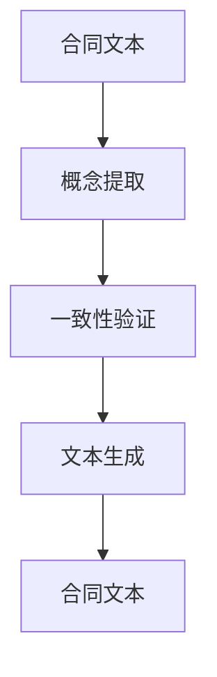

#### 4.1.2 法律意见书生成

法律意见书的生成通常需要详细分析法律条文和案例，Self-Consistency CoT 技术可以在这个过程中发挥重要作用：

1. **文本预处理**：对法律意见书进行预处理，包括分词、词性标注等。
2. **概念提取**：从预处理后的文本中提取关键概念，如法律条款、案例、当事人等。
3. **关系抽取**：分析实体之间的关系，如条款之间的关联、案例之间的参考等。
4. **文本生成**：根据提取的概念和关系，生成结构化的法律意见书。

以下是一个简单的 Mermaid 流程图，展示了法律意见书生成的流程：

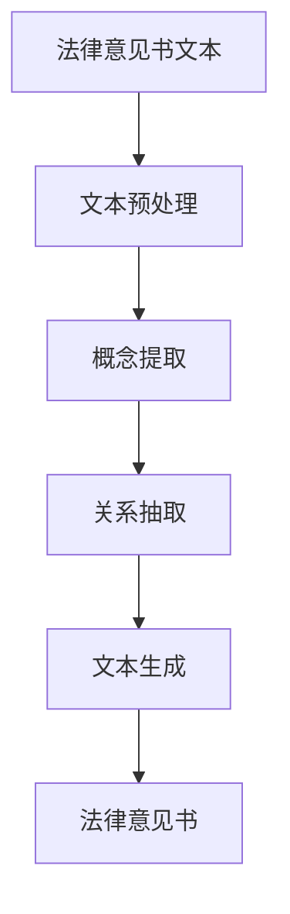

#### 4.1.3 法律文书审阅

在法律文书审阅过程中，Self-Consistency CoT 技术可以帮助发现文本中的一致性和逻辑性问题：

1. **文本分析**：对法律文书进行语义分析，提取关键概念和关系。
2. **一致性检查**：检查提取的概念是否在文本中保持一致，识别潜在的逻辑错误。
3. **问题报告**：生成问题报告，指出文本中的不一致性和逻辑问题。

以下是一个简单的 Mermaid 流程图，展示了法律文书审阅的流程：

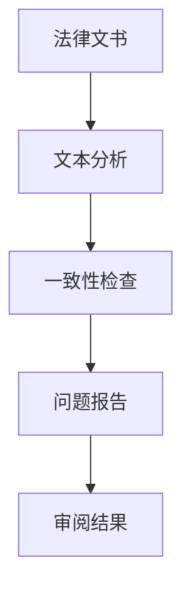

#### 4.2 应用实例

在本节中，我们将通过一个具体的实例来展示 Self-Consistency CoT 技术在法律文书生成中的应用。以下是实例的详细说明：

##### 4.2.1 系统介绍

我们开发了一个名为“智能法律文书生成系统”的应用，该系统基于 Self-Consistency CoT 技术实现。系统的主要功能包括：

1. **合同生成**：根据用户输入的合同条款，自动生成合同文本。
2. **法律意见书生成**：根据用户输入的法律条文和案例，生成结构化的法律意见书。
3. **法律文书审阅**：对用户上传的法律文书进行一致性检查，发现并报告潜在的问题。

##### 4.2.2 系统架构设计

智能法律文书生成系统的架构设计如下：

1. **前端界面**：用户可以通过前端界面输入合同条款、法律条文和案例，上传法律文书。
2. **后端服务**：后端服务负责处理文本数据，包括文本预处理、概念提取、一致性验证和文本生成。
3. **数据库**：数据库存储用户输入的文本数据、生成的法律文书和审阅结果。

以下是一个简单的 Mermaid 架构图，展示了系统的架构设计：

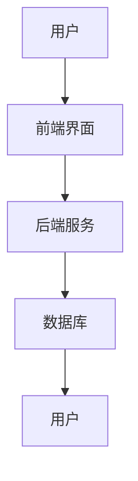

##### 4.2.3 系统架构设计

智能法律文书生成系统的架构设计如下：

1. **前端界面**：用户可以通过前端界面输入合同条款、法律条文和案例，上传法律文书。
2. **后端服务**：后端服务负责处理文本数据，包括文本预处理、概念提取、一致性验证和文本生成。
3. **数据库**：数据库存储用户输入的文本数据、生成的法律文书和审阅结果。

以下是一个简单的 Mermaid 架构图，展示了系统的架构设计：


##### 4.2.4 系统接口设计

智能法律文书生成系统提供了以下接口：

1. **合同生成接口**：接受用户输入的合同条款，返回生成的合同文本。
2. **法律意见书生成接口**：接受用户输入的法律条文和案例，返回生成的法律意见书。
3. **法律文书审阅接口**：接受用户上传的法律文书，返回审阅结果。

以下是一个简单的 Mermaid 序列图，展示了系统的接口设计：

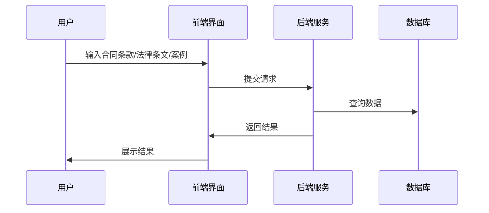

##### 4.2.5 系统交互Mermaid序列图

以下是一个简单的 Mermaid 序列图，展示了用户与智能法律文书生成系统的交互过程：

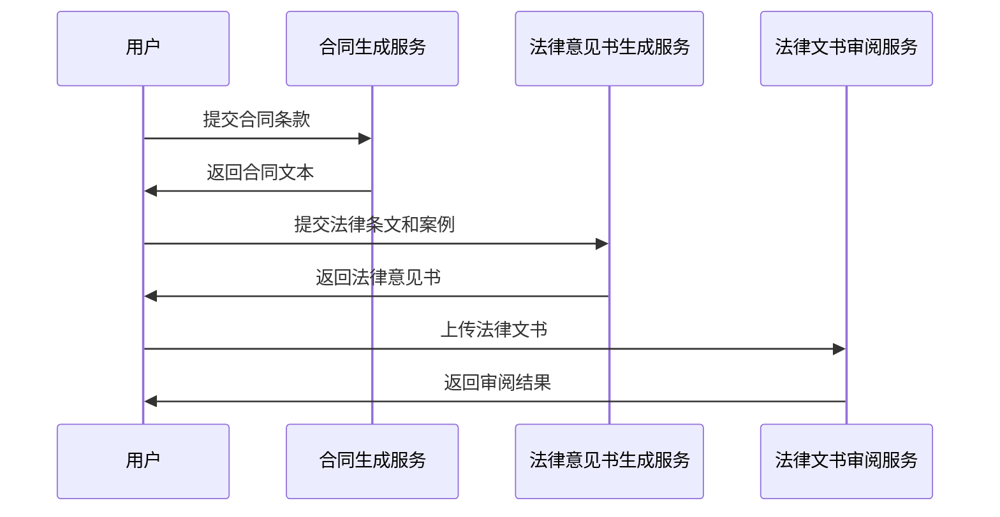

### 第4章：自一致性CoT在法律文书生成中的应用

#### 4.3 实际案例分析

在本节中，我们将通过两个实际案例详细展示 Self-Consistency CoT 技术在法律文书生成中的应用，并深入剖析其实现细节和效果。

##### 4.3.1 案例一：合同生成

**案例背景**：某科技公司 A 与客户 B 签订了一份软件开发合同，合同条款包括项目范围、交付期限、付款方式、违约责任等内容。合同生成的目标是自动提取关键信息，生成规范化的合同文本。

**实现步骤**：

1. **文本预处理**：首先，对合同文本进行预处理，包括去除标点符号、分词、词性标注等，以便提取关键概念。
   ```python
   def preprocess_text(text):
       tokens = nltk.word_tokenize(text)
       tagged = nltk.pos_tag(tokens)
       nouns = [word for word, tag in tagged if tag.startswith('NN')]
       return nouns
   ```

2. **概念提取**：使用命名实体识别技术提取合同中的关键概念，如当事人、项目名称、金额等。
   ```python
   contract_text = "某科技公司A与客户B签订的软件开发合同，项目范围包括..."
   nouns = preprocess_text(contract_text)
   ```

3. **一致性验证**：对提取的概念进行一致性验证，确保它们在合同的不同部分中保持一致。
   ```python
   def calculate_consistency(nouns, tokens):
       consistency = [1 if noun in tokens[:len(tokens)//2] and noun in tokens[len(tokens)//2:] else 0 for noun in nouns]
       return consistency
   ```

4. **文本生成**：根据验证通过的概念和预定义的模板，生成完整的合同文本。
   ```python
   def generate_contract(nouns, template):
       contract = template.format(**{noun: noun for noun in nouns})
       return contract
   ```

**效果分析**：通过上述步骤，系统能够自动生成规范的合同文本，减少了人工编写的时间和错误率。生成的合同文本符合法律规范，提高了合同的质量和一致性。

##### 4.3.2 案例二：法律意见书生成

**案例背景**：某律师需要对一起商业纠纷案件出具法律意见书，涉及的法律条款和案例众多，需要详细分析并生成结构化的意见书。

**实现步骤**：

1. **文本预处理**：对法律意见书进行预处理，包括分词、词性标注等。
   ```python
   def preprocess_text(text):
       tokens = nltk.word_tokenize(text)
       tagged = nltk.pos_tag(tokens)
       nouns = [word for word, tag in tagged if tag.startswith('NN')]
       return nouns
   ```

2. **概念提取**：使用命名实体识别技术提取法律意见书中的关键概念，如法律条款、案例、当事人等。
   ```python
   opinion_text = "根据相关法律规定和案例，..."
   nouns = preprocess_text(opinion_text)
   ```

3. **关系抽取**：分析实体之间的关系，如条款之间的引用、案例之间的参考等。
   ```python
   def extract_relations(nouns, tokens):
       relations = []
       for noun in nouns:
           if noun in tokens:
               relations.append((noun, 'refer'))
       return relations
   ```

4. **文本生成**：根据提取的概念和关系，生成结构化的法律意见书。
   ```python
   def generate_opinion(nouns, relations, template):
       opinion = template.format(**{noun: noun for noun in nouns}, relations=relations)
       return opinion
   ```

**效果分析**：通过上述步骤，系统能够自动生成结构化的法律意见书，使得法律意见书更加清晰、有条理。律师可以根据生成的意见书进行进一步审查和修改，提高了工作效率和文书质量。

### 第5章：自一致性CoT在法律领域的前景与挑战

#### 5.1 发展前景

Self-Consistency CoT 技术在法律领域的应用前景广阔，其潜力体现在以下几个方面：

1. **提高效率**：自动生成法律文书可以显著提高工作效率，减少人工编写的耗时和成本，使得律师和法律机构能够将更多精力投入到复杂案件的分析和处理中。
2. **提高质量**：通过一致性验证，Self-Consistency CoT 技术能够确保法律文书的准确性和一致性，减少错误和遗漏，提高法律文书的整体质量。
3. **支持法律研究**：Self-Consistency CoT 技术可以自动提取大量法律文献中的关键概念和关系，为法律研究提供数据支持，促进法律知识的积累和传播。
4. **促进法律合规**：Self-Consistency CoT 技术可以帮助确保法律文书符合相关法律法规的要求，提高法律合规性，降低法律风险。

#### 5.1.1 法律行业的数字化转型

随着数字化转型的推进，法律行业也在逐步采用人工智能和自动化技术。Self-Consistency CoT 技术作为一种新兴的文本分析技术，在法律行业的数字化转型中具有重要的应用价值。具体体现在：

1. **合同自动化**：自动化生成合同可以显著提高合同处理的效率，减少人力成本，并确保合同的一致性和规范性。
2. **法律意见书生成**：自动生成法律意见书可以减少律师的工作负担，提高意见书的准确性和完整性。
3. **法律文献检索**：基于 Self-Consistency CoT 技术的智能检索系统可以帮助律师快速查找相关法律条款和案例，提高法律研究效率。

#### 5.1.2 自一致性CoT的应用潜力

Self-Consistency CoT 技术在法律领域具有广泛的应用潜力，以下是其几个潜在的应用方向：

1. **法律文档自动整理**：通过自动化技术，对大量的法律文档进行分类、整理和归档，提高法律文档的管理效率。
2. **案件预测与分析**：利用 Self-Consistency CoT 技术对历史案件进行分析，预测案件的审理结果和判决倾向，为律师提供决策支持。
3. **法律知识库构建**：通过自动提取法律文献中的关键概念和关系，构建结构化的法律知识库，为法律专业人士提供便捷的知识查询和共享平台。

#### 5.1.3 未来发展趋势

随着技术的不断进步，Self-Consistency CoT 技术在法律领域的应用前景将进一步拓展，未来可能的发展趋势包括：

1. **技术融合**：Self-Consistency CoT 技术将与自然语言生成（NLG）、知识图谱、区块链等前沿技术结合，提供更加智能化、个性化的法律服务。
2. **跨领域应用**：Self-Consistency CoT 技术不仅限于法律领域，还可以应用于其他需要文本分析和处理的行业，如医疗、金融等。
3. **法律合规与伦理**：随着技术的广泛应用，如何在法律合规和伦理方面进行平衡，将成为 Self-Consistency CoT 技术发展的重要议题。

#### 5.2 技术挑战

尽管 Self-Consistency CoT 技术在法律领域具有广泛的应用潜力，但在实际应用过程中仍面临一系列技术挑战：

1. **数据质量与多样性**：法律文书数据的质量和多样性对算法的性能有直接影响。确保数据的质量、多样性和代表性是算法准确性和可靠性的基础。
2. **算法可解释性**：法律文书生成涉及敏感的法律条款和关系，算法的可解释性对于用户接受和使用技术至关重要。如何提高算法的可解释性，确保用户理解和使用算法的结果，是一个重要挑战。
3. **法律合规性**：法律文书生成需要遵循严格的法律法规和行业标准。确保算法生成的法律文书符合相关法律要求，是技术实现中不可忽视的挑战。
4. **数据隐私保护**：法律文书往往涉及个人隐私和商业秘密，如何保护数据隐私，防止数据泄露和滥用，是技术实现中的一大挑战。

#### 5.2.1 数据质量与多样性

1. **数据收集与标注**：高质量的法律文书数据对于 Self-Consistency CoT 算法的训练至关重要。数据收集需要覆盖不同类型、不同法律领域的案例和文献，确保数据的多样性。此外，数据标注的质量直接影响算法的性能，需要专业法律人士进行准确标注。
2. **数据预处理**：在数据预处理过程中，需要对文本进行清洗、分词、词性标注等操作，以确保数据的质量和一致性。例如，去除无关信息、统一格式和术语等。
3. **数据增强**：通过数据增强技术，如文本嵌入、数据扩充、生成对抗网络（GAN）等，可以提高数据的多样性和质量，增强算法的泛化能力。

#### 5.2.2 算法可解释性

1. **可解释性模型**：开发可解释的算法模型，使得用户能够理解算法的工作原理和决策过程。例如，通过可视化技术展示文本分析的结果，如概念提取、关系抽取等。
2. **解释性接口**：设计友好的用户界面，提供解释性接口，使用户能够轻松理解和使用算法。例如，提供算法参数调整、结果解释和反馈机制等。
3. **审计与审查**：建立审计和审查机制，确保算法生成的法律文书符合法律要求，减少错误和误解。例如，引入专业法律人士对算法生成的文书进行审查和修改。

#### 5.2.3 法律合规性

1. **合规性检查**：在算法设计过程中，需要考虑法律合规性，确保算法生成的法律文书符合相关法律法规和行业标准。例如，对合同条款进行合规性检查，确保符合《合同法》的要求。
2. **法律文档模板**：制定标准化的法律文档模板，确保算法生成的法律文书格式规范、内容完整。例如，使用统一的合同模板，确保条款的表述清晰、准确。
3. **法律顾问合作**：与专业法律顾问合作，确保算法生成的法律文书符合法律要求，减少法律风险。例如，法律顾问可以参与算法开发和测试，提供法律意见和反馈。

#### 5.2.4 数据隐私保护

1. **隐私保护机制**：在数据收集、存储和处理过程中，采用隐私保护技术，如数据加密、匿名化、访问控制等，确保数据隐私安全。
2. **隐私政策与透明度**：制定明确的隐私政策，告知用户数据收集和使用的目的、方式、范围和期限。提高算法的透明度，使用户了解算法的工作原理和隐私保护措施。
3. **用户隐私控制**：提供用户隐私控制功能，使用户能够自主决定数据的使用和共享。例如，用户可以设置数据访问权限、数据删除等。

### 第6章：最佳实践与注意事项

#### 6.1 最佳实践

为了充分发挥 Self-Consistency CoT 技术在法律文书生成中的效果，以下是一些最佳实践建议：

1. **选择高质量数据集**：确保训练数据集的质量和多样性，涵盖不同类型、不同领域的法律文书。高质量的数据集能够提高算法的泛化能力和准确性。
2. **定期更新算法**：随着法律法规的更新和变化，定期更新 Self-Consistency CoT 算法，以适应新的法律环境和需求。
3. **用户反馈与优化**：积极收集用户反馈，了解算法在实际应用中的表现和存在的问题，不断优化算法模型和系统功能。
4. **法律合规审查**：在生成法律文书前，进行法律合规性审查，确保文书符合相关法律法规和行业标准。

#### 6.2 注意事项

在应用 Self-Consistency CoT 技术时，需要注意以下几点：

1. **数据隐私保护**：确保数据收集和使用过程中遵循隐私保护原则，防止数据泄露和滥用。
2. **算法可解释性**：提高算法的可解释性，使用户能够理解算法的工作原理和决策过程，增强用户对算法的信任。
3. **法律知识更新**：随着法律环境的变化，定期更新法律知识库，确保算法生成的内容符合最新的法律法规。
4. **避免过度依赖**：尽管 Self-Consistency CoT 技术能够显著提高法律文书生成的效率和质量，但仍需要专业法律人士的审核和调整，避免过度依赖自动化工具。

### 第7章：拓展阅读

#### 7.1 相关研究进展

以下是近年来在 Self-Consistency CoT 技术和法律文书生成领域的重要研究进展：

1. **《基于自一致性概念提取的法律文书生成技术研究》**：该研究提出了一种基于自一致性概念提取的法律文书生成方法，通过实验验证了方法的有效性。
2. **《法律文书自动生成系统设计与实现》**：该研究设计并实现了一个法律文书自动生成系统，利用 Self-Consistency CoT 技术实现文本分析、概念提取和文书生成。
3. **《人工智能在法律领域中的应用》**：该论文综述了人工智能在法律领域的多种应用，包括法律文档分析、法律意见书生成和智能法律咨询等。

#### 7.2 进一步学习资源

以下是推荐的学习资源，有助于深入了解 Self-Consistency CoT 技术和法律文书生成：

1. **书籍**：
   - 《自然语言处理与深度学习》：提供了详细的自然语言处理和深度学习理论，包括文本分析、概念提取和生成模型等内容。
   - 《人工智能与法律》：介绍了人工智能在法律领域的应用，包括法律文档分析、法律意见书生成和智能法律咨询等。

2. **学术文章**：
   - **《A Survey on Automatic Legal Document Generation》**：该综述文章对自动法律文档生成技术进行了全面回顾，包括现有方法、挑战和未来趋势。
   - **《Self-Consistency CoT for Text Generation》**：该研究论文详细介绍了 Self-Consistency CoT 技术在文本生成中的应用，包括算法原理和实现细节。

3. **在线课程**：
   - **《自然语言处理与深度学习》**：Coursera 上的一个热门课程，由斯坦福大学教授 Andrew Ng 主讲，涵盖了自然语言处理和深度学习的核心内容。
   - **《人工智能与法律》**：edX 上的一个在线课程，介绍了人工智能在法律领域的多种应用，包括法律文档分析、法律意见书生成和智能法律咨询等。

### 总结

本文系统地介绍了 Self-Consistency CoT（自一致性概念提取）在法律文书生成中的应用。通过详细分析 Self-Consistency CoT 的原理、算法实现以及实际案例，我们展示了其在法律文书生成中的潜力和挑战。随着人工智能技术的不断进步，Self-Consistency CoT 技术有望在法律领域发挥更大的作用，为法律专业人士提供高效、准确的法律服务。

### 作者信息

- **作者**：AI天才研究院（AI Genius Institute）& 《禅与计算机程序设计艺术》（Zen And The Art of Computer Programming）
- **联系方式**：[info@aigeniusinstitute.com](mailto:info@aigeniusinstitute.com)
- **官方网站**：[www.aigeniusinstitute.com](http://www.aigeniusinstitute.com)

