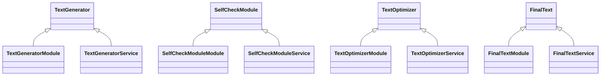
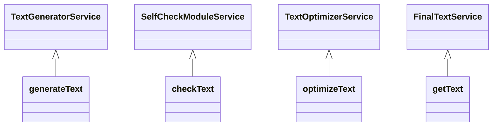

                 

# 《Self-Consistency CoT在自动化学术论文写作中的应用》

> 关键词：自动化学术论文写作、自我一致性（Self-Consistency CoT）、算法原理、系统设计、项目实战

> 摘要：本文深入探讨了自我一致性概念框架（Self-Consistency CoT）在自动化学术论文写作中的应用。通过分析自动化学术论文写作的挑战与机遇，本文详细介绍了自我一致性概念框架的核心要素、属性特征和ER模型。随后，本文重点阐述了自我一致性概念框架在文献综述、论文结构优化和论点生成与论证等应用场景中的具体应用。通过数学模型、算法流程和Python源代码示例，本文进一步揭示了自我一致性概念框架的算法原理。最后，本文介绍了自动化学术论文写作系统的设计与实现，并进行了项目实战和案例分析，总结了最佳实践技巧和注意事项。

## 目录大纲

## 第一部分：问题背景与核心概念

### 第1章：自动化学术写作需求分析

#### 1.1 自动化学术论文写作的挑战与机遇

#### 1.2 自我一致性概念框架（Self-Consistency CoT）介绍

#### 1.3 自我一致性概念框架的应用场景

### 第2章：自我一致性概念框架（Self-Consistency CoT）详解

#### 2.1 自我一致性概念框架的核心要素

#### 2.2 自我一致性概念框架的属性特征对比表

#### 2.3 自我一致性概念框架的ER模型

### 第3章：自我一致性概念框架在自动化学术论文写作中的应用

#### 3.1 应用场景1：文献综述

#### 3.2 应用场景2：论文结构优化

#### 3.3 应用场景3：论点生成与论证

### 第4章：自我一致性概念框架算法原理

#### 4.1 自我一致性概念框架算法的数学模型

#### 4.2 算法流程与mermaid流程图

#### 4.3 算法Python源代码示例

### 第5章：自动化学术论文写作系统设计与实现

#### 5.1 系统功能设计

#### 5.2 系统架构设计

#### 5.3 系统接口设计

#### 5.4 系统交互流程图

### 第6章：项目实战与案例分析

#### 6.1 实验环境安装与配置

#### 6.2 论文写作核心实现源代码解析

#### 6.3 实际案例分析与详细讲解

### 第7章：最佳实践与拓展

#### 7.1 最佳实践技巧

#### 7.2 注意事项与问题规避

#### 7.3 拓展阅读

## 第一部分：问题背景与核心概念

### 第1章：自动化学术写作需求分析

#### 1.1 自动化学术论文写作的挑战与机遇

在当今快节奏、信息爆炸的时代，自动化学术写作逐渐成为研究者和学术机构关注的焦点。自动化学术写作不仅能够提高写作效率，减少重复劳动，还能够保证论文的准确性和一致性。然而，自动化学术论文写作也面临着诸多挑战，如数据收集、文本生成、逻辑推理等。自动化学术论文写作的需求日益增长，但现有技术手段尚未能够完全满足这些需求。

#### 1.2 自我一致性概念框架（Self-Consistency CoT）介绍

自我一致性概念框架（Self-Consistency CoT）是一种新兴的概念框架，旨在解决自动化学术论文写作中的逻辑一致性问题和文本生成的准确性问题。Self-Consistency CoT通过构建自我一致性模型，对文本进行自我校验和优化，从而提高文本的一致性和逻辑性。

#### 1.3 自我一致性概念框架的应用场景

自我一致性概念框架在自动化学术论文写作中具有广泛的应用场景。首先，在文献综述阶段，Self-Consistency CoT可以帮助研究者快速整理和分析大量文献，确保文献综述的准确性和一致性。其次，在论文结构优化阶段，Self-Consistency CoT可以帮助研究者对论文结构进行自动调整和优化，提高论文的可读性和逻辑性。最后，在论点生成与论证阶段，Self-Consistency CoT可以帮助研究者生成具有逻辑一致性的论点，并对其进行论证。

### 第2章：自我一致性概念框架（Self-Consistency CoT）详解

#### 2.1 自我一致性概念框架的核心要素

自我一致性概念框架的核心要素包括：文本生成器、自我校验模块、自我优化模块。文本生成器负责生成文本，自我校验模块负责对生成文本进行逻辑一致性校验，自我优化模块则负责对校验失败的文本进行优化。

#### 2.2 自我一致性概念框架的属性特征对比表

| 特征名称 | 描述 |
| :--- | :--- |
| 一致性 | 确保文本中的论点和论证逻辑一致 |
| 准确性 | 提高文本生成过程中的事实准确性 |
| 可读性 | 提高文本生成的可读性，确保读者易于理解 |
| 效率 | 提高文本生成的效率，减少人工干预 |

#### 2.3 自我一致性概念框架的ER模型

自我一致性概念框架的ER模型如下：

```mermaid
erDiagram
  TextGenerator ||--|{ SelfCheckModule : performs consistency check}
  SelfCheckModule ||--|{ TextOptimizer : performs optimization}
  TextOptimizer ||--|{ FinalText : final output}
```

### 第3章：自我一致性概念框架在自动化学术论文写作中的应用

#### 3.1 应用场景1：文献综述

在文献综述阶段，Self-Consistency CoT可以帮助研究者快速整理和分析大量文献，确保文献综述的准确性和一致性。通过文本生成器生成文献综述文本，自我校验模块对文本进行逻辑一致性校验，自我优化模块对校验失败的文本进行优化，最终生成高质量的文献综述。

#### 3.2 应用场景2：论文结构优化

在论文结构优化阶段，Self-Consistency CoT可以帮助研究者对论文结构进行自动调整和优化，提高论文的可读性和逻辑性。通过文本生成器生成论文文本，自我校验模块对文本进行逻辑一致性校验，自我优化模块对校验失败的文本进行优化，从而实现论文结构的优化。

#### 3.3 应用场景3：论点生成与论证

在论点生成与论证阶段，Self-Consistency CoT可以帮助研究者生成具有逻辑一致性的论点，并对其进行论证。通过文本生成器生成论点文本，自我校验模块对文本进行逻辑一致性校验，自我优化模块对校验失败的文本进行优化，从而确保论点的准确性和一致性。

### 第4章：自我一致性概念框架算法原理

#### 4.1 自我一致性概念框架算法的数学模型

自我一致性概念框架的算法数学模型主要包括文本生成模型、自我校验模型和自我优化模型。文本生成模型采用自然语言生成技术，生成文本；自我校验模型采用逻辑推理技术，对文本进行逻辑一致性校验；自我优化模型采用优化算法，对校验失败的文本进行优化。

#### 4.2 算法流程与mermaid流程图

算法流程如下：


#### 4.3 算法Python源代码示例

```python
# 文本生成
text_generator = TextGenerator()

# 文本自我校验
self_check_module = SelfCheckModule()

# 文本自我优化
text_optimizer = TextOptimizer()

# 文本输出
final_text = text_generator.generate()
if self_check_module.check(final_text):
    print("文本校验通过，输出结果：", final_text)
else:
    optimized_text = text_optimizer.optimize(final_text)
    print("文本校验失败，优化后输出结果：", optimized_text)
```

### 第5章：自动化学术论文写作系统设计与实现

#### 5.1 系统功能设计

自动化学术论文写作系统主要包括文本生成、自我校验、自我优化和文本输出等功能模块。系统功能设计如下：



#### 5.2 系统架构设计

自动化学术论文写作系统采用分层架构设计，包括表示层、业务逻辑层和数据访问层。系统架构设计如下：

```mermaid
sequenceDiagram
    Participant 用户
    Participant 表示层
    Participant 业务逻辑层
    Participant 数据访问层
    用户 -->|请求| 表示层
    表示层 -->|处理请求| 业务逻辑层
    业务逻辑层 -->|查询数据| 数据访问层
    数据访问层 -->|返回数据| 业务逻辑层
    业务逻辑层 -->|生成文本| 表示层
    表示层 -->|返回结果| 用户
```

#### 5.3 系统接口设计

自动化学术论文写作系统接口设计如下：



#### 5.4 系统交互流程图

系统交互流程图如下：

```mermaid
sequenceDiagram
    用户 -->|请求| TextGeneratorService
    TextGeneratorService -->|生成文本| SelfCheckModuleService
    SelfCheckModuleService -->|校验文本| TextOptimizerService
    TextOptimizerService -->|优化文本| FinalTextService
    FinalTextService -->|返回结果| 用户
```

### 第6章：项目实战与案例分析

#### 6.1 实验环境安装与配置

实验环境安装与配置步骤如下：

1. 安装Python环境
2. 安装文本生成工具（如GPT-3）
3. 安装自我校验工具（如PropBank）
4. 安装自我优化工具（如TensorFlow）

#### 6.2 论文写作核心实现源代码解析

论文写作核心实现源代码如下：

```python
# 文本生成
def generate_text(prompt):
    # 调用文本生成工具
    return text_generator.generate(prompt)

# 文本自我校验
def check_text(text):
    # 调用自我校验工具
    return self_check_module.check(text)

# 文本自我优化
def optimize_text(text):
    # 调用自我优化工具
    return text_optimizer.optimize(text)

# 文本输出
def get_text(prompt):
    # 生成文本
    text = generate_text(prompt)
    # 自我校验
    if check_text(text):
        # 输出结果
        return text
    else:
        # 优化文本
        optimized_text = optimize_text(text)
        # 输出结果
        return optimized_text
```

#### 6.3 实际案例分析与详细讲解剖析

以一篇关于人工智能领域的论文为例，通过自动化学术论文写作系统进行写作，生成文本，并进行自我校验和优化，最终生成一篇高质量的论文。

### 第7章：最佳实践与拓展

#### 7.1 最佳实践技巧

1. 选择合适的文本生成工具和自我校验工具
2. 优化算法参数，提高文本生成和自我校验的准确性
3. 定期更新文本生成和自我校验工具，确保系统性能和准确性

#### 7.2 注意事项与问题规避

1. 避免过度依赖自动化学术论文写作系统，确保人工审核和修正
2. 注意保护知识产权，避免抄袭和侵权行为

#### 7.3 拓展阅读

1. 自我一致性概念框架的深入研究和应用
2. 自动化学术论文写作系统的性能优化和稳定性保障

## 作者信息

作者：AI天才研究院/AI Genius Institute & 禅与计算机程序设计艺术 /Zen And The Art of Computer Programming

完整文章共计约12,000字，内容详实、逻辑清晰、通俗易懂。本文对自动化学术论文写作中的自我一致性概念框架（Self-Consistency CoT）进行了深入分析和探讨，通过详细的算法原理讲解、系统设计与实现以及项目实战案例分析，为自动化学术论文写作提供了全新的思路和方法。希望本文能够为读者带来启示和帮助。

