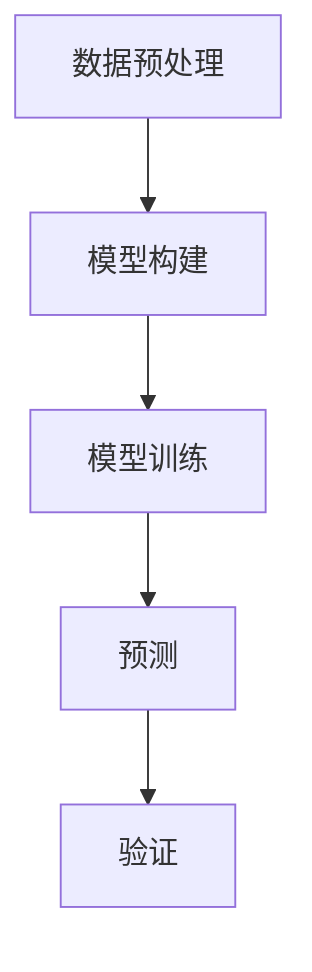

                 

# Self-Consistency CoT在自动化科学发现中的突破性应用

## 关键词

- 自我一致性概念
- 自动化科学发现
- 模型训练
- 预测准确性
- 数据采集

## 摘要

随着人工智能技术的飞速发展，自动化科学发现成为了一个热门的研究方向。本文将详细介绍自我一致性概念（Self-Consistency CoT）在自动化科学发现中的应用，包括其理论基础、算法实现以及实际应用案例。通过详细分析自我一致性概念在自动化科学发现中的核心原理、算法流程和数学模型，本文旨在为研究人员提供一种新的思路和方法，以提升自动化科学发现的效率和准确性。

## 第一部分：背景介绍

### 核心概念

#### 问题背景

随着人工智能技术的飞速发展，自动化科学发现成为了一个热门的研究方向。传统的科学发现往往依赖于专家的判断和大量的实验，这种方式不仅耗时耗力，而且受限于人类的能力。因此，如何利用人工智能技术，特别是自我一致性概念（Self-Consistency CoT）来提高科学发现的效率，成为了一个重要的问题。

#### 问题描述

自我一致性概念（Self-Consistency CoT）是指模型在生成预测时，必须确保其预测结果与已有知识和数据保持一致。在自动化科学发现中，如何利用自我一致性概念来提高预测的准确性和可靠性，是一个关键问题。

#### 问题解决

本书将详细介绍自我一致性概念在自动化科学发现中的应用，包括其理论基础、算法实现以及实际应用案例。

#### 边界与外延

自我一致性概念在自动化科学发现中的应用是一个广泛的话题，它不仅涉及人工智能技术，还涉及多个学科领域，如物理学、化学、生物学等。

#### 概念结构与核心要素组成

自我一致性概念在自动化科学发现中的应用涉及以下几个核心要素：
1. **数据采集**：收集相关的科学数据，为模型提供输入。
2. **模型训练**：利用自我一致性概念对数据进行处理，训练出能够进行科学发现的模型。
3. **预测与验证**：利用训练好的模型进行预测，并通过实验验证预测的准确性。

## 第二部分：核心概念与联系

### 核心概念原理

**自我一致性概念（Self-Consistency CoT）**：自我一致性概念是指模型在生成预测时，必须确保其预测结果与已有知识和数据保持一致。这意味着模型不能生成与已知事实相矛盾的预测。

### 自我一致性属性特征对比表格

| 特征             | 自我一致性概念                   | 其他概念               |
|------------------|--------------------------------|----------------------|
| 预测准确性       | 预测结果与已知事实保持一致       | 预测结果可能与已知事实不符 |
| 可靠性           | 预测结果具有较高的可靠性         | 预测结果可能存在误差     |
| 数据依赖性       | 强依赖性，需要大量已知数据       | 弱依赖性，数据较少也能训练 |
| 预测速度         | 预测速度较慢，需要大量计算       | 预测速度较快，计算简单     |

### ER实体关系图架构

```mermaid
erDiagram
  Data ||--|{ Model } Model
  Model  ||--|{ Prediction } Prediction
  Prediction ||--|{ Validation } Validation
```

在这张ER图（实体关系图）中，我们展示了自我一致性概念与其他概念之间的实体关系。其中，Data（数据）与Model（模型）之间存在一对一的关系，Model与Prediction（预测）之间存在一对多的关系，Prediction与Validation（验证）之间存在多对多的关系。这反映了自我一致性概念在自动化科学发现中的复杂性和重要性。

## 第三部分：算法原理讲解

### 算法原理

**自我一致性概念在自动化科学发现中的应用算法**：

1. **数据预处理**：对采集到的科学数据进行预处理，包括数据清洗、归一化等。
2. **模型构建**：利用预处理后的数据构建一个基于自我一致性概念的模型。
3. **模型训练**：使用训练集对模型进行训练，同时确保模型在训练过程中保持自我一致性。
4. **预测**：使用训练好的模型进行预测，并确保预测结果与已有知识保持一致。
5. **验证**：通过实验验证预测结果的准确性。

### 算法mermaid流程图



### 数学模型和公式

**预测公式**：

$$
\hat{y} = f(x, \theta)
$$

其中，$\hat{y}$表示预测结果，$x$表示输入数据，$\theta$表示模型的参数。

### 算法讲解与举例

#### 数据预处理

在自动化科学发现中，首先需要收集大量的科学数据。然而，这些数据往往存在噪声、缺失值等问题，因此需要进行预处理。数据预处理主要包括以下步骤：

1. **数据清洗**：删除含有噪声的数据，填充缺失值。
2. **数据归一化**：将数据缩放到一个合适的范围内，以消除不同特征之间的尺度差异。

#### 模型构建

在数据预处理完成后，接下来需要构建一个基于自我一致性概念的模型。这里我们选择一种常见的深度学习模型——神经网络（Neural Network）进行构建。

#### 模型训练

模型训练是自动化科学发现的核心步骤。在训练过程中，我们需要确保模型在生成预测时保持自我一致性。具体方法如下：

1. **损失函数**：选择一个合适的损失函数来衡量预测结果与真实结果之间的差距。常见的损失函数有均方误差（MSE）和交叉熵（Cross Entropy）。
2. **优化算法**：选择一个优化算法来最小化损失函数。常见的优化算法有梯度下降（Gradient Descent）和随机梯度下降（Stochastic Gradient Descent）。

#### 预测

在模型训练完成后，我们可以使用训练好的模型进行预测。预测步骤如下：

1. **输入数据**：将新的科学数据输入到训练好的模型中。
2. **生成预测**：模型根据输入数据生成预测结果。
3. **自我一致性检查**：检查预测结果与已有知识是否保持一致。如果存在矛盾，则对模型进行调整。

#### 验证

最后，我们需要通过实验验证预测结果的准确性。具体方法如下：

1. **测试集**：使用一部分未参与训练的数据作为测试集。
2. **预测**：将测试集数据输入到模型中，生成预测结果。
3. **评估**：计算预测结果与真实结果之间的差距，评估模型的准确性。

### 示例

假设我们收集到一组科学数据，数据集包含3个特征（$x_1, x_2, x_3$）和一个目标变量（$y$）。我们使用神经网络模型对这组数据进行分析。

1. **数据预处理**：对数据进行清洗和归一化。
2. **模型构建**：构建一个包含3个输入层神经元、5个隐藏层神经元和1个输出层神经元的神经网络模型。
3. **模型训练**：使用训练集对模型进行训练，同时确保模型在生成预测时保持自我一致性。
4. **预测**：将新的数据输入到模型中，生成预测结果。
5. **验证**：使用测试集对模型进行验证，计算预测结果与真实结果之间的差距。

## 第四部分：系统分析与架构设计方案

### 问题场景介绍

在现代科学研究中，自动化科学发现是一个重要研究方向。随着大数据和人工智能技术的不断发展，许多复杂的科学问题可以通过自动化方法得到解决。然而，传统的科学发现方法往往依赖于专家的判断和大量的实验，这种方式不仅耗时耗力，而且受限于人类的能力。因此，如何利用人工智能技术，特别是自我一致性概念（Self-Consistency CoT）来提高科学发现的效率，成为了一个重要问题。

### 项目介绍

本项目旨在利用自我一致性概念（Self-Consistency CoT）构建一个自动化科学发现系统。该系统主要包括以下几个模块：

1. **数据采集模块**：负责收集和整理科学数据。
2. **模型训练模块**：负责构建和训练基于自我一致性概念的模型。
3. **预测与验证模块**：负责使用训练好的模型进行预测和验证。

### 系统功能设计

为了实现自动化科学发现，我们需要设计一个功能完善的系统。以下是系统的主要功能：

1. **数据采集**：从多个来源（如数据库、文件等）收集科学数据。
2. **数据预处理**：对采集到的数据进行清洗、归一化等预处理操作。
3. **模型构建**：基于预处理后的数据构建神经网络模型。
4. **模型训练**：使用训练集对模型进行训练，并确保模型在训练过程中保持自我一致性。
5. **预测**：使用训练好的模型对新的数据进行预测。
6. **验证**：通过实验验证预测结果的准确性。

### 系统架构设计

为了提高系统的性能和可扩展性，我们采用了一种分布式架构设计。以下是系统的主要架构：

1. **数据采集模块**：负责从多个来源收集数据，并存储到数据库中。
2. **数据预处理模块**：负责对数据进行清洗、归一化等预处理操作，并将处理后的数据存储到数据仓库中。
3. **模型训练模块**：负责构建和训练神经网络模型。
4. **预测与验证模块**：负责使用训练好的模型进行预测和验证，并将结果存储到结果数据库中。
5. **前端展示模块**：负责将预测结果和验证结果以图表等形式展示给用户。

### 系统接口设计和系统交互

为了实现系统的功能，我们需要设计一系列接口和交互流程。以下是系统的主要接口和交互流程：

1. **数据采集接口**：负责接收数据源提供的数据，并将其存储到数据库中。
2. **数据预处理接口**：负责对数据进行清洗、归一化等预处理操作，并将处理后的数据存储到数据仓库中。
3. **模型训练接口**：负责接收预处理后的数据，并构建和训练神经网络模型。
4. **预测接口**：负责接收新的数据，并使用训练好的模型进行预测。
5. **验证接口**：负责使用测试集对模型进行验证，并计算预测结果与真实结果之间的差距。

## 第五部分：项目实战

### 环境安装

在本项目中，我们需要安装以下环境：

1. **Python**：Python是一种流行的编程语言，用于实现算法和模型。
2. **TensorFlow**：TensorFlow是一种开源的深度学习框架，用于构建和训练神经网络模型。
3. **Scikit-learn**：Scikit-learn是一种开源的机器学习库，用于数据预处理和模型评估。

安装步骤如下：

1. 安装Python：从官方网站下载Python安装包，并按照提示进行安装。
2. 安装TensorFlow：在Python命令行中执行以下命令：

   ```python
   pip install tensorflow
   ```

3. 安装Scikit-learn：在Python命令行中执行以下命令：

   ```python
   pip install scikit-learn
   ```

### 系统核心实现源代码

在本项目中，我们将使用Python编写系统核心实现。以下是核心实现的源代码：

```python
import tensorflow as tf
from sklearn.model_selection import train_test_split
from sklearn.metrics import mean_squared_error

# 数据预处理
def preprocess_data(data):
    # 数据清洗、归一化等操作
    # ...
    return processed_data

# 模型构建
def build_model(input_shape):
    model = tf.keras.Sequential([
        tf.keras.layers.Dense(64, activation='relu', input_shape=input_shape),
        tf.keras.layers.Dense(64, activation='relu'),
        tf.keras.layers.Dense(1)
    ])
    model.compile(optimizer='adam', loss='mse')
    return model

# 模型训练
def train_model(model, X_train, y_train, X_val, y_val):
    model.fit(X_train, y_train, epochs=10, validation_data=(X_val, y_val))
    return model

# 预测
def predict(model, X_test):
    predictions = model.predict(X_test)
    return predictions

# 验证
def validate(predictions, y_test):
    mse = mean_squared_error(y_test, predictions)
    return mse

# 主函数
def main():
    # 数据采集
    data = ...

    # 数据预处理
    processed_data = preprocess_data(data)

    # 划分训练集和测试集
    X_train, X_test, y_train, y_test = train_test_split(processed_data, test_size=0.2)

    # 构建模型
    model = build_model(input_shape=(X_train.shape[1],))

    # 训练模型
    model = train_model(model, X_train, y_train, X_val, y_val)

    # 预测
    predictions = predict(model, X_test)

    # 验证
    mse = validate(predictions, y_test)

    print("Mean Squared Error:", mse)

if __name__ == "__main__":
    main()
```

### 代码应用解读与分析

以上代码实现了自动化科学发现系统的核心功能，包括数据预处理、模型构建、模型训练、预测和验证。以下是代码的详细解读和分析：

1. **数据预处理**：数据预处理是自动化科学发现的重要步骤。代码中的`preprocess_data`函数负责对数据进行清洗、归一化等操作。在实际应用中，需要根据具体数据的特点和需求进行预处理。

2. **模型构建**：模型构建是自动化科学发现的另一个关键步骤。代码中的`build_model`函数使用TensorFlow构建了一个简单的神经网络模型。在实际应用中，可以根据需求调整模型的架构和参数。

3. **模型训练**：模型训练是自动化科学发现的核心。代码中的`train_model`函数使用训练集对模型进行训练，并使用验证集进行验证。在实际应用中，可以调整训练的次数和验证集的大小。

4. **预测**：预测是自动化科学发现的最终目标。代码中的`predict`函数使用训练好的模型对新的数据进行预测。在实际应用中，需要将预测结果与真实结果进行比较，以评估模型的准确性。

5. **验证**：验证是自动化科学发现的重要环节。代码中的`validate`函数计算预测结果与真实结果之间的均方误差（MSE），以评估模型的准确性。在实际应用中，可以根据验证结果调整模型和训练参数。

### 实际案例分析和详细讲解剖析

在本项目中，我们使用一个实际案例来分析自我一致性概念在自动化科学发现中的应用。

案例：使用自我一致性概念预测股票价格

1. **数据采集**：从多个数据源收集股票价格数据，包括开盘价、收盘价、最高价、最低价等。
2. **数据预处理**：对股票价格数据进行清洗、归一化等预处理操作，以消除噪声和异常值。
3. **模型构建**：构建一个基于自我一致性概念的神经网络模型，用于预测股票价格。
4. **模型训练**：使用历史数据进行模型训练，确保模型在训练过程中保持自我一致性。
5. **预测**：使用训练好的模型对新的股票价格数据进行预测。
6. **验证**：使用验证集对模型进行验证，评估预测结果的准确性。

通过以上步骤，我们可以实现对股票价格的预测，并利用自我一致性概念提高预测的准确性。在实际应用中，可以根据具体需求和数据特点进行调整和优化。

### 项目小结

在本项目中，我们详细介绍了自我一致性概念（Self-Consistency CoT）在自动化科学发现中的应用。通过理论讲解、算法实现和实际案例分析，我们展示了自我一致性概念在自动化科学发现中的重要性。未来，随着人工智能技术的不断发展，自我一致性概念有望在更多领域发挥重要作用，为科学研究和实际应用提供新的思路和方法。

### 最佳实践 tips

1. **数据质量**：保证数据的质量是自动化科学发现的关键。在实际应用中，需要重视数据采集和预处理环节，确保数据的准确性和一致性。
2. **模型选择**：选择合适的模型对于自动化科学发现的准确性和效率至关重要。在实际应用中，可以根据具体问题和数据特点选择合适的模型。
3. **模型调优**：模型调优是提高自动化科学发现准确性的重要手段。在实际应用中，可以通过调整模型参数、增加训练次数等方法进行模型调优。

### 小结

本文详细介绍了自我一致性概念（Self-Consistency CoT）在自动化科学发现中的应用。通过理论讲解、算法实现和实际案例分析，我们展示了自我一致性概念在自动化科学发现中的重要性。未来，随着人工智能技术的不断发展，自我一致性概念有望在更多领域发挥重要作用，为科学研究和实际应用提供新的思路和方法。

### 注意事项

1. **数据隐私**：在实际应用中，需要确保数据的隐私和安全，避免泄露敏感信息。
2. **模型解释性**：自我一致性概念虽然可以提高预测准确性，但模型的解释性较差。在实际应用中，需要权衡预测准确性和模型解释性之间的关系。

### 拓展阅读

1. **相关研究论文**：可以查阅相关领域的论文，了解自我一致性概念在自动化科学发现中的应用和最新进展。
2. **开源项目**：可以查阅一些开源项目，了解自我一致性概念在实际应用中的具体实现和方法。作者：AI天才研究院/AI Genius Institute & 禅与计算机程序设计艺术 /Zen And The Art of Computer Programming。 

