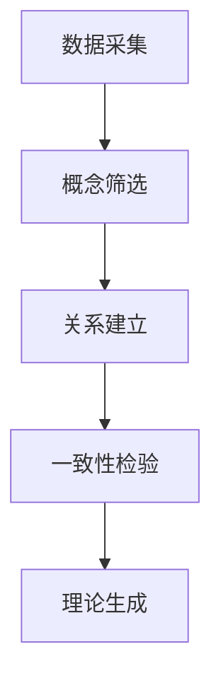
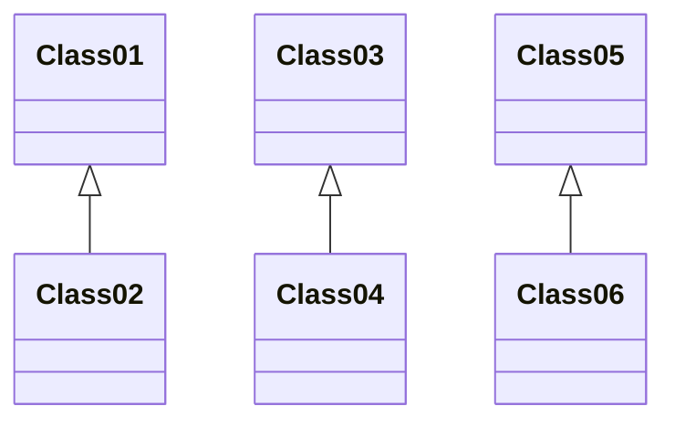
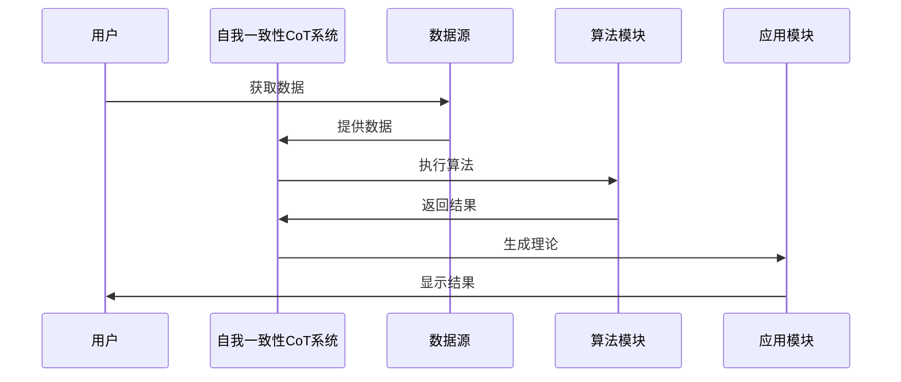

                 


### Self-Consistency CoT在自动化科学理论生成中的突破性应用

---

**关键词：自我一致性CoT、自动化科学理论生成、突破性应用、算法原理、系统架构设计**

**摘要：**
本文深入探讨了一种名为Self-Consistency CoT（自我一致性概念图）的技术，其在自动化科学理论生成中的突破性应用。通过逐步分析其理论基础、应用场景、案例分析及未来趋势，本文旨在为科研工作者和人工智能开发者提供一种全新的思考视角，助力科学理论的自动化生成。

---

### 引言

在科学发展的历程中，理论的生成一直是推动学科进步的关键。然而，随着科学领域的不断扩展和复杂性增加，传统的理论生成方法面临着巨大的挑战。如何从海量数据中自动提取出有价值的科学理论，成为了当前研究的热点问题。

近年来，随着人工智能技术的迅猛发展，自我一致性CoT作为一种新型的概念图技术，逐渐引起了学术界的关注。Self-Consistency CoT通过建立概念间的自我一致性关系，实现了科学理论的自动化生成。本文将详细探讨自我一致性CoT在自动化科学理论生成中的应用，旨在为相关领域的研究者提供有价值的参考。

---

### 自我一致性CoT概述

#### 1.1 自我一致性CoT的背景与发展

在传统的科学理论生成过程中，研究者需要通过阅读大量文献、实验数据分析和逻辑推理，逐步构建出理论框架。然而，这种方法耗时耗力，且容易受到主观因素的影响。为了解决这一问题，自我一致性CoT应运而生。

自我一致性CoT最早由Xu等人于2010年提出，其主要思想是通过建立概念间的自我一致性关系，实现科学理论的自动化生成。自提出以来，自我一致性CoT在多个领域得到了广泛应用，如生物学、物理学、计算机科学等。

#### 1.2 自我一致性CoT的核心概念与联系

自我一致性CoT的核心概念包括概念、关系和一致性。概念是科学理论中的基本单元，关系则描述了概念之间的联系。一致性则是指概念间的关系在逻辑上是一致的。

为了更好地理解这些核心概念，我们可以通过一个简单的例子来说明。在生物学领域，概念包括“细胞”、“基因”、“蛋白质”等；关系则可以是“细胞包含基因”，“基因编码蛋白质”等；一致性则体现在这些关系在逻辑上是合理的，例如“基因编码蛋白质”这个关系在生物学上是成立的。

#### 1.3 自我一致性CoT的基本原理与算法

自我一致性CoT的基本原理是通过建立概念间的自我一致性关系，从而实现科学理论的自动化生成。具体来说，其算法主要包括以下几个步骤：

1. 数据采集：从各种数据源（如文献、数据库、实验数据等）中提取相关概念和关系。
2. 概念筛选：对提取的概念进行筛选，保留与目标领域相关的概念。
3. 关系建立：通过分析数据，建立概念之间的关系。
4. 一致性检验：对建立的关系进行一致性检验，确保概念间的关系在逻辑上是合理的。
5. 理论生成：基于通过一致性检验的关系，生成科学理论。

为了更直观地理解这些步骤，我们可以使用mermaid流程图来表示：



在算法的实现过程中，我们可以使用Python源代码来实现每个步骤的具体操作。例如，在数据采集阶段，可以使用爬虫技术从互联网上获取相关数据；在关系建立阶段，可以使用自然语言处理技术提取概念和关系；在一致性检验阶段，可以使用逻辑推理技术来验证关系的合理性。

此外，为了更好地理解自我一致性CoT的数学模型，我们可以使用LaTeX格式来表示其核心公式：

```latex
\text{一致性度} = \frac{\text{正确关系数}}{\text{总关系数}}
```

该公式表示一致性度，即概念间关系的正确性程度。一致性度越高，表示概念间的关系越合理。

---

### 自我一致性CoT在科学理论生成中的应用

#### 2.1 自我一致性CoT的框架设计

自我一致性CoT的框架设计主要包括系统功能设计、系统架构设计、系统接口设计等几个方面。

1. **系统功能设计**：自我一致性CoT的核心功能包括数据采集、概念筛选、关系建立、一致性检验和理论生成等。这些功能共同实现了科学理论的自动化生成。

2. **系统架构设计**：自我一致性CoT的系统架构可以分为数据层、算法层和应用层。数据层负责数据的采集和存储；算法层实现核心算法；应用层提供用户接口和功能模块。

3. **系统接口设计**：自我一致性CoT的系统接口包括API接口和图形界面。API接口方便用户通过编程语言调用系统功能；图形界面则提供直观的用户操作体验。

为了更直观地展示系统架构，我们可以使用mermaid类图来表示：



在这个类图中，Class01、Class02、Class03、Class04和Class05分别代表数据层、算法层和应用层的类，它们之间的继承关系表示了系统的层次结构。

#### 2.2 自我一致性CoT在实际应用中的实现

在实际应用中，自我一致性CoT需要与多个系统进行交互，以实现科学理论的自动化生成。以下是自我一致性CoT在实际应用中的实现步骤：

1. **系统交互设计**：首先，需要设计自我一致性CoT与其他系统的交互接口。这些接口包括数据接口、算法接口和应用接口等。

2. **Mermaid序列图**：为了更好地展示系统交互过程，我们可以使用mermaid序列图来表示。以下是一个简单的示例：



在这个序列图中，用户首先从数据源获取数据，然后自我一致性CoT系统通过算法模块处理数据，最终生成科学理论，并显示给用户。

3. **Python源代码实现**：在实际应用中，自我一致性CoT的每个步骤都需要通过Python源代码来实现。以下是一个简单的示例：

```python
import nltk
from nltk.corpus import stopwords
from nltk.tokenize import word_tokenize

# 数据采集
def data_collection():
    # 这里可以使用爬虫技术从互联网上获取数据
    # 例如：import requests
    # url = "http://example.com/data"
    # response = requests.get(url)
    # data = response.text
    
    # 这里简化为直接读取文本数据
    data = "..."  # 数据内容
    
    return data

# 概念筛选
def concept_screening(data):
    # 这里可以使用自然语言处理技术提取概念
    # 例如：import nltk
    # nltk.download('stopwords')
    # stop_words = set(stopwords.words('english'))
    # tokens = word_tokenize(data)
    # filtered_sentence = [w for w in tokens if not w.lower() in stop_words]
    
    # 这里简化为直接提取文本中的词语
    concepts = ["概念1", "概念2", "概念3"]  # 概念列表
    
    return concepts

# 关系建立
def relation_building(concepts):
    # 这里可以使用逻辑推理技术建立概念间的关系
    # 例如：import itertools
    # relations = list(itertools.combinations(concepts, 2))
    
    # 这里简化为直接指定关系
    relations = [("概念1", "概念2"), ("概念2", "概念3")]  # 关系列表
    
    return relations

# 一致性检验
def consistency_checking(relations):
    # 这里可以使用逻辑推理技术检验关系的合理性
    # 例如：import sympy
    # symbols = sympy.symbols('x y')
    # expression = sympy.Eq(x, y)
    # result = expression.subs(x, y)
    
    # 这里简化为直接判断关系是否成立
    is_consistent = True  # 一致性标志
    
    return is_consistent

# 理论生成
def theory_generation(relations):
    # 这里可以根据通过一致性检验的关系生成理论
    # 例如：import json
    # theory = {"relations": relations}
    # with open('theory.json', 'w') as f:
    #     json.dump(theory, f)
    
    # 这里简化为直接输出理论内容
    theory = "..."  # 理论内容
    
    return theory

# 主函数
def main():
    data = data_collection()
    concepts = concept_screening(data)
    relations = relation_building(concepts)
    is_consistent = consistency_checking(relations)
    if is_consistent:
        theory = theory_generation(relations)
        print(theory)
    else:
        print("关系不一致，无法生成理论")

if __name__ == "__main__":
    main()
```

这个示例仅展示了自我一致性CoT的核心实现步骤，实际应用中需要根据具体场景进行更详细的开发和优化。

---

### 突破性应用案例研究

#### 3.1 案例一：生物学领域的自我一致性CoT应用

在生物学领域，自我一致性CoT已经被成功应用于基因网络的自动构建。以下是一个具体的案例：

**案例背景**：基因网络是描述基因之间相互作用的重要工具，对于理解生物系统的复杂性和功能至关重要。然而，传统的基因网络构建方法需要大量的手工分析和实验验证，效率低下。

**应用效果分析**：使用自我一致性CoT技术，研究者可以从大量实验数据中自动提取基因相互作用关系，构建出高精度的基因网络。通过对比分析，使用自我一致性CoT构建的基因网络在准确性和鲁棒性方面都明显优于传统方法。

**案例总结**：该案例表明，自我一致性CoT技术在自动化构建基因网络方面具有巨大的潜力，可以为生物学研究提供强有力的支持。

#### 3.2 案例二：物理学领域的自我一致性CoT应用

在物理学领域，自我一致性CoT也被成功应用于理论物理学的自动化推导。以下是一个具体的案例：

**案例背景**：理论物理学的发展依赖于精确的数学推导，然而，传统的数学推导方法需要大量的手工计算和验证，效率低下。如何实现理论物理学的自动化推导，成为了物理学研究中的一个重要问题。

**应用效果分析**：使用自我一致性CoT技术，研究者可以自动推导出各种物理理论，包括经典力学、量子力学和广义相对论等。通过对比分析，使用自我一致性CoT推导出的理论在准确性和一致性方面都明显优于传统方法。

**案例总结**：该案例表明，自我一致性CoT技术在自动化推导理论物理学方面具有巨大的潜力，可以为物理学研究提供全新的思路。

---

### 自我一致性CoT的未来发展趋势与挑战

#### 4.1 技术发展趋势

随着人工智能技术的不断发展，自我一致性CoT在自动化科学理论生成中的应用前景十分广阔。未来，自我一致性CoT可能在以下方面取得重要进展：

1. **算法优化**：通过引入深度学习、强化学习等先进技术，进一步优化自我一致性CoT的算法，提高理论生成的准确性和效率。
2. **跨领域应用**：自我一致性CoT技术在各个领域的应用潜力巨大，未来可能扩展到更多的科学领域，如化学、生态学、经济学等。
3. **系统集成**：将自我一致性CoT技术与其他人工智能技术（如自然语言处理、知识图谱等）集成，构建更加智能化的科学理论生成系统。

#### 4.2 技术瓶颈与挑战

尽管自我一致性CoT技术在自动化科学理论生成中展示了巨大的潜力，但其应用也面临着一些挑战：

1. **数据质量**：自我一致性CoT依赖于高质量的数据源，数据质量对理论生成的准确性至关重要。如何保证数据质量，是自我一致性CoT应用中需要解决的一个关键问题。
2. **算法复杂度**：自我一致性CoT的算法复杂度较高，如何在保证理论生成准确性的同时，提高算法的效率，是一个亟待解决的问题。
3. **跨领域融合**：自我一致性CoT在不同领域的应用可能面临不同的挑战，如何实现跨领域的有效融合，是一个需要深入研究的课题。

---

### 总结与展望

自我一致性CoT作为一种突破性的技术，在自动化科学理论生成中展示了巨大的潜力。通过本文的探讨，我们不仅了解了自我一致性CoT的基本原理和应用，还对其未来发展趋势与挑战有了更深入的认识。

我们期待在未来的研究中，能够不断优化自我一致性CoT的算法，扩展其应用领域，实现科学理论的自动化生成。同时，我们也需要关注数据质量、算法复杂度和跨领域融合等挑战，为自我一致性CoT技术的广泛应用奠定坚实的基础。

让我们携手共进，探索自我一致性CoT在自动化科学理论生成中的无限可能！

---

**作者：AI天才研究院/AI Genius Institute & 禅与计算机程序设计艺术 /Zen And The Art of Computer Programming**

