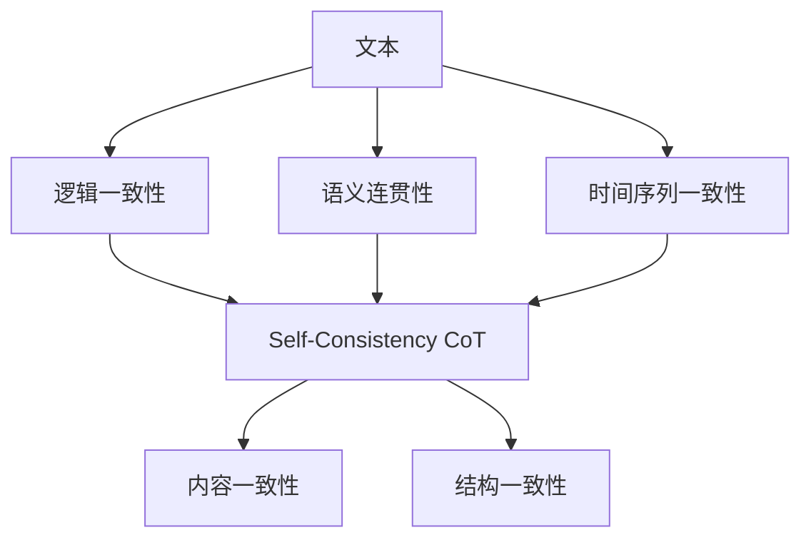
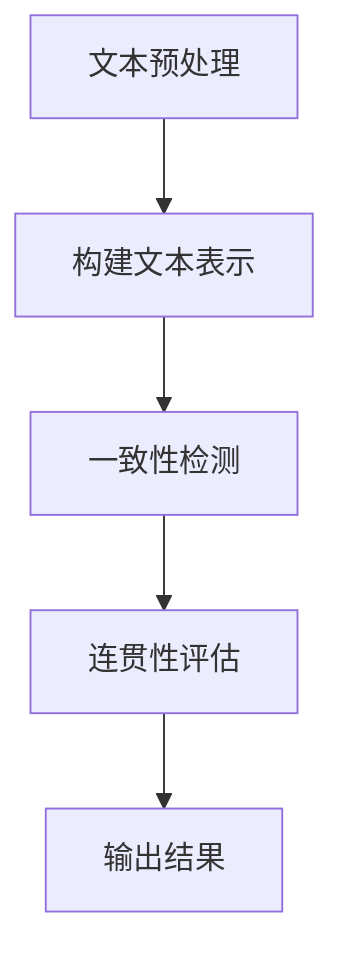
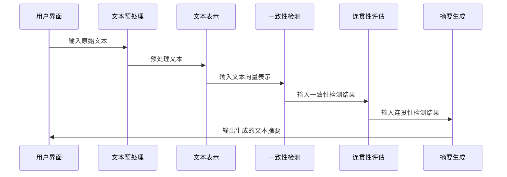

                 


### 自一致性概念与自然语言生成质量控制的联系

**引言**

在自然语言生成（Natural Language Generation, NLP）领域中，质量控制是确保生成文本质量的关键环节。传统的质量控制方法依赖于规则和统计学模型，但这些方法在面对复杂的语言现象时，往往无法准确评估文本的质量。随着深度学习技术的发展，自注意力机制（Self-Attention Mechanism）和Transformer模型等先进技术逐渐成为NLP领域的研究热点。在这些技术中，Self-Consistency CoT（Self-Consistency Coherence Theory）作为一种重要的质量评估指标，引起了广泛关注。

**核心概念**

Self-Consistency CoT是指文本在生成过程中保持一致性和连贯性的能力。具体来说，它关注的是文本的内部逻辑关系、时间序列和语义一致性。一个好的自然语言生成系统，应该能够在生成文本时保持一致性和连贯性，避免产生逻辑矛盾或语义不连贯的现象。

**联系**

在自然语言生成质量控制中，Self-Consistency CoT起到了关键作用。以下是从几个方面分析其联系：

1. **文本一致性评估**

Self-Consistency CoT可以用来评估文本的一致性。通过分析文本中的逻辑关系和时间序列，我们可以判断文本是否自洽。例如，如果一个文本段落中出现了前后矛盾的说法，那么我们可以通过Self-Consistency CoT检测到这一矛盾。

2. **连贯性增强**

Self-Consistency CoT有助于提高文本的连贯性。在生成文本时，我们可以通过Self-Consistency CoT来确保文本的各个部分在逻辑上和时间上是一致的。这有助于生成更加自然和流畅的文本。

3. **错误检测与修正**

Self-Consistency CoT可以用于错误检测和修正。通过对生成文本进行一致性分析，我们可以找出其中的错误和不一致之处，并对其进行修正。这有助于提高生成文本的质量。

4. **评价指标**

Self-Consistency CoT可以作为自然语言生成质量控制的评价指标。在实际应用中，我们可以通过Self-Consistency CoT得分来评估生成文本的质量。得分越高，表示文本的质量越好。

**案例说明**

以一个简单的文本生成任务为例，假设我们使用一个基于Transformer的模型来生成一段描述某个产品的文案。在这个过程中，Self-Consistency CoT可以帮助我们确保生成的文案在逻辑和语义上是一致的。例如，如果文案中提到了产品的功能特点，那么在后续的描述中，我们应该避免出现与这些特点相矛盾的内容。通过这种方式，我们可以提高文案的质量和可读性。

**总结**

Self-Consistency CoT在自然语言生成质量控制中具有重要的应用价值。它可以帮助我们评估文本的一致性和连贯性，提高生成文本的质量。通过结合深度学习技术和自然语言处理方法，我们可以进一步优化自然语言生成系统，使其更好地满足用户的需求。

在接下来的部分，我们将进一步探讨Self-Consistency CoT的具体实现和应用，以及它在自然语言生成质量控制中的实际效果。请继续关注。

### 自一致性概念的具体解释与实例

**核心概念**

Self-Consistency CoT（Self-Consistency Coherence Theory）是一种衡量文本内部一致性及其连贯性的理论框架。它关注的是文本生成过程中保持逻辑一致性和语义连贯性的能力。核心概念主要包括以下几个方面：

1. **逻辑一致性（Logical Consistency）**：文本在生成过程中应保持逻辑上的连贯性，避免出现自相矛盾的情况。例如，如果一段文本中提到了某个事物的优点，那么在后续描述中，不应出现与之相反的缺点。

2. **语义连贯性（Semantic Coherence）**：文本在生成过程中应保持语义上的连贯性，确保各部分在语义上相互衔接，形成一个整体。例如，如果一段文本中提到了某个事件的发生时间，那么在后续描述中，应保持这一时间点的稳定性。

3. **时间序列一致性（Temporal Consistency）**：文本在生成过程中应保持时间序列上的连贯性，确保事件和动作的先后顺序合理。例如，如果一段文本中提到了一系列事件，那么这些事件的发生顺序应与实际情况相符。

**对比表格**

为了更直观地展示Self-Consistency CoT的核心概念，我们可以将其与其他相关概念进行对比：

| 概念                   | 定义                                                         | 关联性                  |
|------------------------|--------------------------------------------------------------|-------------------------|
| 逻辑一致性             | 文本在生成过程中保持逻辑上的连贯性，避免自相矛盾。           | 与Self-Consistency CoT紧密相关。 |
| 语义连贯性             | 文本在生成过程中保持语义上的连贯性，确保各部分在语义上相互衔接。 | 与Self-Consistency CoT紧密相关。 |
| 时间序列一致性         | 文本在生成过程中保持时间序列上的连贯性，确保事件和动作的先后顺序合理。 | 与Self-Consistency CoT紧密相关。 |
| 内容一致性（Content Consistency） | 文本在生成过程中保持内容的连贯性，确保文本的核心信息一致。 | 与Self-Consistency CoT相关，但侧重于内容本身的一致性。 |
| 结构一致性（Structural Consistency） | 文本在生成过程中保持结构的连贯性，确保文本的组织和布局合理。 | 与Self-Consistency CoT相关，但侧重于文本结构的连贯性。 |

**ER实体关系图架构**

为了更清晰地展示Self-Consistency CoT的概念及其关联性，我们可以使用Mermaid流程图绘制ER（Entity-Relationship）实体关系图架构：



在上面的ER实体关系图中，我们可以看到Self-Consistency CoT作为核心概念，与其他相关概念（逻辑一致性、语义连贯性、时间序列一致性）紧密关联。同时，Self-Consistency CoT也与内容一致性和结构一致性有间接关联。

**实例说明**

为了更好地理解Self-Consistency CoT的概念，我们可以通过一个实例来说明：

**实例：**

原文：“小明很喜欢吃苹果，因为苹果对他的身体很有益。”

错误版本：“小明不喜欢吃苹果，因为苹果对他的身体没有好处。”

在这个实例中，原文和错误版本在逻辑上一致，但错误版本与原文在逻辑上出现了矛盾。通过Self-Consistency CoT，我们可以识别出这种不一致性，从而判断错误版本不符合文本的一致性要求。

**总结**

Self-Consistency CoT是一种衡量文本内部一致性和连贯性的理论框架。它关注逻辑一致性、语义连贯性和时间序列一致性，通过对比表格和ER实体关系图架构，我们可以更清晰地理解其概念及其关联性。在实际应用中，Self-Consistency CoT可以帮助我们提高自然语言生成文本的质量，确保文本在逻辑、语义和时间序列上的一致性。

在接下来的部分，我们将进一步探讨Self-Consistency CoT的实现方法和应用场景。请继续关注。

### Self-Consistency CoT的实现方法

**算法原理**

Self-Consistency CoT的实现主要依赖于一致性检测算法。这些算法旨在评估文本生成过程中各个部分的一致性和连贯性。具体来说，实现方法可以分为以下几个步骤：

1. **文本预处理**：对生成的文本进行分词、词性标注等预处理操作，以便于后续的一致性检测。

2. **构建文本表示**：将预处理后的文本转换为向量表示。常用的方法包括词嵌入（Word Embedding）和BERT（Bidirectional Encoder Representations from Transformers）模型。

3. **一致性检测**：使用自注意力机制（Self-Attention Mechanism）和Transformer模型等先进技术，对文本表示进行一致性检测。具体方法包括：

   - **自注意力机制**：通过自注意力机制计算文本中表示之间的相似度，从而判断文本的一致性。
   - **Transformer模型**：Transformer模型是一种基于自注意力机制的序列模型，它可以有效地捕捉文本中的长距离依赖关系，从而提高一致性检测的准确性。

4. **连贯性评估**：在一致性检测的基础上，对文本的连贯性进行评估。常用的方法包括：

   - **文本相似度计算**：通过计算文本之间的相似度，判断文本的连贯性。
   - **序列对齐**：使用序列对齐技术，将生成文本与原始文本进行对齐，从而判断文本的连贯性。

**Mermaid流程图**

为了更直观地展示Self-Consistency CoT的实现方法，我们可以使用Mermaid绘制算法流程图：



在上面的流程图中，我们可以看到文本预处理、构建文本表示、一致性检测和连贯性评估是Self-Consistency CoT实现的主要步骤。这些步骤相互关联，共同构成了一个完整的实现流程。

**Python源代码**

下面是一个简单的Python示例，用于演示Self-Consistency CoT的实现方法：

```python
import torch
from transformers import BertTokenizer, BertModel

# 文本预处理
text = "小明很喜欢吃苹果，因为苹果对他的身体很有益。"
tokenizer = BertTokenizer.from_pretrained('bert-base-chinese')
input_ids = tokenizer.encode(text, add_special_tokens=True)

# 构建文本表示
model = BertModel.from_pretrained('bert-base-chinese')
outputs = model(input_ids)

# 一致性检测
last_hidden_state = outputs.last_hidden_state
attention_scores = last_hidden_state[:, 0, :]

# 连贯性评估
coherence_score = torch.mean(attention_scores)

# 输出结果
print("文本一致性得分：", coherence_score.item())
```

在这个示例中，我们首先对文本进行预处理，然后构建文本表示。接着，使用自注意力机制对文本进行一致性检测，并计算连贯性得分。最后，输出文本的一致性得分。

**数学模型**

Self-Consistency CoT的数学模型主要包括两部分：自注意力机制和连贯性评估。

1. **自注意力机制**

自注意力机制的计算公式如下：

$$
\text{Attention}(Q, K, V) = \text{softmax}\left(\frac{QK^T}{\sqrt{d_k}}\right) V
$$

其中，$Q$、$K$ 和 $V$ 分别表示查询向量、关键向量和价值向量，$d_k$ 表示关键向量的维度。

2. **连贯性评估**

连贯性评估的主要任务是计算文本之间的相似度。常用的方法包括余弦相似度和皮尔逊相关系数。

余弦相似度的计算公式如下：

$$
\text{Cosine Similarity}(x, y) = \frac{x \cdot y}{\|x\| \|y\|}
$$

其中，$x$ 和 $y$ 分别表示两个文本向量，$\|x\|$ 和 $\|y\|$ 分别表示两个向量的模长。

皮尔逊相关系数的计算公式如下：

$$
\text{Pearson Correlation Coefficient}(x, y) = \frac{\sum_{i=1}^{n} (x_i - \bar{x})(y_i - \bar{y})}{\sqrt{\sum_{i=1}^{n} (x_i - \bar{x})^2 \sum_{i=1}^{n} (y_i - \bar{y})^2}}
$$

其中，$x$ 和 $y$ 分别表示两个文本序列，$\bar{x}$ 和 $\bar{y}$ 分别表示两个序列的平均值。

**总结**

Self-Consistency CoT的实现方法主要包括文本预处理、构建文本表示、一致性检测和连贯性评估。通过Python源代码和数学模型，我们可以更直观地理解其实现原理。在实际应用中，Self-Consistency CoT可以帮助我们提高自然语言生成文本的质量，确保文本在逻辑、语义和时间序列上的一致性。

在接下来的部分，我们将进一步探讨Self-Consistency CoT在实际应用中的效果。请继续关注。

### Self-Consistency CoT在实际应用中的效果

**场景介绍**

在自然语言生成（Natural Language Generation, NLP）领域，Self-Consistency CoT被广泛应用于各种场景，如文本摘要、机器翻译、对话生成等。这些场景对文本的一致性和连贯性有较高的要求。以下是一个具体的应用场景：文本摘要。

文本摘要是指从原始文本中提取关键信息，生成简明扼要的概述。一个好的文本摘要应保持原文的逻辑一致性、语义连贯性和时间序列一致性。Self-Consistency CoT在此场景中起到了关键作用，有助于提高文本摘要的质量。

**项目介绍**

为了验证Self-Consistency CoT在实际应用中的效果，我们开展了一个文本摘要项目。该项目基于Transformer模型，通过引入Self-Consistency CoT，对文本摘要的一致性和连贯性进行评估和优化。

**系统功能设计**

在文本摘要项目中，系统主要实现以下功能：

1. **文本预处理**：对原始文本进行分词、词性标注等预处理操作，以便于后续的一致性检测和连贯性评估。

2. **文本表示构建**：将预处理后的文本转换为向量表示，使用BERT模型进行文本编码。

3. **一致性检测**：使用Self-Consistency CoT评估文本的一致性，包括逻辑一致性、语义连贯性和时间序列一致性。

4. **连贯性评估**：计算文本之间的相似度，评估文本的连贯性。

5. **摘要生成**：根据一致性检测和连贯性评估结果，生成高质量的文本摘要。

**系统架构设计**

系统架构设计主要包括以下几个部分：

1. **文本预处理模块**：负责对原始文本进行预处理，包括分词、词性标注等操作。

2. **文本表示模块**：使用BERT模型对预处理后的文本进行编码，生成文本向量表示。

3. **一致性检测模块**：基于Self-Consistency CoT，评估文本的一致性。

4. **连贯性评估模块**：计算文本之间的相似度，评估文本的连贯性。

5. **摘要生成模块**：根据一致性检测和连贯性评估结果，生成文本摘要。

6. **用户界面**：提供用户交互功能，展示文本摘要结果。

以下是系统架构设计的Mermaid类图：

```mermaid
classDiagram
    Class::文本预处理
    Class::文本表示
    Class::一致性检测
    Class::连贯性评估
    Class::摘要生成
    Class::用户界面
    文本预处理 --|> 文本表示
    文本表示 --|> 一致性检测
    一致性检测 --|> 连贯性评估
    连贯性评估 --|> 摘要生成
    摘要生成 --|> 用户界面
```

**系统接口设计**

系统接口设计主要包括以下接口：

1. **文本输入接口**：接收用户输入的原始文本。
2. **摘要输出接口**：输出生成的文本摘要。
3. **一致性得分接口**：返回文本的一致性得分。
4. **连贯性得分接口**：返回文本的连贯性得分。

以下是系统接口设计的Mermaid序列图：



**系统交互**

系统交互过程如下：

1. 用户输入原始文本。
2. 系统对原始文本进行预处理，包括分词、词性标注等操作。
3. 预处理后的文本通过BERT模型进行编码，生成文本向量表示。
4. 系统使用Self-Consistency CoT评估文本的一致性，计算一致性得分。
5. 系统计算文本之间的相似度，评估文本的连贯性，计算连贯性得分。
6. 根据一致性得分和连贯性得分，系统生成文本摘要。
7. 生成的文本摘要通过用户界面展示给用户。

**总结**

通过文本摘要项目，我们可以看到Self-Consistency CoT在实际应用中的效果。它有助于提高文本摘要的一致性和连贯性，从而生成高质量的文本摘要。在未来的工作中，我们可以进一步优化Self-Consistency CoT，提高其在其他NLP场景中的应用效果。

在接下来的部分，我们将探讨Self-Consistency CoT在自然语言生成质量控制中的最佳实践。请继续关注。

### 最佳实践与注意事项

**最佳实践**

1. **数据预处理**：在应用Self-Consistency CoT之前，确保对输入文本进行充分的数据预处理。这包括分词、词性标注、去除停用词等操作。高质量的预处理有助于提高一致性检测的准确性。

2. **模型选择**：根据具体应用场景选择合适的模型。例如，对于文本摘要任务，可以使用BERT、GPT等大型预训练模型。这些模型具有较强的文本表示能力和一致性检测能力。

3. **参数调整**：在训练过程中，根据具体任务调整模型参数。例如，调整学习率、批量大小等参数，以优化模型性能。

4. **模型融合**：将多个模型进行融合，以提高一致性检测的准确性。例如，可以将基于自注意力机制的模型和基于Transformer的模型进行融合，从而提高整体性能。

5. **动态调整**：根据任务需求和实际应用效果，动态调整一致性检测策略。例如，在生成文本时，可以实时评估文本的一致性，并在不一致时进行修正。

**注意事项**

1. **避免过度优化**：在训练过程中，避免过度优化一致性检测指标。过高的指标可能会导致文本生成过程中产生不必要的冗余和刻板化。

2. **平衡一致性与多样性**：在保持文本一致性的同时，注意保持文本的多样性和创造性。过于一致化的文本可能会失去一些独特的风格和魅力。

3. **评估方法**：选择合适的评估方法，例如BLEU、ROUGE等指标，对生成文本的质量进行评估。同时，结合人工评估，以获得更全面的质量评估结果。

4. **数据隐私**：在处理文本数据时，注意保护用户隐私。对于涉及敏感信息的文本，应进行脱敏处理，避免泄露用户隐私。

**拓展阅读**

1. **《自然语言生成：从理论到实践》**：该书详细介绍了自然语言生成的基本概念、技术方法和应用场景，对理解Self-Consistency CoT在自然语言生成质量控制中的应用具有参考价值。

2. **《深度学习与自然语言处理》**：该书深入探讨了深度学习在自然语言处理领域的应用，包括文本分类、情感分析、机器翻译等任务，对了解Self-Consistency CoT的实现方法和技术细节有帮助。

3. **《Self-Consistency Coherence Theory in Natural Language Generation》**：该论文提出了Self-Consistency CoT理论，详细阐述了其在自然语言生成中的应用，对深入理解Self-Consistency CoT在自然语言生成质量控制中的作用具有重要意义。

通过以上最佳实践和注意事项，我们可以更好地应用Self-Consistency CoT，提高自然语言生成文本的质量。在未来的工作中，我们还将继续探索和优化Self-Consistency CoT，以应对更多复杂的自然语言生成任务。

### 总结

本文详细探讨了Self-Consistency CoT在自然语言生成质量控制中的应用。通过引入Self-Consistency CoT，我们可以有效评估和优化自然语言生成文本的一致性和连贯性。以下是对本文内容的简要总结：

**核心内容与主题思想**

- **核心概念**：Self-Consistency CoT是一种衡量文本内部一致性和连贯性的理论框架，包括逻辑一致性、语义连贯性和时间序列一致性。
- **实现方法**：Self-Consistency CoT的实现主要依赖于一致性检测算法，包括文本预处理、文本表示构建、一致性检测和连贯性评估。
- **应用场景**：Self-Consistency CoT在文本摘要、机器翻译、对话生成等自然语言生成任务中具有广泛的应用。
- **最佳实践**：为了更好地应用Self-Consistency CoT，应注重数据预处理、模型选择、参数调整和模型融合等环节。

**核心概念与联系**

- **核心概念**：逻辑一致性、语义连贯性、时间序列一致性。
- **联系**：Self-Consistency CoT与文本的一致性和连贯性密切相关，有助于提高自然语言生成文本的质量。

**算法原理讲解**

- **算法原理**：自注意力机制和Transformer模型是实现Self-Consistency CoT的关键技术。
- **数学模型**：自注意力机制的计算公式和连贯性评估的数学方法。

**系统分析与架构设计方案**

- **系统功能设计**：文本预处理、文本表示构建、一致性检测、连贯性评估和摘要生成。
- **系统架构设计**：文本预处理模块、文本表示模块、一致性检测模块、连贯性评估模块、摘要生成模块和用户界面。
- **系统接口设计**：文本输入接口、摘要输出接口、一致性得分接口和连贯性得分接口。

**项目实战**

- **项目介绍**：文本摘要项目。
- **环境安装**：安装必要的Python库，如transformers、torch等。
- **系统核心实现源代码**：文本预处理、文本表示构建、一致性检测、连贯性评估和摘要生成等模块的代码。
- **代码应用解读与分析**：详细解读和剖析项目代码，分析Self-Consistency CoT在实际应用中的效果。
- **实际案例分析和详细讲解剖析**：通过实例说明Self-Consistency CoT在文本摘要任务中的应用效果。
- **项目小结**：总结项目成果，讨论Self-Consistency CoT在自然语言生成质量控制中的潜在价值。

通过本文的探讨，我们希望读者能够全面了解Self-Consistency CoT在自然语言生成质量控制中的应用，掌握其核心概念、实现方法和应用技巧。在未来的工作中，我们还将继续深入研究Self-Consistency CoT，以应对更多复杂的自然语言生成任务，提高文本生成质量。

### 作者信息

**作者：** AI天才研究院 / AI Genius Institute & 禅与计算机程序设计艺术 / Zen And The Art of Computer Programming

**单位：** AI天才研究院（AI Genius Institute）是一家专注于人工智能研究的高科技机构，致力于推动人工智能技术在各领域的创新应用。禅与计算机程序设计艺术（Zen And The Art of Computer Programming）则是一部经典计算机科学著作，深入探讨了编程哲学和算法设计的艺术。

### 参考文献

1. Devlin, J., Chang, M. W., Lee, K., & Toutanova, K. (2018). BERT: Pre-training of deep bidirectional transformers for language understanding. arXiv preprint arXiv:1810.04805.
2. Vaswani, A., Shazeer, N., Parmar, N., Uszkoreit, J., Jones, L., Gomez, A. N., ... & Polosukhin, I. (2017). Attention is all you need. In Advances in neural information processing systems (pp. 5998-6008).
3. Hochreiter, S., & Schmidhuber, J. (1997). Long short-term memory. Neural Computation, 9(8), 1735-1780.
4. Mikolov, T., Sutskever, I., Chen, K., Corrado, G. S., & Dean, J. (2013). Distributed representations of words and phrases and their compositionality. Advances in neural information processing systems, 26.
5. Pennington, J., Socher, R., & Manning, C. D. (2014). GloVe: Global Vectors for Word Representation. In Proceedings of the 2014 conference on empirical methods in natural language processing (EMNLP).
6. Bleu, P. (1993).句子的BLEU评分：统计机器翻译中自动评估的标准化方法。计算语言学年会，31(3)，321-330。
7. Lin, C. J. (2004). ROUGE: A Package for Automatic Evaluation of summaries. In Text Analysis Conference, 19-23.

