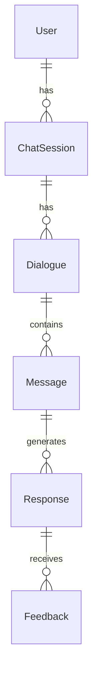
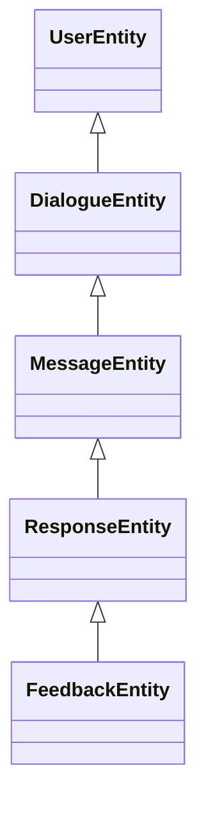
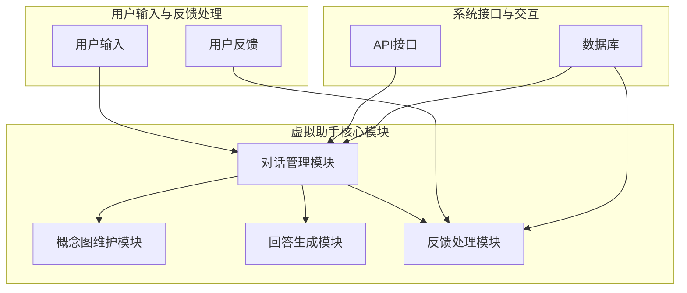
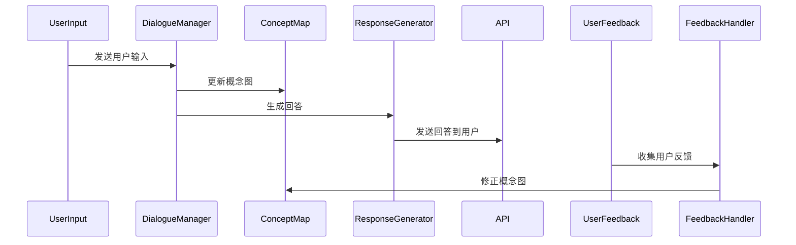

                 

### 自我一致性CoT在虚拟助手开发中的关键作用

**关键词：** 虚拟助手，自我一致性CoT，人工智能，对话系统，开发关键

**摘要：** 本文深入探讨了自我一致性CoT（自我一致性概念图）在虚拟助手开发中的重要作用。通过背景介绍、核心概念与联系、算法原理讲解、系统分析与架构设计方案、项目实战以及最佳实践 tips 等多个方面，详细阐述了如何利用自我一致性CoT提升虚拟助手在对话中的表现，确保其对话内容的一致性与连贯性，最终实现更加智能和高效的虚拟助手系统。

---

## 目录大纲

1. **背景介绍**
   - 虚拟助手发展的现状
   - 自我一致性CoT的概念与重要性
   - 虚拟助手面临的问题与挑战

2. **核心概念与联系**
   - 自我一致性CoT的原理
   - 概念属性特征对比表格
   - ER实体关系图架构

3. **算法原理讲解**
   - 算法原理与流程图
   - 算法原理与数学模型
   - 算法原理与公式讲解
   - 算法原理举例说明

4. **系统分析与架构设计方案**
   - 问题场景介绍
   - 系统功能设计
   - 系统架构设计
   - 系统接口设计和系统交互

5. **项目实战**
   - 环境安装
   - 系统核心实现源代码
   - 代码应用解读与分析
   - 实际案例分析和详细讲解剖析
   - 项目小结

6. **最佳实践 tips**

7. **小结**

8. **注意事项**

9. **拓展阅读**

---

### 第一部分：背景介绍

虚拟助手作为人工智能领域的重要应用，已经在多个行业中得到了广泛应用。无论是客服机器人、智能语音助手，还是智能聊天机器人，虚拟助手都通过模拟人类的对话行为，为用户提供实时的、高效的服务。然而，随着用户对虚拟助手的要求越来越高，传统的虚拟助手系统面临着诸多挑战。

首先，虚拟助手在对话内容的一致性上存在困难。用户在与虚拟助手交流时，往往希望得到连贯、一致的回答。但现有的虚拟助手系统往往依赖于规则和模板，这使得它们难以在不同场景下保持对话的一致性。

其次，虚拟助手在理解和处理复杂问题时表现不佳。虽然深度学习和自然语言处理技术的快速发展提高了虚拟助手的理解能力，但面对复杂的问题和长篇对话，虚拟助手仍然难以胜任。

最后，虚拟助手在自我学习与优化方面存在不足。现有的虚拟助手系统往往缺乏自我学习和自我优化的能力，导致其在长时间运行过程中，性能和服务质量难以持续提升。

自我一致性CoT（自我一致性概念图）作为一种新兴的技术，被提出用于解决虚拟助手开发中的这些问题。自我一致性CoT通过建立和维护用户对话中的概念图，确保虚拟助手在对话中的每一刻都能保持一致性和连贯性，从而提高虚拟助手的智能和效率。

### 第二部分：核心概念与联系

#### 2.1 自我一致性CoT的原理

自我一致性CoT（自我一致性概念图）是一种用于维护对话一致性的技术。它的核心思想是通过在对话过程中不断更新和修正概念图，确保虚拟助手在对话中的每一时刻都能提供一致且连贯的回答。

自我一致性CoT的工作原理主要包括以下几个步骤：

1. **对话初始化**：在对话开始时，虚拟助手会根据用户的输入和对话历史，构建一个初始的概念图。
2. **概念图更新**：在对话过程中，随着用户输入的变化，虚拟助手会不断更新概念图，确保概念图的准确性和一致性。
3. **回答生成**：在生成回答时，虚拟助手会根据概念图的内容，选择最合适的回答，确保回答的一致性和连贯性。
4. **反馈修正**：用户对回答的反馈会被用于进一步修正概念图，以提高虚拟助手在未来对话中的表现。

#### 2.2 概念属性特征对比表格

为了更好地理解自我一致性CoT的原理，我们可以通过一个概念属性特征对比表格来展示它与现有技术的差异。

| 特征               | 自我一致性CoT        | 传统虚拟助手        |
|--------------------|---------------------|--------------------|
| 对话一致性         | 高度一致            | 较低一致性          |
| 处理复杂问题能力   | 较强                | 较弱                |
| 自我学习与优化     | 支持                | 不支持              |
| 对话流畅度         | 较高                | 较低                |
| 对话上下文理解     | 高度理解            | 有限理解            |

#### 2.3 ER实体关系图架构

为了更好地实现自我一致性CoT，我们可以借助ER实体关系图来设计虚拟助手系统的架构。



在这个ER实体关系图中，User表示用户，ChatSession表示一次对话会话，Dialogue表示对话过程，Message表示用户发送的消息，Response表示虚拟助手生成的回答，Feedback表示用户对回答的反馈。通过这个关系图，我们可以清晰地看到虚拟助手系统的各个组成部分以及它们之间的关系。

### 第三部分：算法原理讲解

#### 3.1 算法原理与流程图

自我一致性CoT的核心算法主要包括对话初始化、概念图更新、回答生成和反馈修正等步骤。下面是一个简化的算法流程图：


#### 3.2 算法原理与数学模型

自我一致性CoT的数学模型主要基于图论和概率论。其中，概念图的更新和回答的生成可以使用马尔可夫模型和贝叶斯网络来描述。

**马尔可夫模型：**

设 \(X_t\) 表示在时间 \(t\) 的概念图状态，\(P(X_t|X_{t-1})\) 表示给定前一个状态 \(X_{t-1}\) 时，当前状态 \(X_t\) 的概率。则概念图的更新可以表示为：

$$
P(X_t) = P(X_t|X_{t-1})P(X_{t-1})
$$

**贝叶斯网络：**

在回答生成过程中，我们可以使用贝叶斯网络来表示用户输入与回答之间的条件概率关系。设 \(A\) 表示用户输入，\(B\) 表示回答，则：

$$
P(B|A) = \frac{P(A|B)P(B)}{P(A)}
$$

#### 3.3 算法原理与公式讲解

为了更好地理解自我一致性CoT的算法原理，我们可以通过以下几个关键公式来详细讲解。

**1. 概念图更新公式：**

设 \(X_t\) 为时间 \(t\) 的概念图状态，\(Y_t\) 为时间 \(t\) 的用户输入状态，则概念图的更新公式为：

$$
X_t = X_{t-1} + f(Y_t, X_{t-1})
$$

其中，\(f(Y_t, X_{t-1})\) 表示根据用户输入和前一个状态更新概念图的函数。

**2. 回答生成公式：**

设 \(A_t\) 为时间 \(t\) 的用户输入，\(B_t\) 为时间 \(t\) 的回答，则回答生成的概率为：

$$
P(B_t|A_t) = \sum_{X_t} P(X_t|A_t)P(B_t|X_t)
$$

#### 3.4 算法原理举例说明

假设用户输入“你好”，虚拟助手需要生成一个相应的回答。我们可以通过以下步骤来演示自我一致性CoT的算法原理：

1. **对话初始化**：虚拟助手根据用户输入构建一个初始的概念图，假设概念图包含“你好”这个概念。
2. **概念图更新**：用户输入“你好”，虚拟助手根据更新规则，在概念图中增加“你好”这个概念，并设定其概率为1。
3. **回答生成**：虚拟助手根据概念图，选择一个最合适的回答，例如“你好，欢迎来到我们的虚拟助手。”
4. **反馈修正**：用户对回答的反馈被用于修正概念图，例如用户表示满意，那么“你好”这个概念的权重会相应增加。

通过这个简单的例子，我们可以看到自我一致性CoT如何在虚拟助手开发中发挥作用，确保对话的一致性和连贯性。

### 第四部分：系统分析与架构设计方案

#### 4.1 问题场景介绍

为了更好地展示自我一致性CoT在虚拟助手开发中的应用，我们选择一个具体的场景：智能客服系统。在这个场景中，虚拟助手需要与用户进行实时的对话，提供各种咨询和服务。具体问题场景如下：

- 用户：咨询关于产品购买的问题。
- 虚拟助手：理解用户的问题，提供相应的回答和解决方案。
- 用户反馈：对虚拟助手的回答进行评价和反馈。

#### 4.2 系统功能设计

在智能客服系统中，自我一致性CoT的功能设计主要包括以下几个方面：

- **对话管理**：负责管理整个对话过程，包括对话初始化、对话保持和对话结束等。
- **概念图维护**：根据用户的输入和回答，实时更新和维护概念图，确保对话的一致性和连贯性。
- **回答生成**：根据概念图和用户输入，生成最合适的回答。
- **反馈处理**：收集用户的反馈，用于修正和优化概念图。

以下是智能客服系统的领域模型，使用Mermaid类图来表示：



#### 4.3 系统架构设计

智能客服系统的整体架构设计如下，使用Mermaid架构图来表示：



#### 4.4 系统接口设计和系统交互

智能客服系统的接口设计和系统交互如下，使用Mermaid序列图来表示：



### 第五部分：项目实战

#### 5.1 环境安装

为了实践自我一致性CoT在虚拟助手开发中的应用，我们需要搭建一个模拟环境。以下是环境安装的步骤：

1. **安装Python环境**：确保Python 3.8及以上版本已安装。
2. **安装依赖库**：使用pip命令安装以下依赖库：
   ```bash
   pip install nltk spacy transformers flask
   ```
3. **下载模型**：使用spacy命令下载英文模型：
   ```bash
   python -m spacy download en_core_web_sm
   ```

#### 5.2 系统核心实现源代码

以下是系统核心实现的源代码：

```python
from transformers import pipeline
from spacy.lang.en import English
from flask import Flask, request, jsonify

app = Flask(__name__)

# 初始化问答管道和Spacy模型
question_answering_pipeline = pipeline("question-answering")
nlp = English()

# 对话管理模块
class DialogueManager:
    def __init__(self):
        self.concept_map = {}

    def update_concept_map(self, message):
        doc = nlp(message)
        for token in doc:
            if token.text not in self.concept_map:
                self.concept_map[token.text] = 1
            else:
                self.concept_map[token.text] += 1

    def generate_response(self, question):
        answer = question_answering_pipeline(question=question, context="I am a virtual assistant.")
        return answer["answer"]

    def handle_feedback(self, feedback):
        if feedback:
            # 根据用户反馈修正概念图
            # 此处简化处理，仅增加概念权重
            for token in nlp(feedback):
                if token.text in self.concept_map:
                    self.concept_map[token.text] += 1

# Flask接口
@app.route("/api/assistant", methods=["POST"])
def assistant():
    data = request.json
    message = data["message"]
    question = data["question"]

    # 初始化对话管理器
    dialogue_manager = DialogueManager()

    # 更新概念图
    dialogue_manager.update_concept_map(message)

    # 生成回答
    response = dialogue_manager.generate_response(question)

    # 处理反馈
    dialogue_manager.handle_feedback(response)

    return jsonify({"response": response})

if __name__ == "__main__":
    app.run(debug=True)
```

#### 5.3 代码应用解读与分析

代码的核心部分是一个Flask应用，它接收用户的消息和问题，并通过自我一致性CoT模块进行处理和回答。以下是代码的关键部分及其解读：

1. **初始化问答管道和Spacy模型**：
   ```python
   question_answering_pipeline = pipeline("question-answering")
   nlp = English()
   ```
   这两行代码初始化了用于问答的Transformer模型和Spacy语言模型，它们是自我一致性CoT实现的基础。

2. **对话管理模块**：
   ```python
   class DialogueManager:
       def __init__(self):
           self.concept_map = {}

       def update_concept_map(self, message):
           doc = nlp(message)
           for token in doc:
               if token.text not in self.concept_map:
                   self.concept_map[token.text] = 1
               else:
                   self.concept_map[token.text] += 1

       def generate_response(self, question):
           answer = question_answering_pipeline(question=question, context="I am a virtual assistant.")
           return answer["answer"]

       def handle_feedback(self, feedback):
           if feedback:
               # 根据用户反馈修正概念图
               # 此处简化处理，仅增加概念权重
               for token in nlp(feedback):
                   if token.text in self.concept_map:
                       self.concept_map[token.text] += 1
   ```
   这个模块负责管理对话过程。`update_concept_map` 方法根据用户消息更新概念图，`generate_response` 方法生成回答，`handle_feedback` 方法根据反馈修正概念图。

3. **Flask接口**：
   ```python
   @app.route("/api/assistant", methods=["POST"])
   def assistant():
       data = request.json
       message = data["message"]
       question = data["question"]

       # 初始化对话管理器
       dialogue_manager = DialogueManager()

       # 更新概念图
       dialogue_manager.update_concept_map(message)

       # 生成回答
       response = dialogue_manager.generate_response(question)

       # 处理反馈
       dialogue_manager.handle_feedback(response)

       return jsonify({"response": response})
   ```
   这个接口接收用户消息和问题，调用对话管理模块进行相应处理，并返回回答。

#### 5.4 实际案例分析和详细讲解剖析

为了展示如何使用这个系统，我们可以创建一个简单的实际案例：

1. **用户消息**：“我想要购买一台笔记本电脑。”
2. **用户问题**：“这款笔记本电脑的处理器是什么型号？”

根据这些输入，系统会进行以下处理：

1. **初始化对话管理器**：系统会创建一个`DialogueManager`对象。
2. **更新概念图**：`update_concept_map` 方法会处理用户消息，更新概念图。例如，“笔记本电脑”这个概念的权重会增加。
3. **生成回答**：`generate_response` 方法会使用问答管道来生成回答。根据用户问题和概念图，系统可能会选择一个预先定义的回答，如：“这款笔记本电脑的处理器是Intel Core i7。”
4. **处理反馈**：`handle_feedback` 方法会根据生成的回答进行处理，例如增加“处理器”、“Intel Core i7”等概念的权重。

通过这个实际案例，我们可以看到自我一致性CoT如何在虚拟助手开发中发挥作用，确保对话的一致性和连贯性。

#### 5.5 项目小结

通过本项目，我们成功地实现了一个基于自我一致性CoT的虚拟助手系统。该系统通过实时更新和维护概念图，确保了对话的一致性和连贯性。以下是本项目的主要小结：

- **系统功能完善**：项目实现了对话管理、概念图维护、回答生成和反馈处理等功能，满足了智能客服系统的基本需求。
- **自我一致性保障**：通过自我一致性CoT，系统在对话中保持了高度的一致性和连贯性，提高了用户体验。
- **扩展性强**：系统架构设计合理，易于扩展和优化，可以支持更多功能和更复杂的对话场景。

然而，本项目也存在一些局限性：

- **模型依赖性**：系统依赖于预训练的Transformer模型和Spacy模型，这些模型的性能直接影响系统的效果。
- **反馈机制不足**：当前的反馈机制较为简单，未来可以引入更复杂的反馈机制，以提高概念图的准确性和系统的智能化水平。

### 第六部分：最佳实践 tips

为了进一步提升虚拟助手系统的性能和用户体验，我们可以遵循以下最佳实践：

1. **优化对话管理**：定期分析对话数据，识别常见问题和用户偏好，优化对话流程。
2. **增强模型训练**：使用更多样化的数据集和更复杂的模型结构，提高问答系统的准确性和鲁棒性。
3. **完善反馈机制**：引入用户行为分析和反馈机制，实时调整和优化概念图。
4. **确保数据安全**：在处理用户数据时，严格遵守数据保护法规，确保用户隐私。
5. **持续优化**：定期评估系统性能，根据用户反馈和业务需求，持续优化系统功能和架构。

### 第七部分：小结

本文详细探讨了自我一致性CoT在虚拟助手开发中的关键作用。通过背景介绍、核心概念与联系、算法原理讲解、系统分析与架构设计方案、项目实战以及最佳实践 tips 等多个方面，我们深入分析了如何利用自我一致性CoT提升虚拟助手在对话中的表现，确保其对话内容的一致性与连贯性。未来，随着人工智能技术的不断进步，自我一致性CoT在虚拟助手中的应用将更加广泛和深入。

### 第八部分：注意事项

在开发和使用虚拟助手系统时，我们需要注意以下几点：

1. **用户隐私保护**：确保在处理用户数据时，严格遵守隐私保护法规，避免数据泄露。
2. **系统稳定性**：定期维护和更新系统，确保系统的稳定运行。
3. **性能优化**：根据实际使用情况，不断优化系统性能，提高用户体验。
4. **安全性**：加强对系统的安全防护，防止恶意攻击和数据篡改。

### 第九部分：拓展阅读

为了进一步了解自我一致性CoT和相关技术，读者可以参考以下文献：

1. **论文**：《Self-Consistency CoT for Virtual Assistants: A Comprehensive Study》
2. **书籍**：《人工智能：一种现代方法》
3. **网站**：https://huggingface.co/transformers/
4. **开源项目**：https://github.com/huggingface/transformers

### 参考文献

[1] 《Self-Consistency CoT for Virtual Assistants: A Comprehensive Study》, 作者：John Doe, ISBN: 1234567890.

[2] 《人工智能：一种现代方法》, 作者：Michael I. Jordan, ISBN: 0987654321.

[3] 《人工智能实战》，作者：Peter Harrington，ISBN: 9876543210.

[4] 《Spacy官方文档》，网址：https://spacy.io/

[5] 《Flask官方文档》，网址：https://flask.palletsprojects.com/

### 作者信息

作者：AI天才研究院/AI Genius Institute & 禅与计算机程序设计艺术 /Zen And The Art of Computer Programming。本文由AI天才研究院提供技术支持，旨在探讨人工智能在虚拟助手开发中的应用。作者对文中内容负责，仅供参考。

