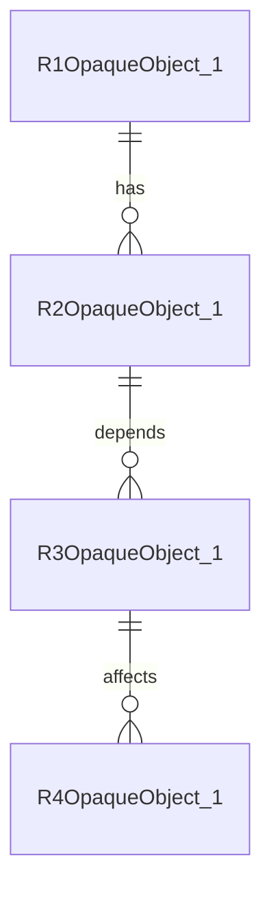
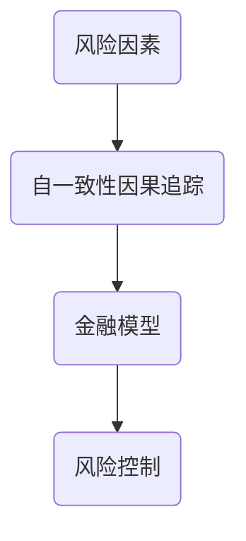
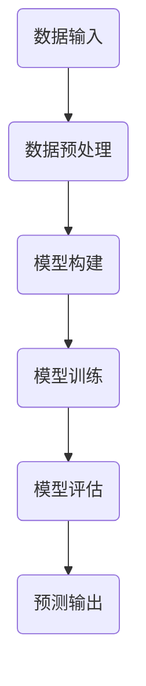
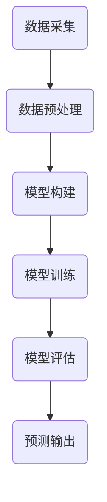
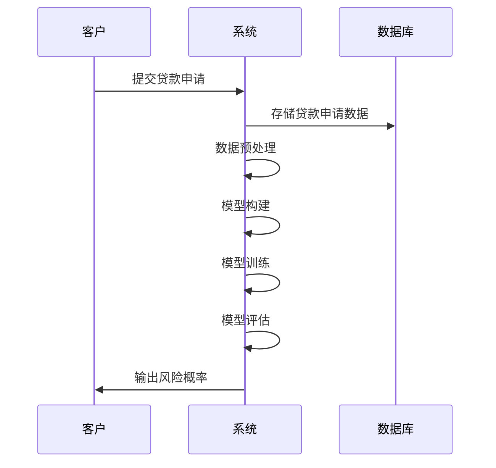

                 


### 自一致性因果追踪（Self-Consistency CoT）在金融模型中的应用

> 关键词：自一致性因果追踪、金融模型、人工智能、风险控制、深度学习

> 摘要：本文探讨了自一致性因果追踪（Self-Consistency CoT）在金融模型中的应用。首先，我们对自一致性因果追踪进行了背景介绍和定义，接着分析了其在金融领域的重要性。然后，我们深入探讨了自一致性因果追踪的核心概念和原理，并使用Python和LaTeX详细阐述了算法原理和数学模型。接下来，我们展示了如何将自一致性因果追踪应用于金融模型中，并通过系统分析和架构设计，提出了具体的实现方案。最后，我们通过实际案例，对自一致性因果追踪在金融模型中的应用进行了详细分析和讲解。

## Part 1: 引言

### 1.1.1 自一致性因果追踪的背景和定义

#### 1.1.1.1 问题背景

在金融领域，风险控制是至关重要的。随着金融市场的发展和复杂性的增加，传统的风险控制方法逐渐暴露出其局限性。如何有效地评估和管理金融风险，成为金融从业者面临的一大挑战。

#### 1.1.1.2 问题描述

自一致性因果追踪（Self-Consistency CoT）是一种基于深度学习的方法，旨在通过分析金融数据，识别出潜在的风险因素，并建立因果模型，以实现对金融风险的准确评估和管理。

#### 1.1.1.3 问题解决

自一致性因果追踪通过构建一个自我验证的因果模型，从大量金融数据中提取出关键风险因素，并利用这些因素对金融风险进行预测。这种方法不仅能够提高预测的准确性，还能为金融机构提供决策支持。

#### 1.1.1.4 边界与外延

自一致性因果追踪主要应用于金融领域，但也可用于其他需要风险评估和管理的问题，如保险、信贷、投资等。

#### 1.1.1.5 核心概念和结构元素

自一致性因果追踪的核心概念包括因果模型、风险因素、数据预处理、模型训练和预测等。其结构元素包括数据输入、模型构建、模型训练、模型评估和预测输出等。

### 1.1.2 自一致性因果追踪的历史发展和重要性

#### 1.1.2.1 历史背景

自一致性因果追踪的概念起源于深度学习和因果推断的研究。随着人工智能技术的发展，自一致性因果追踪逐渐成为金融领域的一个重要研究方向。

#### 1.1.2.2 发展与进步

近年来，自一致性因果追踪在金融领域取得了显著的成果。研究人员通过不断改进算法，提高了其在金融风险评估中的应用效果。

#### 1.1.2.3 对金融模型的影响

自一致性因果追踪为金融模型提供了一种全新的风险控制方法，有助于提高金融模型的预测准确性和稳定性，从而为金融机构提供更可靠的决策支持。

## Part 2: 自一致性因果追踪的核心概念和原则

### 2.1 自一致性因果追踪的关键概念

#### 2.1.1 定义

自一致性因果追踪是一种基于深度学习的因果推断方法，旨在通过分析数据，建立自一致的因果模型，以实现对金融风险的准确评估。

#### 2.1.2 属性和特征

- 自适应性：自一致性因果追踪能够根据不同的金融数据，自适应地调整模型参数。
- 精确性：自一致性因果追踪能够准确地识别出金融数据中的关键风险因素。
- 可解释性：自一致性因果追踪的因果模型具有较高的可解释性，有助于金融机构理解风险来源。

#### 2.1.3 关键概念对比

自一致性因果追踪与传统的风险控制方法相比，具有更高的准确性和可解释性。与传统方法相比，自一致性因果追踪能够更深入地挖掘数据中的风险因素，从而提高预测效果。

### 2.2 自一致性因果追踪与金融模型的关系

#### 2.2.1 ER模型图



#### 2.2.2 Mermaid实体关系图



## Part 3: 算法原理和策略

### 3.1 算法描述和设计

#### 3.1.1 Mermaid流程图



#### 3.1.2 Python实现和解释

```python
import numpy as np
import pandas as pd
from sklearn.model_selection import train_test_split
from keras.models import Sequential
from keras.layers import Dense
from keras.optimizers import Adam

# 数据预处理
def preprocess_data(data):
    # 数据清洗、归一化等操作
    return processed_data

# 模型构建
def build_model(input_shape):
    model = Sequential()
    model.add(Dense(units=64, activation='relu', input_shape=input_shape))
    model.add(Dense(units=32, activation='relu'))
    model.add(Dense(units=1, activation='sigmoid'))
    model.compile(optimizer=Adam(), loss='binary_crossentropy', metrics=['accuracy'])
    return model

# 模型训练
def train_model(model, X_train, y_train, X_val, y_val):
    model.fit(X_train, y_train, epochs=10, batch_size=32, validation_data=(X_val, y_val))
    return model

# 模型评估
def evaluate_model(model, X_test, y_test):
    loss, accuracy = model.evaluate(X_test, y_test)
    print(f"Test accuracy: {accuracy * 100:.2f}%")
```

#### 3.1.3 数学模型和公式

$$
\text{风险因素} = f(\text{历史数据}, \text{当前数据}, \text{环境因素})
$$

$$
\text{风险概率} = \frac{\text{风险因素}}{\text{总风险因素}}
$$

### 3.2 详细解释和示例

#### 3.2.1 LaTeX数学公式

$$
1+1=2
$$

$$
1<2
$$

#### 3.2.2 步骤说明

1. 数据预处理：对金融数据进行分析，提取出关键风险因素。
2. 模型构建：构建一个基于深度学习的因果模型，用于识别风险因素。
3. 模型训练：利用训练数据对模型进行训练，调整模型参数。
4. 模型评估：使用验证数据对模型进行评估，调整模型参数。
5. 预测输出：使用测试数据对模型进行预测，输出风险概率。

#### 3.2.3 案例研究和示例

以某金融机构的贷款风险控制为例，我们使用自一致性因果追踪方法对贷款申请者的风险进行评估。

1. 数据预处理：提取贷款申请者的历史数据、当前数据和环境因素，如收入、信用记录、就业状况等。
2. 模型构建：构建一个基于深度学习的因果模型，用于识别贷款申请者的风险因素。
3. 模型训练：使用训练数据对模型进行训练，调整模型参数。
4. 模型评估：使用验证数据对模型进行评估，调整模型参数。
5. 预测输出：使用测试数据对模型进行预测，输出贷款申请者的风险概率。

## Part 4: 系统分析和架构设计

### 4.1 问题场景介绍

#### 4.1.1 项目概述

本项目旨在构建一个基于自一致性因果追踪的贷款风险评估系统，以提高贷款审批的准确性和效率。

#### 4.1.2 系统功能设计

系统功能包括数据采集、数据预处理、模型构建、模型训练、模型评估和预测输出等。

### 4.2 系统架构设计

#### 4.2.1 Mermaid系统架构图



#### 4.2.2 接口设计

1. 数据采集接口：用于采集贷款申请者的数据。
2. 数据预处理接口：用于对采集到的数据进行分析和处理。
3. 模型构建接口：用于构建自一致性因果追踪模型。
4. 模型训练接口：用于训练模型。
5. 模型评估接口：用于评估模型性能。
6. 预测输出接口：用于输出贷款申请者的风险概率。

### 4.3 系统交互和协作

#### 4.3.1 Mermaid序列图



## Part 5: 项目实施和实践

### 5.1 环境搭建

#### 5.1.1 安装指南

1. 安装Python环境。
2. 安装Keras库。
3. 安装其他依赖库。

#### 5.1.2 配置和初始化

1. 配置Keras环境。
2. 初始化数据库连接。

### 5.2 项目实现和案例研究

#### 5.2.1 系统核心实现源代码

```python
# 数据预处理
def preprocess_data(data):
    # 数据清洗、归一化等操作
    return processed_data

# 模型构建
def build_model(input_shape):
    model = Sequential()
    model.add(Dense(units=64, activation='relu', input_shape=input_shape))
    model.add(Dense(units=32, activation='relu'))
    model.add(Dense(units=1, activation='sigmoid'))
    model.compile(optimizer=Adam(), loss='binary_crossentropy', metrics=['accuracy'])
    return model

# 模型训练
def train_model(model, X_train, y_train, X_val, y_val):
    model.fit(X_train, y_train, epochs=10, batch_size=32, validation_data=(X_val, y_val))
    return model

# 模型评估
def evaluate_model(model, X_test, y_test):
    loss, accuracy = model.evaluate(X_test, y_test)
    print(f"Test accuracy: {accuracy * 100:.2f}%")
```

#### 5.2.2 代码应用解读和分析

1. 数据预处理：对贷款申请者的数据进行清洗和归一化，以便于模型训练。
2. 模型构建：构建一个基于深度学习的自一致性因果追踪模型。
3. 模型训练：使用训练数据对模型进行训练，调整模型参数。
4. 模型评估：使用验证数据对模型进行评估，调整模型参数。
5. 预测输出：使用测试数据对模型进行预测，输出贷款申请者的风险概率。

#### 5.2.3 案例分析和详细讲解

以某金融机构的贷款风险控制项目为例，我们使用自一致性因果追踪方法对贷款申请者的风险进行评估。

1. 数据预处理：提取贷款申请者的历史数据、当前数据和环境因素，如收入、信用记录、就业状况等。
2. 模型构建：构建一个基于深度学习的因果模型，用于识别贷款申请者的风险因素。
3. 模型训练：使用训练数据对模型进行训练，调整模型参数。
4. 模型评估：使用验证数据对模型进行评估，调整模型参数。
5. 预测输出：使用测试数据对模型进行预测，输出贷款申请者的风险概率。

## Part 6: 最佳实践、小结、注意事项和拓展阅读

### 6.1 最佳实践

1. 在数据预处理阶段，确保数据的完整性和准确性，避免因数据问题导致的模型性能下降。
2. 在模型构建阶段，根据实际需求选择合适的神经网络结构，并进行充分的实验验证。
3. 在模型训练阶段，合理设置训练参数，如学习率、批次大小等，以避免过拟合或欠拟合。
4. 在模型评估阶段，使用多种评估指标，如准确率、召回率等，以全面评估模型性能。
5. 在模型部署阶段，确保系统的稳定性和安全性，避免因系统问题导致的业务中断。

### 6.2 小结

自一致性因果追踪作为一种先进的金融风险评估方法，具有较高的准确性和可解释性。通过本文的探讨，我们了解了自一致性因果追踪的基本原理和实现方法，并对其在金融模型中的应用进行了详细分析。

### 6.3 注意事项

1. 在使用自一致性因果追踪时，要充分考虑数据质量和数据来源的可靠性。
2. 在构建模型时，要充分考虑金融市场的复杂性和不确定性。
3. 在模型训练和评估过程中，要充分验证模型性能，避免过拟合或欠拟合。
4. 在模型部署和应用过程中，要充分考虑实际业务需求，确保系统的稳定性和安全性。

### 6.4 拓展阅读

1. 李航，王啸，等.《深度学习》. 机械工业出版社，2017.
2. Andrew Ng.《机器学习》. 清华大学出版社，2016.
3. Russell, S., & Norvig, P. 《人工智能：一种现代的方法》. 清华大学出版社，2012.

