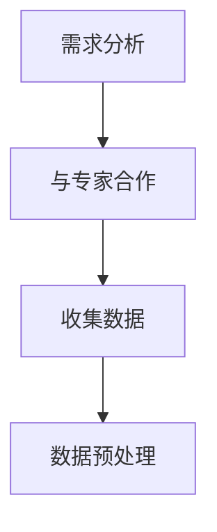
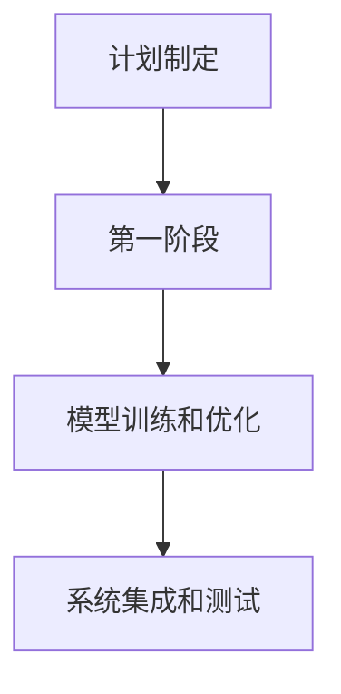
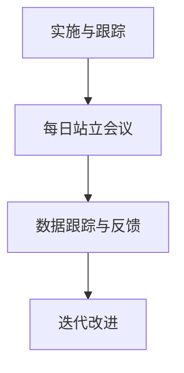

                 

### Sprint规划：为AI应用开发设定明确目标

在当今快速发展的技术时代，人工智能（AI）已经成为推动创新和变革的重要力量。然而，AI项目的复杂性和不确定性使得开发过程充满了挑战。为了确保AI应用项目能够高效、有序地进行，Sprint规划成为了一种关键的管理工具。本文将深入探讨Sprint规划在AI应用开发中的作用，通过详细的步骤和方法，帮助开发者设定明确的目标，实现项目的成功。

## 关键词

- 人工智能
- Sprint规划
- 项目管理
- 目标设定
- AI应用开发

## 摘要

本文旨在探讨Sprint规划在AI应用开发中的应用。首先，我们介绍了人工智能的快速发展及其带来的挑战，然后定义了Sprint规划的概念和核心要素，对比了Sprint规划与传统项目管理的方法。接着，我们详细阐述了Sprint规划的步骤与方法，特别关注了AI应用开发的特殊考虑。通过一个案例研究，我们展示了如何在实际项目中应用Sprint规划，并总结了最佳实践。最后，我们对AI应用开发中的Sprint规划趋势进行了展望。

### 目录大纲

1. 背景介绍
   1.1 人工智能的快速发展与挑战
   1.2 Sprint规划的概念与作用
   1.3 本书结构安排与读者定位

2. 核心概念与联系
   2.1 Sprint规划的定义与核心要素
   2.2 Sprint规划与传统项目管理对比
   2.3 Sprint规划的优势与局限性

3. Sprint规划的步骤与方法
   3.1 准备工作
   3.2 制定Sprint计划
   3.3 实施与跟踪

4. AI应用开发的特殊考虑
   4.1 AI应用开发的特点
   4.2 在Sprint规划中考虑AI应用开发的特殊性
   4.3 AI应用开发的挑战与应对策略

5. 案例研究
   5.1 案例背景
   5.2 Sprint规划过程

6. 最佳实践
   6.1 团队协作技巧
   6.2 时间管理策略
   6.3 经验总结与反思

7. 小结与展望
   7.1 总结与反思
   7.2 AI应用开发中的Sprint规划趋势
   7.3 未来的发展方向与挑战

### 背景介绍

#### 1.1 人工智能的快速发展与挑战

人工智能（AI）作为计算机科学的一个分支，旨在创建能够执行通常需要人类智能才能完成的任务的系统。从最初的规则基础系统，到如今的深度学习算法，AI已经经历了数十年的快速发展。在医疗、金融、交通、教育等多个领域，AI的应用极大地提升了效率和准确性，推动了产业的变革。

然而，AI技术的快速进步也带来了诸多挑战。首先，AI系统的复杂性和不确定性使得开发过程更加复杂。AI模型通常需要大量的数据进行训练，而且训练过程可能非常耗时。其次，AI系统的透明性和可解释性仍然是一个亟待解决的问题。在许多情况下，AI系统是如何做出决策的仍然是一个“黑箱”，这增加了应用过程中的不确定性和风险。

#### 1.2 Sprint规划的概念与作用

Sprint规划是敏捷开发方法中的一种关键实践，源自Scrum框架。Sprint通常是一个时间周期，如两周或一个月，在此期间，开发团队会集中精力完成一系列预定的任务。Sprint规划是在Sprint开始前进行的一系列准备活动，旨在确保团队在Sprint期间能够高效地工作，并达到预定的目标。

Sprint规划的作用主要体现在以下几个方面：

1. **目标明确**：通过Sprint规划，团队可以明确Sprint期间要达成的目标，确保所有成员对目标有共同的理解和认同。
2. **任务分配**：在Sprint规划中，团队会详细讨论并分配任务，确保每个成员都知道自己的职责和任务要求。
3. **资源管理**：Sprint规划可以帮助团队合理安排资源，包括人力、技术和时间，以最大限度地提高生产效率。
4. **风险识别**：通过提前规划，团队能够识别潜在的风险和问题，并采取相应的措施进行防范。

#### 1.3 本书结构安排与读者定位

本书将分为七个章节，系统性地介绍Sprint规划在AI应用开发中的应用。具体结构安排如下：

- **第一章 背景介绍**：介绍人工智能的快速发展与挑战，以及Sprint规划的概念与作用。
- **第二章 核心概念与联系**：详细阐述Sprint规划的定义与核心要素，并对比Sprint规划与传统项目管理的方法。
- **第三章 Sprint规划的步骤与方法**：详细介绍Sprint规划的步骤和方法，包括准备工作、制定Sprint计划以及实施与跟踪。
- **第四章 AI应用开发的特殊考虑**：探讨AI应用开发的特点，如何在Sprint规划中考虑这些特殊性，以及应对AI应用开发的挑战。
- **第五章 案例研究**：通过一个实际案例，展示如何应用Sprint规划。
- **第六章 最佳实践**：总结团队协作技巧、时间管理策略以及经验教训。
- **第七章 小结与展望**：对全文进行总结，展望AI应用开发中的Sprint规划趋势。

本书旨在为AI应用开发人员提供一套系统、实用的Sprint规划指南，帮助他们更好地应对开发过程中的挑战，实现项目的成功。

### 核心概念与联系

在深入探讨Sprint规划在AI应用开发中的作用之前，我们需要明确几个核心概念，并理解它们之间的联系。以下是Sprint规划的定义与核心要素，以及与传统项目管理的对比。

#### 2.1 Sprint规划的定义与核心要素

**Sprint的定义**：

Sprint是敏捷开发中的一个时间周期，通常为两周或一个月。在这段时间内，开发团队会集中精力完成一系列预定的任务。Sprint的目的是确保团队能够在短时间内交付高质量的功能。

**核心要素**：

1. **产品待办事项（Product Backlog）**：产品待办事项是项目的主要任务列表，包括所有需要实现的功能和任务。在Sprint开始前，产品待办事项会被优先级排序，以确定Sprint期间要完成的任务。
2. **Sprint待办事项（Sprint Backlog）**：Sprint待办事项是产品待办事项的一部分，在Sprint开始时被挑选出来，作为Sprint期间要完成的任务。
3. **每日站立会议（Daily Stand-up）**：每日站立会议是团队在Sprint期间每天进行的短会，旨在确保团队成员都了解项目的进展情况，解决任何遇到的问题。
4. **迭代回顾会议（Retrospective）**：迭代回顾会议是Sprint结束后进行的一个会议，团队会反思Sprint期间的工作，讨论哪些地方做得好，哪些地方需要改进。

#### 2.2 核心要素对比

Sprint规划与传统项目管理有许多相似之处，但也有一些显著的区别。以下是几个关键要素的对比：

1. **项目范围**：传统项目管理通常在项目开始时明确项目的范围，并在整个项目期间保持不变。而Sprint规划更灵活，可以在每个Sprint期间根据实际情况调整任务和目标。
2. **时间框架**：传统项目管理通常有一个固定的时间框架，而Sprint规划采用迭代的方式，每个Sprint都有一个固定的时间周期，如两周或一个月。
3. **任务分配**：传统项目管理通常在项目开始时进行详细的任务分配，而Sprint规划更强调团队成员的自主性和协作性。
4. **风险评估**：传统项目管理通常在项目开始时进行详细的风险评估，而Sprint规划通过每日站立会议和迭代回顾会议，随时识别和应对风险。

#### 2.3 Sprint规划的优势与局限性

**优势**：

1. **灵活性**：Sprint规划允许团队在项目进行过程中根据实际情况进行调整，这有助于应对变化和不确定性。
2. **透明性**：通过每日站立会议和迭代回顾会议，团队能够保持高度的透明性，确保所有成员都对项目的进展有清晰的认识。
3. **持续改进**：迭代回顾会议帮助团队不断反思和改进工作方式，提高效率和质量。

**局限性**：

1. **初期投入**：Sprint规划需要团队投入更多的时间进行规划和会议，这可能会影响初期的工作效率。
2. **任务切分**：为了适应Sprint的时间周期，任务可能需要被切分成更小的部分，这可能会导致任务的碎片化。
3. **团队适应性**：Sprint规划对团队的协作能力和适应性有较高的要求，如果团队不适应这种工作方式，可能会导致效率低下。

通过理解这些核心概念和联系，我们可以更好地把握Sprint规划在AI应用开发中的应用，为项目的成功奠定基础。

### Sprint规划的步骤与方法

Sprint规划是确保AI应用开发项目高效、有序进行的关键。以下我们将详细阐述Sprint规划的步骤与方法，帮助团队在每一个阶段都能明确目标、合理分配资源、有效跟踪进度。

#### 3.1 准备工作

Sprint规划的第一步是准备工作，这是确保Sprint成功的关键。准备工作主要包括以下几个方面：

1. **团队组建**：一个高效、协作的团队是成功的关键。团队应包括产品负责人（Product Owner）、开发人员、测试人员和其他相关角色。每个成员都应该明确自己的职责和期望。
   
   ```mermaid
   graph TD
   A[团队组建] --> B[产品负责人]
   B --> C[开发人员]
   C --> D[测试人员]
   D --> E[其他相关角色]
   ```

2. **需求分析**：在开始Sprint之前，团队需要对需求进行详细的分析。这包括理解用户需求、确定功能优先级、识别潜在的风险和问题。

   ```mermaid
   graph TD
   A[需求分析] --> B[用户需求理解]
   B --> C[功能优先级]
   C --> D[风险识别]
   D --> E[问题解决]
   ```

3. **技术评估**：团队需要评估当前的技术栈和资源，确保有足够的能力和资源来支持Sprint计划的任务。这可能包括技术调研、环境搭建和工具选择。

   ```mermaid
   graph TD
   A[技术评估] --> B[技术栈评估]
   B --> C[资源评估]
   C --> D[技术调研]
   D --> E[环境搭建]
   ```

#### 3.2 制定Sprint计划

准备工作完成后，团队将进入制定Sprint计划阶段。这是确保Sprint目标明确、任务合理分配的关键步骤。以下是制定Sprint计划的几个关键点：

1. **设定目标**：在Sprint计划会议中，团队需要明确Sprint的目标。这个目标应该是具体、可衡量、可达成、相关性强、时限性的（SMART）。

   ```mermaid
   graph TD
   A[设定目标] --> B[具体]
   B --> C[可衡量]
   C --> D[可达成]
   D --> E[相关性]
   E --> F[时限性]
   ```

2. **任务分配**：在确定目标后，团队需要将任务分配给每个成员。这可以通过工作分解结构（WBS）来实现，确保每个任务都有明确的责任人和完成时间。

   ```mermaid
   graph TD
   A[任务分配] --> B[工作分解结构]
   B --> C[责任分配]
   C --> D[时间安排]
   ```

3. **优先级排序**：在任务分配后，团队需要对任务进行优先级排序，确保最关键的任务得到优先处理。

   ```mermaid
   graph TD
   A[优先级排序] --> B[关键任务]
   B --> C[非关键任务]
   ```

4. **风险管理**：在制定计划时，团队需要识别潜在的风险，并制定相应的应对策略。

   ```mermaid
   graph TD
   A[风险管理] --> B[风险识别]
   B --> C[应对策略]
   ```

#### 3.3 实施与跟踪

在完成Sprint计划的制定后，团队将进入实施阶段。以下是实施与跟踪的几个关键点：

1. **每日站立会议**：每日站立会议是确保项目进展和问题及时解决的重要机制。会议通常持续15-30分钟，每个成员需要回答以下三个问题：
   - 今天我完成了什么？
   - 我今天要完成什么？
   - 我遇到了什么问题？

   ```mermaid
   graph TD
   A[每日站立会议] --> B[进展汇报]
   B --> C[任务计划]
   C --> D[问题解决]
   ```

2. **数据跟踪与反馈**：团队需要定期跟踪进度，并根据实际情况进行调整。这可以通过项目跟踪工具（如Jira、Trello）来实现。同时，定期进行反馈会议，确保团队能够及时了解项目的进展和改进点。

   ```mermaid
   graph TD
   A[数据跟踪与反馈] --> B[项目跟踪工具]
   B --> C[进度报告]
   C --> D[反馈会议]
   ```

3. **迭代改进**：在Sprint结束时，团队需要进行回顾会议，总结Sprint期间的经验教训，识别改进点。这有助于团队在下一个Sprint中更好地工作。

   ```mermaid
   graph TD
   A[迭代改进] --> B[经验总结]
   B --> C[改进点识别]
   ```

通过以上步骤，团队可以确保Sprint规划的每个阶段都有明确的计划和目标，从而高效、有序地推进AI应用开发项目。

### AI应用开发的特殊考虑

在Sprint规划中，AI应用开发有其独特的特点，这些特点要求我们在制定Sprint计划时进行特别的考虑。以下是AI应用开发的一些主要特点，以及如何在实际的Sprint规划中应对这些特殊性。

#### 4.1 AI应用开发的特点

1. **数据依赖性**：AI应用通常需要大量数据来进行训练和优化。数据的质量和数量直接影响模型的性能和稳定性。因此，在Sprint规划中，数据采集和预处理工作必须得到充分重视。

2. **模型复杂性**：AI模型通常非常复杂，涉及到多种算法和架构。这些模型的开发和优化过程可能需要大量的计算资源和时间。在Sprint规划中，我们需要合理分配资源和时间，以确保模型能够在预定时间内完成。

3. **迭代周期长**：与传统的软件开发不同，AI应用的开发通常需要更长的迭代周期。这是因为模型的训练和优化过程需要大量的时间和计算资源。在Sprint规划中，我们需要考虑到这些因素，合理安排Sprint的长度和任务。

4. **不确定性**：AI模型的性能和效果在早期往往不可预测，这增加了项目的不确定性。在Sprint规划中，我们需要预留一定的缓冲时间，以应对可能出现的意外情况。

#### 4.2 在Sprint规划中考虑AI应用开发的特殊性

1. **模型训练与优化**：在Sprint规划中，我们需要将模型训练和优化作为关键任务进行安排。这包括数据采集、数据预处理、模型选择、模型训练和性能评估等步骤。以下是这些步骤的详细解释：

   ```mermaid
   graph TD
   A[数据采集] --> B[数据预处理]
   B --> C[模型选择]
   C --> D[模型训练]
   D --> E[性能评估]
   ```

   - **数据采集**：确定需要的数据集，并从不同的来源进行数据采集。
   - **数据预处理**：对采集到的数据进行清洗、归一化、特征提取等处理，以提高数据的质量和模型的可训练性。
   - **模型选择**：根据应用需求和数据特性选择合适的模型架构。
   - **模型训练**：使用训练数据进行模型训练，并调整参数以优化模型性能。
   - **性能评估**：通过测试数据对模型进行评估，确保模型在多种场景下都具有良好的性能。

2. **数据处理与存储**：AI应用通常需要处理大量的数据，这要求我们在Sprint规划中考虑数据处理和存储的特殊性。以下是几个关键点：

   - **分布式计算**：使用分布式计算框架（如TensorFlow、PyTorch）来处理大量数据，提高计算效率。
   - **数据存储**：使用高效的数据存储方案（如HDFS、云存储），确保数据的安全和可靠性。
   - **数据备份**：定期备份数据，以防止数据丢失。

3. **版本控制与迭代**：在AI应用开发中，我们需要对模型和代码进行版本控制，以便在每次迭代时能够方便地回溯和比较。以下是几个关键点：

   - **代码版本控制**：使用Git等版本控制系统，对代码进行版本管理。
   - **模型版本控制**：对每个训练好的模型进行版本管理，记录训练参数和性能指标。
   - **迭代计划**：根据模型性能和用户反馈，制定下一次迭代的计划，不断优化模型。

#### 4.3 AI应用开发的挑战与应对策略

AI应用开发面临许多挑战，以下是一些常见的挑战及其应对策略：

1. **计算资源限制**：AI应用通常需要大量的计算资源，特别是在模型训练阶段。应对策略是合理规划资源，使用分布式计算框架，并优先处理关键任务。

   ```mermaid
   graph TD
   A[计算资源限制] --> B[资源规划]
   B --> C[分布式计算]
   C --> D[关键任务优先]
   ```

2. **数据质量问题**：数据质量对AI模型的影响至关重要。应对策略是加强数据质量管理，包括数据清洗、去噪和异常值处理等。

   ```mermaid
   graph TD
   A[数据质量问题] --> B[数据清洗]
   B --> C[去噪]
   C --> D[异常值处理]
   ```

3. **模型解释性**：AI模型通常具有高度的非线性性和复杂性，这使得它们难以解释。应对策略是使用可解释的AI模型或提供模型解释工具，帮助用户理解模型决策过程。

   ```mermaid
   graph TD
   A[模型解释性] --> B[可解释模型]
   B --> C[解释工具]
   ```

通过考虑AI应用开发的特殊性，并在Sprint规划中采取相应的应对策略，我们可以有效地管理AI项目，确保项目的成功。

### 案例研究

#### 5.1 案例背景

本案例研究涉及一个名为“智能医疗诊断系统”的AI应用项目。该系统的目标是利用深度学习算法，通过对医学影像的分析，自动识别和诊断常见的医疗疾病。项目由一家医疗科技公司发起，团队成员包括数据科学家、机器学习工程师、前端和后端开发人员、测试人员以及产品经理。

#### 5.2 Sprint规划过程

在开始项目之前，团队首先进行了需求分析和技术评估，确定了项目的主要功能和关键技术。然后，团队按照以下步骤进行Sprint规划：

##### 5.2.1 需求分析

在需求分析阶段，团队与医疗专家合作，详细了解了各种疾病的诊断标准和常用检测方法。同时，团队还收集了大量的医学影像数据，并进行了数据预处理，确保数据的质量和一致性。



##### 5.2.2 计划制定

在制定Sprint计划时，团队将整个项目分为多个阶段，并确定了每个阶段的目标和任务。以下是一个典型的Sprint计划：

- **第一阶段**：建立基础数据集和初步模型。
  - **任务1**：收集和整理医学影像数据。
  - **任务2**：进行数据预处理，包括数据清洗、归一化和特征提取。
  - **任务3**：选择合适的深度学习框架和算法，构建初步模型。

- **第二阶段**：模型训练和优化。
  - **任务4**：使用训练数据对模型进行训练。
  - **任务5**：调整模型参数，进行性能优化。
  - **任务6**：使用测试数据评估模型性能。

- **第三阶段**：系统集成和测试。
  - **任务7**：将模型集成到医疗诊断系统中。
  - **任务8**：进行系统测试，确保功能的正确性和稳定性。



##### 5.2.3 实施与跟踪

在实施阶段，团队按照Sprint计划进行任务分配，并开始执行各项任务。以下是实施过程中的关键点和跟踪方法：

- **每日站立会议**：团队每天进行站立会议，汇报任务进展和遇到的问题，确保项目进展顺利。
- **数据跟踪与反馈**：团队使用Jira等工具，记录和跟踪每个任务的进展，并定期进行进度报告和反馈会议。
- **迭代改进**：在Sprint结束时，团队进行回顾会议，总结经验教训，识别改进点，为下一个Sprint做好准备。



通过上述Sprint规划过程，团队成功地将智能医疗诊断系统开发出来，并经过多次迭代，最终实现了稳定和高效的性能。

### 最佳实践

在AI应用开发中，团队协作和时间管理是确保项目成功的关键。以下是一些最佳实践，可以帮助团队在Sprint规划过程中提高效率，确保项目的顺利进行。

#### 6.1 团队协作技巧

1. **明确沟通渠道**：确保团队成员之间的沟通渠道畅通，例如使用Slack、Microsoft Teams等即时通讯工具，定期组织线上或线下会议，确保所有成员都能及时了解项目进展和任务分配。

   ```mermaid
   graph TD
   A[明确沟通渠道] --> B[即时通讯工具]
   B --> C[定期会议]
   ```

2. **设立明确的角色和职责**：每个团队成员都应该清楚自己的角色和职责，避免任务重叠和责任不清。同时，鼓励团队成员在需要时互相帮助，共同解决问题。

   ```mermaid
   graph TD
   A[设立明确角色和职责] --> B[避免任务重叠]
   B --> C[互相帮助]
   ```

3. **持续反馈和改进**：通过每日站立会议、迭代回顾会议等机制，团队可以持续反馈和改进工作方式。这种持续改进的文化有助于提高团队协作效率。

   ```mermaid
   graph TD
   A[持续反馈和改进] --> B[每日站立会议]
   B --> C[迭代回顾会议]
   ```

#### 6.2 时间管理策略

1. **任务优先级排序**：在Sprint计划制定阶段，团队需要对任务进行优先级排序，确保最重要的任务得到优先处理。这可以通过制作任务优先级矩阵来实现。

   ```mermaid
   graph TD
   A[任务优先级排序] --> B[任务优先级矩阵]
   ```

2. **时间估算和缓冲时间**：在任务分配时，团队需要对每个任务的时间进行合理估算，并预留一定的缓冲时间，以应对可能出现的延迟和不确定性。

   ```mermaid
   graph TD
   A[时间估算和缓冲时间] --> B[合理估算]
   B --> C[预留缓冲时间]
   ```

3. **持续进度跟踪和调整**：通过使用项目跟踪工具，团队可以持续跟踪任务进度，并根据实际情况进行必要的调整。这有助于确保项目在预定时间内完成。

   ```mermaid
   graph TD
   A[持续进度跟踪和调整] --> B[项目跟踪工具]
   B --> C[进度调整]
   ```

#### 6.3 经验总结与反思

1. **定期总结**：在每个Sprint结束后，团队应进行经验总结，回顾项目的成功之处和不足之处。这有助于团队不断改进工作方式，提高项目的成功率。

   ```mermaid
   graph TD
   A[定期总结] --> B[成功经验]
   B --> C[不足之处]
   ```

2. **反思和改进**：通过反思项目中的问题和挑战，团队可以识别改进点，并在下一个Sprint中实施这些改进措施。这有助于提高团队的整体能力和项目的成功几率。

   ```mermaid
   graph TD
   A[反思和改进] --> B[问题识别]
   B --> C[改进措施]
   ```

通过以上最佳实践，团队可以更好地协作，更有效地管理时间，从而确保AI应用开发项目的成功。

### 小结与展望

在本篇文章中，我们深入探讨了Sprint规划在AI应用开发中的应用。首先，我们介绍了人工智能的快速发展及其带来的挑战，随后定义了Sprint规划的概念和核心要素，并对比了Sprint规划与传统项目管理的方法。接着，我们详细阐述了Sprint规划的步骤与方法，特别关注了AI应用开发的特殊考虑。通过一个实际案例研究，我们展示了如何在实际项目中应用Sprint规划。最后，我们总结了最佳实践，并对未来的发展方向与挑战进行了展望。

Sprint规划为AI应用开发提供了明确的目标设定和高效的任务管理方法。通过合理的Sprint规划，团队能够更好地应对AI项目的复杂性和不确定性，确保项目的成功。未来，随着AI技术的不断进步，Sprint规划在AI应用开发中的应用将更加广泛，并不断优化和完善。

在未来的发展中，我们期待看到Sprint规划与AI技术的深度融合，进一步推动AI应用的创新和变革。同时，我们也需要持续关注和解决AI应用开发中的挑战，如数据质量问题、模型解释性、计算资源限制等，以实现AI技术的广泛应用和可持续发展。通过共同努力，我们将迎接更加智能和高效的未来。

