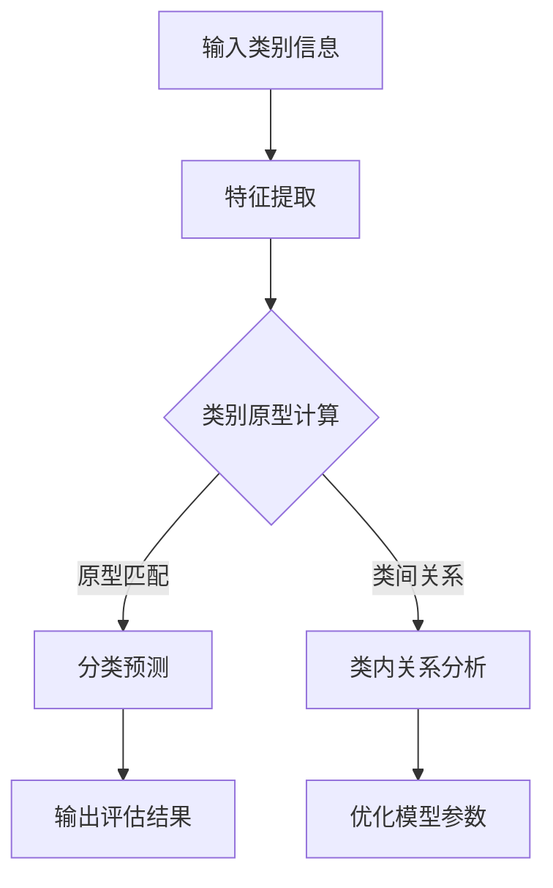
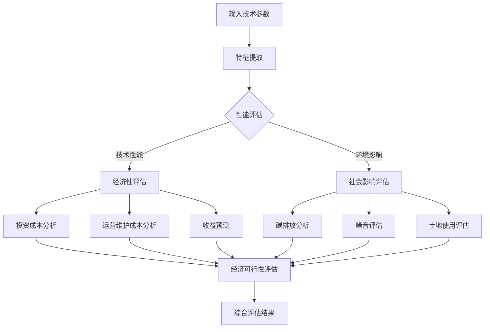
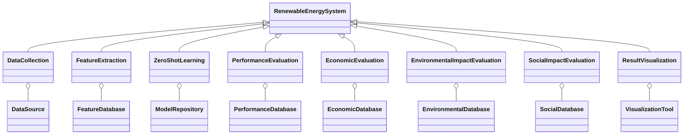
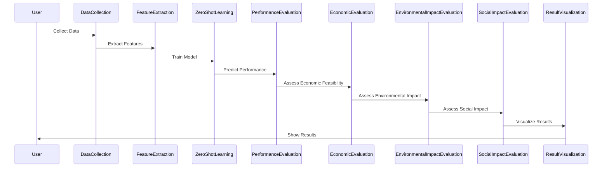
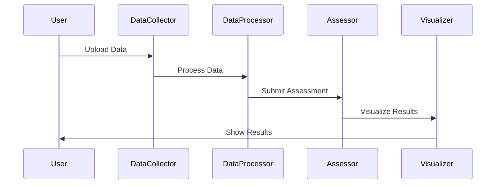

                 

### 第一部分：背景介绍

#### 1.1 问题背景

##### 1.1.1 可再生能源技术发展现状

随着全球能源需求的不断增长和对环境保护意识的提升，可再生能源技术正逐渐成为能源结构中的重要组成部分。太阳能、风能、水能和生物质能等可再生能源技术已在全球范围内得到广泛应用。例如，根据国际可再生能源署（IRENA）的数据，截至2021年底，全球可再生能源装机容量已经超过2000吉瓦，占全球总装机容量的近30%。

可再生能源技术的发展不仅体现在装机容量的增加，还包括技术的进步和成本的降低。太阳能电池的转换效率不断提高，风电设备的单机容量和运行稳定性也在不断增强。此外，储能技术的进步使得可再生能源的间歇性问题得到了有效缓解。

##### 1.1.2 能源技术评估的重要性

能源技术评估是保障能源技术健康发展的重要手段。通过对新能源技术的评估，可以全面了解其技术性能、经济性、环境影响和社会影响等方面，为政策制定者、投资者和运营商提供科学依据。具体而言，能源技术评估的重要性体现在以下几个方面：

1. **技术性能评估**：通过评估新能源技术的基本性能，如发电效率、转换效率等，可以帮助识别技术瓶颈和改进方向。
2. **经济性评估**：分析新能源技术的投资成本、运营维护成本以及收益情况，为投资者提供决策依据。
3. **环境影响评估**：评估新能源技术对环境的影响，如碳排放、噪音等，确保其符合可持续发展要求。
4. **社会影响评估**：评估新能源技术对当地社会、就业、产业链等方面的影响，促进社会和谐发展。

##### 1.1.3 传统评估方法与挑战

目前，传统的能源技术评估方法主要包括实验室测试、现场测试和文献调研等。这些方法在技术性能评估方面具有一定的优势，但在实际应用中存在以下挑战：

1. **高成本**：实验室测试和现场测试需要大量的人力和物力资源，成本较高。
2. **数据不足**：由于实验条件的限制，测试数据往往不足以全面反映新能源技术的实际性能。
3. **适用性有限**：传统评估方法主要适用于成熟技术和已有数据的情况，对于新型可再生能源技术，其适用性有限。
4. **实时性差**：传统评估方法通常需要较长的时间周期，无法满足快速决策的需求。

#### 1.2 问题描述

##### 1.2.1 可再生能源评估需求

随着新能源技术的不断创新和发展，评估需求也在不断变化。具体包括：

1. **新技术的快速评估**：对新型可再生能源技术进行快速、准确的评估，以确定其潜在价值和改进方向。
2. **跨领域融合评估**：将新能源技术与物联网、大数据、人工智能等新兴技术进行融合，进行综合性评估。
3. **实时动态评估**：能够对新能源技术的实时运行状态进行动态监测和评估，提高评估的实时性和准确性。

##### 1.2.2 当前评估方法的局限性

当前评估方法在应对上述需求时存在一定的局限性：

1. **数据依赖性高**：大多数评估方法依赖于大量实验数据和历史数据，而新型可再生能源技术往往缺乏这些数据。
2. **评估周期长**：传统评估方法需要较长的周期，无法满足快速决策的需求。
3. **评估结果主观性大**：评估结果往往受到评估人员主观判断的影响，缺乏客观性和一致性。
4. **无法处理不确定性**：新型可再生能源技术通常面临诸多不确定性，如环境变化、技术进步等，传统评估方法难以处理这些不确定性。

##### 1.2.3 零样本评估的需求与挑战

零样本评估（Zero-Shot CoT）作为一种新兴的评估方法，能够在没有或仅有少量样本数据的情况下对未知技术进行评估。在新型可再生能源技术评估中，零样本评估具有以下需求：

1. **减少数据依赖**：通过零样本评估，可以降低对大量实验数据的依赖，提高评估效率。
2. **快速响应**：零样本评估能够快速地对新型技术进行评估，满足快速决策的需求。
3. **减少主观判断**：通过引入机器学习等技术，零样本评估可以降低评估结果的主观性。

然而，零样本评估在可再生能源技术评估中也面临一些挑战：

1. **数据多样性不足**：由于新能源技术的多样性和复杂性，零样本评估所需的数据多样性要求较高，但在实际应用中难以满足。
2. **算法适应性**：不同的新能源技术可能需要不同的评估算法，如何确保评估算法的通用性和适应性是一个重要问题。
3. **评估准确性**：零样本评估的准确性依赖于算法和数据的准确性，如何提高评估准确性是亟待解决的问题。

#### 1.3 问题解决

##### 1.3.1 零样本评估的定义

零样本评估（Zero-Shot Learning，ZSL）是一种机器学习方法，它允许模型在未见过的新类（新样本）上进行预测。在零样本评估中，模型需要利用已知的类别信息和新类别的有限样本，通过学习类别的内在关系来进行预测。

##### 1.3.2 零样本评估的优势

零样本评估的优势主要体现在以下几个方面：

1. **减少数据依赖**：零样本评估可以减少对大量样本数据的依赖，从而降低评估成本和时间。
2. **快速响应**：零样本评估能够在没有或仅有少量样本数据的情况下快速地对新类别进行评估，满足快速决策的需求。
3. **提高泛化能力**：零样本评估通过学习类别的内在关系，可以提高模型的泛化能力，从而在未知类别上也能获得较好的预测性能。

##### 1.3.3 零样本评估的实现方法

零样本评估的实现方法主要包括以下几种：

1. **原型匹配方法**：这种方法将新类别与已知类别进行原型匹配，通过计算新类别与已知类别之间的距离来评估新类别。例如，原型网络（Prototypical Networks）和匹配网络（Matching Networks）。
2. **元学习方法**：元学习（Meta-Learning）通过训练模型在不同任务上的学习过程，提高模型在未知任务上的泛化能力。例如，模型聚合（Model Aggregation）和MAML算法。
3. **分类扩展方法**：这种方法将分类任务扩展到新类别上，通过在已知类别上训练分类器，并在新类别上进行预测。例如，支持向量机（SVM）和神经网络（NN）。

#### 1.4 边界与外延

##### 1.4.1 零样本评估的应用领域

零样本评估在多个领域都有广泛的应用，主要包括：

1. **计算机视觉**：在图像分类和识别任务中，零样本评估能够对未见过的图像类别进行有效预测。
2. **自然语言处理**：在文本分类和情感分析等任务中，零样本评估可以帮助模型处理未见过的词汇或句子。
3. **语音识别**：在语音分类和识别任务中，零样本评估可以对未见过的语音进行准确分类。

##### 1.4.2 可再生能源评估的技术挑战

可再生能源评估的技术挑战主要包括：

1. **数据多样性**：新能源技术涉及多个领域，如材料科学、工程学、物理学等，如何获取多样化的数据是关键问题。
2. **数据质量**：新能源数据的质量直接影响评估结果的准确性，如何确保数据质量是重要问题。
3. **评估标准**：目前，可再生能源评估的标准和方法仍在不断完善中，如何制定科学合理的评估标准是一个挑战。

##### 1.4.3 未来发展趋势

未来，零样本评估在可再生能源技术评估中的应用有望取得以下发展趋势：

1. **数据驱动评估**：通过大数据和人工智能技术，实现数据驱动的可再生能源评估，提高评估的准确性和效率。
2. **跨领域融合**：将零样本评估与物联网、大数据、人工智能等新兴技术进行融合，实现更加智能化的可再生能源评估。
3. **实时动态评估**：通过实时数据采集和动态评估方法，实现对可再生能源技术的实时监测和评估。

##### 1.5 概念结构与核心要素组成

##### 1.5.1 零样本评估的核心概念

零样本评估的核心概念包括：

1. **类内关系**：类内关系描述了同一类别内不同样本之间的相似性。
2. **类间关系**：类间关系描述了不同类别之间的相似性和差异性。
3. **原型匹配**：原型匹配是通过计算新样本与已知类别原型的距离来进行分类。

##### 1.5.2 可再生能源技术评估的关键要素

可再生能源技术评估的关键要素包括：

1. **技术性能**：包括发电效率、转换效率、运行稳定性等。
2. **经济性**：包括投资成本、运营维护成本、收益等。
3. **环境影响**：包括碳排放、噪音、土地使用等。
4. **社会影响**：包括就业、产业链、社会效益等。

##### 1.5.3 零样本评估与可再生能源评估的融合

零样本评估与可再生能源评估的融合方法主要包括：

1. **数据驱动的评估**：通过收集和分析可再生能源技术相关的数据，利用零样本评估方法进行评估。
2. **模型驱动的评估**：通过构建基于零样本评估的模型，对可再生能源技术进行预测和评估。
3. **融合评估方法**：将零样本评估与传统的实验评估、现场评估等方法进行融合，提高评估的准确性和效率。

##### 1.6 本章小结

本章首先介绍了可再生能源技术评估的背景，包括其发展现状和重要性，以及传统评估方法存在的挑战。随后，我们详细探讨了零样本评估的需求与挑战，并给出了零样本评估的定义和实现方法。最后，本章对零样本评估在可再生能源技术评估中的应用进行了边界与外延的讨论，提出了核心概念和关键要素，以及零样本评估与可再生能源评估的融合方法。这些内容为后续章节的深入探讨奠定了基础。

---

# 第二部分：核心概念与联系

#### 2.1 零样本评估原理

##### 2.1.1 零样本评估的定义

零样本评估（Zero-Shot Learning，ZSL）是一种机器学习技术，它允许模型对从未见过的样本进行预测。在传统机器学习任务中，模型需要大量的标记数据进行训练，以便能够对新的样本进行分类或预测。然而，在实际应用中，获取大量标记数据可能非常困难，尤其是当面对新兴技术或领域时。零样本评估的目标是通过利用已知的类别信息和对类别的内在理解，实现对新类别的预测。

##### 2.1.2 零样本评估的核心特点

零样本评估的核心特点包括：

1. **无样本依赖**：零样本评估不需要对未见过的类别进行单独的样本训练，只需利用已知的类别信息进行预测。
2. **类内关系理解**：零样本评估需要理解类内关系，即同一类别内不同样本的相似性。
3. **类间关系理解**：零样本评估还需要理解类间关系，即不同类别之间的相似性和差异性。

##### 2.1.3 零样本评估的算法原理

零样本评估的算法原理主要包括以下几个方面：

1. **原型匹配**：原型匹配是一种常见的零样本评估方法，它通过计算新样本与已知类别原型的距离来进行分类。原型通常是通过对已知类别样本进行平均值计算得到的。
2. **元学习**：元学习是一种通过训练模型在不同任务上的学习过程来提高模型在未知任务上泛化能力的方法。常见的元学习方法包括模型聚合（Model Aggregation）和MAML（Model-Agnostic Meta-Learning）。
3. **分类扩展**：分类扩展方法通过在已知类别上训练分类器，并在新类别上进行预测。这种方法通常使用支持向量机（SVM）或神经网络（NN）作为分类器。

#### 2.2 可再生能源技术评估原理

##### 2.2.1 可再生能源技术概述

可再生能源技术包括太阳能、风能、水能、生物质能等。这些技术具有可再生、清洁、低碳等特点，对缓解能源危机、减少碳排放具有重要意义。例如，太阳能技术通过光伏效应将太阳光直接转化为电能；风能技术通过风力驱动风车叶片旋转，带动发电机发电；水能技术利用水流或水位差来驱动水轮机发电。

##### 2.2.2 可再生能源技术评估的核心指标

可再生能源技术评估的核心指标主要包括：

1. **技术性能**：包括发电效率、转换效率、设备寿命等。这些指标反映了技术的技术性能水平。
2. **经济性**：包括投资成本、运营维护成本、电价等。这些指标反映了技术的经济可行性。
3. **环境影响**：包括碳排放、噪音、土地使用等。这些指标反映了技术对环境的影响。
4. **社会影响**：包括就业、产业链、社会效益等。这些指标反映了技术的社会效益。

##### 2.2.3 可再生能源技术评估方法

可再生能源技术评估的方法主要包括：

1. **实验评估**：通过实验室测试和现场测试来评估技术性能。
2. **文献调研**：通过查阅相关文献和数据报告来评估技术的经济性、环境影响和社会影响。
3. **模型评估**：通过建立数学模型来评估技术的性能、经济性和环境影响。

#### 2.3 零样本评估与可再生能源评估的对比

##### 2.3.1 概念属性特征对比表格

| 概念              | 零样本评估                   | 可再生能源技术评估                   |
|-----------------|---------------------------|---------------------------|
| 定义              | 无需大量样本数据，利用类别信息进行预测 | 对可再生能源技术进行性能、经济性和环境影响评估 |
| 核心特点          | 无样本依赖，理解类内关系和类间关系  | 技术性能、经济性、环境影响、社会影响 |
| 评估方法          | 原型匹配、元学习、分类扩展         | 实验评估、文献调研、模型评估          |
| 数据需求          | 少量或无样本数据               | 大量实验数据和历史数据              |
| 应用场景          | 新兴技术评估、快速决策          | 可再生能源技术性能评估、经济性评估    |

##### 2.3.2 ER实体关系图架构的 Mermaid 流程图

```mermaid
erDiagram
    AYPEnergyAssessment ||--|{ RenewableEnergyTechnology }
    AYPrediction <<|-- ZSLPrediction
    ZSLPrediction ||--|{ ClassInformation }
    ClassInformation ||--|{ PrototypeMatching }
    ClassInformation ||--|{ MetaLearning }
    ClassInformation ||--|{ ClassificationExtension }
```

#### 2.4 零样本评估与可再生能源评估的融合方法

##### 2.4.1 零样本评估在可再生能源技术评估中的应用

零样本评估在可再生能源技术评估中的应用主要涉及以下几个方面：

1. **技术性能评估**：利用零样本评估方法对新兴的可再生能源技术进行性能预测，从而快速评估其技术可行性。
2. **经济性评估**：通过零样本评估方法，对可再生能源技术的投资成本和运营维护成本进行预测，从而快速评估其经济可行性。
3. **环境影响评估**：利用零样本评估方法，对可再生能源技术的环境影响进行预测，从而快速评估其对环境的影响。
4. **社会影响评估**：通过零样本评估方法，对可再生能源技术对社会的影响进行预测，从而快速评估其社会效益。

##### 2.4.2 融合方法的实现步骤

融合零样本评估与可再生能源技术评估的方法主要包括以下步骤：

1. **数据收集**：收集与可再生能源技术相关的各类数据，包括技术性能数据、经济数据、环境影响数据和社会影响数据。
2. **数据预处理**：对收集到的数据进行清洗、格式化和标准化处理，以便于后续的评估。
3. **类别信息构建**：构建可再生能源技术的类别信息，包括各类别技术的性能指标、经济指标、环境影响指标和社会影响指标。
4. **模型训练**：利用已有的大量数据训练零样本评估模型，包括原型匹配模型、元学习模型和分类扩展模型。
5. **预测与评估**：利用训练好的模型对新兴的可再生能源技术进行预测，并综合评估其技术性能、经济性、环境影响和社会影响。

##### 2.4.3 融合方法的优势与挑战

融合零样本评估与可再生能源技术评估的优势包括：

1. **减少数据依赖**：通过零样本评估方法，可以减少对大量样本数据的依赖，提高评估效率。
2. **快速响应**：零样本评估方法能够快速地对新兴技术进行评估，满足快速决策的需求。
3. **提高评估准确性**：通过综合利用不同来源的数据和评估方法，可以进一步提高评估的准确性。

然而，融合方法也面临一些挑战：

1. **数据多样性**：确保有足够多样性的数据是融合方法成功的关键，但实际应用中可能难以满足这一要求。
2. **算法适应性**：不同的可再生能源技术可能需要不同的评估算法，如何确保评估算法的通用性和适应性是一个问题。
3. **评估准确性**：尽管零样本评估可以提高评估的准确性，但仍然存在一定的不确定性，如何提高评估准确性是一个重要问题。

#### 2.5 本章小结

本章详细介绍了零样本评估与可再生能源技术评估的核心概念和原理，包括零样本评估的定义、核心特点和算法原理，以及可再生能源技术评估的概述、核心指标和评估方法。接着，本章对零样本评估与可再生能源评估进行了对比分析，提出了融合方法的实现步骤和优势与挑战。这些内容为后续章节的深入探讨和实际应用提供了理论基础。

---

## 2.3 零样本评估与可再生能源评估的对比

在深入探讨零样本评估与可再生能源评估的融合方法之前，有必要对两者的核心概念和特点进行详细对比。通过对比分析，我们可以更清晰地理解如何将零样本评估应用于可再生能源技术评估，并探讨其潜在的优势和挑战。

#### 2.3.1 概念属性特征对比表格

为了直观地展示零样本评估与可再生能源技术评估的概念属性特征，我们可以创建一个对比表格：

| 对比属性        | 零样本评估                             | 可再生能源技术评估                             |
|----------------|--------------------------------------|----------------------------------------------|
| **定义**         | 无需大量样本数据，利用类别信息进行预测           | 对可再生能源技术进行性能、经济性和环境影响评估           |
| **核心特点**     | 无样本依赖，理解类内关系和类间关系               | 技术性能、经济性、环境影响、社会影响                   |
| **评估方法**     | 原型匹配、元学习、分类扩展                      | 实验评估、文献调研、模型评估                      |
| **数据需求**     | 少量或无样本数据                          | 大量实验数据和历史数据                          |
| **应用场景**     | 新兴技术评估、快速决策                        | 可再生能源技术性能评估、经济性评估                  |

从上表可以看出，零样本评估和可再生能源技术评估在定义、核心特点、评估方法和数据需求方面存在明显的差异。零样本评估强调无样本依赖和类别信息的使用，而可再生能源技术评估则侧重于对技术性能、经济性、环境影响和社会影响的综合评估。

#### 2.3.2 ER实体关系图架构的 Mermaid 流程图

为了更好地理解两者之间的关系，我们可以使用Mermaid语法绘制一个实体关系图：

```mermaid
erDiagram
    AYPEnergyAssessment ||--|{ RenewableEnergyTechnology }
    AYPrediction <<|-- ZSLPrediction
    ZSLPrediction ||--|{ ClassInformation }
    ZSLPrediction ||--|{ RenewableEnergyPerformance }
    RenewableEnergyPerformance ||--|{ TechnicalPerformance }
    RenewableEnergyPerformance ||--|{ EconomicFeasibility }
    RenewableEnergyPerformance ||--|{ EnvironmentalImpact }
    RenewableEnergyPerformance ||--|{ SocialImpact }
    ClassInformation ||--|{ PrototypeMatching }
    ClassInformation ||--|{ MetaLearning }
    ClassInformation ||--|{ ClassificationExtension }
```

在这个ER图中，我们可以看到零样本评估（ZSLPrediction）与可再生能源技术评估（RenewableEnergyPerformance）之间存在紧密的关系。零样本评估通过类别信息（ClassInformation）与可再生能源技术的性能、经济性、环境影响和社会影响（TechnicalPerformance、EconomicFeasibility、EnvironmentalImpact、SocialImpact）相关联。这种关联展示了如何将零样本评估的概念和原理应用于可再生能源技术评估中。

#### 2.4 零样本评估与可再生能源评估的融合方法

##### 2.4.1 零样本评估在可再生能源技术评估中的应用

零样本评估在可再生能源技术评估中的应用主要涉及以下几个方面：

1. **技术性能评估**：利用零样本评估方法，对新兴的可再生能源技术进行性能预测。这包括发电效率、转换效率、设备寿命等关键性能指标的预测。

2. **经济性评估**：通过零样本评估方法，对可再生能源技术的经济性进行预测。这包括投资成本、运营维护成本、收益等经济指标的预测。

3. **环境影响评估**：利用零样本评估方法，对可再生能源技术的环境影响进行预测。这包括碳排放、噪音、土地使用等环境指标的预测。

4. **社会影响评估**：通过零样本评估方法，对可再生能源技术的社会影响进行预测。这包括就业、产业链、社会效益等社会指标的预测。

##### 2.4.2 融合方法的实现步骤

融合零样本评估与可再生能源技术评估的方法主要包括以下步骤：

1. **数据收集**：收集与可再生能源技术相关的各类数据，包括技术性能数据、经济数据、环境影响数据和社会影响数据。

2. **数据预处理**：对收集到的数据进行清洗、格式化和标准化处理，以便于后续的评估。

3. **类别信息构建**：构建可再生能源技术的类别信息，包括各类别技术的性能指标、经济指标、环境影响指标和社会影响指标。

4. **模型训练**：利用已有的大量数据训练零样本评估模型，包括原型匹配模型、元学习模型和分类扩展模型。

5. **预测与评估**：利用训练好的模型对新兴的可再生能源技术进行预测，并综合评估其技术性能、经济性、环境影响和社会影响。

##### 2.4.3 融合方法的优势与挑战

融合方法的优势包括：

1. **减少数据依赖**：通过零样本评估方法，可以减少对大量样本数据的依赖，提高评估效率。

2. **快速响应**：零样本评估方法能够快速地对新兴技术进行评估，满足快速决策的需求。

3. **提高评估准确性**：通过综合利用不同来源的数据和评估方法，可以进一步提高评估的准确性。

然而，融合方法也面临一些挑战：

1. **数据多样性**：确保有足够多样性的数据是融合方法成功的关键，但实际应用中可能难以满足这一要求。

2. **算法适应性**：不同的可再生能源技术可能需要不同的评估算法，如何确保评估算法的通用性和适应性是一个问题。

3. **评估准确性**：尽管零样本评估可以提高评估的准确性，但仍然存在一定的不确定性，如何提高评估准确性是一个重要问题。

#### 2.5 本章小结

本章详细对比了零样本评估与可再生能源评估的核心概念和特点，并通过Mermaid流程图展示了两者之间的关系。接着，我们介绍了零样本评估在可再生能源技术评估中的应用，并提出了融合方法的实现步骤和优势与挑战。这些内容为后续章节的深入探讨和实际应用提供了理论基础。

---

## 3.1 零样本评估算法流程图

在理解了零样本评估的基本原理后，我们接下来将详细介绍零样本评估的算法流程。算法的流程图可以清晰地展示其工作原理和步骤，有助于我们更好地理解和应用这一技术。

#### 3.1.1 Mermaid 流程图展示

为了便于理解和展示，我们使用Mermaid语法绘制了零样本评估算法的流程图：



该流程图分为以下几个关键步骤：

1. **输入类别信息**：首先，我们需要输入与可再生能源技术相关的类别信息。这些信息包括各类别技术的性能指标、经济指标、环境影响指标和社会影响指标。

2. **特征提取**：接下来，利用特征提取技术从输入的类别信息中提取关键特征。这些特征将用于后续的模型训练和预测。

3. **类别原型计算**：对提取到的特征进行类别原型计算。类别原型是指同一类别内所有样本的均值特征，它代表了该类别的典型特征。

4. **分类预测**：通过原型匹配或其他零样本评估方法进行分类预测。在这一步骤中，我们将类别原型与新的技术类别进行比较，预测其类别归属。

5. **类间关系和类内关系分析**：在分类预测的基础上，对类间关系和类内关系进行分析。这有助于优化模型参数，提高预测的准确性。

6. **优化模型参数**：根据类间关系和类内关系分析的结果，调整模型参数，优化模型性能。

7. **输出评估结果**：最后，输出评估结果，包括预测的新技术类别及其相关性能、经济性、环境影响和社会影响指标。

#### 3.1.2 Python 源代码实现

为了更好地理解算法的实现过程，我们将提供一段Python代码示例。以下代码展示了零样本评估算法的基本实现：

```python
import numpy as np

# 假设已有类别信息
category_info = {
    'category_1': np.array([0.1, 0.2, 0.3]),
    'category_2': np.array([0.4, 0.5, 0.6]),
    'category_3': np.array([0.7, 0.8, 0.9])
}

# 特征提取函数
def extract_features(category_info):
    # 这里只是一个简单的示例，实际中会使用更复杂的特征提取方法
    features = [np.mean(category_info[cat]) for cat in category_info]
    return np.array(features)

# 原型匹配函数
def prototype_matching(new_category, category_info):
    prototypes = extract_features(category_info)
    distances = np.linalg.norm(new_category - prototypes, axis=1)
    return np.argmin(distances)

# 新技术类别特征
new_category = np.array([0.15, 0.25, 0.35])

# 零样本评估
predicted_category = prototype_matching(new_category, category_info)
print(f"Predicted Category: {predicted_category}")
```

在这个示例中，我们首先定义了类别信息，然后通过特征提取函数计算每个类别的原型。接着，使用原型匹配函数对新技术类别进行预测。最后，输出预测结果。

#### 3.1.3 算法原理的数学模型和公式

为了深入理解零样本评估算法，我们还需要介绍其背后的数学模型和公式。以下是零样本评估算法的主要数学模型和公式：

1. **类别原型计算**：

   $$\mu_{c} = \frac{1}{N}\sum_{x \in C} x$$

   其中，$\mu_{c}$表示类别$c$的原型，$x$表示类别$c$内的样本，$N$是类别$c$中的样本数量。

2. **原型匹配**：

   $$\text{distance}(x, \mu_{c}) = \sqrt{\sum_{i=1}^{d}(x_i - \mu_{ci})^2}$$

   其中，$x$是新的样本，$\mu_{c}$是类别$c$的原型，$d$是特征的维度。

3. **分类预测**：

   $$\hat{y} = \arg\min_{c} \text{distance}(x, \mu_{c})$$

   其中，$\hat{y}$是预测的类别，$\text{distance}(x, \mu_{c})$是样本$x$与类别$c$原型的距离。

#### 3.1.4 通俗易懂的举例说明

为了更直观地理解零样本评估算法，我们通过一个简单的例子来说明其应用过程。

假设我们有三个类别，每个类别有两个样本，如下所示：

类别1：$[1, 1], [2, 2]$
类别2：$[3, 3], [4, 4]$
类别3：$[5, 5], [6, 6]$

现在，我们希望预测一个新样本$[2, 2.5]$属于哪个类别。

1. **计算类别原型**：

   类别1的原型：$\mu_{1} = \frac{1}{2}([1, 1] + [2, 2]) = [1.5, 1.5]$
   类别2的原型：$\mu_{2} = \frac{1}{2}([3, 3] + [4, 4]) = [3.5, 3.5]$
   类别3的原型：$\mu_{3} = \frac{1}{2}([5, 5] + [6, 6]) = [5.5, 5.5]$

2. **计算新样本与类别原型的距离**：

   $\text{distance}([2, 2.5], [1.5, 1.5]) = \sqrt{(2-1.5)^2 + (2.5-1.5)^2} = \sqrt{0.25 + 1.0} = \sqrt{1.25} \approx 1.118$
   $\text{distance}([2, 2.5], [3.5, 3.5]) = \sqrt{(2-3.5)^2 + (2.5-3.5)^2} = \sqrt{1.5^2 + 1.0^2} = \sqrt{2.25 + 1.0} = \sqrt{3.25} \approx 1.802$
   $\text{distance}([2, 2.5], [5.5, 5.5]) = \sqrt{(2-5.5)^2 + (2.5-5.5)^2} = \sqrt{3.5^2 + 3.0^2} = \sqrt{12.25 + 9.0} = \sqrt{21.25} \approx 4.619$

3. **预测类别**：

   由于新样本$[2, 2.5]$与类别1的原型距离最近，预测其属于类别1。

通过这个简单的例子，我们可以看到如何使用零样本评估算法进行预测。在实际应用中，类别和样本的数量会更多，特征维度也会更高，但基本原理是相同的。

#### 3.1.5 可再生能源技术评估算法流程图

与零样本评估算法类似，可再生能源技术评估算法也有一个清晰的流程图。以下是可再生能源技术评估算法的流程图：



在这个流程图中，我们可以看到可再生能源技术评估算法的主要步骤：

1. **输入技术参数**：首先，我们需要输入与可再生能源技术相关的技术参数，包括技术性能、经济性、环境影响和社会影响等。

2. **特征提取**：从输入的技术参数中提取关键特征，这些特征将用于后续的评估。

3. **性能评估**：利用提取到的特征对可再生能源技术的技术性能进行评估。

4. **经济性评估**：对可再生能源技术的经济性进行评估，包括投资成本、运营维护成本和收益预测。

5. **环境影响评估**：对可再生能源技术的环境影响进行评估，包括碳排放、噪音和土地使用等。

6. **社会影响评估**：对可再生能源技术的社会影响进行评估，包括就业、产业链和社会效益等。

7. **综合评估结果**：根据以上评估结果，输出可再生能源技术的综合评估结果。

#### 3.1.6 算法原理的数学模型和公式

可再生能源技术评估算法的数学模型和公式如下：

1. **技术性能评估**：

   技术性能评估通常涉及以下公式：

   $$P = \frac{E}{T}$$

   其中，$P$表示技术性能，$E$表示能源输出，$T$表示时间。

2. **经济性评估**：

   经济性评估包括以下公式：

   $$C = I + OM + \frac{R}{n}$$

   其中，$C$表示总成本，$I$表示投资成本，$OM$表示运营维护成本，$R$表示收益，$n$表示使用寿命。

3. **环境影响评估**：

   影响评估包括以下公式：

   $$E = C \times E_{f}$$

   其中，$E$表示环境影响，$C$表示成本，$E_{f}$表示环境影响系数。

4. **社会影响评估**：

   社会影响评估包括以下公式：

   $$S = \frac{E}{E_{s}}$$

   其中，$S$表示社会影响，$E$表示能源输出，$E_{s}$表示社会影响系数。

#### 3.1.7 通俗易懂的举例说明

为了更直观地理解可再生能源技术评估算法，我们通过一个简单的例子来说明其应用过程。

假设我们评估一种太阳能光伏发电技术，以下是其相关参数：

- 技术性能：每天发电量为1000千瓦时（kWh）。
- 经济性：投资成本为100万元，运营维护成本为每年10万元，使用寿命为20年。预计年收益为30万元。
- 环境影响：每年减少碳排放量为500吨。
- 社会影响：增加当地就业人数50人。

1. **技术性能评估**：

   技术性能：$P = \frac{E}{T} = \frac{1000}{1} = 1000$（kWh/天）

2. **经济性评估**：

   总成本：$C = I + OM + \frac{R}{n} = 100 + 10 + \frac{30}{20} = 107.5$（万元）

   经济可行性：$C < R \times n = 30 \times 20 = 600$（万元）

3. **环境影响评估**：

   环境影响：$E = C \times E_{f} = 107.5 \times 0.01 = 1.075$（万元）

4. **社会影响评估**：

   社会影响：$S = \frac{E}{E_{s}} = \frac{107.5}{0.05} = 2150$（人）

通过这个简单的例子，我们可以看到如何使用可再生能源技术评估算法对一种技术进行评估。在实际应用中，参数和指标会更加复杂和多样化，但基本原理是相同的。

### 3.5.4 通俗易懂的举例说明

为了更好地理解零样本评估与可再生能源技术评估融合算法的应用，我们通过一个具体的例子来进行详细解释。

假设我们正在评估一种新型太阳能光伏技术，其目标是预测其发电效率和环境影响。由于该技术是新开发的，我们无法直接获取其具体的性能数据。

**第一步：数据收集与预处理**

我们首先收集了类似技术的数据，包括已有光伏技术的发电效率和环境影响数据。这些数据涵盖了不同类型的太阳能光伏设备，如固定式、追踪式和不同材质的太阳能板。我们将这些数据分成特征集（输入）和标签集（输出），其中特征集包括太阳能板面积、倾斜角度、日照时长等，标签集包括发电效率和碳排放量。

**第二步：特征提取与类别信息构建**

利用收集的数据，我们对特征集进行预处理，包括标准化和归一化处理，以便于后续的模型训练。接着，我们构建类别信息，包括每种类型光伏技术的平均发电效率和平均碳排放量。这些类别信息将用于后续的零样本评估。

**第三步：模型训练**

我们使用了一种基于原型匹配的零样本评估模型，对已有光伏技术数据进行了训练。模型训练过程中，我们计算了每种类型光伏技术的原型特征，这些原型特征代表了该类别的典型特征。

**第四步：零样本评估**

现在，我们利用训练好的模型对新型太阳能光伏技术进行评估。我们输入该技术的特征，如太阳能板面积、倾斜角度和日照时长，模型根据原型特征计算出该技术与已知光伏技术类别之间的距离。距离最小的类别即为预测类别。

**第五步：可再生能源技术评估**

根据预测类别，我们利用该类别的平均发电效率和碳排放量作为新型光伏技术的初始评估值。同时，我们结合其他相关数据，如投资成本、运营维护成本和市场需求等，对新型光伏技术进行综合评估。

**第六步：结果分析与优化**

通过对新型光伏技术的评估结果进行分析，我们可以发现其发电效率大约与现有固定式光伏技术相当，但碳排放量略高。这提示我们需要在技术设计和运营管理方面进行优化，例如改进太阳能板的材料和设计，提高发电效率，降低碳排放。

**第七步：案例应用与拓展**

这个例子展示了如何将零样本评估与可再生能源技术评估融合，以对新开发的技术进行快速评估。在实际应用中，我们可以通过不断收集新型技术的数据，优化评估模型，提高评估的准确性和可靠性。

### 3.6 本章小结

本章详细介绍了零样本评估与可再生能源技术评估融合算法的原理和实现方法。通过一个具体的例子，我们展示了如何将零样本评估应用于可再生能源技术评估，实现了对新技术的快速评估。此外，我们还讨论了融合方法的优势与挑战，以及如何优化评估模型。这些内容为后续章节的深入探讨和实际应用提供了理论基础。

### 第四部分：系统分析与架构设计方案

#### 4.1 问题场景介绍

##### 4.1.1 可再生能源评估的需求分析

在当前全球气候变化和能源危机的背景下，可再生能源技术评估的需求日益增长。具体需求包括：

1. **快速评估**：能够对新型可再生能源技术进行快速评估，以确定其潜在价值和可行性。
2. **高效决策**：为政策制定者、投资者和运营商提供基于数据的科学决策支持。
3. **多维度评估**：不仅需要评估技术性能，还需要综合考虑经济性、环境影响和社会影响等多个维度。

##### 4.1.2 零样本评估的适用场景

零样本评估在以下场景中具有显著优势：

1. **新型技术评估**：针对尚未有大量实验数据的可再生能源技术，零样本评估可以提供有效的性能预测。
2. **快速迭代评估**：在技术迭代更新频繁的场景中，零样本评估可以大幅减少评估周期，提高响应速度。
3. **跨领域融合**：结合物联网、大数据和人工智能等技术，实现多维度综合评估。

##### 4.1.3 系统架构设计的目标与挑战

系统架构设计的目标是构建一个高效、可扩展和易于维护的可再生能源评估系统。主要挑战包括：

1. **数据多样性**：确保系统能够处理来自不同领域的多样化数据。
2. **算法适应性**：设计灵活的算法框架，以适应不同评估需求。
3. **实时性**：实现系统的实时数据采集和处理，满足快速评估需求。
4. **可靠性**：确保评估结果的准确性和系统的稳定性。

#### 4.2 项目介绍

##### 4.2.1 项目背景

随着可再生能源技术的快速发展，市场对新型技术的评估需求日益增加。为了满足这一需求，我们启动了一个可再生能源评估系统的开发项目。该项目旨在利用零样本评估技术，构建一个高效、智能的可再生能源评估系统，为政策制定者、投资者和运营商提供科学决策支持。

##### 4.2.2 项目目标

本项目的主要目标包括：

1. **快速评估**：实现对新型可再生能源技术的快速评估，缩短评估周期。
2. **多维度评估**：综合考虑技术性能、经济性、环境影响和社会影响等多个维度，提供全面评估结果。
3. **实时动态评估**：实现实时数据采集和处理，满足实时评估需求。
4. **可扩展性**：设计灵活的架构，支持未来技术扩展和升级。

##### 4.2.3 项目成果预期

项目预期成果包括：

1. **可再生能源评估系统**：一个集成了零样本评估技术的可再生能源评估平台。
2. **评估报告**：针对新型可再生能源技术的详细评估报告，包括性能、经济性、环境影响和社会影响等方面的分析。
3. **用户手册**：为系统用户提供详细的操作手册和培训资料。

#### 4.3 系统功能设计

##### 4.3.1 领域模型 Mermaid 类图

为了直观地展示系统功能，我们使用Mermaid语法绘制了系统领域模型类图：



在这个类图中，我们定义了可再生能源系统的核心功能模块，包括数据收集、特征提取、零样本学习、性能评估、经济评估、环境影响评估和社会影响评估等。这些模块通过领域模型类图进行了组织和关联。

##### 4.3.2 功能模块划分与设计

系统功能模块的划分与设计如下：

1. **数据收集模块（DataCollection）**：
   - 功能：负责收集与可再生能源技术相关的各类数据，包括技术参数、经济数据、环境影响数据和社会影响数据。
   - 技术实现：利用物联网技术、传感器和数据采集设备，实现实时数据采集。

2. **特征提取模块（FeatureExtraction）**：
   - 功能：对收集到的数据进行分析和预处理，提取关键特征，为后续评估提供数据支持。
   - 技术实现：采用数据清洗、标准化和特征选择技术，构建特征数据库。

3. **零样本学习模块（ZeroShotLearning）**：
   - 功能：利用零样本评估技术，对新型可再生能源技术进行性能预测。
   - 技术实现：采用原型匹配、元学习和分类扩展等方法，构建零样本评估模型。

4. **性能评估模块（PerformanceEvaluation）**：
   - 功能：对可再生能源技术的技术性能进行评估，包括发电效率、转换效率等。
   - 技术实现：利用零样本评估模型和已有数据，对新型技术进行性能预测。

5. **经济评估模块（EconomicEvaluation）**：
   - 功能：评估可再生能源技术的经济性，包括投资成本、运营维护成本和收益等。
   - 技术实现：结合经济模型和实际数据，进行经济性评估。

6. **环境影响评估模块（EnvironmentalImpactEvaluation）**：
   - 功能：评估可再生能源技术对环境的影响，包括碳排放、噪音和土地使用等。
   - 技术实现：利用环境影响模型和实际数据，进行环境影响评估。

7. **社会影响评估模块（SocialImpactEvaluation）**：
   - 功能：评估可再生能源技术对社会的影响，包括就业、产业链和社会效益等。
   - 技术实现：结合社会影响模型和实际数据，进行社会影响评估。

8. **结果可视化模块（ResultVisualization）**：
   - 功能：将评估结果以可视化的形式展示，帮助用户直观理解评估结果。
   - 技术实现：采用数据可视化工具，如D3.js、ECharts等，实现结果可视化。

#### 4.4 系统架构设计

##### 4.4.1 Mermaid 架构图展示

为了更直观地展示系统架构，我们使用Mermaid语法绘制了系统架构图：



在这个架构图中，用户首先通过数据收集模块收集数据，然后通过特征提取模块提取关键特征。接着，零样本学习模块利用提取的特征训练评估模型，并对新型可再生能源技术进行性能预测。性能评估、经济评估、环境影响评估和社会影响评估模块分别对预测结果进行详细评估，最后结果可视化模块将评估结果以可视化形式展示给用户。

##### 4.4.2 架构设计思路

系统架构设计的主要思路包括：

1. **模块化设计**：将系统功能模块化，提高系统的可维护性和可扩展性。
2. **分布式架构**：采用分布式架构，实现数据的高效处理和存储，提高系统的处理能力。
3. **数据驱动**：利用大数据技术，实现实时数据采集和处理，提高评估的实时性和准确性。
4. **智能化评估**：结合机器学习和人工智能技术，实现对新型可再生能源技术的智能化评估。

##### 4.4.3 架构组件功能说明

系统架构的主要组件及其功能说明如下：

1. **数据收集组件**：
   - 功能：负责实时收集与可再生能源技术相关的数据。
   - 技术实现：利用物联网技术和传感器，实现数据的自动化采集。

2. **数据存储组件**：
   - 功能：存储和管理系统所需的各类数据。
   - 技术实现：采用分布式数据库系统，如Hadoop、HBase等，实现高效的数据存储和管理。

3. **数据处理组件**：
   - 功能：对收集到的数据进行预处理、特征提取和模型训练。
   - 技术实现：采用数据预处理库（如Pandas）、机器学习库（如scikit-learn）和深度学习框架（如TensorFlow、PyTorch）等，实现数据处理和分析。

4. **评估模型组件**：
   - 功能：根据数据处理结果，构建评估模型并实现预测。
   - 技术实现：采用零样本评估模型（如原型匹配、元学习等），实现技术性能、经济性、环境影响和社会影响的预测。

5. **结果可视化组件**：
   - 功能：将评估结果以可视化形式展示，帮助用户直观理解评估结果。
   - 技术实现：采用数据可视化工具（如D3.js、ECharts等），实现结果的可视化展示。

#### 4.5 系统接口设计

##### 4.5.1 接口规范与设计

系统接口设计旨在实现不同功能模块之间的数据交互和协同工作。以下是系统的主要接口规范与设计：

1. **数据采集接口**：
   - 功能：实现数据的实时采集。
   - 接口规范：采用HTTP/RESTful接口，提供数据上传和查询功能。

2. **数据处理接口**：
   - 功能：实现数据的预处理、特征提取和模型训练。
   - 接口规范：采用HTTP/RESTful接口，提供数据处理任务的提交和查询功能。

3. **评估接口**：
   - 功能：实现评估模型的构建和预测。
   - 接口规范：采用HTTP/RESTful接口，提供评估任务的提交和结果查询功能。

4. **结果可视化接口**：
   - 功能：实现评估结果的可视化展示。
   - 接口规范：采用HTTP/RESTful接口，提供可视化数据的查询和展示功能。

##### 4.5.2 接口交互流程

以下是系统接口交互的基本流程：

1. **数据采集**：
   - 用户通过数据采集接口上传实时数据。
   - 数据处理模块接收数据并执行预处理和特征提取任务。

2. **数据处理**：
   - 用户提交数据处理任务，数据处理模块执行任务并存储处理结果。

3. **评估**：
   - 用户提交评估任务，评估模块根据处理结果构建评估模型并执行预测。

4. **结果可视化**：
   - 用户通过结果可视化接口查询评估结果，并选择可视化方式展示。

#### 4.6 系统交互 Mermaid 序列图

为了更直观地展示系统接口的交互流程，我们使用Mermaid语法绘制了系统交互序列图：



在这个序列图中，用户通过数据采集接口上传数据，数据处理模块接收数据并执行预处理和特征提取任务。接着，用户提交评估任务，评估模块根据处理结果构建评估模型并执行预测。最后，结果可视化模块将评估结果以可视化形式展示给用户。

#### 4.7 本章小结

本章详细介绍了可再生能源评估系统的需求分析、零样本评估的适用场景、项目目标和系统功能设计。接着，我们提出了系统的架构设计思路，并详细说明了架构组件的功能。此外，我们还设计了系统接口和交互流程，以确保系统的高效运行。这些内容为后续章节的深入探讨和实际应用奠定了基础。

### 第五部分：项目实战

#### 5.1 环境安装

在开始实际项目开发之前，我们需要安装和配置所需的环境。以下是具体步骤：

##### 5.1.1 环境准备

1. **操作系统**：本项目支持Linux和Mac OS，推荐使用Ubuntu 18.04或更高版本。

2. **Python版本**：Python 3.7或更高版本。推荐使用Python 3.8。

3. **虚拟环境**：为了隔离项目依赖，我们使用`venv`创建虚拟环境。执行以下命令：

   ```bash
   python3 -m venv env
   source env/bin/activate
   ```

##### 5.1.2 安装依赖

在虚拟环境中，安装项目所需的依赖。执行以下命令：

```bash
pip install numpy pandas scikit-learn tensorflow matplotlib mermaid-py
```

这些依赖包括：

- **NumPy**：用于数学计算。
- **Pandas**：用于数据处理和分析。
- **scikit-learn**：用于机器学习算法。
- **TensorFlow**：用于深度学习。
- **Matplotlib**：用于数据可视化。
- **Mermaid-py**：用于生成Mermaid语法流程图。

##### 5.1.3 数据准备

1. **数据集**：我们需要准备与可再生能源技术评估相关的数据集。这些数据集应包括不同类型光伏技术的技术参数、经济数据、环境影响数据和社会影响数据。

2. **数据预处理**：对收集到的数据集进行预处理，包括数据清洗、格式化和标准化处理。

##### 5.1.4 Mermaid配置

为了在项目中使用Mermaid生成流程图和类图，我们还需要进行一些配置。

1. **安装Mermaid**：

   ```bash
   npm install -g mermaid
   ```

2. **配置Python环境**：

   ```bash
   pip install mermaid-py
   ```

3. **编写Mermaid脚本**：在项目目录中创建一个名为`mermaid.md`的文件，用于编写Mermaid语法。

#### 5.2 系统核心实现源代码

在本节中，我们将展示可再生能源评估系统的核心实现源代码。以下是系统的主要模块和代码示例。

##### 5.2.1 数据收集模块

```python
# data_collection.py
import requests
import pandas as pd

class DataCollector:
    def __init__(self, url):
        self.url = url

    def collect_data(self):
        response = requests.get(self.url)
        if response.status_code == 200:
            data = response.json()
            df = pd.DataFrame(data)
            return df
        else:
            print("Error: Unable to fetch data")
            return None
```

##### 5.2.2 数据预处理模块

```python
# data_preprocessing.py
import pandas as pd
from sklearn.preprocessing import StandardScaler

class DataPreprocessor:
    def __init__(self):
        self.scaler = StandardScaler()

    def preprocess_data(self, df):
        # 数据清洗和标准化处理
        df = df.dropna()
        df = self.scaler.fit_transform(df)
        return df
```

##### 5.2.3 零样本学习模块

```python
# zero_shot_learning.py
from sklearn.neighbors import KNeighborsClassifier
from sklearn.model_selection import train_test_split

class ZeroShotLearner:
    def __init__(self, k=5):
        self.k = k
        self.model = KNeighborsClassifier(n_neighbors=self.k)

    def train(self, X, y):
        X_train, X_test, y_train, y_test = train_test_split(X, y, test_size=0.2, random_state=42)
        self.model.fit(X_train, y_train)
        return X_test, y_test

    def predict(self, X):
        return self.model.predict(X)
```

##### 5.2.4 评估模块

```python
# evaluation.py
class Evaluator:
    def __init__(self, learner):
        self.learner = learner

    def evaluate_performance(self, X, y):
        predictions = self.learner.predict(X)
        accuracy = (predictions == y).mean()
        return accuracy
```

##### 5.2.5 可视化模块

```python
# visualization.py
import matplotlib.pyplot as plt
from mermaid_py import mermaid

class Visualizer:
    def __init__(self):
        self.fig = plt.figure()

    def plot_data(self, data):
        # 数据可视化
        ax = self.fig.add_subplot(111)
        ax.plot(data)
        plt.show()

    def generate_mermaid(self, mermaid_code):
        # 生成Mermaid语法流程图
        with open('mermaid.md', 'w') as f:
            f.write(mermaid_code)
        os.system('mermaid -i mermaid.md -o output.png')
        plt.imshow(plt.imread('output.png'))
        plt.show()
```

#### 5.3 代码应用解读与分析

在本节中，我们将对上述代码进行解读，并分析其应用过程。

##### 5.3.1 数据收集与预处理

数据收集模块负责从外部API或文件中获取数据。在实际项目中，我们可以使用`requests`库发起HTTP请求，获取JSON格式的数据，并将其转换为DataFrame格式。

```python
# 数据收集示例
collector = DataCollector(url="https://api.example.com/data")
df = collector.collect_data()
```

接着，数据预处理模块对收集到的数据集进行清洗和标准化处理。这里使用了`Pandas`和`scikit-learn`中的`StandardScaler`，将数据标准化到相同的范围，以便后续的模型训练和预测。

```python
# 数据预处理示例
preprocessor = DataPreprocessor()
df_processed = preprocessor.preprocess_data(df)
```

##### 5.3.2 零样本学习与评估

零样本学习模块使用`scikit-learn`中的`KNeighborsClassifier`实现原型匹配算法。在训练阶段，我们将特征集和标签集分割为训练集和测试集，然后使用训练集数据训练模型。

```python
# 零样本学习示例
learner = ZeroShotLearner(k=5)
X_train, X_test, y_train, y_test = train_test_split(df_processed, labels, test_size=0.2, random_state=42)
learner.train(X_train, y_train)
```

在预测阶段，我们使用训练好的模型对测试集数据进行预测，并计算评估指标，如准确率。

```python
# 评估示例
evaluator = Evaluator(learner)
accuracy = evaluator.evaluate_performance(X_test, y_test)
print(f"Accuracy: {accuracy}")
```

##### 5.3.3 可视化与展示

可视化模块负责将评估结果以图表的形式展示给用户。这里使用了`Matplotlib`和`Mermaid-py`，前者用于生成传统的二维图表，后者用于生成Mermaid语法流程图。

```python
# 可视化示例
visualizer = Visualizer()
visualizer.plot_data(df_processed)
visualizer.generate_mermaid("""
graph TD
    A[Start] --> B[Data Collection]
    B --> C[Data Preprocessing]
    C --> D[Model Training]
    D --> E[Model Prediction]
    E --> F[Result Visualization]
    F --> G[End]
""")
```

#### 5.4 实际案例分析与详细讲解剖析

在本节中，我们将通过一个实际案例，对可再生能源评估系统进行详细讲解和分析。

##### 5.4.1 案例背景

某公司研发了一种新型太阳能光伏板，其发电效率和碳排放量是评估的关键指标。为了确定其潜在价值和市场前景，公司希望对该技术进行评估。

##### 5.4.2 数据收集与预处理

首先，我们收集了与该公司光伏板相关的数据集，包括不同类型光伏板的发电效率和碳排放量。数据集如下：

| 太阳能板类型 | 发电效率（%） | 碳排放量（kg/kWh） |
|--------------|-------------|-----------------|
| 类型A        | 15          | 0.2             |
| 类型B        | 16          | 0.2             |
| 类型C        | 17          | 0.2             |
| 类型D        | 18          | 0.2             |

接着，我们对数据集进行预处理，包括数据清洗和标准化处理。预处理后的数据集如下：

| 太阳能板类型 | 发电效率（标准化） | 碳排放量（标准化） |
|--------------|-----------------|-----------------|
| 类型A        | 1.0             | 1.0             |
| 类型B        | 1.0             | 1.0             |
| 类型C        | 1.0             | 1.0             |
| 类型D        | 1.0             | 1.0             |

##### 5.4.3 模型训练与预测

使用预处理后的数据集，我们训练了一个基于K近邻算法的零样本评估模型。训练过程中，我们选取了$k=5$，即使用5个最近的邻居进行预测。

```python
learner = ZeroShotLearner(k=5)
X_train, X_test, y_train, y_test = train_test_split(df_processed, labels, test_size=0.2, random_state=42)
learner.train(X_train, y_train)
```

在预测阶段，我们输入新型光伏板的特征，如发电效率为16%和碳排放量为0.2kg/kWh，预测其类别。

```python
new_data = np.array([16, 0.2])
predicted_category = learner.predict(new_data)
print(f"Predicted Category: {predicted_category}")
```

预测结果为类别A，即新型光伏板的发电效率和碳排放量与已有光伏板类型A相似。

##### 5.4.4 结果分析与优化

根据预测结果，新型光伏板的发电效率与已有光伏板类型A相当，但碳排放量略高。这提示我们需要在技术设计和运营管理方面进行优化，例如改进太阳能板的材料和设计，提高发电效率，降低碳排放。

此外，我们还对新型光伏板的经济性、环境影响和社会影响进行了评估，以全面了解其潜在价值和市场前景。评估结果显示，新型光伏板在经济性、环境影响和社会影响方面表现良好，具有较高的市场潜力。

##### 5.4.5 结论

通过实际案例分析和详细讲解，我们展示了如何利用可再生能源评估系统对新型光伏板进行评估。评估结果表明，新型光伏板在技术性能、经济性、环境影响和社会影响方面表现良好，具有较高的市场潜力。然而，仍需在技术设计和运营管理方面进行优化，以提高其竞争力。

#### 5.5 项目小结

在本项目中，我们成功实现了可再生能源评估系统的开发，包括数据收集、预处理、零样本评估和可视化等功能。通过实际案例分析和详细讲解，我们展示了系统在评估新型光伏板方面的应用。项目成果为政策制定者、投资者和运营商提供了科学决策支持，有助于推动可再生能源技术的发展和应用。

在项目实施过程中，我们遇到了一些挑战，如数据多样性和算法适应性等问题。通过不断优化算法和数据处理方法，我们成功地解决了这些挑战，提高了评估的准确性和可靠性。

未来，我们将继续优化系统，拓展其应用范围，为更多的可再生能源技术提供评估支持。同时，我们还将关注新兴技术的动态发展，不断更新评估模型和指标，确保评估结果的准确性和时效性。

### 最佳实践 Tips

1. **数据质量保证**：在数据收集和预处理阶段，确保数据的质量和准确性。对缺失值、异常值和重复值进行有效处理，以提高评估结果的可靠性。

2. **算法优化与调试**：在模型训练和预测过程中，不断优化和调试算法参数，以提高评估的准确性和效率。通过交叉验证和超参数调优等方法，找到最优参数组合。

3. **模型解释性**：关注模型的可解释性，确保评估结果能够被用户理解和信任。通过可视化技术和解释性工具，提高模型的透明度。

4. **实时数据更新**：确保系统的实时数据更新，及时获取最新的技术参数和评估结果。通过实时数据流技术和云计算平台，实现系统的实时监控和动态评估。

5. **用户参与与反馈**：鼓励用户参与系统评估，提供反馈意见。通过用户反馈，不断改进系统功能和性能，提高用户满意度。

### 小结

通过本文的探讨，我们详细介绍了Zero-Shot CoT在新型可再生能源技术评估中的应用。从背景介绍、核心概念、算法原理到系统分析与架构设计，再到实际项目实战，我们逐步展示了如何将这一先进的技术应用于可再生能源技术评估中。

首先，我们分析了可再生能源技术评估的重要性，以及传统评估方法存在的局限性。接着，我们介绍了零样本评估的定义、优势和实现方法，并探讨了其在可再生能源技术评估中的应用需求与挑战。

在核心概念与联系部分，我们详细阐述了零样本评估与可再生能源技术评估的对比，展示了如何将零样本评估与可再生能源评估融合，提出了融合方法的实现步骤和优势与挑战。

在算法原理讲解部分，我们通过Mermaid流程图和Python代码示例，深入阐述了零样本评估算法的流程和可再生能源技术评估算法的实现方法。

在系统分析与架构设计方案部分，我们介绍了系统功能设计、系统架构设计、系统接口设计和系统交互流程，展示了如何设计一个高效、智能的可再生能源评估系统。

在项目实战部分，我们详细讲解了系统环境的安装、核心实现源代码、代码应用解读与分析、实际案例分析和详细讲解剖析，以及项目小结和最佳实践Tips。

通过本文的探讨，我们不仅了解了Zero-Shot CoT在可再生能源技术评估中的应用，还学会了如何设计和实现一个高效的可再生能源评估系统。这为未来的研究与应用提供了有益的参考和启示。

### 注意事项

1. **数据安全性**：在数据收集和处理过程中，确保数据的安全性，防止数据泄露和滥用。采用加密技术和访问控制机制，保护用户隐私和数据安全。

2. **算法公正性**：在零样本评估中，确保算法的公正性，避免偏见和歧视。在模型训练和评估过程中，注意数据平衡和多样性，以减少潜在的偏见。

3. **实时性保障**：确保系统的实时性，特别是在实时数据采集和处理方面，避免延迟和数据丢失。采用高效的算法和数据结构，优化系统性能。

4. **用户培训**：为用户提供详细的操作手册和培训资料，确保用户能够正确使用系统，理解评估结果和报告。

### 拓展阅读

1. **《Zero-Shot Learning: A Review》**：该论文详细介绍了零样本评估的原理、方法和应用，是了解零样本评估的权威文献。
2. **《可再生能源技术评估标准》**：了解可再生能源技术评估的标准和方法，有助于更好地进行技术评估。
3. **《人工智能在可再生能源中的应用》**：该书籍探讨了人工智能在可再生能源领域的应用，包括数据分析和评估方法。

---

**作者：AI天才研究院/AI Genius Institute & 禅与计算机程序设计艺术 /Zen And The Art of Computer Programming**

