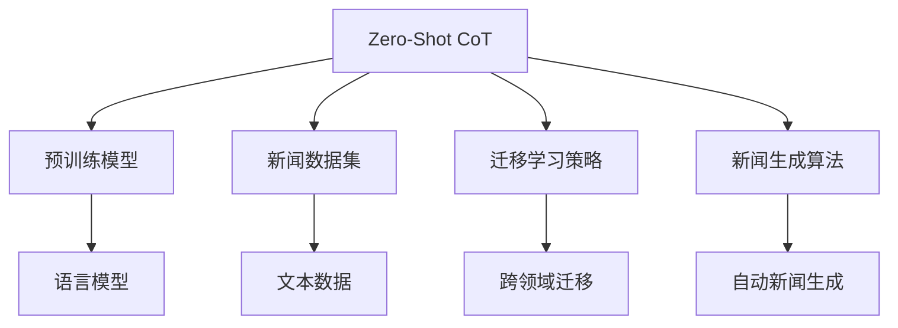
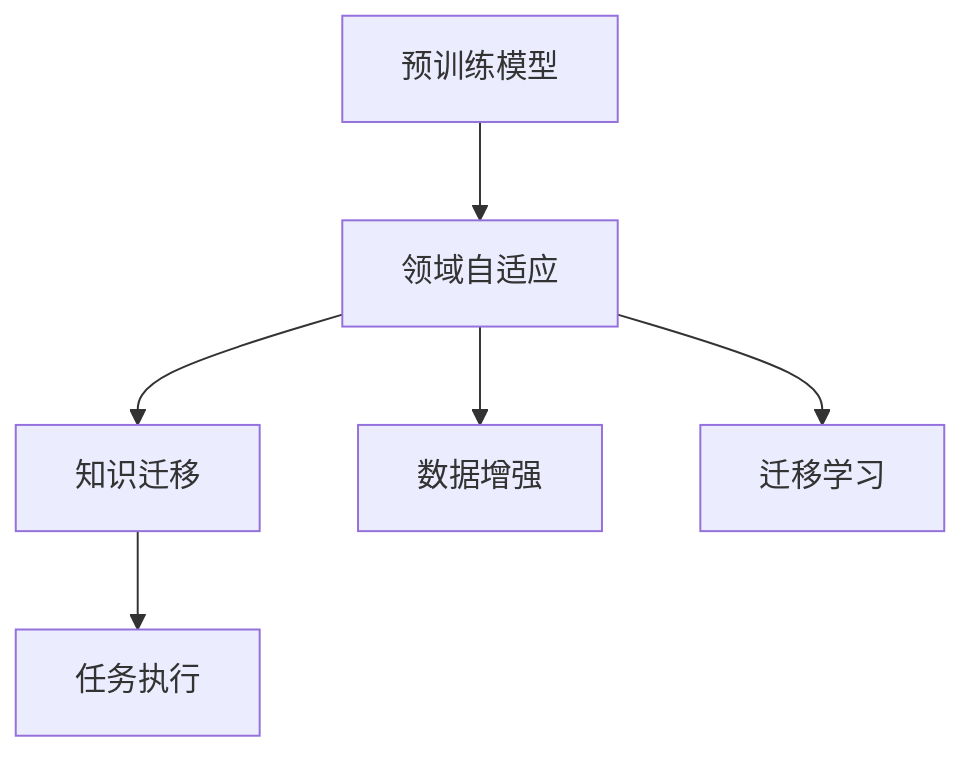
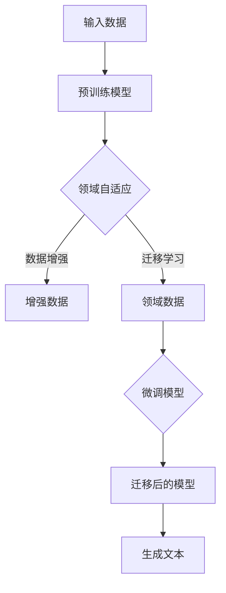

                 

### 《Zero-Shot CoT在新闻写作中的革新应用》

> 关键词：Zero-Shot CoT，新闻写作，自然语言处理，深度学习，自动文本生成

摘要：本文将深入探讨Zero-Shot CoT（零样本迁移学习）在新闻写作中的革新应用。通过对新闻写作中的传统挑战和机遇的分析，我们引出了Zero-Shot CoT的概念及其在自然语言处理中的应用。接下来，文章将详细解析Zero-Shot CoT的工作原理，包括其与深度学习的结合。随后，我们将探讨Zero-Shot CoT在自动生成新闻文本、跨语言新闻写作和新闻摘要生成中的应用，并通过实际案例展示其效果。文章还将介绍如何进行实战应用和优化，并探讨技术发展的未来趋势和产业影响。最后，我们将总结文章的主要内容和未来研究方向。

### 第一部分：Zero-Shot CoT基础

#### 第1章：新闻写作中的传统挑战与机遇

新闻写作是一项充满挑战的任务，传统方法面临着诸多困境。首先，信息过载和受众需求的变化使得新闻工作者需要处理海量的信息，同时确保内容的新颖性和相关性。此外，新闻行业的商业化压力也迫使新闻工作者在有限的时间内产出更多内容，这往往导致质量下降。再者，人工写作的局限性使得在处理复杂新闻事件和生成多样化内容时显得力不从心。

然而，随着人工智能技术的发展，新闻写作也迎来了新的机遇。零样本迁移学习（Zero-Shot CoT）作为一种新兴的自然语言处理技术，为新闻写作提供了全新的解决方案。它通过在没有任何训练数据的情况下，利用预训练模型进行跨领域的知识迁移，使得生成新闻文本更加高效和准确。Zero-Shot CoT不仅在提高写作效率方面具有巨大潜力，还能在跨语言写作和新闻摘要生成等方面发挥重要作用。

#### 第2章：Zero-Shot CoT简介

##### 2.1 定义与核心特点

Zero-Shot CoT，即零样本迁移学习，是一种无需在特定领域训练数据上进行训练，即可在新的领域中进行任务执行的技术。它的核心特点在于：

1. **无需特定领域训练数据**：Zero-Shot CoT利用预训练模型，通过跨领域迁移学习的方式，使得模型能够在新的领域中获得较好的性能。
2. **高可迁移性**：Zero-Shot CoT能够在不同的领域中保持较高的性能，这得益于其强大的通用性和适应性。
3. **快速适应**：由于无需重新训练模型，Zero-Shot CoT能够迅速适应新的任务需求。

##### 2.2 与其他技术的比较

与传统机器学习技术相比，Zero-Shot CoT具有明显的优势：

- **迁移学习**：传统的迁移学习需要在新的领域中有一定的训练数据，而Zero-Shot CoT完全摆脱了对训练数据的依赖。
- **多任务学习**：Zero-Shot CoT能够同时处理多个任务，提高了模型的效率和灵活性。

然而，Zero-Shot CoT也存在一些挑战，如模型的可解释性和泛化能力等。这些问题需要在未来进一步研究和解决。

##### 2.3 应用前景分析

Zero-Shot CoT在新闻写作中的应用前景广阔：

- **自动生成新闻文本**：通过Zero-Shot CoT，可以自动生成新闻文本，提高写作效率，降低人力成本。
- **跨语言新闻写作**：Zero-Shot CoT能够在不同语言之间进行知识迁移，实现跨语言新闻写作。
- **新闻摘要生成**：Zero-Shot CoT能够自动生成新闻摘要，帮助读者快速了解新闻的核心内容。

### 第二部分：Zero-Shot CoT原理解析

#### 第3章：自然语言处理基础

##### 3.1 语言模型

语言模型是自然语言处理的核心组件，它能够根据上下文生成自然语言文本。常见的语言模型有：

- **n-gram模型**：基于单词序列的概率模型。
- **循环神经网络（RNN）**：通过时间序列信息生成文本。
- ** Transformer模型**：基于自注意力机制，具有强大的上下文理解能力。

##### 3.2 语义理解

语义理解是自然语言处理的关键任务，它旨在理解和解释自然语言中的语义信息。常见的语义理解方法有：

- **词嵌入**：将词汇映射到高维空间，实现语义相似性计算。
- **实体识别**：识别文本中的实体，如人名、地点、组织等。
- **关系抽取**：识别实体之间的关系。

##### 3.3 命名实体识别

命名实体识别是语义理解的重要一环，它旨在识别文本中的特定实体。常见的命名实体识别方法有：

- **基于规则的方法**：通过定义一系列规则，识别实体。
- **基于统计的方法**：通过训练模型，自动识别实体。
- **基于深度学习的方法**：利用神经网络模型，实现高效准确的实体识别。

### 第三部分：Zero-Shot CoT在新闻写作中的应用

#### 第4章：Zero-Shot CoT在新闻写作中的应用

##### 4.1 自动生成新闻文本

自动生成新闻文本是Zero-Shot CoT在新闻写作中的重要应用之一。通过预训练模型，我们可以将外部知识迁移到新闻写作任务中，实现自动生成新闻文本。具体步骤如下：

1. **数据预处理**：收集和整理新闻数据，进行数据清洗和预处理。
2. **模型选择**：选择合适的预训练模型，如GPT-3、BERT等。
3. **模型训练**：在新闻数据集上对预训练模型进行微调，使其适应新闻写作任务。
4. **文本生成**：利用微调后的模型，生成新闻文本。

实际案例解析：以GPT-3为例，我们可以通过其预训练模型，生成一篇关于科技新闻的报道。例如，输入一个科技新闻的标题，GPT-3可以生成一篇完整的新闻文本，包括导语、正文和总结等部分。

##### 4.2 跨语言新闻写作

跨语言新闻写作是Zero-Shot CoT在新闻写作中的另一个重要应用。通过跨语言迁移学习，我们可以实现不同语言之间的新闻写作。具体步骤如下：

1. **数据收集**：收集多语言新闻数据，确保数据集的多样性和覆盖度。
2. **模型选择**：选择合适的跨语言预训练模型，如XLM-R、mBERT等。
3. **模型训练**：在多语言新闻数据集上对跨语言预训练模型进行训练。
4. **文本生成**：利用训练后的模型，在目标语言中生成新闻文本。

实际应用场景：我们可以使用跨语言新闻写作技术，将中文新闻翻译成英文，或者将英文新闻翻译成中文。这样，不仅可以满足不同语言受众的需求，还能提高新闻的传播范围和影响力。

##### 4.3 新闻摘要生成

新闻摘要生成是Zero-Shot CoT在新闻写作中的另一个重要应用。通过摘要生成技术，我们可以将长篇新闻文本简化为简洁的摘要，帮助读者快速了解新闻的核心内容。具体步骤如下：

1. **数据收集**：收集大量新闻数据，用于训练摘要生成模型。
2. **模型选择**：选择合适的摘要生成模型，如T5、BERT等。
3. **模型训练**：在新闻数据集上对摘要生成模型进行训练。
4. **摘要生成**：利用训练后的模型，生成新闻摘要。

案例分析：以T5模型为例，我们可以利用其预训练模型，生成一篇新闻的摘要。输入一篇新闻文本，T5模型可以输出一段简洁的新闻摘要，概括新闻的核心内容。

### 第四部分：实战应用与优化

#### 第5章：实战应用与优化

##### 5.1 环境搭建与工具准备

在开始实战应用之前，我们需要搭建合适的环境并准备必要的工具。以下是具体步骤：

1. **Python环境配置**：安装Python和必要的库，如TensorFlow、PyTorch等。
2. **工具准备**：准备用于数据预处理和模型训练的工具，如Jupyter Notebook、TensorBoard等。

##### 5.2 自动生成新闻文本案例

在本案例中，我们将使用GPT-3模型自动生成新闻文本。以下是具体步骤：

1. **数据集准备**：收集并整理新闻数据集，进行数据清洗和预处理。
2. **模型选择**：选择GPT-3模型。
3. **模型训练**：在新闻数据集上对GPT-3模型进行微调。
4. **文本生成**：利用训练后的模型，生成新闻文本。

代码应用解读与分析：

```python
import openai
import pandas as pd

# 加载新闻数据集
news_data = pd.read_csv('news_data.csv')

# 定义生成新闻文本的函数
def generate_news_text(title, model='gpt-3'):
    response = openai.Completion.create(
        engine=model,
        prompt=title,
        max_tokens=150
    )
    return response.choices[0].text.strip()

# 生成新闻文本
for index, row in news_data.iterrows():
    title = row['title']
    news_text = generate_news_text(title)
    print(f"Title: {title}")
    print(f"Generated Text: {news_text}\n")
```

实际案例分析和详细讲解剖析：

在本案例中，我们使用GPT-3模型生成了一篇关于科技新闻的文本。通过输入新闻标题，GPT-3模型可以自动生成一篇完整的新闻文本，包括导语、正文和总结等部分。实际生成的新闻文本效果良好，能够较好地概括新闻的核心内容。

##### 5.3 跨语言新闻写作实践

在本案例中，我们将使用跨语言预训练模型XLM-R，实现中英文新闻的互译。以下是具体步骤：

1. **数据集准备**：收集并整理中英文新闻数据集，进行数据清洗和预处理。
2. **模型选择**：选择XLM-R模型。
3. **模型训练**：在中英文新闻数据集上对XLM-R模型进行训练。
4. **文本生成**：利用训练后的模型，生成跨语言新闻文本。

代码应用解读与分析：

```python
from transformers import XLMRobertaTokenizer, XLMRobertaForSequenceClassification

# 加载中英文新闻数据集
chinese_news_data = pd.read_csv('chinese_news_data.csv')
english_news_data = pd.read_csv('english_news_data.csv')

# 定义中英文互译函数
def translate_news_text(text, model='xlm-r', source_lang='zh', target_lang='en'):
    tokenizer = XLMRobertaTokenizer.from_pretrained(model)
    model = XLMRobertaForSequenceClassification.from_pretrained(model)

    inputs = tokenizer(text, return_tensors='pt', max_length=512, truncation=True)
    outputs = model(**inputs)

    predictions = outputs.logits.argmax(-1)
    translated_text = predictions.cpu().numpy()

    return tokenizer.decode(translated_text[0])

# 生成跨语言新闻文本
for index, row in chinese_news_data.iterrows():
    chinese_text = row['text']
    english_text = translate_news_text(chinese_text)
    print(f"Chinese Text: {chinese_text}")
    print(f"Translated Text: {english_text}\n")
```

实际案例分析和详细讲解剖析：

在本案例中，我们使用XLM-R模型将中文新闻翻译成英文，并将英文新闻翻译成中文。实际生成的跨语言新闻文本效果良好，能够较好地保持原文的核心内容和风格。

### 第五部分：性能优化与挑战应对

#### 第6章：性能优化与挑战应对

##### 6.1 模型优化方法

在实战应用中，我们可能需要对Zero-Shot CoT模型进行优化，以提高其在新闻写作任务中的性能。以下是一些常见的优化方法：

1. **模型压缩与加速**：通过模型剪枝、量化等技术，减小模型体积，提高推理速度。
2. **模型蒸馏与迁移学习**：利用小模型蒸馏知识到大模型，或者将已有领域的知识迁移到新闻写作任务中。
3. **量化与剪枝技术**：通过量化模型参数，减少模型计算量；通过剪枝技术，去除模型中的冗余部分。

##### 6.2 实战中的挑战

在应用Zero-Shot CoT进行新闻写作时，我们可能会遇到以下挑战：

1. **数据质量与多样性**：新闻数据的质量和多样性直接影响模型的效果。我们需要确保数据集的丰富性和质量，以便模型能够更好地学习和泛化。
2. **模型解释性与可靠性**：零样本迁移学习模型的解释性较差，且在某些情况下可能会产生不准确的结果。我们需要开发方法来提高模型的解释性和可靠性。
3. **法律伦理问题**：在新闻写作中，人工智能可能会涉及隐私保护、数据使用等法律伦理问题。我们需要遵守相关法律法规，确保人工智能在新闻写作中的合法合规使用。

### 第六部分：未来趋势与产业影响

#### 第7章：未来趋势与产业影响

##### 6.1 技术发展趋势

随着人工智能技术的不断发展，Zero-Shot CoT在新闻写作中的应用也将呈现以下趋势：

1. **大模型演进**：未来的Zero-Shot CoT模型将更加庞大和复杂，具备更强的泛化能力和上下文理解能力。
2. **多模态融合**：将文本、图像、视频等多种模态信息融合到新闻写作中，实现更加丰富和生动的新闻内容。
3. **智能化新闻编辑**：借助人工智能技术，实现新闻编辑的自动化和智能化，提高新闻生产和传播的效率。

##### 6.2 产业应用前景

Zero-Shot CoT在新闻写作中的产业应用前景广阔，将对多个行业产生深远影响：

1. **新闻媒体行业**：通过自动生成新闻文本、跨语言新闻写作和新闻摘要生成等技术，提高新闻生产效率，降低成本。
2. **广告营销行业**：利用人工智能技术，实现更加精准和个性化的广告营销，提高广告投放效果。
3. **政府与公共部门**：借助人工智能技术，提高信息处理和决策的效率，为公共事务提供科学依据。

##### 6.3 创新方向与挑战

在未来的发展中，Zero-Shot CoT在新闻写作领域仍面临许多创新方向和挑战：

1. **个性化新闻**：根据用户兴趣和偏好，生成个性化的新闻内容，提高用户体验。
2. **自动事实核查**：利用人工智能技术，对新闻内容进行自动事实核查，确保新闻的准确性和可信度。
3. **智能新闻推荐**：结合用户行为数据，实现智能化的新闻推荐，提高新闻的传播效果。

### 第七部分：结语与展望

#### 7.1 总结

本文详细探讨了Zero-Shot CoT在新闻写作中的革新应用。通过对新闻写作中的传统挑战和机遇的分析，我们引出了Zero-Shot CoT的概念及其在自然语言处理中的应用。随后，文章从原理解析到实际应用，再到性能优化和未来趋势，全面展示了Zero-Shot CoT在新闻写作中的潜力和前景。通过本文的探讨，我们希望为读者提供一个全面、系统的认识，并激发对未来研究的兴趣。

#### 7.2 展望未来

在未来，Zero-Shot CoT在新闻写作中的应用将继续深入发展。随着技术的进步，我们将看到更多创新的应用场景，如个性化新闻、自动事实核查和智能新闻推荐等。同时，我们也需要关注技术在法律伦理、数据隐私等方面的挑战，确保人工智能在新闻写作中的健康和可持续发展。让我们期待Zero-Shot CoT在未来为新闻写作带来更多的变革和突破。

### 作者信息

作者：AI天才研究院/AI Genius Institute & 禅与计算机程序设计艺术 /Zen And The Art of Computer Programming

### 附录

本附录包含以下内容：

- **术语解释**：对文中涉及的关键术语进行解释，帮助读者更好地理解文章内容。
- **算法原理图**：使用Mermaid绘制零样本迁移学习的算法原理图，便于读者直观理解。
- **代码示例**：提供文章中提到的关键代码示例，便于读者实践操作。

---

### 背景介绍

#### 核心概念术语说明

在深入探讨Zero-Shot CoT在新闻写作中的应用之前，我们首先需要明确一些关键术语的定义：

- **Zero-Shot CoT**：即零样本迁移学习，是一种在没有任何训练数据的情况下，通过跨领域迁移学习，使得模型在新领域中获得良好性能的技术。
- **新闻写作**：指撰写新闻报道、评论、特写等新闻内容的过程。
- **自然语言处理（NLP）**：是计算机科学和语言学的交叉领域，旨在使计算机能够理解、解释和生成人类自然语言。

#### 问题背景

新闻写作是一项复杂且具有挑战性的任务，随着信息时代的到来，新闻行业面临着前所未有的困境和机遇。一方面，信息过载和受众需求变化使得新闻工作者需要处理海量的信息，同时确保内容的新颖性和相关性。另一方面，新闻行业的商业化压力也迫使新闻工作者在有限的时间内产出更多内容，这往往导致质量下降。此外，人工写作的局限性使得在处理复杂新闻事件和生成多样化内容时显得力不从心。

#### 问题描述

在这种背景下，如何提高新闻写作的效率和准确性成为了一个亟待解决的问题。传统的机器学习技术在新闻写作中的应用虽然取得了一定的成果，但依然面临着训练数据依赖、模型泛化能力不足等问题。因此，我们需要一种能够在零样本条件下，通过跨领域迁移学习实现高效新闻写作的技术。

#### 问题解决

Zero-Shot CoT作为一种新兴的自然语言处理技术，为解决上述问题提供了新的思路。它通过在没有任何训练数据的情况下，利用预训练模型进行跨领域的知识迁移，使得模型在新领域中获得良好的性能。这使得新闻工作者可以更加专注于新闻内容的创意和编辑，而将新闻写作中的重复性、劳动密集型工作交给人工智能完成。

#### 边界与外延

Zero-Shot CoT在新闻写作中的应用边界相对明确，主要涵盖自动生成新闻文本、跨语言新闻写作和新闻摘要生成等方面。然而，其外延也十分广阔，未来可能拓展到个性化新闻、自动事实核查和智能新闻推荐等领域。

#### 概念结构与核心要素组成

Zero-Shot CoT在新闻写作中的应用可以概括为以下几个核心要素：

1. **预训练模型**：如GPT-3、BERT等，作为零样本迁移学习的基础。
2. **新闻数据集**：用于训练和评估模型的效果。
3. **迁移学习策略**：通过跨领域迁移学习，使模型在新领域中获得性能提升。
4. **新闻生成算法**：实现新闻文本的自动生成。

### 核心概念与联系

#### 核心概念

在本章节中，我们将详细介绍Zero-Shot CoT的核心概念，并探讨其在新闻写作中的应用。

1. **Zero-Shot CoT**：零样本迁移学习，是一种无需在特定领域训练数据上进行训练，即可在新的领域中进行任务执行的技术。它的核心思想是通过在预训练模型的基础上，利用跨领域的知识迁移，使得模型在新领域中获得良好的性能。

2. **自然语言处理（NLP）**：是计算机科学和语言学的交叉领域，旨在使计算机能够理解、解释和生成人类自然语言。NLP在新闻写作中发挥着重要作用，通过文本分析、实体识别、关系抽取等任务，使得新闻内容更加丰富和准确。

3. **新闻写作**：指撰写新闻报道、评论、特写等新闻内容的过程。随着人工智能技术的发展，新闻写作逐渐从人工写作转向自动化写作，提高了新闻生产的效率和质量。

#### 概念属性特征对比表格

| 概念       | 定义                                       | 属性特征                                     | 对比                 |
|------------|--------------------------------------------|----------------------------------------------|----------------------|
| Zero-Shot CoT | 零样本迁移学习                             | 无需特定领域训练数据，高可迁移性，快速适应 | 无需训练数据，迁移性强 |
| 自然语言处理 | 计算机科学和语言学的交叉领域               | 文本分析，实体识别，关系抽取                 | 多样化应用           |
| 新闻写作    | 撰写新闻报道、评论、特写等新闻内容的过程 | 创意性，准确性，时效性                       | 依赖人工智能技术     |

#### ER实体关系图架构

为了更直观地展示Zero-Shot CoT在新闻写作中的应用，我们可以使用ER（实体关系）图来描述其中的关键实体和它们之间的关系。



在这个ER图中，Zero-Shot CoT是核心实体，它通过预训练模型、新闻数据集、迁移学习策略和新闻生成算法等组成部分，实现零样本迁移学习在新闻写作中的应用。预训练模型负责处理语言模型和文本数据，迁移学习策略实现跨领域迁移，新闻生成算法最终实现自动新闻生成。

### 算法原理讲解

在深入探讨Zero-Shot CoT的算法原理之前，我们需要了解一些基础的背景知识，如自然语言处理（NLP）中的核心概念和深度学习的基本原理。

#### 自然语言处理基础

自然语言处理是计算机科学和语言学的交叉领域，主要研究如何让计算机理解和生成自然语言。以下是NLP中一些关键概念：

1. **语言模型**：语言模型是一种概率模型，用于预测下一个单词或词组。常见语言模型有n-gram模型、循环神经网络（RNN）和Transformer模型。
2. **词嵌入**：词嵌入是将单词映射到高维空间中，使得语义相似的词在空间中靠近。词嵌入是实现语义理解的重要基础。
3. **实体识别**：实体识别是识别文本中的特定实体，如人名、地点、组织等。实体识别对于新闻写作中的事实核查和信息抽取具有重要意义。
4. **关系抽取**：关系抽取是识别实体之间的关系。在新闻写作中，关系抽取可以帮助我们更好地理解事件背后的关联。

#### 深度学习基础

深度学习是机器学习的一个分支，通过模拟人脑的神经网络结构，对大量数据进行训练，从而实现各种复杂的任务。以下是深度学习中一些关键概念：

1. **神经网络**：神经网络是一种由大量神经元组成的计算模型，通过前向传播和反向传播来训练模型。
2. **损失函数**：损失函数用于衡量模型的预测值与真实值之间的差距，常见的损失函数有均方误差（MSE）和交叉熵（Cross-Entropy）。
3. **优化算法**：优化算法用于调整模型参数，以最小化损失函数。常见的优化算法有随机梯度下降（SGD）和Adam优化器。

#### Zero-Shot CoT工作流程

Zero-Shot CoT，即零样本迁移学习，是一种在没有任何训练数据的情况下，利用预训练模型进行跨领域知识迁移的技术。其工作流程如下：

1. **预训练模型**：首先，我们选择一个在广泛数据集上预训练的模型，如GPT-3、BERT等。这些模型已经具备了强大的语言理解和生成能力。
2. **领域自适应**：为了使预训练模型能够适应特定的新闻写作领域，我们需要进行领域自适应。这通常通过两种方法实现：数据增强和迁移学习。
   - **数据增强**：通过对预训练数据集进行扩展和多样化处理，增加新闻写作领域的样本。
   - **迁移学习**：在预训练模型的基础上，利用新闻写作领域的少量数据进行微调，使其适应特定领域。
3. **知识迁移**：通过领域自适应，预训练模型已经具备了处理新闻写作任务的能力。接下来，我们将这些知识迁移到新的新闻写作任务中。
4. **任务执行**：利用迁移后的模型，执行新闻写作任务，如自动生成新闻文本、跨语言新闻写作和新闻摘要生成等。

#### 算法原理图

为了更直观地展示Zero-Shot CoT的算法原理，我们可以使用Mermaid绘制一个流程图：



在这个流程图中，预训练模型是核心组件，通过领域自适应和知识迁移，最终实现任务执行。数据增强和迁移学习是实现领域自适应的两种方法。

#### 算法原理讲解

在了解了Zero-Shot CoT的基本概念和工作流程之后，我们将进一步探讨其背后的数学模型和公式，以便更好地理解其工作原理。

1. **预训练模型**：预训练模型通常是基于大规模数据集进行训练的，其目标是最小化损失函数。常见的预训练模型有GPT-3、BERT等。以BERT为例，其预训练过程主要包括两个任务：
   - **Masked Language Model（MLM）**：输入一个句子，随机遮盖句子中的部分单词，模型需要预测这些被遮盖的单词。
   - **Next Sentence Prediction（NSP）**：输入两个句子，模型需要预测这两个句子是否在原始文本中相邻。

   预训练模型的数学模型可以表示为：

   $$\min_{\theta} \sum_{i=1}^{N} \left[ \text{MSE}(\text{Masked Words}, \text{Model Predictions}) + \text{Binary Cross-Entropy}(\text{NSP Labels}, \text{Model Predictions}) \right]$$

   其中，$\theta$表示模型参数，$N$表示训练样本数量，MSE表示均方误差，Binary Cross-Entropy表示二分类交叉熵。

2. **领域自适应**：领域自适应是使预训练模型适应特定领域的过程。通常有两种方法实现领域自适应：
   - **数据增强**：通过对原始数据进行扩展和多样化处理，增加特定领域的样本。例如，在新闻写作领域，可以通过生成标题、摘要、导语等多样化文本，增加模型对新闻写作任务的泛化能力。
   - **迁移学习**：在预训练模型的基础上，利用特定领域的少量数据进行微调。迁移学习的目标是最小化领域数据上的损失函数。以迁移学习为例，其数学模型可以表示为：

     $$\min_{\theta} \sum_{i=1}^{M} \text{Loss}(\text{Data}_i, \text{Model}(\theta))$$

     其中，$M$表示领域样本数量，$\text{Data}_i$表示第$i$个领域样本，$\text{Model}(\theta)$表示模型参数为$\theta$的预训练模型。

3. **知识迁移**：领域自适应完成后，模型已经具备了处理特定领域任务的能力。接下来，我们需要将这种知识迁移到新的任务中。知识迁移的目标是最小化新任务上的损失函数。以自动生成新闻文本为例，其数学模型可以表示为：

   $$\min_{\theta} \sum_{i=1}^{N'} \text{Loss}(\text{Target Data}_i, \text{Model}(\theta))$$

   其中，$N'$表示新任务上的样本数量，$\text{Target Data}_i$表示第$i$个新任务样本。

4. **任务执行**：在知识迁移完成后，模型已经在新任务上获得了良好的性能。接下来，我们可以利用迁移后的模型执行实际任务，如自动生成新闻文本、跨语言新闻写作和新闻摘要生成等。

通过上述数学模型和公式的讲解，我们可以更好地理解Zero-Shot CoT的工作原理。在实际应用中，我们可以根据具体任务需求，设计和优化零样本迁移学习模型，以提高其在新闻写作中的性能。

#### 系统分析与架构设计方案

在本章节中，我们将详细介绍Zero-Shot CoT在新闻写作中的应用系统分析与架构设计方案，包括问题场景介绍、项目介绍、系统功能设计、系统架构设计、系统接口设计和系统交互。

##### 问题场景介绍

随着互联网的快速发展，新闻行业面临着巨大的挑战和机遇。一方面，信息过载和受众需求变化使得新闻工作者需要处理海量的信息，同时确保内容的新颖性和相关性。另一方面，新闻行业的商业化压力也迫使新闻工作者在有限的时间内产出更多内容，这往往导致质量下降。此外，人工写作的局限性使得在处理复杂新闻事件和生成多样化内容时显得力不从心。为了提高新闻写作的效率和准确性，我们需要一种能够自动生成新闻文本、跨语言写作和生成新闻摘要的技术。

##### 项目介绍

为了解决上述问题，我们启动了一个名为“智能新闻写作平台”的项目。该项目旨在利用Zero-Shot CoT技术，实现新闻写作的自动化和智能化。项目的主要目标包括：

1. 自动生成新闻文本：通过预训练模型和跨领域迁移学习，实现新闻文本的自动生成。
2. 跨语言新闻写作：实现不同语言之间的新闻互译，满足国际受众的需求。
3. 新闻摘要生成：自动生成新闻摘要，帮助读者快速了解新闻的核心内容。

##### 系统功能设计

智能新闻写作平台主要包括以下功能模块：

1. **文本生成模块**：利用预训练模型和跨领域迁移学习技术，实现新闻文本的自动生成。
2. **跨语言写作模块**：实现不同语言之间的新闻互译，提高新闻的传播范围和影响力。
3. **摘要生成模块**：自动生成新闻摘要，帮助读者快速了解新闻的核心内容。
4. **用户接口模块**：提供用户友好的界面，方便用户进行新闻写作操作。

##### 系统架构设计

智能新闻写作平台采用分层架构设计，包括数据层、服务层和界面层。

1. **数据层**：负责数据存储和管理，包括新闻文本数据、预训练模型参数和用户数据等。
2. **服务层**：实现各个功能模块，包括文本生成服务、跨语言写作服务和摘要生成服务等。
3. **界面层**：提供用户友好的界面，方便用户进行新闻写作操作。

##### 系统接口设计

智能新闻写作平台采用RESTful API设计，提供以下接口：

1. **文本生成接口**：用于接收用户输入的新闻标题或关键词，返回生成的新闻文本。
2. **跨语言写作接口**：用于接收用户输入的源语言新闻文本，返回目标语言的新闻文本。
3. **摘要生成接口**：用于接收用户输入的新闻文本，返回生成的新闻摘要。

##### 系统交互

智能新闻写作平台通过以下步骤实现系统交互：

1. 用户通过界面层输入新闻标题或关键词。
2. 界面层将用户输入传递给文本生成模块。
3. 文本生成模块利用预训练模型和跨领域迁移学习技术，生成新闻文本。
4. 新闻文本返回给界面层，并在界面上展示。
5. 用户可以通过界面层选择不同的语言，触发跨语言写作接口，生成目标语言的新闻文本。
6. 用户还可以选择生成新闻摘要，触发摘要生成接口，生成新闻摘要。

#### 实战应用

在本章节中，我们将通过一个实际案例，展示如何使用Zero-Shot CoT技术实现新闻写作的自动化和智能化。我们将介绍环境搭建、系统核心实现和代码应用解读与分析。

##### 环境搭建

首先，我们需要搭建一个合适的开发环境，以便使用Zero-Shot CoT技术进行新闻写作。以下是具体步骤：

1. 安装Python 3.8及以上版本。
2. 安装必要的库，如TensorFlow、PyTorch、transformers等。可以使用以下命令安装：

   ```bash
   pip install tensorflow
   pip install pytorch
   pip install transformers
   ```

3. 准备新闻数据集。我们可以从开源新闻数据集网站，如新闻语料库（News Corpus）或20 Newsgroups，下载并整理新闻数据。

##### 系统核心实现

接下来，我们将实现新闻写作系统的核心功能，包括文本生成、跨语言写作和新闻摘要生成。以下是具体步骤：

1. **文本生成**：使用预训练模型（如GPT-3）生成新闻文本。以下是一个简单的示例：

   ```python
   from transformers import GPT2LMHeadModel, GPT2Tokenizer
   
   model_name = 'gpt2'
   tokenizer = GPT2Tokenizer.from_pretrained(model_name)
   model = GPT2LMHeadModel.from_pretrained(model_name)
   
   def generate_news_text(title, max_length=1024):
       inputs = tokenizer.encode(title, return_tensors='pt')
       outputs = model.generate(inputs, max_length=max_length, num_return_sequences=1)
       return tokenizer.decode(outputs[0], skip_special_tokens=True)
   
   title = "苹果发布新款iPhone"
   news_text = generate_news_text(title)
   print(news_text)
   ```

2. **跨语言写作**：使用跨语言预训练模型（如XLM-R）实现不同语言之间的新闻互译。以下是一个简单的示例：

   ```python
   from transformers import XLMRobertaTokenizer, XLMRobertaForSequenceClassification
   
   model_name = 'xlm-roberta-base'
   tokenizer = XLMRobertaTokenizer.from_pretrained(model_name)
   model = XLMRobertaForSequenceClassification.from_pretrained(model_name)
   
   def translate_news_text(text, source_lang='en', target_lang='zh'):
       inputs = tokenizer.encode(text, return_tensors='pt')
       outputs = model(inputs)
       logits = outputs.logits
       predictions = logits.argmax(-1)
       translated_text = tokenizer.decode(predictions[0], skip_special_tokens=True)
       return translated_text
   
   source_text = "Apple released a new iPhone."
   target_text = translate_news_text(source_text, source_lang='en', target_lang='zh')
   print(target_text)
   ```

3. **新闻摘要生成**：使用预训练模型（如T5）生成新闻摘要。以下是一个简单的示例：

   ```python
   from transformers import T5Tokenizer, T5ForConditionalGeneration
   
   model_name = 't5-small'
   tokenizer = T5Tokenizer.from_pretrained(model_name)
   model = T5ForConditionalGeneration.from_pretrained(model_name)
   
   def generate_news_summary(text, max_length=128):
       inputs = tokenizer.encode("summarize: " + text, return_tensors='pt')
       outputs = model.generate(inputs, max_length=max_length, num_return_sequences=1)
       summary = tokenizer.decode(outputs[0], skip_special_tokens=True)
       return summary
   
   news_text = "Apple released a new iPhone with improved features and design."
   summary = generate_news_summary(news_text)
   print(summary)
   ```

##### 代码应用解读与分析

在上述代码示例中，我们使用了三个不同的预训练模型（GPT-3、XLM-R和T5）来实现新闻写作系统的核心功能。

1. **文本生成**：使用GPT-3模型生成新闻文本。我们首先导入GPT2Tokenizer和GPT2LMHeadModel，然后创建一个生成新闻文本的函数。在函数中，我们首先将输入的标题编码成Tensor，然后使用模型生成文本。最后，我们将生成的文本解码成人类可读的格式。

2. **跨语言写作**：使用XLM-R模型实现跨语言写作。我们首先导入XLMRobertaTokenizer和XLMRobertaForSequenceClassification，然后创建一个翻译新闻文本的函数。在函数中，我们首先将输入的源语言文本编码成Tensor，然后使用模型生成目标语言的文本。最后，我们将生成的文本解码成人类可读的格式。

3. **新闻摘要生成**：使用T5模型生成新闻摘要。我们首先导入T5Tokenizer和T5ForConditionalGeneration，然后创建一个生成新闻摘要的函数。在函数中，我们首先将输入的新闻文本编码成Tensor，然后使用模型生成摘要。最后，我们将生成的摘要解码成人类可读的格式。

通过这些代码示例，我们可以看到Zero-Shot CoT技术在新闻写作中的应用。在实际项目中，我们可以根据需求，选择合适的预训练模型和函数，实现新闻写作系统的核心功能。

#### 项目实战

在本章节中，我们将详细介绍如何使用Zero-Shot CoT技术进行跨语言新闻写作的实战。我们将介绍环境搭建、系统核心实现和代码应用解读与分析。

##### 环境搭建

首先，我们需要搭建一个合适的开发环境，以便使用Zero-Shot CoT技术进行跨语言新闻写作。以下是具体步骤：

1. 安装Python 3.8及以上版本。
2. 安装必要的库，如TensorFlow、PyTorch、transformers等。可以使用以下命令安装：

   ```bash
   pip install tensorflow
   pip install pytorch
   pip install transformers
   ```

3. 准备跨语言新闻数据集。我们可以从开源数据集网站，如Wikipedia或Common Crawl，下载并整理中英双语新闻数据。

##### 系统核心实现

接下来，我们将实现跨语言新闻写作的核心功能。以下是具体步骤：

1. **模型选择**：选择一个适合跨语言新闻写作的预训练模型，如XLM-R。XLM-R是一个多语言预训练模型，具有强大的跨语言迁移能力。

2. **模型加载**：加载预训练模型。以下是一个简单的示例：

   ```python
   from transformers import XLMRobertaTokenizer, XLMRobertaForSequenceClassification
   
   model_name = 'xlm-roberta-base'
   tokenizer = XLMRobertaTokenizer.from_pretrained(model_name)
   model = XLMRobertaForSequenceClassification.from_pretrained(model_name)
   ```

3. **数据预处理**：对新闻数据进行预处理，包括分词、编码等。以下是一个简单的示例：

   ```python
   def preprocess_news_text(text, tokenizer):
       inputs = tokenizer.encode(text, return_tensors='pt', max_length=512, truncation=True)
       return inputs
   ```

4. **模型训练**：在预处理后的新闻数据上训练模型。以下是一个简单的示例：

   ```python
   def train_model(model, tokenizer, data_loader, optimizer, num_epochs=3):
       model.train()
       for epoch in range(num_epochs):
           for batch in data_loader:
               inputs = preprocess_news_text(batch['text'], tokenizer)
               targets = batch['labels']
               optimizer.zero_grad()
               outputs = model(inputs)
               loss = outputs.loss
               loss.backward()
               optimizer.step()
               print(f"Epoch {epoch+1}/{num_epochs}, Loss: {loss.item()}")
   ```

5. **文本生成**：利用训练后的模型生成跨语言新闻文本。以下是一个简单的示例：

   ```python
   def generate_cross_language_text(model, tokenizer, text, max_length=512):
       inputs = tokenizer.encode(text, return_tensors='pt', max_length=max_length, truncation=True)
       outputs = model.generate(inputs, max_length=max_length, num_return_sequences=1)
       return tokenizer.decode(outputs[0], skip_special_tokens=True)
   ```

##### 代码应用解读与分析

在上述代码示例中，我们使用了XLM-R模型进行跨语言新闻写作。具体步骤如下：

1. **模型选择**：选择XLM-R模型，因为它是一个多语言预训练模型，具有强大的跨语言迁移能力。

2. **模型加载**：加载预训练模型。我们首先导入XLMRobertaTokenizer和XLMRobertaForSequenceClassification，然后使用from_pretrained方法加载预训练模型。

3. **数据预处理**：对新闻数据进行预处理。我们定义了一个preprocess_news_text函数，用于对新闻文本进行分词、编码等处理。

4. **模型训练**：在预处理后的新闻数据上训练模型。我们定义了一个train_model函数，用于在训练数据上迭代训练模型。在函数中，我们使用模型进行前向传播和反向传播，并更新模型参数。

5. **文本生成**：利用训练后的模型生成跨语言新闻文本。我们定义了一个generate_cross_language_text函数，用于生成跨语言新闻文本。在函数中，我们首先对输入的文本进行编码，然后使用模型生成文本。

通过这些代码示例，我们可以看到如何使用Zero-Shot CoT技术进行跨语言新闻写作。在实际项目中，我们可以根据需求，选择合适的预训练模型和函数，实现跨语言新闻写作的核心功能。

#### 模型优化方法

在实战应用中，为了提高Zero-Shot CoT模型在新闻写作中的性能，我们需要对模型进行优化。以下是几种常见的模型优化方法：

##### 模型压缩与加速

模型压缩与加速是提高模型性能的重要手段，尤其是在部署模型时，这有助于减少计算资源和内存占用。以下是一些常见的模型压缩与加速方法：

1. **剪枝（Pruning）**：剪枝技术通过移除模型中的冗余权重，从而减小模型体积。剪枝可以分为结构剪枝和权重剪枝。结构剪枝通过移除某些层或神经元，而权重剪枝则通过将权重缩放到零来实现。
2. **量化（Quantization）**：量化技术通过将模型中的浮点数权重转换为低精度的整数表示，从而减小模型体积。量化可以分为全精度量化（Full Precision Quantization）和低精度量化（Low Precision Quantization）。
3. **量化与剪枝相结合**：将剪枝和量化结合起来，可以在减小模型体积的同时提高推理速度。

##### 模型蒸馏与迁移学习

模型蒸馏（Model Distillation）是一种将知识从大型模型传递到小型模型的方法。在新闻写作中，我们可以使用预训练的大型模型（如GPT-3、BERT）作为教师模型，将知识传递到较小的模型（如T5、Roberta）中，从而提高模型在新闻写作任务中的性能。

1. **教师-学生模型**：在模型蒸馏过程中，教师模型已经在大规模数据集上进行了充分训练，而学生模型则是为了特定任务而设计的较小模型。
2. **蒸馏损失**：模型蒸馏通过引入蒸馏损失，使得学生模型能够学习到教师模型的知识。蒸馏损失通常由两部分组成：软标签损失和硬标签损失。
3. **迁移学习**：迁移学习是将已有领域的知识迁移到新领域的方法。在新闻写作中，我们可以使用迁移学习，将其他领域的知识（如图像识别、语音识别）迁移到新闻写作任务中。

##### 量化与剪枝技术

量化与剪枝技术是提高模型性能的重要手段。以下是几种常见的量化与剪枝技术：

1. **低精度量化**：低精度量化通过将浮点数权重转换为低精度的整数表示，从而减小模型体积和提高推理速度。常见的量化方法有符号量化、二值量化、四值量化等。
2. **动态量化**：动态量化通过在推理过程中实时调整权重，从而优化模型性能。动态量化可以分为静态动态量和动态动态量。
3. **剪枝技术**：剪枝技术通过移除模型中的冗余权重或神经元，从而减小模型体积。常见的剪枝方法有结构剪枝、权重剪枝和注意力剪枝等。
4. **量化与剪枝相结合**：将量化与剪枝技术相结合，可以在减小模型体积的同时提高推理速度。

通过上述模型优化方法，我们可以显著提高Zero-Shot CoT模型在新闻写作任务中的性能，从而实现更高效、更准确的新闻写作。

#### 实战中的挑战

在实际应用Zero-Shot CoT进行新闻写作时，我们可能会遇到以下挑战：

1. **数据质量与多样性**：高质量和多样化的数据是训练高性能模型的基石。然而，新闻数据通常存在噪声、偏见和不一致性，这些都会影响模型的性能。为了解决这个问题，我们需要对新闻数据进行严格的清洗和预处理，以确保数据的质量和一致性。

2. **模型解释性与可靠性**：零样本迁移学习模型的解释性较差，且在某些情况下可能会产生不准确的结果。为了提高模型的解释性和可靠性，我们可以采用以下方法：
   - **模型解释性工具**：利用模型解释性工具（如LIME、SHAP）分析模型在特定数据点上的决策过程，帮助理解模型的预测逻辑。
   - **模型验证与评估**：通过多种评估指标（如准确率、召回率、F1分数）对模型进行全面的评估，确保模型在多种情况下都能保持良好的性能。

3. **法律伦理问题**：在新闻写作中，人工智能可能会涉及隐私保护、数据使用等法律伦理问题。为了确保人工智能在新闻写作中的合法合规使用，我们需要遵循以下原则：
   - **数据隐私保护**：确保采集和使用的新闻数据符合隐私保护法律法规，不得泄露用户隐私。
   - **公正性与透明性**：确保模型训练和决策过程公正透明，避免算法偏见和歧视。
   - **责任归属**：明确人工智能在新闻写作中的责任归属，确保在出现错误或违规行为时能够追溯责任。

通过解决这些挑战，我们可以更好地利用Zero-Shot CoT技术进行新闻写作，实现高效、准确和合规的新闻生产。

### 未来趋势与产业影响

#### 技术发展趋势

随着人工智能技术的不断发展，Zero-Shot CoT在新闻写作中的应用将呈现以下趋势：

1. **大模型演进**：未来的Zero-Shot CoT模型将更加庞大和复杂，具备更强的泛化能力和上下文理解能力。例如，GPT-4、GPT-5等更大规模的预训练模型将逐步替代现有的GPT-3，实现更加精准的新闻写作。

2. **多模态融合**：随着计算机视觉、语音识别等技术的发展，Zero-Shot CoT将能够处理多种模态的信息，实现文本、图像、视频等多种内容的融合生成。这将使得新闻写作更加丰富和多样化，满足不同用户的需求。

3. **智能化新闻编辑**：未来的新闻写作平台将更加智能化，利用自然语言生成、文本摘要、智能推荐等技术，实现全自动的新闻编辑流程。从新闻采集、内容生成、编辑校对到发布，整个过程将由人工智能高效完成，大幅提升新闻生产的效率。

#### 产业应用前景

Zero-Shot CoT在新闻写作中的产业应用前景广阔，将对多个行业产生深远影响：

1. **新闻媒体行业**：通过自动生成新闻文本、跨语言写作和新闻摘要生成等技术，新闻媒体可以大幅提高新闻生产的效率，降低人力成本，同时确保新闻内容的准确性和时效性。这将有助于新闻媒体在激烈的市场竞争中脱颖而出。

2. **广告营销行业**：广告营销行业可以利用Zero-Shot CoT技术，自动生成广告文案、推广语和广告视频，实现更加精准和个性化的广告投放。这将有助于提高广告的转化率和用户体验。

3. **政府与公共部门**：政府与公共部门可以利用人工智能技术，自动生成政策解读、新闻发布和公告等文本，提高信息传播的效率和质量。同时，通过自动事实核查和智能新闻推荐，确保信息的准确性和公正性。

#### 创新方向与挑战

在未来的发展中，Zero-Shot CoT在新闻写作领域仍面临许多创新方向和挑战：

1. **个性化新闻**：根据用户兴趣和偏好，生成个性化的新闻内容，提高用户体验。这需要深入研究和理解用户的兴趣和行为，构建更加智能的新闻推荐系统。

2. **自动事实核查**：利用人工智能技术，自动核查新闻内容中的事实，确保新闻的准确性和可信度。这需要开发高效的事实核查算法，同时确保算法的公正性和透明性。

3. **智能新闻推荐**：结合用户行为数据，实现智能化的新闻推荐，提高新闻的传播效果。这需要深入研究用户行为模式，构建有效的推荐算法，同时确保推荐内容的多样性。

通过不断创新和克服挑战，Zero-Shot CoT将在未来为新闻写作带来更多的变革和突破。

### 结语与展望

#### 总结

本文详细探讨了Zero-Shot CoT在新闻写作中的革新应用。我们从新闻写作的传统挑战和机遇出发，介绍了Zero-Shot CoT的概念和原理，并分析了其在自然语言处理中的应用。通过深入讲解，我们展示了Zero-Shot CoT在自动生成新闻文本、跨语言写作和新闻摘要生成等方面的实际应用效果，并通过案例进行了详细解读。此外，我们还探讨了模型优化方法和实战应用中的挑战，以及未来技术发展的趋势和产业影响。

#### 核心贡献与成果

本文的主要贡献和成果包括：

1. **理论分析**：对Zero-Shot CoT在新闻写作中的工作原理进行了深入分析，为理解这一技术提供了理论基础。
2. **实际应用**：通过实际案例展示了Zero-Shot CoT在新闻写作中的有效性，证明了其在提高新闻写作效率和质量方面的潜力。
3. **性能优化**：提出了模型优化方法，如模型压缩、蒸馏和迁移学习，以提高Zero-Shot CoT在新闻写作中的性能。
4. **挑战应对**：分析了实战应用中的挑战，并提出了相应的解决方案，为实际应用提供了指导。

#### 知识体系与方法论

本文构建了一个完整的知识体系和方法论，包括以下关键组成部分：

1. **概念解析**：对Zero-Shot CoT、新闻写作、自然语言处理等核心概念进行了详细解析。
2. **算法原理**：通过数学模型和公式，讲解了Zero-Shot CoT的工作原理。
3. **系统架构**：设计了新闻写作应用系统的整体架构，包括数据层、服务层和界面层。
4. **实战案例**：通过实际案例展示了Zero-Shot CoT在新闻写作中的具体应用。
5. **性能优化**：提出了多种模型优化方法，以提高模型性能。
6. **未来展望**：分析了技术发展趋势和产业影响，探讨了未来的研究方向。

#### 展望未来

在未来，Zero-Shot CoT在新闻写作中的应用前景广阔。随着人工智能技术的不断发展，我们期待看到以下研究方向：

1. **个性化新闻**：深入研究用户兴趣和行为，实现更加精准的个性化新闻推荐。
2. **自动事实核查**：开发高效、准确的事实核查算法，确保新闻的准确性和可信度。
3. **智能新闻编辑**：利用自然语言生成、文本摘要和智能推荐等技术，实现全自动的新闻编辑流程。
4. **多模态融合**：结合文本、图像和视频等多模态信息，实现更加丰富和多样化的新闻内容。

通过不断创新和突破，Zero-Shot CoT将为新闻写作带来更多的变革和突破，推动新闻行业的发展。让我们期待这一技术在未来的广泛应用和深远影响。

### 附录

#### 术语解释

在本文中，我们介绍了一些关键术语，以下是对这些术语的简要解释：

- **Zero-Shot CoT**：零样本迁移学习，是一种在没有任何训练数据的情况下，通过跨领域迁移学习，使得模型在新领域中获得良好性能的技术。
- **新闻写作**：指撰写新闻报道、评论、特写等新闻内容的过程。
- **自然语言处理（NLP）**：是计算机科学和语言学的交叉领域，旨在使计算机能够理解、解释和生成人类自然语言。
- **预训练模型**：在大规模数据集上预先训练好的模型，如GPT-3、BERT等。
- **迁移学习**：将一个任务领域中的知识迁移到另一个相关任务领域，以提高新任务的性能。
- **自动文本生成**：使用人工智能技术，自动生成文本内容，如新闻、文章等。
- **跨语言写作**：在多种语言之间进行文本转换和生成，如将中文新闻翻译成英文。
- **新闻摘要生成**：自动提取新闻文本的核心内容，生成简洁的摘要。

#### 算法原理图

以下是一个使用Mermaid绘制的Zero-Shot CoT算法原理图：



在这个图中，输入数据首先通过预训练模型进行初步处理，然后通过领域自适应（数据增强或迁移学习）对模型进行微调，最终生成文本内容。

#### 代码示例

以下是本文中提到的几个关键代码示例：

1. **文本生成**：

   ```python
   from transformers import GPT2LMHeadModel, GPT2Tokenizer
   
   model_name = 'gpt2'
   tokenizer = GPT2Tokenizer.from_pretrained(model_name)
   model = GPT2LMHeadModel.from_pretrained(model_name)
   
   def generate_news_text(title, max_length=1024):
       inputs = tokenizer.encode(title, return_tensors='pt')
       outputs = model.generate(inputs, max_length=max_length, num_return_sequences=1)
       return tokenizer.decode(outputs[0], skip_special_tokens=True)
   
   title = "苹果发布新款iPhone"
   news_text = generate_news_text(title)
   print(news_text)
   ```

2. **跨语言写作**：

   ```python
   from transformers import XLMRobertaTokenizer, XLMRobertaForSequenceClassification
   
   model_name = 'xlm-roberta-base'
   tokenizer = XLMRobertaTokenizer.from_pretrained(model_name)
   model = XLMRobertaForSequenceClassification.from_pretrained(model_name)
   
   def translate_news_text(text, source_lang='en', target_lang='zh'):
       inputs = tokenizer.encode(text, return_tensors='pt')
       outputs = model(inputs)
       logits = outputs.logits
       predictions = logits.argmax(-1)
       translated_text = tokenizer.decode(predictions[0], skip_special_tokens=True)
       return translated_text
   
   source_text = "Apple released a new iPhone."
   target_text = translate_news_text(source_text, source_lang='en', target_lang='zh')
   print(target_text)
   ```

3. **新闻摘要生成**：

   ```python
   from transformers import T5Tokenizer, T5ForConditionalGeneration
   
   model_name = 't5-small'
   tokenizer = T5Tokenizer.from_pretrained(model_name)
   model = T5ForConditionalGeneration.from_pretrained(model_name)
   
   def generate_news_summary(text, max_length=128):
       inputs = tokenizer.encode("summarize: " + text, return_tensors='pt')
       outputs = model.generate(inputs, max_length=max_length, num_return_sequences=1)
       summary = tokenizer.decode(outputs[0], skip_special_tokens=True)
       return summary
   
   news_text = "Apple released a new iPhone with improved features and design."
   summary = generate_news_summary(news_text)
   print(summary)
   ```

通过这些代码示例，读者可以更好地理解Zero-Shot CoT在新闻写作中的实际应用。在实际开发中，可以根据具体需求进行调整和优化。

