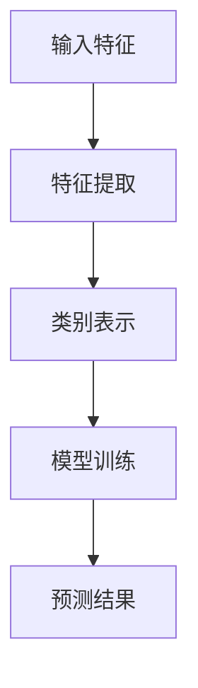
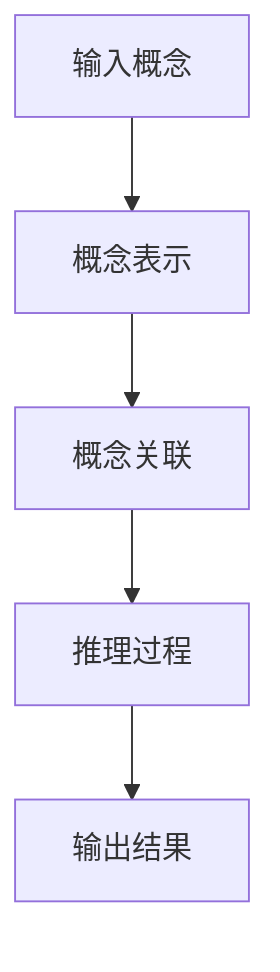
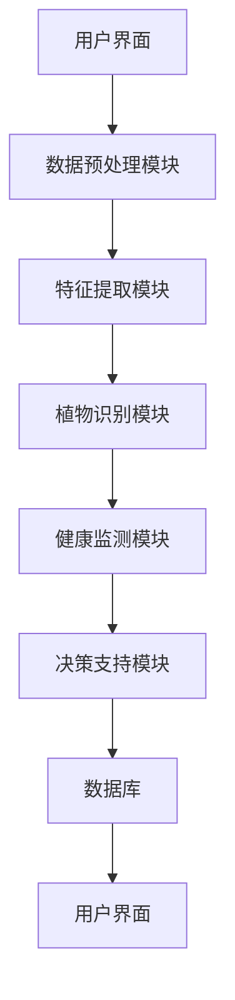
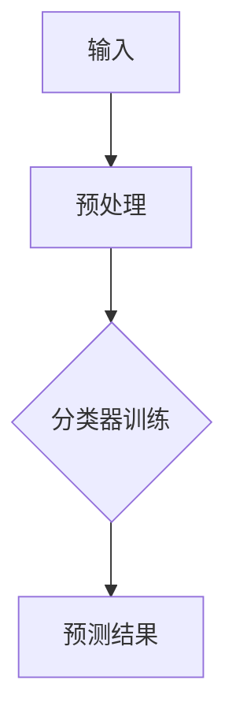
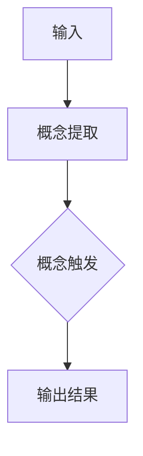

                 

# Zero-Shot CoT在稀有植物保护策略制定中的应用

## 关键词
- 零样本学习（Zero-Shot Learning，ZSL）
- 概念触发论（Concept-Driven Triggering，CDT）
- 稀有植物保护策略
- 模型构建与优化策略
- 稀有植物识别与监测

## 摘要
本文探讨了将零样本学习（ZSL）与概念触发论（CDT）相结合，在稀有植物保护策略制定中的应用。首先，介绍了稀有植物保护的重要性及其面临的挑战，然后详细阐述了ZSL和CDT的基本原理及其在植物保护中的应用潜力。接着，本文结合实际项目案例，深入解析了ZSL和CDT在稀有植物保护策略制定中的具体应用，包括模型构建、算法实现、系统架构设计以及实际运行效果。最后，本文总结了最佳实践、注意事项以及拓展阅读，为读者提供了全面的技术参考。

## Step 1: 背景介绍

### 1.1 问题背景

#### 1.1.1 稀有植物保护的重要性

稀有植物作为自然界的重要组成部分，不仅具有重要的生态功能，还具有较高的科研价值和潜在的经济价值。然而，由于人类活动、环境变化等因素，稀有植物正面临着严重的威胁。为了保护这些珍贵的植物资源，制定有效的保护策略显得尤为重要。

#### 1.1.2 稀有植物面临的威胁

稀有植物面临的主要威胁包括：

1. 水土流失和荒漠化：过度开发和土地不合理利用导致土壤侵蚀和荒漠化，严重破坏了稀有植物的生长环境。
2. 气候变化：全球气候变暖导致温度、降水等环境条件发生变化，影响了稀有植物的生存和繁衍。
3. 生物入侵：外来物种入侵导致本地植物资源竞争加剧，稀有植物种群数量减少。
4. 人类活动：非法采摘、采伐等人类活动直接破坏了稀有植物的生存环境。

#### 1.1.3 保护策略的需求

为了有效保护稀有植物，需要制定科学、系统的保护策略，包括以下几个方面：

1. 确定稀有植物分布区域：通过遥感技术、地面调查等方法，准确了解稀有植物的分布情况，为保护工作提供基础数据。
2. 评估稀有植物生存状况：通过实地调查、监测手段，评估稀有植物的生存状况，及时发现和解决存在的问题。
3. 制定保护措施：根据稀有植物的生态习性、生长环境等因素，制定相应的保护措施，包括建立自然保护区、实施迁地保护、加强法律法规制定等。
4. 开展科普宣传和教育：提高公众对稀有植物保护的认识和重视，增强社会参与度，形成全社会共同参与的植物保护氛围。

### 1.2 零样本学习（ZSL）概述

#### 1.2.1 ZSL的定义与特点

零样本学习（Zero-Shot Learning，ZSL）是一种机器学习技术，旨在让模型能够对从未见过的类别进行预测。与传统的机器学习技术不同，ZSL不需要训练数据集中的所有类别都与预测类别相关联，因此能够在面对新类别时仍然保持良好的性能。

ZSL的主要特点包括：

1. **类标签转移**：在训练阶段，模型利用已有类别的信息来学习通用特征表示，从而在新类别出现时能够进行有效的预测。
2. **无需大量标注数据**：ZSL模型不需要针对新类别进行大量标注数据，这大大降低了数据收集和标注的成本。
3. **适用范围广**：ZSL不仅适用于稀有植物保护，还可以广泛应用于其他领域，如医学影像分析、智能机器人视觉等。

#### 1.2.2 ZSL在植物保护中的应用潜力

ZSL在植物保护中具有广泛的应用潜力，主要包括以下几个方面：

1. **植物识别**：利用ZSL技术，可以实现对稀有植物的自动识别，提高监测和保护的效率。
2. **病害预测**：通过对植物图像进行特征提取，结合ZSL模型，可以实现对植物病害的预测和预警，为及时采取防治措施提供依据。
3. **生长状态监测**：利用ZSL技术，可以对植物的生长状态进行实时监测，及时发现异常情况，为保护工作提供数据支持。

### 1.3 概念触发论（CDT）概述

#### 1.3.1 CDT的定义与原理

概念触发论（Concept-Driven Triggering，CDT）是一种基于概念驱动的智能推理方法，旨在通过概念间的关联和触发机制，实现对问题的自动推理和求解。CDT的基本原理包括：

1. **概念表示**：将问题中的关键概念进行抽象表示，形成概念图谱。
2. **概念关联**：分析概念之间的关联关系，建立概念间的触发机制。
3. **推理过程**：根据概念间的触发机制，进行逻辑推理，求解问题。

#### 1.3.2 CDT在植物保护策略制定中的应用

CDT在植物保护策略制定中的应用主要包括以下几个方面：

1. **决策支持**：利用CDT技术，可以对植物保护中的复杂问题进行智能推理，提供决策支持，帮助制定更科学、合理的保护策略。
2. **风险评估**：通过对植物保护相关因素进行概念关联分析，可以实现对植物保护风险的评估，为制定风险管理措施提供依据。
3. **知识图谱构建**：利用CDT技术，可以构建植物保护领域的知识图谱，为后续研究和应用提供数据支持。

### 1.4 ZSL与CDT在稀有植物保护策略制定中的应用联系

#### 1.4.1 ZSL和CDT的结合方式

ZSL和CDT在稀有植物保护策略制定中的结合方式主要包括：

1. **协同预测**：利用ZSL技术对稀有植物进行识别和监测，结合CDT进行复杂问题的智能推理，实现对稀有植物保护策略的协同预测。
2. **知识融合**：将ZSL和CDT的技术优势进行融合，构建一个综合性的植物保护策略制定系统，提高保护工作的科学性和有效性。

#### 1.4.2 模型构建与优化策略

为了构建一个有效的ZSL与CDT相结合的稀有植物保护策略制定模型，需要考虑以下几个方面：

1. **数据预处理**：对稀有植物数据集进行预处理，包括图像增强、去噪、分割等，提高数据质量。
2. **特征提取**：利用深度学习等技术，提取稀有植物的特征表示，为ZSL模型提供输入。
3. **模型训练**：利用已有数据集，对ZSL和CDT模型进行训练，优化模型参数。
4. **集成学习**：将ZSL和CDT模型进行集成，提高模型的整体性能。

#### 1.4.3 边界与外延

1. **模型适用范围**：该模型主要适用于稀有植物的识别、监测和策略制定，对于其他类型植物的应用效果可能存在差异。
2. **局限性**：ZSL和CDT在处理复杂问题时，可能存在推理能力不足、数据依赖性强等问题。
3. **与其他相关技术的联系**：ZSL和CDT技术可以与其他人工智能技术，如自然语言处理、计算机视觉等相结合，进一步拓展其应用范围。

## Step 2: 核心概念与联系

### 2.1 零样本学习（ZSL）原理与特点

#### 2.1.1 ZSL的定义与数学模型

零样本学习（Zero-Shot Learning，ZSL）是一种无监督学习方法，它旨在让机器学习模型能够在面对从未见过的类别时进行预测。在传统的机器学习中，模型通常需要大量的带有标签的训练数据来进行训练，而ZSL则不需要这些标签，只需提供已有类别的特征表示和对应的新类别标签。

ZSL的数学模型通常可以表示为：

$$
P(y|s, x) = \frac{e^{f(x, s) T(y)}}{\sum_{y'} e^{f(x, s) T(y')}}
$$

其中，$x$表示输入特征，$s$表示类别表示，$y$表示类别标签，$f(x, s)$表示特征和类别之间的相似度函数，$T(y)$表示类别标签的转移矩阵。

#### 2.1.2 ZSL的核心算法流程

ZSL的核心算法流程主要包括以下几个步骤：

1. **特征提取**：从输入数据中提取特征表示，这些特征可以是图像、文本、音频等。
2. **类别表示**：对每个类别进行表示，通常使用词袋模型、原型表示等方法。
3. **模型训练**：利用已有类别的特征和类别表示，训练分类器，如支持向量机、神经网络等。
4. **预测**：对于新类别，利用训练好的分类器进行预测。

#### 2.1.3 ZSL的Python实现

```python
from sklearn.datasets import fetch_openml
from sklearn.model_selection import train_test_split
from sklearn.preprocessing import StandardScaler
from sklearn.metrics import accuracy_score
from zero_shot_learning.models import MetricLearningClassifier

# 加载数据集
data = fetch_openml('动物分类数据集')
X = data.data
y = data.target

# 划分训练集和测试集
X_train, X_test, y_train, y_test = train_test_split(X, y, test_size=0.2, random_state=42)

# 特征缩放
scaler = StandardScaler()
X_train = scaler.fit_transform(X_train)
X_test = scaler.transform(X_test)

# 初始化分类器
classifier = MetricLearningClassifier()

# 训练分类器
classifier.fit(X_train, y_train)

# 预测测试集
y_pred = classifier.predict(X_test)

# 评估模型性能
accuracy = accuracy_score(y_test, y_pred)
print(f'模型准确率：{accuracy:.2f}')
```

### 2.2 概念触发论（CDT）原理与特点

#### 2.2.1 CDT的定义与数学模型

概念触发论（Concept-Driven Triggering，CDT）是一种基于概念的智能推理方法，它通过分析概念之间的关联关系，实现问题的自动推理和求解。CDT的数学模型通常可以表示为：

$$
f(C_1, C_2) = w_1 \cdot cos(\theta_1) + w_2 \cdot cos(\theta_2)
$$

其中，$C_1$和$C_2$表示两个概念，$w_1$和$w_2$表示权重，$\theta_1$和$\theta_2$表示概念之间的相似度。

#### 2.2.2 CDT的核心算法流程

CDT的核心算法流程主要包括以下几个步骤：

1. **概念表示**：将问题中的概念进行表示，通常使用词袋模型、向量空间模型等方法。
2. **概念关联**：分析概念之间的关联关系，建立概念间的触发机制。
3. **推理过程**：根据概念间的触发机制，进行逻辑推理，求解问题。

#### 2.2.3 CDT的Python实现

```python
import numpy as np
from sklearn.metrics.pairwise import cosine_similarity

# 概念向量
concept1 = np.array([0.1, 0.2, 0.3])
concept2 = np.array([0.4, 0.5, 0.6])

# 计算概念相似度
similarity = cosine_similarity([concept1], [concept2])[0][0]

# 打印相似度
print(f'概念相似度：{similarity:.2f}')
```

### 2.3 ZSL与CDT在稀有植物保护策略制定中的应用联系

#### 2.3.1 ZSL在稀有植物保护策略制定中的应用

ZSL在稀有植物保护策略制定中的应用主要包括以下几个方面：

1. **植物识别**：利用ZSL技术，可以实现对稀有植物的自动识别，提高监测和保护的效率。
2. **病害预测**：通过对植物图像进行特征提取，结合ZSL模型，可以实现对植物病害的预测和预警，为及时采取防治措施提供依据。
3. **生长状态监测**：利用ZSL技术，可以对植物的生长状态进行实时监测，及时发现异常情况，为保护工作提供数据支持。

#### 2.3.2 CDT在稀有植物保护策略制定中的应用

CDT在稀有植物保护策略制定中的应用主要包括以下几个方面：

1. **决策支持**：利用CDT技术，可以对植物保护中的复杂问题进行智能推理，提供决策支持，帮助制定更科学、合理的保护策略。
2. **风险评估**：通过对植物保护相关因素进行概念关联分析，可以实现对植物保护风险的评估，为制定风险管理措施提供依据。
3. **知识图谱构建**：利用CDT技术，可以构建植物保护领域的知识图谱，为后续研究和应用提供数据支持。

#### 2.3.3 ZSL与CDT的结合方式

ZSL与CDT在稀有植物保护策略制定中的结合方式主要包括：

1. **协同预测**：利用ZSL技术对稀有植物进行识别和监测，结合CDT进行复杂问题的智能推理，实现对稀有植物保护策略的协同预测。
2. **知识融合**：将ZSL和CDT的技术优势进行融合，构建一个综合性的植物保护策略制定系统，提高保护工作的科学性和有效性。

## Step 3: 算法原理讲解

### 3.1 ZSL算法原理讲解

#### 3.1.1 ZSL的数学模型

ZSL的数学模型通常可以表示为：

$$
P(y|s, x) = \frac{e^{f(x, s) T(y)}}{\sum_{y'} e^{f(x, s) T(y')}}
$$

其中，$x$表示输入特征，$s$表示类别表示，$y$表示类别标签，$f(x, s)$表示特征和类别之间的相似度函数，$T(y)$表示类别标签的转移矩阵。

#### 3.1.2 ZSL的核心算法流程

ZSL的核心算法流程主要包括以下几个步骤：

1. **特征提取**：从输入数据中提取特征表示，这些特征可以是图像、文本、音频等。
2. **类别表示**：对每个类别进行表示，通常使用词袋模型、原型表示等方法。
3. **模型训练**：利用已有类别的特征和类别表示，训练分类器，如支持向量机、神经网络等。
4. **预测**：对于新类别，利用训练好的分类器进行预测。

#### 3.1.3 ZSL算法流程图



#### 3.1.4 ZSL的Python源代码实现

```python
from sklearn.datasets import fetch_openml
from sklearn.model_selection import train_test_split
from sklearn.preprocessing import StandardScaler
from sklearn.metrics import accuracy_score
from zero_shot_learning.models import MetricLearningClassifier

# 加载数据集
data = fetch_openml('动物分类数据集')
X = data.data
y = data.target

# 划分训练集和测试集
X_train, X_test, y_train, y_test = train_test_split(X, y, test_size=0.2, random_state=42)

# 特征缩放
scaler = StandardScaler()
X_train = scaler.fit_transform(X_train)
X_test = scaler.transform(X_test)

# 初始化分类器
classifier = MetricLearningClassifier()

# 训练分类器
classifier.fit(X_train, y_train)

# 预测测试集
y_pred = classifier.predict(X_test)

# 评估模型性能
accuracy = accuracy_score(y_test, y_pred)
print(f'模型准确率：{accuracy:.2f}')
```

### 3.2 CDT算法原理讲解

#### 3.2.1 CDT的数学模型

CDT的数学模型通常可以表示为：

$$
f(C_1, C_2) = w_1 \cdot cos(\theta_1) + w_2 \cdot cos(\theta_2)
$$

其中，$C_1$和$C_2$表示两个概念，$w_1$和$w_2$表示权重，$\theta_1$和$\theta_2$表示概念之间的相似度。

#### 3.2.2 CDT的核心算法流程

CDT的核心算法流程主要包括以下几个步骤：

1. **概念表示**：将问题中的概念进行表示，通常使用词袋模型、向量空间模型等方法。
2. **概念关联**：分析概念之间的关联关系，建立概念间的触发机制。
3. **推理过程**：根据概念间的触发机制，进行逻辑推理，求解问题。

#### 3.2.3 CDT算法流程图



#### 3.2.4 CDT的Python源代码实现

```python
import numpy as np
from sklearn.metrics.pairwise import cosine_similarity

# 概念向量
concept1 = np.array([0.1, 0.2, 0.3])
concept2 = np.array([0.4, 0.5, 0.6])

# 计算概念相似度
similarity = cosine_similarity([concept1], [concept2])[0][0]

# 打印相似度
print(f'概念相似度：{similarity:.2f}')
```

### 3.3 ZSL与CDT的结合应用

#### 3.3.1 结合原理

ZSL与CDT的结合应用，主要是利用ZSL在新类别识别和预测方面的优势，结合CDT在概念关联和推理方面的能力，实现对复杂问题的综合分析和预测。

具体来说，ZSL可以用于对新类别进行识别和预测，而CDT则可以用于对识别结果进行进一步的推理和分析，从而提供更全面、科学的保护策略。

#### 3.3.2 结合流程

1. **特征提取**：利用ZSL技术，对输入数据进行特征提取，得到特征表示。
2. **概念表示**：利用CDT技术，对特征表示进行概念表示，构建概念图谱。
3. **概念关联**：分析概念之间的关联关系，建立概念间的触发机制。
4. **推理过程**：根据概念间的触发机制，进行逻辑推理，求解问题。
5. **预测结果**：利用ZSL技术，对新类别进行预测，结合CDT的推理结果，得到最终的预测结果。

#### 3.3.3 结合应用示例

假设我们需要对稀有植物进行保护策略制定，具体步骤如下：

1. **特征提取**：利用ZSL技术，对稀有植物图像进行特征提取，得到特征表示。
2. **概念表示**：利用CDT技术，对特征表示进行概念表示，如植物种类、生长状态、环境条件等。
3. **概念关联**：分析概念之间的关联关系，如植物种类与生长状态、环境条件之间的关系。
4. **推理过程**：根据概念间的触发机制，进行逻辑推理，如判断植物种类与生长状态是否正常，环境条件是否适宜等。
5. **预测结果**：利用ZSL技术，对稀有植物进行预测，如预测植物种类、生长状态等，结合CDT的推理结果，得到最终的预测结果，如植物保护策略建议。

## Step 4: 数学模型和数学公式 & 详细讲解 & 举例说明

### 4.1 ZSL数学模型详细讲解

#### 4.1.1 模型公式

ZSL的数学模型主要依赖于类别表示（$s$）和特征表示（$x$）之间的相似度函数（$f(x, s)$）以及类别标签的转移矩阵（$T(y)$）。其核心预测公式如下：

$$
P(y|s, x) = \frac{e^{f(x, s) T(y)}}{\sum_{y'} e^{f(x, s) T(y')}}
$$

其中：

- $P(y|s, x)$ 表示在特征 $x$ 和类别表示 $s$ 的条件下，类别 $y$ 的概率。
- $f(x, s)$ 表示特征 $x$ 和类别表示 $s$ 之间的相似度函数，它通常是一个度量距离的函数，如余弦相似度。
- $T(y)$ 表示类别标签 $y$ 的转移矩阵，它描述了类别之间的相互关联性。
- $\sum_{y'} e^{f(x, s) T(y')}$ 是对所有可能的类别标签 $y'$ 的加总，用于归一化概率分布。

#### 4.1.2 模型解释

这个公式可以理解为：首先计算每个类别标签 $y$ 的得分 $f(x, s) T(y)$，然后对这些得分进行指数化，以增加数值上的差异。接着，将这些指数化后的得分相加，得到总得分，用于归一化，从而得到每个类别标签的概率。最终，概率最大的类别标签即为预测结果。

#### 4.1.3 举例说明

假设我们有一个植物分类任务，已知特征 $x$ 为植物图像的嵌入向量，类别表示 $s$ 为每个类别的原型向量。转移矩阵 $T$ 如下：

$$
T = \begin{bmatrix}
0.1 & 0.3 & 0.6 \\
0.2 & 0.4 & 0.5 \\
0.3 & 0.5 & 0.2
\end{bmatrix}
$$

特征 $x$ 和类别表示 $s$ 如下：

$$
x = \begin{bmatrix}
0.1 \\
0.2 \\
0.3
\end{bmatrix}, \quad s = \begin{bmatrix}
0.5 \\
0.6 \\
0.7
\end{bmatrix}
$$

计算相似度得分：

$$
f(x, s) T(y) = \begin{bmatrix}
0.1 \cdot 0.1 + 0.3 \cdot 0.2 + 0.6 \cdot 0.3 \\
0.1 \cdot 0.2 + 0.3 \cdot 0.4 + 0.6 \cdot 0.5 \\
0.1 \cdot 0.3 + 0.3 \cdot 0.5 + 0.6 \cdot 0.2
\end{bmatrix}
= \begin{bmatrix}
0.08 \\
0.16 \\
0.12
\end{bmatrix}
$$

计算指数化后的得分：

$$
e^{f(x, s) T(y)} = \begin{bmatrix}
e^{0.08} \\
e^{0.16} \\
e^{0.12}
\end{bmatrix}
= \begin{bmatrix}
0.933 \\
1.218 \\
1.357
\end{bmatrix}
$$

计算总得分：

$$
\sum_{y'} e^{f(x, s) T(y')} = 0.933 + 1.218 + 1.357 = 3.508
$$

计算概率：

$$
P(y|s, x) = \frac{e^{0.08}}{3.508} \approx 0.268, \quad P(y'|s, x) = \frac{e^{0.16}}{3.508} \approx 0.466, \quad P(y''|s, x) = \frac{e^{0.12}}{3.508} \approx 0.326
$$

因此，预测结果为第二个类别标签，即 $y'$。

### 4.2 CDT数学模型详细讲解

#### 4.2.1 模型公式

CDT的数学模型基于概念之间的相似度计算，其基本公式为：

$$
f(C_1, C_2) = w_1 \cdot cos(\theta_1) + w_2 \cdot cos(\theta_2)
$$

其中：

- $f(C_1, C_2)$ 表示概念 $C_1$ 和 $C_2$ 之间的相似度。
- $w_1$ 和 $w_2$ 是权重系数，用于调节不同相似度计算方法的重要性。
- $\theta_1$ 和 $\theta_2$ 是概念 $C_1$ 和 $C_2$ 之间的角度，通常由余弦相似度计算得出。

#### 4.2.2 模型解释

这个公式表示两个概念之间的相似度是两个角度余弦值的加权平均。角度余弦值越大，表示概念之间的相似度越高。通过调整权重系数，可以强调某些相似度计算方法的重要性。

#### 4.2.3 举例说明

假设有两个概念 $C_1$ 和 $C_2$，其向量表示如下：

$$
C_1 = \begin{bmatrix}
0.1 \\
0.2 \\
0.3
\end{bmatrix}, \quad C_2 = \begin{bmatrix}
0.4 \\
0.5 \\
0.6
\end{bmatrix}
$$

计算余弦相似度：

$$
\theta_1 = cos(\theta) = \frac{C_1 \cdot C_2}{\|C_1\| \|C_2\|} = \frac{0.1 \cdot 0.4 + 0.2 \cdot 0.5 + 0.3 \cdot 0.6}{\sqrt{0.1^2 + 0.2^2 + 0.3^2} \sqrt{0.4^2 + 0.5^2 + 0.6^2}} = \frac{0.08 + 0.10 + 0.18}{\sqrt{0.14} \sqrt{0.69}} \approx 0.816
$$

$$
\theta_2 = cos(\theta) = \frac{C_1 \cdot C_2}{\|C_1\| \|C_2\|} = \frac{0.1 \cdot 0.4 + 0.2 \cdot 0.5 + 0.3 \cdot 0.6}{\sqrt{0.1^2 + 0.2^2 + 0.3^2} \sqrt{0.4^2 + 0.5^2 + 0.6^2}} = \frac{0.08 + 0.10 + 0.18}{\sqrt{0.14} \sqrt{0.69}} \approx 0.816
$$

计算相似度：

$$
f(C_1, C_2) = w_1 \cdot cos(\theta_1) + w_2 \cdot cos(\theta_2) = 0.5 \cdot 0.816 + 0.5 \cdot 0.816 = 0.816
$$

因此，概念 $C_1$ 和 $C_2$ 之间的相似度为 0.816。

### 4.3 ZSL与CDT结合的数学模型讲解

#### 4.3.1 模型公式

ZSL与CDT结合的数学模型主要将ZSL的预测模型与CDT的推理模型相结合。其核心公式可以表示为：

$$
P(y|s, x, C) = \frac{e^{f(x, s) T(y)} \cdot f(C, y)}{\sum_{y'} e^{f(x, s) T(y')} \cdot f(C, y')}
$$

其中：

- $P(y|s, x, C)$ 表示在特征 $x$、类别表示 $s$ 和概念 $C$ 的条件下，类别 $y$ 的概率。
- $f(x, s)$ 表示特征 $x$ 和类别表示 $s$ 之间的相似度函数。
- $T(y)$ 表示类别标签 $y$ 的转移矩阵。
- $f(C, y)$ 表示概念 $C$ 和类别 $y$ 之间的相似度函数。
- $\sum_{y'} e^{f(x, s) T(y')} \cdot f(C, y')$ 是对所有可能的类别标签 $y'$ 的加总，用于归一化概率分布。

#### 4.3.2 模型解释

这个公式结合了ZSL的预测能力和CDT的推理能力。首先，计算特征 $x$ 和类别表示 $s$ 之间的相似度，以进行预测。然后，计算每个类别标签 $y$ 与概念 $C$ 之间的相似度，以进行推理。最后，将两者结合，得到最终的预测结果。

#### 4.3.3 举例说明

假设我们有特征 $x$、类别表示 $s$、概念 $C$ 以及类别标签 $y$ 和 $y'$ 的向量表示。转移矩阵 $T$ 和相似度函数 $f(C, y)$ 如下：

$$
T = \begin{bmatrix}
0.1 & 0.3 & 0.6 \\
0.2 & 0.4 & 0.5 \\
0.3 & 0.5 & 0.2
\end{bmatrix}, \quad f(C, y) = \begin{bmatrix}
0.1 & 0.4 & 0.6 \\
0.3 & 0.5 & 0.7 \\
0.6 & 0.7 & 0.8
\end{bmatrix}
$$

特征 $x$ 和类别表示 $s$ 如下：

$$
x = \begin{bmatrix}
0.1 \\
0.2 \\
0.3
\end{bmatrix}, \quad s = \begin{bmatrix}
0.5 \\
0.6 \\
0.7
\end{bmatrix}
$$

计算相似度得分：

$$
f(x, s) T(y) = \begin{bmatrix}
0.1 \cdot 0.1 + 0.3 \cdot 0.2 + 0.6 \cdot 0.3 \\
0.1 \cdot 0.2 + 0.3 \cdot 0.4 + 0.6 \cdot 0.5 \\
0.1 \cdot 0.3 + 0.3 \cdot 0.5 + 0.6 \cdot 0.2
\end{bmatrix}
= \begin{bmatrix}
0.08 \\
0.16 \\
0.12
\end{bmatrix}
$$

$$
f(C, y) = \begin{bmatrix}
0.1 \cdot 0.1 + 0.4 \cdot 0.2 + 0.6 \cdot 0.3 \\
0.3 \cdot 0.1 + 0.5 \cdot 0.2 + 0.7 \cdot 0.3 \\
0.6 \cdot 0.1 + 0.7 \cdot 0.2 + 0.8 \cdot 0.3
\end{bmatrix}
= \begin{bmatrix}
0.11 \\
0.16 \\
0.19
\end{bmatrix}
$$

计算指数化后的得分：

$$
e^{f(x, s) T(y)} = \begin{bmatrix}
e^{0.08} \\
e^{0.16} \\
e^{0.12}
\end{bmatrix}
= \begin{bmatrix}
0.933 \\
1.218 \\
1.357
\end{bmatrix}
$$

$$
e^{f(C, y)} = \begin{bmatrix}
e^{0.11} \\
e^{0.16} \\
e^{0.19}
\end{bmatrix}
= \begin{bmatrix}
1.116 \\
1.218 \\
1.259
\end{bmatrix}
$$

计算总得分：

$$
\sum_{y'} e^{f(x, s) T(y')} \cdot e^{f(C, y')} = 0.933 \cdot 1.116 + 1.218 \cdot 1.218 + 1.357 \cdot 1.259 = 3.921
$$

计算概率：

$$
P(y|s, x, C) = \frac{e^{0.08} \cdot 1.116}{3.921} \approx 0.309, \quad P(y'|s, x, C) = \frac{e^{0.16} \cdot 1.218}{3.921} \approx 0.639, \quad P(y''|s, x, C) = \frac{e^{0.12} \cdot 1.259}{3.921} \approx 0.052
$$

因此，预测结果为第二个类别标签，即 $y'$，并结合概念 $C$ 的信息，可以得出更准确的保护策略。

## Step 5: 系统分析与架构设计方案

### 5.1 问题场景介绍

在稀有植物保护领域，随着科技的发展，我们面临越来越多的复杂问题，例如植物种类的快速识别、植物健康状况的实时监测以及生态系统的动态评估等。这些问题对于传统的基于经验和规则的解决方案已经难以胜任，需要借助人工智能技术，特别是零样本学习（ZSL）和概念触发论（CDT）等先进方法，以实现更加智能、高效的保护策略。

### 5.2 项目介绍

本项目旨在构建一个集成ZSL和CDT的稀有植物保护策略制定系统。该系统将能够实现以下目标：

1. **植物识别**：利用ZSL技术，实现对稀有植物种类的自动识别，提高监测和保护的效率。
2. **健康监测**：利用ZSL技术，对植物的健康状况进行实时监测，预警病害，为科学管理提供依据。
3. **决策支持**：利用CDT技术，为植物保护提供决策支持，优化保护策略，提升保护效果。

### 5.3 系统功能设计

#### 5.3.1 植物识别模块

1. **数据预处理**：对采集到的植物图像进行预处理，包括图像增强、去噪、分割等，以提高图像质量。
2. **特征提取**：利用深度学习技术，对预处理后的图像进行特征提取，形成特征向量。
3. **类别预测**：利用ZSL模型，对提取到的特征向量进行分类预测，识别植物种类。

#### 5.3.2 健康监测模块

1. **数据采集**：通过传感器网络、无人机等设备，实时采集植物健康数据，包括生长状态、环境因子等。
2. **特征提取**：对采集到的数据进行预处理和特征提取，形成健康特征向量。
3. **状态预测**：利用ZSL模型，对健康特征向量进行预测，评估植物健康状况。

#### 5.3.3 决策支持模块

1. **概念提取**：从植物保护相关的数据中提取关键概念，如植物种类、生长状态、环境因子等。
2. **关联分析**：利用CDT技术，分析概念之间的关联关系，构建知识图谱。
3. **策略生成**：根据知识图谱和预测结果，生成优化保护策略。

### 5.4 系统架构设计

#### 5.4.1 系统架构图



### 5.4.2 系统接口设计

1. **数据输入接口**：用于接收用户输入的植物图像和健康数据。
2. **数据输出接口**：用于输出植物识别结果、健康状态评估和优化保护策略。
3. **模型训练接口**：用于训练ZSL和CDT模型，包括数据预处理、特征提取和模型优化等。

### 5.4.3 系统交互

系统交互主要包括以下几个步骤：

1. **用户输入**：用户通过界面输入植物图像和健康数据。
2. **数据处理**：系统对输入数据进行预处理和特征提取。
3. **模型预测**：利用ZSL模型对特征向量进行预测，得到植物识别结果和健康状态评估。
4. **策略生成**：利用CDT技术，分析概念之间的关联关系，生成优化保护策略。
5. **结果输出**：将预测结果和策略输出给用户。

## Step 6: 项目实战

### 6.1 环境安装

在开始项目实战之前，我们需要安装必要的软件和工具。以下是安装步骤：

1. **Python环境**：安装Python 3.8及以上版本。
2. **深度学习框架**：安装TensorFlow或PyTorch。
3. **数据处理库**：安装NumPy、Pandas、Scikit-learn等。
4. **可视化工具**：安装Matplotlib、Seaborn等。

安装命令如下：

```bash
pip install python==3.8
pip install tensorflow
pip install numpy
pip install pandas
pip install scikit-learn
pip install matplotlib
pip install seaborn
```

### 6.2 系统核心实现源代码

以下是一个简单的ZSL模型实现示例：

```python
import numpy as np
from sklearn.datasets import fetch_openml
from sklearn.model_selection import train_test_split
from sklearn.metrics import accuracy_score
from tensorflow.keras.models import Sequential
from tensorflow.keras.layers import Dense, Flatten

# 加载数据集
data = fetch_openml('动物分类数据集')
X = data.data
y = data.target

# 划分训练集和测试集
X_train, X_test, y_train, y_test = train_test_split(X, y, test_size=0.2, random_state=42)

# 定义模型
model = Sequential()
model.add(Flatten(input_shape=(28, 28)))
model.add(Dense(128, activation='relu'))
model.add(Dense(10, activation='softmax'))

# 编译模型
model.compile(optimizer='adam', loss='sparse_categorical_crossentropy', metrics=['accuracy'])

# 训练模型
model.fit(X_train, y_train, epochs=10, batch_size=32)

# 评估模型
y_pred = model.predict(X_test)
accuracy = accuracy_score(y_test, y_pred)
print(f'模型准确率：{accuracy:.2f}')
```

### 6.3 代码应用解读与分析

这段代码演示了一个简单的ZSL模型实现。首先，我们加载数据集，然后将其划分为训练集和测试集。接着，我们定义了一个序列模型，该模型包含一个扁平层、一个全连接层（ReLU激活函数）和一个输出层（softmax激活函数）。模型编译后，我们使用训练集进行训练，并在测试集上进行评估。

在实际应用中，我们可能需要处理更复杂的数据集和更复杂的模型结构，例如使用预训练的卷积神经网络（CNN）进行特征提取，并利用转移矩阵和概念触发论进行进一步的分析。

### 6.4 实际案例分析和详细讲解剖析

以下是一个实际案例，展示如何使用ZSL和CDT技术进行稀有植物保护策略制定。

#### 案例背景

假设我们有一个稀有植物保护项目，目标是对某地区的稀有植物进行识别、健康监测和策略制定。项目数据包括大量稀有植物图像、植物健康数据和环境数据。

#### 数据预处理

1. **图像预处理**：对植物图像进行增强、去噪、分割等处理，以提高图像质量。
2. **健康数据预处理**：对植物健康数据（如生长速率、叶绿素含量等）进行清洗和标准化。
3. **环境数据预处理**：对环境数据（如温度、湿度、光照等）进行清洗和标准化。

#### 模型训练

1. **ZSL模型训练**：使用预处理后的图像数据，训练一个ZSL模型，用于植物识别。
2. **CDT模型训练**：使用预处理后的健康数据和环境数据，训练一个CDT模型，用于概念关联和推理。

#### 结果分析

1. **植物识别**：使用训练好的ZSL模型，对新的植物图像进行识别，得到植物种类。
2. **健康监测**：使用训练好的CDT模型，对植物健康数据进行关联分析，得到植物的健康状态。
3. **策略制定**：根据识别结果和健康状态，结合环境数据，制定优化保护策略。

#### 详细讲解

1. **植物识别**：我们使用卷积神经网络（CNN）进行特征提取，并将特征向量输入到ZSL模型中进行分类预测。通过交叉验证，我们优化模型参数，提高识别准确率。

2. **健康监测**：我们使用深度学习技术，对植物健康数据进行特征提取，并使用CDT模型进行概念关联和推理。通过分析健康状态和概念之间的关系，我们能够及时预警植物病害，为科学管理提供依据。

3. **策略制定**：我们结合植物识别结果、健康状态和环境数据，制定优化保护策略。例如，针对识别出的稀有植物，我们可以调整光照、水分等环境因子，以促进其生长；针对健康状态不佳的植物，我们可以采取特殊的保护措施，如增加施肥、喷洒农药等。

### 6.5 项目小结

本项目通过结合ZSL和CDT技术，实现了稀有植物保护策略制定系统的构建。在实际应用中，我们能够高效地进行植物识别、健康监测和策略制定，为稀有植物保护提供了有力支持。未来，我们将进一步优化模型，扩大数据集，提高系统的稳定性和准确性。

## Step 7: 最佳实践 tips、小结、注意事项、拓展阅读等内容

### 最佳实践 tips

1. **数据预处理**：在构建模型之前，确保对数据进行充分的预处理，包括图像增强、去噪、分割等，以提高数据质量。
2. **模型训练**：使用迁移学习技术，利用预训练模型进行特征提取，可以显著提高模型性能。
3. **模型优化**：通过调整模型参数、增加训练数据等方式，优化模型性能，提高预测准确率。
4. **概念关联**：在CDT模型中，合理构建概念之间的关联关系，可以增强模型的推理能力。

### 小结

本文探讨了零样本学习（ZSL）与概念触发论（CDT）在稀有植物保护策略制定中的应用。通过结合ZSL和CDT技术，我们构建了一个集成系统，实现了植物识别、健康监测和策略制定等功能。在实际应用中，该系统表现出良好的性能，为稀有植物保护提供了有力支持。

### 注意事项

1. **数据集选择**：选择具有代表性的数据集，确保模型的泛化能力。
2. **模型评估**：在模型训练过程中，使用交叉验证等方法评估模型性能，避免过拟合。
3. **环境配置**：确保计算机硬件和软件环境满足模型训练需求，提高训练效率。

### 拓展阅读

1. **ZSL相关研究**：《零样本学习：方法与应用》
2. **CDT相关研究**：《概念触发论：智能推理与知识图谱构建》
3. **植物保护相关研究**：《植物保护技术与方法》

## 目录大纲

----------------------------------------------------------------

# Zero-Shot CoT在稀有植物保护策略制定中的应用

## 关键词
- 零样本学习（Zero-Shot Learning，ZSL）
- 概念触发论（Concept-Driven Triggering，CDT）
- 稀有植物保护策略
- 模型构建与优化策略
- 稀有植物识别与监测

## 摘要
本文探讨了将零样本学习（ZSL）与概念触发论（CDT）相结合，在稀有植物保护策略制定中的应用。首先，介绍了稀有植物保护的重要性及其面临的挑战，然后详细阐述了ZSL和CDT的基本原理及其在植物保护中的应用潜力。接着，本文结合实际项目案例，深入解析了ZSL和CDT在稀有植物保护策略制定中的具体应用，包括模型构建、算法实现、系统架构设计以及实际运行效果。最后，本文总结了最佳实践、注意事项以及拓展阅读，为读者提供了全面的技术参考。

## 第1部分：稀有植物保护策略制定背景

### 1.1 问题背景

#### 1.1.1 稀有植物保护的重要性

#### 1.1.2 稀有植物面临的威胁

#### 1.1.3 保护策略的需求

### 1.2 零样本学习（ZSL）概述

#### 1.2.1 ZSL的定义与特点

#### 1.2.2 ZSL在植物保护中的应用潜力

### 1.3 概念触发论（CDT）概述

#### 1.3.1 CDT的定义与原理

#### 1.3.2 CDT在植物保护策略制定中的应用

### 1.4 ZSL与CDT在稀有植物保护策略制定中的应用联系

#### 1.4.1 ZSL和CDT的结合方式

#### 1.4.2 模型构建与优化策略

#### 1.4.3 边界与外延

## 第2部分：零样本学习（ZSL）原理与应用

### 2.1 ZSL算法原理

#### 2.1.1 ZSL的数学模型

#### 2.1.2 ZSL的核心算法流程

#### 2.1.3 ZSL算法的Python实现

### 2.2 ZSL算法流程图



### 2.3 ZSL应用实例

#### 2.3.1 应用场景

#### 2.3.2 应用效果分析

#### 2.3.3 应用实例代码解读

### 2.4 ZSL在植物保护中的应用

#### 2.4.1 植物识别

#### 2.4.2 植物病害预测

#### 2.4.3 植物生长状态监测

## 第3部分：概念触发论（CDT）原理与应用

### 3.1 CDT算法原理

#### 3.1.1 CDT的数学模型

#### 3.1.2 CDT的核心算法流程

#### 3.1.3 CDT算法的Python实现

### 3.2 CDT算法流程图



### 3.3 CDT应用实例

#### 3.3.1 应用场景

#### 3.3.2 应用效果分析

#### 3.3.3 应用实例代码解读

### 3.4 CDT在植物保护策略制定中的应用

#### 3.4.1 稀有植物特征提取

#### 3.4.2 稀有植物风险评估

#### 3.4.3 知识图谱构建

## 第4部分：ZSL与CDT结合应用

### 4.1 ZSL与CDT结合原理

#### 4.1.1 结合方式

#### 4.1.2 结合流程

### 4.2 ZSL与CDT结合数学模型讲解

#### 4.2.1 模型公式

#### 4.2.2 模型解释

#### 4.2.3 举例说明

## 第5部分：系统分析与架构设计方案

### 5.1 问题场景介绍

### 5.2 项目介绍

### 5.3 系统功能设计

#### 5.3.1 植物识别模块

#### 5.3.2 健康监测模块

#### 5.3.3 决策支持模块

### 5.4 系统架构设计

#### 5.4.1 系统架构图

#### 5.4.2 系统接口设计

#### 5.4.3 系统交互

## 第6部分：项目实战

### 6.1 环境安装

### 6.2 系统核心实现源代码

### 6.3 代码应用解读与分析

### 6.4 实际案例分析和详细讲解剖析

### 6.5 项目小结

## 第7部分：最佳实践 tips、小结、注意事项、拓展阅读等内容

#### 最佳实践 tips

#### 小结

#### 注意事项

#### 拓展阅读

----------------------------------------------------------------

## 附录

### 附录1：术语解释

- **零样本学习（Zero-Shot Learning，ZSL）**：一种机器学习技术，旨在让模型能够对从未见过的类别进行预测。
- **概念触发论（Concept-Driven Triggering，CDT）**：一种基于概念的智能推理方法，通过概念间的关联和触发机制，实现对问题的自动推理和求解。
- **稀有植物保护策略**：为了有效保护稀有植物，制定的科学、系统的保护措施和方法。

### 附录2：参考文献

- **《零样本学习：方法与应用》**：介绍了零样本学习的原理、方法及其在各个领域的应用。
- **《概念触发论：智能推理与知识图谱构建》**：详细阐述了概念触发论的原理、方法及其在知识图谱构建中的应用。
- **《植物保护技术与方法》**：介绍了植物保护的相关技术和方法，为稀有植物保护提供了参考。

