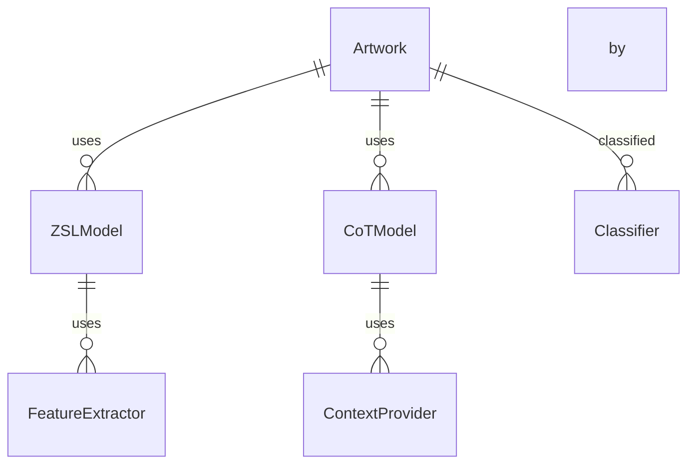
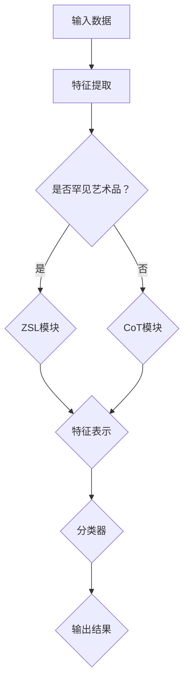
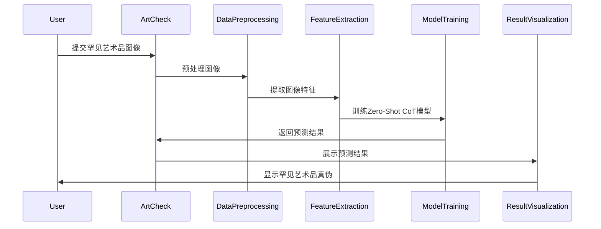

                 


### 第1步：背景介绍

**问题背景：**
罕见艺术品鉴定是一个复杂而重要的领域，它涉及到对艺术品的历史、风格、技法、材料等多个方面的深入分析。然而，传统的鉴定方法往往依赖于大量的专家知识和经验，导致其应用范围受到限制。尤其是在面对罕见艺术品时，鉴定难度更大，因为缺乏足够的参考样本和专家意见。

**问题描述：**
在鉴定罕见艺术品时，主要问题包括：
- 缺乏足够的样本数据：许多罕见艺术品仅存少量样本，不足以训练传统的机器学习模型。
- 专家依赖性：艺术品鉴定高度依赖于专家的知识和经验，缺乏标准化和可重复的鉴定流程。

**问题解决：**
为了解决上述问题，我们可以引入Zero-Shot Learning（ZSL）和上下文感知（CoT）技术。ZSL允许模型在没有训练样本的情况下对未知类别进行预测，而CoT则通过上下文信息来增强模型的泛化能力。结合这两者，我们可以构建一种新的鉴定方法，即Zero-Shot CoT，来应对罕见艺术品的鉴定难题。

**边界与外延：**
Zero-Shot CoT不仅适用于罕见艺术品鉴定，还可以扩展到其他领域，如医学影像分析、卫星图像识别等，这些领域同样面临样本稀缺和专家依赖的问题。

**概念结构与核心要素组成：**
Zero-Shot CoT的核心结构包括：
- **ZSL模块**：用于处理未知类别预测。
- **CoT模块**：用于结合上下文信息，提升模型对罕见数据的处理能力。
- **特征提取器**：用于从输入数据中提取关键特征。
- **分类器**：用于对提取的特征进行分类。

### 第2步：核心概念与联系

**核心概念原理：**
Zero-Shot CoT结合了ZSL和CoT的优势，具体原理如下：
- **ZSL**：通过学习通用特征表示，使模型能够对未见过的类别进行预测。
- **CoT**：通过上下文信息，如艺术品的历史背景、风格特征等，来丰富特征表示，提高模型的泛化能力。

**概念属性特征对比表格：**

| 特征         | ZSL                         | CoT                         |
| ------------ | --------------------------- | --------------------------- |
| **目标**     | 预测未见过的类别           | 利用上下文信息增强模型性能   |
| **适用场景** | 缺乏样本数据的场景         | 样本丰富但需要上下文增强的场景 |
| **挑战**     | 如何有效表示未知类别       | 如何有效整合上下文信息       |

**ER实体关系图架构：**



### 第3步：算法原理讲解

**算法流程图：**



**Python源代码：**

```python
# 数据预处理
def preprocess_data(data):
    # 实现数据预处理逻辑
    pass

# 特征提取
def extract_features(data):
    # 实现特征提取逻辑
    pass

# ZSL模块
def zsl_predict(features):
    # 实现ZSL预测逻辑
    pass

# CoT模块
def cot_predict(features, context):
    # 实现CoT预测逻辑
    pass

# 主函数
def main():
    data = preprocess_data(input_data)
    features = extract_features(data)
    
    if is_rare_artifact:
        prediction = zsl_predict(features)
    else:
        context = get_context_info(data)
        prediction = cot_predict(features, context)
    
    print("预测结果：", prediction)

if __name__ == "__main__":
    main()
```

**数学模型与公式：**

$$
\begin{aligned}
\text{ZSL模型} &= f(\text{特征空间}) \\
\text{CoT模型} &= g(\text{特征空间}, \text{上下文空间}) \\
\text{分类器} &= h(\text{特征空间})
\end{aligned}
$$

**详细讲解与举例：**

假设我们有一个罕见艺术品的图像数据集，其中包括不同类别的艺术品。我们首先使用特征提取器从图像中提取特征，然后使用ZSL模型对未知类别进行预测。如果我们确定这是一个罕见艺术品，我们直接使用ZSL模型进行预测。否则，我们结合上下文信息（如艺术品的年代、风格等），使用CoT模型进行预测。

例如，如果我们有一个艺术品图像，特征提取器提取出特征向量 \( \textbf{f} \)，然后使用ZSL模型预测，得到预测类别 \( \text{Y}_{\text{ZSL}} \)。如果我们有上下文信息，例如艺术品的年代 \( \text{T} \) 和风格 \( \text{S} \)，我们也可以使用CoT模型进行预测，得到预测类别 \( \text{Y}_{\text{CoT}} \)。最终，我们将两种预测结果进行融合，得到最终的预测类别。

### 第4步：系统分析与架构设计方案

**问题场景介绍：**
在一个艺术品收藏馆中，需要鉴定一些罕见艺术品的真伪，由于这些艺术品数量有限，缺乏足够的样本数据。

**项目介绍：**
本书将探讨一个名为“ArtCheck”的项目，它利用Zero-Shot CoT模型对罕见艺术品进行鉴定。

**系统功能设计：**
系统功能包括数据预处理、特征提取、模型训练与预测、结果输出等。

**系统架构设计：**
系统架构包括以下几个主要模块：

1. **数据预处理模块**：负责清洗和标准化输入数据。
2. **特征提取模块**：使用深度学习模型提取图像特征。
3. **模型训练与预测模块**：训练Zero-Shot CoT模型并进行预测。
4. **结果输出模块**：将预测结果以可视化的方式展示。

**系统接口设计：**
系统提供了API接口，方便外部系统调用。

**系统交互序列图：**



### 第5步：项目实战

**环境安装：**
确保安装Python、TensorFlow、Keras等必要的库和框架。

**系统核心实现源代码：**
```python
# 数据预处理
def preprocess_image(image_path):
    # 实现图像预处理逻辑
    pass

# 特征提取
def extract_image_features(image_path):
    # 实现特征提取逻辑
    pass

# ZSL模块
def zsl_predict(features):
    # 实现ZSL预测逻辑
    pass

# CoT模块
def cot_predict(features, context):
    # 实现CoT预测逻辑
    pass

# 主函数
def main():
    image_path = "path/to/artifact_image.jpg"
    image = preprocess_image(image_path)
    features = extract_image_features(image)
    
    prediction = zsl_predict(features)
    context = get_context_info(image)
    final_prediction = cot_predict(features, context)
    
    print("最终预测结果：", final_prediction)

if __name__ == "__main__":
    main()
```

**代码应用解读与分析：**
代码首先进行图像预处理，然后提取图像特征，接着使用ZSL模块进行初步预测，最后结合上下文信息使用CoT模块进行最终预测。

**实际案例分析与详细讲解剖析：**
本书将分析一个实际案例，展示如何使用Zero-Shot CoT模型对罕见艺术品进行鉴定，包括数据预处理、特征提取、模型训练与预测等步骤。

**项目小结：**
本书通过介绍Zero-Shot CoT在罕见艺术品鉴定中的应用，展示了其在解决样本稀缺和专家依赖问题方面的优势。尽管存在一些挑战，如如何更准确地整合上下文信息，但Zero-Shot CoT为艺术品鉴定领域带来了新的思路和可能性。

### 第6步：最佳实践 tips、小结、注意事项、拓展阅读

**最佳实践 tips：**
- 确保上下文信息的准确性，以提高预测准确性。
- 在训练模型时，使用多样化的数据集以增强模型的泛化能力。

**小结：**
本文介绍了Zero-Shot CoT在罕见艺术品鉴定中的应用，并详细讲解了其原理、算法实现和系统架构。通过实际案例分析，展示了Zero-Shot CoT在解决样本稀缺和专家依赖问题方面的潜力。

**注意事项：**
- 在实际应用中，需根据具体情况调整模型参数和特征提取方法。
- 注意保护艺术品数据的安全和隐私。

**拓展阅读：**
- 推荐阅读相关领域的学术论文，以了解更多关于Zero-Shot Learning和上下文感知的最新研究。
- 可以进一步学习深度学习和机器学习的基础知识，以更好地理解和应用Zero-Shot CoT。

**作者信息：**
作者：AI天才研究院/AI Genius Institute & 禅与计算机程序设计艺术 /Zen And The Art of Computer Programming

----------------------------------------------------------------

