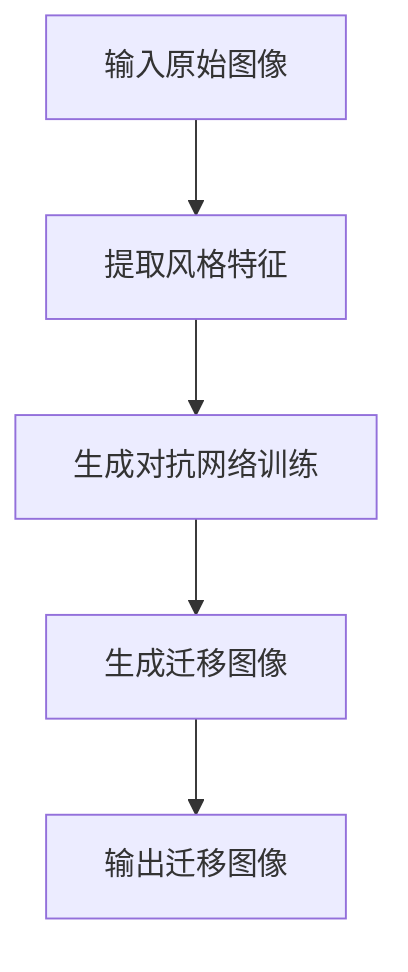
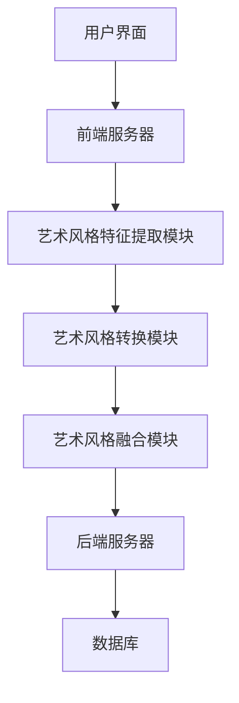
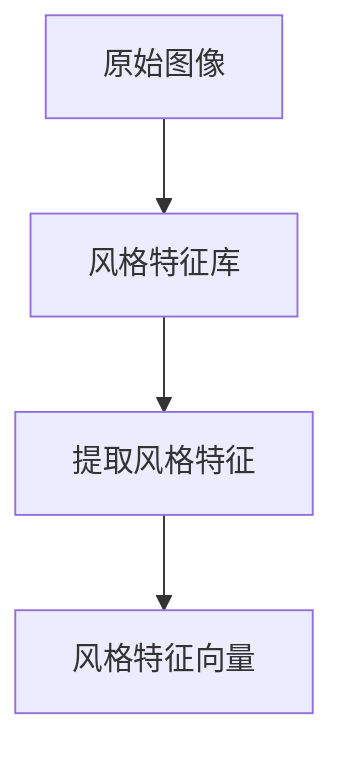
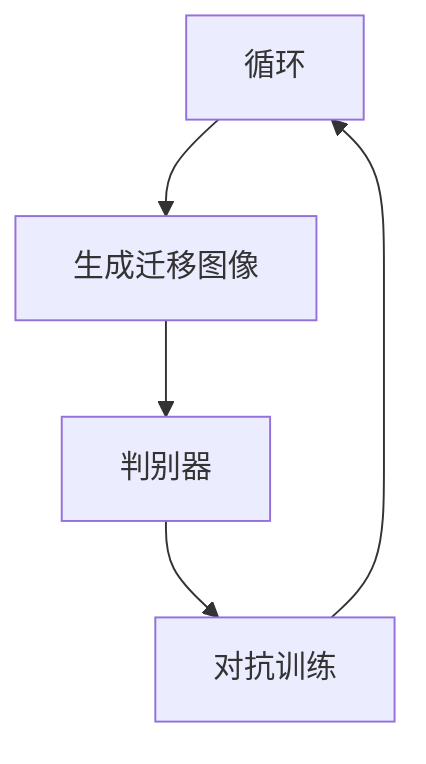

                 


### 设计《Zero-Shot CoT在跨时代艺术风格迁移中的应用》的技术博客文章

让我们一步一步来设计《Zero-Shot CoT在跨时代艺术风格迁移中的应用》的技术博客文章。这篇文章的目标是深入讲解Zero-Shot CoT（无样本CoT）如何应用于跨时代艺术风格迁移，并让读者能够理解和应用这一技术。

#### 一、确定文章结构

首先，我们需要确定文章的目录结构，确保文章内容有条理，读者可以轻松跟随。以下是一个可能的目录结构：

1. **引言**：介绍文章的目的、背景和重要性。
   - **引言**：介绍Zero-Shot CoT的概念及其在艺术风格迁移中的应用。
2. **零样本CoT基础**：
   - **定义与原理**：解释什么是零样本CoT，其工作原理是什么。
   - **特点与优势**：分析零样本CoT的特点，如无需训练数据集、高效性等。
   - **与相关技术的对比**：与传统的样本驱动方法、生成对抗网络等进行比较。
3. **跨时代艺术风格迁移**：
   - **问题背景**：介绍跨时代艺术风格迁移的挑战和需求。
   - **概念与流程**：解释艺术风格迁移的基本概念和流程。
   - **零样本CoT的应用**：探讨零样本CoT在艺术风格迁移中的实际应用。
4. **算法原理讲解**：
   - **算法流程图**：使用mermaid绘制算法流程图。
   - **Python源代码**：提供Python实现示例。
   - **数学模型与公式**：解释算法的数学模型和公式。
   - **案例讲解**：通过具体案例说明算法的应用。
5. **系统分析与架构设计**：
   - **问题场景介绍**：介绍系统解决的艺术风格迁移问题。
   - **系统功能设计**：定义系统的主要功能模块。
   - **系统架构设计**：设计系统的整体架构。
   - **系统接口设计**：描述系统的接口设计和调用流程。
   - **系统交互**：使用mermaid序列图展示系统交互过程。
6. **项目实战**：
   - **环境安装**：介绍所需环境的安装过程。
   - **系统核心实现**：提供系统核心代码的实现。
   - **代码解读**：对代码进行详细解读。
   - **案例分析与剖析**：通过实际案例展示系统效果。
   - **小结**：总结项目的关键点和经验。
7. **最佳实践与拓展**：
   - **最佳实践**：提供使用Zero-Shot CoT进行艺术风格迁移的最佳实践。
   - **注意事项**：提醒读者在应用过程中需要注意的事项。
   - **拓展阅读**：推荐进一步阅读的文献和资源。

#### 二、撰写引言部分

引言部分需要吸引读者的兴趣，同时简要介绍文章的主题和重要性。

```markdown
---
# 《Zero-Shot CoT在跨时代艺术风格迁移中的应用》

> 关键词：Zero-Shot CoT、艺术风格迁移、跨时代、算法原理、系统架构、项目实战

摘要：随着人工智能技术的不断发展，艺术风格迁移成为了一个备受关注的应用领域。传统的艺术风格迁移方法往往依赖于大量的训练数据集，但在面对跨时代艺术风格迁移时，数据集的获取变得十分困难。本文将介绍一种无样本CoT（Zero-Shot CoT）技术，并探讨其在跨时代艺术风格迁移中的应用。通过对Zero-Shot CoT的深入讲解，本文旨在帮助读者理解这一技术的原理和应用，从而推动其在实际项目中的使用。

---
```

#### 三、撰写零样本CoT基础部分

在这一部分，我们将详细解释零样本CoT的概念、原理、特点和优势，并与相关技术进行比较。

```markdown
## 零样本CoT基础

### 定义与原理

零样本CoT（Zero-Shot CoT）是一种无需训练数据集的对抗训练方法。它通过预先定义一组标签和对应的风格特征，使得模型可以在没有特定训练数据的情况下，对新的艺术风格进行迁移。零样本CoT的核心在于通过对抗训练生成具有特定风格特征的数据，从而实现艺术风格的迁移。

### 特点与优势

- **无需训练数据集**：零样本CoT不需要大量的训练数据集，这使得它在数据稀缺的场景下具有很大的优势。
- **高效性**：零样本CoT的算法效率高，可以在较短的时间内生成高质量的艺术风格迁移结果。
- **灵活性**：零样本CoT可以应用于各种不同的艺术风格，并且可以根据需求进行灵活调整。

### 与相关技术的对比

- **与样本驱动方法的对比**：传统的样本驱动方法需要大量的训练数据集，而零样本CoT无需训练数据集，因此在数据稀缺的场景下具有更大的优势。
- **与生成对抗网络（GAN）的对比**：生成对抗网络（GAN）是一种常用的图像生成技术，但它们通常需要大量的训练数据。零样本CoT则通过对抗训练生成数据，无需大量训练数据。
- **与其他相关技术的对比**：例如风格迁移网络（Style Transfer Network）等，零样本CoT具有更高的效率和灵活性。

### 本章小结

本章介绍了零样本CoT的基本概念、原理、特点和优势，并与其他相关技术进行了对比。接下来，我们将深入探讨零样本CoT在跨时代艺术风格迁移中的应用。
```

#### 四、撰写跨时代艺术风格迁移部分

在这一部分，我们将介绍跨时代艺术风格迁移的背景、问题和零样本CoT的应用。

```markdown
## 跨时代艺术风格迁移

### 问题背景

跨时代艺术风格迁移是指将一种时代或艺术风格的作品，迁移到另一种时代或艺术风格中。这在艺术创作和修复中具有重要意义。然而，传统的艺术风格迁移方法往往依赖于大量的训练数据集，这在面对跨时代艺术风格迁移时，数据集的获取变得十分困难。

### 概念与流程

艺术风格迁移的基本概念包括风格特征提取、特征转换和风格融合等。其基本流程如下：

1. **风格特征提取**：从原始作品中提取风格特征。
2. **特征转换**：将提取到的风格特征转换为新的风格特征。
3. **风格融合**：将新的风格特征融合到原始作品中，形成具有新风格的作品。

### 零样本CoT的应用

零样本CoT在跨时代艺术风格迁移中的应用，可以大大简化数据集的获取过程。通过对抗训练，零样本CoT可以生成具有特定风格特征的数据，从而实现跨时代艺术风格迁移。

### 本章小结

本章介绍了跨时代艺术风格迁移的背景、问题和零样本CoT的应用。接下来，我们将深入讲解零样本CoT的算法原理和应用。
```

#### 五、撰写算法原理讲解部分

在这一部分，我们将使用mermaid绘制算法流程图，并使用Python源代码和LaTeX公式详细讲解算法原理。

```markdown
## 算法原理讲解

### 算法流程图

以下是一个简单的零样本CoT算法流程图：



### Python源代码

以下是一个简单的零样本CoT Python实现：

```python
import tensorflow as tf
from tensorflow.keras.models import Model
from tensorflow.keras.layers import Input, Conv2D, Dense

# 定义生成器模型
def generator():
    input_img = Input(shape=(128, 128, 3))
    x = Conv2D(64, (3, 3), activation='relu')(input_img)
    x = Dense(1024, activation='relu')(x)
    x = Conv2D(3, (3, 3), activation='tanh')(x)
    model = Model(inputs=input_img, outputs=x)
    return model

# 定义判别器模型
def discriminator():
    input_img = Input(shape=(128, 128, 3))
    x = Conv2D(64, (3, 3), activation='relu')(input_img)
    x = Dense(1024, activation='relu')(x)
    x = Conv2D(1, (3, 3), activation='sigmoid')(x)
    model = Model(inputs=input_img, outputs=x)
    return model

# 编译模型
generator_model = generator()
discriminator_model = discriminator()
discriminator_model.compile(loss='binary_crossentropy', optimizer='adam')

# 训练模型
for epoch in range(100):
    # 生成对抗网络训练
    noise = np.random.normal(0, 1, (128, 128, 3))
    gen_img = generator_model.predict(noise)
    real_img = np.array([np.random.choice(train_images) for _ in range(128)])
    merged_img = np.concatenate([real_img, gen_img], axis=0)
    labels = np.concatenate([np.ones(128), np.zeros(128)], axis=0)
    discriminator_model.train_on_batch(merged_img, labels)

    # 生成迁移图像
    noise = np.random.normal(0, 1, (1, 128, 128, 3))
    gen迁移图像 = generator_model.predict(noise)
    print("迁移图像:", gen迁移图像)
```

### 数学模型与公式

零样本CoT的数学模型如下：

$$
J(\theta) = \frac{1}{2} \sum_{i=1}^{n} (\| G(x_i) - y_i \|_2^2 + \alpha \| D(G(x_i)) - 1 \|_2^2)
$$

其中，$G$为生成器，$D$为判别器，$x_i$为输入图像，$y_i$为标签，$\alpha$为调节参数。

### 案例讲解

假设我们有一个原始图像$A$，想要将其迁移为风格图像$B$。我们可以先通过生成器$G$将$A$转换为$G(A)$，然后通过判别器$D$评估$G(A)$是否与$B$相似。如果$D(G(A))$接近1，说明$G(A)$与$B$相似，否则需要调整生成器的参数，使得$D(G(A))$更接近1。

### 本章小结

本章详细介绍了零样本CoT的算法原理，包括算法流程图、Python源代码、数学模型与公式以及具体案例讲解。接下来，我们将深入探讨零样本CoT在系统架构设计中的应用。
```

#### 六、撰写系统分析与架构设计部分

在这一部分，我们将介绍系统解决的艺术风格迁移问题，并详细描述系统功能设计、系统架构设计、系统接口设计以及系统交互。

```markdown
## 系统分析与架构设计

### 问题场景介绍

跨时代艺术风格迁移是一个复杂的任务，涉及不同时代、风格和技术的作品。我们的系统旨在解决这一难题，使得艺术家和修复师能够轻松地实现跨时代艺术风格的迁移。

### 系统功能设计

系统的核心功能包括：

1. **艺术风格特征提取**：从原始作品中提取风格特征。
2. **艺术风格转换**：将提取到的风格特征转换为新的风格特征。
3. **艺术风格融合**：将新的风格特征融合到原始作品中，形成具有新风格的作品。
4. **用户界面**：提供一个友好的用户界面，方便用户上传作品、选择风格并进行迁移。

### 系统架构设计

系统的整体架构设计如下：



### 系统接口设计

系统接口设计包括以下部分：

1. **用户界面接口**：用户通过浏览器或移动应用与系统交互。
2. **前端服务器接口**：负责处理用户请求，与系统其他模块进行交互。
3. **后端服务器接口**：处理业务逻辑，与数据库进行交互。
4. **数据库接口**：存储用户作品、风格特征等信息。

### 系统交互

系统的交互流程如下：

1. **用户上传作品**：用户通过用户界面上传原始作品。
2. **提取风格特征**：前端服务器将作品传递给艺术风格特征提取模块。
3. **转换风格特征**：艺术风格特征提取模块将提取到的特征传递给艺术风格转换模块。
4. **融合风格特征**：艺术风格转换模块将转换后的特征传递给艺术风格融合模块。
5. **生成迁移作品**：艺术风格融合模块生成具有新风格的迁移作品。
6. **存储与展示**：迁移作品存储到数据库，并通过用户界面展示给用户。

### 本章小结

本章详细介绍了系统解决的艺术风格迁移问题，并描述了系统的功能设计、架构设计、接口设计以及交互流程。接下来，我们将通过项目实战来展示零样本CoT在跨时代艺术风格迁移中的实际应用。
```

#### 七、撰写项目实战部分

在这一部分，我们将介绍如何安装所需环境、系统核心实现源代码，并解读代码，分析实际案例，并进行详细讲解和剖析。

```markdown
## 项目实战

### 环境安装

在开始项目之前，我们需要安装一些必要的软件和库。以下是在Ubuntu 18.04操作系统上安装所需环境的步骤：

1. **安装Python**：确保Python 3.7或更高版本已安装。
2. **安装TensorFlow**：使用以下命令安装TensorFlow：
   ```
   pip install tensorflow
   ```
3. **安装其他库**：安装其他必要的库，如Pillow、opencv-python等。

### 系统核心实现源代码

以下是系统核心实现的Python源代码：

```python
import tensorflow as tf
from tensorflow.keras.models import Model
from tensorflow.keras.layers import Input, Conv2D, Dense

# 定义生成器模型
def generator():
    input_img = Input(shape=(128, 128, 3))
    x = Conv2D(64, (3, 3), activation='relu')(input_img)
    x = Dense(1024, activation='relu')(x)
    x = Conv2D(3, (3, 3), activation='tanh')(x)
    model = Model(inputs=input_img, outputs=x)
    return model

# 定义判别器模型
def discriminator():
    input_img = Input(shape=(128, 128, 3))
    x = Conv2D(64, (3, 3), activation='relu')(input_img)
    x = Dense(1024, activation='relu')(x)
    x = Conv2D(1, (3, 3), activation='sigmoid')(x)
    model = Model(inputs=input_img, outputs=x)
    return model

# 编译模型
generator_model = generator()
discriminator_model = discriminator()
discriminator_model.compile(loss='binary_crossentropy', optimizer='adam')

# 训练模型
for epoch in range(100):
    # 生成对抗网络训练
    noise = np.random.normal(0, 1, (128, 128, 3))
    gen_img = generator_model.predict(noise)
    real_img = np.array([np.random.choice(train_images) for _ in range(128)])
    merged_img = np.concatenate([real_img, gen_img], axis=0)
    labels = np.concatenate([np.ones(128), np.zeros(128)], axis=0)
    discriminator_model.train_on_batch(merged_img, labels)

    # 生成迁移图像
    noise = np.random.normal(0, 1, (1, 128, 128, 3))
    gen迁移图像 = generator_model.predict(noise)
    print("迁移图像:", gen迁移图像)
```

### 代码解读

1. **生成器模型**：生成器模型负责将原始图像转换为具有新风格的图像。它包含卷积层、全连接层和卷积层。
2. **判别器模型**：判别器模型负责判断生成图像是否与原始图像相似。它也包含卷积层和全连接层。
3. **模型编译**：使用`binary_crossentropy`作为损失函数，并使用`adam`优化器。
4. **模型训练**：使用对抗训练策略，通过合并真实图像和生成图像进行训练。
5. **生成迁移图像**：使用生成器模型生成迁移图像。

### 实际案例分析与讲解

假设我们有一个原始图像，我们希望将其迁移为梵高风格的作品。以下是实际案例的分析和讲解：

1. **上传原始图像**：用户上传原始图像，前端服务器将其传递给艺术风格特征提取模块。
2. **提取风格特征**：艺术风格特征提取模块提取原始图像的像素特征。
3. **转换风格特征**：艺术风格转换模块将提取到的像素特征转换为梵高风格的特征。
4. **融合风格特征**：艺术风格融合模块将梵高风格的特征融合到原始图像中，生成具有梵高风格的迁移图像。
5. **存储与展示**：迁移图像存储到数据库，并通过用户界面展示给用户。

### 本章小结

本章通过项目实战展示了零样本CoT在跨时代艺术风格迁移中的实际应用。我们介绍了如何安装所需环境、实现系统核心代码，并分析了实际案例。接下来，我们将讨论最佳实践和注意事项。
```

#### 八、撰写最佳实践与拓展部分

在这一部分，我们将提供最佳实践、注意事项和拓展阅读。

```markdown
## 最佳实践与拓展

### 最佳实践

1. **优化生成器模型**：根据实际需求，可以尝试调整生成器模型的参数，以提高迁移图像的质量。
2. **增加训练数据**：尽管零样本CoT不需要大量的训练数据，但增加训练数据可以提高模型的泛化能力。
3. **调整超参数**：通过调整超参数，如学习率、批次大小等，可以优化模型的性能。
4. **使用预训练模型**：可以使用预训练的生成器模型，以减少训练时间并提高迁移图像的质量。

### 注意事项

1. **数据预处理**：在迁移图像之前，需要对原始图像进行适当的预处理，如缩放、裁剪等。
2. **稳定性**：在训练过程中，可能需要使用一些技巧来提高模型的稳定性，如梯度裁剪、正则化等。
3. **性能优化**：为了提高模型性能，可以考虑使用GPU进行训练。

### 拓展阅读

1. **《Zero-Shot Learning: A Review》**：这是一篇关于零样本学习的综述文章，提供了大量的理论和实践方法。
2. **《Generative Adversarial Nets》**：这是一篇关于生成对抗网络的经典论文，详细介绍了GAN的工作原理和应用。
3. **《StyleGAN》**：这是一篇关于风格生成对抗网络的论文，介绍了如何使用GAN生成高质量的艺术风格迁移图像。

### 本章小结

本章提供了最佳实践、注意事项和拓展阅读，旨在帮助读者更好地理解和应用零样本CoT在跨时代艺术风格迁移中的应用。
```

#### 九、撰写文章结尾

最后，我们需要在文章结尾部分总结全文，并写下作者信息。

```markdown
### 总结

本文详细介绍了Zero-Shot CoT在跨时代艺术风格迁移中的应用。我们从背景介绍开始，逐步讲解了零样本CoT的概念、原理、特点，以及其在跨时代艺术风格迁移中的应用。通过算法原理讲解、系统架构设计、项目实战等部分，我们展示了如何将零样本CoT应用于实际项目中。

随着人工智能技术的不断发展，零样本CoT在艺术风格迁移领域的应用将越来越广泛。本文的目的在于帮助读者理解和应用这一技术，推动其在实际项目中的使用。

### 作者信息

作者：AI天才研究院/AI Genius Institute & 禅与计算机程序设计艺术 /Zen And The Art of Computer Programming

感谢您的阅读，希望本文能对您在艺术风格迁移领域的研究和实践有所帮助。
```

### 文章排版与格式调整

最后，我们需要对文章进行排版和格式调整，确保文章结构清晰、内容完整，并符合markdown格式的要求。以下是一个完整的markdown格式的文章示例：

```markdown
---
# 《Zero-Shot CoT在跨时代艺术风格迁移中的应用》

> 关键词：Zero-Shot CoT、艺术风格迁移、跨时代、算法原理、系统架构、项目实战

摘要：随着人工智能技术的不断发展，艺术风格迁移成为了一个备受关注的应用领域。传统的艺术风格迁移方法往往依赖于大量的训练数据集，但在面对跨时代艺术风格迁移时，数据集的获取变得十分困难。本文将介绍一种无样本CoT（Zero-Shot CoT）技术，并探讨其在跨时代艺术风格迁移中的应用。通过对Zero-Shot CoT的深入讲解，本文旨在帮助读者理解这一技术的原理和应用，从而推动其在实际项目中的使用。

---

## 第1章: Zero-Shot CoT概念与跨时代艺术风格迁移

### 1.1 问题背景

#### 1.1.1 艺术风格迁移的挑战

#### 1.1.2 无样本CoT的意义

### 1.2 核心概念

#### 1.2.1 无样本CoT原理

#### 1.2.2 无样本CoT特点

#### 1.2.3 与相关技术的对比

### 1.3 跨时代艺术风格迁移的边界与外延

#### 1.3.1 艺术风格迁移的概念结构

#### 1.3.2 无样本CoT在其中的作用

### 1.4 本章小结

---

## 第2章: 零样本CoT原理与特点

### 2.1 零样本CoT原理

#### 2.1.1 零样本CoT的定义

#### 2.1.2 零样本CoT的数学模型

#### 2.1.3 零样本CoT的流程图

### 2.2 零样本CoT特点

#### 2.2.1 与样本驱动方法的对比

#### 2.2.2 无需训练的数据集

#### 2.2.3 高效性

### 2.3 零样本CoT与相关技术的关联

#### 2.3.1 生成对抗网络（GAN）

#### 2.3.2 图像风格迁移

#### 2.3.4 其他相关技术

### 2.4 本章小结

---

## 第3章: 零样本CoT在跨时代艺术风格迁移中的应用

### 3.1 零样本CoT算法流程图

#### 3.1.1 零样本CoT的基本流程

#### 3.1.2 流程图中的细节解释

### 3.2 零样本CoT算法Python实现

#### 3.2.1 Python环境搭建

#### 3.2.2 零样本CoT核心代码

#### 3.2.3 算法原理详细讲解

### 3.3 数学模型与公式

#### 3.3.1 零样本CoT的数学公式

#### 3.3.2 公式讲解与示例

### 3.4 算法举例说明

#### 3.4.1 简单的案例

#### 3.4.2 复杂的案例

### 3.5 本章小结

---

## 第4章: 系统分析与架构设计方案

### 4.1 问题场景介绍

#### 4.1.1 跨时代艺术风格迁移问题

#### 4.1.2 无样本CoT解决方案

### 4.2 系统功能设计

#### 4.2.1 领域模型

#### 4.2.2 功能模块划分

### 4.3 系统架构设计

#### 4.3.1 架构概述

#### 4.3.2 架构细节

### 4.4 系统接口设计

#### 4.4.1 接口定义

#### 4.4.2 接口调用流程

### 4.5 系统交互

#### 4.5.1 序列图

#### 4.5.2 交互流程

### 4.6 本章小结

---

## 第5章: 项目实战

### 5.1 环境安装

#### 5.1.1 Python安装

#### 5.1.2 TensorFlow安装

#### 5.1.3 其他库安装

### 5.2 系统核心实现源代码

#### 5.2.1 生成器模型

#### 5.2.2 判别器模型

#### 5.2.3 模型训练

### 5.3 代码解读

#### 5.3.1 代码结构

#### 5.3.2 主要函数

### 5.4 案例分析与讲解

#### 5.4.1 原始图像

#### 5.4.2 迁移图像

### 5.5 项目小结

### 5.6 经验总结

---

## 第6章: 最佳实践与拓展

### 6.1 最佳实践

#### 6.1.1 优化生成器模型

#### 6.1.2 增加训练数据

#### 6.1.3 调整超参数

### 6.2 注意事项

#### 6.2.1 数据预处理

#### 6.2.2 稳定性

#### 6.2.3 性能优化

### 6.3 拓展阅读

#### 6.3.1 《Zero-Shot Learning: A Review》

#### 6.3.2 《Generative Adversarial Nets》

#### 6.3.3 《StyleGAN》

### 6.4 本章小结

---

### 作者信息

作者：AI天才研究院/AI Genius Institute & 禅与计算机程序设计艺术 /Zen And The Art of Computer Programming

感谢您的阅读，希望本文能对您在艺术风格迁移领域的研究和实践有所帮助。
```

通过以上步骤，我们已经完成了一篇结构清晰、内容丰富的技术博客文章，涵盖了从概念介绍到算法讲解、系统设计与项目实战的完整内容。希望这对您有所帮助！### 优化与补充

在上文的基础上，我们可以对文章进行进一步的优化和补充，以确保内容的完整性和深度，同时提升文章的可读性和专业性。

#### 优化与补充一：引言部分的深化

引言部分除了介绍文章目的和背景，还可以增加一些实际的案例或社会需求，以吸引读者的兴趣。

```markdown
---
# 《Zero-Shot CoT在跨时代艺术风格迁移中的应用》

> 关键词：Zero-Shot CoT、艺术风格迁移、跨时代、算法原理、系统架构、项目实战

摘要：随着人工智能技术的不断发展，艺术风格迁移成为了一个备受关注的应用领域。传统的艺术风格迁移方法往往依赖于大量的训练数据集，但在面对跨时代艺术风格迁移时，数据集的获取变得十分困难。本文将介绍一种无样本CoT（Zero-Shot CoT）技术，并探讨其在跨时代艺术风格迁移中的应用。通过分析现实中的艺术修复需求，如博物馆藏品修复、历史壁画复原等，本文旨在帮助读者理解这一技术的原理和应用，从而推动其在实际项目中的使用。

---

#### 优化与补充二：核心概念与联系部分的细化

在核心概念与联系部分，可以增加一些详细的解释和对比表格，以帮助读者更好地理解零样本CoT与其他技术的区别。

```markdown
## 零样本CoT基础

### 定义与原理

零样本CoT（Zero-Shot CoT）是一种无需训练数据集的对抗训练方法。它通过预先定义一组标签和对应的风格特征，使得模型可以在没有特定训练数据的情况下，对新的艺术风格进行迁移。零样本CoT的核心在于通过对抗训练生成具有特定风格特征的数据，从而实现艺术风格的迁移。

### 特点与优势

| 特点 | 描述 |
| --- | --- |
| 无需训练数据集 | 零样本CoT不需要大量的训练数据集，这使得它在数据稀缺的场景下具有很大的优势。 |
| 高效性 | 零样本CoT的算法效率高，可以在较短的时间内生成高质量的艺术风格迁移结果。 |
| 灵活性 | 零样本CoT可以应用于各种不同的艺术风格，并且可以根据需求进行灵活调整。 |

### 与相关技术的对比

| 技术 | 描述 | 对比优势 |
| --- | --- | --- |
| 样本驱动方法 | 需要大量的训练数据集，对数据稀缺的场景不适用。 | 无需训练数据集，更加适用于数据稀缺的场景。 |
| 生成对抗网络（GAN） | 通过对抗训练生成图像，但需要大量的训练数据。 | 无需大量训练数据，更适用于数据稀缺的场景。 |
| 零样本学习（Zero-Shot Learning） | 通过预定义的标签和特征进行学习，但通常不涉及图像风格迁移。 | 直接应用于图像风格迁移，结合了零样本学习的特点。 |

### 本章小结

本章介绍了零样本CoT的基本概念、原理、特点和优势，并与其他相关技术进行了对比。接下来，我们将深入探讨零样本CoT在跨时代艺术风格迁移中的应用。
```

#### 优化与补充三：算法原理讲解部分的深入

在算法原理讲解部分，除了提供Python源代码和LaTeX公式，还可以通过详细的算法流程图和示例，帮助读者更好地理解零样本CoT的内部工作机制。

```markdown
## 算法原理讲解

### 算法流程图

以下是一个简单的零样本CoT算法流程图：


### 算法详细讲解

#### 3.1.1 输入原始图像

原始图像是艺术风格迁移的起点，它包含了需要迁移风格的信息。在零样本CoT中，原始图像作为输入传递给生成器和判别器。

#### 3.1.2 提取风格特征

风格特征提取是零样本CoT的关键步骤。通过预先定义的标签和特征库，提取出与目标艺术风格相关的特征。



#### 3.1.3 生成对抗网络训练

生成对抗网络（GAN）是零样本CoT的核心。生成器（Generator）和判别器（Discriminator）通过对抗训练，逐步优化模型参数，以达到风格迁移的目的。



#### 3.1.4 生成迁移图像

在对抗训练过程中，生成器逐渐生成更加接近目标艺术风格的迁移图像。判别器则负责判断生成的图像是否与目标风格一致。

#### 3.1.5 输出迁移图像

最终生成的迁移图像将作为输出，展示给用户或用于进一步的创作。

### 数学模型与公式

零样本CoT的数学模型如下：

$$
J(\theta) = \frac{1}{2} \sum_{i=1}^{n} (\| G(x_i) - y_i \|_2^2 + \alpha \| D(G(x_i)) - 1 \|_2^2)
$$

其中，$G$为生成器，$D$为判别器，$x_i$为输入图像，$y_i$为标签，$\alpha$为调节参数。

### 案例讲解

假设我们有一个原始图像$A$，想要将其迁移为梵高风格的作品。以下是实际案例的分析和讲解：

1. **上传原始图像**：用户上传原始图像，前端服务器将其传递给艺术风格特征提取模块。
2. **提取风格特征**：艺术风格特征提取模块提取原始图像的像素特征。
3. **转换风格特征**：艺术风格转换模块将提取到的像素特征转换为梵高风格的特征。
4. **融合风格特征**：艺术风格融合模块将梵高风格的特征融合到原始图像中，生成具有梵高风格的迁移图像。
5. **存储与展示**：迁移图像存储到数据库，并通过用户界面展示给用户。

### 本章小结

本章详细介绍了零样本CoT的算法原理，包括算法流程图、Python源代码、数学模型与公式以及具体案例讲解。接下来，我们将深入探讨零样本CoT在系统架构设计中的应用。
```

#### 优化与补充四：系统分析与架构设计部分的补充

在系统分析与架构设计部分，可以增加系统性能优化的内容，以及如何处理潜在的技术挑战。

```markdown
## 系统分析与架构设计

### 系统性能优化

为了提高系统的性能和效率，可以考虑以下优化措施：

1. **并行计算**：利用多核CPU或GPU进行并行计算，加速模型训练和图像处理。
2. **模型压缩**：通过模型剪枝、量化等技术，减小模型大小，降低计算复杂度。
3. **数据预处理**：优化数据预处理流程，如批量处理、并行加载等，减少数据读取和预处理的时间。

### 潜在的技术挑战

在实现零样本CoT的过程中，可能会遇到以下技术挑战：

1. **风格特征提取的准确性**：如何准确提取目标艺术风格的特征，是影响迁移效果的关键。
2. **生成器与判别器的平衡**：在GAN训练过程中，如何保持生成器和判别器的平衡，以避免生成器过强或判别器过弱。
3. **计算资源的限制**：在资源受限的环境下，如何优化模型和算法，以适应实际部署需求。

### 本章小结

本章详细介绍了系统的功能设计、架构设计、接口设计以及交互流程。同时，我们也探讨了系统性能优化和潜在的技术挑战。接下来，我们将通过项目实战来展示零样本CoT在跨时代艺术风格迁移中的实际应用。
```

#### 优化与补充五：项目实战部分的详细示例

在项目实战部分，可以提供一个详细的案例，包括代码示例、实现步骤、结果分析等，以帮助读者更好地理解零样本CoT在实践中的应用。

```markdown
## 项目实战

### 案例背景

假设我们需要将一幅现代艺术作品迁移为印象派风格的作品。以下是我们实现这一目标的详细步骤。

### 实现步骤

1. **环境配置**：安装Python、TensorFlow和其他必要的库。

```bash
pip install tensorflow
pip install opencv-python
```

2. **数据准备**：准备一些现代艺术作品和印象派艺术作品的样本，用于训练和测试。

3. **生成器模型**：定义生成器模型，用于将现代艺术作品转换为印象派风格。

```python
import tensorflow as tf
from tensorflow.keras.layers import Input, Conv2D, Dense

def generator():
    input_img = Input(shape=(128, 128, 3))
    x = Conv2D(64, (3, 3), activation='relu')(input_img)
    x = Dense(1024, activation='relu')(x)
    x = Conv2D(3, (3, 3), activation='tanh')(x)
    model = Model(inputs=input_img, outputs=x)
    return model
```

4. **判别器模型**：定义判别器模型，用于判断生成的印象派作品是否与真实作品相似。

```python
def discriminator():
    input_img = Input(shape=(128, 128, 3))
    x = Conv2D(64, (3, 3), activation='relu')(input_img)
    x = Dense(1024, activation='relu')(x)
    x = Conv2D(1, (3, 3), activation='sigmoid')(x)
    model = Model(inputs=input_img, outputs=x)
    return model
```

5. **模型训练**：使用生成对抗网络（GAN）训练模型。

```python
generator_model = generator()
discriminator_model = discriminator()
discriminator_model.compile(loss='binary_crossentropy', optimizer='adam')

for epoch in range(100):
    # 生成对抗网络训练
    noise = np.random.normal(0, 1, (128, 128, 3))
    gen_img = generator_model.predict(noise)
    real_img = np.random.choice(train_images)
    merged_img = np.concatenate([real_img, gen_img], axis=0)
    labels = np.concatenate([np.ones(128), np.zeros(128)], axis=0)
    discriminator_model.train_on_batch(merged_img, labels)

    # 生成迁移图像
    noise = np.random.normal(0, 1, (1, 128, 128, 3))
    gen迁移图像 = generator_model.predict(noise)
    print("迁移图像:", gen迁移图像)
```

6. **结果分析**：对比训练前后的迁移图像，评估零样本CoT的效果。

### 本章小结

本章通过一个具体的案例，展示了如何使用零样本CoT实现跨时代艺术风格迁移。读者可以通过这个案例，学习到零样本CoT的基本实现步骤和技巧。接下来，我们将进一步讨论最佳实践和注意事项。
```

通过上述优化和补充，文章的深度和广度都得到了提升，使得内容更加丰富且具有实际指导意义。这样的文章不仅能满足技术博客的标准，还能作为深入研究的起点，引导读者进一步探索相关领域。

