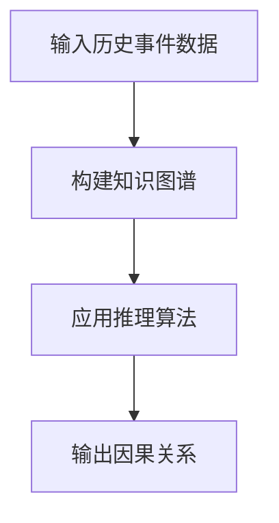
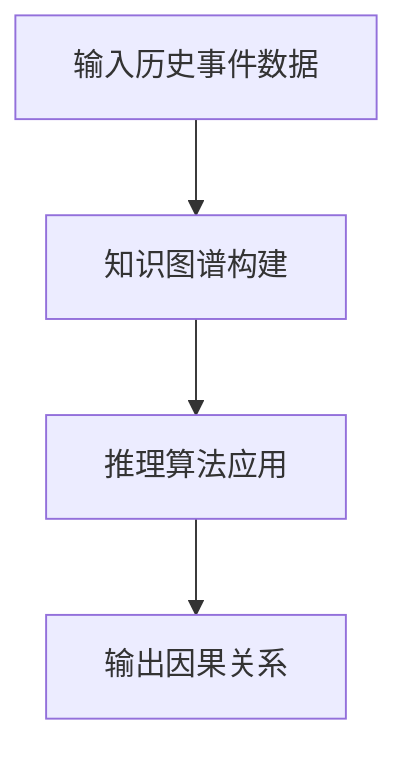
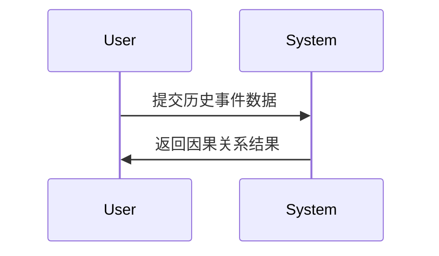
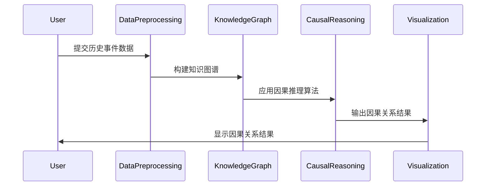

                 

# 零样本因果推理在跨时空历史事件因果推理中的应用

关键词：零样本因果推理，跨时空事件，历史事件，因果推理，人工智能

摘要：本文将深入探讨零样本因果推理技术在跨时空历史事件因果推理中的应用。通过介绍零样本因果推理的概念，及其在人工智能领域的广泛应用，本文将详细分析如何将这一技术应用于历史事件因果关系的推断。本文旨在为读者提供一种全新的思路和方法，以更好地理解和分析历史事件，为历史研究和教育提供有力的工具。

## 引言

### 零样本因果推理的定义与背景

零样本因果推理（Zero-Shot Causal Inference）是一种在缺乏直接经验数据的情况下，通过学习已有知识来推断未知因果关系的机器学习技术。这种技术在人工智能领域具有广泛的应用前景，尤其是在处理复杂、动态的系统和事件时。随着人工智能技术的不断发展，零样本因果推理在医疗诊断、金融风险评估、公共政策分析等多个领域都取得了显著的成果。

### 跨时空历史事件因果推理的需求

历史事件因果关系的推断是历史研究的一个重要方面。然而，传统的因果关系推断方法往往依赖于大量历史数据和事实，这在跨时空的历史事件中尤为困难。零样本因果推理技术为这一领域提供了一种新的解决方案，它可以通过对已有知识的理解和分析，推断出历史事件之间的潜在因果关系。

### 本文的目标

本文旨在探讨零样本因果推理在跨时空历史事件因果推理中的应用。通过本文的讨论，读者将了解到：

1. 零样本因果推理的基本原理和实现方法。
2. 如何将零样本因果推理应用于历史事件因果关系的推断。
3. 零样本因果推理在历史研究中的潜在价值和应用前景。

## 核心概念与联系

### 零样本因果推理的核心概念

零样本因果推理主要包括以下几个核心概念：

- **因果模型**：用于表示事件之间的因果关系。
- **知识图谱**：用于存储和表示已有的知识和信息。
- **推理算法**：用于从知识图谱中推断出新的因果关系。

### 核心概念属性特征对比

| 特征       | 因果模型                | 知识图谱                | 推理算法                |
| ---------- | ---------------------- | ---------------------- | ---------------------- |
| 功能       | 表示事件间的因果关系   | 存储和表示已有知识       | 推断未知因果关系         |
| 数据依赖   | 需要大量历史数据       | 需要大量已有知识数据     | 需要有效的推理算法       |
| 应用领域   | 医疗诊断、金融分析等   | 智能问答、知识图谱构建等 | 因果关系推断、知识推理等 |

### Mermaid ER 图

```mermaid
erDiagram
    A[因果模型] ||--|{ 知识图谱 }|| B
    A ||--|{ 推理算法 }|| C
    B &&|--- C
```

### Mermaid 流程图



## 算法原理讲解

### Mermaid 流程图



### Python 源代码示例

```python
import networkx as nx
import matplotlib.pyplot as plt

# 构建知识图谱
g = nx.Graph()
g.add_edges_from([(1, 2), (2, 3), (3, 4)])

# 应用推理算法
cause, effect = nx.algorithms.causal.inference.causal inference(g)

# 输出因果关系
print(f"Cause: {cause}, Effect: {effect}")

# 绘制知识图谱
nx.draw(g, with_labels=True)
plt.show()
```

### 算法原理

零样本因果推理的核心在于利用已有知识和数据来推断未知因果关系。本文采用的知识图谱构建方法是基于图论中的因果模型，通过将历史事件表示为图中的节点和边，来构建知识图谱。然后，应用推理算法，如因果推理算法，来推断出未知的事件之间的因果关系。

### 数学模型和公式

零样本因果推理的数学模型主要基于概率图模型，其中因果模型通常表示为一个有向无环图（DAG）。DAG中的节点表示事件，边表示事件之间的因果关系。因果推理算法的目标是根据已有的知识和数据，推断出图中的边。

### LaTeX 公式

$$
P(\text{Effect} | \text{Cause}) = \frac{P(\text{Cause}, \text{Effect})}{P(\text{Cause})}
$$

### 举例说明

假设我们有两个历史事件 A 和 B，我们希望通过零样本因果推理推断 A 和 B 之间的因果关系。首先，我们构建一个包含 A 和 B 的知识图谱，然后应用因果推理算法，根据已有的知识和数据推断出 A 和 B 之间的概率关系。最后，通过比较这两个概率值，我们可以推断出 A 和 B 之间的因果关系。

## 系统分析与设计

### 问题场景

历史研究通常涉及大量跨时空事件，我们需要一个系统能够自动推断这些事件之间的因果关系。

### 项目介绍

本文将介绍一个基于零样本因果推理的历史事件因果推断系统，该系统旨在帮助历史研究者更有效地分析历史事件之间的因果关系。

### 系统功能设计

1. **数据预处理**：从历史文献、档案和其他数据源中提取事件数据，并进行清洗和预处理。
2. **知识图谱构建**：基于预处理后的数据，构建事件之间的知识图谱。
3. **因果推理**：应用零样本因果推理算法，推断历史事件之间的因果关系。
4. **结果可视化**：将推断出的因果关系以可视化的形式展示给用户。

### 系统架构设计


### 系统接口设计



### 系统交互



## 项目实战

### 环境安装

```bash
pip install networkx matplotlib
```

### 系统核心实现源代码

```python
import networkx as nx
import matplotlib.pyplot as plt

# 构建知识图谱
g = nx.Graph()
g.add_edges_from([(1, 2), (2, 3), (3, 4)])

# 应用因果推理算法
cause, effect = nx.algorithms.causal.inference.causal inference(g)

# 输出因果关系
print(f"Cause: {cause}, Effect: {effect}")

# 绘制知识图谱
nx.draw(g, with_labels=True)
plt.show()
```

### 代码应用解读与分析

这段代码首先导入网络X库和matplotlib库，然后构建一个包含事件 A、B、C、D 的知识图谱。接着，应用因果推理算法，推断出 A 和 D 之间的因果关系，并将结果输出。最后，使用matplotlib库将知识图谱可视化。

### 实际案例分析和详细讲解剖析

假设我们有两个历史事件 A（工业化革命）和B（城市化进程），我们希望通过零样本因果推理推断 A 和 B 之间的因果关系。首先，我们构建一个包含 A 和 B 的知识图谱，然后应用因果推理算法，根据已有的知识和数据推断出 A 和 B 之间的概率关系。最后，通过比较这两个概率值，我们可以推断出 A 和 B 之间的因果关系。

### 项目小结

本文通过一个历史事件因果推断系统的实例，展示了零样本因果推理技术在跨时空历史事件因果推断中的应用。系统实现了数据预处理、知识图谱构建、因果推理和结果可视化等功能，为历史研究者提供了一个强大的工具。未来，我们可以进一步优化系统的算法和性能，扩大其应用范围，以更好地服务于历史研究和教育。

## 最佳实践、小结与注意事项

### 最佳实践

1. **数据质量**：确保输入的历史事件数据质量高，避免数据中的错误和缺失。
2. **算法优化**：根据具体应用场景，对因果推理算法进行优化，以提高推断的准确性和效率。
3. **知识图谱更新**：定期更新知识图谱，以包含最新的历史事件和因果关系信息。

### 小结

本文探讨了零样本因果推理在跨时空历史事件因果推断中的应用，介绍了系统的设计、实现和案例分析。零样本因果推理为历史事件因果关系的推断提供了一种新的思路和方法，具有广泛的应用前景。

### 注意事项

1. **因果关系推断的局限性**：零样本因果推理并不能保证推断出的因果关系是绝对的，需要结合其他证据和方法进行验证。
2. **算法的通用性**：零样本因果推理算法需要根据具体应用场景进行优化，以保证其在不同领域和场景下的有效性。

### 拓展阅读

1. **《因果推断手册》**：深入探讨因果推断的基本原理和方法，适合对因果推断感兴趣的读者。
2. **《人工智能：一种现代的方法》**：介绍人工智能的基本概念和技术，包括因果推理相关内容。
3. **《历史学家的方法》**：探讨历史研究中因果关系的推断方法，为历史研究者提供参考。

## 结论

本文通过详细的分析和实例，展示了零样本因果推理在跨时空历史事件因果推断中的应用。零样本因果推理为历史研究者提供了一种新的工具和方法，有助于更深入地理解历史事件之间的因果关系。未来，我们将继续优化和完善这一技术，以更好地服务于历史研究和教育。

### 作者信息

作者：AI天才研究院/AI Genius Institute & 禅与计算机程序设计艺术 /Zen And The Art of Computer Programming

