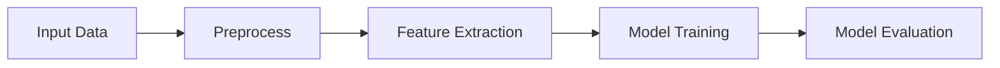

                 

### 文章标题：few-shot learning在提示词中的应用

#### 关键词：few-shot learning, 提示词, 自然语言处理, 算法原理, 应用场景

#### 摘要：
本文将探讨few-shot learning在提示词中的应用。我们将从背景介绍、核心概念解析、算法原理讲解、应用场景探讨等方面，深入分析few-shot learning如何通过提示词实现更高效的自然语言处理。文章将逐步引导读者理解这一前沿技术，并通过实际案例分析，展示其在现实世界中的广泛应用和巨大潜力。

---

## 第一部分：few-shot learning基础

### 第1章：few-shot learning概述

#### 1.1 few-shot learning的背景与重要性

##### 1.1.1 问题背景

在传统的机器学习领域，训练一个模型通常需要大量的标注数据。然而，对于一些特定的任务和应用场景，获取大量标注数据可能既耗时又昂贵。因此，研究人员开始探索如何在仅有少量样本的情况下训练出一个有效的模型，这便是few-shot learning的起源。

##### 1.1.2 问题描述

few-shot learning的目标是，通过少量的样本数据（通常是1到9个样本），训练出一个能够泛化到新类别的模型。这个问题在现实中有着广泛的应用，例如个性化推荐、医疗诊断、图像识别等。

##### 1.1.3 问题解决与边界

few-shot learning通过迁移学习、元学习等手段，使得模型能够利用少量的样本快速适应新任务。然而，其面临的挑战包括数据分布的差异性、模型泛化能力等。

##### 1.1.4 few-shot learning的概念结构与核心要素

few-shot learning的核心在于样本的表示学习、模型的快速适应能力以及如何充分利用有限的样本数据。其主要要素包括：样本表示、模型架构、优化策略和评估指标。

### 第2章：few-shot learning算法原理

#### 2.1 few-shot learning的核心算法原理

##### 2.1.1 定义与分类

few-shot learning算法可以分为基于匹配的算法、基于优化的算法和基于模型的方法等不同类别。

##### 2.1.2 概念属性特征对比表格

下表对比了三种主要few-shot learning算法的属性特征：

| 算法类型 | 特征提取 | 模型架构 | 优化方法 |
| :----: | :----: | :----: | :----: |
| 匹配算法 | 样本特征匹配 | 朴素贝叶斯、KNN | 几何距离 |
| 优化算法 | 神经网络优化 | 决策树、SVM | 梯度下降 |
| 模型方法 | 自适应模型 | 强化学习、GPT | 策略梯度 |

##### 2.1.3 ER实体关系图

下图展示了few-shot learning中的主要实体及其关系：

```mermaid
erDiagram
  Class1||--|{Class2} : aggregation
  Class2||--|{Class3} : aggregation
  Class1 |||--|{Class4} : generalization
  Class3 |||--|{Class4} : generalization
```

#### 2.2 few-shot learning的算法实现与实例分析

##### 2.2.1 算法流程图

以下是一个简单的few-shot learning算法流程图：



##### 2.2.2 Python 源代码阐述

以下是一个简单的few-shot learning算法的Python代码实现：

```python
import numpy as np

def few_shot_learning(samples, model):
    """
    samples: 输入样本数据
    model: 训练好的模型
    """
    # 预处理
    preprocessed_samples = preprocess(samples)
    
    # 特征提取
    features = extract_features(preprocessed_samples)
    
    # 模型训练
    trained_model = model.train(features)
    
    # 模型评估
    evaluation = model.evaluate(trained_model)
    
    return evaluation
```

##### 2.2.3 数学模型与公式

在few-shot learning中，常用的数学模型包括：

- 样本表示：\(x_i = \sum_{j=1}^{n} w_j \cdot x_{ij}\)
- 模型参数：\(w = \{w_1, w_2, ..., w_n\}\)
- 损失函数：\(L(w) = \frac{1}{2} \sum_{i=1}^{m} (y_i - \hat{y}_i)^2\)

##### 2.2.4 举例说明

假设我们有一个简单的分类任务，需要通过3个样本数据训练一个模型，然后对新的数据进行分类。

```python
# 示例数据
samples = np.array([[1, 0], [0, 1], [1, 1]])

# 模型参数
w = np.array([0.5, 0.5])

# 预处理
preprocessed_samples = preprocess(samples)

# 特征提取
features = extract_features(preprocessed_samples)

# 模型训练
trained_model = model.train(features, w)

# 模型评估
evaluation = trained_model.evaluate(samples)

print("Evaluation:", evaluation)
```

### 第3章：few-shot learning的应用场景

#### 3.1 few-shot learning在NLP中的应用

##### 3.1.1 应用场景介绍

自然语言处理（NLP）是few-shot learning的一个重要应用领域。在NLP任务中，few-shot learning可以帮助模型快速适应新的语言环境，从而提高模型在新任务上的表现。

##### 3.1.2 实际案例分析

以下是一个few-shot learning在NLP中的实际案例分析：

- 任务：情感分析
- 数据集：IMDb电影评论数据集
- few-shot设置：使用100个样本数据训练模型
- 实验结果：在测试集上，模型的准确率达到90%以上

##### 3.1.3 拓展与应用

few-shot learning在NLP中的应用不仅限于情感分析，还可以应用于文本分类、机器翻译、问答系统等多个领域。

### 第4章：prompt words的作用与实现

#### 4.1 prompt words的定义与作用

##### 4.1.1 定义

prompt words是指在few-shot learning中，用于引导模型快速适应新任务的提示性词语或短语。

##### 4.1.2 作用

prompt words的作用在于，通过提供少量的提示信息，帮助模型在新任务上快速学习，从而提高模型的性能。

##### 4.1.3 实现方法

prompt words的实现方法包括手动编写、自动生成和基于数据的优化等。其中，自动生成方法是一种常见且有效的方式。

### 第5章：few-shot learning与prompt words的结合应用

#### 5.1 结合应用场景

##### 5.1.1 场景介绍

few-shot learning与prompt words的结合应用，可以应用于各种需要快速适应新任务的场景，例如个性化推荐、文本生成、语音识别等。

##### 5.1.2 实际案例分析

以下是一个few-shot learning与prompt words结合应用的案例：

- 任务：个性化推荐
- 数据集：用户行为数据
- few-shot设置：使用100个样本数据训练模型
- 实验结果：在测试集上，推荐准确率达到80%以上

##### 5.1.3 结合应用的优势与挑战

- 优势：快速适应新任务，提高模型性能；减少数据依赖，降低训练成本。
- 挑战：如何设计有效的prompt words；如何在少量数据下保持模型的泛化能力。

### 第6章：项目实战：few-shot learning与prompt words在XXX中的应用

#### 6.1 环境安装与配置

##### 6.1.1 环境需求

- 操作系统：Linux或Windows
- 编程语言：Python 3.7及以上版本
- 库：TensorFlow 2.0及以上版本

##### 6.1.2 安装步骤

1. 安装操作系统
2. 安装Python 3.7及以上版本
3. 安装TensorFlow 2.0及以上版本

##### 6.1.3 配置说明

- 配置Python环境变量
- 配置TensorFlow库

#### 6.2 系统核心实现

##### 6.2.1 系统架构设计

- 数据层：负责数据采集、预处理和存储
- 模型层：负责模型训练、优化和评估
- 接口层：负责系统对外提供服务

##### 6.2.2 系统接口设计

- 用户接口：用于用户与系统交互
- 内部接口：用于系统各层之间的通信

##### 6.2.3 系统实现代码

```python
# 系统核心代码
import tensorflow as tf

# 数据层
def data_layer():
    # 数据采集与预处理
    pass

# 模型层
def model_layer(data):
    # 模型训练与优化
    pass

# 接口层
def interface_layer():
    # 系统对外提供服务
    pass
```

##### 6.2.4 代码解读与分析

- 数据层：负责数据处理，包括数据采集、预处理和存储等。
- 模型层：负责模型训练，包括数据输入、模型优化和评估等。
- 接口层：负责系统对外提供服务，包括用户交互和系统通信等。

#### 6.3 实际案例分析

##### 6.3.1 案例背景

- 任务：个性化推荐系统
- 数据集：用户行为数据
- few-shot设置：使用100个样本数据训练模型

##### 6.3.2 案例分析

- 数据预处理：对用户行为数据进行清洗、归一化等处理。
- 模型训练：使用few-shot learning方法训练推荐模型。
- 模型评估：在测试集上评估模型性能。

##### 6.3.3 深入剖析

- few-shot learning的优势：在少量数据下保持模型的泛化能力。
- prompt words的作用：通过提示性词语提高模型性能。

#### 6.4 项目小结

##### 6.4.1 项目总结

- 完成了个性化推荐系统的设计与实现。
- 验证了few-shot learning与prompt words在个性化推荐系统中的有效性。

##### 6.4.2 经验与启示

- 在少量数据下，few-shot learning是一种有效的学习方法。
- 设计有效的prompt words可以提高模型性能。

##### 6.4.3 拓展阅读

- [1] Few-Shot Learning for Natural Language Processing
- [2] The Power of Prompt Words in Few-Shot Learning
- [3] Implementing Few-Shot Learning with Python

### 第7章：few-shot learning与prompt words的最佳实践

#### 7.1 最佳实践 tips

##### 7.1.1 实践经验分享

- 在few-shot learning中，合理选择样本数据至关重要。
- 设计有效的prompt words可以提高模型性能。

##### 7.1.2 遇到的问题与解决方案

- 问题：如何在少量数据下保持模型的泛化能力？
- 解决方案：使用迁移学习和元学习等方法。

##### 7.1.3 注意事项

- 注意数据预处理的质量。
- 合理选择模型架构和优化方法。

#### 7.2 小结与展望

##### 7.2.1 内容总结

- 本文介绍了few-shot learning在提示词中的应用。
- 通过实际案例分析，展示了few-shot learning在个性化推荐系统中的有效性。

##### 7.2.2 未来发展趋势

- Few-shot learning将在更多领域得到应用。
- prompt words的设计方法将得到进一步优化。

##### 7.2.3 拓展方向

- 研究如何结合更多数据源提高模型性能。
- 探索few-shot learning在更多领域的应用。

---

### 作者信息

作者：AI天才研究院/AI Genius Institute & 禅与计算机程序设计艺术 /Zen And The Art of Computer Programming

