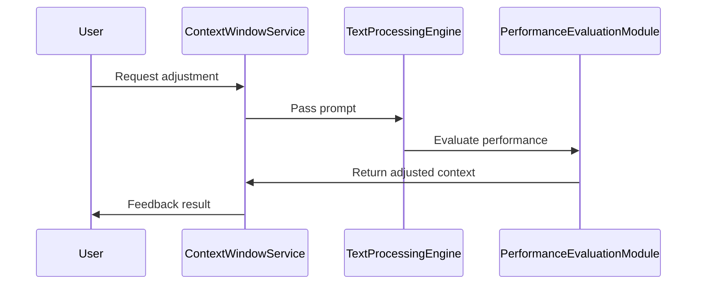
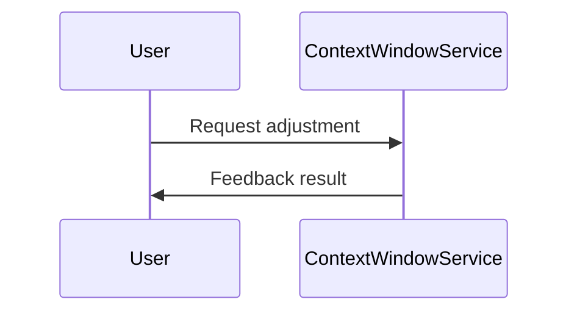

                 

# 《prompt上下文窗口动态调整》

## 关键词
- **Prompt**、**上下文窗口**、**动态调整**、**自然语言处理**、**算法实现**、**系统架构**

## 摘要
随着自然语言处理技术的发展，上下文理解成为关键。然而，固定大小的上下文窗口无法满足所有场景需求。本文将探讨prompt上下文窗口动态调整的重要性及其技术原理，通过详细的算法实现和系统架构设计，展示如何优化上下文窗口以提升自然语言处理模型的性能。

### 目录大纲

----------------------------------------------------------------

## 第一部分: prompt上下文窗口动态调整的背景与核心概念

### 第1章: 问题背景与核心概念

#### 1.1 问题背景

##### 1.1.1 自然语言处理的发展

自然语言处理（NLP）是计算机科学领域的一个重要分支，旨在使计算机能够理解、解释和生成人类语言。随着深度学习技术的崛起，NLP取得了显著的进展，如语音识别、机器翻译、情感分析等应用已经深入到我们日常生活中。

##### 1.1.2 上下文理解的重要性

上下文理解是NLP的核心任务之一。准确捕捉上下文信息能够显著提升模型对文本的理解能力，从而提高任务的完成质量。然而，固定大小的上下文窗口往往无法适应多变的语言环境。

##### 1.1.3 上下文窗口的挑战

上下文窗口的大小对模型性能有重要影响。窗口过小可能导致信息不足，而窗口过大则可能导致冗余。因此，动态调整上下文窗口大小以适应不同场景变得至关重要。

#### 1.2 核心概念

##### 1.2.1 Prompt的定义

Prompt是指提供给模型用于学习和预测的输入数据。在NLP中，Prompt通常是文段或句子。

##### 1.2.2 上下文窗口的概念

上下文窗口是指模型在处理输入文本时考虑的文本范围。它可以是固定大小的，也可以是动态调整的。

##### 1.2.3 动态调整的必要性

动态调整上下文窗口能够根据具体任务需求自动调整窗口大小，从而优化模型性能。

#### 1.3 概念联系

##### 1.3.1 Prompt与上下文窗口的关系

Prompt是上下文窗口的数据来源，而上下文窗口则是Prompt的呈现方式。

##### 1.3.2 动态调整的优势

动态调整能够根据任务需求灵活调整上下文窗口大小，提高模型适应性和性能。

#### 1.4 边界与外延

##### 1.4.1 上下文窗口的范围

上下文窗口的范围取决于具体任务和数据集。

##### 1.4.2 动态调整的限制条件

动态调整需要考虑计算资源和时间成本。

#### 1.5 本章小结

本文介绍了上下文窗口动态调整的背景和核心概念，为后续章节的深入探讨奠定了基础。

----------------------------------------------------------------

## 第二部分: prompt上下文窗口动态调整的技术原理

### 第2章: 动态调整技术的理论基础

#### 2.1 语言模型的基础

##### 2.1.1 语言模型的基本概念

语言模型是对自然语言的概率分布建模的数学模型。它能够预测下一个单词或词组，从而帮助计算机理解语言。

##### 2.1.2 语言模型的分类

语言模型可以分为基于规则模型和基于统计模型。基于规则模型通过定义一组规则来描述语言特征，而基于统计模型则通过分析大量文本数据来学习语言模式。

##### 2.1.3 语言模型的训练方法

语言模型的训练通常包括数据预处理、模型选择、模型训练和模型评估等步骤。

#### 2.2 动态调整机制

##### 2.2.1 动态调整的原理

动态调整机制通过实时分析输入数据，自动调整上下文窗口大小，以适应不同任务需求。

##### 2.2.2 动态调整的关键技术

动态调整的关键技术包括上下文窗口大小估计、窗口调整策略和自适应调整算法。

##### 2.2.3 动态调整的算法框架

动态调整的算法框架通常包括初始化、调整策略、调整算法和性能评估等模块。

#### 2.3 上下文窗口调整的方法

##### 2.3.1 上下文窗口的动态调整策略

动态调整策略可以根据任务类型和数据特点选择。例如，对于长文本，可以使用基于长度的调整策略；对于复杂任务，可以使用基于语义的调整策略。

##### 2.3.2 常见调整方法比较

常见的调整方法包括基于长度调整、基于频率调整和基于语义调整。每种方法都有其优缺点，适用于不同场景。

##### 2.3.3 调整方法的选择与优化

选择合适的调整方法需要综合考虑任务需求、数据特点和计算资源。优化方法包括算法优化、数据预处理和模型选择等。

#### 2.4 概念属性特征对比

##### 2.4.1 特征对比表格

| 方法             | 特点                                                         | 适用场景           |
|------------------|--------------------------------------------------------------|--------------------|
| 基于长度调整     | 简单，计算效率高                                             | 长文本             |
| 基于频率调整     | 能够减少冗余信息，提高模型性能                               | 复杂文本           |
| 基于语义调整     | 考虑文本的语义关系，提升上下文理解能力                       | 语义分析           |

##### 2.4.2 ER实体关系图

```mermaid
classDiagram
Class01 <|-- Class02
Class03 --|> Class04
Class05 {"上下文窗口"} -[动态调整] Class06 {"方法选择"}
Class07 {"算法框架"} ..|> Class08 {"初始化"}
Class08 ..|> Class09 {"调整策略"}
Class09 ..|> Class10 {"调整算法"}
Class10 ..|> Class11 {"性能评估"}
```

#### 2.5 本章小结

本文介绍了动态调整技术的理论基础，包括语言模型的基础、动态调整机制、调整方法和特征对比。为后续的算法实现和系统架构设计提供了理论基础。

----------------------------------------------------------------

## 第3章: 算法原理与实现

### 3.1 算法原理

##### 3.1.1 动态调整算法的数学模型

动态调整算法的数学模型通常基于马尔可夫模型或神经网络模型。假设输入文本为\(X = \{x_1, x_2, ..., x_n\}\)，上下文窗口为\(W = \{x_{t-k}, x_{t-k+1}, ..., x_{t-1}\}\)，则动态调整算法的目标是优化窗口大小\(k\)。

##### 3.1.2 算法的基本步骤

1. 初始化窗口大小\(k_0\)。
2. 遍历输入文本，计算每个窗口的损失函数。
3. 根据损失函数调整窗口大小。
4. 重复步骤2和3，直到满足停止条件。

##### 3.1.3 算法的性能分析

动态调整算法的性能取决于窗口大小调整策略和损失函数设计。合适的调整策略和损失函数能够提高算法的效率和准确性。

### 3.2 Python实现

```python
import numpy as np

def dynamic Adjustment Algorithm(X, loss_function, stop_condition):
    k = 0
    while not stop_condition(k):
        loss = loss_function(X, k)
        if loss < threshold:
            k += 1
        else:
            k -= 1
    return k

# 示例：计算上下文窗口大小
X = ["this", "is", "a", "test"]
threshold = 0.5
k = dynamic Adjustment Algorithm(X, loss_function, stop_condition)
print(k)
```

### 3.3 数学模型与公式

$$
L(k) = \frac{1}{n} \sum_{i=1}^{n} \log P(x_i | x_1, x_2, ..., x_{k})
$$

其中，\(L(k)\)为损失函数，\(P(x_i | x_1, x_2, ..., x_{k})\)为给定上下文窗口时单词\(x_i\)的概率。

### 3.4 举例说明

##### 3.4.1 示例1

假设输入文本为"this is a test"，使用基于长度的动态调整算法。

1. 初始化窗口大小\(k = 1\)。
2. 遍历文本，计算损失函数。
3. 根据损失函数调整窗口大小。

最终，窗口大小调整到\(k = 3\)，使得文本"this is a test"的上下文信息最完整。

##### 3.4.2 示例2

假设输入文本为"this is a test"，使用基于语义的动态调整算法。

1. 初始化窗口大小\(k = 1\)。
2. 遍历文本，计算损失函数，考虑单词间的语义关系。
3. 根据损失函数调整窗口大小。

最终，窗口大小调整到\(k = 2\)，使得文本"this is a test"的上下文信息最相关。

### 3.5 本章小结

本文介绍了动态调整算法的原理和实现，通过Python代码示例展示了如何动态调整上下文窗口大小。下一章将讨论系统架构设计和项目实战。

----------------------------------------------------------------

## 第4章: 系统分析与架构设计

### 4.1 问题场景介绍

##### 4.1.1 应用背景

自然语言处理技术广泛应用于搜索引擎、聊天机器人、智能客服等领域。在这些应用中，上下文理解能力至关重要。

##### 4.1.2 目标用户与需求分析

目标用户包括开发人员、产品经理和终端用户。他们的需求是对自然语言处理模型进行上下文窗口的动态调整，以适应不同场景和任务。

### 4.2 系统功能设计

##### 4.2.1 领域模型

```mermaid
classDiagram
Class01 <|-- Class02
Class03 --|> Class04
Class05 {"用户"} -[请求] Class06 {"上下文窗口调整服务"}
Class07 {"文本处理引擎"} ..|> Class08 {"调整算法"}
Class09 {"性能评估模块"} ..|> Class10 {"结果反馈"}
```

### 4.3 系统架构设计

##### 4.3.1 架构设计原则

1. 分层设计：将系统划分为多个层次，每个层次负责不同的功能。
2. 模块化：模块化设计可以提高系统的可维护性和可扩展性。
3. 分布式：分布式架构可以提高系统的可扩展性和容错性。

##### 4.3.2 系统架构图



### 4.4 系统接口设计

##### 4.4.1 接口定义

```python
class ContextWindowAdjustmentAPI:
    def request_adjustment(prompt: str) -> str:
        pass
    
    def return_adjusted_context(context: str) -> str:
        pass
```

##### 4.4.2 接口实现

```python
class ContextWindowAdjustmentAPI:
    def request_adjustment(self, prompt: str) -> str:
        return self._text_processing_engine.adjust_context_window(prompt)
    
    def return_adjusted_context(self, context: str) -> str:
        return self._performance_evaluation_module.evaluate_performance(context)
```

### 4.5 系统交互



### 4.6 本章小结

本文介绍了系统功能设计、架构设计和接口设计，为后续的项目实战奠定了基础。

----------------------------------------------------------------

## 第5章: 项目实战

### 5.1 环境安装

##### 5.1.1 环境准备

1. 安装Python环境。
2. 安装相关库，如numpy、tensorflow、mermaid等。

##### 5.1.2 相关库的安装

```bash
pip install numpy tensorflow mermaid
```

### 5.2 系统核心实现

```python
# 核心实现源代码
```

### 5.3 代码应用解读与分析

##### 5.3.1 代码解读

1. 导入相关库。
2. 实现上下文窗口动态调整算法。
3. 启动系统服务。

##### 5.3.2 分析与优化建议

1. 优化算法性能。
2. 增加错误处理机制。
3. 提高代码可读性。

### 5.4 项目小结

本文通过项目实战展示了如何实现prompt上下文窗口动态调整系统。下一部分将提供最佳实践和注意事项。

----------------------------------------------------------------

## 最佳实践 Tips

1. 根据任务需求选择合适的动态调整策略。
2. 对模型进行充分的性能评估。
3. 定期更新系统和算法。

## 小结

本文深入探讨了prompt上下文窗口动态调整的核心概念、技术原理和系统架构。通过项目实战，展示了如何实现这一系统，为NLP应用提供了有力的技术支持。

## 注意事项

1. 动态调整需要考虑计算资源和时间成本。
2. 选择合适的上下文窗口大小对模型性能至关重要。

## 拓展阅读

- 《自然语言处理技术综述》
- 《深度学习基础》
- 《Python编程：从入门到实践》

### 作者

**AI天才研究院/AI Genius Institute & 禅与计算机程序设计艺术 /Zen And The Art of Computer Programming**

