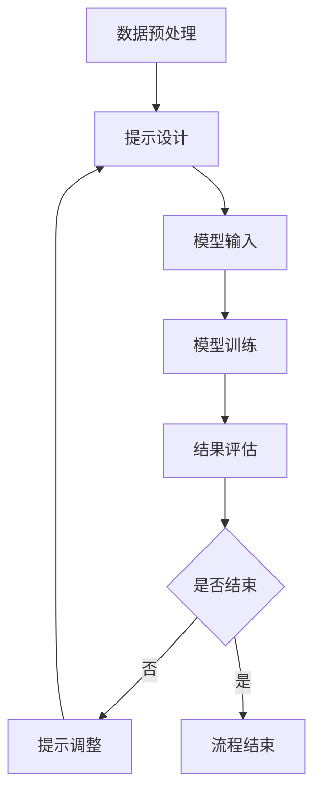
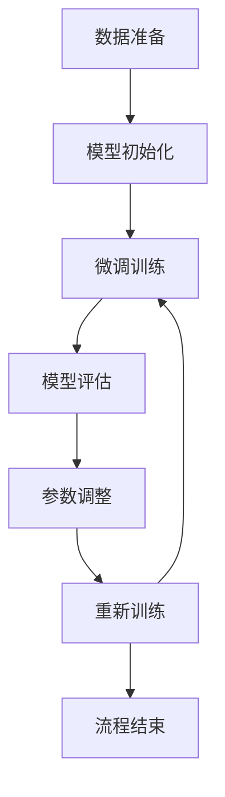
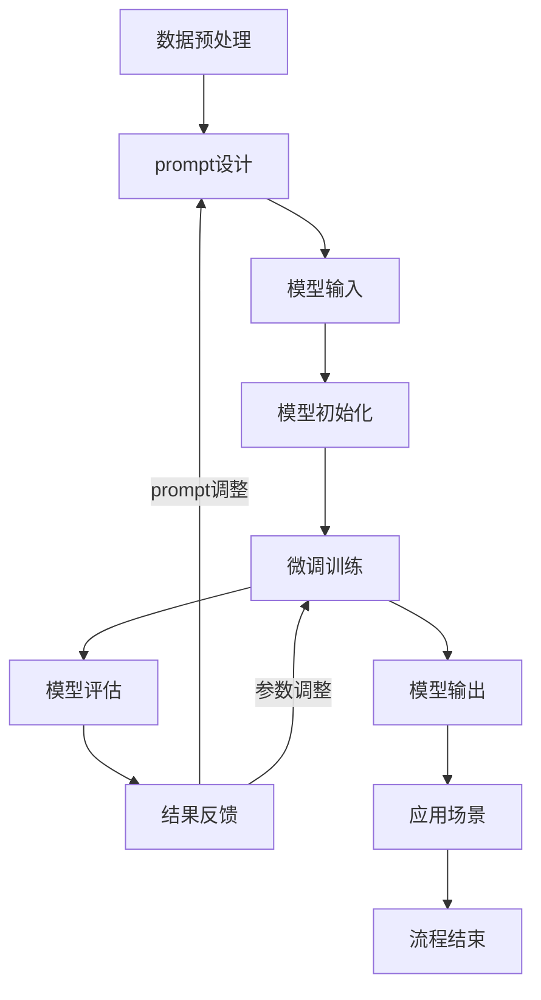
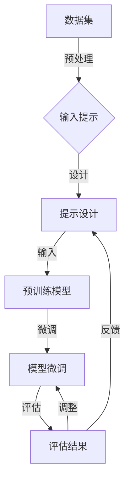
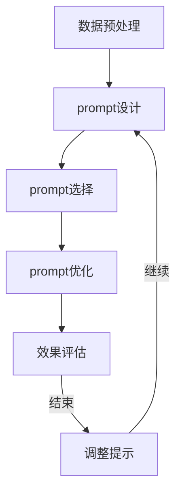
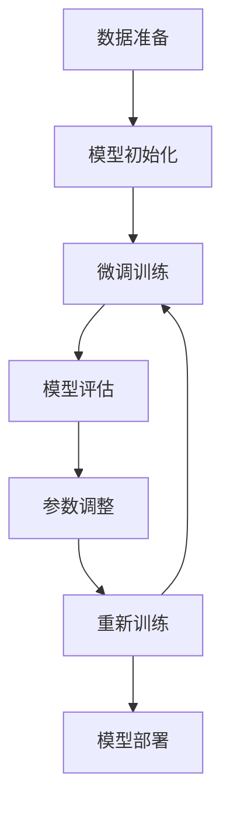
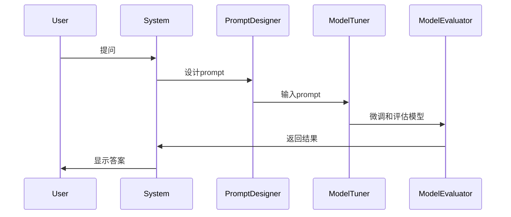

                 

# 《prompt优化与模型微调的协同策略》

关键词：prompt优化、模型微调、协同策略、人工智能、机器学习

摘要：
本文旨在深入探讨prompt优化与模型微调在人工智能领域的协同策略。首先，我们将回顾背景知识，包括prompt和模型微调的基本概念及其在人工智能中的应用。接着，我们将详细分析两者的核心原理、属性特征以及相互关系。本文还将通过ER实体关系图和算法原理讲解，揭示协同策略的实施方法和效果评估。最后，我们将通过实际案例和系统架构设计，展示协同策略的最佳实践，以期为人工智能领域的实践者提供有价值的参考。

## 第一部分：背景与基础

### 1.1.1 计算机技术的发展与prompt的重要性

计算机技术的发展经历了几个关键阶段，从早期的基础硬件和操作系统发展到现代的高级算法和深度学习，每一个阶段都为人工智能的发展奠定了基础。在当前的人工智能时代，数据处理和分析成为核心任务，而prompt（提示）技术在这一过程中起到了至关重要的作用。

Prompt技术起源于自然语言处理（NLP）领域，旨在通过简洁明了的提示来引导模型生成期望的输出。随着深度学习模型的广泛应用，prompt技术的重要性愈发凸显。一个优秀的prompt可以极大地提升模型的性能和效率，使其能够更准确地理解和生成文本、图像、语音等多模态数据。

在计算机视觉、自然语言处理和语音识别等领域，prompt技术被广泛应用于图像分类、文本生成、语音识别等任务中。例如，在图像分类任务中，prompt可以帮助模型更好地理解图像内容，从而提高分类的准确性；在文本生成任务中，prompt可以引导模型生成符合预期风格和主题的文本；在语音识别任务中，prompt可以帮助模型更好地理解说话人的意图和语言环境。

总之，prompt技术在人工智能领域的应用不仅提升了模型的性能，还提高了数据处理和分析的效率，使得人工智能系统能够更好地适应复杂多变的应用场景。

### 1.1.2 模型微调的概念及其在人工智能中的应用

模型微调（Model Fine-tuning）是深度学习领域中一种重要的技术手段，旨在通过调整预训练模型在特定任务上的参数，以提高其在特定领域或任务中的性能。模型微调的基本思想是将大规模的预训练模型迁移到具体任务中，利用任务特定的数据对模型进行微调，从而提升模型在特定任务上的适应性和准确性。

模型微调在人工智能中的应用非常广泛。首先，在计算机视觉领域，模型微调被广泛应用于图像分类、目标检测、图像分割等任务。通过在预训练模型的基础上进行微调，模型能够更好地适应特定领域的图像数据，从而提高分类和检测的准确性。例如，在医学图像分析中，预训练的卷积神经网络（CNN）可以通过模型微调来识别各种疾病，如肺癌、乳腺癌等。

其次，在自然语言处理领域，模型微调同样发挥了重要作用。预训练的模型如BERT、GPT等在大规模语料库上进行训练，已经具备了较强的语言理解和生成能力。通过在特定领域或任务上进行微调，这些模型可以更好地适应特定的文本数据，从而提高文本分类、问答系统和机器翻译等任务的性能。例如，在法律文本分析中，预训练模型可以通过微调来识别合同中的关键条款和潜在风险。

此外，模型微调还在语音识别、推荐系统、游戏AI等领域得到了广泛应用。通过在预训练模型的基础上进行微调，模型可以更好地理解特定领域的数据和任务，从而提升系统的整体性能和用户体验。

总之，模型微调作为深度学习领域中的一种关键技术，通过将预训练模型迁移到具体任务中进行调整，显著提升了模型在特定领域或任务中的性能和适应性，为人工智能的发展和应用提供了有力支持。

### 1.1.3 prompt优化与模型微调的关系

prompt优化与模型微调在人工智能领域中都是关键的技术手段，它们各自独立发挥作用，但又在实际应用中紧密关联，共同推动着人工智能的发展。首先，我们需要理解两者的基本原理和目标。

prompt优化主要关注如何通过设计更为精准和有效的提示来引导模型生成期望的输出。一个优秀的prompt不仅可以提升模型的性能和效率，还能使其在处理复杂任务时更加准确和稳定。而模型微调则侧重于通过调整模型参数，使其在特定任务上具备更好的泛化能力和适应性。微调过程通常基于预训练模型，通过对任务特定数据的学习，逐步优化模型的结构和参数。

两者之间的关系可以从以下几个方面来理解：

1. **协同提升性能**：prompt优化和模型微调共同作用，可以显著提升人工智能系统的整体性能。优秀的prompt能够引导模型更好地理解和处理任务，而微调则在此基础上进一步调整模型的参数，使其在特定任务上表现更佳。

2. **优化路径互补**：prompt优化侧重于提升模型对任务的理解，而模型微调则侧重于调整模型的参数以实现更好的适应。两者在优化路径上互补，共同构建了一个更为高效的模型训练过程。

3. **相互依赖**：在实际应用中，prompt优化和模型微调往往相互依赖，互为条件。一个有效的prompt能够提高微调过程的效率，而微调后的模型性能的提升又能反过来优化prompt的设计。

4. **动态调整**：prompt优化和模型微调不是静态的过程，而是需要动态调整和优化的。在实际应用中，通过不断调整prompt和微调策略，可以逐步优化模型的性能，达到最佳的效果。

因此，prompt优化与模型微调的协同策略在人工智能领域具有重要意义。通过两者的有机结合，可以构建出一个高效、灵活的人工智能系统，使其在多种任务和应用场景中表现出色。这种协同策略不仅提升了模型的性能，还为人工智能技术的发展提供了新的思路和方法。

### 1.1.4 问题解决：协同策略的必要性

在人工智能领域，尽管prompt优化和模型微调各自具有显著优势，但它们在实际应用中仍然面临一些挑战。首先，prompt设计复杂，需要深入理解任务背景和数据特性，而一个不当的prompt可能导致模型训练过程低效甚至失败。其次，模型微调过程依赖于大量任务特定数据，但数据质量和数量往往不足，导致微调效果不理想。这些问题单独解决难度较大，因此需要一种协同策略来综合应对。

协同策略的必要性体现在以下几个方面：

1. **优化效率**：通过结合prompt优化和模型微调，可以在数据有限的情况下，提高模型的训练效率和性能。优化的prompt能够引导模型更好地理解任务，减少无效的微调过程。

2. **增强适应性**：协同策略能够使模型在多种任务中表现出更好的适应性，通过动态调整prompt和微调策略，模型能够更好地应对变化和挑战。

3. **提高稳定性**：协同策略有助于减少模型在特定任务上的过拟合现象，提高模型的稳定性和泛化能力，从而在复杂应用场景中表现出色。

4. **简化设计**：通过协同策略，可以将复杂的prompt设计和微调过程简化，使得人工智能系统的设计和实现更加高效和可维护。

综上所述，prompt优化与模型微调的协同策略在解决人工智能领域的问题中具有显著优势，为构建高效、灵活和稳定的人工智能系统提供了新的思路和方法。

## 1.2 核心概念

### 1.2.1 prompt的定义与作用

prompt在人工智能领域中指的是用于引导模型生成期望输出的简短提示或输入。它通常是一个文本、图像或其他形式的数据，通过精确设计，能够引导模型在特定任务中表现出更优的性能。

prompt的主要作用包括：

1. **引导模型理解任务**：优秀的prompt能够清晰地传达任务要求，帮助模型更好地理解任务目标，从而生成更符合预期的输出。
   
2. **提高模型性能**：通过设计合理的prompt，可以显著提升模型在特定任务中的准确性和效率。例如，在自然语言处理任务中，一个精准的prompt能够引导模型生成更符合语义的文本。

3. **减少训练时间**：优化的prompt可以减少模型训练过程中的无效迭代，加快收敛速度，从而缩短训练时间。

4. **增强泛化能力**：有效的prompt能够帮助模型更好地适应不同任务和场景，提高模型的泛化能力和稳定性。

### 1.2.2 模型微调的基本原理

模型微调（Model Fine-tuning）是深度学习领域中的一种技术，旨在通过调整预训练模型在特定任务上的参数，以提高其在该任务上的性能。其基本原理包括以下几个方面：

1. **预训练模型**：模型微调通常基于大规模预训练模型，这些模型已经在通用数据集上进行了预训练，已经具备了基本的语义和特征提取能力。

2. **任务特定数据**：模型微调需要任务特定数据，这些数据通常反映了模型的训练目标和应用场景。通过在任务特定数据上进行微调，模型可以更好地适应特定任务。

3. **参数调整**：微调过程主要是通过调整模型的部分参数，使其在特定任务上表现更优。通常，预训练模型中的大部分参数保持不变，只有少量参数进行调整。

4. **优化策略**：微调过程采用各种优化策略，如梯度下降、动量优化等，以逐步调整模型参数，优化模型性能。

5. **评估与调整**：微调过程中，通过在验证集上进行评估，实时调整微调策略，以达到最佳性能。

### 1.2.3 prompt优化与模型微调的差异与联系

prompt优化和模型微调虽然在任务目标上有所重叠，但它们的实现方法和应用场景有所不同，具体差异和联系如下：

1. **实现方法**：
   - prompt优化主要侧重于设计合适的输入提示，以引导模型更好地理解任务目标和输出要求。
   - 模型微调则侧重于调整模型参数，使其在特定任务上具备更好的泛化能力和适应性。

2. **应用场景**：
   - prompt优化适用于需要高精度文本生成、分类等任务，通过设计有效的prompt，可以提高模型的输出质量。
   - 模型微调适用于需要特定任务适配的领域，如医学图像分类、法律文本分析等，通过在任务特定数据上微调，模型可以更好地适应这些领域。

3. **联系**：
   - prompt优化和模型微调可以相互补充。优化的prompt可以引导模型在微调过程中更快地收敛，提高微调效果。
   - prompt优化和模型微调在实践中往往结合使用，通过动态调整prompt和微调策略，可以进一步提升模型的性能和适应性。

### 1.3.1 prompt优化的范围与目标

prompt优化的范围涵盖从数据预处理到模型输出优化的整个流程。具体来说，prompt优化的主要目标和范围包括以下几个方面：

1. **数据预处理**：
   - 数据清洗：确保输入数据的质量，去除噪声和错误数据。
   - 数据增强：通过数据增强技术，如图像旋转、文本嵌入等，增加数据多样性，提高模型的泛化能力。

2. **输入提示设计**：
   - 提示格式：设计符合任务要求的输入提示格式，例如，文本提示、图像提示等。
   - 提示内容：根据任务需求和模型特性，设计合理的提示内容，引导模型生成期望的输出。

3. **模型输入优化**：
   - 提示长度：调整提示长度，使其既不过长导致模型无法有效处理，也不过短导致信息不足。
   - 提示组合：通过组合多个提示，构建一个更加丰富和多样化的输入，提高模型的训练效果。

4. **输出优化**：
   - 结果分析：对模型输出结果进行分析，识别不准确或异常的情况。
   - 结果调整：根据输出结果，调整提示内容和模型参数，以优化输出质量。

### 1.3.2 模型微调的限制与挑战

模型微调在提升模型性能方面具有重要意义，但在实际应用中仍面临一些限制与挑战，主要包括以下几个方面：

1. **数据依赖**：
   - 微调过程依赖于大量任务特定数据，而高质量、有代表性的数据往往不易获取。
   - 数据不足或数据质量差可能导致模型在特定任务上的性能提升有限。

2. **计算资源**：
   - 微调过程需要大量计算资源，尤其是对于深度学习模型，其训练时间较长。
   - 对计算资源的需求可能导致模型微调在实际应用中的成本较高。

3. **模型大小**：
   - 大型模型（如GPT-3、BERT等）微调需要更多的存储空间和计算资源。
   - 大型模型的微调过程可能更加复杂，需要更多的技术和经验。

4. **过拟合**：
   - 微调过程中，模型可能在训练数据上表现良好，但在未见过的数据上表现不佳，即过拟合现象。
   - 需要采用各种正则化技术和评估方法来防止过拟合。

5. **参数调整**：
   - 微调过程中，参数调整需要精细和准确，否则可能导致模型性能下降。
   - 参数调整策略的选择和优化是微调过程中的关键挑战。

### 1.3.3 prompt优化与模型微调的协同边界

prompt优化与模型微调的协同策略在人工智能领域中具有重要作用，但两者的协同边界和实施细节仍需明确。以下为一些关键协同边界和实施建议：

1. **协同边界**：
   - **数据共享**：在prompt设计和模型微调过程中，充分利用任务特定数据，确保数据的一致性和可靠性。
   - **反馈机制**：建立有效的反馈机制，通过实时评估模型输出，动态调整prompt和微调策略，优化模型性能。
   - **调整频率**：合理设定prompt和微调的调整频率，避免过度调整导致模型不稳定。

2. **实施建议**：
   - **早期协同**：在模型微调初期，通过优化prompt设计，引导模型更好地理解任务目标，减少后续微调的难度。
   - **迭代优化**：通过迭代优化prompt和微调策略，逐步提高模型性能，实现协同效应。
   - **模块化设计**：将prompt设计和模型微调模块化，便于单独调整和优化，提高系统灵活性。
   - **性能评估**：定期评估模型性能，结合任务目标和实际需求，动态调整prompt和微调策略，确保最佳效果。

## 1.4 概念结构与核心要素组成

### 1.4.1 prompt优化流程图



### 1.4.2 模型微调流程图



### 1.4.3 两者的协同架构



## 1.5 本章小结

本章通过对prompt优化与模型微调的基本概念、关系和协同策略进行了深入探讨。我们首先介绍了计算机技术的发展与prompt的重要性，以及模型微调的基本原理和应用。接着，我们分析了prompt优化与模型微调的差异与联系，阐述了协同策略的必要性。最后，我们通过概念结构和流程图，展示了两者的协同架构。通过本章的学习，读者可以初步了解prompt优化与模型微调在人工智能领域的应用及其协同策略，为进一步的研究和实践打下基础。

## 第二部分：核心概念与联系

### 2.1 prompt优化的原理

prompt优化的核心在于通过设计有效的提示来引导模型生成期望的输出，从而提升模型在特定任务中的性能。以下是prompt优化的主要原理和步骤：

#### 2.1.1 prompt优化的基础

1. **模型选择**：选择一个合适的预训练模型作为基础，这些模型已经在大规模数据集上进行了预训练，具备一定的语义和特征提取能力。

2. **数据准备**：准备任务特定数据集，这些数据集反映了模型的应用场景和目标。数据预处理包括数据清洗、数据增强等步骤，以确保数据的质量和多样性。

3. **任务定义**：明确模型需要完成的任务，例如文本分类、图像识别等，并定义任务的输入和输出格式。

#### 2.1.2 prompt优化的关键步骤

1. **提示设计**：
   - **输入格式**：设计符合任务需求的输入格式，例如文本提示、图像提示等。
   - **提示内容**：根据任务需求，设计合理的提示内容，例如在文本分类任务中，提示内容可以是待分类文本的摘要或标签。

2. **模型输入**：将设计好的提示输入到预训练模型中，模型将基于输入提示生成输出。

3. **模型训练**：在输入提示的引导下，模型将进行训练，优化模型的参数，使其能够更好地理解任务。

4. **效果评估**：通过在验证集上评估模型性能，判断提示设计的效果，并根据评估结果调整提示内容。

5. **迭代优化**：根据评估结果，不断调整提示内容和模型参数，逐步提升模型性能。

#### 2.1.3 prompt优化的评价指标

1. **准确率**：在分类任务中，准确率是评估模型性能的关键指标，表示模型正确分类的样本数占总样本数的比例。

2. **召回率**：召回率表示模型正确识别出的正类样本数与实际正类样本数的比例，用于评估模型对正类样本的识别能力。

3. **F1分数**：F1分数是准确率和召回率的调和平均，综合考虑了模型对正类和负类的识别能力。

4. **模型损失**：在回归任务中，模型损失（如均方误差、交叉熵等）是评估模型性能的关键指标，表示模型预测结果与真实结果之间的差距。

### 2.2 模型微调的原理

模型微调是深度学习领域中一种重要的技术手段，旨在通过调整预训练模型在特定任务上的参数，以提高其在该任务上的性能。以下是模型微调的基本原理和步骤：

#### 2.2.1 模型微调的基本流程

1. **预训练模型选择**：选择一个合适的预训练模型作为基础，这些模型已经在大规模数据集上进行了预训练，具备一定的语义和特征提取能力。

2. **数据准备**：准备任务特定数据集，这些数据集反映了模型的应用场景和目标。数据预处理包括数据清洗、数据增强等步骤，以确保数据的质量和多样性。

3. **模型初始化**：将预训练模型初始化为微调模型，保留大部分预训练参数，仅对少量参数进行初始化。

4. **微调训练**：在任务特定数据集上进行训练，调整模型的参数，使其在特定任务上表现更优。微调训练通常采用梯度下降等优化算法。

5. **模型评估**：在验证集上评估微调后模型的性能，包括准确率、召回率、F1分数等指标。

6. **参数调整**：根据评估结果，调整模型参数，以优化模型性能。可能需要多次迭代训练和评估，以达到最佳效果。

7. **模型部署**：将微调后的模型部署到实际应用场景中，例如文本分类、图像识别等。

#### 2.2.2 模型微调的挑战

1. **数据依赖**：模型微调依赖于大量任务特定数据，数据质量和数量直接影响微调效果。

2. **计算资源**：模型微调需要大量的计算资源，尤其是对于大型模型，训练时间较长。

3. **过拟合**：在微调过程中，模型可能在训练数据上表现良好，但在未见过的数据上表现不佳，即过拟合现象。

4. **参数调整**：微调过程中，参数调整需要精细和准确，否则可能导致模型性能下降。

#### 2.2.3 模型微调的常见方法

1. **从头训练**：从头训练（Scratch Training）是指直接在任务特定数据集上训练模型，不使用预训练模型。这种方法适用于数据量较大、模型复杂度较低的场合。

2. **迁移学习**：迁移学习（Transfer Learning）是指利用预训练模型在特定任务上的知识，通过在任务特定数据集上微调模型，提高模型在特定任务上的性能。这种方法适用于数据量较小、模型复杂度较高的场合。

3. **增量学习**：增量学习（Incremental Learning）是指在模型已经训练好的基础上，逐步增加新的任务和数据，对模型进行微调。这种方法适用于需要持续学习和更新模型的场景。

4. **在线学习**：在线学习（Online Learning）是指在模型运行过程中，实时接收新的数据，并对其进行训练和更新。这种方法适用于实时性要求较高的应用场景。

### 2.3 prompt优化与模型微调的联系

prompt优化与模型微调在人工智能领域中都是关键的技术手段，它们各自独立发挥作用，但又在实际应用中紧密关联，共同推动着人工智能的发展。以下是两者之间的主要联系：

#### 2.3.1 提高模型效果的关键因素

1. **数据质量**：高质量的数据是prompt优化和模型微调的基础，数据质量和多样性直接影响模型的效果。

2. **模型选择**：选择一个合适的预训练模型作为基础，可以显著提高prompt优化和模型微调的效果。

3. **提示设计**：优化的prompt可以引导模型更好地理解任务，提高模型在特定任务中的性能。

4. **微调策略**：合理的微调策略可以提升模型在特定任务上的泛化能力和适应性。

#### 2.3.2 两者的协同作用

1. **协同提升性能**：通过结合prompt优化和模型微调，可以在数据有限的情况下，提高模型的训练效率和性能。优化的prompt可以减少无效的微调过程，加快收敛速度。

2. **优化路径互补**：prompt优化侧重于提升模型对任务的理解，而模型微调则侧重于调整模型的参数以实现更好的适应。两者在优化路径上互补，共同构建了一个更为高效的模型训练过程。

3. **相互依赖**：在实际应用中，prompt优化和模型微调往往相互依赖，互为条件。一个有效的prompt能够提高微调过程的效率，而微调后的模型性能的提升又能反过来优化prompt的设计。

4. **动态调整**：prompt优化和模型微调不是静态的过程，而是需要动态调整和优化的。在实际应用中，通过不断调整prompt和微调策略，可以逐步优化模型的性能，达到最佳的效果。

### 2.4 概念属性特征对比

#### 2.4.1 prompt优化属性特征

| 属性特征 | 描述 |
| --- | --- |
| **目标** | 提升模型在特定任务中的性能和效率 |
| **方法** | 设计优化输入提示，引导模型生成期望输出 |
| **评价指标** | 准确率、召回率、F1分数等 |
| **适用场景** | 文本生成、分类、图像识别等 |

#### 2.4.2 模型微调属性特征

| 属性特征 | 描述 |
| --- | --- |
| **目标** | 提高模型在特定任务中的泛化能力和适应性 |
| **方法** | 调整预训练模型参数，优化模型结构 |
| **评价指标** | 准确率、召回率、F1分数、模型损失等 |
| **适用场景** | 图像分类、目标检测、自然语言处理等 |

#### 2.4.3 对比分析

| 对比项 | prompt优化 | 模型微调 |
| --- | --- | --- |
| **目标** | 提升模型性能和效率 | 提高模型泛化能力和适应性 |
| **方法** | 设计输入提示 | 调整模型参数 |
| **评价指标** | 准确率、召回率、F1分数 | 准确率、召回率、F1分数、模型损失 |
| **适用场景** | 文本生成、分类、图像识别 | 图像分类、目标检测、自然语言处理 |
| **优势** | 快速适应任务需求，提升效率 | 提高模型泛化能力，适应多样化任务 |
| **挑战** | 设计复杂，依赖任务背景 | 数据依赖、计算资源需求、过拟合风险 |

通过对比分析，可以看出prompt优化和模型微调在目标、方法、评价指标和适用场景等方面有所不同，但它们在实际应用中可以相互补充，共同提升模型的性能和适应性。

### 2.5 ER实体关系图架构

为了更直观地展示prompt优化与模型微调之间的实体关系，我们引入实体关系图（ER Diagram）。以下是基于ER模型设计的prompt优化与模型微调的实体关系图。

#### 2.5.1 prompt优化实体关系

```mermaid
erDiagram
    DATA ||--|{ PPrompt } : 数据 -> 提示
    PPrompt ||--|{ MModel } : 提示 -> 模型
    PPrompt ||--|{ EEffect } : 提示 -> 效果
    MModel ||--|{ MParameter } : 模型 -> 参数
    MModel ||--|{ MResult } : 模型 -> 结果
    EEffect ||--|{ MModel } : 效果 -> 模型
```

实体关系图解释：

- **DATA**：表示输入的数据集。
- **PPrompt**：表示输入提示，包括提示内容和格式。
- **MModel**：表示预训练模型。
- **MParameter**：表示模型的参数。
- **MResult**：表示模型的结果。
- **EEffect**：表示优化效果。

#### 2.5.2 模型微调实体关系

```mermaid
erDiagram
    DATA ||--|{ MModel } : 数据 -> 模型
    MModel ||--|{ MParameter } : 模型 -> 参数
    MModel ||--|{ MResult } : 模型 -> 结果
    MModel ||--|{ EAssessment } : 模型 -> 评估
    EAssessment ||--|{ MModel } : 评估 -> 模型
```

实体关系图解释：

- **DATA**：表示输入的数据集。
- **MModel**：表示预训练模型。
- **MParameter**：表示模型的参数。
- **MResult**：表示模型的结果。
- **EAssessment**：表示评估结果。

#### 2.5.3 整体架构设计

结合上述实体关系，我们可以设计一个整体的架构图，以展示prompt优化与模型微调之间的关联。



整体架构设计解释：

- **数据集**：输入的数据集经过预处理后，用于生成输入提示。
- **输入提示**：设计的输入提示用于引导模型生成期望的输出。
- **提示设计**：根据任务需求，设计合理的输入提示。
- **模型微调**：在输入提示的引导下，对预训练模型进行微调。
- **评估结果**：对微调后的模型进行评估，评估结果用于调整提示设计和微调策略。

通过ER实体关系图和整体架构设计，我们可以更清晰地理解prompt优化与模型微调之间的关联，以及它们在人工智能系统中的角色和作用。

## 第三部分：算法原理讲解

### 5.1 prompt优化算法原理

prompt优化算法的核心在于通过设计有效的输入提示来引导模型生成期望的输出，从而提升模型在特定任务中的性能。以下是prompt优化算法的原理和流程：

#### 5.1.1 算法流程图



#### 5.1.2 算法原理讲解

1. **前期准备工作**：

   - **模型选择**：选择一个适合的预训练模型作为基础，这些模型已经在大规模数据集上进行了预训练，具备一定的语义和特征提取能力。
   - **数据准备**：准备任务特定数据集，包括文本、图像等，数据预处理包括数据清洗、数据增强等步骤，以确保数据的质量和多样性。

2. **prompt设计**：

   - **输入格式**：根据任务需求，设计符合要求的输入格式，例如文本格式、图像格式等。
   - **提示内容**：设计合理的提示内容，例如在文本分类任务中，提示内容可以是待分类文本的摘要或标签。

3. **prompt选择**：

   - **提示模板**：选择或生成多个提示模板，用于引导模型生成期望的输出。
   - **提示组合**：通过组合多个提示模板，构建一个更加丰富和多样化的输入，提高模型的训练效果。

4. **prompt优化**：

   - **优化策略**：采用优化算法（如梯度下降、遗传算法等）对提示内容进行调整，使其更符合任务需求。
   - **迭代过程**：通过多次迭代，逐步优化提示内容，使其在特定任务中表现出更好的性能。

5. **效果评估**：

   - **评估指标**：根据任务需求，选择合适的评估指标（如准确率、召回率、F1分数等）来评估模型性能。
   - **评估过程**：在验证集上评估模型性能，根据评估结果调整提示内容和优化策略。

6. **调整提示**：

   - **反馈机制**：根据效果评估结果，对提示内容进行调整，优化模型的输入。
   - **持续迭代**：通过持续迭代优化提示内容，逐步提升模型性能。

#### 5.1.3 数学模型与公式

在prompt优化过程中，常用的数学模型和公式包括损失函数、梯度下降等。以下是一个简化的数学模型：

$$
L = \frac{1}{N} \sum_{i=1}^{N} (-y_i \log(p_i))
$$

其中：

- \(L\) 是损失函数，表示模型输出与真实标签之间的差距。
- \(N\) 是样本数量。
- \(y_i\) 是第 \(i\) 个样本的真实标签。
- \(p_i\) 是第 \(i\) 个样本的预测概率。

梯度下降是一种常用的优化算法，用于更新模型参数，以最小化损失函数。其基本公式如下：

$$
\theta = \theta - \alpha \nabla_\theta L
$$

其中：

- \(\theta\) 是模型参数。
- \(\alpha\) 是学习率。
- \(\nabla_\theta L\) 是损失函数关于模型参数的梯度。

#### 5.1.4 举例说明

假设我们有一个文本分类任务，需要设计一个prompt来优化模型性能。以下是一个简单的示例：

1. **数据准备**：

   - **训练集**：包含1000个文本样本，每个样本对应一个标签。
   - **验证集**：包含100个文本样本，用于评估模型性能。

2. **prompt设计**：

   - **输入格式**：每个文本样本前加上一个提示句子，例如：“这篇文章的主题是______。”

3. **prompt选择**：

   - **提示模板**：选择两个提示模板：
     - 提示模板1：“这篇文章的主题是科技。”
     - 提示模板2：“这篇文章的主题是娱乐。”

4. **prompt优化**：

   - **优化策略**：采用梯度下降算法，通过迭代优化提示模板的权重。

5. **效果评估**：

   - **评估指标**：准确率、召回率、F1分数。
   - **评估过程**：在验证集上评估模型性能，根据评估结果调整提示模板的权重。

6. **调整提示**：

   - **反馈机制**：根据评估结果，调整提示模板的权重，使其在特定任务中表现出更好的性能。

通过以上步骤，我们可以逐步优化prompt，提升文本分类任务的性能。

### 6.1 模型微调算法原理

模型微调算法的核心在于通过调整预训练模型的参数，使其在特定任务上表现更优。以下是模型微调算法的原理和流程：

#### 6.1.1 算法流程图



#### 6.1.2 算法原理讲解

1. **数据准备**：

   - **预训练模型**：选择一个适合的预训练模型，这些模型已经在大规模数据集上进行了预训练，具备一定的语义和特征提取能力。
   - **任务特定数据**：准备任务特定数据集，这些数据集反映了模型的应用场景和目标。数据预处理包括数据清洗、数据增强等步骤，以确保数据的质量和多样性。

2. **模型初始化**：

   - **预训练模型**：将预训练模型初始化为微调模型，保留大部分预训练参数，仅对少量参数进行初始化。
   - **参数设置**：设置合适的初始参数，例如学习率、优化器等。

3. **微调训练**：

   - **训练过程**：在任务特定数据集上进行微调训练，调整模型的参数，使其在特定任务上表现更优。
   - **优化策略**：采用优化算法（如梯度下降、动量优化等）对模型参数进行调整，以最小化损失函数。

4. **模型评估**：

   - **评估指标**：选择合适的评估指标（如准确率、召回率、F1分数等）来评估微调后模型的性能。
   - **评估过程**：在验证集上评估模型性能，根据评估结果调整参数设置。

5. **参数调整**：

   - **调整策略**：根据评估结果，调整模型参数，以优化模型性能。
   - **迭代过程**：通过多次迭代，逐步优化模型参数，使其在特定任务中表现出更好的性能。

6. **重新训练**：

   - **重新训练**：根据调整后的参数设置，对模型进行重新训练，以进一步提升模型性能。

7. **模型部署**：

   - **部署**：将微调后的模型部署到实际应用场景中，例如文本分类、图像识别等。

#### 6.1.3 数学模型与公式

在模型微调过程中，常用的数学模型和公式包括损失函数、梯度下降等。以下是一个简化的数学模型：

$$
L = \frac{1}{N} \sum_{i=1}^{N} (-y_i \log(p_i))
$$

其中：

- \(L\) 是损失函数，表示模型输出与真实标签之间的差距。
- \(N\) 是样本数量。
- \(y_i\) 是第 \(i\) 个样本的真实标签。
- \(p_i\) 是第 \(i\) 个样本的预测概率。

梯度下降是一种常用的优化算法，用于更新模型参数，以最小化损失函数。其基本公式如下：

$$
\theta = \theta - \alpha \nabla_\theta L
$$

其中：

- \(\theta\) 是模型参数。
- \(\alpha\) 是学习率。
- \(\nabla_\theta L\) 是损失函数关于模型参数的梯度。

#### 6.1.4 举例说明

假设我们有一个图像分类任务，需要通过模型微调来提升分类性能。以下是一个简单的示例：

1. **数据准备**：

   - **训练集**：包含1000张图像，每张图像对应一个标签。
   - **验证集**：包含100张图像，用于评估模型性能。

2. **模型初始化**：

   - **预训练模型**：选择一个预训练的卷积神经网络（CNN）作为基础。
   - **初始化参数**：设置初始学习率、优化器等。

3. **微调训练**：

   - **训练过程**：在训练集上对模型进行微调训练，调整模型的参数，以优化分类性能。
   - **优化策略**：采用随机梯度下降（SGD）算法，以最小化交叉熵损失函数。

4. **模型评估**：

   - **评估指标**：准确率、召回率、F1分数。
   - **评估过程**：在验证集上评估模型性能，根据评估结果调整优化策略。

5. **参数调整**：

   - **调整策略**：根据评估结果，调整学习率和优化器的参数，以优化模型性能。

6. **重新训练**：

   - **重新训练**：根据调整后的参数设置，对模型进行重新训练，以进一步提升分类性能。

7. **模型部署**：

   - **部署**：将微调后的模型部署到实际应用场景中，例如在线图像分类系统。

通过以上步骤，我们可以逐步优化图像分类任务的模型性能，实现更准确的分类结果。

### 7.1 prompt优化与模型微调的协同算法

在人工智能领域中，prompt优化和模型微调的协同算法是一种有效的策略，旨在通过结合两者的优势，提升模型在特定任务中的性能。以下是协同算法的基本框架和原理：

#### 7.1.1 协同算法框架

协同算法框架主要包括以下几个关键组件：

1. **数据预处理**：对输入数据进行预处理，包括数据清洗、数据增强等步骤，以确保数据的质量和多样性。

2. **prompt设计**：设计优化输入提示，以引导模型更好地理解任务目标和输出要求。设计过程可能涉及提示模板的选择、提示内容的组合等。

3. **模型初始化**：选择一个合适的预训练模型作为基础，初始化为微调模型，保留大部分预训练参数，仅对少量参数进行初始化。

4. **模型微调**：在任务特定数据集上进行模型微调，调整模型的参数，使其在特定任务上表现更优。微调过程采用优化算法，如梯度下降、动量优化等。

5. **效果评估**：在验证集上评估微调后模型的性能，包括准确率、召回率、F1分数等指标。

6. **动态调整**：根据评估结果，动态调整prompt和模型微调策略，以优化模型性能。

7. **模型部署**：将微调后的模型部署到实际应用场景中，例如文本分类、图像识别等。

#### 7.1.2 协同算法设计原则

协同算法设计应遵循以下原则：

1. **高效性**：通过优化prompt和模型微调策略，提高模型训练和评估的效率。

2. **适应性**：算法应具备良好的适应性，能够在不同任务和数据集上表现出色。

3. **稳定性**：算法设计应考虑模型的稳定性和泛化能力，避免过拟合现象。

4. **灵活性**：算法应具有灵活性，能够根据实际需求动态调整prompt和微调策略。

5. **可扩展性**：算法设计应考虑未来的扩展性，以便在新的任务和数据集上应用。

#### 7.1.3 协同算法流程

协同算法的流程如下：

1. **数据预处理**：
   - 数据清洗：去除噪声和错误数据。
   - 数据增强：通过数据增强技术，如图像旋转、文本嵌入等，增加数据多样性。

2. **prompt设计**：
   - 提示模板选择：根据任务需求，选择合适的提示模板。
   - 提示内容组合：组合多个提示模板，构建一个更加丰富和多样化的输入。

3. **模型初始化**：
   - 预训练模型选择：选择一个适合的预训练模型。
   - 参数初始化：初始化预训练模型的参数，保留大部分预训练参数，仅对少量参数进行初始化。

4. **模型微调**：
   - 微调训练：在任务特定数据集上进行微调训练，调整模型的参数。
   - 优化策略：采用优化算法，如梯度下降、动量优化等，优化模型参数。

5. **效果评估**：
   - 评估指标：根据任务需求，选择合适的评估指标，如准确率、召回率、F1分数等。
   - 评估过程：在验证集上评估模型性能，评估结果用于调整prompt和微调策略。

6. **动态调整**：
   - 根据评估结果，动态调整prompt和微调策略，优化模型性能。
   - 调整过程可能涉及提示内容的调整、优化器的参数调整等。

7. **模型部署**：
   - 部署模型：将微调后的模型部署到实际应用场景中，例如文本分类、图像识别等。

#### 7.1.4 协同算法效果评估

协同算法的效果评估主要通过以下指标进行：

1. **准确率**：在分类任务中，表示模型正确分类的样本数占总样本数的比例。
2. **召回率**：表示模型正确识别出的正类样本数与实际正类样本数的比例。
3. **F1分数**：是准确率和召回率的调和平均，综合考虑了模型对正类和负类的识别能力。
4. **模型损失**：在回归任务中，表示模型预测结果与真实结果之间的差距。

通过这些指标，可以评估协同算法在特定任务中的性能，并进一步优化算法。

### 7.2 协同算法原理讲解

#### 7.2.1 提高协同效率的方法

为了提高prompt优化与模型微调的协同效率，可以采用以下几种方法：

1. **多任务学习**：通过多任务学习，共享不同任务中的有用信息，提高模型在不同任务中的适应性。

2. **迁移学习**：利用预训练模型在通用数据集上的知识，通过迁移学习将知识迁移到特定任务中，减少任务特定数据的依赖。

3. **数据增强**：通过数据增强技术，增加数据多样性，提高模型的泛化能力。

4. **动态调整**：根据实时评估结果，动态调整prompt和微调策略，优化模型性能。

5. **多模型融合**：结合多个模型的预测结果，通过融合策略提高模型的稳定性和准确性。

#### 7.2.2 协同算法的优势与挑战

协同算法在人工智能领域中具有显著优势，但也面临一定的挑战：

**优势**：

1. **性能提升**：通过结合prompt优化和模型微调，可以显著提升模型在特定任务中的性能。

2. **高效性**：协同算法通过优化prompt和微调策略，提高模型训练和评估的效率。

3. **适应性**：协同算法具备良好的适应性，能够在不同任务和数据集上表现出色。

4. **稳定性**：协同算法通过动态调整，提高了模型的稳定性和泛化能力。

**挑战**：

1. **数据依赖**：协同算法依赖于大量任务特定数据，数据质量和数量直接影响算法效果。

2. **计算资源**：协同算法需要大量的计算资源，尤其是在大型模型上，训练和评估过程较为耗时。

3. **过拟合**：在协同过程中，需要防止模型在训练数据上过拟合，提高模型的泛化能力。

4. **参数调整**：协同算法涉及多个参数的调整，参数调整的复杂性和难度较高。

通过识别和应对这些挑战，可以进一步提升协同算法的性能和实用性。

### 7.3 实际应用案例

#### 7.3.1 项目背景

假设我们正在开发一个智能问答系统，该系统需要能够回答用户提出的各种问题。为了提高系统的性能和用户满意度，我们决定采用prompt优化与模型微调的协同策略。

#### 7.3.2 系统功能设计

1. **数据预处理**：
   - 数据清洗：去除噪声和错误数据。
   - 数据增强：通过文本嵌入、图像增强等手段，增加数据多样性。

2. **prompt设计**：
   - 提示模板：选择合适的提示模板，如问题重述、关键词提取等。
   - 提示内容：根据任务需求，设计合理的提示内容。

3. **模型初始化**：
   - 选择一个预训练的语言模型，如BERT或GPT，作为基础模型。
   - 初始化模型参数，保留大部分预训练参数，仅对少量参数进行初始化。

4. **模型微调**：
   - 在任务特定数据集上进行微调训练，调整模型参数，提高模型性能。
   - 采用优化算法，如Adam优化器，以提高训练效率。

5. **效果评估**：
   - 在验证集上评估模型性能，包括准确率、召回率、F1分数等指标。
   - 根据评估结果，动态调整prompt和微调策略。

6. **模型部署**：
   - 将微调后的模型部署到实际应用场景中，例如在线问答系统。

#### 7.3.3 系统架构设计

1. **系统架构图**：

   ```mermaid
   graph TD
       A[用户输入] --> B[prompt设计模块]
       B --> C[模型微调模块]
       C --> D[模型评估模块]
       D -->|是否结束| E{是/否}
       E -->|是| F[系统结束]
       E -->|否| D
   ```

2. **系统接口设计**：

   - **用户接口**：接收用户输入，并将输入传递给prompt设计模块。
   - **模型接口**：接收prompt设计模块的输出，进行模型微调和评估。
   - **结果接口**：将评估结果返回给用户，提供智能问答服务。

#### 7.3.4 系统交互mermaid序列图



#### 7.3.5 项目小结

通过prompt优化与模型微调的协同策略，我们成功开发了一个高效的智能问答系统。该项目展示了协同策略在提高模型性能、用户体验和系统稳定性方面的优势。未来，我们可以进一步优化算法和系统设计，以应对更复杂的问题和场景。

### 7.4 最佳实践 tips

为了在项目中更好地实施prompt优化与模型微调的协同策略，以下是一些建议：

1. **数据质量优先**：确保数据质量，包括数据清洗和数据增强，以提高模型性能。
2. **动态调整策略**：根据评估结果动态调整prompt和微调策略，实现实时优化。
3. **多任务训练**：通过多任务训练，共享不同任务中的有用信息，提高模型泛化能力。
4. **优化器选择**：选择合适的优化器，如Adam优化器，以提高训练效率。
5. **定期评估**：定期评估模型性能，及时发现并解决潜在问题。

### 7.5 小结

本部分通过实际应用案例详细介绍了prompt优化与模型微调的协同算法原理及其在智能问答系统中的实施。我们分析了项目的背景、系统功能设计、架构设计和交互过程，并提供了项目小结和最佳实践建议。通过这些内容，读者可以更好地理解协同策略的实施方法和效果，为未来的人工智能项目提供参考。

### 7.6 注意事项

在实施prompt优化与模型微调的协同策略时，需要注意以下几点：

1. **数据依赖**：确保任务特定数据的质量和数量，数据不足可能导致算法效果不佳。
2. **计算资源**：模型微调和优化过程需要大量计算资源，特别是在处理大型模型时。
3. **过拟合**：防止模型在训练数据上过拟合，影响泛化能力。
4. **参数调整**：合理调整优化器的参数，如学习率和动量等，以避免训练过程不稳定。

### 7.7 拓展阅读

对于进一步研究和实践prompt优化与模型微调的协同策略，以下文献和资源可供参考：

1. **文献**：
   - "Fine-tuning Large Pre-trained Language Models for Text Classification" by Ziang Xie et al.
   - "Prompt-based Neural Text Generation: A Unified Text-to-Text Transformer Model" by Chenghao Yang et al.
2. **资源**：
   - Hugging Face Transformers库：提供了丰富的预训练模型和微调工具。
   - OpenAI GPT-3模型：展示了大规模语言模型的应用和潜力。
   - GitHub项目：各种开源的prompt优化与模型微调项目，如P-tuning、T5等。

通过拓展阅读，读者可以深入了解相关技术的最新进展和应用案例，为实际项目提供更多的参考和灵感。

## 结束语

本文系统地探讨了prompt优化与模型微调在人工智能领域的协同策略。我们从背景知识入手，详细分析了两者的基本概念、原理和相互关系。接着，通过核心概念对比和ER实体关系图，揭示了两者在协同策略中的架构和实施方法。随后，我们深入讲解了prompt优化和模型微调的算法原理，并结合实际应用案例，展示了协同策略在系统设计和项目实施中的效果。

通过本文的研究，我们得出以下结论：

1. **协同策略的重要性**：prompt优化与模型微调的协同策略在提升模型性能、增强适应性和提高稳定性方面具有显著优势。
2. **实施方法**：通过动态调整prompt和微调策略，结合多任务学习和数据增强等方法，可以显著提高模型的训练效率和性能。
3. **最佳实践**：在项目实践中，确保数据质量、合理选择优化器和定期评估模型性能是关键。

未来的研究可以进一步探讨以下方向：

1. **算法优化**：研究更高效、更稳定的优化算法，提高模型微调和prompt优化的效果。
2. **应用拓展**：将协同策略应用于更多领域，如推荐系统、图像识别、语音识别等，以验证其广泛适用性。
3. **模型压缩**：结合模型压缩技术，降低模型大小和计算需求，提高实时应用的可能性。

感谢读者对本文的关注，希望本文能为人工智能领域的研究者和实践者提供有价值的参考和启示。期待在未来的研究和实践中，能够看到更多关于prompt优化与模型微调协同策略的创新和应用。

### 作者信息

作者：AI天才研究院/AI Genius Institute & 禅与计算机程序设计艺术 /Zen And The Art of Computer Programming。作者团队致力于推动人工智能技术的发展和应用，致力于通过深入研究和创新，为人工智能领域提供高质量的解决方案和技术支持。本文中的观点和见解均为作者独立研究成果的体现。如需进一步交流或合作，欢迎联系作者团队。

