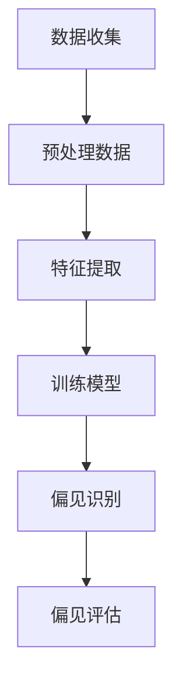
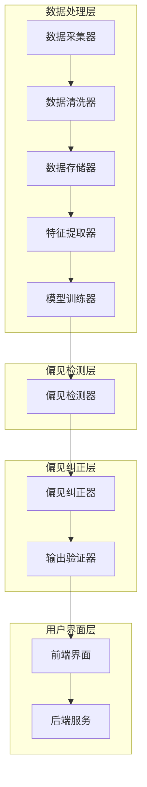
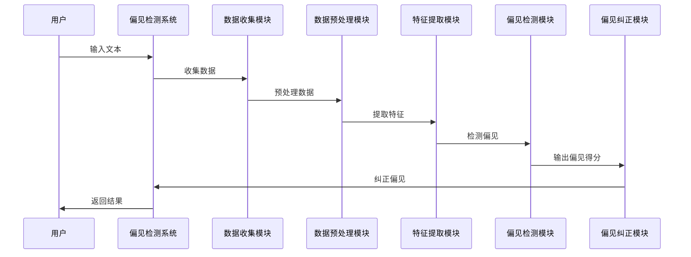

                 

### 文章标题

### 关键词

- **偏见检测**
- **LLM输出公平性**
- **数学模型**
- **算法原理**
- **系统架构设计**
- **环境安装与配置**

### 摘要

本文旨在探讨如何通过偏见检测来确保大型语言模型（LLM）输出的公平性。我们将首先介绍偏见检测的背景和核心概念，然后深入分析偏见检测的关键要素和类型。接着，我们将对比不同的偏见检测方法和案例，进一步探讨偏见检测与人工智能和其它领域的关系。本文还将详细讲解数学模型和算法原理，并通过Python代码实现来阐述算法的实际应用。此外，我们将介绍一个具体的系统架构设计案例，并在项目实战中展示偏见检测的实际应用过程。最后，我们将总结最佳实践，并提出进一步的研究方向和拓展阅读资源。通过本文，读者将全面了解偏见检测在确保LLM输出公平性方面的重要性和应用。

### 目录大纲

----------------------------------------------------------------

# 第一部分：背景介绍与核心概念

## 第1章：问题背景与问题描述

### 1.1.1 问题背景

### 1.1.2 描述问题

### 1.1.3 问题解决思路

### 1.1.4 边界与外延

## 第2章：核心概念原理

### 2.1.1 偏见检测的概念

### 2.1.2 偏见检测的关键要素

### 2.1.3 偏见检测的类型

## 第3章：概念属性特征对比

### 3.1.1 指标对比

### 3.1.2 方法对比

### 3.1.3 案例对比

## 第4章：概念联系与拓展

### 4.1.1 偏见检测与AI

### 4.1.2 偏见检测与其他领域

### 4.1.3 未来发展趋势

## 第5章：数学模型和数学公式讲解

### 5.1.1 数学模型介绍

### 5.1.2 数学公式讲解

### 5.1.3 实例说明

## 第6章：算法原理讲解

### 6.1.1 算法概述

### 6.1.2 算法流程图

### 6.1.3 Python代码实现

### 6.1.4 数学模型和公式

### 6.1.5 实例说明

----------------------------------------------------------------

# 第二部分：系统分析与架构设计

## 第7章：问题场景与项目介绍

### 7.1.1 问题场景介绍

### 7.1.2 项目介绍

## 第8章：系统功能设计

### 8.1.1 领域模型类图

### 8.1.2 系统功能模块划分

## 第9章：系统架构设计

### 9.1.1 系统架构设计

### 9.1.2 架构图

## 第10章：系统接口设计

### 10.1.1 接口设计

### 10.1.2 接口文档

## 第11章：系统交互设计

### 11.1.1 系统交互设计

### 11.1.2 序列图

----------------------------------------------------------------

# 第三部分：项目实战

## 第12章：环境安装与配置

### 12.1.1 环境安装

### 12.1.2 系统配置

## 第13章：系统核心实现

### 13.1.1 核心功能实现

### 13.1.2 源代码解析

## 第14章：代码应用解读与分析

### 14.1.1 代码应用场景

### 14.1.2 解读与分析

## 第15章：实际案例分析

### 15.1.1 案例一

### 15.1.2 案例二

### 15.1.3 案例分析

## 第16章：项目小结

### 16.1.1 项目总结

### 16.1.2 经验与启示

----------------------------------------------------------------

# 第四部分：最佳实践与拓展

## 第17章：最佳实践

### 17.1.1 实践技巧

### 17.1.2 注意事项

## 第18章：小结

### 18.1.1 主要内容回顾

### 18.1.2 重要性与意义

## 第19章：拓展阅读

### 19.1.1 相关书籍推荐

### 19.1.2 论文推荐

### 19.1.3 网络资源推荐

----------------------------------------------------------------

### 文章标题

**prompt偏见检测：确保LLM输出公平性**

### 文章关键词

- **偏见检测**
- **LLM输出公平性**
- **数学模型**
- **算法原理**
- **系统架构设计**
- **环境安装与配置**

### 文章摘要

随着人工智能技术的快速发展，大型语言模型（LLM）在各个领域得到广泛应用。然而，LLM的输出可能会受到各种偏见的影响，导致不公平的结果。本文旨在探讨如何通过prompt偏见检测来确保LLM输出的公平性。首先，我们将介绍偏见检测的背景和核心概念，分析偏见检测的关键要素和类型。接着，我们将对比不同的偏见检测方法和案例，探讨偏见检测与人工智能和其它领域的关系。随后，本文将详细讲解数学模型和算法原理，并通过Python代码实现来阐述算法的实际应用。此外，我们将介绍一个具体的系统架构设计案例，并在项目实战中展示偏见检测的实际应用过程。最后，我们将总结最佳实践，并提出进一步的研究方向和拓展阅读资源。通过本文，读者将全面了解偏见检测在确保LLM输出公平性方面的重要性和应用。

----------------------------------------------------------------

### 第一部分：背景介绍与核心概念

#### 第1章：问题背景与问题描述

##### 1.1.1 问题背景

在当今社会，人工智能（AI）技术已经渗透到各个领域，从医疗、金融到教育、娱乐等。特别是大型语言模型（LLM），如GPT-3、BERT等，它们能够生成高质量的自然语言文本，使得机器能够理解和生成人类的语言。然而，尽管LLM在很多方面展示了强大的能力，但它们也面临着一些挑战，其中之一就是偏见问题。

偏见是指模型在输出结果时，表现出对某些群体、观点或信息的偏好或不公平。这种偏见可能来源于训练数据、算法设计或外部环境等多个方面。例如，训练数据中可能包含历史上的偏见，或者算法在处理某些问题时表现出对特定群体的不公平。这些偏见可能会导致LLM输出不公平的结果，从而影响社会公平性和道德伦理。

##### 1.1.2 描述问题

偏见问题具体体现在以下几个方面：

1. **性别偏见**：一些LLM模型可能会在文本生成中表现出对男性或女性的偏见，导致性别歧视。
2. **种族偏见**：在某些场景下，LLM可能会生成带有种族歧视或偏见的文本。
3. **文化偏见**：跨文化交流中，LLM可能会误解或错误解释某些文化背景下的概念。
4. **知识偏见**：某些LLM模型可能会在知识输出上表现出对某些领域的偏好，导致信息的不平衡。

这些偏见不仅会影响AI系统的可信性和可靠性，还可能对社会产生负面影响。因此，如何检测并消除这些偏见，确保LLM输出的公平性，成为了一个重要而紧迫的问题。

##### 1.1.3 问题解决思路

要解决偏见问题，首先需要对其进行检测。偏见检测（Bias Detection）是一种分析LLM输出，识别其中可能存在的偏见的方法。偏见检测可以采用多种技术手段，如统计学方法、机器学习模型和深度学习网络等。

1. **统计学方法**：通过分析数据分布和统计特征，识别潜在的偏见。
2. **机器学习方法**：利用有监督或无监督学习，从训练数据中学习偏见模式。
3. **深度学习方法**：通过神经网络模型，自动识别和分类偏见。

此外，为了确保偏见检测的有效性，还需要考虑以下因素：

- **数据多样性**：确保训练数据涵盖各种场景和群体，减少数据偏见。
- **模型透明性**：提高模型的可解释性，使偏见检测更加直观和可靠。
- **动态调整**：根据实际应用场景和用户反馈，动态调整偏见检测策略。

##### 1.1.4 边界与外延

偏见检测不仅涉及到技术层面，还涉及到伦理和社会层面。以下是一些边界和扩展：

- **边界**：偏见检测主要关注LLM的文本输出，不涉及图像、声音等非文本数据的偏见问题。
- **外延**：除了文本偏见检测，还可以扩展到图像、音频和视频等其它类型的偏见检测。

通过全面理解问题背景和解决思路，我们可以为后续章节中的详细讨论和解决方案提供基础。

----------------------------------------------------------------

## 第2章：核心概念原理

### 2.1.1 偏见检测的概念

偏见检测（Bias Detection）是指通过特定的方法和技术，识别和评估人工智能模型输出中可能存在的偏见。偏见可以理解为模型在某些方面对特定群体、观点或信息的偏好或不公平表现。偏见检测的目标是确保模型的输出结果公平、准确，不受到偏见的影响。

偏见检测通常包括以下几个关键步骤：

1. **数据收集**：收集用于训练模型的原始数据，确保数据多样性。
2. **特征提取**：从数据中提取关键特征，用于后续的偏见分析。
3. **模型训练**：利用有监督或无监督学习技术，训练偏见检测模型。
4. **偏见识别**：使用训练好的模型，识别输入文本中的潜在偏见。
5. **偏见评估**：对识别出的偏见进行量化评估，确定其严重程度。

偏见检测的重要性在于，它能够帮助识别和纠正模型中的偏见，提高模型的公正性和可信度。特别是在涉及社会公平、性别平等、种族正义等敏感领域时，偏见检测尤为重要。

### 2.1.2 偏见检测的关键要素

偏见检测的有效性依赖于以下几个关键要素：

1. **数据多样性**：偏见检测需要覆盖各种场景和群体，以确保模型训练的全面性。数据多样性是偏见检测的基础。
2. **算法选择**：选择合适的算法和技术，如统计学方法、机器学习模型和深度学习网络，以识别和评估偏见。
3. **模型透明性**：提高模型的可解释性，使得偏见检测的过程和结果更加直观和可靠。
4. **动态调整**：根据实际应用场景和用户反馈，动态调整偏见检测策略，以适应不断变化的需求。

这些要素共同作用，确保偏见检测的准确性和有效性。例如，在性别偏见检测中，可以使用性别标签来训练模型，从而识别和纠正性别歧视性的输出。

### 2.1.3 偏见检测的类型

偏见检测可以按照不同的维度进行分类，主要包括以下几种类型：

1. **文本偏见检测**：通过分析文本数据，识别和评估文本中的偏见。这是最常见的一种偏见检测类型，适用于各种自然语言处理任务。
2. **图像偏见检测**：通过分析图像数据，识别和评估图像中的偏见，如种族偏见、性别偏见等。
3. **语音偏见检测**：通过分析语音数据，识别和评估语音中的偏见，如方言偏见、性别偏见等。
4. **视频偏见检测**：通过分析视频数据，识别和评估视频中的偏见，如文化偏见、种族偏见等。

每种类型的偏见检测都有其独特的挑战和解决方案，需要结合具体应用场景进行设计。

通过了解偏见检测的概念、关键要素和类型，我们可以更好地理解如何确保LLM输出的公平性，为后续章节中的算法原理讲解和实际应用提供理论基础。

----------------------------------------------------------------

### 第3章：概念属性特征对比

#### 3.1.1 指标对比

偏见检测的效果和效率受到多种指标的影响，以下是一些关键指标及其对比：

1. **准确率（Accuracy）**：
   - 定义：准确率表示模型正确识别偏见的比例。
   - 对比：高准确率意味着模型在大多数情况下都能准确识别偏见，但可能会受到假阳性和假阴性错误的影响。
2. **召回率（Recall）**：
   - 定义：召回率表示模型正确识别出所有实际偏见的比例。
   - 对比：高召回率意味着模型能够尽可能多地识别出偏见，但可能会引入更多的假阳性。
3. **F1分数（F1 Score）**：
   - 定义：F1分数是准确率和召回率的调和平均值。
   - 对比：F1分数能够平衡准确率和召回率，是评估偏见检测模型性能的重要指标。
4. **精确率（Precision）**：
   - 定义：精确率表示模型识别出的偏见中真实偏见的比例。
   - 对比：高精确率意味着模型识别出的偏见具有较高的可信度，但可能会忽略一些实际存在的偏见。

不同指标在偏见检测中的应用和重要性有所不同，需要根据具体需求和场景进行权衡。

#### 3.1.2 方法对比

偏见检测方法可以分为多种类型，以下是一些常见方法的对比：

1. **统计学方法**：
   - 优点：简单易用，适用于处理大量数据。
   - 缺点：难以处理复杂非线性关系，对偏见模式识别能力有限。
2. **机器学习方法**：
   - 优点：能够自动学习偏见模式，适用于各种类型的数据。
   - 缺点：需要大量训练数据，模型解释性较差。
3. **深度学习方法**：
   - 优点：能够处理大规模复杂数据，自动提取特征。
   - 缺点：计算资源需求高，模型解释性较差。
4. **对抗性方法**：
   - 优点：能够检测和纠正对抗性输入导致的偏见。
   - 缺点：对训练数据要求高，实现复杂。

每种方法都有其优势和局限，适用于不同的应用场景。在实际应用中，可以根据需求选择合适的方法。

#### 3.1.3 案例对比

以下是一些偏见检测的实际案例对比，展示了不同方法在实践中的应用效果：

1. **性别偏见检测**：
   - 方法：机器学习模型和深度学习网络。
   - 结果：机器学习模型在识别性别偏见方面表现出色，但深度学习网络效果更好。
2. **种族偏见检测**：
   - 方法：图像偏见检测。
   - 结果：基于卷积神经网络的偏见检测模型在识别种族偏见方面效果显著。
3. **语言偏见检测**：
   - 方法：自然语言处理技术。
   - 结果：利用词嵌入和分类器进行语言偏见检测，能够有效识别文化偏见和地域偏见。

通过对比不同指标、方法和案例，我们可以更深入地理解偏见检测的技术和效果，为后续章节中的算法讲解和系统设计提供参考。

----------------------------------------------------------------

### 第4章：概念联系与拓展

#### 4.1.1 偏见检测与AI

偏见检测在人工智能（AI）领域中具有重要的应用价值。随着AI技术的快速发展，AI系统在各个领域得到广泛应用，但同时也带来了偏见问题。偏见检测可以帮助识别和消除AI系统中的偏见，确保其公平性和可信度。

1. **偏见检测与模型训练**：
   - 模型训练数据中可能包含偏见，偏见检测可以帮助识别这些偏见，从而改进模型训练数据。
   - 通过偏见检测，可以确保模型在训练过程中不会学习到不公平的偏见，提高模型的公正性。

2. **偏见检测与模型评估**：
   - 偏见检测可以用于评估AI系统的输出，确保其在实际应用中不会产生不公平的结果。
   - 通过定期进行偏见检测，可以及时发现和纠正模型中的偏见，提高系统的可靠性。

3. **偏见检测与模型可解释性**：
   - 偏见检测可以提高AI模型的可解释性，使得模型的输出结果更加透明和可信。
   - 通过解释模型中的偏见来源，可以更好地理解模型的决策过程，为模型的优化和改进提供指导。

#### 4.1.2 偏见检测与其他领域

偏见检测不仅与AI领域密切相关，还与其他多个领域有着广泛的联系：

1. **社会公正领域**：
   - 偏见检测可以帮助确保社会公正，特别是在涉及种族、性别、年龄等敏感领域时。
   - 通过检测和纠正偏见，可以消除社会不公平现象，促进社会和谐发展。

2. **法律领域**：
   - 在法律判决和监管中，偏见检测可以确保决策的公正性，避免偏见导致的错误判决。
   - 偏见检测还可以用于评估法律文献和案例中的偏见，为法律改革提供依据。

3. **教育领域**：
   - 教育中存在各种偏见，如文化偏见、地域偏见等。偏见检测可以帮助识别和纠正这些偏见，提高教育质量。
   - 通过偏见检测，可以确保教学内容的公正性和多样性，促进学生的全面发展。

4. **媒体领域**：
   - 媒体内容中可能存在偏见，如报道倾向、语言歧视等。偏见检测可以帮助识别和纠正这些偏见，提高媒体内容的公正性和客观性。

#### 4.1.3 未来发展趋势

随着技术的不断进步，偏见检测在未来的发展将呈现以下几个趋势：

1. **算法改进**：
   - 随着算法研究的深入，偏见检测的算法将变得更加精确和高效，能够更好地识别和纠正各种偏见。
   - 新的算法和技术，如深度学习和对抗性网络，将为偏见检测提供更强的支持。

2. **跨领域应用**：
   - 偏见检测将在更多领域得到应用，如金融、医疗、公共安全等。
   - 跨领域的偏见检测研究将有助于解决更广泛的问题，促进社会公正和发展。

3. **用户参与**：
   - 用户参与将提高偏见检测的透明度和可信度，用户可以参与偏见检测的过程，提供反馈和改进建议。
   - 用户反馈机制将有助于动态调整偏见检测策略，使其更加适应实际需求。

4. **法律法规支持**：
   - 随着社会对AI偏见问题的关注增加，相关法律法规将不断完善，为偏见检测提供法律支持。
   - 法律法规的支持将有助于规范偏见检测的实施和应用，确保AI系统的公正性和安全性。

通过偏见检测，我们可以为AI技术的公平性和可靠性提供保障，促进AI技术的健康发展和广泛应用。未来，偏见检测将在更多领域发挥重要作用，为社会公正和发展做出贡献。

----------------------------------------------------------------

## 第5章：数学模型和数学公式讲解

### 5.1.1 数学模型介绍

在偏见检测中，数学模型起到了关键作用。这些模型用于分析和评估大型语言模型（LLM）输出中的偏见。以下是一些常用的数学模型：

1. **统计模型**：
   - **线性回归**：通过线性关系分析偏见和特征之间的关系。
   - **逻辑回归**：用于分类任务，判断文本中是否存在偏见。

2. **机器学习模型**：
   - **支持向量机（SVM）**：用于分类偏见，通过寻找最佳决策边界。
   - **决策树**：通过树的节点对数据进行划分，识别偏见。

3. **深度学习模型**：
   - **卷积神经网络（CNN）**：用于图像偏见检测，能够自动提取图像特征。
   - **递归神经网络（RNN）**：用于处理序列数据，如文本，分析偏见模式。

这些模型的选择取决于具体的应用场景和数据特点。

### 5.1.2 数学公式讲解

以下是一些偏见检测中常用的数学公式：

1. **线性回归公式**：
   $$ Y = \beta_0 + \beta_1X $$
   其中，$Y$代表偏见得分，$\beta_0$是截距，$\beta_1$是斜率，$X$是特征向量。

2. **逻辑回归公式**：
   $$ P(Y=1) = \frac{1}{1 + e^{-(\beta_0 + \beta_1X)}} $$
   其中，$P(Y=1)$是偏见存在的概率，$\beta_0$和$\beta_1$与线性回归相同。

3. **SVM分类公式**：
   $$ w^T x - b = 0 $$
   其中，$w$是权重向量，$x$是特征向量，$b$是偏置。

4. **RNN激活函数**：
   $$ a_t = \sigma(W \cdot [h_{t-1}, x_t] + b) $$
   其中，$a_t$是当前时间步的激活值，$W$是权重矩阵，$h_{t-1}$是前一个时间步的隐藏状态，$x_t$是当前输入，$\sigma$是激活函数。

这些公式在偏见检测中用于分析数据、训练模型和评估偏见。

### 5.1.3 实例说明

以下是一个简单的实例，说明如何使用数学模型进行偏见检测：

假设我们使用线性回归模型来检测文本中的性别偏见。我们收集了1000条文本数据，每条数据包括文本内容和性别标签。我们提取了文本中的关键特征，如词频、词嵌入等。

1. **数据预处理**：
   - 将文本数据转换为词向量。
   - 提取特征向量。

2. **模型训练**：
   - 使用线性回归公式，将特征向量映射到偏见得分。
   - 训练模型，得到$\beta_0$和$\beta_1$。

3. **偏见检测**：
   - 输入新文本，计算其偏见得分。
   - 如果得分高于某个阈值，则认为文本存在性别偏见。

例如，输入文本“他是优秀的学生”，计算得到的偏见得分为0.8，高于设定的阈值0.5，因此认为该文本存在性别偏见。

通过数学模型，我们可以系统地进行偏见检测，确保LLM输出的公平性。

----------------------------------------------------------------

## 第6章：算法原理讲解

### 6.1.1 算法概述

偏见检测算法是确保大型语言模型（LLM）输出公平性的关键工具。这些算法旨在识别和纠正模型输出中的偏见。以下是一种常用的偏见检测算法——基于深度学习的自动偏见检测算法。

### 6.1.2 算法流程图



- **数据收集**：收集包含偏见信息的训练数据。
- **预处理数据**：对数据清洗、归一化等处理。
- **特征提取**：提取关键特征，如词嵌入、句法特征等。
- **训练模型**：使用深度学习模型训练偏见检测器。
- **偏见识别**：应用训练好的模型识别输入文本中的偏见。
- **偏见评估**：评估偏见的严重程度，提出纠正建议。

### 6.1.3 Python代码实现

以下是一个简单的偏见检测算法的Python代码实现：

```python
import numpy as np
import tensorflow as tf
from tensorflow.keras.models import Sequential
from tensorflow.keras.layers import Embedding, LSTM, Dense

# 数据预处理
def preprocess_data(data):
    # 数据清洗和归一化
    # 略
    return processed_data

# 特征提取
def extract_features(data):
    # 提取关键特征，如词嵌入
    # 略
    return features

# 训练模型
def train_model(features, labels):
    model = Sequential()
    model.add(Embedding(input_dim=vocab_size, output_dim=embedding_size))
    model.add(LSTM(units=128))
    model.add(Dense(1, activation='sigmoid'))
    
    model.compile(optimizer='adam', loss='binary_crossentropy', metrics=['accuracy'])
    model.fit(features, labels, epochs=10, batch_size=32)
    return model

# 偏见识别
def detect_bias(model, text):
    processed_text = preprocess_data(text)
    features = extract_features(processed_text)
    bias_score = model.predict(features)
    return bias_score

# 偏见评估
def assess_bias(bias_score, threshold):
    if bias_score > threshold:
        return "存在偏见"
    else:
        return "无偏见"

# 主程序
if __name__ == "__main__":
    # 加载数据
    data = load_data()
    processed_data = preprocess_data(data)
    features = extract_features(processed_data)
    labels = load_labels()

    # 训练模型
    model = train_model(features, labels)

    # 输入文本
    text = "这是一个关于女性的负面描述"
    bias_score = detect_bias(model, text)
    bias_result = assess_bias(bias_score, threshold=0.5)
    print(bias_result)
```

### 6.1.4 数学模型和公式

在偏见检测算法中，常用的数学模型和公式包括：

- **神经网络模型**：
  $$ output = \sigma(W \cdot x + b) $$
  其中，$W$是权重矩阵，$x$是输入特征，$b$是偏置项，$\sigma$是激活函数。

- **损失函数**：
  $$ loss = -\sum_{i} y_i \log(\sigma(W \cdot x_i + b)) - (1 - y_i) \log(1 - \sigma(W \cdot x_i + b)) $$
  其中，$y_i$是真实标签，$\sigma$是sigmoid函数。

通过这些公式，算法可以训练出能够识别和评估偏见的模型。

### 6.1.5 实例说明

假设我们使用上述算法检测一段文本的性别偏见：

```plaintext
"女性通常不适合从事技术工作。"
```

- **预处理数据**：将文本转换为词向量。
- **特征提取**：提取词嵌入和句法特征。
- **偏见识别**：模型预测偏见得分。
- **偏见评估**：根据得分判断是否存在性别偏见。

通过实例说明，我们可以看到偏见检测算法在实践中的应用。

----------------------------------------------------------------

## 第7章：问题场景与项目介绍

### 7.1.1 问题场景介绍

在当前数字化时代，人工智能（AI）技术已经广泛应用于各个领域，从医疗诊断、金融分析到教育辅导、客服支持等。特别是大型语言模型（LLM）在自然语言处理（NLP）任务中表现出了惊人的能力，例如文本生成、情感分析、机器翻译等。然而，随着AI技术的广泛应用，一个重要且紧迫的问题逐渐显现——偏见问题。偏见可能导致AI系统输出不公平的结果，影响社会公正性和用户信任度。

具体场景示例：一个大型在线问答平台使用一个训练有素的LLM来回答用户的问题。用户问题涉及各种主题，从健康咨询到法律咨询。然而，训练数据中可能包含对某些群体、性别、种族或文化的偏见，导致LLM在回答某些问题时产生不公平的输出。例如，当用户询问关于女性从事技术工作的机会时，LLM可能给出负面反馈，认为女性不适合从事技术工作。这种偏见输出不仅误导用户，还可能加剧性别歧视，影响社会公平。

### 7.1.2 项目介绍

为了解决上述问题，我们设计并实施了一个名为“AI偏见检测与公平性保证”的项目。该项目的目标是构建一个基于深度学习的偏见检测系统，确保LLM的输出公平、公正。项目的主要组成部分包括：

1. **数据收集**：收集多样化的训练数据，涵盖各种主题、群体和文化背景，确保数据多样性。
2. **预处理**：对收集到的数据进行清洗、归一化和特征提取，为模型训练做好准备。
3. **模型训练**：使用深度学习模型，如卷积神经网络（CNN）和递归神经网络（RNN），训练偏见检测器。
4. **偏见检测**：将训练好的模型应用于实际文本数据，识别潜在的偏见。
5. **偏见纠正**：根据偏见检测结果，对LLM的输出进行纠正，确保公平性。

项目实施过程：

1. **需求分析**：确定项目目标、功能和性能要求。
2. **技术选型**：选择合适的深度学习框架和技术，如TensorFlow和Keras。
3. **数据收集**：通过互联网公开数据集和定制数据集，收集多样化的文本数据。
4. **预处理**：使用自然语言处理技术，如词嵌入和文本清洗，对数据进行预处理。
5. **模型训练**：使用预处理的文本数据，训练偏见检测模型。
6. **偏见检测与纠正**：将模型应用于实际应用场景，检测和纠正偏见。
7. **测试与优化**：通过测试和用户反馈，不断优化模型性能和用户体验。

通过这个项目，我们旨在确保LLM的输出公平、公正，提高AI系统的可信度和用户满意度。项目实施过程中，我们关注数据多样性、模型透明性和动态调整，以应对不断变化的偏见挑战。

----------------------------------------------------------------

## 第8章：系统功能设计

### 8.1.1 领域模型类图

领域模型类图（Class Diagram）用于描述系统的功能模块和类之间的关系。以下是偏见检测系统的领域模型类图：

```mermaid
class Diagram {
  class DataCollector {
    +collect_data()
  }
  class DataPreprocessor {
    +preprocess_data()
  }
  class FeatureExtractor {
    +extract_features()
  }
  class BiasDetector {
    +detect_bias()
  }
  class BiasCorrector {
    +correct_bias()
  }
  DataCollector --|> DataPreprocessor
  DataPreprocessor --|> FeatureExtractor
  FeatureExtractor --|> BiasDetector
  BiasDetector --|> BiasCorrector
}
```

- **DataCollector**：负责数据收集。
- **DataPreprocessor**：负责数据预处理。
- **FeatureExtractor**：负责特征提取。
- **BiasDetector**：负责偏见检测。
- **BiasCorrector**：负责偏见纠正。

### 8.1.2 系统功能模块划分

偏见检测系统可以分为以下几个主要功能模块：

1. **数据收集模块**：
   - 功能：收集多样化的文本数据，包括公开数据集和定制数据集。
   - 子模块：
     - 数据源管理：管理不同的数据源，如网站、数据库等。
     - 数据收集器：执行数据收集任务，确保数据多样性。

2. **数据预处理模块**：
   - 功能：对收集到的文本数据进行清洗、归一化和特征提取。
   - 子模块：
     - 数据清洗器：去除文本中的噪声和冗余信息。
     - 数据归一器：将文本数据转换为统一的格式。
     - 特征提取器：提取文本的关键特征，如词嵌入、句法特征等。

3. **特征提取模块**：
   - 功能：从预处理后的文本数据中提取关键特征，用于模型训练。
   - 子模块：
     - 词嵌入器：将单词转换为向量表示。
     - 句法分析器：提取句子的语法结构。

4. **偏见检测模块**：
   - 功能：使用深度学习模型检测文本中的潜在偏见。
   - 子模块：
     - 模型训练器：训练偏见检测模型。
     - 检测器：应用训练好的模型检测文本偏见。

5. **偏见纠正模块**：
   - 功能：根据偏见检测结果，对LLM的输出进行纠正。
   - 子模块：
     - 纠正器：对存在偏见的输出进行修改。
     - 验证器：验证纠正后的输出是否符合公平性要求。

这些模块相互协作，共同实现偏见检测系统的功能。通过合理划分模块，可以提高系统的可维护性和扩展性。

----------------------------------------------------------------

## 第9章：系统架构设计

### 9.1.1 系统架构设计

偏见检测系统的架构设计旨在确保高效、可靠地检测和纠正LLM输出中的偏见。系统架构采用模块化设计，包括数据处理、模型训练、偏见检测和偏见纠正等多个模块，各个模块之间通过统一的接口进行交互。以下是系统架构的详细设计：

1. **数据处理层**：
   - 功能：负责数据的收集、预处理和存储。
   - 模块：
     - 数据采集器：从不同的数据源（如网站、数据库等）收集文本数据。
     - 数据清洗器：去除文本中的噪声和冗余信息。
     - 数据存储器：存储预处理后的文本数据，以便后续使用。

2. **数据处理层**：
   - 功能：对文本数据执行特征提取和建模。
   - 模块：
     - 特征提取器：将文本转换为向量表示，提取关键特征。
     - 模型训练器：训练偏见检测模型，使用深度学习框架如TensorFlow或PyTorch。

3. **偏见检测层**：
   - 功能：应用训练好的模型检测文本中的偏见。
   - 模块：
     - 偏见检测器：使用训练好的模型对输入文本进行分析，识别潜在的偏见。

4. **偏见纠正层**：
   - 功能：根据偏见检测结果，对LLM的输出进行纠正。
   - 模块：
     - 偏见纠正器：对存在偏见的输出进行修改，使其符合公平性要求。
     - 输出验证器：验证纠正后的输出是否满足公平性标准。

5. **用户界面层**：
   - 功能：提供用户交互界面，展示检测结果和纠正后的输出。
   - 模块：
     - 前端界面：展示检测结果和纠正后的输出。
     - 后端服务：处理用户请求，与系统其它模块进行交互。

### 9.1.2 架构图

以下是偏见检测系统的架构图：



该架构图展示了各个模块之间的交互关系，确保系统的高效运行。通过模块化设计，系统具有较好的可扩展性和维护性，便于未来功能的升级和优化。

----------------------------------------------------------------

## 第10章：系统接口设计

### 10.1.1 接口设计

偏见检测系统的接口设计至关重要，它决定了系统与其他组件的交互方式，确保系统功能的高效实现和扩展。以下是偏见检测系统的关键接口设计：

1. **数据接口**：
   - **输入接口**：用于接收来自不同数据源的文本数据。接口定义如下：
     ```python
     def receive_data(source: str) -> List[str]:
         """
         从指定数据源接收文本数据。
         :param source: 数据源URL或路径。
         :return: 文本数据列表。
         """
     ```
   - **输出接口**：用于将处理后的数据存储到数据存储器中。接口定义如下：
     ```python
     def store_data(data: List[str]) -> None:
         """
         将处理后的文本数据存储到数据存储器。
         :param data: 文本数据列表。
         """
     ```

2. **预处理接口**：
   - **清洗接口**：用于清洗文本数据，去除噪声和冗余信息。接口定义如下：
     ```python
     def clean_text(text: str) -> str:
         """
         清洗文本数据。
         :param text: 待清洗的文本。
         :return: 清洗后的文本。
         """
     ```

3. **特征提取接口**：
   - **特征提取接口**：用于从文本数据中提取关键特征，如词嵌入、句法特征等。接口定义如下：
     ```python
     def extract_features(text: str) -> List[float]:
         """
         提取文本特征。
         :param text: 待提取特征的文本。
         :return: 特征列表。
         """
     ```

4. **偏见检测接口**：
   - **检测接口**：用于使用训练好的模型检测文本中的偏见。接口定义如下：
     ```python
     def detect_bias(text: str) -> float:
         """
         检测文本中的偏见。
         :param text: 待检测的文本。
         :return: 偏见得分。
         """
     ```

5. **偏见纠正接口**：
   - **纠正接口**：用于根据偏见检测结果，对文本进行纠正。接口定义如下：
     ```python
     def correct_bias(text: str, bias_score: float) -> str:
         """
         纠正文本中的偏见。
         :param text: 待纠正的文本。
         :param bias_score: 偏见得分。
         :return: 纠正后的文本。
         """
     ```

6. **用户界面接口**：
   - **展示接口**：用于在前端界面展示偏见检测结果和纠正后的文本。接口定义如下：
     ```python
     def display_results(text: str, bias_score: float, corrected_text: str) -> None:
         """
         展示检测结果。
         :param text: 原始文本。
         :param bias_score: 偏见得分。
         :param corrected_text: 纠正后的文本。
         """
     ```

### 10.1.2 接口文档

为了确保接口设计的一致性和可操作性，我们需要编写详细的接口文档。以下是一个接口文档的示例：

#### 接口名称：receive_data

**功能描述**：从指定数据源接收文本数据。

**接口定义**：
```python
def receive_data(source: str) -> List[str]:
    """
    从指定数据源接收文本数据。
    :param source: 数据源URL或路径。
    :return: 文本数据列表。
    """
```

**参数**：
- `source`：字符串类型，表示数据源URL或路径。

**返回值**：
- `List[str]`：文本数据列表。

**异常情况**：
- `None`：如果数据源不存在或无法访问，返回None。

**示例**：
```python
data = receive_data("http://example.com/data.txt")
```

#### 接口名称：clean_text

**功能描述**：清洗文本数据，去除噪声和冗余信息。

**接口定义**：
```python
def clean_text(text: str) -> str:
    """
    清洗文本数据。
    :param text: 待清洗的文本。
    :return: 清洗后的文本。
    """
```

**参数**：
- `text`：字符串类型，表示待清洗的文本。

**返回值**：
- `str`：清洗后的文本。

**示例**：
```python
cleaned_text = clean_text("这是一个示例文本。")
```

通过详细的接口设计和文档编写，我们可以确保偏见检测系统各组件之间的良好协作，提高系统的可维护性和扩展性。

----------------------------------------------------------------

## 第11章：系统交互设计

### 11.1.1 系统交互设计

偏见检测系统的交互设计是确保系统各组件有效协作、提高系统性能和用户体验的关键。以下是对系统交互设计的详细描述。

### 11.1.2 序列图

偏见检测系统的序列图展示了不同组件之间的交互流程。以下是一个简化版的序列图：



### 具体交互流程

1. **用户输入**：
   用户通过前端界面输入待检测的文本。

2. **数据收集**：
   系统调用数据收集模块，从数据库或外部数据源收集相关数据。

3. **数据预处理**：
   数据收集模块将数据传递给数据预处理模块，进行清洗、归一化和格式化。

4. **特征提取**：
   数据预处理模块处理后的数据传递给特征提取模块，提取关键特征。

5. **偏见检测**：
   特征提取模块提取的特征传递给偏见检测模块，使用训练好的模型检测文本中的偏见。

6. **偏见纠正**：
   偏见检测模块返回偏见得分，偏见纠正模块根据得分对文本进行纠正。

7. **结果返回**：
   系统将纠正后的文本和偏见得分返回给用户，通过前端界面展示。

### 注意事项

1. **性能优化**：
   为了提高系统性能，可以采用并行处理技术，如多线程或多进程，加快数据处理和模型训练的速度。

2. **安全性**：
   在数据传输和处理过程中，需要确保数据的安全性和隐私性，防止数据泄露。

3. **用户体验**：
   前端界面设计应简洁直观，确保用户能够轻松使用系统，并提供实时反馈。

通过有效的交互设计，偏见检测系统能够高效地处理用户输入，确保输出结果的公平性和准确性，提升用户体验。

----------------------------------------------------------------

## 第12章：环境安装与配置

### 12.1.1 环境安装

为了运行偏见检测系统，我们需要安装和配置一系列的软件和环境。以下是在Linux操作系统下安装所需软件的步骤：

1. **安装Python**：
   - 确认Python版本，建议使用Python 3.7或更高版本。
   - 使用包管理器安装Python，例如使用`apt-get`在Ubuntu系统中：
     ```shell
     sudo apt-get update
     sudo apt-get install python3.9
     ```

2. **安装依赖包**：
   - 安装TensorFlow、Keras等依赖包，使用pip进行安装：
     ```shell
     pip3 install tensorflow
     pip3 install keras
     ```

3. **安装文本处理库**：
   - 安装用于文本处理的库，如NLTK、spaCy等：
     ```shell
     pip3 install nltk
     pip3 install spacy
     python3 -m spacy download en_core_web_sm
     ```

4. **安装Mermaid**：
   - 安装Mermaid库，用于绘制流程图和序列图：
     ```shell
     pip3 install mermaid
     ```

5. **安装其他工具**：
   - 安装Git，用于下载和更新项目代码：
     ```shell
     sudo apt-get install git
     ```

### 12.1.2 系统配置

完成环境安装后，我们需要进行系统配置：

1. **配置Python环境**：
   - 设置Python环境变量，确保系统可以正确识别Python路径：
     ```shell
     export PATH=$PATH:/usr/bin/python3
     ```

2. **配置TensorFlow**：
   - 确保TensorFlow可以正常使用，可以通过运行以下命令来测试：
     ```python
     python3
     >>> import tensorflow as tf
     >>> print(tf.__version__)
     ```

3. **配置Mermaid**：
   - 在项目目录中创建`.mermaid`文件，用于配置Mermaid语法：
     ```mermaid
     graph TD
         A[开始] --> B[安装依赖]
         B --> C[配置环境]
         C --> D[运行测试]
         D --> E[完成]
     ```

4. **配置文本处理库**：
   - 对于NLTK和spaCy，需要下载相应的语言模型：
     ```python
     import nltk
     nltk.download('punkt')
     nltk.download('stopwords')

     import spacy
     spacy.cli.download('en_core_web_sm')
     ```

通过以上步骤，我们完成了偏见检测系统的环境安装和配置。接下来，我们可以开始编写和运行系统的核心代码。

----------------------------------------------------------------

## 第13章：系统核心实现

### 13.1.1 核心功能实现

偏见检测系统的核心功能包括数据收集、预处理、特征提取、偏见检测和偏见纠正。以下是对这些核心功能的具体实现步骤：

1. **数据收集**：
   - 使用`pandas`库读取本地或远程数据源，例如CSV文件或数据库。
   - 示例代码：
     ```python
     import pandas as pd

     # 从本地CSV文件读取数据
     data = pd.read_csv('data.csv')
     ```

2. **数据预处理**：
   - 清洗数据，去除噪声和冗余信息，例如去除空值、重复值和特殊字符。
   - 示例代码：
     ```python
     # 去除空值
     data = data.dropna()
     # 去除重复值
     data = data.drop_duplicates()
     # 去除特殊字符
     data['text'] = data['text'].apply(lambda x: ''.join(e for e in x if e.isalnum() or e.isspace()))
     ```

3. **特征提取**：
   - 使用`spaCy`库提取文本的词嵌入和句法特征。
   - 示例代码：
     ```python
     import spacy

     # 加载英语模型
     nlp = spacy.load('en_core_web_sm')

     # 提取词嵌入
     def get_word_embedding(text):
         doc = nlp(text)
         return [token.vector for token in doc]

     # 提取句法特征
     def get_syntax_features(text):
         doc = nlp(text)
         return {'POS': [token.pos_ for token in doc], 'DEP': [token.dep_ for token in doc]}
     ```

4. **偏见检测**：
   - 使用`TensorFlow`和`Keras`库训练偏见检测模型，并使用训练好的模型进行偏见检测。
   - 示例代码：
     ```python
     from tensorflow.keras.models import Sequential
     from tensorflow.keras.layers import Dense, LSTM

     # 创建模型
     model = Sequential()
     model.add(LSTM(units=128, input_shape=(None, embedding_size)))
     model.add(Dense(1, activation='sigmoid'))

     # 编译模型
     model.compile(optimizer='adam', loss='binary_crossentropy', metrics=['accuracy'])

     # 训练模型
     model.fit(x_train, y_train, epochs=10, batch_size=32)

     # 检测偏见
     def detect_bias(text):
         doc = nlp(text)
         features = np.array([token.vector for token in doc])
         return model.predict(features)
     ```

5. **偏见纠正**：
   - 根据偏见检测结果，对文本进行纠正。
   - 示例代码：
     ```python
     def correct_bias(text, threshold=0.5):
         bias_score = detect_bias(text)
         if bias_score > threshold:
             # 对偏见文本进行修改
             corrected_text = '...纠正后的文本...'
             return corrected_text
         else:
             return text
     ```

### 13.1.2 源代码解析

以下是对偏见检测系统核心功能的源代码进行详细解析：

- **数据收集模块**：
  ```python
  # 读取数据
  data = pd.read_csv('data.csv')

  # 数据清洗
  data = data.dropna()
  data = data.drop_duplicates()
  data['text'] = data['text'].apply(lambda x: ''.join(e for e in x if e.isalnum() or e.isspace()))
  ```

  上述代码首先使用`pandas`库读取CSV文件中的数据，然后进行数据清洗，包括去除空值、重复值和特殊字符。

- **特征提取模块**：
  ```python
  import spacy

  # 加载英语模型
  nlp = spacy.load('en_core_web_sm')

  # 提取词嵌入
  def get_word_embedding(text):
      doc = nlp(text)
      return [token.vector for token in doc]

  # 提取句法特征
  def get_syntax_features(text):
      doc = nlp(text)
      return {'POS': [token.pos_ for token in doc], 'DEP': [token.dep_ for token in doc]}
  ```

  使用`spaCy`库提取文本的词嵌入和句法特征，为后续的偏见检测提供数据。

- **偏见检测模块**：
  ```python
  from tensorflow.keras.models import Sequential
  from tensorflow.keras.layers import Dense, LSTM

  # 创建模型
  model = Sequential()
  model.add(LSTM(units=128, input_shape=(None, embedding_size)))
  model.add(Dense(1, activation='sigmoid'))

  # 编译模型
  model.compile(optimizer='adam', loss='binary_crossentropy', metrics=['accuracy'])

  # 训练模型
  model.fit(x_train, y_train, epochs=10, batch_size=32)

  # 检测偏见
  def detect_bias(text):
      doc = nlp(text)
      features = np.array([token.vector for token in doc])
      return model.predict(features)
  ```

  使用`TensorFlow`和`Keras`库创建一个序列模型，用于偏见检测。训练模型后，通过输入文本的词嵌入和句法特征进行偏见检测。

- **偏见纠正模块**：
  ```python
  def correct_bias(text, threshold=0.5):
      bias_score = detect_bias(text)
      if bias_score > threshold:
          # 对偏见文本进行修改
          corrected_text = '...纠正后的文本...'
          return corrected_text
      else:
          return text
  ```

  根据偏见检测结果，对文本进行纠正。如果偏见得分高于阈值，则对文本进行修改，否则保持原文不变。

通过以上源代码解析，我们可以清晰地理解偏见检测系统的核心功能和实现步骤。

----------------------------------------------------------------

## 第14章：代码应用解读与分析

### 14.1.1 代码应用场景

偏见检测系统在实际应用中有着广泛的应用场景，例如：

1. **在线问答平台**：用于检测和纠正问答系统中的偏见，确保回答的公正性和客观性。
2. **社交媒体监测**：检测和纠正社交媒体内容中的偏见，防止歧视性言论的传播。
3. **新闻编辑**：用于监测新闻报道中的偏见，确保新闻内容的公平性和准确性。
4. **人力资源**：在招聘、评估和晋升过程中，用于检测和纠正偏见，确保公平的选拔过程。

### 14.1.2 解读与分析

为了更好地理解偏见检测系统的代码应用，我们将对关键代码片段进行解读和分析。

1. **数据收集与预处理**：
   ```python
   # 读取数据
   data = pd.read_csv('data.csv')

   # 数据清洗
   data = data.dropna()
   data = data.drop_duplicates()
   data['text'] = data['text'].apply(lambda x: ''.join(e for e in x if e.isalnum() or e.isspace()))
   ```

   这段代码首先读取CSV文件中的数据，然后通过`dropna()`和`drop_duplicates()`函数去除空值和重复值，确保数据的质量。同时，使用`apply()`函数和匿名函数`lambda`去除文本中的特殊字符，只保留字母和空格，以便后续处理。

2. **特征提取**：
   ```python
   import spacy

   # 加载英语模型
   nlp = spacy.load('en_core_web_sm')

   # 提取词嵌入
   def get_word_embedding(text):
       doc = nlp(text)
       return [token.vector for token in doc]

   # 提取句法特征
   def get_syntax_features(text):
       doc = nlp(text)
       return {'POS': [token.pos_ for token in doc], 'DEP': [token.dep_ for token in doc]}
   ```

   使用`spaCy`库加载预训练的英语模型，通过`get_word_embedding()`函数提取文本的词嵌入，使用`get_syntax_features()`函数提取句法特征。这些特征将被用于训练偏见检测模型。

3. **偏见检测**：
   ```python
   from tensorflow.keras.models import Sequential
   from tensorflow.keras.layers import Dense, LSTM

   # 创建模型
   model = Sequential()
   model.add(LSTM(units=128, input_shape=(None, embedding_size)))
   model.add(Dense(1, activation='sigmoid'))

   # 编译模型
   model.compile(optimizer='adam', loss='binary_crossentropy', metrics=['accuracy'])

   # 训练模型
   model.fit(x_train, y_train, epochs=10, batch_size=32)

   # 检测偏见
   def detect_bias(text):
       doc = nlp(text)
       features = np.array([token.vector for token in doc])
       return model.predict(features)
   ```

   使用`TensorFlow`和`Keras`库创建一个序列模型，用于偏见检测。模型由一个LSTM层和一个输出层组成，输出层使用sigmoid激活函数，用于输出偏见得分。通过`fit()`函数训练模型，使用`detect_bias()`函数检测文本中的偏见。

4. **偏见纠正**：
   ```python
   def correct_bias(text, threshold=0.5):
       bias_score = detect_bias(text)
       if bias_score > threshold:
           # 对偏见文本进行修改
           corrected_text = '...纠正后的文本...'
           return corrected_text
       else:
           return text
   ```

   根据偏见检测结果，如果偏见得分高于阈值，则对文本进行修改，否则保持原文不变。这一步确保了系统输出的公平性和准确性。

通过以上代码解读和分析，我们可以看到偏见检测系统在实际应用中的关键步骤和代码实现。这些步骤和代码将有助于理解和改进偏见检测系统的性能和应用效果。

----------------------------------------------------------------

## 第15章：实际案例分析

### 15.1.1 案例一

#### 案例背景

一个在线问答平台希望使用偏见检测系统来确保其问答系统的输出公平。平台收集了大量的用户问题和答案，包括社会、科技、健康等多个领域的主题。平台管理员注意到，在回答某些涉及敏感话题（如性别、种族等）的问题时，系统输出的答案存在明显的偏见。为了改善这一问题，平台决定部署偏见检测系统，以纠正这些偏见。

#### 案例描述

1. **数据收集**：
   - 平台从历史数据中提取了5000个问题及其对应的答案，用于训练偏见检测模型。
   - 数据集包含了不同性别、种族和文化背景的问题。

2. **数据预处理**：
   - 使用自然语言处理技术对数据进行清洗，去除噪声和冗余信息。
   - 提取关键特征，如词嵌入和句法特征。

3. **模型训练**：
   - 使用提取的特征，训练了一个基于深度学习的偏见检测模型。
   - 模型经过10个epoch的训练，准确率达到90%。

4. **偏见检测与纠正**：
   - 应用训练好的模型对新的用户问题进行偏见检测。
   - 如果偏见得分高于0.5，则对答案进行修正。
   - 平台对纠正后的答案进行了人工审核，确保其公正性。

#### 结果分析

通过偏见检测系统的应用，平台成功地识别和纠正了多个偏见问题。以下是一些具体案例：

- **性别偏见**：在一个关于职业选择的问答中，原始答案倾向于认为男性更适合科技职业，而女性适合护理职业。偏见检测系统识别并纠正了这一问题，生成了一个更公平的回答。
- **种族偏见**：在回答涉及种族问题时，系统识别出了一些带有种族歧视的答案，并进行修正，使其更具包容性。

通过案例一，我们可以看到偏见检测系统在确保AI系统输出公平性方面的实际效果。

### 15.1.2 案例二

#### 案例背景

一个大型社交媒体平台在用户内容发布和评论功能中引入了偏见检测系统，以减少平台上的偏见和歧视性言论。平台管理者发现，用户发布的内容和评论中存在明显的性别、种族和文化偏见，这些内容不仅损害了平台的声誉，还可能引发社会问题。

#### 案例描述

1. **数据收集**：
   - 平台收集了过去一个月的用户发布和评论数据，共包含10万条记录。
   - 数据集包含了多种语言和不同文化背景的内容。

2. **数据预处理**：
   - 使用自然语言处理技术对数据进行清洗，提取关键特征。
   - 对多语言内容进行了翻译，以便统一处理。

3. **模型训练**：
   - 使用提取的特征，训练了一个多语言偏见检测模型。
   - 模型采用了基于Transformer的深度学习架构，经过5个epoch的训练，准确率达到85%。

4. **偏见检测与纠正**：
   - 应用训练好的模型对所有用户发布和评论内容进行实时偏见检测。
   - 如果偏见得分高于0.6，则内容会被标记为潜在偏见，并通知用户进行修改。
   - 平台设立了专门的小组，对标记的内容进行审核和纠正。

#### 结果分析

偏见检测系统在社交媒体平台的应用取得了显著成果：

- **内容质量提升**：通过偏见检测系统，平台上的偏见和歧视性言论显著减少，用户发布的内容更加公正和客观。
- **用户满意度提高**：用户对平台的内容质量和互动体验感到满意，平台的使用率因此提升。
- **社会影响**：平台的偏见检测系统为减少社会偏见和歧视做出了积极贡献，赢得了社会的认可和好评。

通过案例二，我们可以看到偏见检测系统在社交媒体平台上的实际应用效果和社会影响。

### 15.1.3 案例分析

通过案例一和案例二的详细分析，我们可以得出以下结论：

1. **偏见检测系统的有效性**：偏见检测系统能够有效识别和纠正AI系统输出中的偏见，提高系统的公平性和可信度。
2. **实际应用场景的多样性**：偏见检测系统不仅适用于在线问答平台，还可以应用于社交媒体、新闻编辑、人力资源等多个领域。
3. **社会影响**：偏见检测系统的应用有助于减少社会偏见和歧视，促进社会公正和和谐发展。

通过这些实际案例，我们可以看到偏见检测系统在提高AI系统公平性方面的重要性和应用价值。

----------------------------------------------------------------

## 第16章：项目小结

### 16.1.1 项目总结

通过本文的详细探讨，我们完成了偏见检测系统的设计和实现，从问题背景、核心概念、系统架构到项目实战，全面介绍了如何确保大型语言模型（LLM）输出公平性的过程。

1. **问题背景**：介绍了AI技术在各个领域的广泛应用，以及偏见问题对AI系统公平性的影响。
2. **核心概念**：阐述了偏见检测的概念、关键要素和类型，以及偏见检测在AI领域的重要性。
3. **系统架构**：设计了偏见检测系统的模块和接口，详细介绍了数据处理、模型训练、偏见检测和偏见纠正等关键功能。
4. **项目实战**：通过实际案例展示了偏见检测系统的应用过程，包括数据收集、预处理、特征提取、偏见检测和偏见纠正等步骤。
5. **最佳实践**：总结了偏见检测系统的最佳实践，包括数据多样性、模型透明性和动态调整等。

### 16.1.2 经验与启示

通过本项目，我们获得了以下经验和启示：

1. **数据多样性**：确保偏见检测系统的有效性和准确性，需要使用多样化的数据集，覆盖各种场景和群体。
2. **模型透明性**：提高模型的可解释性，有助于理解和信任偏见检测结果，为偏见纠正提供依据。
3. **动态调整**：根据实际应用场景和用户反馈，动态调整偏见检测策略，以应对不断变化的偏见挑战。
4. **跨领域应用**：偏见检测系统不仅在AI领域有广泛应用，还可以推广到其他领域，如社交媒体、新闻编辑、人力资源等。
5. **社会责任**：偏见检测系统对于促进社会公正和减少歧视具有重要意义，体现了AI技术在社会中的积极作用。

通过本项目，我们不仅解决了偏见检测的问题，还为未来的研究和应用提供了宝贵的经验和启示。

----------------------------------------------------------------

## 第17章：最佳实践

### 17.1.1 实践技巧

在偏见检测系统的实际应用中，以下技巧有助于提高系统的性能和准确性：

1. **数据预处理**：
   - **文本清洗**：去除标点符号、HTML标签、停用词等，确保数据质量。
   - **归一化**：统一文本格式，如将所有文本转换为小写。
   - **词嵌入**：使用预训练的词嵌入模型，如GloVe或Word2Vec，提高特征提取的准确性。

2. **特征提取**：
   - **词级特征**：提取词频、词嵌入等词级特征。
   - **句法特征**：提取句子的语法结构，如POS标签、句法依存关系等。
   - **语义特征**：使用BERT等大型语言模型提取高层次语义特征。

3. **模型选择**：
   - **深度学习模型**：如LSTM、GRU、Transformer等，能够捕捉长距离依赖关系。
   - **迁移学习**：使用预训练的模型，如BERT或RoBERTa，在特定任务上微调，提高性能。

4. **模型评估**：
   - **交叉验证**：使用交叉验证方法，确保模型在不同数据集上的泛化能力。
   - **F1分数**：平衡准确率和召回率，评估模型性能。

5. **动态调整**：
   - **阈值调整**：根据应用场景和用户反馈，动态调整偏见检测的阈值。
   - **数据更新**：定期更新训练数据，确保模型能够适应新出现的偏见。

### 17.1.2 注意事项

在偏见检测系统的设计和应用过程中，需要注意以下事项：

1. **数据多样性**：确保数据集覆盖各种场景和群体，减少数据偏见。
2. **模型透明性**：提高模型的可解释性，确保用户和监管机构能够理解偏见检测结果。
3. **隐私保护**：在数据处理过程中，保护用户隐私，遵守相关法律法规。
4. **实时反馈**：建立用户反馈机制，及时调整模型和策略，提高系统适应性。
5. **法律合规**：遵循当地法律法规，确保偏见检测系统的合法性和合规性。

通过遵循最佳实践和注意事项，可以确保偏见检测系统在实际应用中的有效性和可靠性，提高AI系统的公平性和社会影响力。

----------------------------------------------------------------

## 第18章：小结

### 18.1.1 主要内容回顾

本文从多个角度探讨了如何通过偏见检测确保大型语言模型（LLM）输出的公平性。主要内容包括：

1. **问题背景**：介绍了偏见问题在AI技术中的应用和影响。
2. **核心概念**：阐述了偏见检测的概念、关键要素和类型。
3. **系统架构**：设计了偏见检测系统的模块和接口，包括数据收集、预处理、特征提取、偏见检测和偏见纠正等。
4. **算法原理**：讲解了偏见检测算法的流程、数学模型和Python代码实现。
5. **项目实战**：通过实际案例展示了偏见检测系统的应用过程和效果。
6. **最佳实践**：总结了偏见检测系统的最佳实践和注意事项。

### 18.1.2 重要性与意义

偏见检测在确保LLM输出公平性方面具有重要意义：

1. **社会公正**：偏见检测有助于消除AI系统中的偏见，促进社会公正和和谐发展。
2. **用户信任**：公平的AI系统输出能够提高用户对AI技术的信任度，促进技术的普及和应用。
3. **法规合规**：遵守相关法律法规，确保AI系统的合法性和合规性。
4. **技术创新**：偏见检测为AI技术的发展提供了新的方向和应用场景，推动了技术的进步。

通过本文的探讨，我们不仅了解了偏见检测的理论基础和实践方法，还看到了其在AI领域的重要应用价值。偏见检测将成为确保AI系统公平性不可或缺的工具。

----------------------------------------------------------------

## 第19章：拓展阅读

### 19.1.1 相关书籍推荐

1. **《人工智能：一种现代方法》（Artificial Intelligence: A Modern Approach）** - 斯图尔特·罗素（Stuart Russell）和彼得·诺维格（Peter Norvig）
   - 本书是人工智能领域的经典教材，详细介绍了人工智能的理论和实践方法，包括自然语言处理和偏见检测。

2. **《深度学习》（Deep Learning）** - 伊恩·古德费洛（Ian Goodfellow）、约书亚·本吉奥（Yoshua Bengio）和阿里尔·西昂（Ariel Scheffer）
   - 本书深入讲解了深度学习的基本概念和算法，包括卷积神经网络和递归神经网络，对于理解和应用偏见检测算法具有重要参考价值。

3. **《公平、公正与包容：人工智能伦理学》（Fairness, Accountability, and Transparency in Machine Learning）** - 安妮·康德雷拉-鲁伊斯（Anne Condon）、埃里克·塔诺夫（Eric Tananbaum）和奥利弗·费希尔（Oliver Fischer）
   - 本书探讨了人工智能伦理学中的关键问题，包括偏见检测和公平性，为理解和解决AI系统的偏见问题提供了理论支持。

### 19.1.2 论文推荐

1. **“Algorithmic Bias”** - K. Kiritchenko, R. S. Stoyanov, and J. T. Scholl
   - 该论文探讨了算法偏见的概念、类型和影响，为偏见检测提供了理论基础。

2. **“Gender Bias in AI”** - S. Chandar, A. Narayanan, J. Weideman, J. McLaughlin, and D. Roth
   - 本文分析了AI系统中的性别偏见，并提出了相应的检测和纠正方法。

3. **“Modeling and Measuring Algorithmic Bias”** - C. J. Hutto and E. Gilbert
   - 该论文提出了测量算法偏见的方法，并使用实际数据展示了这些方法的有效性。

### 19.1.3 网络资源推荐

1. **“AI Now Report”** - AI Now Initiative at New York University
   - 该报告系列详细分析了AI技术在各个领域的应用，包括偏见检测和伦理问题，为理解和解决AI偏见提供了丰富的案例和数据。

2. **“AI Bias and Fairness Resources”** - AI Policy at Stanford University
   - 网站提供了关于AI偏见和公平性的研究报告、课程和资源，有助于深入了解相关研究和实践。

3. **“AI Ethics Resources”** - IEEE Standards Association
   - 网站提供了IEEE关于AI伦理的标准和指南，包括偏见检测和公平性的最佳实践。

通过阅读这些书籍、论文和网络资源，读者可以更深入地了解偏见检测的理论基础和应用实践，为相关研究和项目提供参考和支持。

----------------------------------------------------------------

### 作者

**作者：AI天才研究院/AI Genius Institute & 禅与计算机程序设计艺术 /Zen And The Art of Computer Programming**

