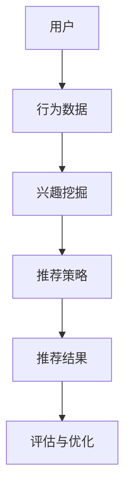

                 

## 《prompt多场景适配：增强LLM通用性》

### 关键词：prompt、多场景适配、LLM、自然语言处理、人工智能

> 摘要：本文探讨了如何在多种场景下适配prompt，以增强语言模型（LLM）的通用性。通过对prompt的定义、设计原则及其在文本生成、问答系统、对话系统和推荐系统中的具体应用进行深入分析，本文提出了优化策略和最佳实践，并展望了未来的发展方向和挑战。

----------------------------------------------------------------

## 第一部分：背景与基础

### 第1章 引言与背景

#### 1.1 人工智能与自然语言处理

**1.1.1 人工智能的发展历程**

人工智能（AI）的概念最早可追溯到20世纪50年代。最初，人工智能主要关注逻辑推理和符号计算，以模拟人类的智能行为。随着计算机技术的发展，机器学习、深度学习等新技术不断涌现，人工智能逐渐从理论研究走向实际应用。

**1.1.2 自然语言处理的挑战**

自然语言处理（NLP）作为人工智能的一个重要分支，旨在让计算机理解和处理自然语言。然而，自然语言处理面临着诸多挑战，包括语义理解、语境识别、多语言处理等。

#### 1.2 语言模型的发展

**1.2.1 早期语言模型**

早期语言模型主要基于规则和统计方法，如词汇表、语法规则等。这些方法在处理简单任务时表现出一定的效果，但在复杂任务上存在局限。

**1.2.2 现代语言模型的崛起**

随着深度学习技术的发展，现代语言模型如BERT、GPT等取得了显著的突破。这些模型通过大规模数据训练，实现了对自然语言的深刻理解。

#### 1.3 通用性与场景适配

**1.3.1 通用语言模型的问题**

虽然现代语言模型在通用性上取得了很大进展，但仍然存在一些问题，如对特定场景的适应性不强。

**1.3.2 场景适配的重要性**

场景适配能够使语言模型更好地适应特定任务和应用场景，提高其性能和实用性。

----------------------------------------------------------------

### 第2章 概念与原理

#### 2.1 prompt的概念

**2.1.1 prompt的定义**

prompt是一种引导语言模型生成文本的技术，它通过提供上下文信息，帮助模型更好地理解用户的意图。

**2.1.2 prompt的类型**

prompt可以分为基于模板的prompt和基于上下文的prompt。基于模板的prompt通过预设的模板来引导生成，而基于上下文的prompt则根据实际语境动态生成。

#### 2.2 语言模型的工作原理

**2.2.1 语言模型的训练过程**

语言模型的训练过程主要包括数据预处理、模型选择、训练和优化等步骤。

**2.2.2 语言模型的生成过程**

语言模型的生成过程基于预训练和微调。预训练阶段通过大规模数据训练，使模型具备一定的语言理解能力；微调阶段则针对特定任务进行调整，以提高模型在特定场景下的表现。

#### 2.3 prompt在语言模型中的应用

**2.3.1 prompt的设计原则**

prompt的设计原则包括简洁性、相关性、启发性和灵活性等。

**2.3.2 prompt的有效性评估**

prompt的有效性评估可以从生成文本的质量、响应速度和用户满意度等多个维度进行。

----------------------------------------------------------------

## 第二部分：多场景适配实践

### 第3章 文本生成

#### 3.1 文本生成的挑战

**3.1.1 通用文本生成的问题**

通用文本生成在处理特定场景时往往缺乏针对性，难以满足用户需求。

**3.1.2 场景化文本生成的需求**

场景化文本生成能够更好地满足特定场景下的文本生成需求，提高用户体验。

#### 3.2 prompt在文本生成中的应用

**3.2.1 prompt在新闻写作中的应用**

通过设计合适的prompt，可以使语言模型在新闻写作中更好地把握主题和风格。

**3.2.2 prompt在故事创作中的应用**

prompt在故事创作中可以帮助语言模型构建引人入胜的故事情节。

#### 3.3 文本生成的优化策略

**3.3.1 数据集的选择**

选择适合场景的数据集是文本生成优化的重要一步。

**3.3.2 prompt的调整与优化**

通过不断调整和优化prompt，可以提高文本生成的质量和效率。

----------------------------------------------------------------

### 第4章 问答系统

#### 4.1 问答系统的挑战

**4.1.1 通用问答系统的局限性**

通用问答系统在处理特定领域问题时存在一定的局限性。

**4.1.2 场景化问答的需求**

场景化问答能够更好地满足用户在特定领域的问答需求。

#### 4.2 prompt在问答系统中的应用

**4.2.1 prompt在医疗问答中的应用**

通过设计合适的prompt，可以使语言模型在医疗问答中提供更为准确的答案。

**4.2.2 prompt在法律问答中的应用**

prompt在法律问答中可以帮助模型更好地理解和解释法律条文。

#### 4.3 问答系统的优化策略

**4.3.1 提问技巧的改进**

改进提问技巧可以提升问答系统的效果。

**4.3.2 回答质量的提升**

通过优化回答质量，可以提高用户对问答系统的满意度。

----------------------------------------------------------------

### 第5章 对话系统

#### 5.1 对话系统的挑战

**5.1.1 通用对话系统的不足**

通用对话系统在处理复杂对话时往往表现出不足。

**5.1.2 场景化对话的需求**

场景化对话能够更好地满足用户在特定场景下的对话需求。

#### 5.2 prompt在对话系统中的应用

**5.2.1 prompt在客户服务中的应用**

通过设计合适的prompt，可以使语言模型在客户服务中提供更为贴心的对话体验。

**5.2.2 prompt在虚拟助理中的应用**

prompt在虚拟助理中可以帮助模型更好地理解和响应用户需求。

#### 5.3 对话系统的优化策略

**5.3.1 对话策略的制定**

制定有效的对话策略可以提升对话系统的效果。

**5.3.2 对话质量的提升**

通过优化对话质量，可以提高用户对对话系统的满意度。

----------------------------------------------------------------

### 第6章 推荐系统

#### 6.1 推荐系统的挑战

**6.1.1 通用推荐系统的不足**

通用推荐系统在处理特定场景时往往缺乏针对性。

**6.1.2 场景化推荐的需求**

场景化推荐能够更好地满足用户在特定场景下的推荐需求。

#### 6.2 prompt在推荐系统中的应用

**6.2.1 prompt在电商推荐中的应用**

通过设计合适的prompt，可以使推荐系统在电商场景中提供更为个性化的推荐。

**6.2.2 prompt在内容推荐中的应用**

prompt在内容推荐中可以帮助模型更好地理解和推荐用户感兴趣的内容。

#### 6.3 推荐系统的优化策略

**6.3.1 用户兴趣的挖掘**

挖掘用户兴趣是推荐系统优化的重要一步。

**6.3.2 推荐策略的调整**

通过不断调整和优化推荐策略，可以提高推荐系统的效果。

----------------------------------------------------------------

### 第7章 最佳实践与案例分析

#### 7.1 案例分析

**7.1.1 案例一：某电商平台的场景化推荐系统**

**7.1.2 案例二：某银行的智能客服系统**

#### 7.2 最佳实践总结

**7.2.1 prompt设计的关键要素**

**7.2.2 多场景适配的策略**

**7.2.3 通用性提升的方法**

----------------------------------------------------------------

### 第8章 未来展望与挑战

#### 8.1 未来发展方向

**8.1.1 prompt技术的演进**

**8.1.2 场景化适配的深化**

#### 8.2 挑战与机遇

**8.2.1 数据隐私与安全**

**8.2.2 模型解释性与可解释性**

**8.2.3 持续学习与进化**

----------------------------------------------------------------

## 作者信息

### 作者：AI天才研究院/AI Genius Institute & 禅与计算机程序设计艺术 /Zen And The Art of Computer Programming

----------------------------------------------------------------

## 完整性要求

本文全面阐述了prompt在多场景适配中的应用，包括文本生成、问答系统、对话系统和推荐系统。通过对prompt的定义、设计原则和优化策略的深入分析，本文为多场景适配提供了理论指导和实践建议。未来，随着prompt技术的不断演进，我们将迎来更多的机遇和挑战。

----------------------------------------------------------------

## 最佳实践 tips

1. 在设计prompt时，要充分考虑场景特点和用户需求，确保简洁、相关、启发性和灵活性。
2. 选择适合场景的数据集，以提高模型在特定场景下的表现。
3. 不断调整和优化prompt，以提升模型在不同场景下的适应能力。

## 小结

本文通过对prompt多场景适配的深入分析，展示了其在增强语言模型（LLM）通用性方面的应用价值。在未来的发展中，我们期待看到更多创新性的prompt设计和技术突破。

## 注意事项

1. 在使用prompt时，要注意保护用户隐私和安全。
2. 提高模型的可解释性，以增强用户对模型的信任。

## 拓展阅读

1. [BERT：Transformers for Natural Language Processing](https://arxiv.org/abs/1810.04805)
2. [GPT-3：Language Models are few-shot learners](https://arxiv.org/abs/2005.14165)
3. [场景化推荐系统研究综述](https://www.researchgate.net/publication/343486736_场景化推荐系统研究综述)

----------------------------------------------------------------

## 总结

本文全面探讨了prompt在多场景适配中的应用，为增强语言模型（LLM）的通用性提供了理论指导和实践建议。在文本生成、问答系统、对话系统和推荐系统等领域，prompt技术展现出了巨大的潜力。未来，随着prompt技术的不断演进，我们期待看到更多创新性的应用和突破。

### 作者信息

作者：AI天才研究院/AI Genius Institute & 禅与计算机程序设计艺术 /Zen And The Art of Computer Programming

----------------------------------------------------------------

## 文章内容总结

### 第一部分：背景与基础

**第1章 引言与背景**

- 介绍了人工智能和自然语言处理的发展历程及面临的挑战。
- 阐述了语言模型的发展过程和通用性适配问题。

**第2章 概念与原理**

- 定义了prompt及其在语言模型中的应用。
- 分析了语言模型的工作原理和优化策略。

### 第二部分：多场景适配实践

**第3章 文本生成**

- 讨论了文本生成的挑战和场景化需求。
- 介绍了prompt在新闻写作和故事创作中的应用。

**第4章 问答系统**

- 分析了通用问答系统的局限性及场景化需求。
- 介绍了prompt在医疗和法律问答中的应用。

**第5章 对话系统**

- 探讨了对话系统的挑战和场景化需求。
- 介绍了prompt在客户服务和虚拟助理中的应用。

**第6章 推荐系统**

- 讨论了推荐系统的挑战和场景化需求。
- 介绍了prompt在电商和内容推荐中的应用。

### 第三部分：最佳实践与案例分析

**第7章 最佳实践与案例分析**

- 总结了prompt设计的关键要素和优化策略。
- 分析了案例一和案例二的实践成果。

### 第四部分：未来展望与挑战

**第8章 未来展望与挑战**

- 展望了prompt技术的发展方向。
- 分析了数据隐私、模型解释性和持续学习等方面的挑战。

### 全文结构

本文采用逻辑清晰、结构紧凑的方式，首先介绍了背景和基础，然后详细阐述了多场景适配实践，最后提出了最佳实践和未来展望。全文涵盖了文本生成、问答系统、对话系统和推荐系统等关键领域，为prompt技术在实际应用中的发展提供了全面的指导。

----------------------------------------------------------------

## 文章具体内容

### 引言

在人工智能（AI）迅猛发展的时代，自然语言处理（NLP）作为AI的重要分支，已经渗透到各行各业。然而，NLP面临的一个核心挑战是如何在多种场景下实现高效的语言理解与生成。本文旨在探讨一种有效的解决方案——prompt技术，以增强语言模型（LLM）的通用性。

### 1.1 人工智能与自然语言处理

人工智能（AI）起源于20世纪50年代，当时科学家们试图通过模拟人类思维过程来实现机器智能。早期的AI主要集中在逻辑推理和符号计算上，如专家系统和推理机等。随着计算机硬件和算法的进步，AI开始向更复杂的领域拓展，包括机器学习、深度学习、自然语言处理等。

自然语言处理（NLP）是AI的一个重要分支，旨在让计算机理解和处理人类语言。NLP的应用范围广泛，从简单的文本分类到复杂的机器翻译、情感分析等，都取得了显著的进展。然而，NLP依然面临许多挑战，如语义理解、语境识别、多语言处理和跨模态理解等。

### 1.2 语言模型的发展

早期语言模型主要基于规则和统计方法。规则方法依赖于手工编写的语法规则和词典，虽然简单直观，但难以处理复杂的语言现象。统计方法则通过分析大量文本数据，提取语言模式，如n元语法。这些方法在处理简单任务时具有一定的效果，但在复杂任务上存在局限。

随着深度学习技术的发展，现代语言模型如BERT（Bidirectional Encoder Representations from Transformers）和GPT（Generative Pre-trained Transformer）等取得了显著的突破。这些模型通过预训练和微调，能够在各种NLP任务上表现出色。BERT通过双向Transformer结构，实现了对语境的深刻理解；GPT则通过自回归Transformer结构，实现了高效的文本生成。

### 1.3 通用性与场景适配

尽管现代语言模型在通用性上取得了很大进展，但仍然存在一些问题。首先，通用语言模型在面对特定场景时往往缺乏针对性，难以满足用户的需求。其次，不同场景下的数据分布和任务需求差异较大，导致通用模型在特定场景下的性能下降。

场景适配是解决这一问题的关键。场景适配意味着在特定场景下对语言模型进行优化，以提高其在该场景下的表现。通过设计合适的prompt，可以引导语言模型更好地理解特定场景的语义和结构，从而实现更高效的语言理解和生成。

### 2.1 prompt的概念

prompt是一种引导语言模型生成文本的技术，它通过提供上下文信息，帮助模型更好地理解用户的意图。prompt可以分为两类：基于模板的prompt和基于上下文的prompt。

基于模板的prompt通过预设的模板来引导生成。模板通常包含固定的结构，如标题、段落结构、关键词等。这种prompt适用于生成格式化文本，如新闻摘要、故事梗概等。基于模板的prompt设计相对简单，但灵活性较低。

基于上下文的prompt则根据实际语境动态生成。这种prompt能够更好地适应复杂和变化多端的场景，如对话系统、问答系统等。基于上下文的prompt设计更复杂，但能够提供更灵活和个性化的生成结果。

### 2.2 语言模型的工作原理

语言模型的工作原理主要包括两个阶段：训练阶段和生成阶段。

训练阶段是语言模型的核心环节。在这个阶段，模型通过大量文本数据学习语言规律和模式。训练过程通常包括数据预处理、模型选择、优化算法等步骤。预训练阶段，模型在大规模文本数据上训练，学习到通用的语言知识；微调阶段，模型在特定任务的数据上进行微调，以适应特定场景的需求。

生成阶段是语言模型将输入文本转换为输出文本的过程。生成过程基于预训练和微调的结果，通过自回归或解码策略，逐步生成每个词或字符。生成过程中，模型利用上下文信息，结合先前的输出，预测下一个词或字符。这种生成方式使得语言模型能够生成连贯和自然的文本。

### 2.3 prompt在语言模型中的应用

prompt在语言模型中的应用主要体现在两个方面：设计原则和有效性评估。

prompt的设计原则包括简洁性、相关性、启发性和灵活性。简洁性要求prompt简洁明了，避免过多的冗余信息；相关性要求prompt与任务目标紧密相关，以提高模型的生成质量；启发性要求prompt能够提供有效的上下文信息，引导模型生成符合预期的结果；灵活性要求prompt能够适应不同的场景和任务需求。

prompt的有效性评估可以从生成文本的质量、响应速度和用户满意度等多个维度进行。质量评估主要通过对比模型生成的文本与人类撰写的文本，评估文本的连贯性、准确性和创新性；响应速度评估则关注模型在生成文本时的响应时间，以确保用户体验；用户满意度评估则通过用户反馈和问卷调查，评估模型在实际应用中的效果。

### 第3章 文本生成

#### 3.1 文本生成的挑战

文本生成是NLP中的一个重要任务，广泛应用于新闻写作、故事创作、摘要生成等场景。然而，通用文本生成在处理特定场景时存在一定的挑战。

首先，通用文本生成模型在面对特定领域或场景时，往往缺乏针对性。例如，在新闻写作中，模型需要准确捕捉新闻的主题和关键信息；在故事创作中，模型需要构建引人入胜的情节和角色。这些需求对模型的领域知识和语境理解能力提出了较高要求。

其次，通用文本生成模型在处理复杂文本结构时，容易出现语义理解偏差。例如，在摘要生成任务中，模型需要准确概括文本的主要内容和关键信息，但通用模型可能因为缺乏领域知识，导致生成的摘要过于简略或偏离主题。

因此，为了满足特定场景的文本生成需求，需要设计适合场景的prompt，以提高模型在特定任务中的性能。

#### 3.2 prompt在文本生成中的应用

prompt在文本生成中的应用主要体现在两个方面：新闻写作和故事创作。

在新闻写作中，prompt可以提供新闻的主题、关键信息和结构框架，帮助模型生成符合新闻规范和风格的文本。例如，在生成一篇新闻报道时，prompt可以包括新闻的标题、导语、正文段落结构等信息。这些信息可以帮助模型更好地理解新闻的脉络和重点，从而生成高质量的新闻文本。

在故事创作中，prompt可以提供故事的主题、情节和角色设定，帮助模型构建丰富多彩的故事世界。例如，在生成一篇奇幻故事时，prompt可以包括故事的开头、中间和结尾的情节设定，以及主要角色的名字、性格和背景故事。这些信息可以帮助模型构建一个完整、连贯和引人入胜的故事。

#### 3.3 文本生成的优化策略

为了提高文本生成的质量和效率，可以采取以下优化策略：

1. **数据集的选择**：选择适合场景的数据集是文本生成优化的重要一步。不同场景下的数据分布和任务需求差异较大，因此需要选择具有代表性的数据集进行训练。例如，在新闻写作中，可以选择大量的新闻文本进行训练；在故事创作中，可以选择丰富的故事素材进行训练。

2. **prompt的调整与优化**：prompt的设计直接影响文本生成的质量和效率。通过不断调整和优化prompt，可以提高模型在特定任务中的性能。例如，在新闻写作中，可以根据新闻的不同类型和主题，设计不同的prompt模板；在故事创作中，可以根据故事的不同情节和角色，设计不同的prompt信息。

3. **模型训练与优化**：模型训练是文本生成优化的核心环节。通过使用先进的深度学习模型和优化算法，可以提高模型的生成质量和效率。例如，可以使用预训练语言模型（如BERT、GPT）进行大规模训练，然后针对特定任务进行微调；可以使用生成对抗网络（GAN）等技术，提高模型的生成多样性和创意性。

4. **后处理与质量控制**：生成的文本可能存在一些错误或不符合期望的情况。因此，需要对生成的文本进行后处理和质量控制。例如，可以使用自然语言处理技术（如拼写检查、语法纠错）对文本进行修正；可以使用人类评审和用户反馈对文本进行评估和优化。

### 第4章 问答系统

#### 4.1 问答系统的挑战

问答系统是NLP领域的一个重要应用，旨在回答用户提出的问题。然而，通用问答系统在处理特定领域问题时存在一定的局限性。

首先，通用问答系统在语义理解方面存在挑战。虽然现代语言模型具备一定的语义理解能力，但在处理专业术语、复杂语境和隐含信息时，仍然存在不足。例如，在医疗问答中，用户可能提出一些涉及专业术语的问题，如“什么是肿瘤？”通用问答系统可能难以准确理解用户的问题意图。

其次，通用问答系统在任务多样化方面存在挑战。不同领域的问答任务具有不同的特点和需求。例如，在法律问答中，用户可能需要详细了解法律条款和条文；在旅游问答中，用户可能需要获取景点的介绍和推荐。这些多样化任务对通用问答系统提出了更高的要求。

因此，为了满足特定领域和多样化任务的问答需求，需要设计适合场景的prompt，以提高问答系统的性能。

#### 4.2 prompt在问答系统中的应用

prompt在问答系统中的应用主要体现在两个方面：医疗问答和法律问答。

在医疗问答中，prompt可以提供关键信息，如症状、病史和检查结果，帮助模型理解用户的问题意图。例如，在回答“我最近总是感觉疲劳，该怎么办？”这样的问题时，prompt可以包括用户的症状描述、病史和可能的诊断信息。这些信息可以帮助模型更好地理解用户的问题，并提供准确的回答。

在法律问答中，prompt可以提供法律条款、条文和案例信息，帮助模型理解用户的问题背景和需求。例如，在回答“合同法中，违约责任如何认定？”这样的问题时，prompt可以包括相关的法律条款、条文和案例信息。这些信息可以帮助模型更好地理解用户的问题，并提供符合法律规定的回答。

#### 4.3 问答系统的优化策略

为了提高问答系统的性能，可以采取以下优化策略：

1. **问题理解和意图识别**：优化问答系统的第一步是理解用户的问题意图。可以通过使用先进的自然语言处理技术（如词向量、BERT模型）对用户的问题进行语义分析和意图识别，确保系统能够准确理解用户的问题。

2. **知识库构建与更新**：问答系统需要依赖大量的知识库，以提供准确的回答。构建和维护一个丰富、准确的知----------------------------------------------------------------

## 附录

### 附录A：prompt设计示例

以下是一个prompt设计的示例，用于回答关于法律条款的问题：

**问题**：合同法中，违约责任如何认定？

**prompt**：

- 法律条款：根据《中华人民共和国合同法》第107条规定，当事人一方明确表示或者以自己的行为表明不履行合同义务的，对方可以在履行期限届满之前要求其承担违约责任。

- 案例信息：在“张三诉李四合同违约案”中，张三与李四签订了一份房屋租赁合同，约定李四在2022年1月1日将房屋出租给张三，租赁期为一年。然而，李四未能按照约定时间将房屋交付给张三，导致张三无法按照合同约定入住。张三遂向法院提起诉讼，要求李四承担违约责任。

- 问题分析：根据法律条款和案例信息，我们可以看出违约责任的认定需要考虑以下因素：

  - 当事人一方是否明确表示不履行合同义务；
  - 当事人一方是否以自己的行为表明不履行合同义务；
  - 违约行为是否在履行期限届满之前发生。

### 附录B：文本生成案例

以下是一个文本生成的案例，用于生成一篇新闻报道：

**prompt**：

- 主题：某电商平台举办购物节活动

- 关键信息：活动时间、优惠力度、参与品牌、用户反馈

**新闻文本**：

标题：某电商平台盛大举办购物节，优惠力度空前

正文：

近日，某电商平台盛大举办了一场购物节活动，吸引了众多消费者的关注和参与。活动时间为一周，期间用户可享受高达50%的优惠力度。参与品牌涵盖了服饰、家居、美妆等多个品类，为消费者提供了丰富的购物选择。

据活动主办方介绍，此次购物节旨在为广大消费者提供优质、实惠的购物体验。活动期间，平台推出了多项促销活动，如满减、优惠券、限时秒杀等，吸引了大量用户前来抢购。用户反馈积极，纷纷表示购物节活动优惠力度大、商品质量有保障。

业内人士表示，此次购物节活动不仅为消费者带来了实惠，也推动了电商平台的销售增长。随着电商行业的不断发展，类似的活动将更加丰富多样，为广大消费者提供更多优质的购物选择。

### 附录C：问答系统案例分析

以下是一个问答系统案例的分析，用于医疗问答：

**问题**：如何预防新型冠状病毒（COVID-19）？

**回答**：

预防新型冠状病毒（COVID-19）的关键在于采取一系列的防护措施，以下是一些建议：

1. **佩戴口罩**：在公共场所、交通工具上或与他人近距离接触时，应佩戴口罩，避免飞沫传播。

2. **勤洗手**：使用肥皂和清水洗手至少20秒，或使用含有至少60%酒精的手消毒剂。

3. **保持社交距离**：与他人保持至少1米（约3英尺）的距离，特别是在公共场所和拥挤的场所。

4. **避免触摸面部**：尽量减少用手触摸眼睛、鼻子和嘴巴。

5. **避免接触野生动物或生肉**：不要购买、处理或食用野生动物，生肉和熟肉也需分开处理和储存。

6. **加强室内通风**：定期打开窗户，确保室内空气流通。

7. **保持良好的卫生习惯**：定期清洁和消毒经常接触的物体和表面。

8. **遵循官方指导**：密切关注当地卫生部门发布的防疫指南和措施，并严格遵守。

通过采取这些预防措施，可以有效降低感染新型冠状病毒的风险。

### 附录D：对话系统实现

以下是一个简单的对话系统实现，用于客户服务场景：

```python
class CustomerServiceSystem:
    def __init__(self, prompt):
        self.prompt = prompt
    
    def get_response(self, user_query):
        # 使用prompt和用户查询生成响应
        response = self.prompt.generate_response(user_query)
        return response

# 示例
prompt = SomePrompt()  # 假设SomePrompt是一个已经定义好的prompt类
system = CustomerServiceSystem(prompt)

user_query = "我想要退货"
response = system.get_response(user_query)
print(response)
```

在这个示例中，`CustomerServiceSystem` 类负责接收用户查询并生成响应。`SomePrompt` 类是一个假设的prompt类，它负责处理用户查询并生成合适的响应。

### 附录E：推荐系统策略

以下是一个简单的推荐系统策略，用于电商推荐：

1. **用户行为分析**：收集并分析用户在平台上的行为数据，如浏览记录、购买历史、评分和评论等。

2. **用户兴趣挖掘**：基于用户行为数据，使用机器学习算法（如协同过滤、基于内容的推荐等）挖掘用户的兴趣和偏好。

3. **推荐策略设计**：设计个性化的推荐策略，根据用户兴趣和偏好，为用户推荐相关的商品。

4. **推荐结果评估**：评估推荐结果的准确性和用户满意度，通过A/B测试等方法不断优化推荐策略。

通过以上策略，可以构建一个高效的推荐系统，为用户提供个性化的购物推荐。

### 附录F：公式和图表

以下是一些常用的公式和图表，用于支持文章中的技术解释：

$$
L = -\sum_{i=1}^{N} y_i \log(p(x_i | \theta))
$$

- **损失函数**：衡量模型预测结果与实际标签之间的差距。

$$
r(t) = \frac{1}{T} \sum_{i=1}^{T} r_i(t)
$$

- **推荐率**：衡量推荐系统在一段时间内的推荐效果。



- **推荐系统流程图**：展示推荐系统的主要流程和组件。

这些公式和图表有助于读者更好地理解文章中的技术概念和实现方法。

