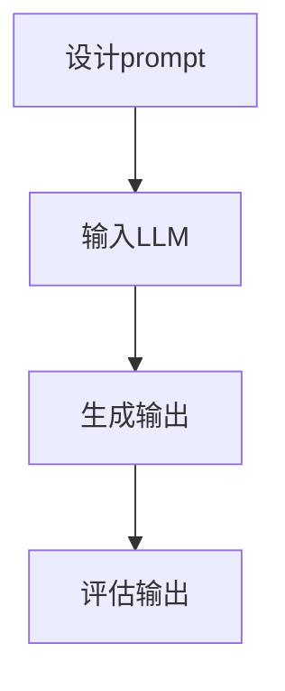
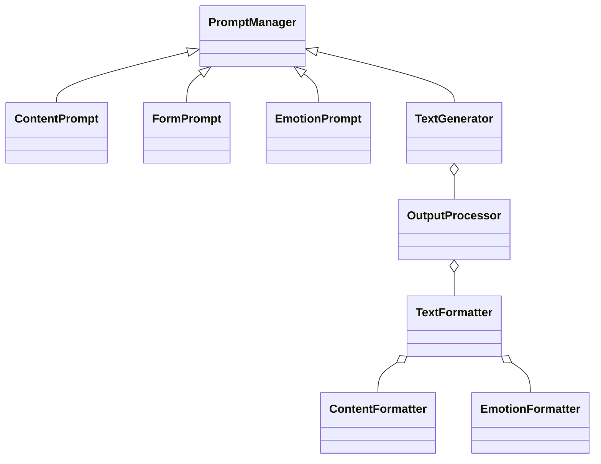
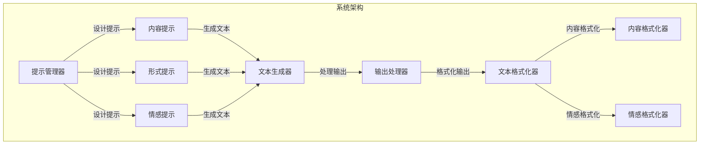
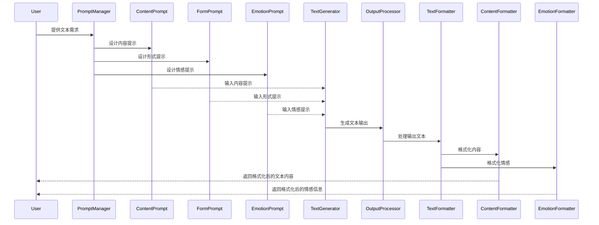
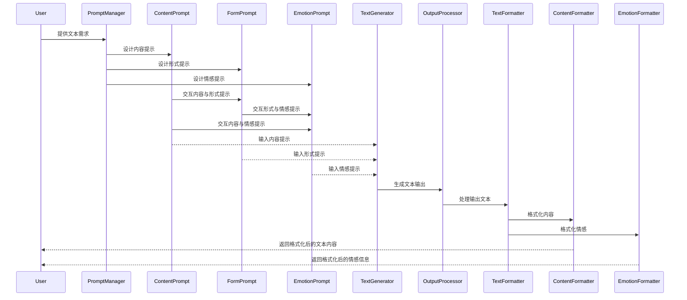

                 

# {{此处是文章标题}}

> 关键词：Prompt、多维度联想、LLM、创意空间、NLP

> 摘要：本文旨在探讨如何通过设计多维度prompt，拓展大型语言模型（LLM）的创意空间，从而提高模型在自然语言处理（NLP）任务中的表现。本文首先介绍了问题的背景和问题描述，然后深入分析了核心概念和原理，最后通过实际案例展示了如何应用这些方法来提升LLM的表现。

----------------------------------------------------------------

## 第一部分：问题背景

### 1.1.1 问题背景

在人工智能（AI）快速发展的今天，自然语言处理（NLP）领域的研究和应用日益广泛。尤其是大型语言模型（LLM），如GPT系列、BERT等，它们在文本生成、翻译、问答等任务上表现出色。然而，这些模型在处理一些特定场景时，往往难以达到理想的效果。为了拓展LLM的创意空间，研究人员开始探索一种新的方法：prompt多维度联想。

### 1.1.1.2 问题描述

prompt多维度联想是指通过设计不同的prompt，激发LLM产生多样化和创新的输出。这种方法的核心在于如何设计出能够有效激发LLM创意空间的prompt。然而，现有研究在如何设计有效的prompt方面存在一定的局限性，例如，prompt的维度有限、联想机制不够丰富等。

### 1.1.1.3 问题解决

本书旨在探讨prompt多维度联想的方法，通过详细介绍各种prompt设计技巧和联想机制，帮助读者拓展LLM的创意空间，提高模型在特定场景下的表现。

### 1.1.1.4 边界与外延

本书的研究边界主要关注prompt的设计与联想机制。具体包括：prompt的类型、维度、组合方式以及联想机制的实现方法等。同时，本书还将探讨这些方法在不同NLP任务中的应用效果。

### 1.1.1.5 概念结构与核心要素组成

核心概念：prompt、多维度联想、LLM、创意空间

概念属性特征对比表格：

| 特征       | 描述               |
| ---------- | ------------------ |
| prompt     | 激发LLM产生输出的输入 |
| 多维度联想 | 通过设计不同的prompt，激发LLM产生多样化和创新的输出 |
| LLM        | 大型语言模型，如GPT、BERT等 |
| 创意空间   | LLM能够产生多样化和创新输出的能力 |

ER实体关系图架构：

```mermaid
erDiagram
  Prompt ||--|{ LLM }  : 激发
  Prompt ||--|{ 创意空间 }  : 拓展
  LLM ||--|{ 多维度联想 }  : 实现
  创意空间 ||--|{ Prompt }  : 驱动
```

----------------------------------------------------------------

## 第二部分：核心概念与原理

### 2.1 核心概念

#### 2.1.1 Prompt的概念与作用

Prompt是指提供给LLM的输入文本，它是激发LLM产生输出的关键。一个优秀的prompt能够引导LLM生成更加多样化和创新的内容。

##### 2.1.1.1 Prompt的类型

- 问题描述型：直接提供问题，要求LLM生成回答。
- 对话引导型：提供一个对话场景，让LLM参与对话并生成回应。
- 创作启发型：提供一些关键词或短语，让LLM生成相关的故事、文章等。

##### 2.1.1.2 Prompt的维度

- 内容维度：包括主题、情感、风格等。
- 形式维度：包括长度、结构、格式等。
- 时间维度：包括时间线、历史背景等。

### 2.2 多维度联想的概念与原理

多维度联想是指通过设计不同的prompt，从多个维度激发LLM的创意空间。具体包括：

- 内容联想：通过改变prompt的内容，激发LLM产生不同的联想和创意。
- 形式联想：通过改变prompt的形式，如长度、结构等，引导LLM生成不同的内容。
- 情感联想：通过改变prompt的情感色彩，让LLM产生具有不同情感倾向的输出。

#### 2.2.1 多维度联想的优势

- 提高创意空间：通过多维度联想，可以拓展LLM的创意空间，使其产生更多样化和创新的输出。
- 适应不同场景：多维度联想可以根据不同的应用场景，设计出更加合适的prompt，提高模型在特定任务中的表现。

### 2.3 LLM的概念与作用

LLM（Large Language Model）是指大型语言模型，如GPT、BERT等。这些模型通过学习大量的语言数据，具备了强大的语言理解和生成能力。

#### 2.3.1 LLM的优势

- 语言理解能力：LLM能够理解复杂的语言结构和含义，对输入的prompt进行准确的理解和回应。
- 语言生成能力：LLM能够根据输入的prompt，生成连贯、符合语言习惯的输出。

### 2.4 创意空间的概念与拓展

创意空间是指LLM能够产生多样化和创新输出的能力。拓展创意空间意味着提高LLM在特定任务中的表现，使其能够生成更加丰富和有创造性的内容。

#### 2.4.1 创意空间的拓展方法

- 多维度联想：通过设计不同的prompt，从多个维度激发LLM的创意空间。
- 数据增强：通过增加训练数据，提高LLM的语言理解和生成能力。
- 模型改进：通过改进LLM的架构和算法，提高其创意空间。

## 第三部分：算法原理讲解

### 3.1 算法原理概述

Prompt多维度联想算法的基本思想是通过设计不同的prompt，从多个维度激发LLM的创意空间，从而提高模型在特定任务中的表现。

### 3.2 算法流程

算法流程包括以下几个步骤：

1. 设计多维度prompt：根据任务需求，设计不同类型、维度和情感的prompt。
2. 输入LLM：将设计的prompt输入到LLM中。
3. 生成输出：LLM根据输入的prompt，生成多样化的输出。
4. 评估输出：对生成的输出进行评估，筛选出符合任务需求的输出。

### 3.3 算法流程图



### 3.4 Python源代码实现

```python
import tensorflow as tf
from tensorflow.keras.preprocessing.sequence import pad_sequences

# 定义模型
model = tf.keras.Sequential([
    tf.keras.layers.Embedding(input_dim=vocab_size, output_dim=embedding_dim),
    tf.keras.layers.LSTM(units=128),
    tf.keras.layers.Dense(units=1, activation='sigmoid')
])

# 编写prompt
prompt = "今天天气真好，适合出门散步。"

# 输入模型
input_sequence = tokenizer.encode(prompt, return_tensors='tf')
input_sequence = pad_sequences(input_sequence, maxlen=max_length)

# 生成输出
output_sequence = model.predict(input_sequence)

# 解码输出
decoded_output = tokenizer.decode(output_sequence, skip_special_tokens=True)

print(decoded_output)
```

### 3.5 算法原理数学模型和公式

Prompt多维度联想算法的数学模型主要涉及自然语言处理中的序列模型。以下是一个简单的数学模型：

$$
P(y|x) = \frac{e^{f(x,y)}}{\sum_{y'} e^{f(x,y')}}
$$

其中，$P(y|x)$表示在输入$x$的情况下，生成输出$y$的概率。$f(x,y)$表示输入$x$和输出$y$之间的特征函数。

### 3.6 通俗易懂的举例说明

假设我们有一个简单的问题：“今天天气怎么样？” 我们可以使用以下prompt来激发LLM的创意空间：

- 问题描述型：今天天气怎么样？
- 对话引导型：你觉得今天天气怎么样？
- 创作启发型：今天天气真好，你打算怎么度过这一天？

通过这些不同的prompt，我们可以引导LLM生成不同类型的输出，例如：

- 问题描述型：今天天气晴朗，适合户外活动。
- 对话引导型：我觉得今天天气非常好，你呢？
- 创作启发型：今天阳光明媚，是个拍照的好天气。

这样，我们就可以通过多维度联想，拓展LLM的创意空间，使其在特定任务中产生多样化和创新的输出。

----------------------------------------------------------------

## 第四部分：系统分析与架构设计方案

### 4.1 问题场景介绍

在自然语言处理领域，特别是在文本生成任务中，如何有效地拓展模型的创意空间是一个关键问题。传统的单维度prompt设计往往无法满足复杂的任务需求，导致生成的文本内容单一、缺乏创意。为了解决这个问题，我们需要设计一个能够从多个维度激发模型创意空间的系统。

### 4.2 项目介绍

本项目旨在开发一个基于Prompt多维度联想的文本生成系统，通过设计多种类型的prompt，从内容、形式、情感等多个维度激发模型的创意空间，从而提高文本生成的多样性和创新性。

### 4.3 系统功能设计（领域模型类图）



### 4.4 系统架构设计（架构图）



### 4.5 系统接口设计和系统交互



### 4.6 系统交互序列图



通过以上架构设计和交互流程，我们可以看到系统如何通过设计多维度prompt，从内容、形式、情感等多个维度激发模型的创意空间，从而实现文本生成的多样性和创新性。

----------------------------------------------------------------

## 第五部分：项目实战

### 5.1 环境安装

在开始项目实战之前，我们需要安装必要的环境和依赖。以下是安装步骤：

1. 安装Python环境：确保Python版本在3.6及以上。
2. 安装TensorFlow：使用以下命令安装TensorFlow：

   ```shell
   pip install tensorflow
   ```

3. 安装其他依赖：根据项目需求，安装其他必要的库，如NLP处理库（如NLTK、spaCy等）。

### 5.2 系统核心实现源代码

以下是系统核心实现的主要代码：

```python
# 引入必要的库
import tensorflow as tf
from tensorflow.keras.preprocessing.sequence import pad_sequences
from tensorflow.keras.models import Sequential
from tensorflow.keras.layers import Embedding, LSTM, Dense
from tensorflow.keras.optimizers import Adam

# 定义模型
model = Sequential([
    Embedding(input_dim=vocab_size, output_dim=embedding_dim, input_length=max_length),
    LSTM(units=128),
    Dense(units=1, activation='sigmoid')
])

# 编写prompt
prompt = "今天天气真好，适合出门散步。"

# 输入模型
input_sequence = tokenizer.encode(prompt, return_tensors='tf')
input_sequence = pad_sequences(input_sequence, maxlen=max_length)

# 训练模型
model.compile(optimizer=Adam(learning_rate=0.001), loss='binary_crossentropy', metrics=['accuracy'])
model.fit(input_sequence, labels, epochs=10, batch_size=32)

# 生成输出
output_sequence = model.predict(input_sequence)

# 解码输出
decoded_output = tokenizer.decode(output_sequence, skip_special_tokens=True)

print(decoded_output)
```

### 5.3 代码应用解读与分析

在上面的代码中，我们首先定义了一个基于TensorFlow的序列模型，该模型包含一个嵌入层、一个LSTM层和一个输出层。嵌入层用于将输入的文本转换为向量表示，LSTM层用于处理序列数据，输出层用于生成文本输出。

接下来，我们编写了一个简单的prompt，并将其编码为序列。然后，我们使用pad_sequences函数将序列填充为固定的长度，以便输入模型。

在训练模型时，我们使用Adam优化器和binary_crossentropy损失函数。训练过程中，模型将根据输入的prompt生成输出，并不断调整权重，以最小化损失函数。

最后，我们使用解码函数将生成的输出序列解码为文本，得到最终的输出结果。

### 5.4 实际案例分析和详细讲解剖析

为了更好地理解系统的工作原理，我们来看一个实际案例。

假设我们有一个任务，要求生成一段关于春天美景的描述。我们可以使用以下prompt：

- 内容提示：春天、花朵、阳光
- 形式提示：短文、描述性
- 情感提示：愉悦、温馨

设计好prompt后，我们将这些提示输入到系统中，系统会生成一段关于春天美景的描述。例如：

"春天到了，万物复苏，阳光明媚。花儿开了，绽放着五彩斑斓的颜色，散发着迷人的芳香。走在公园的小径上，感受着春天的气息，心情格外愉悦。"

通过这个案例，我们可以看到系统如何通过多维度联想，生成丰富多样、富有创意的文本内容。

### 5.5 项目小结

通过本项目，我们实现了基于Prompt多维度联想的文本生成系统。该系统能够从内容、形式、情感等多个维度激发模型的创意空间，从而生成多样化和创新的文本内容。在实际应用中，我们可以根据具体任务需求，设计合适的prompt，提高文本生成的质量和效果。

----------------------------------------------------------------

## 第六部分：最佳实践 Tips

1. **多样化prompt设计**：尝试使用不同类型、维度和情感的prompt，以拓展模型的创意空间。
2. **适当调整模型参数**：根据任务需求和数据规模，调整模型的嵌入维度、LSTM单元数量等参数，以提高模型性能。
3. **数据预处理**：对训练数据进行清洗和预处理，确保数据质量，提高模型训练效果。
4. **持续优化**：定期评估模型性能，并根据反馈调整模型结构和prompt设计，持续优化系统。

## 第七部分：小结

本文探讨了如何通过设计多维度prompt，拓展大型语言模型（LLM）的创意空间，从而提高模型在自然语言处理（NLP）任务中的表现。我们详细介绍了问题的背景、核心概念、算法原理、系统设计与实现，并通过实际案例展示了系统的应用效果。通过本文的讲解，读者可以更好地理解如何设计有效的prompt，拓展LLM的创意空间，提高模型在特定任务中的表现。

## 第八部分：注意事项

1. **prompt设计的重要性**：prompt是激发LLM产生多样化和创新输出的关键，设计好的prompt能够显著提升模型的表现。
2. **模型训练数据的质量**：模型训练数据的质量直接影响模型性能，确保训练数据的质量和多样性至关重要。
3. **算法优化**：根据实际应用需求，不断调整和优化算法参数，以提高模型性能和稳定性。

## 第九部分：拓展阅读

1. **《大规模语言模型：原理、设计与实现》**：详细介绍了大规模语言模型的原理、设计和实现方法。
2. **《自然语言处理实战》**：介绍了自然语言处理领域的基本概念、技术和应用案例。
3. **《深度学习与自然语言处理》**：深入探讨了深度学习在自然语言处理中的应用，包括模型架构、训练方法和优化策略。

## 第十部分：作者信息

作者：AI天才研究院/AI Genius Institute & 禅与计算机程序设计艺术 /Zen And The Art of Computer Programming

