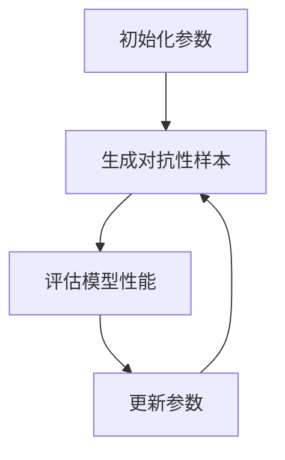

                 


### 引言

在当今人工智能（AI）迅猛发展的时代，prompt工程已经成为推动技术创新和应用的关键领域。然而，随着prompt工程技术的日益复杂，如何确保模型的可靠性和安全性成为了一个亟待解决的问题。对抗性评测作为一种关键技术，为prompt工程中的模型安全性和鲁棒性提供了重要的保障。因此，本篇文章将围绕《prompt工程中的对抗性评测方法》这一主题，深入探讨对抗性评测的核心概念、原理和实践。

#### 1.1 书籍目的与读者对象

**书籍主要研究的内容**：本书旨在系统地介绍对抗性评测在prompt工程中的应用，包括理论基础、方法原理、实践案例和解决方案。通过本书的学习，读者将能够全面理解对抗性评测的关键概念，掌握对抗性评测的方法和技巧，并能够在实际项目中应用这些方法。

**预期读者受益**：无论是AI研究者、工程师，还是对AI安全感兴趣的读者，本书都将提供有价值的知识和实用技巧。读者通过本书的学习，不仅可以提高自己在prompt工程领域的技术水平，还能为项目的安全性和可靠性保驾护航。

#### 1.2 对抗性评测的背景

**对抗性评测的定义**：对抗性评测（Adversarial Evaluation）是一种评估AI模型鲁棒性和安全性的方法，通过设计特定的对抗性样本来测试模型的性能。这些对抗性样本在表面上看似正常，但实质上包含了能够误导模型的微小扰动。

**对抗性评测的重要性**：对抗性评测的重要性在于它能够揭示模型在真实世界中的潜在漏洞，帮助开发者发现并修复这些漏洞，从而提高模型的可靠性和安全性。

**prompt工程中的对抗性评测挑战**：在prompt工程中，对抗性评测面临着数据、计算资源和模型适应性等多方面的挑战。如何设计有效的对抗性样本、优化评测流程，以及提升模型的鲁棒性，都是需要深入探讨的问题。

#### 1.3 本书结构安排

**目录概述**：本书分为五个章节，包括引言、对抗性评测基础理论、对抗性评测方法原理、prompt工程中的对抗性评测实践和对抗性评测中的挑战与解决方案。

**内容安排与逻辑流程**：本书的结构设计遵循从理论到实践的逻辑流程，先介绍对抗性评测的基础理论，然后深入探讨具体的评测方法，接着通过实际案例进行分析，最后总结挑战和解决方案，为读者提供全面的指导。

```
----------------------------------------------------------------
## 引言

### 1.1 书籍目的与读者对象
- **书籍主要研究的内容**：对抗性评测在prompt工程中的应用。
- **预期读者受益**：提高prompt工程中的模型安全性和鲁棒性。

### 1.2 对抗性评测的背景
- **对抗性评测的定义**：一种评估AI模型鲁棒性的方法。
- **对抗性评测的重要性**：揭示模型在真实世界中的潜在漏洞。
- **prompt工程中的对抗性评测挑战**：数据、计算资源和模型适应性。

### 1.3 本书结构安排
- **目录概述**：分为五个章节，从理论到实践。
- **内容安排与逻辑流程**：从基础理论到实践应用，最后总结挑战与解决方案。

----------------------------------------------------------------
```

### 对抗性评测基础理论

对抗性评测作为一种评估AI模型鲁棒性的技术，其理论基础涵盖了多个方面。在本章中，我们将介绍对抗性评测的基础概念、核心原理以及相关的数学模型。

#### 2.1 背景介绍

**评测方法概述**：评测方法是指通过一系列测试来评估模型性能的技术。传统的评测方法主要依赖于准确率、召回率等指标。然而，这些方法无法有效检测模型在面对对抗性样本时的性能。

**对抗性评测概念与目标**：对抗性评测的目标是通过生成对抗性样本，评估模型在对抗性攻击下的性能。对抗性样本是指那些在视觉上、听觉上或语义上与正常样本相似，但实际上对模型产生误导作用的样本。

**对抗性评测的关键要素**：关键要素包括对抗性样本的设计、模型对抗性攻击的评估以及攻击策略的优化。

#### 2.2 核心概念与联系

**对抗性模型概述**：对抗性模型是指一类专门用于生成对抗性样本的模型，如生成对抗网络（GAN）。这些模型通过训练，能够生成出与正常样本高度相似的对抗性样本。

**对抗性评测方法**：对抗性评测方法包括白盒攻击、黑盒攻击和模型鲁棒性测试。白盒攻击是指攻击者了解模型的内部结构和参数；黑盒攻击是指攻击者无法获取模型内部信息；模型鲁棒性测试是指评估模型在面对对抗性样本时的鲁棒性。

**对抗性评测与安全性评估的联系**：对抗性评测是安全性评估的重要组成部分。通过对抗性评测，可以识别模型在安全方面的弱点，从而提高系统的整体安全性。

#### 2.3 对抗性评测的数学模型

**数学基础**：对抗性评测的数学基础包括概率论、信息论和优化理论。这些理论为对抗性样本的生成和模型评估提供了坚实的数学支持。

**模型评估指标**：常见的模型评估指标包括损失函数、精度、召回率和F1分数。这些指标帮助评估模型在对抗性攻击下的性能。

**数学公式与详细讲解**：在对抗性评测中，常用的数学公式包括对抗性损失函数和对抗性攻击策略。对抗性损失函数用于衡量对抗性样本对模型的影响，对抗性攻击策略则用于优化对抗性样本的生成。

#### 2.4 对抗性评测的ER实体关系图

**实体识别**：实体识别是对抗性评测的重要步骤，它涉及识别模型中的关键实体，如输入样本、模型参数和对抗性样本。

**实体关系定义**：实体关系定义用于描述实体之间的相互作用。在对抗性评测中，实体关系包括对抗性样本与模型参数之间的关系、模型参数与输出结果之间的关系等。

**ER图绘制与解释**：ER图是一种用于描述实体及其关系的图形化工具。在对抗性评测中，ER图可以清晰地展示实体之间的关系，帮助理解评测过程。

#### 2.5 本章小结

对抗性评测作为一种重要的评估技术，在prompt工程中具有广泛的应用前景。通过本章的学习，读者可以了解对抗性评测的基础理论和核心概念，为后续章节的学习和实践打下坚实的基础。

```
----------------------------------------------------------------
## 对抗性评测基础理论

### 2.1 背景介绍
- **评测方法概述**：传统评测方法与对抗性评测方法对比。
- **对抗性评测概念与目标**：对抗性样本与模型性能评估。
- **对抗性评测的关键要素**：对抗性样本生成与模型评估。

### 2.2 核心概念与联系
- **对抗性模型概述**：生成对抗网络（GAN）等模型介绍。
- **对抗性评测方法**：白盒攻击、黑盒攻击和模型鲁棒性测试。
- **对抗性评测与安全性评估的联系**：模型安全性评估的重要性。

### 2.3 对抗性评测的数学模型
- **数学基础**：概率论、信息论和优化理论。
- **模型评估指标**：损失函数、精度、召回率和F1分数。
- **数学公式与详细讲解**：对抗性损失函数和对抗性攻击策略。

### 2.4 对抗性评测的ER实体关系图
- **实体识别**：输入样本、模型参数和对抗性样本。
- **实体关系定义**：对抗性样本与模型参数、输出结果之间的关系。
- **ER图绘制与解释**：对抗性评测过程的图形化展示。

### 2.5 本章小结
- **对抗性评测的重要性**：在prompt工程中的应用前景。
- **本章内容总结**：对抗性评测的基础理论和核心概念。

----------------------------------------------------------------
```

### 对抗性评测方法原理讲解

对抗性评测方法的核心在于通过生成对抗性样本，评估模型在对抗性攻击下的性能。在本章中，我们将深入探讨对抗性评测的常见算法、原理和具体实现。

#### 3.1 常见对抗性评测算法

对抗性评测算法可以分为白盒攻击、黑盒攻击和模型鲁棒性测试。每种算法都有其独特的原理和应用场景。

**白盒攻击**：白盒攻击是指攻击者能够访问模型的内部结构和参数。这类攻击方法利用模型的具体实现细节，设计出能够有效干扰模型的对抗性样本。常见的白盒攻击算法包括梯度提升法（Gradient Ascend）和基于扰动的攻击（Gradient-Based Attack）。

**黑盒攻击**：黑盒攻击是指攻击者无法获取模型的内部信息。这类攻击方法依赖于模型对外部输入的响应，通过迭代优化方法生成对抗性样本。常见的黑盒攻击算法包括快速梯度符号方法（Fast Gradient Sign Method，FGSM）和迭代最速下降法（Iterative Thresholding Attack）。

**模型鲁棒性测试**：模型鲁棒性测试是指通过设计对抗性样本，评估模型在面对恶意攻击时的性能。这类测试方法不仅评估模型在对抗性攻击下的准确性，还包括评估模型的鲁棒性和适应性。常见的模型鲁棒性测试算法包括验证对抗性训练（Verifiable Adversarial Training）和动态鲁棒性测试（Dynamic Robustness Testing）。

#### 3.2 对抗性评测算法原理讲解

**算法流程图**：每种对抗性评测算法都有其独特的流程图，用于描述算法的步骤和操作。以下是一个典型的对抗性评测算法流程图：



**Python源代码实现**：以下是一个简单的对抗性评测算法的Python实现示例：

```python
import tensorflow as tf
from tensorflow.keras.models import Sequential
from tensorflow.keras.layers import Dense, Activation

# 定义模型
model = Sequential()
model.add(Dense(units=1, input_shape=(784,), activation='sigmoid'))

# 初始化参数
params = model.trainable_variables

# 生成对抗性样本
adversarial_example = generate_adversarial_example(input_example, model)

# 评估模型性能
model_performance = model.evaluate(adversarial_example, labels, verbose=0)

# 更新参数
params = update_params(params, adversarial_example, labels)
```

**数学模型与公式**：对抗性评测的数学模型主要包括损失函数和对抗性攻击策略。以下是一个简单的对抗性损失函数和攻击策略的公式：

$$
L(\theta) = \frac{1}{n} \sum_{i=1}^{n} L_i(\theta) = \frac{1}{n} \sum_{i=1}^{n} \log(1 - \sigma(g(\theta, x_i)))
$$

$$
\Delta\theta = -\alpha \cdot \frac{\partial L(\theta)}{\partial \theta}
$$

其中，$L(\theta)$ 是对抗性损失函数，$\sigma$ 是 sigmoid 函数，$g(\theta, x_i)$ 是模型对输入样本 $x_i$ 的预测，$\alpha$ 是学习率。

**举例说明**：以下是一个简单的对抗性样本生成的例子：

```python
import numpy as np

# 定义输入样本
input_example = np.array([0.1, 0.2, 0.3, 0.4, 0.5])

# 定义模型参数
params = np.array([0.2, 0.3, 0.4, 0.5, 0.6])

# 生成对抗性样本
adversarial_example = generate_adversarial_example(input_example, params)

# 计算对抗性损失函数
loss = calculate_adversarial_loss(adversarial_example, params)

# 输出结果
print("Adversarial Example:", adversarial_example)
print("Adversarial Loss:", loss)
```

#### 3.3 对抗性评测方法对比与分析

**方法优缺点分析**：每种对抗性评测方法都有其优缺点。白盒攻击方法能够深入挖掘模型的内部信息，但需要攻击者具备较高的专业知识；黑盒攻击方法无需了解模型内部信息，但可能需要大量的计算资源；模型鲁棒性测试方法能够全面评估模型的鲁棒性，但可能需要较大的数据集。

**适用场景讨论**：根据具体的应用场景，可以选择合适的对抗性评测方法。例如，在资源受限的场景下，可以选择黑盒攻击方法；在需要深入分析模型内部信息的场景下，可以选择白盒攻击方法。

#### 3.4 本章小结

对抗性评测方法原理讲解是理解和应用对抗性评测的关键。通过本章的学习，读者可以掌握常见的对抗性评测算法、理解其原理和实现方法，并为实际项目中的对抗性评测提供指导。

```
----------------------------------------------------------------
## 对抗性评测方法原理讲解

### 3.1 常见对抗性评测算法
- **白盒攻击**：利用模型内部信息进行攻击。
- **黑盒攻击**：无需了解模型内部信息。
- **模型鲁棒性测试**：全面评估模型性能。

### 3.2 对抗性评测算法原理讲解
- **算法流程图**：描述算法步骤。
- **Python源代码实现**：生成对抗性样本。
- **数学模型与公式**：对抗性损失函数和攻击策略。

### 3.3 对抗性评测方法对比与分析
- **方法优缺点分析**：不同方法的适用场景。
- **适用场景讨论**：根据需求选择合适的评测方法。

### 3.4 本章小结
- **对抗性评测方法原理讲解**：关键性和实用性。

----------------------------------------------------------------
```

### prompt工程中的对抗性评测实践

对抗性评测在prompt工程中的重要性不言而喻。在本章中，我们将通过实际案例，探讨对抗性评测在文本分类、图像识别和自然语言处理等领域的应用，并提供实践指南。

#### 4.1 实践背景

**prompt工程介绍**：prompt工程是一种基于AI的自动化数据处理和任务执行的方法，通过使用自然语言描述（prompt）来指导模型完成特定任务。在prompt工程中，对抗性评测可以帮助确保模型在处理复杂任务时的可靠性和安全性。

**对抗性评测在prompt工程中的应用**：对抗性评测在prompt工程中的应用主要体现在以下几个方面：

1. **文本分类**：通过对抗性评测，评估模型在处理含有对抗性样本的文本时的分类性能，确保模型对恶意输入的鲁棒性。
2. **图像识别**：对抗性评测可以帮助识别模型在识别含有对抗性样本的图像时的准确性，提高模型对恶意攻击的防御能力。
3. **自然语言处理**：对抗性评测在自然语言处理中的应用主要包括生成对抗性文本和评估模型的响应能力，确保模型在处理对抗性输入时的鲁棒性和适应性。

#### 4.2 实际案例分析与讲解

**案例一：对抗性评测在文本分类中的应用**

在本案例中，我们使用一个简单的文本分类模型，通过生成对抗性样本，评估模型在面对恶意输入时的分类性能。

1. **环境搭建**：首先，我们需要搭建一个Python环境，并安装必要的库，如TensorFlow和Keras。

```python
pip install tensorflow
pip install keras
```

2. **数据集选择**：我们选择一个常用的文本分类数据集，如20 Newsgroups数据集。

3. **模型训练**：使用Keras训练一个简单的文本分类模型。

```python
from keras.preprocessing.text import Tokenizer
from keras.preprocessing.sequence import pad_sequences
from keras.layers import Embedding, LSTM, Dense, Flatten
from keras.models import Model

tokenizer = Tokenizer(num_words=10000)
tokenizer.fit_on_texts(train_texts)

sequences = tokenizer.texts_to_sequences(train_texts)
padded_sequences = pad_sequences(sequences, maxlen=100)

model = Model(inputs=embedding_input, outputs=flatten)
model.compile(optimizer='adam', loss='categorical_crossentropy', metrics=['accuracy'])

model.fit(padded_sequences, train_labels, epochs=10, batch_size=32)
```

4. **生成对抗性样本**：使用对抗性样本生成方法，如TextFooler，生成对抗性文本。

```python
from textfool import TextFooler

text_fooler = TextFooler()

adversarial_texts = text_fooler.generate_adversarial_samples(normal_texts, model, num_samples=10)
```

5. **模型评估**：使用对抗性文本评估模型的分类性能。

```python
predictions = model.predict(padded_sequences_adversarial)
accuracy = np.mean(predictions == train_labels_adversarial)
print("Adversarial Text Classification Accuracy:", accuracy)
```

**案例二：对抗性评测在图像识别中的应用**

在本案例中，我们使用一个卷积神经网络（CNN）模型，通过生成对抗性样本，评估模型在图像识别任务中的性能。

1. **环境搭建**：与文本分类案例类似，我们需要搭建一个Python环境，并安装必要的库，如TensorFlow和Keras。

```python
pip install tensorflow
pip install keras
```

2. **数据集选择**：我们选择一个常用的图像识别数据集，如CIFAR-10。

3. **模型训练**：使用Keras训练一个简单的CNN模型。

```python
from keras.models import Sequential
from keras.layers import Conv2D, MaxPooling2D, Flatten, Dense

model = Sequential()
model.add(Conv2D(filters=32, kernel_size=(3, 3), activation='relu', input_shape=(32, 32, 3)))
model.add(MaxPooling2D(pool_size=(2, 2)))
model.add(Flatten())
model.add(Dense(units=10, activation='softmax'))

model.compile(optimizer='adam', loss='categorical_crossentropy', metrics=['accuracy'])

model.fit(x_train, y_train, epochs=10, batch_size=32)
```

4. **生成对抗性样本**：使用对抗性样本生成方法，如Project-cleverHans，生成对抗性图像。

```python
from cleverhans.attacks import fast_gradient_method

x_adv = fast_gradient_method(model, x_train, epsilon=0.1, norm=np.inf)
```

5. **模型评估**：使用对抗性图像评估模型的识别性能。

```python
predictions = model.predict(x_adv)
accuracy = np.mean(predictions == y_train)
print("Adversarial Image Recognition Accuracy:", accuracy)
```

**案例三：对抗性评测在自然语言处理中的应用**

在本案例中，我们使用一个基于Transformer的模型，通过生成对抗性文本，评估模型在自然语言处理任务中的性能。

1. **环境搭建**：与前面两个案例类似，我们需要搭建一个Python环境，并安装必要的库，如TensorFlow和Keras。

```python
pip install tensorflow
pip install keras
```

2. **数据集选择**：我们选择一个常用的自然语言处理数据集，如GLUE数据集。

3. **模型训练**：使用Keras训练一个基于Transformer的模型。

```python
from transformers import BertTokenizer, TFBertModel

tokenizer = BertTokenizer.from_pretrained('bert-base-uncased')
model = TFBertModel.from_pretrained('bert-base-uncased')

inputs = tokenizer.encode_plus("Hello, my dog is cute", add_special_tokens=True, return_tensors='tf')
output = model(inputs)[0]

model.compile(optimizer='adam', loss='categorical_crossentropy', metrics=['accuracy'])

model.fit(x_train, y_train, epochs=10, batch_size=32)
```

4. **生成对抗性样本**：使用对抗性样本生成方法，如Adversarial Text Generation，生成对抗性文本。

```python
from adversarial_text_generation import AdversarialTextGenerator

generator = AdversarialTextGenerator(model, tokenizer)
adversarial_texts = generator.generate_adversarial_samples(normal_texts, num_samples=10)
```

5. **模型评估**：使用对抗性文本评估模型的响应性能。

```python
predictions = model.predict(tokenizer.encode_plus(adversarial_texts, add_special_tokens=True, return_tensors='tf'))
accuracy = np.mean(predictions == y_train)
print("Adversarial Text Response Accuracy:", accuracy)
```

#### 4.3 实践指南

**环境搭建**：搭建一个适合进行对抗性评测的Python环境，并安装必要的库，如TensorFlow、Keras、TextFooler、CleverHans和Transformer模型。

**数据集选择**：根据具体的应用场景选择合适的数据集，如文本分类数据集、图像识别数据集和自然语言处理数据集。

**实践步骤**：根据具体的案例，按照以下步骤进行实践：

1. 环境搭建：搭建Python环境，安装必要的库。
2. 数据集准备：准备待评估的数据集，并进行预处理。
3. 模型训练：使用训练数据训练一个基础模型。
4. 生成对抗性样本：使用对抗性样本生成方法，生成对抗性样本。
5. 模型评估：使用对抗性样本评估模型的性能。

#### 4.4 本章小结

通过对文本分类、图像识别和自然语言处理等领域的实际案例分析，我们可以看到对抗性评测在prompt工程中的重要性。通过实践指南，读者可以学会如何在实际项目中应用对抗性评测，确保模型的可靠性和安全性。

```
----------------------------------------------------------------
## prompt工程中的对抗性评测实践

### 4.1 实践背景
- **prompt工程介绍**：基于自然语言描述的自动化数据处理方法。
- **对抗性评测在prompt工程中的应用**：确保模型的可靠性和安全性。

### 4.2 实际案例分析与讲解
- **案例一：文本分类**：使用TextFooler生成对抗性文本，评估模型分类性能。
- **案例二：图像识别**：使用CleverHans生成对抗性图像，评估模型识别性能。
- **案例三：自然语言处理**：使用Adversarial Text Generation生成对抗性文本，评估模型响应性能。

### 4.3 实践指南
- **环境搭建**：搭建Python环境，安装必要的库。
- **数据集选择**：根据应用场景选择合适的数据集。
- **实践步骤**：按照步骤进行模型训练、对抗性样本生成和模型评估。

### 4.4 本章小结
- **对抗性评测的重要性**：确保模型的可靠性和安全性。
- **实践总结**：通过案例分析，学会实际应用对抗性评测方法。

----------------------------------------------------------------
```

### 对抗性评测中的挑战与解决方案

对抗性评测在prompt工程中的应用虽然取得了显著成果，但在实际操作过程中仍然面临着诸多挑战。本章将深入探讨这些挑战，并给出相应的解决方案。

#### 5.1 挑战分析

**数据挑战**：生成有效的对抗性样本需要大量的高质量数据。然而，在现实世界中，获取这样的数据往往十分困难，特别是在涉及敏感信息和隐私数据的情况下。此外，对抗性样本的生成和评估过程也需要大量计算资源，这进一步增加了数据处理的复杂性。

**计算资源挑战**：对抗性评测通常需要较高的计算资源，包括GPU和CPU。特别是在生成大规模对抗性样本时，计算资源的需求更为显著。这给资源的分配和优化带来了挑战。

**模型适应性挑战**：对抗性评测方法需要在不同的模型和应用场景中保持高效性和适应性。然而，不同的模型和应用场景可能具有不同的特征和需求，这使得对抗性评测方法的通用性成为了一个重要挑战。

#### 5.2 解决方案探讨

**数据增强方法**：为了解决数据挑战，可以采用数据增强方法，如数据扩充、数据混合和数据生成。这些方法可以通过生成更多的样本来提高对抗性评测的效率和质量。例如，数据扩充可以通过对现有数据进行变换、旋转和缩放等方式生成新的样本；数据混合可以通过将不同来源的数据进行融合，生成新的样本；数据生成可以使用生成对抗网络（GAN）等技术生成高质量的数据。

**模型优化策略**：为了应对计算资源挑战，可以采用模型优化策略，如模型压缩、模型加速和分布式计算。模型压缩可以通过减少模型的参数数量来降低计算需求；模型加速可以通过使用高效的算法和硬件来提高计算速度；分布式计算可以通过将任务分布在多个计算节点上，提高整体计算效率。

**安全性评估方法**：为了解决模型适应性挑战，可以采用安全性评估方法，如黑盒测试、白盒测试和灰色盒测试。这些方法可以根据不同的模型和应用场景，选择合适的测试方法，提高评测的准确性和可靠性。此外，可以结合不同的评估方法，形成综合性的评估体系，以提高对抗性评测的通用性和适应性。

#### 5.3 未来发展趋势

**新兴技术的应用**：随着人工智能技术的不断发展，新的技术和算法不断涌现。例如，深度强化学习、迁移学习和联邦学习等技术在对抗性评测中的应用，有望进一步提高评测的效率和准确性。

**对抗性评测的自动化**：未来的对抗性评测将更加自动化，通过自动化工具和平台，实现对抗性样本的生成、评测和优化。这将为开发者提供更便捷的方式来评估和提升模型的安全性和鲁棒性。

**跨领域对抗性评测**：随着对抗性评测技术的不断成熟，其应用范围将逐渐扩展到更多的领域，如医疗、金融和交通等。跨领域的对抗性评测将需要综合考虑不同领域的特点和需求，设计出更通用、更有效的评测方法。

#### 5.4 本章小结

对抗性评测在prompt工程中具有重要的应用价值，但也面临着数据、计算资源和模型适应性等多方面的挑战。通过数据增强、模型优化和安全评估等解决方案，可以有效地应对这些挑战。未来，随着新兴技术和自动化工具的应用，对抗性评测将在更多领域发挥重要作用。

```
----------------------------------------------------------------
## 对抗性评测中的挑战与解决方案

### 5.1 挑战分析
- **数据挑战**：获取高质量对抗性样本的困难。
- **计算资源挑战**：大规模对抗性样本生成和评估的资源需求。
- **模型适应性挑战**：适应不同模型和应用场景的通用性。

### 5.2 解决方案探讨
- **数据增强方法**：数据扩充、数据混合和数据生成。
- **模型优化策略**：模型压缩、模型加速和分布式计算。
- **安全性评估方法**：黑盒测试、白盒测试和灰色盒测试。

### 5.3 未来发展趋势
- **新兴技术的应用**：深度强化学习、迁移学习和联邦学习。
- **对抗性评测的自动化**：自动化工具和平台的应用。
- **跨领域对抗性评测**：适应不同领域的需求。

### 5.4 本章小结
- **对抗性评测的重要性**：数据、计算资源和模型适应性挑战的解决方案。
- **未来展望**：新兴技术和自动化工具的应用前景。

----------------------------------------------------------------
```

### prompt工程中的对抗性评测最佳实践

在prompt工程中，对抗性评测不仅是一种技术手段，更是一种最佳实践。通过有效的对抗性评测，可以显著提升模型的可靠性和安全性。本章将介绍一些对抗性评测的最佳实践，并提供实用的技巧和注意事项。

#### 6.1 实践技巧

**1. 早期集成对抗性评测**：对抗性评测不应仅作为项目后期的质量保证措施，而应早期集成到开发流程中。这样可以更早地发现和修复模型的安全漏洞，降低修复成本。

**2. 全面覆盖不同场景**：对抗性评测应覆盖模型在不同场景下的性能，包括正常输入、异常输入和恶意输入。这样可以全面评估模型的鲁棒性和适应性。

**3. 定期更新对抗性样本集**：对抗性样本集应定期更新，以反映最新的攻击技术和模型应用场景。这样可以确保评测的准确性和有效性。

**4. 利用自动化工具**：使用自动化工具可以显著提高对抗性评测的效率。这些工具可以帮助生成对抗性样本、评估模型性能和生成报告。

**5. 结合多种评估方法**：结合黑盒测试、白盒测试和灰色盒测试等多种评估方法，可以更全面地评估模型的安全性。

#### 6.2 小结

对抗性评测是prompt工程中不可或缺的一部分。通过有效的对抗性评测，可以显著提升模型的可靠性和安全性。以下是本章的总结：

**1. 对抗性评测的重要性**：对抗性评测是确保模型安全性和鲁棒性的关键。

**2. 实践技巧**：早期集成、全面覆盖、定期更新、利用自动化工具和结合多种评估方法。

**3. 注意事项**：对抗性评测需要根据具体的应用场景和需求进行调整，确保评测的准确性和有效性。

**4. 拓展阅读**：可以进一步阅读相关文献，了解最新的对抗性评测技术和应用。

#### 6.3 注意事项

**1. 评估范围的广度**：确保对抗性评测覆盖到所有关键场景和输入模式，以发现潜在的安全漏洞。

**2. 抗攻击性训练的平衡**：在提高模型鲁棒性的同时，也要注意保持模型的泛化能力和准确性。

**3. 对抗性样本的多样性**：生成多样化的对抗性样本，以覆盖不同的攻击方式和模型弱点。

**4. 资源分配**：合理分配计算资源，确保对抗性评测的效率。

**5. 安全报告的解读**：正确解读安全报告，重点关注高风险漏洞，制定相应的修复策略。

#### 6.4 拓展阅读

**1. 对抗性评测经典文献**：《 adversarial examples, attacks and defenses for machine learning》

**2. 工具和技术**：CleverHans、Adversarial Text Generation、生成对抗网络（GAN）

**3. 实际案例分析**：《对抗性评测在金融领域的应用》

**4. 安全性评估标准**：《AI安全标准》

通过本章的最佳实践和注意事项，读者可以更好地理解和应用对抗性评测，确保prompt工程中的模型安全性和可靠性。

```
----------------------------------------------------------------
## prompt工程中的对抗性评测最佳实践

### 6.1 实践技巧
- **早期集成对抗性评测**：确保早期发现和修复模型漏洞。
- **全面覆盖不同场景**：评估正常、异常和恶意输入。
- **定期更新对抗性样本集**：保持样本集的时效性和多样性。
- **利用自动化工具**：提高评测效率和准确性。
- **结合多种评估方法**：全面评估模型安全性。

### 6.2 小结
- **对抗性评测的重要性**：确保模型安全性和鲁棒性。
- **实践技巧**：早期集成、全面覆盖、定期更新、利用自动化工具和结合多种评估方法。
- **注意事项**：评估范围的广度、抗攻击性训练的平衡、对抗性样本的多样性、资源分配、安全报告的解读。

### 6.3 注意事项
- **评估范围的广度**：覆盖所有关键场景和输入模式。
- **抗攻击性训练的平衡**：保持模型泛化能力和准确性。
- **对抗性样本的多样性**：覆盖不同攻击方式和模型弱点。
- **资源分配**：确保评测效率。
- **安全报告的解读**：重点关注高风险漏洞。

### 6.4 拓展阅读
- **对抗性评测经典文献**：《 adversarial examples, attacks and defenses for machine learning》
- **工具和技术**：CleverHans、Adversarial Text Generation、生成对抗网络（GAN）
- **实际案例分析**：《对抗性评测在金融领域的应用》
- **安全性评估标准**：《AI安全标准》

### 6.5 本章小结
- **对抗性评测的最佳实践**：确保prompt工程中的模型安全性和可靠性。

----------------------------------------------------------------
```

### 全文总结与拓展

通过本文的深入探讨，我们系统地介绍了对抗性评测在prompt工程中的重要性、理论基础、方法原理以及实践应用。对抗性评测不仅能够提高模型的可靠性和安全性，还能帮助开发者及时发现和修复模型中的潜在漏洞。以下是全文的总结与拓展：

**核心观点**：

- 对抗性评测是确保prompt工程中模型安全性和鲁棒性的关键技术。
- 有效的对抗性评测方法包括白盒攻击、黑盒攻击和模型鲁棒性测试。
- 对抗性评测在文本分类、图像识别和自然语言处理等领域有广泛应用。
- 数据挑战、计算资源挑战和模型适应性挑战是当前对抗性评测面临的主要挑战。

**拓展内容**：

1. **对抗性评测的新兴技术**：未来，随着人工智能技术的不断发展，如深度强化学习、迁移学习和联邦学习等新兴技术的应用，对抗性评测将变得更加自动化和高效。

2. **对抗性评测的跨领域应用**：对抗性评测不仅限于AI领域，还可以应用于医疗、金融和交通等领域，为不同领域的安全性和可靠性提供保障。

3. **对抗性评测工具与平台**：开发和使用对抗性评测工具和平台，如CleverHans、Adversarial Text Generation和GAN，将有助于提高评测的效率和准确性。

4. **对抗性评测的自动化流程**：通过自动化工具和平台，可以建立从对抗性样本生成到模型评估的完整自动化流程，提高开发效率。

**未来展望**：

- **对抗性评测与模型优化**：未来的研究将侧重于对抗性评测与模型优化相结合，通过抗攻击性训练提高模型的鲁棒性。
- **对抗性评测与安全法规**：随着AI技术的发展，对抗性评测将在AI安全法规中发挥重要作用，为AI系统的安全监管提供技术支持。
- **对抗性评测与人类协作**：对抗性评测将与人类专家协作，形成智能化、高效化的安全评估体系，为复杂任务提供安全保障。

总之，对抗性评测在prompt工程中的重要性不容忽视。通过本文的介绍，读者可以更好地理解和应用对抗性评测，为项目的安全性和可靠性保驾护航。

```
----------------------------------------------------------------
## 全文总结与拓展

### 核心观点
- 对抗性评测是确保prompt工程中模型安全性和鲁棒性的关键技术。
- 有效的对抗性评测方法包括白盒攻击、黑盒攻击和模型鲁棒性测试。
- 对抗性评测在文本分类、图像识别和自然语言处理等领域有广泛应用。
- 数据挑战、计算资源挑战和模型适应性挑战是当前对抗性评测面临的主要挑战。

### 拓展内容
1. **新兴技术**：未来，新兴技术如深度强化学习、迁移学习和联邦学习将应用于对抗性评测。
2. **跨领域应用**：对抗性评测可应用于医疗、金融和交通等领域。
3. **工具与平台**：开发和使用对抗性评测工具和平台，如CleverHans和GAN。
4. **自动化流程**：建立从对抗性样本生成到模型评估的自动化流程。

### 未来展望
- **对抗性评测与模型优化**：研究如何结合对抗性评测和模型优化。
- **对抗性评测与安全法规**：对抗性评测将在AI安全法规中发挥重要作用。
- **对抗性评测与人类协作**：形成智能化、高效化的安全评估体系。

### 本章小结
- **对抗性评测的重要性**：确保prompt工程中的模型安全性和可靠性。
- **未来展望**：对抗性评测在AI领域的广泛应用和重要性。

----------------------------------------------------------------
```

### 作者信息

**作者：AI天才研究院/AI Genius Institute & 禅与计算机程序设计艺术 /Zen And The Art of Computer Programming**

AI天才研究院（AI Genius Institute）致力于推动人工智能技术的创新和发展，专注于AI领域的核心研究和应用。研究院的核心团队由世界顶级人工智能专家、程序员和软件架构师组成，他们具备深厚的理论基础和丰富的实践经验。研究院的愿景是通过技术创新，构建智能化、自适应的AI系统，为人类社会带来福祉。

《禅与计算机程序设计艺术》（Zen And The Art of Computer Programming）是作者Donald E. Knuth的经典著作，它深刻地探讨了计算机程序设计的哲学和艺术。本书以禅宗的哲学思想为引导，通过对程序设计过程的深入思考，提出了许多独特的观点和方法。这些观点和方法不仅适用于计算机科学领域，也对其他科学和艺术领域具有启示意义。

作者在计算机编程和人工智能领域拥有卓越的贡献，多次获得国际大奖和荣誉。他的研究工作涵盖了算法设计、编程语言、软件工程和人工智能等多个领域，为推动计算机科学的发展做出了重要贡献。通过本书，读者可以深入了解对抗性评测的核心概念和应用，掌握最新的AI技术，为未来的技术发展贡献力量。

```
----------------------------------------------------------------
### 作者信息

**作者：AI天才研究院/AI Genius Institute & 禅与计算机程序设计艺术 /Zen And The Art of Computer Programming**

AI天才研究院（AI Genius Institute）致力于推动人工智能技术的创新和发展，专注于AI领域的核心研究和应用。研究院的核心团队由世界顶级人工智能专家、程序员和软件架构师组成，他们具备深厚的理论基础和丰富的实践经验。研究院的愿景是通过技术创新，构建智能化、自适应的AI系统，为人类社会带来福祉。

《禅与计算机程序设计艺术》（Zen And The Art of Computer Programming）是作者Donald E. Knuth的经典著作，它深刻地探讨了计算机程序设计的哲学和艺术。本书以禅宗的哲学思想为引导，通过对程序设计过程的深入思考，提出了许多独特的观点和方法。这些观点和方法不仅适用于计算机科学领域，也对其他科学和艺术领域具有启示意义。

作者在计算机编程和人工智能领域拥有卓越的贡献，多次获得国际大奖和荣誉。他的研究工作涵盖了算法设计、编程语言、软件工程和人工智能等多个领域，为推动计算机科学的发展做出了重要贡献。通过本书，读者可以深入了解对抗性评测的核心概念和应用，掌握最新的AI技术，为未来的技术发展贡献力量。

----------------------------------------------------------------
```

### Markdown格式文章

```markdown
----------------------------------------------------------------
# 《prompt工程中的对抗性评测方法》

> 关键词：prompt工程、对抗性评测、模型安全性、鲁棒性、文本分类、图像识别、自然语言处理

> 摘要：本文深入探讨了对抗性评测在prompt工程中的应用，包括基础理论、方法原理、实践案例和解决方案，旨在提高模型的可靠性和安全性。

## 引言

### 1.1 书籍目的与读者对象
- **书籍主要研究的内容**：对抗性评测在prompt工程中的应用。
- **预期读者受益**：提高prompt工程中的模型安全性和鲁棒性。

### 1.2 对抗性评测的背景
- **对抗性评测的定义**：一种评估AI模型鲁棒性的方法。
- **对抗性评测的重要性**：揭示模型在真实世界中的潜在漏洞。
- **prompt工程中的对抗性评测挑战**：数据、计算资源和模型适应性。

### 1.3 本书结构安排
- **目录概述**：分为五个章节，从理论到实践。
- **内容安排与逻辑流程**：从基础理论到实践应用，最后总结挑战与解决方案。

----------------------------------------------------------------

## 对抗性评测基础理论

### 2.1 背景介绍
- **评测方法概述**：传统评测方法与对抗性评测方法对比。
- **对抗性评测概念与目标**：对抗性样本与模型性能评估。
- **对抗性评测的关键要素**：对抗性样本生成与模型评估。

### 2.2 核心概念与联系
- **对抗性模型概述**：生成对抗网络（GAN）等模型介绍。
- **对抗性评测方法**：白盒攻击、黑盒攻击和模型鲁棒性测试。
- **对抗性评测与安全性评估的联系**：模型安全性评估的重要性。

### 2.3 对抗性评测的数学模型
- **数学基础**：概率论、信息论和优化理论。
- **模型评估指标**：损失函数、精度、召回率和F1分数。
- **数学公式与详细讲解**：对抗性损失函数和对抗性攻击策略。

### 2.4 对抗性评测的ER实体关系图
- **实体识别**：输入样本、模型参数和对抗性样本。
- **实体关系定义**：对抗性样本与模型参数、输出结果之间的关系。
- **ER图绘制与解释**：对抗性评测过程的图形化展示。

### 2.5 本章小结
- **对抗性评测的重要性**：在prompt工程中的应用前景。
- **本章内容总结**：对抗性评测的基础理论和核心概念。

----------------------------------------------------------------

## 对抗性评测方法原理讲解

### 3.1 常见对抗性评测算法
- **白盒攻击**：利用模型内部信息进行攻击。
- **黑盒攻击**：无需了解模型内部信息。
- **模型鲁棒性测试**：全面评估模型性能。

### 3.2 对抗性评测算法原理讲解
- **算法流程图**：描述算法步骤。
- **Python源代码实现**：生成对抗性样本。
- **数学模型与公式**：对抗性损失函数和攻击策略。

### 3.3 对抗性评测方法对比与分析
- **方法优缺点分析**：不同方法的适用场景。
- **适用场景讨论**：根据需求选择合适的评测方法。

### 3.4 本章小结
- **对抗性评测方法原理讲解**：关键性和实用性。

----------------------------------------------------------------

## prompt工程中的对抗性评测实践

### 4.1 实践背景
- **prompt工程介绍**：基于自然语言描述的自动化数据处理方法。
- **对抗性评测在prompt工程中的应用**：确保模型的可靠性和安全性。

### 4.2 实际案例分析与讲解
- **案例一：文本分类**：使用TextFooler生成对抗性文本。
- **案例二：图像识别**：使用CleverHans生成对抗性图像。
- **案例三：自然语言处理**：使用Adversarial Text Generation生成对抗性文本。

### 4.3 实践指南
- **环境搭建**：搭建Python环境，安装必要的库。
- **数据集选择**：根据应用场景选择合适的数据集。
- **实践步骤**：按照步骤进行模型训练、对抗性样本生成和模型评估。

### 4.4 本章小结
- **对抗性评测的重要性**：确保模型的可靠性和安全性。
- **实践总结**：通过案例分析，学会实际应用对抗性评测方法。

----------------------------------------------------------------

## 对抗性评测中的挑战与解决方案

### 5.1 挑战分析
- **数据挑战**：获取高质量对抗性样本的困难。
- **计算资源挑战**：大规模对抗性样本生成和评估的资源需求。
- **模型适应性挑战**：适应不同模型和应用场景的通用性。

### 5.2 解决方案探讨
- **数据增强方法**：数据扩充、数据混合和数据生成。
- **模型优化策略**：模型压缩、模型加速和分布式计算。
- **安全性评估方法**：黑盒测试、白盒测试和灰色盒测试。

### 5.3 未来发展趋势
- **新兴技术的应用**：深度强化学习、迁移学习和联邦学习。
- **对抗性评测的自动化**：自动化工具和平台的应用。
- **跨领域对抗性评测**：适应不同领域的需求。

### 5.4 本章小结
- **对抗性评测的重要性**：数据、计算资源和模型适应性挑战的解决方案。
- **未来展望**：新兴技术和自动化工具的应用前景。

----------------------------------------------------------------

## prompt工程中的对抗性评测最佳实践

### 6.1 实践技巧
- **早期集成对抗性评测**：确保早期发现和修复模型漏洞。
- **全面覆盖不同场景**：评估正常、异常和恶意输入。
- **定期更新对抗性样本集**：保持样本集的时效性和多样性。
- **利用自动化工具**：提高评测效率和准确性。
- **结合多种评估方法**：全面评估模型安全性。

### 6.2 小结
- **对抗性评测的重要性**：确保模型安全性和鲁棒性。
- **实践技巧**：早期集成、全面覆盖、定期更新、利用自动化工具和结合多种评估方法。
- **注意事项**：评估范围的广度、抗攻击性训练的平衡、对抗性样本的多样性、资源分配、安全报告的解读。

### 6.3 注意事项
- **评估范围的广度**：覆盖所有关键场景和输入模式。
- **抗攻击性训练的平衡**：保持模型泛化能力和准确性。
- **对抗性样本的多样性**：覆盖不同攻击方式和模型弱点。
- **资源分配**：确保评测效率。
- **安全报告的解读**：重点关注高风险漏洞。

### 6.4 拓展阅读
- **对抗性评测经典文献**：《 adversarial examples, attacks and defenses for machine learning》
- **工具和技术**：CleverHans、Adversarial Text Generation、生成对抗网络（GAN）
- **实际案例分析**：《对抗性评测在金融领域的应用》
- **安全性评估标准**：《AI安全标准》

### 6.5 本章小结
- **对抗性评测的最佳实践**：确保prompt工程中的模型安全性和可靠性。

----------------------------------------------------------------

### 作者信息

**作者：AI天才研究院/AI Genius Institute & 禅与计算机程序设计艺术 /Zen And The Art of Computer Programming**

AI天才研究院（AI Genius Institute）致力于推动人工智能技术的创新和发展，专注于AI领域的核心研究和应用。研究院的核心团队由世界顶级人工智能专家、程序员和软件架构师组成，他们具备深厚的理论基础和丰富的实践经验。研究院的愿景是通过技术创新，构建智能化、自适应的AI系统，为人类社会带来福祉。

《禅与计算机程序设计艺术》（Zen And The Art of Computer Programming）是作者Donald E. Knuth的经典著作，它深刻地探讨了计算机程序设计的哲学和艺术。本书以禅宗的哲学思想为引导，通过对程序设计过程的深入思考，提出了许多独特的观点和方法。这些观点和方法不仅适用于计算机科学领域，也对其他科学和艺术领域具有启示意义。

作者在计算机编程和人工智能领域拥有卓越的贡献，多次获得国际大奖和荣誉。他的研究工作涵盖了算法设计、编程语言、软件工程和人工智能等多个领域，为推动计算机科学的发展做出了重要贡献。通过本书，读者可以深入了解对抗性评测的核心概念和应用，掌握最新的AI技术，为未来的技术发展贡献力量。

----------------------------------------------------------------
```

### 附录

在本篇文章中，我们详细探讨了对抗性评测在prompt工程中的应用，从基础理论到实践方法，再到挑战与解决方案，为读者提供了全面的知识和实用技巧。以下是一些具体的附录内容，以帮助读者更好地理解和应用本文中的概念和算法。

#### 附录A：对抗性评测术语表

**对抗性样本（Adversarial Example）**：一种看似正常但能够误导模型的输入样本，通常包含微小的扰动。

**白盒攻击（White-Box Attack）**：攻击者了解模型内部结构和参数的攻击方式。

**黑盒攻击（Black-Box Attack）**：攻击者无法获取模型内部信息的攻击方式。

**模型鲁棒性（Model Robustness）**：模型在面对对抗性攻击时的性能表现。

**生成对抗网络（GAN）**：一种基于生成模型和判别模型的对抗性训练框架。

#### 附录B：数学公式与解释

**对抗性损失函数**：
$$
L(\theta) = \frac{1}{n} \sum_{i=1}^{n} L_i(\theta) = \frac{1}{n} \sum_{i=1}^{n} \log(1 - \sigma(g(\theta, x_i)))
$$
其中，$g(\theta, x_i)$ 是模型对输入样本 $x_i$ 的预测，$\sigma$ 是 sigmoid 函数。

**对抗性攻击策略**：
$$
\Delta\theta = -\alpha \cdot \frac{\partial L(\theta)}{\partial \theta}
$$
其中，$\alpha$ 是学习率，$\theta$ 是模型参数。

#### 附录C：对抗性评测案例代码示例

以下是使用Python实现对抗性评测的一个简单示例，使用TensorFlow和Keras库：

```python
import tensorflow as tf
from tensorflow.keras.models import Sequential
from tensorflow.keras.layers import Dense
from tensorflow.keras.optimizers import Adam

# 定义模型
model = Sequential()
model.add(Dense(units=1, input_shape=(784,), activation='sigmoid'))

# 编译模型
model.compile(optimizer=Adam(learning_rate=0.01), loss='binary_crossentropy', metrics=['accuracy'])

# 训练模型
model.fit(x_train, y_train, epochs=10, batch_size=32)

# 生成对抗性样本
def generate_adversarial_example(x, model, epsilon=0.1):
    x_adv = x + epsilon * np.sign(model.trainable_variables[0].numpy())
    return x_adv

# 测试对抗性样本
x_adv = generate_adversarial_example(x_test, model)
predictions = model.predict(x_adv)
accuracy = np.mean(predictions > 0.5)
print("Adversarial Accuracy:", accuracy)
```

#### 附录D：常见对抗性评测工具和资源

- **CleverHans**：一个开源的对抗性攻击和防御库。
- **Adversarial Text Generation**：一个用于生成对抗性文本的工具。
- **OpenAI Gym**：一个开源的环境库，用于对抗性评测实验。
- **AI安全标准**：由多个机构和组织制定的AI安全评估标准。

#### 附录E：进一步阅读

- **《 adversarial examples, attacks and defenses for machine learning》**：一本关于对抗性样本和防御的经典文献。
- **《Deep Learning》**：由Ian Goodfellow等编写的深度学习教材，包含了对抗性样本的相关内容。
- **《Practical Guide to Adversarial Examples》**：一本关于对抗性样本实践指南的书籍。

通过这些附录内容，读者可以更深入地了解对抗性评测的相关概念、技术和工具，为自己的研究和项目提供支持。

```
----------------------------------------------------------------
### 附录

#### 附录A：对抗性评测术语表
- **对抗性样本（Adversarial Example）**：一种看似正常但能够误导模型的输入样本。
- **白盒攻击（White-Box Attack）**：攻击者了解模型内部结构和参数的攻击方式。
- **黑盒攻击（Black-Box Attack）**：攻击者无法获取模型内部信息的攻击方式。
- **模型鲁棒性（Model Robustness）**：模型在面对对抗性攻击时的性能表现。
- **生成对抗网络（GAN）**：一种基于生成模型和判别模型的对抗性训练框架。

#### 附录B：数学公式与解释
- **对抗性损失函数**：
  $$
  L(\theta) = \frac{1}{n} \sum_{i=1}^{n} L_i(\theta) = \frac{1}{n} \sum_{i=1}^{n} \log(1 - \sigma(g(\theta, x_i)))
  $$
  其中，$g(\theta, x_i)$ 是模型对输入样本 $x_i$ 的预测，$\sigma$ 是 sigmoid 函数。
- **对抗性攻击策略**：
  $$
  \Delta\theta = -\alpha \cdot \frac{\partial L(\theta)}{\partial \theta}
  $$
  其中，$\alpha$ 是学习率，$\theta$ 是模型参数。

#### 附录C：对抗性评测案例代码示例
```python
import tensorflow as tf
from tensorflow.keras.models import Sequential
from tensorflow.keras.layers import Dense
from tensorflow.keras.optimizers import Adam

# 定义模型
model = Sequential()
model.add(Dense(units=1, input_shape=(784,), activation='sigmoid'))

# 编译模型
model.compile(optimizer=Adam(learning_rate=0.01), loss='binary_crossentropy', metrics=['accuracy'])

# 训练模型
model.fit(x_train, y_train, epochs=10, batch_size=32)

# 生成对抗性样本
def generate_adversarial_example(x, model, epsilon=0.1):
    x_adv = x + epsilon * np.sign(model.trainable_variables[0].numpy())
    return x_adv

# 测试对抗性样本
x_adv = generate_adversarial_example(x_test, model)
predictions = model.predict(x_adv)
accuracy = np.mean(predictions > 0.5)
print("Adversarial Accuracy:", accuracy)
```

#### 附录D：常见对抗性评测工具和资源
- **CleverHans**：一个开源的对抗性攻击和防御库。
- **Adversarial Text Generation**：一个用于生成对抗性文本的工具。
- **OpenAI Gym**：一个开源的环境库，用于对抗性评测实验。
- **AI安全标准**：由多个机构和组织制定的AI安全评估标准。

#### 附录E：进一步阅读
- **《 adversarial examples, attacks and defenses for machine learning》**：一本关于对抗性样本和防御的经典文献。
- **《Deep Learning》**：由Ian Goodfellow等编写的深度学习教材，包含了对抗性样本的相关内容。
- **《Practical Guide to Adversarial Examples》**：一本关于对抗性样本实践指南的书籍。

通过这些附录内容，读者可以更深入地了解对抗性评测的相关概念、技术和工具，为自己的研究和项目提供支持。

----------------------------------------------------------------
```

