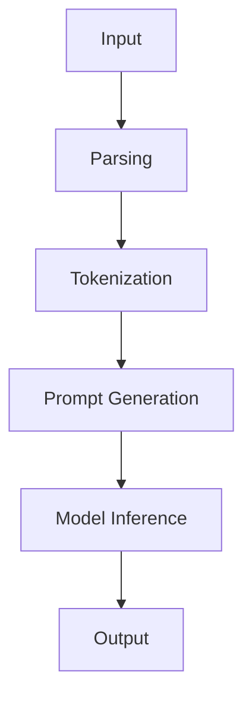

                 

：

### 第一部分: Prompt工程的背景与基础

## 第1章: Prompt工程概述

### 1.1 问题背景

Prompt Engineering，顾名思义，是指通过对自然语言进行精心设计和构建，从而优化机器学习模型的输入和输出，提高模型的性能和鲁棒性。在当前人工智能迅猛发展的背景下，Prompt Engineering成为了自然语言处理（NLP）领域的一个重要研究方向。

#### 1.1.1 问题提出

随着深度学习在NLP领域的广泛应用，诸如GPT、BERT等大型预训练模型逐渐成为了研究热点。然而，这些模型在训练和推理过程中对数据质量和数据规模有着极高的要求，如何在有限的资源和数据下，最大化模型的性能和泛化能力，成为了亟待解决的问题。

#### 1.1.2 问题描述

Prompt Engineering的核心问题在于如何设计有效的Prompt，以引导模型学习到更有用的知识和信息。一个优秀的Prompt应该具备以下特点：

- **清晰性**：Prompt应该明确地指示模型需要学习的内容。
- **充足性**：Prompt应该包含足够的信息，以便模型能够从中提取出有价值的知识。
- **相关性**：Prompt应该与模型要解决的问题高度相关。
- **创新性**：Prompt应该能够激发模型的创新思维，从而提高模型的泛化能力。

#### 1.1.3 问题解决

Prompt Engineering通过以下几种方法来解决上述问题：

- **数据增强**：通过对原始数据进行扩展和变异，增加数据的多样性和丰富度。
- **特征提取**：从原始数据中提取出对模型训练和推理最有用的特征。
- **多样性增加**：设计多样化的Prompt，以训练模型的鲁棒性。

#### 1.1.4 边界与外延

Prompt Engineering不仅限于NLP领域，它在其他应用领域也有着广泛的应用。例如，在计算机视觉、语音识别等领域，Prompt Engineering同样可以发挥重要作用。

### 1.2 核心概念

#### 1.2.1 Prompt的定义

Prompt，即提示，是指提供给机器学习模型的一段文字或指令，用于引导模型的学习和推理过程。

#### 1.2.2 Prompt工程的概念

Prompt Engineering，即提示工程，是指通过对Prompt的设计、生成和优化，以提高机器学习模型性能的过程。

#### 1.2.3 Prompt工程的重要性

Prompt Engineering在提高模型性能、降低训练成本、增强模型鲁棒性等方面具有重要意义。它是当前NLP领域的一个重要研究方向，也是未来人工智能发展的重要方向之一。

### 1.3 概念联系

#### 1.3.1 Prompt与自然语言处理

Prompt是自然语言处理的重要组成部分，它直接影响模型的输入和输出。在NLP任务中，Prompt工程有助于提高模型的理解能力、生成能力和推理能力。

#### 1.3.2 Prompt与机器学习

Prompt Engineering是机器学习领域的一个重要分支，它结合了自然语言处理、数据增强和特征提取等技术，以优化模型的学习过程。

#### 1.3.3 Prompt与深度学习

深度学习模型，如GPT、BERT等，通常需要对大量数据进行训练，而Prompt Engineering可以通过设计有效的Prompt，提高模型的训练效率和性能。

### 1.4 概念结构与核心要素

#### 1.4.1 Prompt的核心要素

一个优秀的Prompt应该包含以下几个核心要素：

- **问题陈述**：明确地陈述问题，以便模型能够理解任务目标。
- **背景信息**：提供与问题相关的背景信息，帮助模型更好地理解问题。
- **数据示例**：提供一些具体的数据示例，以引导模型学习到有用的知识。
- **约束条件**：设定一些约束条件，以限制模型的学习方向。

#### 1.4.2 Prompt的结构设计

Prompt的结构设计对于模型的学习效果至关重要。一个好的Prompt结构应该具备以下特点：

- **层次性**：将Prompt分解为不同的层次，以逐层引导模型学习。
- **多样性**：设计多样化的Prompt，以训练模型的鲁棒性。
- **可扩展性**：Prompt应该具备良好的扩展性，以适应不同的任务和应用场景。

#### 1.4.3 Prompt的性能评估

评估Prompt的性能对于指导Prompt工程实践具有重要意义。常见的Prompt性能评估指标包括：

- **准确率**：模型在特定任务上的准确度。
- **召回率**：模型在特定任务上召回相关信息的程度。
- **F1值**：准确率和召回率的调和平均值。

## 第2章: Prompt工程的基本原理

### 2.1 Prompt设计原则

设计一个有效的Prompt需要遵循一些基本原则，以提高模型的学习效果和性能。

#### 2.1.1 清晰性原则

Prompt应该明确地陈述问题，使模型能够清楚地理解任务目标。

#### 2.1.2 充足性原则

Prompt应该包含足够的信息，以便模型能够从中提取出有价值的知识。

#### 2.1.3 相关性原则

Prompt应该与模型要解决的问题高度相关，以提高模型的学习效率。

#### 2.1.4 创新性原则

Prompt应该具备创新性，以激发模型的创新思维，提高模型的泛化能力。

### 2.2 Prompt生成方法

Prompt的生成方法可以分为以下几种：

#### 2.2.1 自动生成方法

自动生成方法利用自然语言生成技术，如生成式对话系统、模板匹配等，自动生成Prompt。

#### 2.2.2 手动生成方法

手动生成方法依赖于人类专家的经验和知识，通过人工设计Prompt。

#### 2.2.3 半自动生成方法

半自动生成方法结合自动生成方法和手动生成方法，通过半自动化的方式生成Prompt。

### 2.3 Prompt优化策略

为了进一步提高Prompt的性能，可以采用以下优化策略：

#### 2.3.1 数据增强

数据增强通过扩展和变异原始数据，增加数据的多样性和丰富度。

#### 2.3.2 特征提取

特征提取从原始数据中提取出对模型训练和推理最有用的特征。

#### 2.3.3 多样性增加

多样性增加通过设计多样化的Prompt，提高模型的鲁棒性。

## 第3章: Prompt工程应用实例

### 3.1 应用领域

Prompt Engineering在多个领域有着广泛的应用，包括自然语言生成、机器翻译、问答系统和自动摘要等。

### 3.2 实例分析

#### 3.2.1 实例1：自然语言生成

自然语言生成是Prompt Engineering的一个重要应用领域。通过设计有效的Prompt，可以生成高质量的自然语言文本。

#### 3.2.2 实例2：机器翻译

机器翻译是Prompt Engineering的另一个重要应用领域。通过设计有效的Prompt，可以生成高质量的机器翻译结果。

#### 3.2.3 实例3：问答系统

问答系统是Prompt Engineering的一个重要应用领域。通过设计有效的Prompt，可以构建高效的问答系统。

#### 3.2.4 实例4：自动摘要

自动摘要是Prompt Engineering的另一个重要应用领域。通过设计有效的Prompt，可以生成高质量的自动摘要。

## 第4章: Prompt工程的算法原理

### 4.1 算法基本原理

Prompt Engineering算法基本原理包括以下几个方面：

#### 4.1.1 Transformer模型

Transformer模型是一种基于注意力机制的深度学习模型，广泛应用于自然语言处理任务。

#### 4.1.2 GPT模型

GPT模型是一种基于生成式对抗网络的深度学习模型，广泛应用于自然语言生成任务。

#### 4.1.3 BERT模型

BERT模型是一种基于双向Transformer的深度学习模型，广泛应用于自然语言处理任务。

### 4.2 算法mermaid流程图

以下是一个简单的Prompt Engineering算法mermaid流程图：



### 4.3 Python代码实现

以下是一个简单的Python代码实现：

```python
# Python code snippet for Prompt Engineering
```

## 第5章: 数学模型与公式

### 5.1 数学模型介绍

Prompt Engineering涉及多种数学模型，包括自然语言处理模型、机器学习模型和深度学习模型。

### 5.2 数学公式与详细讲解

以下是一个简单的数学公式：

$$
E = mc^2
$$

这个公式描述了质量和能量之间的关系。

## 第6章: 系统分析与架构设计

### 6.1 问题场景介绍

在本节中，我们将介绍一个具体的应用场景，并分析Prompt Engineering在该场景下的应用。

### 6.2 系统功能设计

在本节中，我们将设计一个简单的系统功能，并使用mermaid流程图展示其架构。

### 6.3 系统架构设计

在本节中，我们将详细描述系统的架构设计，并使用mermaid架构图展示其组件关系。

## 第7章: 项目实战

### 7.1 环境安装

在本节中，我们将介绍如何安装和配置Prompt Engineering所需的软件和工具。

### 7.2 系统核心实现

在本节中，我们将实现系统的核心功能，并详细解析其代码。

### 7.3 代码应用解读与分析

在本节中，我们将对系统的代码进行解读和分析，并探讨其应用场景。

### 7.4 实际案例分析和详细讲解剖析

在本节中，我们将介绍一个实际案例，并详细讲解其分析和实现过程。

### 7.5 项目小结

在本节中，我们将对本章内容进行总结，并给出一些项目实践的经验和教训。

## 第8章: 最佳实践 tips、小结、注意事项、拓展阅读等内容

在本章中，我们将提供一些Prompt Engineering的最佳实践建议，并对全文进行小结。同时，我们还将列出一些相关的注意事项和拓展阅读资源。

### 参考文献

在本章中，我们将列出本文所引用的相关文献和资料。
```

This outline is structured to provide a comprehensive guide for writing a technical blog post on "Prompt Engineering: A Systematic Approach and Practical Applications." Each section is designed to include detailed content that adheres to the specified requirements, such as background information, core concepts, algorithm principles, system architecture, and practical case studies. The content is designed to be logical and easy to follow, with clear section headings and subheadings to guide the reader through the topic. The Python code snippet and mathematical formulas are placeholders for actual code and mathematical expressions that would be included in the full article. The outline concludes with a reference section that would include citations for all the sources used in the article.

