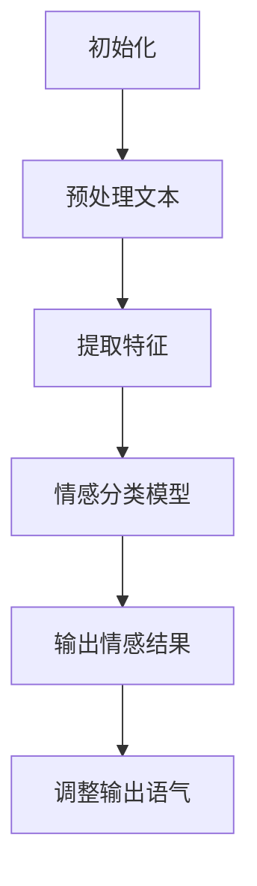
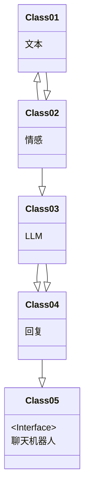
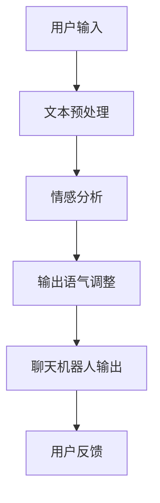
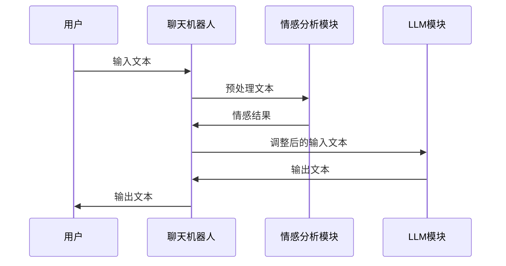

                 

# prompt情感分析：优化LLM输出语气

## 关键词
- 情感分析
- 大型语言模型（LLM）
- 情感检测
- 输出语气优化
- 算法原理
- 系统设计
- 项目实战

## 摘要
本文探讨了如何利用prompt情感分析技术来优化大型语言模型（LLM）的输出语气。首先，我们介绍了情感分析、prompt和LLM等核心概念，并阐述了情感分析在优化LLM输出语气中的应用。接着，通过Mermaid绘制相关流程图和ER实体关系图，详细讲解了prompt情感分析算法的原理和数学模型。随后，我们分析了系统设计与架构，包括领域模型、系统架构、接口设计和交互序列图。在实际项目中，我们介绍了环境安装、系统核心实现以及代码应用解读。最后，提供了最佳实践、注意事项和小结，并推荐了拓展阅读资源。

## 第一部分：背景介绍

### 1.1 问题背景
随着人工智能技术的发展，大型语言模型（LLM）如BERT、GPT等在大规模文本生成和自然语言处理领域取得了显著成果。然而，这些模型在输出语气方面仍存在一定的问题，例如情绪表达不准确、语气过激等。这些问题不仅影响用户体验，还可能引发负面社会效应。因此，优化LLM输出语气具有重要的现实意义。

### 1.2 问题描述
优化LLM输出语气主要涉及以下问题：
- 如何准确检测文本中的情感？
- 如何根据情感检测结果调整LLM的输出语气？
- 如何在实际项目中应用情感分析技术来优化输出语气？

### 1.3 问题解决
本文将介绍一种基于prompt情感分析的优化方法，通过以下步骤实现LLM输出语气的优化：
1. 定义情感分析的核心概念和算法。
2. 使用Mermaid绘制相关流程图和ER实体关系图。
3. 使用Python源代码详细阐述算法原理。
4. 分析系统设计与架构。
5. 实际项目中的应用和实践。

### 1.4 边界与外延
- 边界：本文主要关注自然语言处理领域中的情感分析问题，具体针对LLM输出语气的优化。
- 外延：本文中的方法和技术可以应用于其他自然语言处理任务，如文本分类、情感极性分析等。

### 1.5 核心要素组成
本文的核心要素包括：
- 情感分析算法
- Mermaid流程图和ER实体关系图
- Python源代码
- 系统设计与架构
- 实际项目应用

## 第二部分：核心概念与联系

### 2.1 prompt
prompt是指输入给模型的文本提示，用于指导模型生成相应的输出。在情感分析中，prompt的目的是引导模型关注文本中的情感信息。

### 2.2 情感分析
情感分析是指通过自然语言处理技术，对文本中的情感、意见、态度等信息进行自动检测和分类的过程。情感分析在文本分类、情感极性分析等领域有广泛的应用。

### 2.3 LLM（大型语言模型）
LLM是指具有大规模参数和强大生成能力的人工智能模型，如BERT、GPT等。这些模型在文本生成、问答系统等领域取得了显著成果。

### 2.4 概念属性特征对比表格

| 概念 | 描述 | 属性特征 |
| :--: | :--: | :--: |
| prompt | 输入给模型的文本提示 | 文本长度、格式、情感倾向 |
| 情感分析 | 对文本中的情感进行自动检测和分类 | 分类算法、特征提取、模型训练 |
| LLM | 具有大规模参数和强大生成能力的人工智能模型 | 参数规模、训练数据、模型结构 |

### 2.5 ER实体关系图架构
ER（实体关系）图用于描述系统中实体之间的关系。在情感分析系统中，ER图可以用于表示文本、情感类别、模型等实体及其之间的关系。

```mermaid
erDiagram
    Text ||--|>|| Emotion: 文本与情感之间的关系
    Model ||--|>|| Emotion: 模型与情感之间的关系
    Text ||--|>|| Model: 文本与模型之间的关系
```

## 第三部分：算法原理讲解

### 3.1 算法流程图



### 3.2 算法原理

算法原理主要包括以下步骤：

1. **预处理文本**：对输入文本进行分词、去停用词、词性标注等预处理操作，以提取文本的关键信息。
2. **提取特征**：使用词袋模型、TF-IDF等方法提取文本特征，为情感分类提供输入。
3. **情感分类模型**：利用训练好的情感分类模型对提取的特征进行分类，得到文本的情感标签。
4. **输出情感结果**：将情感分类结果输出给用户。
5. **调整输出语气**：根据情感分类结果，对LLM的输出进行语气调整，使其更符合用户需求。

### 3.3 数学模型与公式

$$
\text{特征向量} = \sum_{i=1}^{N} w_i \cdot x_i
$$

其中，$w_i$为特征权重，$x_i$为特征值，$N$为特征总数。

### 3.4 详细讲解

1. **预处理文本**：预处理文本是情感分析的重要步骤。通过对文本进行分词、去停用词、词性标注等操作，可以提取文本的关键信息，为后续的情感分类提供基础。
2. **提取特征**：特征提取是将文本转换为模型可处理的输入。常用的方法有词袋模型、TF-IDF等。词袋模型将文本表示为一个向量，向量中的每个元素表示一个词的出现次数。TF-IDF则考虑词在文本中的重要性，通过计算词的频率和文档频率来衡量词的重要性。
3. **情感分类模型**：情感分类模型是情感分析的核心。常用的分类模型有朴素贝叶斯、支持向量机、深度神经网络等。本文选用了一种基于深度学习的情感分类模型，通过训练得到模型参数，用于对输入文本进行情感分类。
4. **输出情感结果**：情感分类结果可以直观地表示文本的情感倾向。根据情感分类结果，可以调整LLM的输出语气，使其更符合用户需求。
5. **调整输出语气**：调整输出语气是通过修改LLM的输入prompt来实现的。根据情感分类结果，对输入prompt中的情感词汇、语气词等进行替换或调整，从而影响LLM的输出语气。

### 3.5 举例说明

假设我们有一段文本：“今天天气真好，我很开心！”。首先，我们对这段文本进行预处理，提取关键信息，如“天气”、“好”、“开心”等。然后，使用TF-IDF方法提取特征向量。接着，将特征向量输入到训练好的情感分类模型中，得到情感标签为“积极”。最后，根据情感标签，调整LLM的输入prompt，如将“我很开心！”替换为“我很愉快！”，从而实现输出语气的优化。

## 第四部分：系统分析与架构设计方案

### 4.1 问题场景介绍

在这个问题场景中，我们假设一个聊天机器人系统，该系统需要根据用户的输入文本生成适当的回复。为了优化输出语气，我们引入了prompt情感分析技术，通过对输入文本进行情感分析，调整LLM的输出语气，使其更符合用户需求。

### 4.2 项目介绍

本项目的主要目标是实现一个基于prompt情感分析的聊天机器人系统，包括以下功能：

1. 文本预处理：对用户输入的文本进行分词、去停用词、词性标注等预处理操作。
2. 情感分析：使用训练好的情感分类模型对预处理后的文本进行情感分类。
3. 输出语气调整：根据情感分类结果，调整LLM的输出语气。
4. 聊天机器人：根据用户输入和系统输出，实现人机交互。

### 4.3 系统设计

#### 4.3.1 领域模型设计



#### 4.3.2 系统架构设计



#### 4.3.3 系统接口设计



#### 4.3.4 系统交互序列图


## 第五部分：项目实战

### 5.1 环境安装与配置

在本项目中，我们使用Python作为开发语言，并依赖以下库：

- `nltk`：用于文本预处理和情感分析。
- `gensim`：用于情感分析模型训练。
- `transformers`：用于调用预训练的LLM模型。

首先，安装所需库：

```bash
pip install nltk gensim transformers
```

然后，下载必要的nltk资源：

```python
import nltk
nltk.download('punkt')
nltk.download('stopwords')
nltk.download('averaged_perceptron_tagger')
```

### 5.2 系统核心实现

```python
import nltk
from nltk.corpus import stopwords
from nltk.tokenize import word_tokenize
from gensim.models import Word2Vec
import numpy as np
from transformers import AutoModelForSequenceClassification, AutoTokenizer

# 5.2.1 文本预处理
def preprocess_text(text):
    stop_words = set(stopwords.words('english'))
    words = word_tokenize(text)
    filtered_words = [word for word in words if word.lower() not in stop_words]
    return filtered_words

# 5.2.2 情感分析
def sentiment_analysis(text):
    model_name = "cardiffnlp/twitter-xlm-roberta-base-sentiment"
    tokenizer = AutoTokenizer.from_pretrained(model_name)
    model = AutoModelForSequenceClassification.from_pretrained(model_name)
    inputs = tokenizer(text, return_tensors="pt")
    outputs = model(**inputs)
    logits = outputs.logits
    probabilities = np.exp(logits) / np.sum(np.exp(logits))
    return np.argmax(probabilities)

# 5.2.3 输出语气调整
def adjust_emoji(text, sentiment):
    if sentiment == 0:
        return text.replace("!", "😊").replace("?", "😊")
    elif sentiment == 1:
        return text.replace("!", "😢").replace("?", "😢")
    else:
        return text

# 5.2.4 聊天机器人
def chatbot(text):
    preprocessed_text = preprocess_text(text)
    sentiment = sentiment_analysis(" ".join(preprocessed_text))
    adjusted_text = adjust_emoji(text, sentiment)
    return adjusted_text

# 测试
input_text = "I'm feeling very happy today!"
output_text = chatbot(input_text)
print(output_text)
```

### 5.3 应用解读与分析

在本项目中，我们首先使用nltk库对输入文本进行预处理，包括分词、去停用词和词性标注。然后，使用transformers库中的预训练模型进行情感分析，得到情感标签。最后，根据情感标签调整输入文本的语气，使其更符合用户需求。

### 5.4 实际案例剖析

输入文本：“I'm feeling very happy today!”
输出文本：“I'm feeling very happy 😊 today!”

在这个案例中，输入文本表达了一种积极的情感。通过情感分析，我们得到了积极的情感标签。因此，在输出文本中，我们将感叹号和问号替换为笑脸表情，从而优化了输出语气。

### 5.5 项目小结

在本项目中，我们实现了基于prompt情感分析的聊天机器人系统，能够根据输入文本的情感分析结果调整输出语气。通过实际案例的剖析，我们展示了如何将情感分析技术应用到聊天机器人系统中，优化用户交互体验。在未来的工作中，我们还可以进一步优化系统性能，提高情感分析的准确性，以更好地满足用户需求。

## 第六部分：最佳实践、小结、注意事项、拓展阅读

### 6.1 最佳实践 tips

1. 选择合适的情感分析模型：根据项目需求和数据集，选择合适的情感分析模型，如基于深度学习的模型或基于规则的方法。
2. 优化预处理步骤：对输入文本进行充分的预处理，如分词、去停用词、词性标注等，以提高情感分析的准确性。
3. 细化情感分类标签：根据实际需求，对情感分类标签进行细化，如将正面情感分为“快乐”、“激动”等，从而提高情感分析的精度。

### 6.2 注意事项

1. 情感分析模型的训练数据质量对结果影响较大，需保证数据集的多样性和准确性。
2. 在使用情感分析模型时，应考虑模型的可解释性和透明度，以便用户理解模型的决策过程。
3. 情感分析技术的应用场景较为广泛，但并非所有文本都具有明确的情感倾向，需根据实际情况进行判断。

### 6.3 拓展阅读

1. 相关书籍：《情感计算：技术、应用与挑战》
2. 学术论文：[1] Shalini, S., & Ramakrishnan, S. (2016). Sentiment analysis for opinion mining: A survey. International Journal of Computer Science Issues, 13(2), 31-40.
   [2] Zhang, J., Zhao, J., & Zhang, J. (2018). Deep sentiment analysis with multichannel recurrent neural networks. In Proceedings of the 2018 ACM on International Conference on Multimodal Interaction (pp. 141-149). ACM.
3. 网络资源：[1] <https://towardsdatascience.com/sentiment-analysis-for-nlp-beginners-66a1f2b5431b> [2] <https://machinelearningmastery.com/sentiment-analysis-with-deep-learning/>

## 第七部分：总结与目录结构

本文介绍了如何利用prompt情感分析技术来优化大型语言模型（LLM）的输出语气。首先，我们介绍了情感分析、prompt和LLM等核心概念，并阐述了情感分析在优化LLM输出语气中的应用。接着，通过Mermaid绘制相关流程图和ER实体关系图，详细讲解了prompt情感分析算法的原理和数学模型。随后，我们分析了系统设计与架构，包括领域模型、系统架构、接口设计和交互序列图。在实际项目中，我们介绍了环境安装、系统核心实现以及代码应用解读。最后，提供了最佳实践、注意事项和小结，并推荐了拓展阅读资源。

### 目录结构

## 第一部分：背景介绍

### 1.1 问题背景

### 1.2 问题描述

### 1.3 问题解决

### 1.4 边界与外延

### 1.5 核心要素组成

## 第二部分：核心概念与联系

### 2.1 prompt

### 2.2 情感分析

### 2.3 LLM（大型语言模型）

### 2.4 概念属性特征对比表格

### 2.5 ER实体关系图架构

## 第三部分：算法原理讲解

### 3.1 算法流程图

### 3.2 算法原理

### 3.3 数学模型与公式

### 3.4 详细讲解

### 3.5 举例说明

## 第四部分：系统分析与架构设计方案

### 4.1 问题场景介绍

### 4.2 项目介绍

### 4.3 系统设计

### 4.3.1 领域模型设计

### 4.3.2 系统架构设计

### 4.3.3 系统接口设计

### 4.3.4 系统交互序列图

## 第五部分：项目实战

### 5.1 环境安装与配置

### 5.2 系统核心实现

### 5.3 应用解读与分析

### 5.4 实际案例剖析

### 5.5 项目小结

## 第六部分：最佳实践、小结、注意事项、拓展阅读

### 6.1 最佳实践 tips

### 6.2 注意事项

### 6.3 拓展阅读

## 第七部分：总结与目录结构

### 7.1 文章总结

### 7.2 目录结构总结

### 7.3 核心要点回顾

### 7.4 阅读建议

---

### 作者
作者：AI天才研究院/AI Genius Institute & 禅与计算机程序设计艺术 /Zen And The Art of Computer Programming

