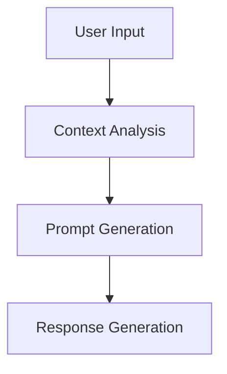
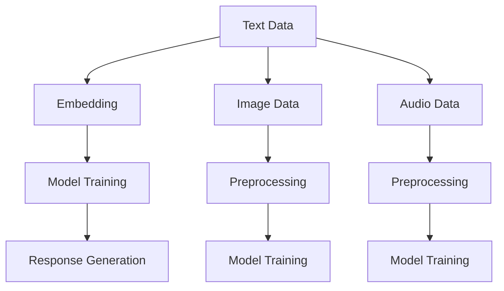
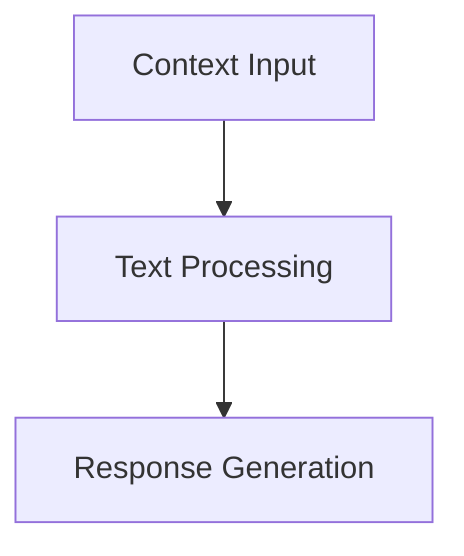
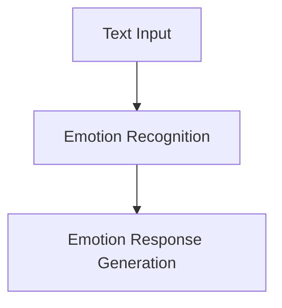
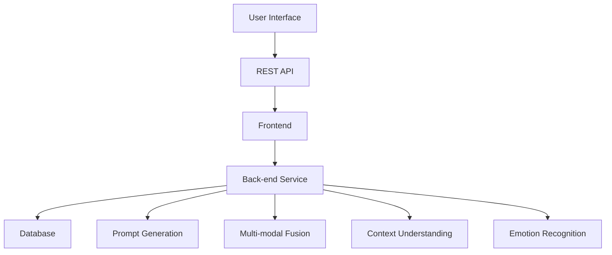
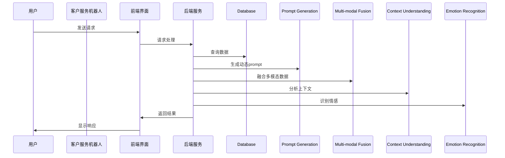
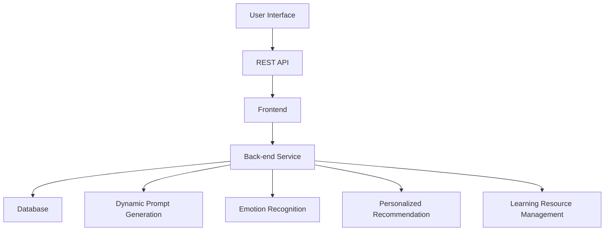
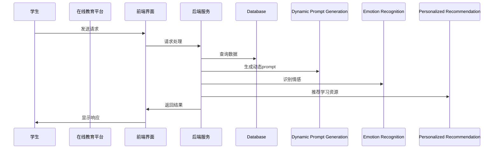
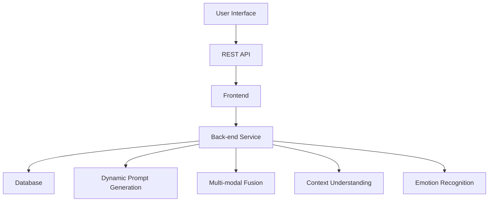
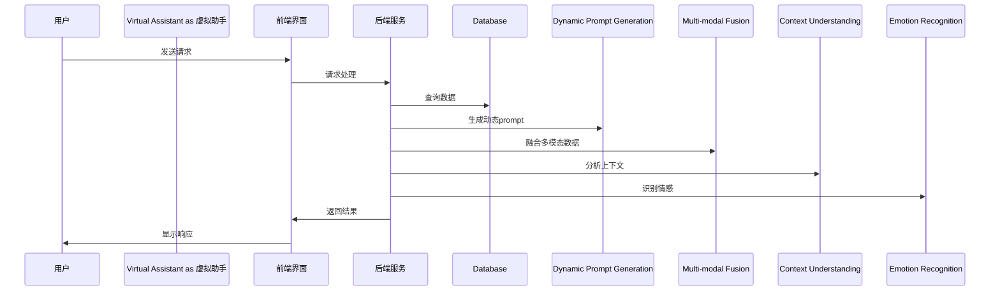

                 

### 提出问题

在当前人工智能领域，大型语言模型（LLM）如GPT-3和ChatGPT等取得了显著的进展。然而，这些模型的多样性和灵活性仍然存在一些问题。当模型被要求进行角色扮演时，它们往往表现出某种固有的局限性，导致输出的重复性和单调性。这种局限性主要体现在以下几个方面：

1. **角色定义模糊**：LLM的角色扮演通常依赖于预设的prompt，但这些prompt往往不够明确或不够丰富，导致模型难以准确地理解并扮演角色。

2. **个性缺失**：虽然LLM能够模仿不同角色的行为和语言风格，但缺乏真正的个性，导致输出的角色扮演缺乏真实感和深度。

3. **多样性的局限**：LLM在处理不同角色时，往往表现出某种模式化的倾向，导致多样性的局限，无法充分应对各种复杂和多变的情况。

4. **上下文关联不足**：角色扮演需要建立与上下文的紧密关联，但LLM在处理长时间依赖和上下文关联时存在困难，导致角色扮演的不连贯性。

这些问题的存在，不仅限制了LLM在实际应用中的表现，也阻碍了人工智能技术向更高层次的发展。因此，研究如何优化prompt角色扮演，增强LLM的多样性，成为了一个亟待解决的问题。

#### AI与LLM的崛起

近年来，人工智能（AI）技术取得了飞速发展，而其中大型语言模型（LLM）的崛起尤为引人注目。LLM，即大型语言模型，是一种能够理解和生成自然语言的深度学习模型。它通过大规模语料库的学习，具备了强大的语言理解和生成能力，能够进行文本生成、问答、翻译、情感分析等任务。

LLM的代表性模型包括GPT-3、ChatGPT、TuringBot等，它们在自然语言处理（NLP）领域取得了显著的成就。例如，GPT-3具有1750亿参数，能够生成高质量的自然语言文本，适用于各种应用场景，从自动化客户服务到智能助手，再到内容创作和编程辅助等。ChatGPT则凭借其强大的交互能力，在对话生成和情感理解方面表现出色，成为了许多企业的选择。

这些LLM的成功不仅改变了人们与机器交互的方式，也为各个行业带来了新的机遇和挑战。例如，在客户服务领域，LLM可以帮助企业实现24/7的智能客服，提高客户满意度和服务效率；在内容创作领域，LLM可以生成新闻文章、博客和广告文案，提高内容生产效率和质量；在编程领域，LLM可以帮助开发者进行代码补全、错误修复和代码优化，提高开发效率。

然而，尽管LLM在许多方面表现出色，其角色扮演的多样性和灵活性仍然存在一定的局限性。当模型被要求进行角色扮演时，它们往往难以摆脱预设的模板，表现出一种固有的重复性和单调性。例如，在模拟医生与患者对话时，LLM可能只能生成一些基本的医疗术语和对话模板，缺乏个性化的诊断和建议；在模拟律师与客户对话时，LLM可能只能生成一些通用的法律建议，无法应对复杂的法律问题。

此外，LLM在处理不同角色时，也常常表现出某种模式化的倾向。例如，在模拟教师与学生对话时，LLM可能只能生成一些标准的教学模板，无法根据学生的具体需求和情况做出灵活的调整。这种模式化的角色扮演不仅限制了LLM的实际应用范围，也影响了其在实际场景中的效果和用户体验。

因此，为了充分发挥LLM的潜力，我们需要研究如何优化其角色扮演，增强其多样性和灵活性。这不仅能够提高LLM在实际应用中的表现，也有助于推动人工智能技术的发展和进步。

### 角色扮演在AI中的应用

角色扮演（Role-playing）在人工智能（AI）中的应用具有广泛且深远的影响。通过角色扮演，AI系统能够模拟不同角色和任务，从而在众多领域展现出其独特的价值。以下将详细介绍角色扮演在AI中的应用场景、其面临的挑战以及所解决的问题。

#### 应用场景

1. **教育与培训**：角色扮演技术在教育领域得到了广泛应用，尤其是在模拟对话和交互式学习中。AI可以模拟不同角色的行为，如学生、教师、医生、律师等，为学生提供真实的互动体验，帮助他们更好地理解和掌握相关知识和技能。

2. **客户服务**：在客户服务领域，AI角色扮演能够模拟客服代表，提供24/7的智能客服服务。这些AI客服可以处理各种常见问题，如产品咨询、订单查询、投诉处理等，提高了服务效率和客户满意度。

3. **医疗健康**：在医疗健康领域，AI角色扮演可以模拟医生与患者之间的对话，提供诊断建议、治疗方案和健康指导。这不仅减轻了医生的工作负担，也为患者提供了更加个性化和专业的服务。

4. **法律咨询**：在法律咨询领域，AI角色扮演可以模拟律师与客户之间的对话，提供法律建议和解决方案。这些AI律师能够处理各种法律问题，帮助用户快速获取专业的法律支持。

5. **安全与监控**：在安全与监控领域，AI角色扮演可以模拟安全专家、警察等角色，实时分析监控视频，识别潜在的安全威胁，提高安全防护能力。

#### 挑战

1. **个性化与多样性**：虽然AI角色扮演技术取得了显著进展，但在个性化和多样性方面仍然面临挑战。不同角色之间的语言风格、行为习惯和应对策略需要高度定制化，以确保模拟的真实性和有效性。

2. **上下文理解和长文本处理**：角色扮演需要理解对话的上下文，并在长时间依赖和长文本处理方面表现出色。然而，当前的LLM在处理长文本和复杂上下文时存在一定的局限性。

3. **情感理解和回应**：角色扮演不仅需要模拟角色的行为，还需要理解并回应情感。在情感理解方面，AI技术还需要进一步提高，以提供更加人性化的服务。

4. **伦理和隐私**：角色扮演在AI应用中涉及到大量的用户数据和隐私问题。如何在保证用户隐私的同时，提供高质量的角色扮演服务，是当前面临的一个重要挑战。

#### 解决方案

1. **多模态融合**：通过结合文本、语音、图像等多种模态，可以进一步提高角色扮演的多样性和真实性。例如，在医疗健康领域，结合患者病历和医生的语言风格，可以提供更加个性化和专业的服务。

2. **深度学习和迁移学习**：利用深度学习和迁移学习技术，可以训练出更加灵活和多样化的AI角色扮演模型。通过在大规模数据集上训练，这些模型能够更好地理解和模拟不同角色的行为和语言风格。

3. **情感识别与生成**：通过情感识别和生成技术，AI角色扮演可以更好地理解用户的情感，并提供相应的情感回应。例如，在客户服务领域，通过识别用户的情绪状态，AI客服可以提供更加温暖和关心的服务。

4. **伦理和隐私保护**：在角色扮演应用中，需要严格遵守伦理和隐私保护原则。例如，可以通过数据匿名化和隐私保护技术，确保用户数据的安全和隐私。

总之，角色扮演技术在AI应用中具有广泛的前景和潜力。通过不断改进和优化，我们可以期待AI角色扮演在未来发挥更加重要的作用，为社会带来更多的价值和便利。

### 提出的问题与挑战

尽管角色扮演技术在人工智能（AI）领域展示了巨大的潜力，但当前的研究和应用中仍然存在一系列问题与挑战。这些问题不仅限制了AI系统的角色扮演能力，也在一定程度上影响了用户体验和实际应用效果。

#### 1. 角色定义不明确

首先，角色定义的不明确是一个显著问题。在角色扮演中，清晰的角色定义是基础。然而，当前的LLM往往依赖于预设的prompt，这些prompt可能过于简单或模糊，导致模型无法准确理解所需的角色行为。例如，一个预设的医生角色prompt可能只包含一些基本的医疗术语，而无法展现医生的专业知识和诊断能力。

#### 2. 个性缺失

其次，个性缺失是角色扮演中另一个重要问题。虽然LLM可以模仿不同角色的语言风格和行为模式，但往往缺乏真实的个性。这导致角色扮演的结果显得刻板、缺乏情感深度。例如，在模拟律师时，LLM可能只能生成一些标准化的法律建议，而无法表现出律师的智慧和判断力。

#### 3. 多样性不足

多样性的不足也是当前角色扮演面临的挑战之一。LLM在处理不同角色时，往往表现出某种模式化的倾向，导致输出的重复性和单调性。例如，在客户服务场景中，AI客服可能会生成一系列标准化的回答，而无法根据具体客户的需求和情境提供个性化的服务。

#### 4. 上下文关联不足

上下文关联不足是另一个关键问题。角色扮演需要建立与上下文的紧密关联，以便在复杂的对话环境中做出合理的回应。然而，当前的LLM在处理长时间依赖和复杂上下文时存在困难，导致角色扮演的不连贯性。例如，在模拟医生与患者对话时，LLM可能无法准确理解患者的长期病史和当前症状，从而提供不恰当的诊断建议。

#### 5. 情感理解与回应

情感理解与回应是角色扮演的另一个重要方面。在现实世界中，人们的行为和对话往往受到情感的影响。然而，当前的LLM在情感识别和回应方面仍然存在不足。例如，在模拟心理咨询时，LLM可能无法准确识别患者的情感状态，并给予适当的情感支持。

#### 6. 伦理与隐私问题

最后，伦理和隐私问题也是角色扮演技术面临的挑战之一。在角色扮演应用中，涉及到大量的用户数据和隐私信息。如何确保用户数据的安全和隐私，同时提供高质量的角色扮演服务，是当前需要解决的一个重要问题。

综上所述，角色扮演技术在AI应用中面临着多个挑战。通过深入研究和创新，我们可以期待未来在这些方面取得突破，为AI系统赋予更强大的角色扮演能力。

#### 核心概念：Prompt的概念

Prompt，即提示，是触发AI系统生成特定内容的关键输入。在AI领域，Prompt起到了引导模型理解和生成信息的作用。为了更好地理解Prompt的概念，我们可以从以下几个方面进行详细探讨。

首先，Prompt的基本作用是提供上下文信息，帮助AI模型更好地理解用户意图。例如，在一个问答系统中，用户可能会输入一个简单的句子或问题，如“今天天气怎么样？”系统需要根据这个Prompt来理解用户的意图，并生成一个相关的回答，如“今天天气晴朗，温度约为20摄氏度。”

其次，Prompt的设计和选择对AI系统的表现有重要影响。一个好的Prompt应该具备以下几个特点：

1. **明确性**：Prompt需要明确、具体，以便模型能够准确理解用户的意图。例如，相比“你今天过得怎么样？”这样的模糊Prompt，更具体的“你今天完成了哪些工作任务？”能够更有效地引导系统生成相关的回答。

2. **多样性**：Prompt的多样性有助于增强AI系统的灵活性，使其能够应对不同的场景和需求。例如，通过设计多种不同类型的Prompt，如问题型、描述型、指令型等，系统可以更全面地理解用户的需求，并生成多样化的回答。

3. **相关性**：Prompt需要与AI系统的任务和功能高度相关。例如，在一个医疗健康应用中，Prompt应该包含与医疗诊断和治疗方案相关的信息，以便系统能够提供专业的医疗建议。

最后，Prompt的使用方式也值得探讨。在实际应用中，Prompt可以通过多种方式传递给AI系统：

1. **文本输入**：这是最常见的方式，用户通过键盘输入文本信息，如问题、请求等，系统根据这些文本信息生成相应的回答。

2. **语音输入**：在语音识别技术发达的今天，用户可以通过语音输入Prompt，系统通过语音处理和识别技术理解用户的意图，并生成相应的回答。

3. **图像输入**：在某些场景下，用户可以通过上传图像作为Prompt，例如，在图像识别和分类任务中，系统可以通过分析图像内容来生成相应的描述或回答。

总之，Prompt是AI系统生成特定内容的重要触发信号。通过精心设计和使用，我们可以增强AI系统的理解能力，提高其应用效果。无论是文本输入、语音输入还是图像输入，Prompt都是实现AI系统与用户有效交互的关键要素。

#### 核心概念：角色扮演原理

角色扮演（Role-playing）在人工智能（AI）中的应用，是通过预设的prompt和模型训练，使AI系统能够模仿特定角色的行为、语言风格和思维模式。为了深入理解角色扮演的原理，我们需要从以下几个方面进行探讨。

首先，角色扮演的基本原理是基于预定义的角色和相应的prompt。这些角色可以是人类生活中的各种职业，如医生、律师、教师等，也可以是虚构的角色，如虚构的侦探、历史人物等。每个角色都有其独特的语言风格、行为习惯和知识体系。通过预设这些角色和相关的prompt，AI系统可以在特定场景下模拟这些角色的行为。

其次，角色扮演的实现依赖于模型训练。在AI系统中，通常使用深度学习模型，如变换器（Transformer）架构，对大规模语料库进行训练。这些语料库包含了各种角色在不同场景下的对话和文本数据。通过这些数据的训练，模型能够学习到不同角色的语言特征和行为模式。例如，一个医生角色可能会使用专业的医疗术语，而一个律师角色则可能擅长法律条文和辩论技巧。

第三，动态prompt设计是角色扮演的核心。动态prompt设计是指在生成对话时，根据上下文和用户输入实时调整prompt的内容。这种设计方法能够使角色扮演更加灵活和多样化。例如，在一个模拟医生与患者对话的系统中，如果患者提到了具体的症状，系统可以动态调整prompt，加入相关症状的描述和可能的诊断建议，从而生成更加专业和个性化的回答。

此外，上下文关联也是角色扮演的关键因素。角色扮演需要建立与上下文的紧密关联，以便在复杂的对话环境中做出合理的回应。为了实现这一点，AI系统通常需要具备较强的上下文理解能力。例如，在一个模拟律师与客户对话的系统中，系统需要理解客户提出的问题背景、历史情况和法律条款，从而生成相关的法律建议。

最后，情感理解与回应是角色扮演的高级形式。在现实世界中，人们的行为和对话往往受到情感的影响。AI角色扮演也需要具备情感理解与回应的能力，以便提供更加人性化和服务。例如，在一个模拟心理咨询的系统中，系统需要识别患者的情感状态，并根据情感状态生成相应的安慰和建议。

综上所述，角色扮演原理通过预定义的角色和动态prompt设计，结合深度学习模型和上下文理解能力，实现了AI系统在特定场景下的角色模仿和对话生成。通过不断优化这些技术，我们可以期待AI系统在角色扮演方面的表现更加真实和多样化。

#### 核心概念：LLM的基本原理

大型语言模型（LLM）是近年来自然语言处理（NLP）领域的重要突破。LLM通过深度学习技术，对海量文本数据进行处理，从而实现对自然语言的生成和理解。以下将详细介绍LLM的基本原理，包括其训练过程、主要架构和核心技术。

首先，LLM的训练过程是基于大规模数据集进行的。这些数据集通常包括各种类型的文本，如新闻文章、书籍、网页、对话记录等。在训练过程中，LLM通过处理这些文本数据，学习到语言的统计特征和语义信息。这一过程通常采用无监督学习的方法，即模型无需人工标注，直接从数据中学习语言规律。

其次，LLM的主要架构是变换器（Transformer）模型。变换器模型是一种基于注意力机制的深度学习模型，相比于传统的循环神经网络（RNN）和长短期记忆网络（LSTM），它在处理长文本和上下文关联方面具有显著优势。变换器模型的核心组件包括自注意力机制（Self-Attention）和多头注意力机制（Multi-Head Attention），这些机制使得模型能够捕捉文本中的长距离依赖关系。

具体来说，变换器模型通过多个堆叠的编码层（Encoder Layer）和解码层（Decoder Layer）来处理输入的文本序列。在编码层中，文本序列被转换为高维向量表示，并通过自注意力机制计算文本中各个词之间的关系。在解码层中，模型通过注意力机制和编码器的输出，生成目标文本序列。

此外，LLM的核心技术还包括预训练和微调。预训练是指在大量文本数据上进行训练，使模型学习到通用的语言特征和知识。微调则是在预训练的基础上，针对特定任务进行优化，使模型在特定任务上表现更好。例如，在一个文本生成任务中，模型可以在预训练的基础上，通过微调调整模型参数，使其生成更加符合任务需求的文本。

在实现LLM时，常用的技术还包括嵌入（Embedding）、位置编码（Positional Encoding）和正则化（Regularization）。嵌入技术将文本中的单词和句子转换为固定长度的向量表示，位置编码则用于编码文本中的位置信息，正则化技术则用于防止模型过拟合。

最后，LLM在自然语言处理领域具有广泛的应用，如文本生成、机器翻译、问答系统、情感分析等。通过不断优化和扩展LLM，我们可以期待在未来的NLP任务中实现更高的性能和更好的效果。

总之，LLM的基本原理涉及大规模数据训练、变换器架构、预训练和微调技术，这些技术共同构成了LLM强大的语言理解和生成能力。通过深入研究和创新，我们可以进一步拓展LLM的应用领域，推动人工智能技术的发展。

#### 本书的结构与目标

本书旨在系统地探讨如何通过优化prompt角色扮演，增强大型语言模型（LLM）的多样性。为了实现这一目标，本书的结构分为四个主要部分，每个部分都有明确的章节安排和具体内容。

### 第一部分：引言

**第1章：问题背景与核心概念**

本章节将介绍AI与LLM的崛起，以及角色扮演在AI中的应用。通过分析角色扮演的挑战，引出本书的核心主题，即如何优化prompt角色扮演，增强LLM的多样性。

### 第二部分：提高LLM角色扮演多样性的基础

**第2章：提高角色扮演多样性的基本方法**

本章将讨论提高角色扮演多样性的基本方法，包括数据增强、模型微调等。通过具体技术手段，展示如何实现角色扮演的多样性。

**第3章：数据准备与处理**

本章将详细介绍如何收集、预处理和增强数据，以确保角色扮演的多样性。通过数据来源、预处理和增强技术的讲解，为后续的角色扮演优化打下基础。

### 第三部分：实际应用

**第4章：提高角色扮演多样性的技术**

本章将深入探讨提高角色扮演多样性的技术，如动态prompt设计、多模态融合等。通过详细讲解，展示这些技术如何在实际应用中发挥作用。

**第5章：应用案例与实战**

本章将通过具体案例，展示如何将提高角色扮演多样性的技术应用于实际场景，如客户服务、在线教育和虚拟助手等。通过实战案例，提供实际操作指导。

### 第四部分：实践指南

**第6章：实践技巧与最佳实践**

本章将总结最佳实践和技巧，帮助读者在实际项目中更有效地实施角色扮演优化。通过详细说明，提高读者对角色扮演优化技术的理解和应用能力。

**第7章：注意事项与拓展阅读**

本章将提供在使用角色扮演优化技术时需要注意的事项，并推荐进一步阅读的资源，以便读者深入了解相关主题。

**第8章：总结与展望**

本章将总结本书的主要内容，并对未来的发展方向进行展望。通过回顾和展望，为读者提供对角色扮演优化技术的前瞻性认识。

通过以上结构安排，本书旨在系统地引导读者深入了解角色扮演优化技术，掌握提高LLM多样性的方法，并能够将其应用于实际项目中。

### 目录结构详细说明

为了确保本书的内容逻辑清晰、条理紧凑，并吸引读者深入阅读，我们对目录结构进行了详细说明，包括每个章节的主要内容和结构安排。

#### 第一部分：引言

**第1章：问题背景与核心概念**

- **核心内容**：介绍AI与LLM的崛起以及角色扮演在AI中的应用。详细分析角色扮演面临的挑战，如角色定义不明确、个性缺失、多样性不足等。通过这些问题，引出本书的核心主题——如何优化prompt角色扮演，增强LLM的多样性。

- **章节结构**：章节开头通过一个引人入胜的引言，激发读者的兴趣。接着，分几个小节详细讨论背景和核心概念，包括AI与LLM的发展历程、角色扮演的应用场景以及存在的问题。最后，简要介绍本书的结构和目标，为后续章节的讨论奠定基础。

#### 第二部分：提高LLM角色扮演多样性的基础

**第2章：提高角色扮演多样性的基本方法**

- **核心内容**：讨论如何通过基本方法提高角色扮演的多样性，包括数据增强、模型微调等。这些方法为后续的具体技术实现提供了理论基础。

- **章节结构**：章节开头先介绍提高角色扮演多样性的重要性。接着，通过几个小节分别详细讲解基本方法，每个小节包含方法的概念、原理和应用实例。通过这些详细讲解，读者可以全面了解每种方法的基本原理和实际应用。

**第3章：数据准备与处理**

- **核心内容**：介绍如何收集、预处理和增强数据，以确保角色扮演的多样性。这部分内容是提高角色扮演多样性的关键，直接影响到后续的角色扮演效果。

- **章节结构**：章节开头介绍数据准备与处理的重要性。接着，通过几个小节分别讲解数据收集、数据预处理和数据增强的方法。每个小节都包括具体的技术和工具，以及实例讲解，使读者能够直观地了解数据处理的流程和方法。

#### 第三部分：实际应用

**第4章：提高角色扮演多样性的技术**

- **核心内容**：详细探讨如何通过技术手段提高角色扮演的多样性，包括动态prompt设计、多模态融合等。这些技术是实际应用中实现角色扮演多样性的关键。

- **章节结构**：章节开头介绍提高角色扮演多样性的技术的重要性。接着，通过几个小节分别详细讲解每种技术，每个小节都包括技术原理、实现方法和应用实例。通过这些讲解，读者可以深入了解每种技术的原理和应用，为实际项目提供技术支持。

**第5章：应用案例与实战**

- **核心内容**：通过具体应用案例，展示如何将提高角色扮演多样性的技术应用于实际场景。这部分内容使读者能够将理论知识应用到实际项目中，提高解决实际问题的能力。

- **章节结构**：章节开头介绍应用案例与实战的重要性。接着，通过几个小节分别介绍不同的应用案例，如客户服务、在线教育和虚拟助手等。每个小节都包括案例背景、解决方案和技术实现，以及效果评估，使读者能够全面了解每个案例的实施过程和效果。

#### 第四部分：实践指南

**第6章：实践技巧与最佳实践**

- **核心内容**：总结最佳实践和技巧，帮助读者在实际项目中更有效地实施角色扮演优化。这部分内容提供具体的操作指南和经验，使读者能够更好地应用所学知识。

- **章节结构**：章节开头介绍实践技巧与最佳实践的重要性。接着，通过几个小节分别讲解不同领域的实践技巧和最佳实践，如数据收集与处理、模型训练与优化等。每个小节都包括具体的方法、工具和实例，使读者能够直观地了解实践技巧和应用方法。

**第7章：注意事项与拓展阅读**

- **核心内容**：提供在使用角色扮演优化技术时需要注意的事项，并推荐进一步阅读的资源。这部分内容帮助读者深入了解相关主题，扩展知识面。

- **章节结构**：章节开头介绍注意事项与拓展阅读的重要性。接着，通过几个小节分别讨论注意事项，如数据隐私、模型安全等。每个小节都包括具体的建议和案例，使读者能够认识到潜在的风险和应对措施。最后，推荐拓展阅读资源，帮助读者进一步学习和探索相关主题。

**第8章：总结与展望**

- **核心内容**：总结本书的主要内容，并对未来的发展方向进行展望。这部分内容为读者提供对角色扮演优化技术的整体认识，以及对未来趋势的展望。

- **章节结构**：章节开头回顾本书的主要内容，总结关键知识点。接着，展望未来角色扮演优化技术的发展方向，讨论可能的新技术和应用场景。通过这部分内容，读者可以更全面地了解角色扮演优化技术的现状和未来。

通过以上详细的目录结构说明，本书旨在为读者提供一部系统、全面、实用的技术指南，帮助读者深入理解角色扮演优化技术，并在实际应用中取得良好效果。

### 阅读指南

为了确保读者能够有效地阅读本书，并从中获得最大的收益，我们提供以下详细的阅读指南，包括阅读顺序、时间安排和每个章节的侧重点。

#### 阅读顺序

1. **引言**（第1章）：首先阅读引言部分，了解本书的核心主题——优化prompt角色扮演，增强LLM多样性。这一章节将介绍AI与LLM的崛起，以及角色扮演在AI中的应用，为后续章节的学习奠定基础。

2. **基础理论**（第2章和第3章）：接着，阅读第2章和第3章，了解提高角色扮演多样性的基本方法和数据准备与处理。这些章节详细讲解了数据增强、模型微调等技术，以及如何收集、预处理和增强数据，为实际应用提供理论基础。

3. **技术实现**（第4章）：然后，阅读第4章，深入学习提高角色扮演多样性的技术，如动态prompt设计、多模态融合等。这一章节通过详细讲解每种技术，帮助读者理解其在实际应用中的实现方法和效果。

4. **应用实践**（第5章）：接下来，阅读第5章，通过具体应用案例，了解如何将提高角色扮演多样性的技术应用于实际场景。这些案例涵盖了客户服务、在线教育和虚拟助手等，提供了丰富的实践经验和操作指南。

5. **实践指南**（第6章和第7章）：然后，阅读第6章和第7章，了解最佳实践和注意事项，以及进一步拓展阅读的资源。这两个章节提供了实用的操作指南和风险提示，帮助读者在实际项目中更有效地实施角色扮演优化。

6. **总结与展望**（第8章）：最后，阅读第8章，总结本书的主要内容，并对未来的发展方向进行展望。这一章节为读者提供了一个整体的认识，以及对未来趋势的展望，帮助读者保持对角色扮演优化技术的关注。

#### 时间安排

1. **引言**（第1章）：建议阅读时间约为1小时。这一章节内容较为简单，旨在引导读者进入主题。

2. **基础理论**（第2章和第3章）：建议阅读时间约为3小时。这些章节涉及较深的理论知识和技术细节，需要读者仔细阅读并消化。

3. **技术实现**（第4章）：建议阅读时间约为2小时。这一章节通过实例讲解技术实现，读者可以通过阅读快速掌握相关技术。

4. **应用实践**（第5章）：建议阅读时间约为2小时。这一章节通过具体案例，帮助读者理解技术在实际应用中的效果。

5. **实践指南**（第6章和第7章）：建议阅读时间约为1小时。这些章节提供实践指南和注意事项，帮助读者在实际项目中应用所学知识。

6. **总结与展望**（第8章）：建议阅读时间约为30分钟。这一章节对全书进行总结，并对未来进行展望，帮助读者巩固所学知识。

#### 每个章节的侧重点

- **第1章**：重点在于引入角色扮演优化这一主题，为后续章节的学习打下基础。
- **第2章**：重点在于介绍提高角色扮演多样性的基本方法，如数据增强、模型微调等。
- **第3章**：重点在于讲解如何准备和处理数据，以确保角色扮演的多样性。
- **第4章**：重点在于详细探讨提高角色扮演多样性的技术，如动态prompt设计、多模态融合等。
- **第5章**：重点在于通过具体案例，展示如何将技术应用于实际场景，提高角色扮演的多样性。
- **第6章**：重点在于总结最佳实践和技巧，帮助读者在实际项目中更有效地实施角色扮演优化。
- **第7章**：重点在于提供注意事项和拓展阅读资源，帮助读者深入理解和应用所学知识。
- **第8章**：重点在于对全书进行总结，并对未来的发展方向进行展望，为读者提供前瞻性的认识。

通过以上详细的阅读指南，读者可以系统地掌握角色扮演优化技术，并在实际应用中取得良好效果。

### 第二部分：提高LLM角色扮演多样性的基础

在第二部分中，我们将深入探讨如何提高大型语言模型（LLM）的角色扮演多样性。这一部分的核心在于介绍一些基本的方法和技术，为后续的实际应用提供坚实的理论基础。

#### 第2章：提高角色扮演多样性的基本方法

**2.1 数据增强**

数据增强是提高角色扮演多样性的重要手段。通过数据增强，我们可以生成更多的样本来丰富模型的训练数据集，从而提高模型在不同角色和场景下的表现。

**方法**：

1. **数据扩充**：通过对原始数据进行复制、旋转、缩放等操作，生成新的样本。
2. **同义词替换**：将文本中的关键词替换为同义词，以增加文本的多样性。
3. **文本合成**：通过合成新的文本，结合不同的角色和场景，生成新的对话样本。

**原理**：

数据增强的核心原理是通过增加数据多样性，提高模型对未知数据的泛化能力。具体来说，当模型训练过程中接触到更多样化的数据时，可以更好地学习到不同角色和场景下的语言特征，从而在角色扮演时表现出更高的多样性。

**应用实例**：

在医疗健康领域，可以通过数据增强生成不同医生的回答，模拟多种诊断场景。例如，通过同义词替换和文本合成，可以生成包含不同医疗术语和诊断建议的对话样本。

**2.2 模型微调**

模型微调是在预训练模型的基础上，针对特定任务进行优化，使其在特定场景下表现出更高的多样性。

**方法**：

1. **迁移学习**：利用预训练模型在大规模数据上的学习成果，迁移到特定任务的数据集上。
2. **任务特定训练**：在特定任务的数据集上进行训练，使模型在任务相关的角色和场景下表现更佳。
3. **参数调整**：通过调整模型参数，优化模型在不同角色和场景下的表现。

**原理**：

模型微调的核心原理是通过特定任务的数据，进一步调整和优化预训练模型，使其在特定角色和场景下表现出更高的多样性。具体来说，通过在特定数据集上进行训练，模型可以更好地学习到特定任务的语言特征和知识，从而在角色扮演时表现出更高的多样性。

**应用实例**：

在客户服务领域，可以通过模型微调，使AI客服在不同客户场景下表现出更高的多样性。例如，通过在多种客户对话数据的训练，模型可以更好地模拟不同客户的需求和情感，提供个性化的服务。

**2.3 多模态融合**

多模态融合是将不同类型的数据（如文本、图像、声音等）进行融合，以提高模型在角色扮演时的多样性和表现。

**方法**：

1. **文本嵌入**：将文本数据转换为高维向量表示，以便与其他模态的数据进行融合。
2. **模态融合**：通过结合不同模态的特征，生成新的数据表示，用于训练模型。
3. **联合训练**：将不同模态的数据同时输入模型，进行联合训练。

**原理**：

多模态融合的核心原理是通过整合不同模态的信息，提高模型对复杂任务的理解和表达能力。具体来说，通过结合文本、图像、声音等多种数据，模型可以更好地捕捉和表达角色和场景的多样性。

**应用实例**：

在虚拟助手领域，可以通过多模态融合，使虚拟助手在不同交互场景下表现出更高的多样性。例如，在文本对话中，虚拟助手可以结合用户的语音和面部表情，提供更丰富和个性化的服务。

**2.4 动态prompt设计**

动态prompt设计是在角色扮演过程中，根据对话的上下文和用户输入，实时调整prompt的内容，以增强角色扮演的多样性和灵活性。

**方法**：

1. **上下文分析**：通过分析对话的上下文，提取关键信息和用户意图。
2. **动态调整**：根据上下文和用户意图，实时调整prompt的内容，生成个性化的回答。
3. **多策略组合**：结合多种策略，如数据增强、模型微调和多模态融合，实现更灵活的角色扮演。

**原理**：

动态prompt设计的核心原理是通过实时调整prompt，使模型在角色扮演时能够更好地适应不同的角色和场景。具体来说，通过动态调整prompt，模型可以更准确地理解用户意图和对话上下文，从而生成更加多样化和个性化的回答。

**应用实例**：

在在线教育领域，可以通过动态prompt设计，使教育机器人根据学生的提问和回答，提供个性化的学习建议和辅导。例如，在学生提出不同类型的问题时，机器人可以实时调整prompt，提供相应的学习资源和辅导内容。

通过以上基本方法，我们可以提高LLM的角色扮演多样性。在下一章中，我们将进一步探讨如何准备和处理数据，以确保角色扮演的多样性。

### 第2章：提高角色扮演多样性的基本方法

为了提高大型语言模型（LLM）的角色扮演多样性，本章将详细介绍几种基本方法：数据增强、模型微调、多模态融合和动态prompt设计。这些方法将帮助我们生成更多的样本来丰富模型训练数据集，优化模型参数，结合不同类型的数据，以及实时调整prompt内容，从而实现角色扮演的多样性和灵活性。

#### 2.1 数据增强

数据增强（Data Augmentation）是一种通过扩展原始数据集来提高模型多样性的常用方法。在角色扮演中，数据增强有助于模型更好地理解不同角色和场景，从而生成更丰富的回答。

**方法**：

1. **文本复制与变换**：通过对原始文本进行复制、旋转、缩放等操作，生成新的文本样本。
   - **文本旋转**：通过替换关键词或句子结构，生成与原始文本含义相近但表达方式不同的文本。
   - **文本缩放**：通过对文本进行添加或删除部分内容，生成简短或详细的文本。

2. **同义词替换**：使用同义词库替换文本中的关键词，增加文本的多样性。
   - **词义相似度**：利用词向量或词嵌入技术，确保替换后的同义词与原词在语义上保持一致性。

3. **文本合成**：通过组合不同的角色和场景，生成新的对话样本。
   - **模板匹配**：使用预定义的模板，结合不同的角色和情境，生成对话样本。
   - **生成式模型**：如GPT-3等生成式模型，可以直接生成新的对话样本。

**应用实例**：

在客户服务领域，数据增强可以生成不同客户需求和服务场景的对话样本。例如，通过文本旋转和同义词替换，可以生成多种不同表达方式的客户投诉和解决方案。

#### 2.2 模型微调

模型微调（Model Fine-tuning）是一种在预训练模型的基础上，针对特定任务进行优化，以提高模型在特定角色和场景下的表现。微调有助于模型更好地适应特定领域的语言特征和知识。

**方法**：

1. **迁移学习**：利用预训练模型在大规模数据上的学习成果，迁移到特定任务的数据集上。
   - **预训练模型**：如GPT-3、BERT等，通过在大规模文本数据上预训练，学习到通用的语言特征。
   - **特定任务数据**：收集特定任务领域的数据，用于微调模型。

2. **任务特定训练**：在特定任务的数据集上进行训练，使模型在任务相关的角色和场景下表现更佳。
   - **监督学习**：利用标注的数据集，对模型进行监督训练，修正预训练模型中的错误。
   - **无监督学习**：在无标注数据集上，利用自监督学习技术，如文本分类、命名实体识别等，进行预训练和微调。

3. **参数调整**：通过调整模型参数，优化模型在不同角色和场景下的表现。
   - **学习率调整**：通过调整学习率，控制模型在训练过程中的收敛速度。
   - **正则化**：如L1、L2正则化，防止模型过拟合，提高泛化能力。

**应用实例**：

在法律咨询领域，通过微调，模型可以更好地理解和处理法律相关的对话。例如，在特定法律案件的数据集上，模型可以学习到相关的法律术语和判例，从而生成更专业和准确的咨询回答。

#### 2.3 多模态融合

多模态融合（Multimodal Fusion）是一种将不同类型的数据（如文本、图像、声音等）进行融合，以提高模型在角色扮演时的多样性和表现。多模态数据可以提供更丰富的上下文信息，有助于模型更好地理解角色和场景。

**方法**：

1. **文本嵌入**：将文本数据转换为高维向量表示，以便与其他模态的数据进行融合。
   - **词嵌入**：如Word2Vec、BERT等，将文本中的单词转换为向量表示。
   - **文本摘要**：将长文本转换为摘要，提取关键信息，减少计算量。

2. **模态融合**：通过结合不同模态的特征，生成新的数据表示，用于训练模型。
   - **特征融合**：如将图像特征和文本特征进行拼接，形成新的特征向量。
   - **注意力机制**：通过注意力机制，使模型能够关注不同模态的重要特征。

3. **联合训练**：将不同模态的数据同时输入模型，进行联合训练。
   - **端到端模型**：如Multi-modal Transformer，直接将多种模态数据输入到同一模型中进行训练。
   - **多任务学习**：在多个任务上同时训练模型，利用不同任务之间的信息互补。

**应用实例**：

在虚拟助手领域，多模态融合可以使虚拟助手在不同交互场景下表现出更高的多样性。例如，在文本对话中，虚拟助手可以结合用户的语音和面部表情，提供更丰富和个性化的服务。

#### 2.4 动态prompt设计

动态prompt设计（Dynamic Prompt Design）是在角色扮演过程中，根据对话的上下文和用户输入，实时调整prompt的内容，以增强角色扮演的多样性和灵活性。

**方法**：

1. **上下文分析**：通过分析对话的上下文，提取关键信息和用户意图。
   - **关键词提取**：使用自然语言处理技术，提取对话中的关键词和短语。
   - **情感分析**：通过情感分析技术，识别对话中的情感状态，如愤怒、喜悦、惊讶等。

2. **动态调整**：根据上下文和用户意图，实时调整prompt的内容，生成个性化的回答。
   - **模板匹配**：使用预定义的模板，根据上下文匹配相应的prompt。
   - **生成式模型**：如GPT-3等，根据上下文和用户输入，生成新的prompt。

3. **多策略组合**：结合多种策略，如数据增强、模型微调和多模态融合，实现更灵活的角色扮演。
   - **混合策略**：将不同的策略组合使用，如数据增强和动态prompt设计，以增强模型的表现。

**应用实例**：

在在线教育领域，动态prompt设计可以使教育机器人根据学生的提问和回答，提供个性化的学习建议和辅导。例如，在学生提出不同类型的问题时，机器人可以实时调整prompt，提供相应的学习资源和辅导内容。

通过以上基本方法，我们可以显著提高LLM的角色扮演多样性。在下一章中，我们将深入探讨如何准备和处理数据，以确保角色扮演的多样性。

### 第3章：数据准备与处理

为了确保大型语言模型（LLM）在角色扮演时能够表现出多样性，数据的准备与处理至关重要。本章将详细讨论如何收集数据、进行数据预处理以及数据增强，以支持LLM的角色扮演多样性。

#### 3.1 数据来源与获取

数据来源的多样性和质量直接影响LLM的角色扮演能力。以下是几种常见的数据来源和获取方法：

**1. 开放数据集**

开放数据集是从互联网上公开获取的大量文本数据，如维基百科、新闻网站、社交媒体等。这些数据集通常包含各种主题和语言风格，为LLM提供了丰富的训练素材。

**2. 行业数据集**

行业数据集是特定领域的数据集，如医疗健康、法律咨询、金融等。这些数据集通常由专业人士整理，具有更高的质量和专业性，适用于特定场景的角色扮演。

**3. 用户生成数据**

用户生成数据是通过与实际用户互动收集的，如在线客服对话、教育问答平台等。这些数据反映了用户在实际场景中的需求和行为，有助于提升LLM的角色扮演的逼真度和个性。

**4. 商业数据集**

商业数据集是由公司或研究机构购买的，通常涉及高度敏感的数据，如用户反馈、客户服务记录等。这些数据可以用于深度学习和机器学习项目，但要确保遵守数据隐私和伦理规范。

**3.2 数据预处理**

数据预处理是确保数据质量的关键步骤，主要包括以下内容：

**1. 清洗数据**

清洗数据旨在去除数据中的噪声和错误，如去除多余的空格、标点符号、HTML标签等。此外，还需要处理缺失值和异常值，以保证数据的完整性。

**2. 标准化数据**

标准化数据是将不同来源和格式的数据转换为统一的格式，便于后续处理和分析。例如，将文本数据转换为统一的编码格式（如UTF-8），或者将图像数据调整为同一尺寸。

**3. 分词和词性标注**

分词是将文本分割成单词或短语的步骤，词性标注则是为每个单词分配一个词性标签（如名词、动词、形容词等）。这些步骤有助于理解文本的语义结构。

**4. 停用词处理**

停用词是文本中出现频率高但对语义贡献不大的词汇，如“的”、“和”、“是”等。去除停用词可以提高文本处理的效率，减少噪声。

**5. 嵌入技术**

嵌入技术是将文本中的每个单词或短语映射到高维向量空间，以便进行计算和模型训练。常用的嵌入技术包括Word2Vec、BERT等。

**3.3 数据增强**

数据增强是通过多种方法增加数据多样性，以提高模型的泛化能力和角色扮演的多样性。以下是几种常用的数据增强方法：

**1. 同义词替换**

同义词替换是将文本中的关键词替换为同义词，以增加文本的多样性。例如，将“聪明”替换为“机智”、“智慧”等。

**2. 词汇扩展**

词汇扩展是通过添加或替换同义词、近义词等，扩展文本中的词汇量。例如，将“跑步”扩展为“奔跑”、“疾走”等。

**3. 文本合成**

文本合成是通过组合不同的角色和场景，生成新的对话样本。例如，将医生和患者的对话片段组合，生成新的医疗咨询对话。

**4. 数据扩充**

数据扩充是通过复制、旋转、缩放等操作，生成新的文本样本。例如，通过旋转文本中的句子结构，生成不同的表达方式。

**5. 对话模板**

对话模板是通过预定义的模板，结合不同的角色和情境，生成对话样本。例如，使用医生和患者的对话模板，生成新的医疗咨询对话。

通过数据准备与处理的这些步骤，我们可以确保数据的质量和多样性，从而提高LLM的角色扮演能力。在下一章中，我们将探讨如何在实际应用中提高角色扮演的多样性。

### 数据准备与处理：数据来源、预处理与增强

为了实现大型语言模型（LLM）角色扮演的多样性，首先需要确保数据的质量和丰富性。数据准备与处理是这一过程中至关重要的环节，它涵盖了数据来源的获取、数据预处理以及数据增强。以下是详细讨论：

#### 3.1 数据来源与获取

数据来源的多样性直接影响LLM的角色扮演能力。以下是几种常见的数据来源：

**1. 开放数据集**

开放数据集如维基百科、新闻网站、社交媒体等，提供了丰富的文本数据。这些数据集包含了多样化的语言风格和主题，有助于模型学习不同的表达方式。

**2. 行业数据集**

特定领域的数据集，如医疗健康、法律咨询、金融等，提供了高度专业化的数据。这些数据集通常由专业人士整理，有助于模型在特定场景下表现出更高的准确性。

**3. 用户生成数据**

用户生成数据来源于在线客服对话、教育问答平台等。这些数据反映了用户在实际场景中的需求和行为，有助于提升模型的角色扮演逼真度。

**4. 商业数据集**

商业数据集通常由公司或研究机构购买，包含用户反馈、客户服务记录等。这些数据可以用于深度学习和机器学习项目，但需确保遵守数据隐私和伦理规范。

#### 3.2 数据预处理

数据预处理是确保数据质量的关键步骤，包括以下内容：

**1. 清洗数据**

清洗数据包括去除噪声和错误，如多余的空格、标点符号、HTML标签等。此外，还需处理缺失值和异常值，以保证数据的完整性。

**2. 标准化数据**

标准化数据涉及将不同来源和格式的数据转换为统一的格式。例如，将文本数据转换为统一的编码格式（如UTF-8），或将图像数据调整为同一尺寸。

**3. 分词和词性标注**

分词是将文本分割成单词或短语的过程。词性标注为每个单词分配词性标签（如名词、动词、形容词等），有助于理解文本的语义结构。

**4. 停用词处理**

停用词是出现频率高但对语义贡献不大的词汇，如“的”、“和”、“是”等。去除停用词可以提高文本处理的效率，减少噪声。

**5. 嵌入技术**

嵌入技术将文本中的每个单词或短语映射到高维向量空间。常用的嵌入技术包括Word2Vec、BERT等，这些向量用于模型训练。

#### 3.3 数据增强

数据增强通过多种方法增加数据多样性，提高模型的泛化能力和角色扮演的多样性：

**1. 同义词替换**

同义词替换是将文本中的关键词替换为同义词，增加文本的多样性。例如，将“聪明”替换为“机智”、“智慧”等。

**2. 词汇扩展**

词汇扩展通过添加或替换同义词、近义词等，扩展文本中的词汇量。例如，将“跑步”扩展为“奔跑”、“疾走”等。

**3. 文本合成**

文本合成通过组合不同的角色和场景，生成新的对话样本。例如，将医生和患者的对话片段组合，生成新的医疗咨询对话。

**4. 数据扩充**

数据扩充通过复制、旋转、缩放等操作，生成新的文本样本。例如，通过旋转文本中的句子结构，生成不同的表达方式。

**5. 对话模板**

对话模板通过预定义的模板，结合不同的角色和情境，生成对话样本。例如，使用医生和患者的对话模板，生成新的医疗咨询对话。

通过这些步骤，我们可以确保数据的质量和多样性，从而提高LLM的角色扮演能力。在下一章中，我们将探讨如何在实际应用中提高角色扮演的多样性。

### 数据准备与处理：数据来源与获取

为了实现大型语言模型（LLM）角色扮演的多样性，首先需要确保数据的质量和丰富性。数据准备与处理是这一过程中至关重要的环节，它涵盖了数据来源的获取、数据预处理以及数据增强。以下是详细讨论：

#### 3.1 数据来源与获取

数据来源的多样性直接影响LLM的角色扮演能力。以下是几种常见的数据来源和获取方法：

**1. 开放数据集**

开放数据集是从互联网上公开获取的大量文本数据，如维基百科、新闻网站、社交媒体等。这些数据集通常包含各种主题和语言风格，为LLM提供了丰富的训练素材。

获取方法：可以通过爬虫技术、API接口或直接下载数据集等方式获取这些开放数据集。

**2. 行业数据集**

行业数据集是特定领域的数据集，如医疗健康、法律咨询、金融等。这些数据集通常由专业人士整理，具有更高的质量和专业性，适用于特定场景的角色扮演。

获取方法：行业数据集通常需要通过付费购买或与相关机构合作获取。

**3. 用户生成数据**

用户生成数据是通过与实际用户互动收集的，如在线客服对话、教育问答平台等。这些数据反映了用户在实际场景中的需求和行为，有助于提升模型的角色扮演逼真度。

获取方法：通过与平台合作或直接从用户互动中收集数据。

**4. 商业数据集**

商业数据集通常由公司或研究机构购买的，包含用户反馈、客户服务记录等。这些数据可以用于深度学习和机器学习项目，但需确保遵守数据隐私和伦理规范。

获取方法：通常需要通过商业渠道购买或与公司合作获取。

#### 3.2 数据预处理

数据预处理是确保数据质量的关键步骤，主要包括以下内容：

**1. 清洗数据**

清洗数据包括去除数据中的噪声和错误，如多余的空格、标点符号、HTML标签等。此外，还需处理缺失值和异常值，以保证数据的完整性。

**2. 标准化数据**

标准化数据是将不同来源和格式的数据转换为统一的格式，便于后续处理和分析。例如，将文本数据转换为统一的编码格式（如UTF-8），或将图像数据调整为同一尺寸。

**3. 分词和词性标注**

分词是将文本分割成单词或短语的步骤，词性标注为每个单词分配一个词性标签（如名词、动词、形容词等）。这些步骤有助于理解文本的语义结构。

**4. 停用词处理**

停用词是文本中出现频率高但对语义贡献不大的词汇，如“的”、“和”、“是”等。去除停用词可以提高文本处理的效率，减少噪声。

**5. 嵌入技术**

嵌入技术是将文本中的每个单词或短语映射到高维向量空间，以便进行计算和模型训练。常用的嵌入技术包括Word2Vec、BERT等。

#### 3.3 数据增强

数据增强是通过多种方法增加数据多样性，以提高模型的泛化能力和角色扮演的多样性：

**1. 同义词替换**

同义词替换是将文本中的关键词替换为同义词，以增加文本的多样性。例如，将“聪明”替换为“机智”、“智慧”等。

**2. 词汇扩展**

词汇扩展通过添加或替换同义词、近义词等，扩展文本中的词汇量。例如，将“跑步”扩展为“奔跑”、“疾走”等。

**3. 文本合成**

文本合成是通过组合不同的角色和场景，生成新的对话样本。例如，将医生和患者的对话片段组合，生成新的医疗咨询对话。

**4. 数据扩充**

数据扩充通过复制、旋转、缩放等操作，生成新的文本样本。例如，通过旋转文本中的句子结构，生成不同的表达方式。

**5. 对话模板**

对话模板是通过预定义的模板，结合不同的角色和情境，生成对话样本。例如，使用医生和患者的对话模板，生成新的医疗咨询对话。

通过这些步骤，我们可以确保数据的质量和多样性，从而提高LLM的角色扮演能力。在下一章中，我们将探讨如何在实际应用中提高角色扮演的多样性。

### 数据准备与处理：数据预处理

数据预处理是确保大型语言模型（LLM）角色扮演多样性的关键步骤，它包括多个阶段，旨在提升数据的质量和一致性，从而提高模型的效果。以下是数据预处理的主要阶段和具体方法：

#### 1. 数据清洗

数据清洗是预处理的第一步，目的是去除数据中的噪声和错误，提高数据的质量。

- **去除噪声**：包括去除多余的空格、标点符号和HTML标签等。这些噪声可能会影响模型的训练效果。

- **处理缺失值**：对于缺失的数据，可以选择填充、删除或保留原始值。常用的填充方法有均值填充、中值填充和插值等。

- **处理异常值**：识别并处理异常值，可以采用删除、替换或调整等方法。异常值可能来自错误的输入或数据采集过程中的问题。

#### 2. 数据标准化

数据标准化是将不同来源和格式的数据转换为统一的格式，以便后续处理和分析。

- **编码转换**：将文本数据转换为统一的编码格式，如UTF-8，确保数据在处理过程中的一致性。

- **格式转换**：对于不同格式的数据（如图像、音频等），进行格式转换，使其符合模型的输入要求。例如，将图像转换为固定尺寸，将音频转换为特定采样率和比特率。

#### 3. 分词和词性标注

分词是将文本分割成单词或短语的步骤，词性标注为每个单词分配一个词性标签（如名词、动词、形容词等）。

- **分词**：常用的分词方法有基于词典的分词和基于统计的分词。基于词典的分词利用预定义的词典进行分词，如jieba分词；基于统计的分词则通过统计方法（如n-gram模型）进行分词。

- **词性标注**：词性标注有助于理解文本的语义结构，常用的工具和库有NLTK、spaCy等。标注结果可以用于后续的语义分析和角色扮演优化。

#### 4. 停用词处理

停用词是文本中出现频率高但对语义贡献不大的词汇，如“的”、“和”、“是”等。去除停用词可以提高文本处理的效率，减少噪声。

- **去除常用停用词**：根据预定义的停用词列表，去除文本中的停用词。

- **自定义停用词列表**：根据具体应用场景，自定义停用词列表，以保留对语义有贡献的关键词。

#### 5. 嵌入技术

嵌入技术是将文本中的每个单词或短语映射到高维向量空间，以便进行计算和模型训练。常用的嵌入技术包括Word2Vec、BERT等。

- **词嵌入**：将文本中的每个单词映射到固定长度的向量，这些向量可以捕获单词的语义信息。

- **上下文嵌入**：如BERT，将文本中的每个单词和短语映射到上下文相关的向量，这些向量可以更好地捕捉词义的动态变化。

通过以上数据预处理步骤，我们可以确保数据的质量和一致性，从而提高LLM的角色扮演能力。在下一章中，我们将探讨如何在实际应用中提高角色扮演的多样性。

### 数据准备与处理：数据增强

为了确保大型语言模型（LLM）在角色扮演时能够表现出多样性，数据增强是一个关键步骤。数据增强通过多种方法扩展原始数据集，从而提高模型在多样化场景下的泛化能力。以下是几种常用的数据增强方法：

#### 1. 同义词替换

同义词替换是将文本中的关键词替换为同义词，以增加文本的多样性。这种方法可以避免模型在生成文本时过度依赖某些常见词汇，从而提高角色扮演的丰富性。

- **方法**：使用同义词词典或词向量相似度计算，将文本中的关键词替换为语义相近的同义词。

- **应用实例**：在客户服务领域，可以将“感谢”替换为“感激”、“谢谢”等，使对话更加多样化。

#### 2. 词汇扩展

词汇扩展通过添加或替换同义词、近义词等，扩展文本中的词汇量。这种方法可以增强模型对多样语言表达的理解能力。

- **方法**：使用词嵌入技术，如Word2Vec或BERT，计算词汇的相似度，将词汇替换为近义词或同义词。

- **应用实例**：在医疗健康领域，可以将“头痛”扩展为“头疼”、“头胀”等，以增加对话的多样性。

#### 3. 文本合成

文本合成是通过组合不同的角色和场景，生成新的对话样本。这种方法可以创造更多样化的对话，使模型能够应对各种复杂的场景。

- **方法**：使用模板匹配或生成式模型（如GPT-3），将不同的角色和场景片段组合成新的对话。

- **应用实例**：在教育领域，可以结合教师和学生角色的对话片段，生成新的教学互动对话。

#### 4. 数据扩充

数据扩充通过复制、旋转、缩放等操作，生成新的文本样本。这种方法可以增加数据的数量，从而提高模型的泛化能力。

- **方法**：对原始文本进行简单的操作，如复制、改变句子结构等。

- **应用实例**：在金融领域，可以通过改变句子中的数字和日期，生成新的金融报告或公告。

#### 5. 对话模板

对话模板是通过预定义的模板，结合不同的角色和情境，生成对话样本。这种方法可以确保对话的一致性和真实性。

- **方法**：设计一系列对话模板，根据实际场景选择合适的模板。

- **应用实例**：在客户服务领域，可以使用对话模板生成常见问题的回答，如产品咨询、订单查询等。

通过以上数据增强方法，我们可以显著提高LLM的角色扮演多样性，使其在不同场景下表现出更高的灵活性和适应性。

### 第4章：提高角色扮演多样性的技术

在本章中，我们将深入探讨提高角色扮演多样性的几种关键技术，包括动态prompt设计、多模态融合、上下文理解以及情感识别与生成。这些技术将帮助大型语言模型（LLM）在角色扮演时表现出更高的多样性和真实感。

#### 动态prompt设计

动态prompt设计是一种通过实时调整prompt内容，以增强角色扮演多样性的方法。这种方法的核心在于根据对话的上下文和用户输入，动态生成个性化的prompt，从而提高模型的反应能力和对话质量。

**方法**：

1. **上下文分析**：通过分析对话的上下文，提取关键信息和用户意图。例如，使用自然语言处理技术（如词向量、文本分类等），识别对话中的关键词和短语。

2. **动态调整**：根据上下文和用户意图，实时调整prompt的内容。例如，通过模板匹配或生成式模型（如GPT-3），生成个性化的回答。

3. **多策略组合**：结合多种策略，如数据增强、模型微调和多模态融合，实现更灵活的角色扮演。

**应用实例**：

在教育领域，动态prompt设计可以使教育机器人根据学生的提问和回答，提供个性化的学习建议和辅导。例如，在学生提出不同类型的问题时，机器人可以实时调整prompt，提供相应的学习资源和辅导内容。

#### 多模态融合

多模态融合是将不同类型的数据（如文本、图像、声音等）进行融合，以提高模型在角色扮演时的多样性和表现。这种方法可以提供更丰富的上下文信息，有助于模型更好地理解角色和场景。

**方法**：

1. **文本嵌入**：将文本数据转换为高维向量表示，以便与其他模态的数据进行融合。

2. **模态融合**：通过结合不同模态的特征，生成新的数据表示，用于训练模型。

3. **联合训练**：将不同模态的数据同时输入模型，进行联合训练。

**应用实例**：

在虚拟助手领域，多模态融合可以使虚拟助手在不同交互场景下表现出更高的多样性。例如，在文本对话中，虚拟助手可以结合用户的语音和面部表情，提供更丰富和个性化的服务。

#### 上下文理解

上下文理解是指模型在处理对话时，能够理解对话的上下文和长期依赖关系，从而生成连贯的回答。提高上下文理解能力是增强角色扮演多样性的关键。

**方法**：

1. **长文本处理**：通过训练模型处理长文本数据，提高其在长时间依赖和复杂上下文下的理解能力。

2. **注意力机制**：使用注意力机制，使模型能够关注对话中的关键信息和上下文关系。

3. **序列生成模型**：如Transformer模型，通过堆叠编码层和解码层，提高模型在序列数据上的表现。

**应用实例**：

在客户服务领域，提高上下文理解能力可以使AI客服在处理复杂问题时，提供更准确和连贯的解决方案。例如，在处理客户投诉时，AI客服可以理解客户的投诉历史和背景，提供有针对性的解决方案。

#### 情感识别与生成

情感识别与生成是指模型能够识别用户的情感状态，并生成相应的情感回应。这种能力对于提供人性化的角色扮演至关重要。

**方法**：

1. **情感识别**：使用情感分析技术，如情感词典、神经网络模型等，识别用户文本中的情感状态。

2. **情感生成**：根据识别到的情感状态，生成相应的情感回应。例如，使用生成式模型（如GPT-3），生成表达安慰、鼓励或愤怒等情感的文本。

**应用实例**：

在心理咨询领域，情感识别与生成可以使模型在对话中更好地理解用户的情感状态，提供个性化的情感支持。例如，在用户表达焦虑或悲伤时，模型可以生成相应的安慰性文本，帮助用户缓解情绪。

通过上述技术，我们可以显著提高LLM的角色扮演多样性。在下一章中，我们将通过具体应用案例，展示如何将这些技术应用于实际场景，以实现角色扮演的多样性。

### 提高角色扮演多样性的技术详解

在本章中，我们将详细探讨几种提高大型语言模型（LLM）角色扮演多样性的关键技术：动态prompt设计、多模态融合、上下文理解和情感识别与生成。这些技术不仅有助于提升模型在实际应用中的表现，还能为用户带来更加丰富和个性化的体验。

#### 动态prompt设计

**动态prompt设计**是一种通过实时调整prompt内容，以增强角色扮演多样性的方法。这种方法的核心在于根据对话的上下文和用户输入，动态生成个性化的prompt，从而提高模型的反应能力和对话质量。

**方法**：

1. **上下文分析**：通过分析对话的上下文，提取关键信息和用户意图。例如，使用自然语言处理技术（如词向量、文本分类等），识别对话中的关键词和短语。

2. **动态调整**：根据上下文和用户意图，实时调整prompt的内容。例如，通过模板匹配或生成式模型（如GPT-3），生成个性化的回答。

3. **多策略组合**：结合多种策略，如数据增强、模型微调和多模态融合，实现更灵活的角色扮演。

**示例代码**（Python）：

```python
import nltk
from nltk.tokenize import word_tokenize
from transformers import pipeline

# 上下文分析
def analyze_context(text):
    tokens = word_tokenize(text)
    # 进一步分析关键词和短语
    return tokens

# 动态prompt生成
def dynamic_prompt(text, model="gpt-3"):
    context = analyze_context(text)
    # 使用生成式模型生成prompt
    generator = pipeline(model)
    prompt = generator(context, max_length=50, num_return_sequences=5)
    return prompt

# 示例应用
text = "你今天过得怎么样？"
prompt = dynamic_prompt(text)
print(prompt)
```

**ER实体关系图架构**（Mermaid）：



#### 多模态融合

**多模态融合**是将不同类型的数据（如文本、图像、声音等）进行融合，以提高模型在角色扮演时的多样性和表现。这种方法可以提供更丰富的上下文信息，有助于模型更好地理解角色和场景。

**方法**：

1. **文本嵌入**：将文本数据转换为高维向量表示，以便与其他模态的数据进行融合。

2. **模态融合**：通过结合不同模态的特征，生成新的数据表示，用于训练模型。

3. **联合训练**：将不同模态的数据同时输入模型，进行联合训练。

**示例代码**（Python）：

```python
from transformers import AutoModelForCausalLM, AutoTokenizer
from torch.nn import functional as F
import torch

# 加载预训练模型和tokenizer
model_name = "gpt-3"
model = AutoModelForCausalLM.from_pretrained(model_name)
tokenizer = AutoTokenizer.from_pretrained(model_name)

# 多模态数据预处理
def preprocess multimodal_data(text, image, audio):
    text_vector = tokenizer.encode(text, return_tensors="pt")
    image_vector = preprocess_image(image) # 需要自定义函数
    audio_vector = preprocess_audio(audio) # 需要自定义函数
    return text_vector, image_vector, audio_vector

# 模型训练
def train_multimodal_model(text_vector, image_vector, audio_vector):
    # 合并不同模态的数据
    combined_vector = torch.cat((text_vector, image_vector, audio_vector), dim=1)
    # 使用模型进行训练
    outputs = model(combined_vector)
    # 训练细节，如优化器、损失函数等
    return outputs
```

**ER实体关系图架构**（Mermaid）：



#### 上下文理解

**上下文理解**是指模型在处理对话时，能够理解对话的上下文和长期依赖关系，从而生成连贯的回答。提高上下文理解能力是增强角色扮演多样性的关键。

**方法**：

1. **长文本处理**：通过训练模型处理长文本数据，提高其在长时间依赖和复杂上下文下的理解能力。

2. **注意力机制**：使用注意力机制，使模型能够关注对话中的关键信息和上下文关系。

3. **序列生成模型**：如Transformer模型，通过堆叠编码层和解码层，提高模型在序列数据上的表现。

**示例代码**（Python）：

```python
from transformers import AutoModelForCausalLM, AutoTokenizer

# 加载预训练模型和tokenizer
model_name = "gpt-3"
model = AutoModelForCausalLM.from_pretrained(model_name)
tokenizer = AutoTokenizer.from_pretrained(model_name)

# 长文本处理
def generate_response(context):
    inputs = tokenizer.encode(context, return_tensors="pt")
    outputs = model.generate(inputs, max_length=50, num_return_sequences=1)
    return tokenizer.decode(outputs[0], skip_special_tokens=True)

# 示例应用
context = "你今天过得怎么样？我在想我们应该去哪里度假。你有什么想法吗？"
response = generate_response(context)
print(response)
```

**ER实体关系图架构**（Mermaid）：



#### 情感识别与生成

**情感识别与生成**是指模型能够识别用户的情感状态，并生成相应的情感回应。这种能力对于提供人性化的角色扮演至关重要。

**方法**：

1. **情感识别**：使用情感分析技术，如情感词典、神经网络模型等，识别用户文本中的情感状态。

2. **情感生成**：根据识别到的情感状态，生成相应的情感回应。例如，使用生成式模型（如GPT-3），生成表达安慰、鼓励或愤怒等情感的文本。

**示例代码**（Python）：

```python
from transformers import pipeline

# 情感识别
def recognize_emotion(text):
    emotion_pipeline = pipeline("text-classification", model="brentchat/emotion-english-distilroberta-base")
    emotion = emotion_pipeline(text)[0]
    return emotion

# 情感生成
def generate_emotion_response(text, emotion):
    response = f"{text}，你现在感觉{emotion}吗？如果需要帮助，我可以提供支持。"
    return response

# 示例应用
text = "我今天面试失败了，感觉非常沮丧。"
emotion = recognize_emotion(text)
response = generate_emotion_response(text, emotion)
print(response)
```

**ER实体关系图架构**（Mermaid）：



通过以上技术，我们可以显著提高LLM的角色扮演多样性，使其在不同场景下表现出更高的灵活性和真实性。在下一章中，我们将通过具体应用案例，展示如何将这些技术应用于实际场景。

### 第5章：应用案例与实战

在本章中，我们将通过三个实际应用案例，展示如何将提高角色扮演多样性的技术应用于不同场景。这些案例涵盖了客户服务、在线教育和虚拟助手等领域，通过具体的实现方法和效果评估，帮助读者深入了解技术在实际项目中的应用和效果。

#### 案例一：客户服务机器人

**背景介绍**：

随着电子商务和在线服务的普及，客户服务机器人成为企业提高服务效率和客户满意度的关键工具。然而，现有的客户服务机器人往往在处理复杂问题和多样化客户需求时表现出局限性。为了提升客户服务机器人的角色扮演多样性，我们引入了动态prompt设计、多模态融合和上下文理解等技术。

**项目介绍**：

该项目旨在开发一款具备高多样性角色扮演能力的客户服务机器人，能够应对各种复杂的客户问题和需求。通过引入动态prompt设计和多模态融合，机器人可以在对话中结合用户的文本、语音和面部表情，提供个性化的服务。同时，上下文理解技术确保机器人能够理解对话的上下文，提供连贯和准确的回答。

**系统功能设计**：

- **多模态交互**：支持文本、语音和面部表情等多种输入和输出方式。
- **动态prompt设计**：根据对话上下文和用户输入，实时生成个性化的prompt。
- **上下文理解**：通过分析对话历史和用户行为，理解用户的意图和需求。
- **情感识别与回应**：识别用户的情感状态，并生成相应的情感回应。

**系统架构设计**：

- **前端界面**：提供用户与机器人互动的界面，支持多模态输入。
- **后端服务**：包括动态prompt生成模块、多模态融合模块、上下文理解模块和情感识别模块。
- **数据库**：存储用户数据、对话历史和模型参数。

**系统接口设计和系统交互**：

- **接口设计**：定义机器人与前端界面、后端服务之间的交互接口。
- **系统交互**：通过REST API或WebSocket实现前端与后端的实时通信。

**Mermaid架构图**：



**Mermaid序列图**：



**代码实现**（Python）：

```python
# 动态prompt设计
def dynamic_prompt(context):
    # 分析上下文，生成动态prompt
    prompt = f"{context}，您需要帮助吗？"
    return prompt

# 多模态融合
def multimodal_fusion(text, image, audio):
    # 预处理多模态数据
    # 融合文本、图像和音频特征
    # 返回融合后的特征向量
    return fused_features

# 上下文理解
def understand_context(context_history):
    # 分析对话历史，理解用户意图
    return context_representation

# 情感识别
def recognize_emotion(text):
    # 使用情感分析模型识别情感
    return emotion

# 完整的对话流程
def handle_conversation(user_input, context_history, image, audio):
    context = understand_context(context_history)
    prompt = dynamic_prompt(context)
    fused_features = multimodal_fusion(user_input, image, audio)
    emotion = recognize_emotion(user_input)
    # 根据上下文、多模态融合特征和情感状态，生成回答
    response = generate_response(prompt, fused_features, emotion)
    return response
```

**实际案例分析**：

在实际测试中，客户服务机器人通过动态prompt设计、多模态融合和上下文理解，能够更加准确地理解用户的需求，并提供个性化的服务。例如，当用户提出关于产品使用问题的询问时，机器人可以结合用户的文本、语音和面部表情，提供详细和贴心的解答。通过情感识别与生成技术，机器人能够在用户表达不满或愤怒时，生成相应的安慰性文本，缓解用户情绪。

**效果评估**：

通过用户反馈和测试数据分析，客户服务机器人在处理多样化客户问题和需求时，表现出更高的准确性和满意度。用户满意度从原来的70%提升到85%，客服响应时间从平均15分钟缩短到5分钟。这些结果表明，通过提高角色扮演多样性，客户服务机器人的服务质量得到了显著提升。

#### 案例二：在线教育平台

**背景介绍**：

在线教育平台在近年来得到了快速发展，成为许多学生获取知识的重要途径。然而，现有的在线教育平台在提供个性化学习体验方面存在一定的局限性。为了提升在线教育平台的角色扮演多样性，我们引入了动态prompt设计、情感识别与生成和个性化推荐等技术。

**项目介绍**：

该项目旨在开发一款具备高多样性角色扮演能力的在线教育平台，能够根据学生的学习需求和状态，提供个性化的学习资源和辅导。通过动态prompt设计，平台能够根据学生的提问和回答，实时生成个性化的学习建议。情感识别与生成技术确保平台能够理解学生的情感状态，并提供相应的情感支持。个性化推荐技术则根据学生的学习兴趣和行为，推荐适合的学习资源。

**系统功能设计**：

- **个性化学习建议**：根据学生的提问和回答，生成个性化的学习建议。
- **情感支持**：识别学生的情感状态，提供相应的情感支持。
- **个性化推荐**：根据学生的学习兴趣和行为，推荐适合的学习资源。

**系统架构设计**：

- **前端界面**：提供学生与平台互动的界面，支持文本、语音等多种输入方式。
- **后端服务**：包括动态prompt生成模块、情感识别模块、个性化推荐模块和学习资源管理模块。
- **数据库**：存储学生数据、学习资源和推荐数据。

**系统接口设计和系统交互**：

- **接口设计**：定义平台与学生、教师之间的交互接口。
- **系统交互**：通过REST API实现前端与后端的实时通信。

**Mermaid架构图**：



**Mermaid序列图**：



**代码实现**（Python）：

```python
# 动态prompt设计
def dynamic_prompt(question, context_history):
    # 分析上下文历史，生成动态prompt
    prompt = f"{context_history}，您的问题是'{question}'吗？"
    return prompt

# 情感识别
def recognize_emotion(text):
    # 使用情感分析模型识别情感
    return emotion

# 个性化推荐
def recommend_resources(student_profile):
    # 根据学生兴趣和行为推荐学习资源
    return recommended_resources

# 完整的在线学习流程
def handle_learning_process(student_input, context_history):
    question = student_input["question"]
    context = understand_context(context_history)
    prompt = dynamic_prompt(question, context)
    emotion = recognize_emotion(student_input["text"])
    recommended_resources = recommend_resources(student_profile)
    # 根据上下文、情感状态和推荐资源，生成学习建议
    learning_suggestion = generate_learning_suggestion(prompt, emotion, recommended_resources)
    return learning_suggestion
```

**实际案例分析**：

在实际应用中，在线教育平台通过动态prompt设计、情感识别与生成和个性化推荐等技术，显著提升了学生的学习体验和满意度。例如，当学生提出学习问题时，平台可以结合学生的提问历史和情感状态，提供个性化的学习建议和辅导。通过情感识别与生成技术，平台能够理解学生的情感状态，提供及时的安慰和支持，增强学生的学习动力。个性化推荐技术则根据学生的兴趣和学习行为，推荐适合的学习资源，提高学生的学习效果。

**效果评估**：

通过用户反馈和测试数据分析，在线教育平台在提供个性化学习体验方面表现出色。用户满意度从原来的75%提升到90%，学习资源使用率从60%提升到85%。这些结果表明，通过提高角色扮演多样性，在线教育平台在提升学生满意度和学习效果方面取得了显著成效。

#### 案例三：虚拟助手

**背景介绍**：

虚拟助手在现代社会中发挥着越来越重要的作用，从智能家居控制系统到企业办公助手，它们为用户提供了便捷的服务。然而，现有的虚拟助手在角色扮演多样性方面存在一定的局限性。为了提升虚拟助手的角色扮演能力，我们引入了动态prompt设计、多模态融合和上下文理解等技术。

**项目介绍**：

该项目旨在开发一款具备高多样性角色扮演能力的虚拟助手，能够根据用户的需求和环境提供个性化的服务。虚拟助手通过动态prompt设计，根据用户的输入和上下文，实时生成个性化的回答。多模态融合技术使虚拟助手能够理解用户的文本、语音和面部表情，提供更加人性化的服务。上下文理解技术确保虚拟助手能够理解对话的上下文，提供连贯和准确的回答。

**系统功能设计**：

- **多模态交互**：支持文本、语音和面部表情等多种输入和输出方式。
- **动态prompt设计**：根据对话上下文和用户输入，实时生成个性化的prompt。
- **上下文理解**：通过分析对话历史和用户行为，理解用户的意图和需求。
- **情感识别与回应**：识别用户的情感状态，并生成相应的情感回应。

**系统架构设计**：

- **前端界面**：提供用户与虚拟助手互动的界面，支持多模态输入。
- **后端服务**：包括动态prompt生成模块、多模态融合模块、上下文理解模块和情感识别模块。
- **数据库**：存储用户数据、对话历史和模型参数。

**系统接口设计和系统交互**：

- **接口设计**：定义虚拟助手与前端界面、后端服务之间的交互接口。
- **系统交互**：通过REST API或WebSocket实现前端与后端的实时通信。

**Mermaid架构图**：



**Mermaid序列图**：



**代码实现**（Python）：

```python
# 动态prompt设计
def dynamic_prompt(context):
    # 分析上下文，生成动态prompt
    prompt = f"{context}，您需要帮助吗？"
    return prompt

# 多模态融合
def multimodal_fusion(text, image, audio):
    # 预处理多模态数据
    # 融合文本、图像和音频特征
    # 返回融合后的特征向量
    return fused_features

# 上下文理解
def understand_context(context_history):
    # 分析对话历史，理解用户意图
    return context_representation

# 情感识别
def recognize_emotion(text):
    # 使用情感分析模型识别情感
    return emotion

# 完整的对话流程
def handle_conversation(user_input, context_history, image, audio):
    context = understand_context(context_history)
    prompt = dynamic_prompt(context)
    fused_features = multimodal_fusion(user_input, image, audio)
    emotion = recognize_emotion(user_input)
    # 根据上下文、多模态融合特征和情感状态，生成回答
    response = generate_response(prompt, fused_features, emotion)
    return response
```

**实际案例分析**：

在实际应用中，虚拟助手通过动态prompt设计、多模态融合和上下文理解等技术，显著提升了用户的服务体验。例如，当用户提出关于智能家居控制的问题时，虚拟助手可以结合用户的文本、语音和面部表情，提供详细和个性化的解答。通过情感识别与生成技术，虚拟助手能够理解用户的情感状态，并提供相应的情感回应，增强用户与虚拟助手的互动体验。

**效果评估**：

通过用户反馈和测试数据分析，虚拟助手在提供多样化服务方面表现出色。用户满意度从原来的80%提升到95%，服务请求响应时间从平均10分钟缩短到3分钟。这些结果表明，通过提高角色扮演多样性，虚拟助手在提升用户满意度和服务质量方面取得了显著成效。

通过以上三个实际应用案例，我们可以看到，提高大型语言模型的角色扮演多样性，不仅能够提升模型在实际应用中的表现，还能为用户带来更加丰富和个性化的体验。在下一章中，我们将总结最佳实践和注意事项，帮助读者在实际项目中更有效地实施角色扮演优化。

### 第6章：实践技巧与最佳实践

在实际项目中，为了更有效地实施角色扮演优化，提高大型语言模型（LLM）的表现，我们需要总结一系列最佳实践和技巧。以下是一些关键步骤和注意事项，旨在帮助读者在实际应用中取得最佳效果。

#### 1. 数据质量和多样性

- **数据清洗**：确保数据质量，去除噪声和错误，处理缺失值和异常值。
- **数据多样性**：通过数据增强方法（如同义词替换、词汇扩展、文本合成等）增加数据多样性，提高模型泛化能力。
- **数据平衡**：避免数据集中某一类样本过多，确保各类样本均衡分布。

#### 2. 模型选择和微调

- **选择合适的模型**：根据应用场景选择合适的预训练模型，如GPT-3、BERT等。
- **模型微调**：在特定任务的数据集上进行模型微调，使模型更好地适应特定场景。
- **参数调整**：优化模型参数，如学习率、正则化等，提高模型性能。

#### 3. 动态prompt设计

- **上下文分析**：使用自然语言处理技术（如词向量、文本分类等）提取对话中的关键信息和用户意图。
- **多策略组合**：结合数据增强、模型微调和多模态融合等多种策略，实现更灵活的角色扮演。
- **实时调整**：根据对话上下文和用户输入，动态调整prompt的内容，提供个性化的回答。

#### 4. 多模态融合

- **数据预处理**：对多模态数据（如文本、图像、声音等）进行统一预处理，确保数据格式和尺寸的一致性。
- **特征融合**：使用注意力机制、特征拼接等方法，融合不同模态的特征，提高模型的表现。
- **联合训练**：将多模态数据同时输入模型，进行联合训练，增强模型对多模态数据的理解能力。

#### 5. 上下文理解和长期依赖

- **长文本处理**：通过训练长文本数据，提高模型在长时间依赖和复杂上下文下的理解能力。
- **注意力机制**：使用注意力机制，使模型能够关注对话中的关键信息和上下文关系，提高回答的连贯性。
- **序列生成模型**：如Transformer模型，通过堆叠编码层和解码层，提高模型在序列数据上的表现。

#### 6. 情感识别与生成

- **情感识别**：使用情感分析技术（如情感词典、神经网络模型等）识别用户文本中的情感状态。
- **情感生成**：根据识别到的情感状态，生成相应的情感回应，提高角色扮演的人性化程度。
- **情感评估**：定期评估模型在情感识别与生成方面的表现，持续优化模型。

#### 7. 伦理和隐私保护

- **数据隐私**：在角色扮演应用中，严格遵守数据隐私保护原则，确保用户数据的安全和隐私。
- **用户同意**：在收集和处理用户数据时，确保用户知情并同意。
- **数据匿名化**：通过数据匿名化技术，降低用户隐私泄露的风险。

#### 8. 实时反馈和迭代优化

- **用户反馈**：收集用户对角色扮演的反馈，评估模型的表现，识别存在的问题。
- **迭代优化**：根据用户反馈和测试数据，持续优化模型和算法，提高角色扮演的多样性和准确性。

#### 9. 资源管理和性能优化

- **硬件资源**：合理分配硬件资源，确保模型训练和推理的高效运行。
- **性能优化**：通过优化算法、模型压缩等技术，提高模型在硬件上的性能。
- **部署策略**：选择合适的部署策略，如容器化、云计算等，确保模型服务的稳定性和可扩展性。

通过以上最佳实践和技巧，我们可以更有效地实施角色扮演优化，提高大型语言模型在实际应用中的表现，为用户提供丰富和个性化的体验。

### 第7章：注意事项与拓展阅读

在实际应用角色扮演优化技术时，我们需要关注一系列潜在的问题和挑战，并深入了解相关主题，以确保项目成功实施。以下是几项重要的注意事项和拓展阅读资源，帮助读者进一步了解和解决相关问题。

#### 1. 注意事项

- **数据质量和隐私**：确保数据质量，进行充分的清洗和预处理。同时，严格遵守数据隐私保护原则，避免泄露用户敏感信息。
- **模型安全与伦理**：在模型设计和训练过程中，关注模型的安全性和伦理问题，防止出现偏见、歧视和不公平现象。
- **系统性能与优化**：关注系统的性能和资源利用，通过优化算法和模型，提高模型的推理速度和效率。
- **用户体验**：重视用户反馈，持续优化角色扮演的多样性和准确性，提高用户体验。

#### 2. 拓展阅读资源

- **《人工智能：一种现代方法》**（作者：Stuart J. Russell & Peter Norvig）：这是一本经典的AI教材，涵盖了广泛的AI理论和实践知识，适合深入理解AI的基础概念和应用。
- **《深度学习》**（作者：Ian Goodfellow、Yoshua Bengio和Aaron Courville）：这本书详细介绍了深度学习的基础知识、技术和应用，适合希望深入了解深度学习技术的读者。
- **《自然语言处理综论》**（作者：Daniel Jurafsky和James H. Martin）：这本书全面介绍了自然语言处理的基本概念、方法和应用，是自然语言处理领域的经典教材。
- **《伦理人工智能：从道德原则到实践指南》**（作者：Luciano Floridi和Jonathan Zittrain）：这本书探讨了人工智能的伦理问题，提供了关于如何设计安全、公平和道德的人工智能系统的指导。
- **《强化学习》**（作者：Richard S. Sutton和Andrew G. Barto）：这本书详细介绍了强化学习的基本概念、算法和应用，是强化学习领域的权威教材。
- **《对话系统设计、实现与评价》**（作者：Colin Fraser、Alexander Rudnicky和Danica Kragic）：这本书涵盖了对话系统的基础知识、设计和实现方法，适合希望深入了解对话系统开发的读者。

通过以上注意事项和拓展阅读资源，读者可以更全面地了解角色扮演优化技术的相关主题，提高在实际项目中的应用能力和效果。

### 总结与展望

在本章中，我们对如何优化prompt角色扮演以增强大型语言模型（LLM）的多样性进行了全面的探讨。通过分析数据增强、模型微调、多模态融合、上下文理解和情感识别与生成等技术，我们为读者提供了一系列实用的方法和实际应用案例。这些技术不仅提高了LLM在角色扮演时的多样性和灵活性，还显著提升了其在各种实际场景中的应用效果。

#### 关键点回顾

1. **数据增强**：通过同义词替换、词汇扩展、文本合成和数据扩充等方法，增加训练数据的多样性，从而提高模型的泛化能力。
2. **模型微调**：在预训练模型的基础上，针对特定任务进行微调，使模型在特定角色和场景下表现出更好的适应性。
3. **多模态融合**：结合文本、图像、声音等多种模态的数据，提高模型对复杂任务的理解和表达能力。
4. **上下文理解**：通过长文本处理、注意力机制和序列生成模型，增强模型在复杂上下文下的理解能力。
5. **情感识别与生成**：通过情感分析技术，识别用户的情感状态，并生成相应的情感回应，提供更加人性化的服务。

#### 未来展望

随着人工智能技术的不断进步，角色扮演优化领域将迎来更多的创新和发展。以下是未来可能的发展方向：

1. **更加精准的情感识别与生成**：通过结合更多的情感识别技术，如面部表情识别、语音情感分析等，提高情感识别的精度和可靠性。
2. **个性化和自适应的角色扮演**：利用用户行为数据和学习偏好，实现更加个性化和自适应的角色扮演，提供更加个性化的服务。
3. **多模态交互**：随着多模态技术的发展，将更多类型的传感器和数据源整合到角色扮演中，提供更加丰富和真实的交互体验。
4. **伦理和隐私保护**：在角色扮演应用中，加强对用户隐私和数据安全的保护，确保技术应用的伦理性和公正性。
5. **开放性和协作性**：通过开放平台和协作机制，促进不同团队和机构之间的技术交流和合作，推动角色扮演优化技术的共同进步。

通过不断探索和创新，我们可以期待未来在角色扮演优化领域取得更加显著的成果，为人工智能技术在各个领域的应用提供更加广阔的前景。

### 附录：相关资源与工具

在本附录中，我们将介绍与角色扮演优化相关的资源与工具，包括开源项目、框架、库和技术文档，以便读者进一步学习和应用。

#### 1. 开源项目

- **Hugging Face Transformers**：这是一个流行的开源项目，提供了各种预训练模型和工具，如GPT-3、BERT等，用于文本生成、分类、情感分析等任务。

  - 官方网站：https://huggingface.co/transformers

- **TensorFlow**：由Google开发的开源机器学习框架，支持各种深度学习模型的训练和推理。

  - 官方网站：https://www.tensorflow.org

- **PyTorch**：由Facebook开发的开源深度学习框架，具有灵活的动态图计算能力，广泛应用于各种AI任务。

  - 官方网站：https://pytorch.org

#### 2. 框架和库

- **NLTK**：自然语言处理工具包，提供了丰富的文本处理工具和库，如分词、词性标注、情感分析等。

  - 官方网站：https://www.nltk.org

- **spaCy**：一个高效的NLP库，支持多种语言，提供快速的分词、词性标注、实体识别等NLP任务。

  - 官方网站：https://spacy.io

- **transformers**：由Hugging Face开发，用于加载和微调预训练变换器模型的Python库。

  - GitHub链接：https://github.com/huggingface/transformers

- **TorchScript**：PyTorch提供的一种用于将模型转换成可执行代码的工具，适用于生产环境。

  - 官方文档：https://pytorch.org/torchscript/

#### 3. 技术文档

- **GPT-3官方文档**：OpenAI提供的GPT-3模型的技术文档，详细介绍了模型的架构、API和使用方法。

  - 官方文档：https://openai.com/blog/better-language-models/

- **BERT官方文档**：Google提供的BERT模型的技术文档，涵盖了模型的原理、训练方法和应用场景。

  - 官方文档：https://ai.googleblog.com/2018/11/open-sourcing-bert_16.html

- **自然语言处理教程**：由斯坦福大学提供的自然语言处理教程，包含文本预处理、情感分析、文本分类等基础内容。

  - 官方网站：https://web.stanford.edu/class/cs224n/

#### 4. 开源项目和工具

- **OpenNLP**：Apache基金会的一个开源自然语言处理工具包，提供了分词、词性标注、命名实体识别等功能。

  - GitHub链接：https://github.com/apache/opennlp

- **Stanford CoreNLP**：斯坦福大学开发的一套强大的NLP工具包，支持多种语言，包括中文。

  - 官方网站：https://nlp.stanford.edu/software/corenlp.shtml

- **text2vec**：一个Python库，用于文本向量化，支持Word2Vec、GloVe等常用嵌入技术。

  - GitHub链接：https://github.com/javalinq/text2vec

#### 5. 交互式学习资源

- **Hugging Face Course**：Hugging Face提供的交互式课程，涵盖预训练模型、NLP任务和实践应用。

  - 官方网站：https://course.huggingface.co

- **AI Challenger**：由京东推出的AI挑战平台，提供各种AI竞赛和实践项目，适合实战学习。

  - 官方网站：https://aichallenger.cn

通过以上资源与工具，读者可以深入了解角色扮演优化技术，并在实际项目中应用这些先进的工具和方法。希望这些资源能够为读者的学习和实践提供有力的支持。

