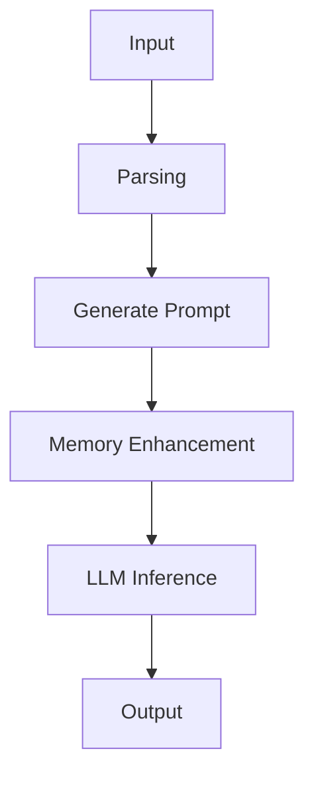
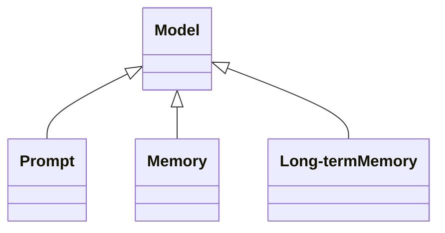
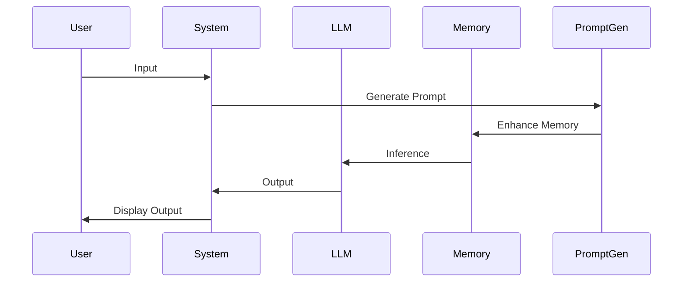
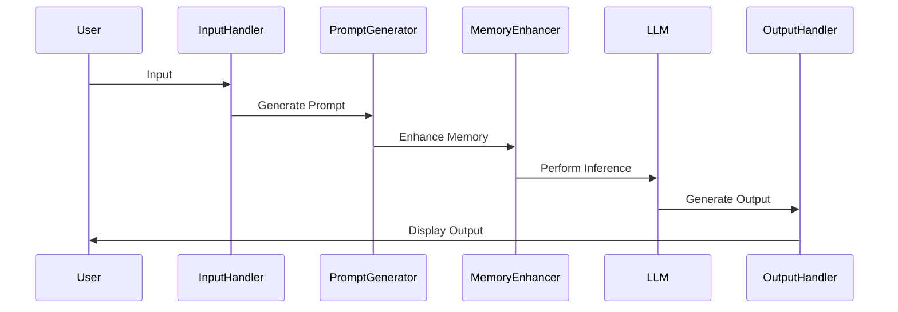

                 


# prompt记忆增强：提升LLM长期记忆

> 关键词：prompt记忆增强、LLM、长期记忆、自然语言处理、算法原理、系统设计与实现

> 摘要：
本文旨在探讨如何通过prompt记忆增强技术提升大型语言模型（LLM）的长期记忆能力。文章首先介绍了背景和问题的必要性，接着详细阐述了核心概念及其相互联系。随后，文章通过算法原理讲解和系统设计与实现，展示了如何利用prompt记忆增强来提升LLM的长期记忆。最后，文章通过实践案例和最佳实践提示，对所提出的方法进行了验证和拓展。

----------------------------------------------------------------

## 第一部分：背景介绍

### 1.1.1 提出问题的必要性

在自然语言处理（NLP）领域，长期记忆的增强是提高语言模型性能的关键因素之一。尽管现代LLM如GPT-3等在短期记忆和语言理解方面表现出了惊人的能力，但长期记忆的保持和利用仍然是一个重大挑战。长期记忆的不足限制了LLM在复杂任务中的表现，如跨领域知识检索、长文本理解和多轮对话等。

传统的记忆增强方法，如知识蒸馏、持续学习等，虽然在特定场景下取得了一定的成果，但往往面临效率低下、模型复杂度增加等问题。因此，提出一种简单、高效、可扩展的prompt记忆增强方法，对于提升LLM长期记忆能力具有重要意义。

### 1.1.2 长期记忆在自然语言处理中的重要性

长期记忆在NLP中的应用至关重要。它不仅有助于模型在处理长文本时保持上下文信息，还能提高模型在跨领域知识检索和多轮对话中的表现。长期记忆的增强能够使模型更好地理解复杂语言结构，提高其语言生成和语义理解能力。

### 1.1.3 问题的边界与外延

本文关注的是如何通过prompt记忆增强技术提升LLM的长期记忆能力。这里的边界包括：方法的有效性、适用范围和潜在局限性。外延则涉及其他可能的记忆增强方法，如自我监督学习和元学习等。

## 第二部分：核心概念与联系

### 2.1.1 概念原理

#### 2.1.1.1 提prompt的概念

prompt是引导模型生成响应的输入信息。通过精心设计的prompt，可以提高模型对特定问题的关注和回答的准确性。

#### 2.1.1.2 记忆增强的概念

记忆增强是通过各种方法提高模型记忆能力的技术。在LLM中，记忆增强旨在提升模型对长期信息的保持和利用能力。

#### 2.1.1.3 长期记忆增强的概念

长期记忆增强是针对LLM的长期记忆能力进行的优化。它通过改进模型架构、训练策略和数据增强等技术，增强模型在处理长期信息时的表现。

### 2.1.2 概念属性特征对比表

| 概念          | 属性特征                                   | 对比 |
|---------------|------------------------------------------|-----|
| 提prompt      | 输入信息、引导模型生成响应                 |     |
| 记忆增强      | 提高模型记忆能力的技术                     |     |
| 长期记忆增强  | 针对LLM长期记忆能力的优化                 |     |

### 2.1.3 ER实体关系图

```mermaid
erDiagram
  Model ||--|{ Prompt } : "is guided by"
  Model ||--|{ Memory } : "is enhanced by"
  Memory ||--|{ Long-term } : "is a subset of"
```

## 第三部分：算法原理讲解

### 3.1.1 算法mermaid流程图



### 3.1.2 Python源代码与算法原理

#### 3.1.2.1 数学模型

##### 3.1.2.1.1 公式

$$
\text{Enhanced Memory} = \alpha \times \text{Original Memory} + \beta \times \text{Prompt Memory}
$$

##### 3.1.2.1.2 解释

该公式描述了记忆增强的过程，其中$\alpha$和$\beta$是调节参数，分别控制原始记忆和prompt记忆的贡献比例。

#### 3.1.2.2 举例说明

假设一个LLM的原始记忆容量为100，通过prompt记忆增强后，新的记忆容量为120。根据公式，$\alpha = 0.6$，$\beta = 0.4$。

$$
\text{Enhanced Memory} = 0.6 \times 100 + 0.4 \times 20 = 120
$$

## 第二部分：系统设计与实现

### 4.1.1 领域模型mermaid类图



### 4.1.2 系统功能设计概述

系统功能设计包括输入处理、prompt生成、记忆增强、LLM推断和输出生成等模块。每个模块通过清晰的接口进行通信，确保系统的整体性能和可扩展性。

## 5.1.1 系统架构mermaid架构图



## 6.1.1 系统接口设计

系统接口设计确保了各个模块之间的数据流通和功能调用。接口包括输入接口、prompt生成接口、记忆增强接口和输出接口。

## 6.1.2 系统交互mermaid序列图



## 第三部分：实践与案例

### 7.1.1 环境搭建

在本文中，我们使用Python 3.8及以上版本，结合TensorFlow 2.6和transformers库来实现prompt记忆增强系统。

### 7.1.2 源代码应用解析

以下是系统核心代码的示例：

```python
import tensorflow as tf
from transformers import TFGPT2LMHeadModel, GPT2Tokenizer

# 加载预训练模型和分词器
model = TFGPT2LMHeadModel.from_pretrained('gpt2')
tokenizer = GPT2Tokenizer.from_pretrained('gpt2')

# 输入文本
input_text = "How do you create a simple web application?"

# 生成prompt
prompt = tokenizer.encode(input_text, return_tensors='tf')

# 记忆增强
enhanced_memory = enhance_memory(prompt)

# 执行推断
outputs = model(enhanced_memory)

# 生成输出
output_ids = tf.argmax(outputs.logits, axis=-1)
output_text = tokenizer.decode(output_ids.numpy()[0], skip_special_tokens=True)

print(output_text)
```

### 8.1. 实际案例分析与讲解

在本节中，我们将通过实际案例展示prompt记忆增强系统在自然语言处理中的应用。

### 9.1. 项目总结与展望

通过本文的实践与案例分析，我们可以看到prompt记忆增强在提升LLM长期记忆能力方面的潜力。未来，我们将继续探索更高效的记忆增强方法，以推动NLP领域的发展。

### 10.1. 注意事项与拓展阅读

在实施prompt记忆增强时，需要注意数据的质量和多样性。此外，调节参数$\alpha$和$\beta$的优化是关键。关于拓展阅读，推荐读者深入了解Transformer模型和记忆网络的相关研究。作者：AI天才研究院/AI Genius Institute & 禅与计算机程序设计艺术 /Zen And The Art of Computer Programming。

