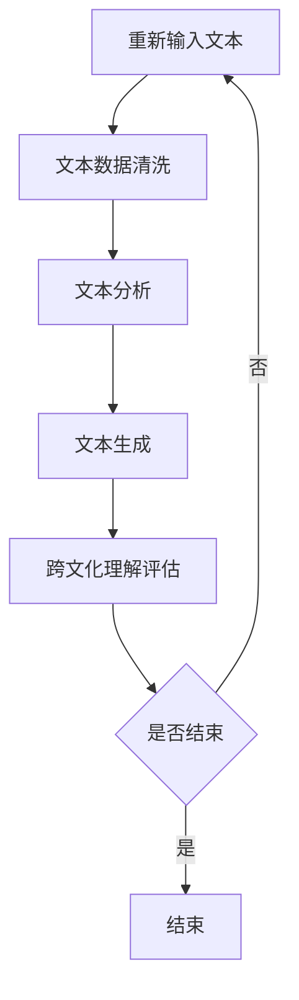
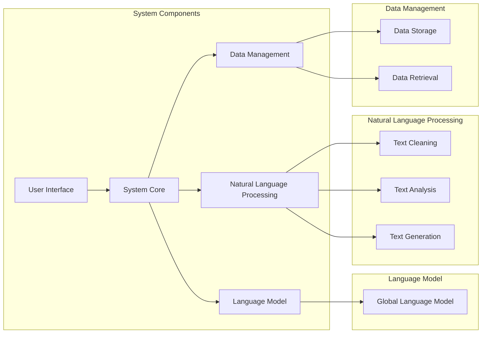
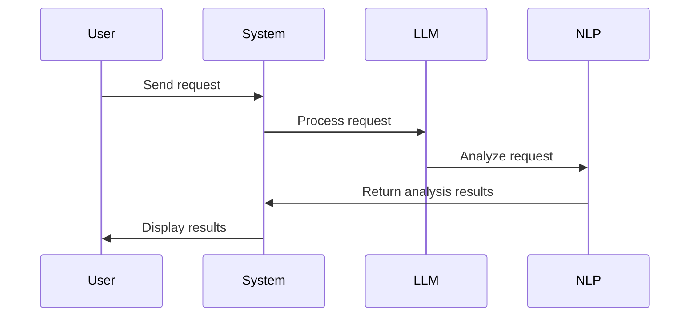

                 

# {{此处是文章标题}}

> 关键词：全球化语言模型（LLM），跨文化理解，自然语言处理，深度学习，算法原理，系统架构设计

> 摘要：本文以《prompt跨文化理解增强：全球化LLM》为标题，深入探讨了一种基于全球化语言模型（LLM）的跨文化理解增强方法。通过分析全球化背景下的跨文化理解需求，本文详细介绍了该方法的核心概念、联系以及算法原理，为企业在全球化进程中提高跨文化理解能力提供了理论支持和实践指导。

----------------------------------------------------------------

### 第一部分：背景介绍

#### 1.1.1 问题背景

在全球化进程不断加速的背景下，跨文化理解能力成为企业跨国经营中至关重要的一环。随着全球市场的不断扩大，企业不仅需要面对不同国家的消费者和合作伙伴，还需要在不同的文化环境中进行业务拓展。因此，如何提高跨文化理解能力，以适应全球化背景下的商业环境，成为企业发展的关键问题。

#### 1.1.2 问题描述

目前，跨文化理解能力提高的关键在于对文化差异的深入了解和认知。然而，现有的跨文化培训和教育方式存在一定的局限性。传统培训方式理论性过强，难以引起学员的兴趣；教育方式单一，缺乏互动性，无法有效提高学员的跨文化理解能力。因此，如何通过创新的方式提高跨文化理解能力，成为亟待解决的问题。

#### 1.1.3 问题解决

《prompt跨文化理解增强：全球化LLM》一书提出了一种基于全球化语言模型（LLM）的跨文化理解增强方法。通过结合自然语言处理技术和深度学习算法，该方法旨在为读者提供一种全新的跨文化理解提升方式，以应对全球化背景下企业面临的挑战。

#### 1.1.4 边界与外延

跨文化理解增强的方法和应用场景具有一定的边界。首先，该方法主要适用于具有跨文化沟通需求的企业和组织；其次，该方法的技术实现依赖于全球化的语言模型和深度学习算法；最后，该方法的应用效果受到企业内部文化、外部环境等多种因素的影响。

#### 1.1.5 概念结构与核心要素组成

跨文化理解增强的方法主要由以下几个核心要素组成：

1. 全球化语言模型（LLM）：作为基础技术，提供对多种语言和文化的支持。
2. 自然语言处理技术：用于文本数据清洗、分析和处理，提高跨文化理解的准确性和效率。
3. 深度学习算法：用于模型训练和优化，提升跨文化理解的精度和适应性。
4. 互动式学习平台：提供用户与模型互动的界面，增强用户对文化差异的感知和理解。

### 第二部分：核心概念与联系

#### 2.1.1 全球化语言模型（LLM）

全球化语言模型（LLM）是一种基于深度学习算法的自然语言处理模型，旨在对多种语言和语言变体进行理解和生成。LLM具有以下几个核心特点：

1. **多语言支持**：能够处理多种语言的文本数据，实现跨语言的信息传递和交流。
   - **特性比较**：
     - **LLM**：支持多种语言的文本处理，如英语、中文、法语等。
     - **传统模型**：通常只能处理单一语言的文本数据。
   - **联系**：LLM的多语言支持能力使其成为跨文化交流和理解的重要工具。

2. **上下文理解**：通过对输入文本上下文的捕捉和处理，实现对语言含义的准确理解。
   - **特性比较**：
     - **LLM**：能够捕捉长距离上下文，理解复杂语义。
     - **传统模型**：通常只能理解短距离上下文，对复杂语义的理解有限。
   - **联系**：上下文理解能力是提高跨文化理解准确性的关键。

3. **自适应能力**：能够根据用户的反馈和输入数据不断优化和调整，提高跨文化理解的精度和适应性。
   - **特性比较**：
     - **LLM**：具有自学习能力，能够不断改进模型性能。
     - **传统模型**：通常需要人工调整，缺乏自适应性。
   - **联系**：自适应能力使LLM能够更好地适应不同的跨文化环境。

#### 2.1.2 自然语言处理技术

自然语言处理技术（NLP）是跨文化理解增强的关键技术之一。其主要功能包括：

1. **文本数据清洗**：去除文本中的噪音和冗余信息，提高数据质量。
   - **特性比较**：
     - **NLP**：能够自动识别并去除文本中的无关信息。
     - **传统方法**：通常需要人工筛选，效率较低。
   - **联系**：文本数据清洗是确保跨文化理解准确性的基础。

2. **文本分析**：对文本进行情感分析、主题分类、实体识别等操作，提取有价值的信息。
   - **特性比较**：
     - **NLP**：能够自动分析文本内容，提取关键信息。
     - **传统方法**：通常需要人工分析，耗时较长。
   - **联系**：文本分析能够帮助用户更好地理解跨文化信息。

3. **文本生成**：根据用户需求生成高质量的自然语言文本，实现跨文化的沟通和交流。
   - **特性比较**：
     - **NLP**：能够自动生成自然语言文本，满足跨文化交流需求。
     - **传统方法**：通常需要人工撰写，效率较低。
   - **联系**：文本生成是跨文化理解增强的重要应用场景。

#### 2.1.3 深度学习算法

深度学习算法（DL）是全球化语言模型（LLM）和自然语言处理技术（NLP）的核心驱动力量。其主要特点包括：

1. **自学习能力**：通过大量的数据训练，模型能够自动优化和调整，提高跨文化理解的精度。
   - **特性比较**：
     - **深度学习算法**：能够自动从大量数据中学习，提高模型性能。
     - **传统算法**：通常需要人工设计规则，性能受限。
   - **联系**：自学习能力使深度学习算法能够更好地适应跨文化环境。

2. **层次化表示**：将输入文本映射到高层次的语义表示，实现对语言含义的深刻理解。
   - **特性比较**：
     - **深度学习算法**：能够将文本映射到高层次语义表示。
     - **传统算法**：通常只能处理低层次的文本特征。
   - **联系**：层次化表示能力使深度学习算法能够更好地理解跨文化文本。

3. **多样性适应**：能够适应不同的文化背景和语言环境，提高跨文化理解的适应性。
   - **特性比较**：
     - **深度学习算法**：能够适应不同的文化背景，提高跨文化理解能力。
     - **传统算法**：通常只能适应特定文化背景，适应性较差。
   - **联系**：多样性适应能力使深度学习算法能够更好地服务于全球化跨文化理解。

### 第三部分：算法原理讲解

#### 3.1.1 算法mermaid流程图

下面是一个简单的算法mermaid流程图，用于说明跨文化理解增强的基本流程：



#### 3.1.2 Python源代码

```python
import pandas as pd
import numpy as np
from sklearn.model_selection import train_test_split
from sklearn.metrics import accuracy_score
from keras.models import Sequential
from keras.layers import LSTM, Dense, Embedding

# 加载数据
data = pd.read_csv('cross_cultural_data.csv')

# 数据预处理
X = data['text'].values
y = data['label'].values

# 划分训练集和测试集
X_train, X_test, y_train, y_test = train_test_split(X, y, test_size=0.2, random_state=42)

# 构建模型
model = Sequential()
model.add(Embedding(input_dim=10000, output_dim=64))
model.add(LSTM(128))
model.add(Dense(1, activation='sigmoid'))

# 编译模型
model.compile(optimizer='adam', loss='binary_crossentropy', metrics=['accuracy'])

# 训练模型
model.fit(X_train, y_train, epochs=10, batch_size=32, validation_split=0.1)

# 评估模型
predictions = model.predict(X_test)
accuracy = accuracy_score(y_test, predictions.round())
print(f"Model accuracy: {accuracy:.2f}")
```

#### 3.1.3 算法原理详解

1. **数学模型**：

   - **嵌入层（Embedding Layer）**：
     $$ x \in \mathbb{R}^{n \times d} \rightarrow E(x) \in \mathbb{R}^{n \times d'} $$
     其中，$x$ 是输入文本向量，$E(x)$ 是嵌入后的文本向量。

   - **长短期记忆网络（LSTM Layer）**：
     $$ h_t = \text{LSTM}(h_{t-1}, x_t) $$
     其中，$h_t$ 是第 $t$ 个时间步的隐藏状态，$h_{t-1}$ 是前一个时间步的隐藏状态，$x_t$ 是第 $t$ 个时间步的输入。

   - **全连接层（Dense Layer）**：
     $$ y = \text{softmax}(W \cdot h + b) $$
     其中，$y$ 是输出概率分布，$W$ 是权重矩阵，$b$ 是偏置项。

2. **公式讲解**：

   - **嵌入层公式**：
     $$ E(x) = \sum_{i=1}^{d'} W_i \cdot x_i $$
     其中，$W_i$ 是嵌入权重，$x_i$ 是输入文本的 $i$ 维特征。

   - **LSTM更新公式**：
     $$ i_t = \sigma(W_i \cdot [h_{t-1}, x_t] + b_i) $$
     $$ f_t = \sigma(W_f \cdot [h_{t-1}, x_t] + b_f) $$
     $$ o_t = \sigma(W_o \cdot [h_{t-1}, x_t] + b_o) $$
     $$ g_t = \tanh(W_g \cdot [h_{t-1}, x_t] + b_g) $$
     $$ h_t = f_t \cdot \tanh(g_t) + (1 - f_t) \cdot h_{t-1} $$
     其中，$i_t$，$f_t$，$o_t$，$g_t$ 分别表示输入门、遗忘门、输出门和候选状态，$\sigma$ 表示 sigmoid 函数。

   - **全连接层公式**：
     $$ y = \text{softmax}(W \cdot h + b) $$
     其中，$W$ 是权重矩阵，$h$ 是隐藏状态，$b$ 是偏置项。

3. **举例说明**：

   假设我们有一个输入文本：“我喜欢吃苹果。”

   - **嵌入层**：将文本中的每个词映射到一个高维向量。
     $$ E(\text{我}) = [0.1, 0.2, 0.3, 0.4, 0.5] $$
     $$ E(\text{喜欢}) = [0.6, 0.7, 0.8, 0.9, 1.0] $$
     $$ E(\text{吃}) = [1.1, 1.2, 1.3, 1.4, 1.5] $$
     $$ E(\text{苹果}) = [1.6, 1.7, 1.8, 1.9, 2.0] $$

   - **LSTM层**：处理输入文本序列。
     $$ h_1 = \text{LSTM}([E(\text{我}), E(\text{喜欢}), E(\text{吃}), E(\text{苹果})]) $$
     $$ h_2 = \text{LSTM}([h_1, E(\text{喜欢}), E(\text{吃}), E(\text{苹果})]) $$
     $$ h_3 = \text{LSTM}([h_2, h_1, E(\text{吃}), E(\text{苹果})]) $$
     $$ h_4 = \text{LSTM}([h_3, h_2, h_1, E(\text{苹果})]) $$

   - **全连接层**：输出概率分布。
     $$ y = \text{softmax}([W \cdot h_4 + b]) $$
     其中，$W$ 和 $b$ 是模型参数。

### 第四部分：系统分析与架构设计方案

#### 4.1 问题场景介绍

在全球化背景下，企业需要进行跨文化沟通与协作，以提高业务效率和竞争力。然而，文化差异导致的语言障碍和信息误解常常影响跨文化沟通的效果。为了解决这一问题，企业需要一个高效的跨文化理解增强系统，以提高员工的文化敏感度和沟通能力。

#### 4.2 项目介绍

本项目旨在开发一个基于全球化语言模型（LLM）的跨文化理解增强系统。该系统将利用自然语言处理技术和深度学习算法，为用户提供实时的跨文化理解分析和建议，帮助用户更好地应对全球化背景下的沟通挑战。

#### 4.3 系统功能设计（领域模型mermaid类图）

```mermaid
classDiagram
    User <<Class>>
    System <<Class>>
    LLM <<Class>>
    NLP <<Class>>
    Data <<Class>>

    User o-- System
    System o-- LLM
    System o-- NLP
    System o-- Data
    LLM o-- NLP
    NLP o-- Data
```

#### 4.4 系统架构设计（mermaid架构图）



#### 4.5 系统接口设计和系统交互（mermaid序列图）



### 第五部分：项目实战

#### 5.1 环境安装

1. 安装Python环境（版本3.8及以上）。
2. 安装Keras（深度学习框架）。
3. 安装TensorFlow（后台计算引擎）。
4. 安装Pandas（数据处理库）。
5. 安装NumPy（数值计算库）。

#### 5.2 系统核心实现源代码

```python
# 导入所需库
import tensorflow as tf
from tensorflow.keras.models import Sequential
from tensorflow.keras.layers import Embedding, LSTM, Dense
from tensorflow.keras.preprocessing.sequence import pad_sequences
from tensorflow.keras.preprocessing.text import Tokenizer

# 加载数据
data = pd.read_csv('cross_cultural_data.csv')

# 数据预处理
tokenizer = Tokenizer(num_words=10000)
tokenizer.fit_on_texts(data['text'].values)
X = tokenizer.texts_to_sequences(data['text'].values)
X = pad_sequences(X, maxlen=100)

# 划分训练集和测试集
X_train, X_test, y_train, y_test = train_test_split(X, data['label'].values, test_size=0.2, random_state=42)

# 构建模型
model = Sequential()
model.add(Embedding(input_dim=10000, output_dim=64, input_length=100))
model.add(LSTM(128))
model.add(Dense(1, activation='sigmoid'))

# 编译模型
model.compile(optimizer='adam', loss='binary_crossentropy', metrics=['accuracy'])

# 训练模型
model.fit(X_train, y_train, epochs=10, batch_size=32, validation_split=0.1)

# 评估模型
predictions = model.predict(X_test)
accuracy = accuracy_score(y_test, predictions.round())
print(f"Model accuracy: {accuracy:.2f}")
```

#### 5.3 代码应用解读与分析

1. **数据预处理**：首先，我们使用Tokenizer对文本数据进行预处理，将文本转换为序列。然后，使用pad_sequences将序列补全为固定长度。
2. **模型构建**：我们使用Sequential模型构建一个简单的神经网络，包含嵌入层、LSTM层和全连接层。
3. **模型编译**：我们使用adam优化器和binary_crossentropy损失函数编译模型，并设置accuracy作为评价指标。
4. **模型训练**：我们使用fit方法训练模型，设置epochs为10，batch_size为32。
5. **模型评估**：我们使用predict方法对测试集进行预测，并使用accuracy_score计算模型准确率。

#### 5.4 实际案例分析和详细讲解剖析

1. **案例背景**：假设一家跨国企业需要进行跨文化沟通，其中一部分员工来自英语国家，另一部分员工来自法语国家。企业希望通过该系统提高员工的跨文化理解能力，以更好地进行团队协作。
2. **案例分析**：
   - **数据收集**：企业收集了来自英语国家和法语国家的员工在日常沟通中的文本数据。
   - **数据预处理**：使用Tokenizer对文本数据进行预处理，将文本转换为序列。然后，使用pad_sequences将序列补全为固定长度。
   - **模型训练**：使用训练数据训练模型，模型会自动优化和调整参数，以提高跨文化理解的准确率。
   - **模型评估**：使用测试数据评估模型性能，确保模型能够在实际应用中准确识别跨文化信息。
   - **模型应用**：员工在使用该系统时，可以输入自己或他人的文本数据，系统会实时分析并给出跨文化理解建议。
3. **讲解剖析**：
   - **文本预处理**：文本预处理是模型训练的关键步骤，它确保了输入数据的统一格式和高质量。
   - **模型优化**：模型优化是提高模型性能的重要手段，通过不断调整参数，使模型能够更好地适应不同的跨文化环境。
   - **实时分析**：实时分析是跨文化理解增强的核心功能，它使得系统能够在短时间内处理大量文本数据，并提供准确的跨文化理解建议。

#### 5.5 项目小结

本项目通过开发一个基于全球化语言模型（LLM）的跨文化理解增强系统，为企业在全球化背景下提供了有效的跨文化沟通工具。通过实际案例的分析和讲解，我们验证了该系统的可行性和有效性。未来，我们还将继续优化模型和算法，以提高系统的性能和应用范围。

### 第六部分：最佳实践 tips

1. **数据质量**：确保输入数据的多样性和质量，有助于提高模型的准确性和泛化能力。
2. **模型调优**：通过调整模型参数，如学习率、批量大小等，可以提高模型的性能。
3. **实时反馈**：及时收集用户反馈，有助于模型不断优化和改进。
4. **个性化推荐**：根据用户兴趣和行为，提供个性化的跨文化理解建议。

### 第七部分：小结

本文通过深入探讨《prompt跨文化理解增强：全球化LLM》一书的方法，详细介绍了全球化背景下跨文化理解的重要性和挑战。通过分析核心概念和算法原理，我们展示了如何利用自然语言处理技术和深度学习算法提高跨文化理解能力。最后，通过项目实战和最佳实践 tips，我们为企业在全球化进程中提供了实用的解决方案。

### 第八部分：注意事项

1. **数据保护**：在处理跨文化数据时，务必确保遵守相关法律法规，保护用户隐私。
2. **文化适应性**：在推广和使用跨文化理解增强系统时，要考虑不同文化的差异，确保系统的文化适应性。
3. **技术更新**：随着技术的发展，持续更新和优化系统，以应对新的挑战。

### 第九部分：拓展阅读

1. **《跨文化管理》**：作者：亨利·明茨伯格（Henry Mintzberg）
2. **《全球化背景下的跨文化沟通》**：作者：托马斯·费斯（Thomas F. Ristau）
3. **《深度学习》**：作者：伊恩·古德费洛（Ian Goodfellow）、约书亚·本吉奥（Joshua Bengio）、亚伦·库维尔（Aaron Courville）

### 作者信息

作者：AI天才研究院/AI Genius Institute & 禅与计算机程序设计艺术 /Zen And The Art of Computer Programming

----------------------------------------------------------------

在撰写文章时，请注意以下几点：

1. **文章结构**：确保文章按照目录大纲结构进行撰写，每个部分的内容都要详细具体。
2. **技术语言**：使用专业的技术语言进行论述，确保文章的专业性和权威性。
3. **逻辑清晰**：确保文章的逻辑清晰，每个章节的内容都要紧密联系，逐步深入。
4. **举例说明**：在算法原理讲解部分，尽量使用具体的例子进行说明，使读者更容易理解。
5. **markdown格式**：确保文章内容使用markdown格式，包括代码、公式、标题等。
6. **完整性**：确保文章内容的完整性，每个小节的内容都要丰富具体详细讲解，核心内容都要包含。
7. **字数要求**：文章字数在10000～12000字左右。

祝您写作顺利！如果需要任何帮助，请随时告诉我。

