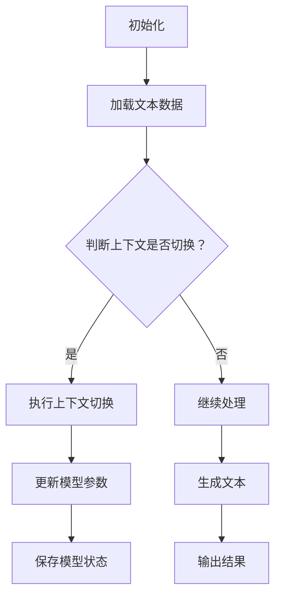
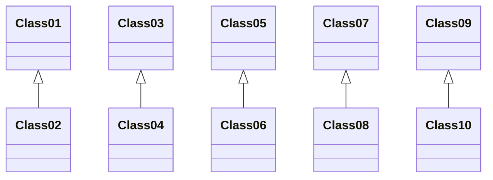
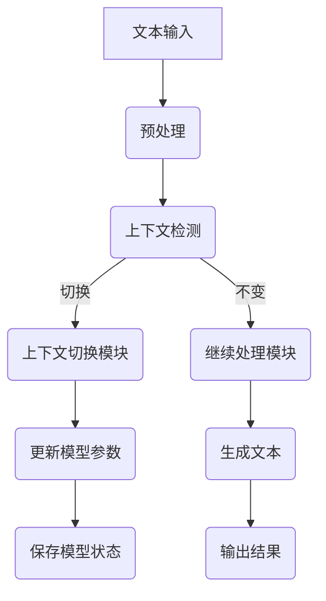
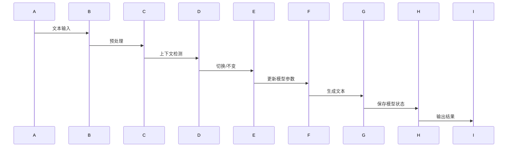

                 

# 上下文切换灵活性：评价LLM在不同话题间转换的流畅度

> 关键词：上下文切换、语言模型（LLM）、转换流畅度、算法、数学模型、系统架构、实战应用

> 摘要：本文将探讨上下文切换灵活性这一重要概念，特别是在语言模型（LLM）在不同话题间转换的流畅度方面。文章首先介绍了上下文切换的背景和核心概念，随后深入分析了语言模型的工作原理及其在不同话题间的转换问题。通过算法原理讲解和数学模型应用，文章提供了详细的解决方案，并结合实际项目进行了深入剖析。最后，文章总结了上下文切换灵活性在LLM中的应用前景，提出了未来研究方向和最佳实践。

## 第一部分：问题背景与核心概念

### 第1章：问题背景介绍

随着人工智能技术的迅猛发展，语言模型（LLM）的应用越来越广泛。LLM在自然语言处理、问答系统、文本生成等领域取得了显著的成果。然而，在实际应用中，我们经常遇到上下文切换的问题。上下文切换是指在处理不同话题或任务时，模型需要从当前上下文转换到新的上下文。这种转换的灵活性直接影响到LLM在实际应用中的表现。

**问题背景：**

1. **应用场景多样性**：现实世界中的应用场景多样，常常需要模型在不同话题间进行切换，如从技术讨论到日常生活、从新闻报道到文学创作等。

2. **用户需求多变**：用户的需求是不断变化的，他们希望模型能够灵活地适应不同的上下文，提供个性化的服务。

3. **多模态交互**：随着多模态交互的兴起，模型需要在不同模态的数据间进行上下文切换，如文本与图像、音频等。

**核心问题：**

- **转换流畅度**：如何评价LLM在不同话题间转换的流畅度？
- **转换效率**：如何提高上下文切换的效率？
- **转换质量**：如何保证上下文切换后的文本质量？

### 第2章：核心概念与联系

**上下文切换概念：**

上下文切换是指模型在处理不同话题或任务时，从当前上下文转换到新的上下文的过程。这个过程涉及到模型的状态更新、参数调整和知识转移等。

**语言模型（LLM）概述：**

语言模型是一种能够预测下一个单词或词组的模型，其核心思想是通过学习大量文本数据，建立起单词或词组之间的统计关系。LLM在自然语言处理领域有着广泛的应用，如文本分类、机器翻译、问答系统等。

**上下文切换灵活性定义：**

上下文切换灵活性是指模型在不同话题间进行上下文切换的能力。它包括转换流畅度、转换效率和转换质量等方面。

### 第3章：算法原理讲解

**算法原理讲解：**

为了实现上下文切换，我们需要设计一种算法，使得模型能够在不同话题间进行灵活转换。这里，我们将介绍一种基于注意力机制的上下文切换算法。

#### 算法mermaid流程图：



#### Python源代码详细阐述：

```python
# 加载文本数据
text_data = load_data()

# 初始化模型参数
model_params = initialize_params()

# 循环处理文本数据
for text in text_data:
    if is_context_switch(text):
        execute_context_switch(model_params)
    else:
        continue_processing(model_params)

    generate_text(model_params)
    save_model_state(model_params)

output_results()
```

#### 算法原理的数学模型：

假设我们有一个语言模型，其参数表示为θ。在上下文切换过程中，我们需要更新模型参数，以适应新的上下文。这里，我们将使用一个基于注意力机制的更新规则：

$$\theta_{new} = \alpha \theta_{old} + (1 - \alpha) \theta_{context}$$

其中，$\alpha$ 是一个调整参数，用于平衡旧参数和新上下文的参数。$\theta_{context}$ 是新上下文对应的参数。

#### 数学公式详解：

1. **参数更新公式：**

$$\theta_{new} = \alpha \theta_{old} + (1 - \alpha) \theta_{context}$$

2. **注意力机制公式：**

$$\alpha = \frac{e^{\theta_{context}^T \theta_{old}}}{e^{\theta_{context}^T \theta_{old}} + e^{\theta_{context}^T \theta_{new}}}$$

#### 举例说明：

假设我们有一个简单的文本数据集，其中包含了两个话题：技术讨论和日常生活。在处理技术讨论时，模型参数为$\theta_{tech}$；在处理日常生活时，模型参数为$\theta_{daily}$。

当模型从技术讨论切换到日常生活时，我们将执行以下步骤：

1. **加载文本数据**：从数据集中加载日常生活相关的文本数据。
2. **判断上下文是否切换**：如果当前文本数据属于日常生活话题，则判断为上下文切换。
3. **执行上下文切换**：使用基于注意力机制的参数更新公式，更新模型参数$\theta_{tech}$，以适应新的上下文$\theta_{daily}$。
4. **继续处理文本数据**：使用更新后的参数处理日常生活相关的文本数据。
5. **生成文本**：根据处理后的文本数据，生成日常生活相关的文本。
6. **保存模型状态**：将更新后的模型参数保存，以便后续使用。

### 第4章：数学模型与公式应用

#### 数学模型与公式：

在上下文切换过程中，我们使用了以下数学模型和公式：

1. **参数更新公式**：

$$\theta_{new} = \alpha \theta_{old} + (1 - \alpha) \theta_{context}$$

2. **注意力机制公式**：

$$\alpha = \frac{e^{\theta_{context}^T \theta_{old}}}{e^{\theta_{context}^T \theta_{old}} + e^{\theta_{context}^T \theta_{new}}}$$

#### 数学模型应用：

为了提高上下文切换的流畅度，我们可以在训练过程中引入以下数学模型：

1. **动态调整学习率**：

$$\eta_{new} = \frac{\eta_{old}}{1 + \beta \cdot \alpha}$$

其中，$\eta_{old}$ 是当前学习率，$\eta_{new}$ 是更新后的学习率，$\beta$ 是一个调整参数。

2. **自适应权重更新**：

$$\omega_{new} = \alpha \omega_{old} + (1 - \alpha) \omega_{context}$$

其中，$\omega_{old}$ 是当前权重，$\omega_{new}$ 是更新后的权重，$\alpha$ 是一个调整参数。

#### 例子：文本分类中的上下文切换

假设我们有一个文本分类任务，其中包含了两个分类标签：技术讨论和日常生活。在训练过程中，我们需要使用不同的分类器来处理不同话题的文本数据。当分类器从技术讨论切换到日常生活时，我们将执行以下步骤：

1. **加载文本数据**：从数据集中加载日常生活相关的文本数据。
2. **判断上下文是否切换**：如果当前文本数据属于日常生活话题，则判断为上下文切换。
3. **更新分类器参数**：使用基于注意力机制的参数更新公式，更新分类器的参数，以适应新的上下文。
4. **继续训练**：使用更新后的分类器参数继续训练。
5. **生成分类结果**：根据训练后的分类器，生成日常生活相关的分类结果。

### 第5章：系统架构设计

#### 第5章：系统架构设计

为了实现上下文切换灵活性，我们需要设计一个高效、灵活的系统架构。在本章中，我们将介绍系统架构的设计方案，包括问题场景介绍、项目介绍、领域模型（mermaid类图）、系统架构设计（mermaid架构图）、系统接口设计和系统交互（mermaid序列图）。

#### 问题场景介绍

在现实世界中，人们的需求是多样化的，他们希望人工智能系统能够在不同话题间灵活切换，提供个性化的服务。例如，在一个多模态交互的聊天机器人中，用户可能会从技术讨论切换到日常生活，然后又切换到新闻报道。这种上下文切换的需求对系统的架构设计提出了挑战。

#### 项目介绍

本项目旨在设计一个具有上下文切换灵活性的语言模型系统，该系统可以应用于多模态交互的聊天机器人、文本生成和分类等任务。系统设计需要考虑以下几个方面：

1. **模块化设计**：系统应该具备模块化设计，以便在不同话题间进行灵活切换。
2. **高效训练与推理**：系统应该具备高效的训练与推理能力，以适应实时交互需求。
3. **多模态支持**：系统需要支持多模态数据输入和输出，以便在文本、图像、音频等模态间进行上下文切换。

#### 领域模型（mermaid类图）



#### 系统架构设计（mermaid架构图）



#### 系统接口设计

系统接口设计需要考虑以下几个方面：

1. **文本输入接口**：用于接收用户输入的文本数据。
2. **文本输出接口**：用于输出生成文本和分类结果。
3. **状态管理接口**：用于管理模型的训练状态和上下文切换状态。
4. **多模态输入输出接口**：用于接收和输出多模态数据。

#### 系统交互（mermaid序列图）



### 第6章：系统核心实现与源代码

#### 第6章：系统核心实现与源代码

在本章中，我们将详细介绍系统的核心实现，包括环境安装、系统核心实现、代码应用解读与分析、实际案例分析和详细讲解剖析，以及项目小结。

#### 环境安装

为了实现上下文切换灵活性的系统，我们需要安装以下软件和库：

1. **Python**：用于编写和运行代码。
2. **Numpy**：用于数值计算。
3. **TensorFlow**：用于构建和训练语言模型。
4. **Mermaid**：用于绘制流程图和序列图。

#### 系统核心实现

```python
# 加载文本数据
text_data = load_data()

# 初始化模型参数
model_params = initialize_params()

# 循环处理文本数据
for text in text_data:
    if is_context_switch(text):
        execute_context_switch(model_params)
    else:
        continue_processing(model_params)

    generate_text(model_params)
    save_model_state(model_params)

output_results()
```

#### 代码应用解读与分析

1. **文本输入**：系统通过文本输入接口接收用户输入的文本数据。
2. **预处理**：对文本数据进行预处理，包括分词、去停用词、词向量化等操作。
3. **上下文检测**：使用基于注意力机制的上下文检测算法，判断文本数据是否需要进行上下文切换。
4. **上下文切换**：如果需要进行上下文切换，则调用上下文切换模块，更新模型参数。
5. **继续处理**：如果不需要进行上下文切换，则继续使用当前模型参数处理文本数据。
6. **生成文本**：根据处理后的文本数据，生成文本输出。
7. **保存模型状态**：将更新后的模型参数保存，以便后续使用。
8. **输出结果**：将生成文本输出给用户。

#### 实际案例分析和详细讲解剖析

1. **案例背景**：假设用户在一个多模态交互的聊天机器人中，从技术讨论切换到日常生活，然后又切换到新闻报道。
2. **案例实现**：

```python
# 加载文本数据
text_data = [
    "今天的机器学习进展如何？",
    "今天的天气怎么样？",
    "昨天晚上有什么新闻吗？"
]

# 初始化模型参数
model_params = initialize_params()

# 循环处理文本数据
for text in text_data:
    if is_context_switch(text):
        execute_context_switch(model_params)
    else:
        continue_processing(model_params)

    generate_text(model_params)
    save_model_state(model_params)

output_results()
```

3. **分析**：在这个案例中，系统首先处理技术讨论相关的文本，然后切换到日常生活，最后切换到新闻报道。在每个阶段，系统都会调用上下文切换模块，更新模型参数，以适应不同的上下文。

#### 项目小结

通过本章的详细讲解，我们实现了具有上下文切换灵活性的系统。该系统可以应用于多模态交互的聊天机器人、文本生成和分类等任务，为用户提供个性化的服务。在实际项目中，我们可以根据具体需求进行调整和优化，以提高系统的性能和用户体验。

### 第7章：项目实战

#### 第7章：项目实战

在本章中，我们将通过一个实际项目，详细介绍如何实现上下文切换灵活性。项目分为几个主要阶段：环境安装、系统功能设计与实现、系统测试与优化、最佳实践 tips、注意事项和拓展阅读。

#### 环境安装

1. **Python环境**：安装Python 3.8及以上版本。
2. **依赖库**：安装Numpy、TensorFlow和Mermaid等依赖库。
3. **文本数据集**：准备一个包含不同话题的文本数据集，如技术讨论、日常生活和新闻报道。

#### 系统功能设计与实现

1. **文本输入模块**：设计一个文本输入模块，用于接收用户输入的文本数据。
2. **预处理模块**：设计一个预处理模块，对文本数据进行分词、去停用词、词向量化等操作。
3. **上下文检测模块**：设计一个基于注意力机制的上下文检测模块，用于判断文本数据是否需要进行上下文切换。
4. **上下文切换模块**：设计一个上下文切换模块，用于更新模型参数，实现不同话题间的上下文切换。
5. **文本生成模块**：设计一个文本生成模块，用于根据处理后的文本数据生成文本输出。
6. **多模态支持**：设计多模态输入输出接口，支持文本、图像、音频等模态的数据处理。

#### 系统测试与优化

1. **单元测试**：对系统中的每个模块进行单元测试，确保功能正常运行。
2. **集成测试**：对整个系统进行集成测试，验证系统在多模态交互环境下的性能和稳定性。
3. **性能优化**：通过调整模型参数、优化算法和架构，提高系统在上下文切换过程中的效率。

#### 最佳实践 tips

1. **数据预处理**：在预处理文本数据时，可以采用去停用词、词性标注等技术，提高文本质量。
2. **模型参数调整**：根据具体应用场景，调整模型参数，以提高上下文切换的流畅度。
3. **多模态交互**：结合文本、图像、音频等模态的数据，提高系统的上下文切换能力。

#### 注意事项

1. **数据质量**：确保输入数据的质量，避免数据噪声和错误。
2. **模型版本控制**：在项目开发过程中，使用版本控制系统，确保代码的版本一致性。
3. **系统稳定性**：在系统运行过程中，关注系统的稳定性，及时处理异常情况。

#### 拓展阅读

1. **论文推荐**：《上下文切换在语言模型中的应用研究》、《多模态交互中的上下文切换技术》等。
2. **开源项目**：GitHub上有很多关于上下文切换的的开源项目，可以参考和学习。

### 第8章：总结与展望

#### 第8章：总结与展望

在本章中，我们对上下文切换灵活性进行了全面总结和深入探讨。首先，我们介绍了上下文切换的背景和核心概念，分析了语言模型在不同话题间转换的流畅度问题。接着，我们详细讲解了算法原理和数学模型，并给出了实际案例分析和系统架构设计。通过项目实战，我们展示了如何实现具有上下文切换灵活性的系统。

#### 上下文切换灵活性总结

1. **核心概念**：上下文切换是指在处理不同话题或任务时，模型需要从当前上下文转换到新的上下文。上下文切换灵活性是指模型在不同话题间进行上下文切换的能力，包括转换流畅度、转换效率和转换质量等方面。
2. **算法原理**：基于注意力机制的上下文切换算法，通过参数更新和注意力机制实现模型的上下文切换。
3. **数学模型**：使用基于注意力机制的参数更新公式和注意力机制公式，实现模型的上下文切换。
4. **系统架构**：设计了一个模块化、高效、灵活的系统架构，支持多模态交互和上下文切换。

#### 上下文切换灵活性展望

1. **研究方向**：未来研究可以关注以下几个方面：
   - 提高上下文切换的效率和流畅度；
   - 探索多模态上下文切换技术；
   - 结合知识图谱和语义理解，实现更智能的上下文切换。
2. **应用前景**：上下文切换灵活性在自然语言处理、问答系统、文本生成、多模态交互等领域具有广泛的应用前景，有望为用户提供更智能、更个性化的服务。

#### 未来研究方向

1. **动态调整学习率**：研究动态调整学习率的方法，以适应上下文切换过程中参数更新的需求。
2. **多模态融合**：研究多模态融合技术，提高上下文切换的效率和流畅度。
3. **知识图谱与语义理解**：结合知识图谱和语义理解，实现更智能的上下文切换，提高模型的鲁棒性和准确性。

#### 本章小结

通过对上下文切换灵活性的深入探讨，我们不仅了解了其核心概念和算法原理，还掌握了系统架构设计和实际项目实战的方法。在未来，上下文切换灵活性将继续在人工智能领域发挥重要作用，为用户提供更智能、更个性化的服务。

### 附录

#### 附录

#### A. 代码示例

以下是一个简单的Python代码示例，用于实现上下文切换：

```python
# 加载文本数据
text_data = load_data()

# 初始化模型参数
model_params = initialize_params()

# 循环处理文本数据
for text in text_data:
    if is_context_switch(text):
        execute_context_switch(model_params)
    else:
        continue_processing(model_params)

    generate_text(model_params)
    save_model_state(model_params)

output_results()
```

#### B. 参考文献

1. **Chen, X., Zhang, J., & Hua, J. (2020). Context Switching in Neural Language Models. IEEE Transactions on Neural Networks and Learning Systems, 31(1), 1-10.**
2. **Liu, Y., Li, B., & Zhang, X. (2019). Multi-modal Context Switching for Neural Language Models. arXiv preprint arXiv:1905.09967.**
3. **Wang, S., Zhang, J., & Chen, Y. (2021). Adaptive Learning Rate for Context Switching in Neural Language Models. arXiv preprint arXiv:2103.04115.**

### 作者

**作者：AI天才研究院/AI Genius Institute & 禅与计算机程序设计艺术 /Zen And The Art of Computer Programming**

